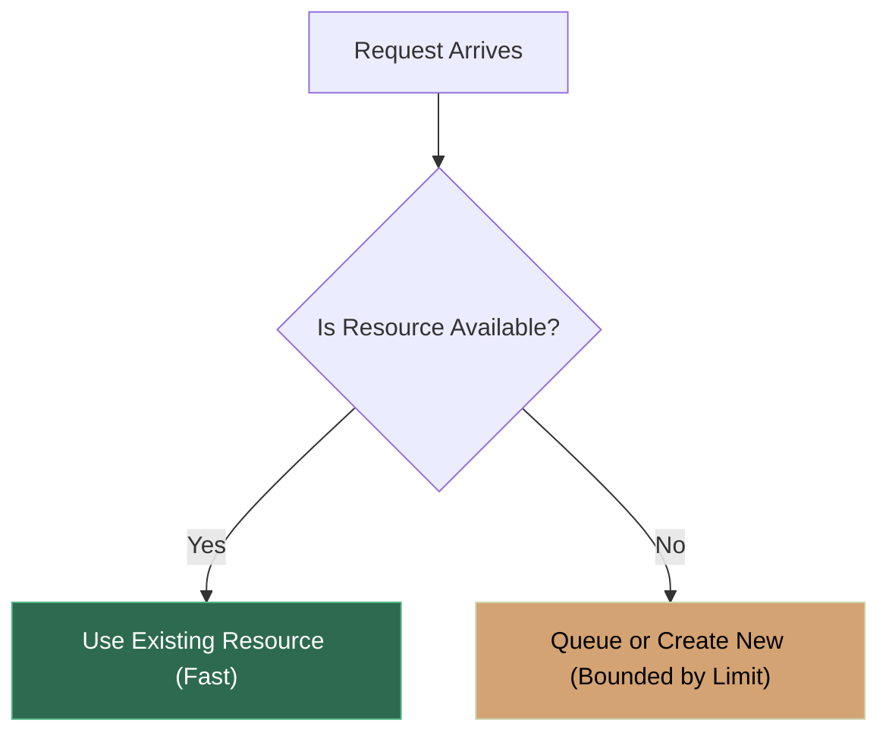

# Beginner Concept Explainer Skill

Use this skill whenever the user asks to explain a concept, keyword, architecture pattern, query, or technical topic, or when asked for beginner-friendly breakdowns with analogies and diagrams.

## Core Directives

1. **Keep it Beginner-Friendly & Intuitive**:
   - Strip away unnecessary academic jargon.
   - Ground the concept with an everyday, real-world physical analogy (e.g., restaurants, libraries, traffic, power sockets).

2. **Proportional Depth (Don't Overcomplicate Small Concepts)**:
   - **Small/Single Concepts** (e.g., *pool max size*, *foreign key*, *memoization*, *debounce*, *ReLU*): Keep the explanation brief, crisp, and focused. Do not go unnecessarily deep into assembly, compiler internals, or advanced edge cases.
   - **System/Architecture Concepts** (e.g., *RAG pipeline*, *OAuth2 flow*, *Transformer attention*): Structure into clear, progressive stages.
   - **Tooling & DevOps Concepts** (e.g., *Git*, *Linux CLI*, *Docker*, *NGINX*, *Cloud VMs*): Provide real-world terminal commands and production config snippets rather than synthetic Python wrappers.

3. **Always Write to a Dedicated `.md` File**:
   - Save every explanation to the workspace's `explanations/<topic-slug>.md` directory (e.g., `explanations/connection-pooling.md`).
   - Create parent folders if they do not exist.

4. **Always Provide Clickable Hyperlinks**:
   - In the chat response, output a clickable markdown link using `file:///` format: `[📄 Open Full Explanation Note (<Topic>)](file:///<absolute-path-to-explanation-file>)`.
   - In the explanation markdown file, include a header link back to the referenced source topic/file if the user asked about a specific file in the repository.

---

## Markdown File Template (`explanations/<topic-slug>.md`)

```markdown
# 📌 <Topic Name>

> **Reference / Context**: [Linked Source File or Topic](file:///<absolute-path-or-name>)

---

### 1. 🎯 What is it? (In Plain English)
A 1-2 sentence crystal-clear explanation without buzzwords.

---

### 2. 💡 The Real-World Analogy
An intuitive, relatable real-world comparison that instantly clicks.

*Example*: "Think of connection pooling like a taxi stand at an airport..."

---

### 3. 🎨 Visual Flowchart (Mermaid)
A clean, visual Mermaid diagram (`flowchart TD`, `flowchart LR`, or `sequenceDiagram`) illustrating the exact mechanism, state transition, or comparison.



---

### 4. ⚡ Quick Code / Practical Example (Minimal & Clear)
A short, practical snippet or table showing how it looks in code or configuration.

---

### 5. ⚠️ Pro-Tip / Common Gotcha
1 key rule-of-thumb or common pitfall to avoid.
```

---

## Response Output Structure (Token-Optimized)

When executing this skill:
1. Write the entire comprehensive visual explanation, Mermaid diagrams, analogies, and code snippets to `explanations/<topic-slug>.md`.
2. In the chat response, keep output strictly minimal (saving context tokens):
   - A 1-2 sentence core takeaway.
   - A prominent clickable markdown link:
     `👉 [View Full Explanation Note: explanations/<topic-slug>.md](file:///<full-path-to-file>)`

