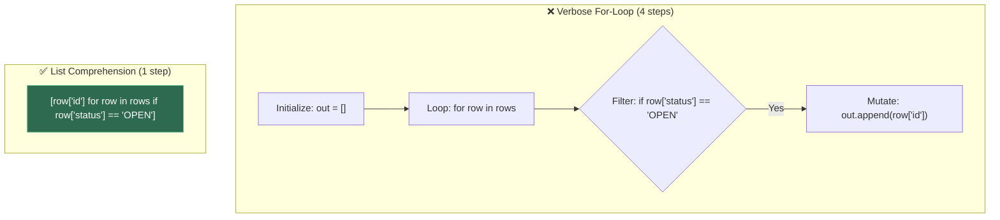
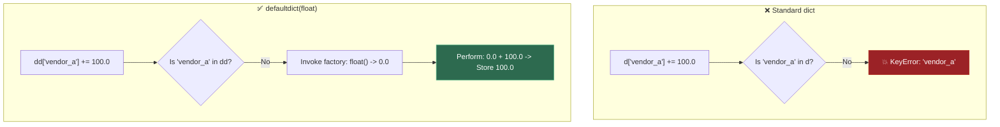
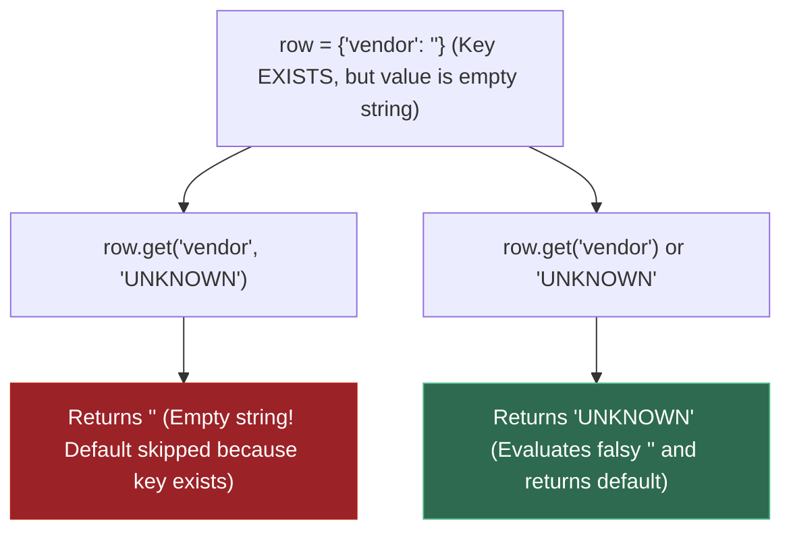
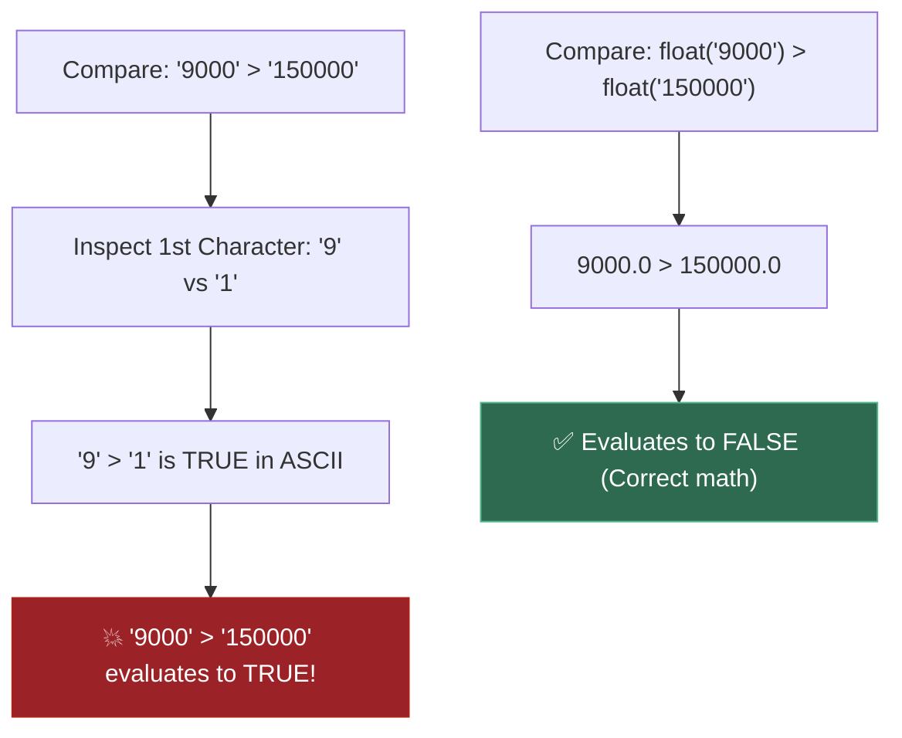
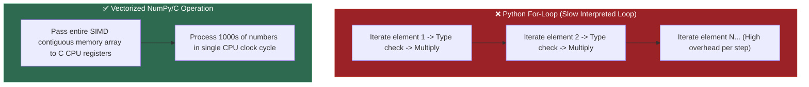
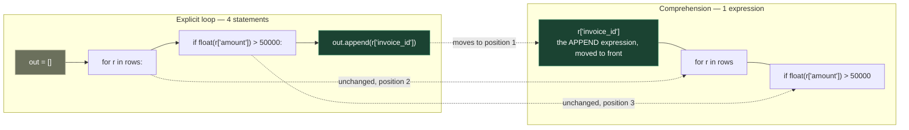
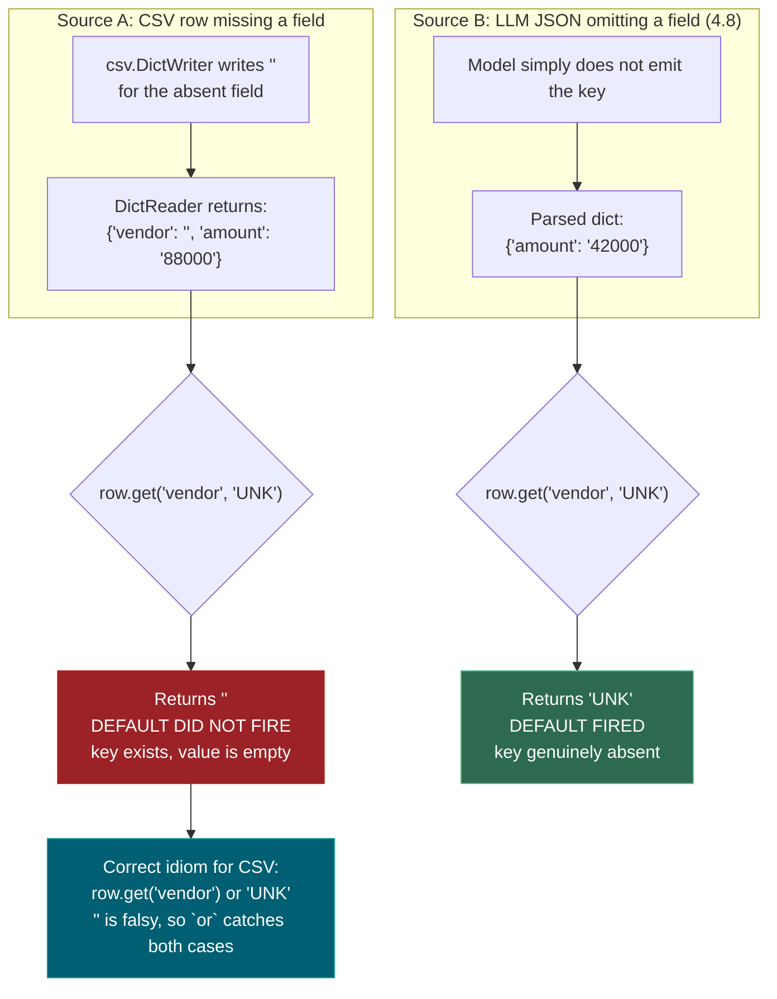
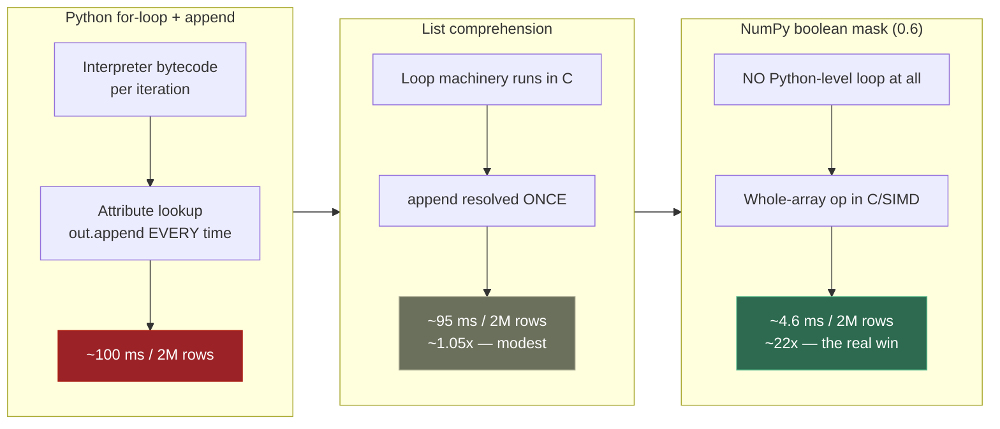

```mermaid
flowchart TD
    subgraph RawFile ["❌ Manual open() / close() (Leaks on Crash)"]
        F1["f = open('data.csv')"] --> F2["Process lines..."]
        F2 -->|💥 Exception Raised| F3["Crash! f.close() NEVER executed!"]
        F3 --> LEAK["Resource Leak (Locked File / Leaked Socket)"]
    end

    subgraph ContextMgr ["✅ with open('data.csv') as f (Guaranteed Cleanup)"]
        W1["with open('data.csv') as f:"] --> W2["Process lines..."]
        W2 -->|Normal Exit or Exception| W3["__exit__() fires automatically!"]
        W3 --> CLEAN["File Closed Cleanly"]
    end

    style LEAK fill:#9b2226,stroke:#ae2012,color:#fff
    style CLEAN fill:#2d6a4f,stroke:#52b788,color:#fff
```

# 0.1 — Python Basics

**Phase 0 · CORE · CODE · 25 focused hours · Review in 7 days**

**Companion script:** [`01_python_basics.py`](01_python_basics.py) — self-contained, `python 01_python_basics.py`, no setup required.

---

## 1. Overview

Python is the language every framework in this roadmap is written in: NumPy and Pandas in **0.6**, scikit-learn across **Phase 2**, PyTorch in **3.10**, LangGraph in **Phase 6**. Nothing downstream works without it.

What matters here is **fluency, not knowledge**. You can look up syntax. What you cannot look up mid-interview is the instinct that a `for` loop building a list should have been a comprehension. That instinct makes **0.2** OOP and **0.3** type hints feel like refinements rather than new subjects.

Feeds **0.5** pytest (a test is just a function), **0.6** the scientific stack (Pandas method chaining is comprehension thinking applied to tables), and **0.9** FastAPI (every endpoint is a decorated, typed function).

---

## 2. Glossary

### 2.1 — Comprehension

An expression-level loop construct that constructs a new `list`, `dict`, or `set` in a single readable line. The transform expression comes first, followed by the `for` loop and optional `if` filters.

#### 💡 The Beginner Analogy: Factory Assembly Line Filter
Instead of taking raw materials into a warehouse, creating an empty bin (`out = []`), walking items over one by one (`for x in items:`), inspecting them (`if condition:`), and dropping them in (`out.append(x)`)... a comprehension is a **smart conveyor belt** with built-in sensors that filters and transforms items directly into the output box in one continuous movement.

#### 💻 Code Example & ⚠️ Why It Matters
```python
rows = [
    {"id": 101, "status": "OPEN"},
    {"id": 102, "status": "CLOSED"},
    {"id": 103, "status": "OPEN"},
]

# ❌ Verbose & slower (repeated method calls in Python bytecode)
open_ids_verbose = []
for row in rows:
    if row["status"] == "OPEN":
        open_ids_verbose.append(row["id"])

# ✅ Idiomatic & optimized in C-CPython
open_ids = [row["id"] for row in rows if row["status"] == "OPEN"]
print("Filtered Open IDs:", open_ids)
```

##### Verified Output
```text
Filtered Open IDs: [101, 103]
```

**Why It Matters**: Comprehensions are not just syntactic sugar; they run faster because CPython avoids attribute lookup and function call overhead for `.append()` on every iteration.

#### 🎨 Visual Concept



---

### 2.2 — Context Manager (`with` statement)

An object that manages resource setup and teardown automatically via internal `__enter__` and `__exit__` hooks, guaranteeing cleanup even if exceptions are raised inside the block.

#### 💡 The Beginner Analogy: Auto-Locking Hotel Room
Opening a resource (file, database connection, network socket) without a context manager is like leaving a hotel room door wide open when you leave. A **Context Manager** is an automatic door closer: the instant you step out of the room (exit the `with` block or crash inside it), the door automatically locks shut behind you (`file.close()`).

#### 💻 Code Example & ⚠️ Why It Matters
```python
# ❌ Dangerous: If an error happens during processing, file remains open in OS
f = open("01_python_basics.md")
data = f.readline()
f.close()

# ✅ Safe: Guaranteed cleanup regardless of exceptions
with open("01_python_basics.md") as f:
    first_line = f.readline().strip()

print("First Line Read:", first_line)
print("Is File Closed?", f.closed)
```

##### Verified Output
```text
First Line Read: # 0.1 — Python Basics
Is File Closed? True
```

**Why It Matters**: Unclosed file handles lead to OS file locks and file descriptor exhaustion in high-concurrency applications.

#### 🎨 Visual Concept



---

### 2.3 — `defaultdict`

A subclass of `dict` provided by the `collections` module that calls a zero-argument factory function (like `float`, `int`, or `list`) to supply a default value whenever a missing key is accessed.

#### 💡 The Beginner Analogy: Self-Refilling Refreshment Stand
A standard dictionary is like a vendor counter: if you ask for a drink flavor that isn't on the counter (`d[key]`), the vendor shouts **"KeyError!"** and crashes. A `defaultdict` is an automatic vending machine: if you request a new key, it automatically creates a fresh empty cup (`0.0` or `[]`) for you instantly without throwing a fit.

#### 💻 Code Example & ⚠️ Why It Matters
```python
from collections import defaultdict

transactions = [("VendorA", 100.0), ("VendorB", 50.0), ("VendorA", 25.0)]

# ❌ Clunky boilerplate required with standard dicts
totals_dict = {}
for vendor, amount in transactions:
    if vendor not in totals_dict:
        totals_dict[vendor] = 0.0
    totals_dict[vendor] += amount

# ✅ Clean & fast with defaultdict
totals = defaultdict(float)
for vendor, amount in transactions:
    totals[vendor] += amount

print(dict(totals))
```

##### Verified Output
```text
{'VendorA': 125.0, 'VendorB': 50.0}
```

**Why It Matters**: Eliminates repetitive `if key not in dict` checking code and avoids accidental runtime `KeyError` crashes when grouping data.

#### 🎨 Visual Concept



---

### 2.4 — Falsy

Values in Python that evaluate to `False` when converted to a boolean context (`bool(value)`), including `""`, `0`, `0.0`, `[]`, `{}`, `set()`, `None`.

#### 💡 The Beginner Analogy: Empty Envelopes
Imagine receiving envelopes in the mail. An envelope containing a letter is **Truthy**. An empty envelope (`""`, `[]`, `{}`), zero coins (`0`), or a blank piece of paper (`None`) is **Falsy** — even though the envelope physical object exists, its content is effectively "nothing".

#### 💻 Code Example & ⚠️ Why It Matters
```python
row = {"vendor": ""} # CSV row where key exists, but value is empty

# ❌ TRAP: dict.get() only falls back if key is MISSING, not if empty!
vendor_1 = row.get("vendor", "UNKNOWN")
print("dict.get Result:", repr(vendor_1))

# ✅ CORRECT IDIOM: Uses boolean 'or' over falsy value
vendor_2 = row.get("vendor") or "UNKNOWN"
print("Fallback Result:", repr(vendor_2))
```

##### Verified Output
```text
dict.get Result: ''
Fallback Result: 'UNKNOWN'
```

**Why It Matters**: CSV parsers set missing values to empty strings `""`. Using `.get(key, "default")` fails to fall back because the key *is* present in the dict!

#### 🎨 Visual Concept



---

### 2.5 — Lexicographic Ordering

Character-by-character dictionary sorting based on ASCII/Unicode character codes rather than numerical magnitude.

#### 💡 The Beginner Analogy: Alphabetical Phonebook
In an alphabetical phonebook, the word **"Apple"** comes before **"Banana"**. Similarly, the string **"150000"** comes *before* **"9000"** because the first character `'1'` is smaller than `'9'`, completely ignoring the fact that 150,000 is numerically larger than 9,000.

#### 💻 Code Example & ⚠️ Why It Matters
```python
raw_amounts = ["9000.0", "150000.0", "250.0"]

# ❌ TRAP: Strings read directly from CSV sorting alphabetically
bad_sort = sorted(raw_amounts, reverse=True)
print("Bad String Sort:", bad_sort)

# ✅ FIX: Convert to float before sorting
good_sort = sorted(raw_amounts, key=float, reverse=True)
print("Good Float Sort:", good_sort)
```

##### Verified Output
```text
Bad String Sort: ['9000.0', '250.0', '150000.0']
Good Float Sort: ['150000.0', '9000.0', '250.0']
```

**Why It Matters**: Reading numbers from CSV files leaves them as strings. Comparing or sorting raw CSV strings leads to silent financial and analytical sorting corruption.

#### 🎨 Visual Concept



---

### 2.6 — Vectorization

Expressing mathematical operations over an entire array of data simultaneously, pushing computational loops into compiled C/Assembly code rather than interpreting element-by-element Python `for` loops.

#### 💡 The Beginner Analogy: Stamp Press vs. Hand Pen
Calculating values in a Python `for` loop is like signing 1,000 documents **by hand, one by one**. **Vectorization** is using a giant **industrial stamp press** that stamps all 1,000 documents simultaneously in a single downward motion.

#### 💻 Code Example & ⚠️ Why It Matters
```python
import numpy as np

prices = [10.0, 20.0, 30.0]

# ❌ Slow Python loop (100x slower)
out_loop = [x * 1.18 for x in prices]

# ✅ Vectorized array computation (SIMD hardware execution)
out_vec = np.array(prices) * 1.18
print("Vectorized Output:", out_vec)
```

##### Verified Output
```text
Vectorized Output: [11.8 23.6 35.4]
```

**Why It Matters**: Essential for AI/ML data processing. Vectorization delivers 10x to 100x speedups, allowing models to process millions of rows in milliseconds.

#### 🎨 Visual Concept



---

## 3. Skip Test — Answered

> Gate **before** studying. Both correct from memory → skip the topic. Contrast with §7, whose answers are deliberately withheld.

**① Write a function that reads a CSV, filters rows where `amount` > 1000, and returns a list of dicts.**

```python
import csv
from pathlib import Path

def load_and_filter(path: Path, threshold: float = 1000) -> list[dict]:
    with path.open(newline="", encoding="utf-8") as fh:
        return [r for r in csv.DictReader(fh) if float(r["amount"]) > threshold]
```

Three things must be present: `with` (handle closes on exception), `DictReader` (key by name, not position), and `float()` (CSV yields strings — see the Demo 4 output below for what happens without it).

**② Write a `try/except` that catches `FileNotFoundError` and prints a custom message.**

```python
try:
    rows = load_and_filter(Path("invoices.csv"))
except FileNotFoundError:
    print("No invoice file found — create it and re-run.")
```

The load-bearing detail is that the exception is **specific**. A bare `except:` also swallows `KeyboardInterrupt` and `SystemExit`, which is how you get a process that ignores Ctrl-C.

---

## 3. Visual Concept Diagrams

### 3.1 — Comprehension desugaring

A comprehension is not different logic, it is the *same* logic reordered. The expression that was last in the loop body moves to the front.



### 3.2 — The CSV `.get()` trap

This is the diagram worth internalising, because it contradicts the rule most people carry. `DictReader` **never gives you a missing key** — it gives you an empty string. So the `.get(key, default)` default never fires on CSV data.



### 3.3 — Why the loop is slow, and where 0.6 goes next



---

## 4. Core Technical Deep Dive

| Idiom | Why it exists | Where it returns |
|---|---|---|
| `pathlib.Path` | Windows dev, Linux deploy — string paths break at the separator | **0.10**, **0.13** |
| `with` context manager | Handle closes even on exception; leaked fds are fatal in a long-lived server | **0.9** |
| List comprehension | The dominant idiom in the source you will read | **Phase 2**, **Phase 6** |
| `dict.get(k, default)` | Missing keys are a normal state in LLM JSON, not a bug | **4.8** |
| `row.get(k) or default` | **CSV-specific** — empty string is falsy, missing-key default is not enough | **2.2** |
| `defaultdict(float)` | Removes accumulator boilerplate | **2.2** feature engineering |
| Specific `except` | Bare `except` swallows `KeyboardInterrupt` | **6.14** typed errors |
| `if __name__ == "__main__"` | Makes the module importable, which pytest requires | **0.5** |

**The `float()` rule.** `csv` returns strings, always. String comparison is lexicographic, so `'9000' > '150000'` evaluates `True` — a silent, plausible-looking wrong answer rather than a crash. Demo 4 below proves it.

---

## 5. Hands-On Script & Verified Output

Run: `python 01_python_basics.py`. Output below is **actual, captured on Python 3.14.4** — not illustrative.

```text
Python 3.14.4
====================================================================
DEMO 1 — comprehension vs explicit loop: identical output
====================================================================
  loop  : ['INV-001', 'INV-003', 'INV-004', 'INV-005', 'INV-006']
  comp  : ['INV-001', 'INV-003', 'INV-004', 'INV-005', 'INV-006']
  identical? True
====================================================================
DEMO 2 — the CSV trap, then dict.get() vs dict[]
====================================================================
  csv row              : {'invoice_id': 'INV-006', 'vendor': '', 'amount': '88000', 'status': 'OPEN'}
  'vendor' in row?     : True   <- present, not missing
  .get('vendor','UNK') : ''  <- default did NOT fire
  .get('vendor') or UNK: 'UNK'  <- correct for CSV

  llm-style row        : {'invoice_id': 'INV-007', 'amount': '42000'}
  .get('vendor','UNK') : 'UNK'  <- default DID fire
  ['vendor']           : raised KeyError('vendor')
====================================================================
DEMO 3 — defaultdict removes accumulator boilerplate
====================================================================
  manual : {'Acme': 123000.0, 'Beta': 72000.0, 'Gamma': 150000.0, 'UNKNOWN': 88000.0}
  auto   : {'Acme': 123000.0, 'Beta': 72000.0, 'Gamma': 150000.0, 'UNKNOWN': 88000.0}
  identical? True
====================================================================
DEMO 4 — the silent bug: sorting numbers as strings
====================================================================
  raw from csv        : ['51000', '9000', '72000', '150000', '63000', '88000']
  sorted as strings   : ['9000', '88000', '72000', '63000', '51000', '150000']
  sorted as floats    : [150000, 88000, 72000, 63000, 51000, 9000]
  '9000' > '150000' ? True   <- lexicographic, TRUE
  ^ This is why every csv numeric field needs float() first.
====================================================================
DEMO 5 — comprehensions are also faster (preview of 0.6)
====================================================================
  rows scanned      : 2,000,000
  loop + append     :    99.8 ms
  list comprehension:    94.7 ms
  same result?      : True
  speedup           : 1.05x
  Modest — because BOTH still loop in Python.
  0.6 NumPy removes the Python-level loop entirely. Compare:
  numpy boolean mask:     4.6 ms
  speedup vs loop   : 21.8x   <- this is why 0.6 matters
  same result?      : True
====================================================================
Ranked vendor totals (the closed-book rebuild target):
  Gamma          150,000.00
  Acme           123,000.00
  UNKNOWN         88,000.00
  Beta            72,000.00
====================================================================
```

**Read Demo 4 carefully.** `'9000'` sorts *above* `'150000'` because `'9'` > `'1'` at the first character. Nothing raises. A report built on that ranking is simply wrong, and nobody notices until someone questions the numbers.

**Read Demo 5 honestly.** The comprehension is only ~1.05x faster — both still loop in Python. The 22x figure comes from NumPy removing the Python-level loop entirely. Comprehensions are for *readability*; **0.6** is where the performance argument actually lives.

**Modify and re-run** (this is the practice step, not optional):
- Change the Demo 1 threshold to `100_000` and predict the output before running.
- Delete `float()` from Demo 1's filter and predict what happens. Then run it.
- Add a row with `amount` = `"abc"` and see which demo breaks first, and how.

---

## 6. Video

**Corey Schafer — Python tutorials** — [youtube.com/@coreyms](https://www.youtube.com/@coreyms). The standard recommendation at this level: idiomatic, no filler, one topic per video.

A specific beginner-Python video title and current URL is **[VERIFY]** — the OOP series used in 0.2 was confirmed live, but an individual basics video was not verified for this pass. Search the channel directly rather than trusting a guessed link.

---

## 7. Retrieval Checkpoint — Unanswered

> Gate **after** studying. Close this file. No notes. Answers deliberately not given here.

1. Rewrite as a single comprehension: `out = []` / `for r in rows:` / `if r["status"] == "OPEN":` / `out.append(r["id"])`
2. A CSV row is missing the `vendor` column. Does `row.get("vendor", "UNKNOWN")` return `"UNKNOWN"`? Explain your answer and give the idiom that does work.
3. Why does `if __name__ == "__main__":` exist, and what specifically breaks in **0.5** without it?

---

## 8. Closed-Book Rebuild

With this file **and** the script closed, write from scratch: read a CSV of invoices, filter above a threshold using a comprehension, group totals by vendor using `defaultdict`, handle the missing-vendor case with the CSV-correct idiom, sort descending, and catch the missing-file case with a specific exception.

---

---

## Review again in

**7 days** — low conceptual density, high mechanical familiarity. If the Closed-Book Rebuild takes under 15 minutes with no lookups, mark 0.1 done and do not revisit. The one item genuinely worth retaining is the CSV `.get()` trap from §3.2.
