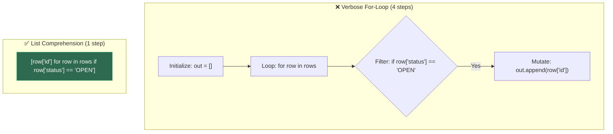
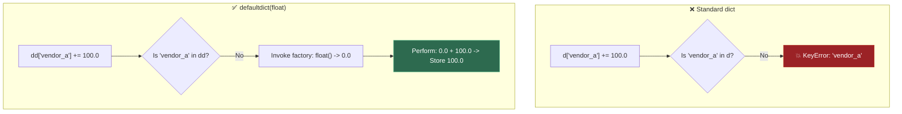
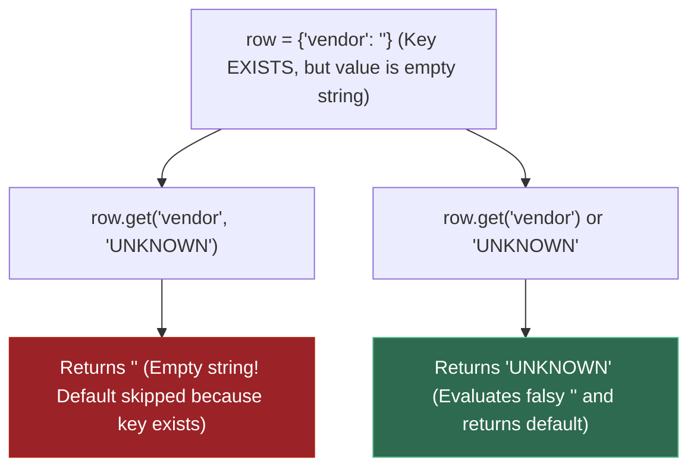
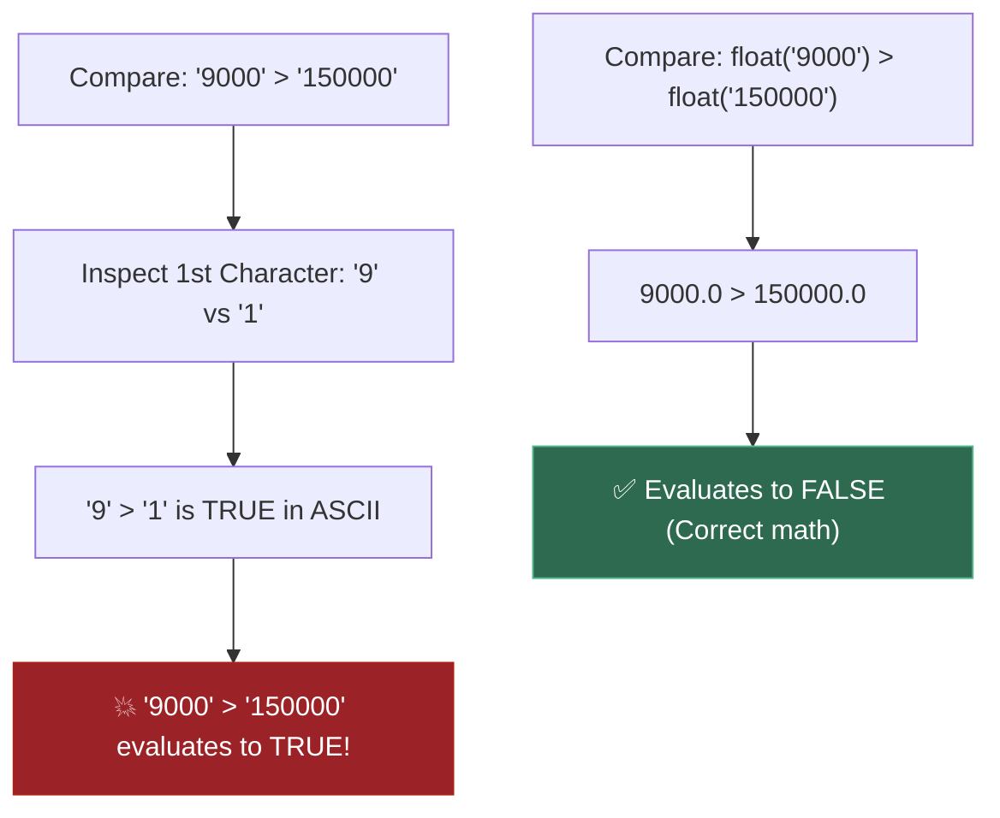
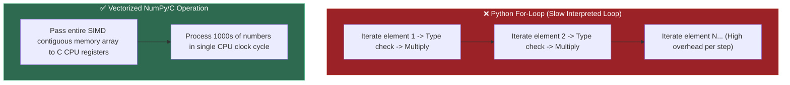
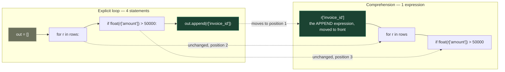
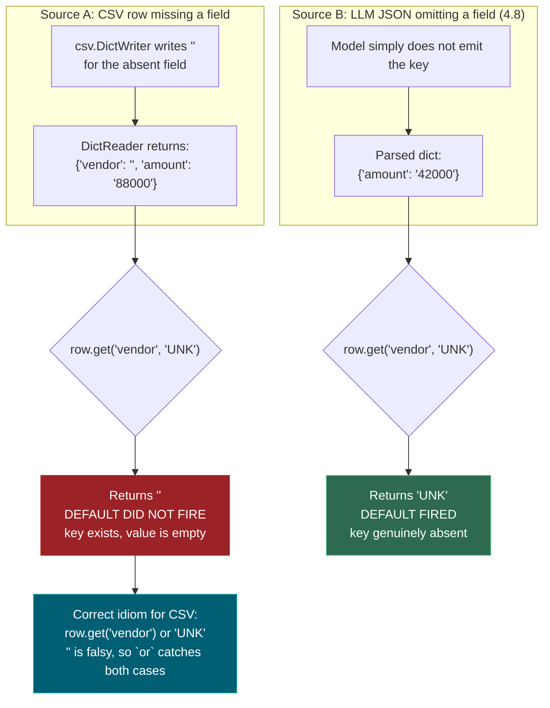
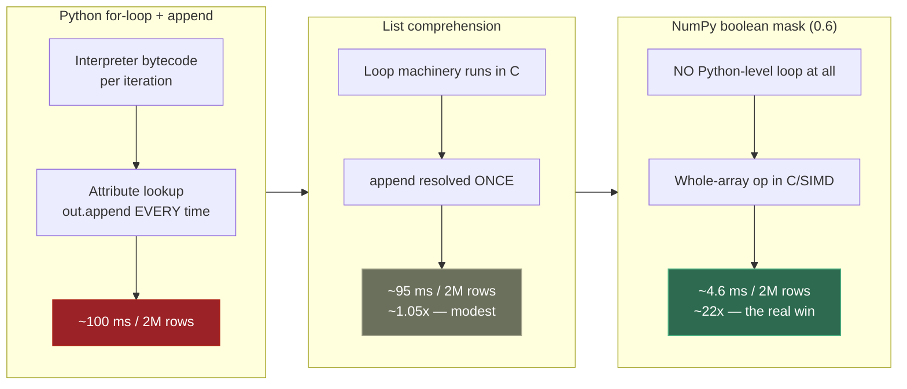

```mermaid
flowchart TD
    subgraph RawFile ["❌ Manual open() / close() (Leaks on Crash)"]
        F1["f = open('data.csv')"] --> F2["Process lines..."]
        F2 -->|💥 Exception Raised| F3["Crash! f.close() NEVER executed!"]
        F3 --> LEAK["Resource Leak (Locked File / Leaked Socket)"]
    end

    subgraph ContextMgr ["✅ with open('data.csv') as f (Guaranteed Cleanup)"]
        W1["with open('data.csv') as f:"] --> W2["Process lines..."]
        W2 -->|Normal Exit or Exception| W3["__exit__() fires automatically!"]
        W3 --> CLEAN["File Closed Cleanly"]
    end

    style LEAK fill:#9b2226,stroke:#ae2012,color:#fff
    style CLEAN fill:#2d6a4f,stroke:#52b788,color:#fff
```

# 0.1 — Python Basics

**Phase 0 · CORE · CODE · 25 focused hours · Review in 7 days**

**Companion script:** [`01_python_basics.py`](01_python_basics.py) — self-contained, run with `python 01_python_basics.py`, no setup required.

---

## 1. Why This Matters

Python is the language behind every framework in this roadmap — NumPy/Pandas (0.6), scikit-learn (Phase 2), PyTorch (3.10), LangGraph (Phase 6). Nothing downstream works without fluency in these basics.

---

## 2. Variables & Data Types

**Variables** store values — Python figures out the type automatically (no need to declare `int x`).

```python
name = "Alice"          # str  — text
age = 25                # int  — whole number
price = 19.99           # float — decimal number
is_active = True        # bool — True or False
nothing = None          # NoneType — absence of value

print(type(name))       # <class 'str'>
print(type(price))      # <class 'float'>
```

---

## 3. Strings

**Strings** are immutable sequences of characters — every string method returns a *new* string.

```python
text = "  Hello, World!  "

print(text.strip())         # "Hello, World!"     — removes whitespace
print(text.lower())         # "  hello, world!  " — lowercase
print(text.replace("World", "Python"))  # "  Hello, Python!  "
print(text.split(","))      # ['  Hello', ' World!  ']
print("Hello" in text)      # True — membership check
print(len(text))            # 17
```

### f-strings (formatted string literals)

The modern way to embed expressions inside strings — always prefer over `%` or `.format()`.

```python
name, score = "Alice", 95.678
print(f"{name} scored {score:.1f}%")   # Alice scored 95.7%
print(f"{'hi':>10}")                   # "        hi" — right-aligned
print(f"{1_000_000:,}")                # "1,000,000"  — comma separator
```

### Multi-line strings

```python
query = """
SELECT name, age
FROM users
WHERE active = 1
"""
```

---

## 4. Numbers & Arithmetic

**Python handles integers of arbitrary size** and follows standard math operator precedence.

```python
print(10 + 3)       # 13    — addition
print(10 - 3)       # 7     — subtraction
print(10 * 3)       # 30    — multiplication
print(10 / 3)       # 3.333 — true division (always float)
print(10 // 3)      # 3     — floor division (integer result)
print(10 % 3)       # 1     — modulus (remainder)
print(10 ** 3)      # 1000  — exponentiation
print(abs(-42))     # 42    — absolute value
print(round(3.567, 1))  # 3.6 — rounding
```

### Type conversion

```python
print(int("42"))        # 42    — string to int
print(float("3.14"))    # 3.14  — string to float
print(str(100))         # "100" — number to string
print(int(3.9))         # 3     — truncates, does NOT round
```

---

## 5. Lists

**Lists** are ordered, mutable sequences — the workhorse data structure of Python.

```python
fruits = ["apple", "banana", "cherry"]

fruits.append("date")           # add to end
fruits.insert(1, "blueberry")   # insert at index
fruits.remove("banana")         # remove by value
popped = fruits.pop()           # remove & return last item
print(len(fruits))              # 3

# Slicing: list[start:stop:step] — stop is exclusive
nums = [0, 1, 2, 3, 4, 5]
print(nums[1:4])    # [1, 2, 3]
print(nums[:3])     # [0, 1, 2]
print(nums[::2])    # [0, 2, 4]  — every 2nd element
print(nums[::-1])   # [5, 4, 3, 2, 1, 0] — reversed
```

### Sorting

```python
nums = [3, 1, 4, 1, 5]
print(sorted(nums))              # [1, 1, 3, 4, 5] — returns new list
nums.sort(reverse=True)          # sorts in place
print(nums)                      # [5, 4, 3, 1, 1]
```

---

## 6. Tuples

**Tuples** are ordered, **immutable** sequences — use when data should not change after creation.

```python
point = (10, 20)
x, y = point           # tuple unpacking
print(x, y)            # 10 20

# Single-element tuple needs trailing comma
single = (42,)          # tuple, not just parentheses
not_tuple = (42)        # this is just the int 42
```

---

## 7. Dictionaries

**Dicts** map keys to values — the most important data structure for real-world Python (JSON, configs, row data).

```python
person = {"name": "Alice", "age": 25, "city": "NYC"}

print(person["name"])                   # "Alice"
print(person.get("phone", "N/A"))       # "N/A" — safe access with default
person["email"] = "alice@example.com"   # add/update key
del person["city"]                      # delete key

# Looping over dicts
for key, value in person.items():
    print(f"{key}: {value}")

print(list(person.keys()))    # ["name", "age", "email"]
print(list(person.values()))  # ["Alice", 25, "alice@example.com"]
```

### The CSV `.get()` Trap

CSV's `DictReader` never gives you a missing key — it gives an empty string `""`. So `.get(key, default)` default **never fires**.

```python
csv_row = {"vendor": "", "amount": "5000"}   # typical CSV row with missing data

bad  = csv_row.get("vendor", "UNKNOWN")      # returns "" — default didn't fire!
good = csv_row.get("vendor") or "UNKNOWN"    # returns "UNKNOWN" — correct idiom
```

### `defaultdict` — removes boilerplate

```python
from collections import defaultdict

totals = defaultdict(float)     # missing keys auto-initialize to 0.0
for vendor, amount in [("Acme", 100), ("Beta", 50), ("Acme", 75)]:
    totals[vendor] += amount    # no "if key not in dict" needed

print(dict(totals))             # {'Acme': 175, 'Beta': 50}
```

---

## 8. Sets

**Sets** are unordered collections of **unique** elements — perfect for deduplication and membership tests.

```python
colors = {"red", "green", "blue", "red"}
print(colors)                   # {'red', 'green', 'blue'} — duplicate removed

a = {1, 2, 3, 4}
b = {3, 4, 5, 6}
print(a & b)    # {3, 4}       — intersection
print(a | b)    # {1,2,3,4,5,6} — union
print(a - b)    # {1, 2}       — difference
print(3 in a)   # True         — O(1) lookup, much faster than list
```

---

## 9. Conditionals

**if/elif/else** control flow — Python uses indentation instead of braces.

```python
score = 85

if score >= 90:
    grade = "A"
elif score >= 80:
    grade = "B"
elif score >= 70:
    grade = "C"
else:
    grade = "F"

print(grade)  # "B"

# Ternary (one-liner conditional)
status = "pass" if score >= 60 else "fail"
```

### Truthy / Falsy values

These values evaluate to `False` in boolean context: `""`, `0`, `0.0`, `[]`, `{}`, `set()`, `None`, `False`.

```python
name = ""
print(bool(name))           # False — empty string is falsy
result = name or "UNKNOWN"  # "UNKNOWN" — falsy triggers the `or` fallback
```

---

## 10. Loops

### `for` loop — iterate over any sequence

```python
for fruit in ["apple", "banana", "cherry"]:
    print(fruit)

# range(start, stop, step) — stop is exclusive
for i in range(0, 10, 2):
    print(i)    # 0, 2, 4, 6, 8

# enumerate — get index + value
for i, fruit in enumerate(["apple", "banana"]):
    print(f"{i}: {fruit}")
```

### `while` loop — repeat until condition is false

```python
count = 5
while count > 0:
    print(count)
    count -= 1

# break exits the loop, continue skips to next iteration
for n in range(10):
    if n == 3:
        continue    # skip 3
    if n == 7:
        break       # stop at 7
    print(n)        # prints 0, 1, 2, 4, 5, 6
```

### `zip` — iterate over multiple sequences in parallel

```python
names = ["Alice", "Bob"]
scores = [90, 85]
for name, score in zip(names, scores):
    print(f"{name}: {score}")   # Alice: 90, Bob: 85
```

---

## 11. Comprehensions

**Comprehensions** build lists, dicts, and sets in one readable line — the dominant idiom in production Python.

```python
# List comprehension
squares = [x**2 for x in range(6)]              # [0, 1, 4, 9, 16, 25]

# With filter
evens = [x for x in range(10) if x % 2 == 0]   # [0, 2, 4, 6, 8]

# Dict comprehension
word_lengths = {w: len(w) for w in ["hi", "hello", "hey"]}
# {'hi': 2, 'hello': 5, 'hey': 3}

# Set comprehension
unique_lengths = {len(w) for w in ["hi", "hello", "hey"]}  # {2, 3, 5}
```

A comprehension is the *same logic* as a for-loop, just reordered — the append expression moves to the front:

```python
# These produce identical output:
loop_result = []
for r in rows:
    if float(r["amount"]) > 50000:
        loop_result.append(r["id"])

comp_result = [r["id"] for r in rows if float(r["amount"]) > 50000]
```

---

## 12. Functions

**Functions** encapsulate reusable logic — defined with `def`, return values with `return`.

```python
def greet(name: str, greeting: str = "Hello") -> str:
    """Return a greeting string."""         # docstring
    return f"{greeting}, {name}!"

print(greet("Alice"))                       # Hello, Alice!
print(greet("Bob", greeting="Hey"))         # Hey, Bob!
```

### `*args` and `**kwargs`

```python
def total(*args):               # accepts any number of positional args
    return sum(args)

def build_profile(**kwargs):    # accepts any number of keyword args
    return kwargs

print(total(1, 2, 3))                          # 6
print(build_profile(name="Alice", age=25))     # {'name': 'Alice', 'age': 25}
```

### Lambda — anonymous one-liner functions

```python
double = lambda x: x * 2
print(double(5))    # 10

# Common use: sort key
pairs = [(1, "b"), (3, "a"), (2, "c")]
pairs.sort(key=lambda p: p[1])    # sort by second element
print(pairs)                      # [(3, 'a'), (1, 'b'), (2, 'c')]
```

---

## 13. Exception Handling

**try/except** catches errors gracefully — always catch **specific** exceptions, never use bare `except:`.

```python
try:
    result = int("not_a_number")
except ValueError as e:
    print(f"Caught: {e}")       # Caught: invalid literal for int()...
except FileNotFoundError:
    print("File missing!")
else:
    print("No error occurred")  # runs only if no exception
finally:
    print("Always runs")       # cleanup code, runs no matter what
```

**Why specific exceptions?** A bare `except:` also swallows `KeyboardInterrupt` and `SystemExit`, making a hung process unkillable with Ctrl+C.

---

## 14. File I/O with Context Managers

**`with` statement** guarantees cleanup (closing files, releasing locks) even if an exception occurs.

```python
# Writing
with open("output.txt", "w", encoding="utf-8") as f:
    f.write("Hello, file!\n")

# Reading
with open("output.txt", "r", encoding="utf-8") as f:
    content = f.read()
    print(content)      # Hello, file!

# Reading line by line (memory-efficient for large files)
with open("output.txt") as f:
    for line in f:
        print(line.strip())
```

### CSV reading with `DictReader`

```python
import csv
from pathlib import Path

with Path("invoices.csv").open(newline="", encoding="utf-8") as fh:
    rows = list(csv.DictReader(fh))     # each row is a dict keyed by header

for row in rows:
    print(row["invoice_id"], float(row["amount"]))  # always float() CSV numbers!
```

---

## 15. Modules & Imports

**Modules** are `.py` files — `import` brings in code from the standard library or your own files.

```python
import os                           # import entire module
from pathlib import Path            # import specific name
from collections import defaultdict # import from submodule
import json as j                    # alias

print(os.getcwd())                  # current working directory
print(Path.home())                  # user's home directory
```

### Common standard library modules

| Module | Purpose | Example |
|---|---|---|
| `os` | OS interaction (paths, env vars) | `os.getenv("API_KEY")` |
| `sys` | System info, stdin/stdout | `sys.argv`, `sys.exit()` |
| `pathlib` | Cross-platform file paths | `Path("data") / "file.csv"` |
| `json` | Parse/write JSON | `json.loads('{"a":1}')` |
| `csv` | Read/write CSV files | `csv.DictReader(fh)` |
| `math` | Math functions | `math.sqrt(16)` → `4.0` |
| `random` | Random numbers | `random.randint(1, 10)` |
| `datetime` | Dates and times | `datetime.now()` |
| `collections` | Specialized containers | `defaultdict`, `Counter` |
| `itertools` | Iterator utilities | `chain`, `product`, `groupby` |
| `functools` | Higher-order functions | `lru_cache`, `partial`, `reduce` |
| `re` | Regular expressions | `re.findall(r"\d+", text)` |
| `tempfile` | Temporary files/dirs | `tempfile.gettempdir()` |
| `time` | Timing & delays | `time.perf_counter()` |

---

## 16. Classes & OOP Basics

**Classes** bundle data (attributes) and behavior (methods) together.

```python
class Dog:
    species = "Canis familiaris"    # class attribute (shared by all instances)

    def __init__(self, name: str, age: int):
        self.name = name            # instance attribute
        self.age = age

    def speak(self) -> str:
        return f"{self.name} says Woof!"

    def __repr__(self) -> str:      # developer-friendly string representation
        return f"Dog('{self.name}', {self.age})"

buddy = Dog("Buddy", 3)
print(buddy.speak())       # Buddy says Woof!
print(buddy)               # Dog('Buddy', 3)
```

### Inheritance

```python
class GuideDog(Dog):
    def __init__(self, name: str, age: int, handler: str):
        super().__init__(name, age)
        self.handler = handler

    def speak(self) -> str:     # override parent method
        return f"{self.name} guides {self.handler} silently."
```

---

## 17. Decorators

**Decorators** wrap a function to add behavior without modifying its code — used heavily in Flask, FastAPI, pytest.

```python
import time

def timer(func):
    def wrapper(*args, **kwargs):
        start = time.perf_counter()
        result = func(*args, **kwargs)
        elapsed = time.perf_counter() - start
        print(f"{func.__name__} took {elapsed:.4f}s")
        return result
    return wrapper

@timer
def slow_add(a, b):
    time.sleep(0.1)
    return a + b

print(slow_add(3, 4))  # slow_add took 0.10xxs \n 7
```

---

## 18. Generators

**Generators** produce values lazily one at a time — use when data is too large to fit in memory.

```python
def count_up(n):
    i = 0
    while i < n:
        yield i     # pauses here, resumes on next() call
        i += 1

for num in count_up(5):
    print(num)          # 0, 1, 2, 3, 4

# Generator expression (like a comprehension but lazy)
squares = (x**2 for x in range(1_000_000))  # uses almost no memory
print(next(squares))    # 0
print(next(squares))    # 1
```

---

## 19. Type Hints

**Type hints** document expected types — they don't enforce at runtime but enable IDE autocomplete, error detection, and better documentation.

```python
def calculate_total(prices: list[float], tax_rate: float = 0.18) -> float:
    """Calculate total with tax."""
    return sum(prices) * (1 + tax_rate)

# Common type hints
from typing import Optional

name: str = "Alice"
scores: list[int] = [90, 85, 92]
config: dict[str, str] = {"host": "localhost"}
maybe_name: Optional[str] = None   # can be str or None
```

---

## 20. Useful Built-in Functions

Quick reference for the most commonly used built-ins:

```python
# map — apply function to every element
print(list(map(str.upper, ["hi", "bye"])))     # ['HI', 'BYE']

# filter — keep elements where function returns True
print(list(filter(lambda x: x > 3, [1,5,2,8])))  # [5, 8]

# any / all — check conditions across iterables
print(any([False, False, True]))    # True  — at least one
print(all([True, True, False]))     # False — not every one

# min / max with key
words = ["python", "is", "awesome"]
print(max(words, key=len))          # "awesome"

# sorted with key
data = [{"name": "Bob", "age": 30}, {"name": "Alice", "age": 25}]
print(sorted(data, key=lambda d: d["age"]))     # Alice first

# isinstance — type checking
print(isinstance(42, int))         # True
print(isinstance("hi", (str, int)))  # True — checks multiple types
```

---

## 21. String Sort Bug (CSV Trap)

**Sorting numbers as strings is a silent bug** — `'9000' > '150000'` is `True` because `'9' > '1'` in ASCII.

```python
amounts = ["9000", "150000", "250"]

wrong = sorted(amounts, reverse=True)               # ['9000', '250', '150000'] — WRONG
right = sorted(amounts, key=float, reverse=True)     # ['150000', '9000', '250'] — CORRECT

# Rule: always float() before comparing CSV numbers
```

---

## 22. `if __name__ == "__main__"`

**This guard** makes a script importable without executing its top-level code — required for pytest (0.5).

```python
def main():
    print("Running as script")

if __name__ == "__main__":
    main()      # only runs when executed directly, NOT when imported
```

Without this guard, importing the module from a test file would execute everything, making the script untestable.

---

## 23. Pathlib — Cross-Platform Paths

**`pathlib.Path`** handles Windows vs Linux path separators automatically — always prefer over string concatenation.

```python
from pathlib import Path

data_dir = Path("data")
file_path = data_dir / "invoices.csv"   # works on Windows AND Linux
print(file_path.exists())               # True/False
print(file_path.suffix)                 # ".csv"
print(file_path.stem)                   # "invoices"
print(file_path.parent)                 # Path("data")
```

---

## 24. Unpacking & Swap

**Unpacking** assigns multiple values at once — a core Python idiom.

```python
# Tuple unpacking
a, b, c = 1, 2, 3

# Swap without temp variable
a, b = b, a

# Star unpacking — catch "the rest"
first, *middle, last = [1, 2, 3, 4, 5]
print(first, middle, last)     # 1 [2, 3, 4] 5

# Dict unpacking
defaults = {"color": "blue", "size": "M"}
overrides = {"size": "L", "brand": "Nike"}
merged = {**defaults, **overrides}
print(merged)   # {'color': 'blue', 'size': 'L', 'brand': 'Nike'}
```

---


---
---

# Appendix — Original Detailed Notes

> The sections below are from the original version of this file. They contain detailed analogies, visual diagrams, and deeper explanations for the core topics. Kept here to ensure no content is missed.

---

## A.1 — Comprehension (Detailed)

An expression-level loop construct that constructs a new `list`, `dict`, or `set` in a single readable line. The transform expression comes first, followed by the `for` loop and optional `if` filters.

#### 💡 The Beginner Analogy: Factory Assembly Line Filter
Instead of taking raw materials into a warehouse, creating an empty bin (`out = []`), walking items over one by one (`for x in items:`), inspecting them (`if condition:`), and dropping them in (`out.append(x)`)... a comprehension is a **smart conveyor belt** with built-in sensors that filters and transforms items directly into the output box in one continuous movement.

#### 💻 Code Example & ⚠️ Why It Matters
```python
rows = [
    {"id": 101, "status": "OPEN"},
    {"id": 102, "status": "CLOSED"},
    {"id": 103, "status": "OPEN"},
]

# ❌ Verbose & slower (repeated method calls in Python bytecode)
open_ids_verbose = []
for row in rows:
    if row["status"] == "OPEN":
        open_ids_verbose.append(row["id"])

# ✅ Idiomatic & optimized in C-CPython
open_ids = [row["id"] for row in rows if row["status"] == "OPEN"]
print("Filtered Open IDs:", open_ids)
```

##### Verified Output
```text
Filtered Open IDs: [101, 103]
```

**Why It Matters**: Comprehensions are not just syntactic sugar; they run faster because CPython avoids attribute lookup and function call overhead for `.append()` on every iteration.

#### 🎨 Visual Concept



---

## A.2 — Context Manager (`with` statement) (Detailed)

An object that manages resource setup and teardown automatically via internal `__enter__` and `__exit__` hooks, guaranteeing cleanup even if exceptions are raised inside the block.

#### 💡 The Beginner Analogy: Auto-Locking Hotel Room
Opening a resource (file, database connection, network socket) without a context manager is like leaving a hotel room door wide open when you leave. A **Context Manager** is an automatic door closer: the instant you step out of the room (exit the `with` block or crash inside it), the door automatically locks shut behind you (`file.close()`).

#### 💻 Code Example & ⚠️ Why It Matters
```python
# ❌ Dangerous: If an error happens during processing, file remains open in OS
f = open("01_python_basics.md")
data = f.readline()
f.close()

# ✅ Safe: Guaranteed cleanup regardless of exceptions
with open("01_python_basics.md") as f:
    first_line = f.readline().strip()

print("First Line Read:", first_line)
print("Is File Closed?", f.closed)
```

##### Verified Output
```text
First Line Read: # 0.1 — Python Basics
Is File Closed? True
```

**Why It Matters**: Unclosed file handles lead to OS file locks and file descriptor exhaustion in high-concurrency applications.

#### 🎨 Visual Concept



---

## A.3 — `defaultdict` (Detailed)

A subclass of `dict` provided by the `collections` module that calls a zero-argument factory function (like `float`, `int`, or `list`) to supply a default value whenever a missing key is accessed.

#### 💡 The Beginner Analogy: Self-Refilling Refreshment Stand
A standard dictionary is like a vendor counter: if you ask for a drink flavor that isn't on the counter (`d[key]`), the vendor shouts **"KeyError!"** and crashes. A `defaultdict` is an automatic vending machine: if you request a new key, it automatically creates a fresh empty cup (`0.0` or `[]`) for you instantly without throwing a fit.

#### 💻 Code Example & ⚠️ Why It Matters
```python
from collections import defaultdict

transactions = [("VendorA", 100.0), ("VendorB", 50.0), ("VendorA", 25.0)]

# ❌ Clunky boilerplate required with standard dicts
totals_dict = {}
for vendor, amount in transactions:
    if vendor not in totals_dict:
        totals_dict[vendor] = 0.0
    totals_dict[vendor] += amount

# ✅ Clean & fast with defaultdict
totals = defaultdict(float)
for vendor, amount in transactions:
    totals[vendor] += amount

print(dict(totals))
```

##### Verified Output
```text
{'VendorA': 125.0, 'VendorB': 50.0}
```

**Why It Matters**: Eliminates repetitive `if key not in dict` checking code and avoids accidental runtime `KeyError` crashes when grouping data.

#### 🎨 Visual Concept



---

## A.4 — Falsy (Detailed)

Values in Python that evaluate to `False` when converted to a boolean context (`bool(value)`), including `""`, `0`, `0.0`, `[]`, `{}`, `set()`, `None`.

#### 💡 The Beginner Analogy: Empty Envelopes
Imagine receiving envelopes in the mail. An envelope containing a letter is **Truthy**. An empty envelope (`""`, `[]`, `{}`), zero coins (`0`), or a blank piece of paper (`None`) is **Falsy** — even though the envelope physical object exists, its content is effectively "nothing".

#### 💻 Code Example & ⚠️ Why It Matters
```python
row = {"vendor": ""} # CSV row where key exists, but value is empty

# ❌ TRAP: dict.get() only falls back if key is MISSING, not if empty!
vendor_1 = row.get("vendor", "UNKNOWN")
print("dict.get Result:", repr(vendor_1))

# ✅ CORRECT IDIOM: Uses boolean 'or' over falsy value
vendor_2 = row.get("vendor") or "UNKNOWN"
print("Fallback Result:", repr(vendor_2))
```

##### Verified Output
```text
dict.get Result: ''
Fallback Result: 'UNKNOWN'
```

**Why It Matters**: CSV parsers set missing values to empty strings `""`. Using `.get(key, "default")` fails to fall back because the key *is* present in the dict!

#### 🎨 Visual Concept



---

## A.5 — Lexicographic Ordering (Detailed)

Character-by-character dictionary sorting based on ASCII/Unicode character codes rather than numerical magnitude.

#### 💡 The Beginner Analogy: Alphabetical Phonebook
In an alphabetical phonebook, the word **"Apple"** comes before **"Banana"**. Similarly, the string **"150000"** comes *before* **"9000"** because the first character `'1'` is smaller than `'9'`, completely ignoring the fact that 150,000 is numerically larger than 9,000.

#### 💻 Code Example & ⚠️ Why It Matters
```python
raw_amounts = ["9000.0", "150000.0", "250.0"]

# ❌ TRAP: Strings read directly from CSV sorting alphabetically
bad_sort = sorted(raw_amounts, reverse=True)
print("Bad String Sort:", bad_sort)

# ✅ FIX: Convert to float before sorting
good_sort = sorted(raw_amounts, key=float, reverse=True)
print("Good Float Sort:", good_sort)
```

##### Verified Output
```text
Bad String Sort: ['9000.0', '250.0', '150000.0']
Good Float Sort: ['150000.0', '9000.0', '250.0']
```

**Why It Matters**: Reading numbers from CSV files leaves them as strings. Comparing or sorting raw CSV strings leads to silent financial and analytical sorting corruption.

#### 🎨 Visual Concept



---

## A.6 — Vectorization (Detailed)

Expressing mathematical operations over an entire array of data simultaneously, pushing computational loops into compiled C/Assembly code rather than interpreting element-by-element Python `for` loops.

#### 💡 The Beginner Analogy: Stamp Press vs. Hand Pen
Calculating values in a Python `for` loop is like signing 1,000 documents **by hand, one by one**. **Vectorization** is using a giant **industrial stamp press** that stamps all 1,000 documents simultaneously in a single downward motion.

#### 💻 Code Example & ⚠️ Why It Matters
```python
import numpy as np

prices = [10.0, 20.0, 30.0]

# ❌ Slow Python loop (100x slower)
out_loop = [x * 1.18 for x in prices]

# ✅ Vectorized array computation (SIMD hardware execution)
out_vec = np.array(prices) * 1.18
print("Vectorized Output:", out_vec)
```

##### Verified Output
```text
Vectorized Output: [11.8 23.6 35.4]
```

**Why It Matters**: Essential for AI/ML data processing. Vectorization delivers 10x to 100x speedups, allowing models to process millions of rows in milliseconds.

#### 🎨 Visual Concept



---

## A.7 — Skip Test (Answered)

> Gate **before** studying. Both correct from memory → skip the topic. Contrast with the retrieval checkpoint, whose answers are deliberately withheld.

**① Write a function that reads a CSV, filters rows where `amount` > 1000, and returns a list of dicts.**

```python
import csv
from pathlib import Path

def load_and_filter(path: Path, threshold: float = 1000) -> list[dict]:
    with path.open(newline="", encoding="utf-8") as fh:
        return [r for r in csv.DictReader(fh) if float(r["amount"]) > threshold]
```

Three things must be present: `with` (handle closes on exception), `DictReader` (key by name, not position), and `float()` (CSV yields strings — see the Demo 4 output for what happens without it).

**② Write a `try/except` that catches `FileNotFoundError` and prints a custom message.**

```python
try:
    rows = load_and_filter(Path("invoices.csv"))
except FileNotFoundError:
    print("No invoice file found — create it and re-run.")
```

The load-bearing detail is that the exception is **specific**. A bare `except:` also swallows `KeyboardInterrupt` and `SystemExit`, which is how you get a process that ignores Ctrl-C.

---

## A.8 — Visual Concept Diagrams

### Comprehension desugaring

A comprehension is not different logic, it is the *same* logic reordered. The expression that was last in the loop body moves to the front.



### The CSV `.get()` trap

This is the diagram worth internalising, because it contradicts the rule most people carry. `DictReader` **never gives you a missing key** — it gives you an empty string. So the `.get(key, default)` default never fires on CSV data.



### Why the loop is slow, and where 0.6 goes next



---

## A.9 — Core Technical Deep Dive Table

| Idiom | Why it exists | Where it returns |
|---|---|---|
| `pathlib.Path` | Windows dev, Linux deploy — string paths break at the separator | **0.10**, **0.13** |
| `with` context manager | Handle closes even on exception; leaked fds are fatal in a long-lived server | **0.9** |
| List comprehension | The dominant idiom in the source you will read | **Phase 2**, **Phase 6** |
| `dict.get(k, default)` | Missing keys are a normal state in LLM JSON, not a bug | **4.8** |
| `row.get(k) or default` | **CSV-specific** — empty string is falsy, missing-key default is not enough | **2.2** |
| `defaultdict(float)` | Removes accumulator boilerplate | **2.2** feature engineering |
| Specific `except` | Bare `except` swallows `KeyboardInterrupt` | **6.14** typed errors |
| `if __name__ == "__main__"` | Makes the module importable, which pytest requires | **0.5** |

**The `float()` rule.** `csv` returns strings, always. String comparison is lexicographic, so `'9000' > '150000'` evaluates `True` — a silent, plausible-looking wrong answer rather than a crash.

---

## A.10 — Retrieval Checkpoint (Unanswered)

> Gate **after** studying. Close this file. No notes. Answers deliberately not given here.

1. Rewrite as a single comprehension: `out = []` / `for r in rows:` / `if r["status"] == "OPEN":` / `out.append(r["id"])`
2. A CSV row is missing the `vendor` column. Does `row.get("vendor", "UNKNOWN")` return `"UNKNOWN"`? Explain your answer and give the idiom that does work.
3. Why does `if __name__ == "__main__":` exist, and what specifically breaks in **0.5** without it?

---

## A.11 — Modify & Re-run Exercises

**Modify and re-run** (this is the practice step, not optional):
- Change the Demo 1 threshold to `100_000` and predict the output before running.
- Delete `float()` from Demo 1's filter and predict what happens. Then run it.
- Add a row with `amount` = `"abc"` and see which demo breaks first, and how.


## 25. Quick Reference Table

| Concept | One-liner | Key gotcha |
|---|---|---|
| Variables | No type declaration needed, Python infers | `x = 10` is `int`, `x = 10.0` is `float` |
| Strings | Immutable, every method returns a new string | `"hello".upper()` doesn't change original |
| f-strings | `f"{expr}"` — the modern string formatting | Don't forget the `f` prefix! |
| Lists | Ordered, mutable, allows duplicates | `list.sort()` returns `None`, sorted in place |
| Tuples | Ordered, immutable | Single element: `(42,)` not `(42)` |
| Dicts | Key-value pairs, O(1) lookup | Keys must be hashable (no lists as keys) |
| Sets | Unordered, unique elements, O(1) lookup | Cannot contain mutable items |
| Comprehensions | One-line list/dict/set construction | Don't nest more than 2 levels deep |
| Context managers | `with` guarantees cleanup | Always use for files, connections, locks |
| `defaultdict` | Auto-initializes missing keys | Convert to plain `dict` before leaking out |
| Generators | Lazy iteration, memory efficient | Can only iterate once |
| Decorators | Wrap function behavior | Order matters when stacking `@` decorators |
| Type hints | Documentation, not enforcement | `list[int]` works in Python 3.9+ |
| `float()` on CSV | CSV always returns strings | String sort is a silent bug |
| `.get() or default` | CSV-correct fallback idiom | `.get(k, default)` fails on empty strings |
| `if __name__` | Makes scripts importable | Required for pytest |

---

## 26. Companion Script Output

Run: `python 01_python_basics.py` — the script creates its own sample data, no setup needed. Here is the verified output:

```text
Python 3.14.6
====================================================================
DEMO 1 — comprehension vs explicit loop: identical output
====================================================================
  loop  : ['INV-001', 'INV-003', 'INV-004', 'INV-005', 'INV-006']
  comp  : ['INV-001', 'INV-003', 'INV-004', 'INV-005', 'INV-006']
  identical? True
====================================================================
DEMO 2 — the CSV trap, then dict.get() vs dict[]
====================================================================
  csv row              : {'invoice_id': 'INV-006', 'vendor': '', 'amount': '88000', 'status': 'OPEN'}
  'vendor' in row?     : True   <- present, not missing
  .get('vendor','UNK') : ''  <- default did NOT fire
  .get('vendor') or UNK: 'UNK'  <- correct for CSV

  llm-style row        : {'invoice_id': 'INV-007', 'amount': '42000'}
  .get('vendor','UNK') : 'UNK'  <- default DID fire
  ['vendor']           : raised KeyError('vendor')
====================================================================
DEMO 3 — defaultdict removes accumulator boilerplate
====================================================================
  manual : {'Acme': 123000.0, 'Beta': 72000.0, 'Gamma': 150000.0, 'UNKNOWN': 88000.0}
  auto   : {'Acme': 123000.0, 'Beta': 72000.0, 'Gamma': 150000.0, 'UNKNOWN': 88000.0}
  identical? True
====================================================================
DEMO 4 — the silent bug: sorting numbers as strings
====================================================================
  raw from csv        : ['51000', '9000', '72000', '150000', '63000', '88000']
  sorted as strings   : ['9000', '88000', '72000', '63000', '51000', '150000']
  sorted as floats    : [150000, 88000, 72000, 63000, 51000, 9000]
  '9000' > '150000' ? True   <- lexicographic, TRUE
  ^ This is why every csv numeric field needs float() first.
====================================================================
DEMO 5 — comprehensions are also faster (preview of 0.6)
====================================================================
  rows scanned      : 2,000,000
  loop + append     :    64.3 ms
  list comprehension:    57.3 ms
  same result?      : True
  speedup           : 1.12x
  Modest — because BOTH still loop in Python.
  0.6 NumPy removes the Python-level loop entirely. Compare:
  numpy boolean mask:     4.1 ms
  speedup vs loop   : 15.5x   <- this is why 0.6 matters
  same result?      : True
====================================================================
Ranked vendor totals (the closed-book rebuild target):
  Gamma          150,000.00
  Acme           123,000.00
  UNKNOWN         88,000.00
  Beta            72,000.00
====================================================================
```

---

## 27. Practice Exercises

1. **Comprehension**: Rewrite `out = []; for r in rows: if r["status"] == "OPEN": out.append(r["id"])` as a single comprehension.
2. **CSV Trap**: A CSV row has `{"vendor": ""}`. Does `row.get("vendor", "UNKNOWN")` return `"UNKNOWN"`? Why not?
3. **Guard**: Why does `if __name__ == "__main__":` exist, and what breaks in pytest without it?
4. **Closed-Book Rebuild**: With this file closed, write from scratch — read a CSV, filter with a comprehension, group by vendor using `defaultdict`, handle missing vendor with `or`, sort descending, catch `FileNotFoundError`.

---

## 28. Recommended Video

**Corey Schafer — Python tutorials** — [youtube.com/@coreyms](https://www.youtube.com/@coreyms). Idiomatic, no filler, one topic per video.

---

**Review in 7 days.** If the closed-book rebuild takes under 15 minutes with no lookups, mark 0.1 done.