# 0.1 — Python Basics

**Phase 0 · CORE · CODE · 25 focused hours · Review in 7 days**

**Companion script:** [`01_python_basics.py`](01_python_basics.py) — self-contained, `python 01_python_basics.py`, no setup required.

---

## 1. Overview

Python is the language every framework in this roadmap is written in: NumPy and Pandas in **0.6**, scikit-learn across **Phase 2**, PyTorch in **3.10**, LangGraph in **Phase 6**. Nothing downstream works without it.

What matters here is **fluency, not knowledge**. You can look up syntax. What you cannot look up mid-interview is the instinct that a `for` loop building a list should have been a comprehension. That instinct makes **0.2** OOP and **0.3** type hints feel like refinements rather than new subjects.

Feeds **0.5** pytest (a test is just a function), **0.6** the scientific stack (Pandas method chaining is comprehension thinking applied to tables), and **0.9** FastAPI (every endpoint is a decorated, typed function).

### 1.1 Python Core Cheat Sheet

| Topic | Concept | Example / Note |
|---|---|---|
| Variables | No type declaration needed, Python infers | `x = 10` is `int`, `x = 10.0` is `float` |
| Strings | Immutable, every method returns a new string | `"hello".upper()` doesn't change original |
| f-strings | `f"{expr}"` — the modern string formatting | Don't forget the `f` prefix! |
| Conditionals | `if`/`elif`/`else` control flow | Identation dictates scope |
| Loops | `for` and `while` iteration | `break` exits, `continue` skips to next |
| Lists | Ordered, mutable, allows duplicates | `list.sort()` returns `None`, sorted in place |
| Slicing | Extracts sub-sequences `[start:stop:step]` | `lst[::-1]` reverses a list instantly |
| Tuples | Ordered, immutable | Single element: `(42,)` not `(42)` |
| Dicts | Key-value pairs, O(1) lookup | Keys must be hashable (no lists as keys) |
| Sets | Unordered, unique elements, O(1) lookup | Cannot contain mutable items |
| Functions | `def` defines scope, `*args`/`**kwargs` for varargs | Functions are first-class objects |
| Exceptions | `try`/`except`/`finally` handling | Catch specific errors, never bare `except` |
| Comprehensions | One-line list/dict/set construction | Don't nest more than 2 levels deep |
| Context managers | `with` guarantees cleanup | Always use for files, connections, locks |
| `defaultdict` | Auto-initializes missing keys | Convert to plain `dict` before leaking out |
| Falsy / `.get()` | `.get()` vs `or` for missing/empty keys | `.get(k, default)` fails on empty CSV strings |
| Lexicographic | String sorting pitfall | `float()` required for sorting numeric CSVs |
| Vectorization | Pushing loops to C/SIMD | Avoid Python `for` loops in numeric data |
| Generators | Lazy iteration, memory efficient | Can only iterate once |
| Decorators | Wrap function behavior | Order matters when stacking `@` decorators |
| Type hints | Documentation, not enforcement | `list[int]` works in Python 3.9+ |
| `if __name__` | Makes scripts importable | Required for pytest |

---

## 2. Glossary

### 2.1 — Variables
In Python, variables are names bound to objects dynamically; there is no need to declare a type before assignment.
#### 💡 The Beginner Analogy: Sticky Labels
In C++, variables are strictly labeled boxes ("ONLY INTEGERS HERE"). In Python, a variable is just a sticky note you attach to a balloon.
#### 💻 Code Example & ⚠️ Why It Matters
```python
x_int = 10
x_float = 10.0
```
**Why It Matters**: Dynamic typing speeds up development but requires discipline (like type hints in 0.3).
#### 🤖 Real-Time AI/ML Use Case
Hyperparameter configuration and dynamic model weight storage. In PyTorch, learning rates (`learning_rate = 1e-4`) and layer objects are assigned to dynamic variable references without rigid C-style type compilation.
#### 🎨 Visual Concept
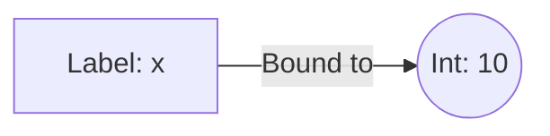

---

### 2.2 — Strings
Strings in Python are immutable; they cannot be changed in place.
#### 💡 The Beginner Analogy: Carved Stone
Imagine carving a word into stone. If you want the word in uppercase, you have to carve a brand new stone.
#### 💻 Code Example & ⚠️ Why It Matters
```python
original = "hello"
modified = original.upper()
```
**Why It Matters**: Forgetting to capture the returned string is a classic bug that leads to functions doing nothing.
#### 🤖 Real-Time AI/ML Use Case
NLP text preprocessing and tokenization. Since strings are immutable, cleaning raw text datasets (lowercasing, stripping HTML tags, regex normalization) always produces new cleaned copies without corrupting the original raw source document audit logs.
#### 🎨 Visual Concept
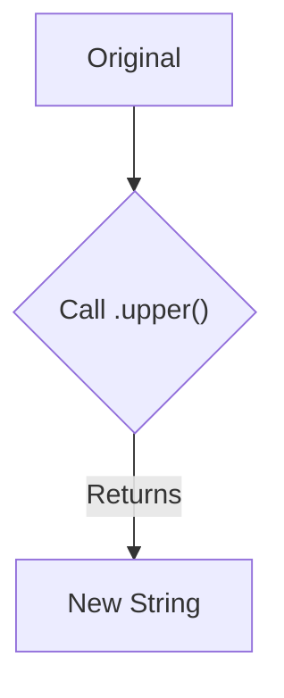

---

### 2.3 — f-strings
Evaluates expressions embedded inside string literals dynamically.
#### 💡 The Beginner Analogy: Mad Libs with Auto-Fill
An f-string is an auto-filling smart form that pulls correct values directly from the environment.
#### 💻 Code Example & ⚠️ Why It Matters
```python
# ❌ TRAP: Forgetting 'f'
bad = "{vendor}"
# ✅ CORRECT
good = f"{vendor}"
```
**Why It Matters**: Forgetting the `f` leads to broken diagnostic logs.
#### 🤖 Real-Time AI/ML Use Case
Dynamic Prompt Construction in RAG (Retrieval-Augmented Generation) and AI Agents (`f"Context: {retrieved_chunks}\nUser Question: {query}"`), as well as real-time training progress telemetry (`f"Epoch {epoch}: Loss={loss:.4f}"`).
#### 🎨 Visual Concept
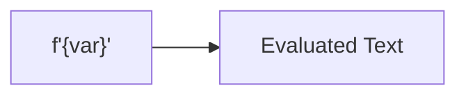

---

### 2.4 — Conditionals
Control flow determining execution based on boolean evaluation (`if`, `elif`, `else`).
#### 💡 The Beginner Analogy: Train Switches
Conditionals are track switches deciding which path a train (the execution) takes based on current signals.
#### 💻 Code Example & ⚠️ Why It Matters
```python
if status == "OPEN":
    pass
elif status == "OVERDUE":
    pass
else:
    pass
```
**Why It Matters**: Indentation dictates scope; mismatched indentation breaks flow.
#### 🤖 Real-Time AI/ML Use Case
Agentic Workflow Routing in frameworks like LangGraph and AutoGen. Branching execution paths based on LLM intent classification (e.g., `if action == "vector_search": query_chromadb()` `elif action == "calculator": run_math_engine()`).
#### 🎨 Visual Concept
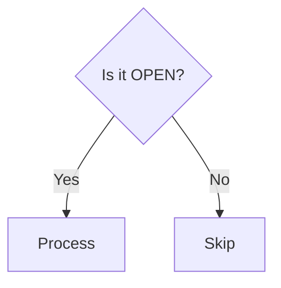

---

### 2.5 — Loops
Iterating over sequences (`for`) or running until a condition fails (`while`).
#### 💡 The Beginner Analogy: Assembly Line
A loop takes a stack of items and places them one by one in front of a worker. `break` stops the line; `continue` skips a damaged item.
#### 💻 Code Example & ⚠️ Why It Matters
```python
for n in nums:
    if n < 0:
        continue # Skip negatives
```
**Why It Matters**: Deeply nested loops cause massive performance drops.
#### 🤖 Real-Time AI/ML Use Case
The core execution engine of Neural Network Training Loops (`for epoch in range(epochs): for batch in dataloader:`), as well as autoregressive token-by-token LLM output generation until an `<EOS>` (End Of Sequence) token is produced.
#### 🎨 Visual Concept
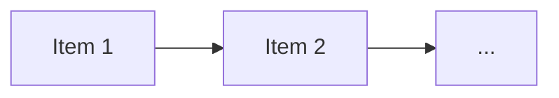

---

### 2.6 — Lists
Ordered, mutable collections that allow duplicate elements.
#### 💡 The Beginner Analogy: A Physical Binder
A binder of paper pages. You can insert a new page in the middle (mutable) or have two identical pages.
#### 💻 Code Example & ⚠️ Why It Matters
```python
lst.sort() # Mutates in-place, returns None
```
**Why It Matters**: Reassigning `x = x.sort()` destroys data by setting `x` to `None`.
#### 🤖 Real-Time AI/ML Use Case
Reinforcement Learning Experience Replay Buffers (storing past transition tuples `(state, action, reward, next_state)`), collecting streaming tokens from an LLM response API, and gathering raw dataset samples prior to tensor conversion.
#### 🎨 Visual Concept
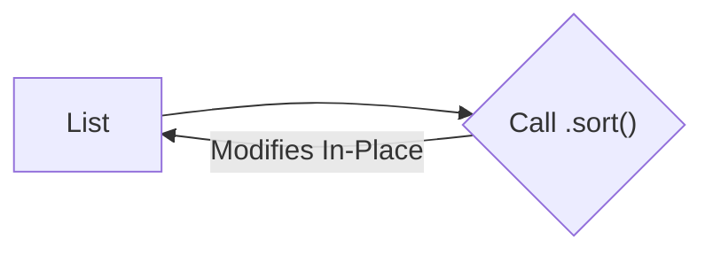

---

### 2.7 — Slicing
Extracting sub-sequences using `[start:stop:step]` syntax.
#### 💡 The Beginner Analogy: A Bread Slicer
Slicing tells the slicer exactly which pieces of the loaf you want, from the 2nd piece to the 5th piece, skipping every other one.
#### 💻 Code Example & ⚠️ Why It Matters
```python
reversed_seq = seq[::-1]
```
**Why It Matters**: Slicing in Python creates copies, but in NumPy (0.6) it creates views. Memory implications differ drastically.
#### 🤖 Real-Time AI/ML Use Case
Computer Vision Image Bounding Box cropping (`image[C, y1:y2, x1:x2]`), splitting dataset rows into Train/Val/Test splits (`X[:8000], X[8000:]`), and truncating prompt token sequences to fit model context window bounds (`tokens[-4096:]`).
#### 🎨 Visual Concept
```mermaid
flowchart LR
    A["[0,1,2,3,4,5]"] -->| [1:4] | B["[1,2,3]"]
```

---

### 2.8 — Tuples
Ordered, immutable collections.
#### 💡 The Beginner Analogy: Sealed Laminate
A tuple is a laminated document. You can read it, but you cannot edit what is inside once sealed.
#### 💻 Code Example & ⚠️ Why It Matters
```python
trap = (42)  # Int
correct = (42,) # Tuple
```
**Why It Matters**: Passing `(42)` instead of `(42,)` to database drivers causes iteration crashes.
#### 🤖 Real-Time AI/ML Use Case
Defining Tensor Dimensions and Layer Shapes in PyTorch/TensorFlow (`tensor.shape -> (batch_size, sequence_length, embedding_dim)`), which must remain immutable structural signatures across model transformations.
#### 🎨 Visual Concept
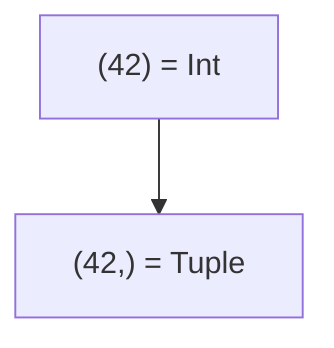

---

### 2.9 — Dicts (Dictionaries)
Key-value maps providing O(1) lookup speed. Keys must be hashable.
#### 💡 The Beginner Analogy: A Coat Check
Hand over a unique tag (Key) to instantly get your coat (Value) without searching the whole room.
#### 💻 Code Example & ⚠️ Why It Matters
```python
# ❌ Lists are unhashable
invalid_dict = {["A"]: 1}
```
**Why It Matters**: Trying to use a `list` as a key instantly crashes.
#### 🤖 Real-Time AI/ML Use Case
PyTorch Model Weights state dictionaries (`model.state_dict()`), JSON parameter payloads sent to OpenAI/Anthropic Tool Calling APIs, and Vector Database metadata storage (storing chunk text alongside filter metadata keys).
#### 🎨 Visual Concept
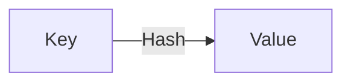

---

### 2.10 — Sets
Unordered collections of unique, hashable elements providing O(1) membership testing.
#### 💡 The Beginner Analogy: VIP Guest List
Writing a name down twice doesn't change anything—they are either on the list or they aren't.
#### 💻 Code Example & ⚠️ Why It Matters
```python
is_present = "apple" in unique_set
```
**Why It Matters**: Scanning a 1M-item list takes huge CPU time. A set takes a fraction of a millisecond.
#### 🤖 Real-Time AI/ML Use Case
Building Token Vocabulary lookup tables in custom tokenizers and large-scale Data Deduplication during dataset pre-training preparation (removing identical document embeddings or web text lines in O(1) time).
#### 🎨 Visual Concept
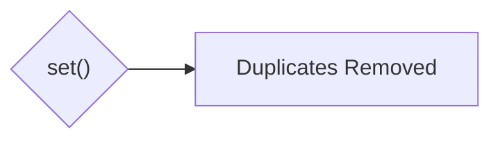

---

### 2.11 — Functions
Reusable blocks of code. `*args` and `**kwargs` allow arbitrary arguments.
#### 💡 The Beginner Analogy: A Subcontractor
A function is a subcontractor: you hand them materials (arguments), they do specialized work, and they hand you back a finished product (return).
#### 💻 Code Example & ⚠️ Why It Matters
```python
def my_func(*args, **kwargs):
    pass
```
**Why It Matters**: Decorators (2.20) depend entirely on functions accepting and forwarding `*args` and `**kwargs`.
#### 🤖 Real-Time AI/ML Use Case
Defining Custom PyTorch Layers & Loss Functions (`def forward(self, x)`), feature transformation functions, and LLM Tool Calls where `**kwargs` safely forwards dynamic API parameter payloads.
#### 🎨 Visual Concept
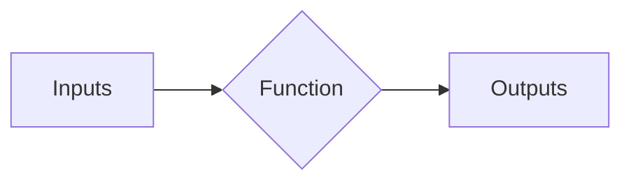

---

### 2.12 — Exception Handling
Gracefully handling runtime errors (`try`/`except`/`finally`).
#### 💡 The Beginner Analogy: A Safety Net
Running code without a try/except is like walking a tightrope without a net. The net catches you so you can land safely instead of crashing to the floor.
#### 💻 Code Example & ⚠️ Why It Matters
```python
try:
    1/0
except ZeroDivisionError:
    pass
```
**Why It Matters**: A bare `except:` swallows `KeyboardInterrupt`, making a process unkillable.
#### 🤖 Real-Time AI/ML Use Case
Production LLM & Vector Database API Resilience. Gracefully catching `RateLimitError` or network timeout exceptions during LLM API calls to trigger exponential backoff retries or fallback to a smaller local model without dropping user sessions.
#### 🎨 Visual Concept
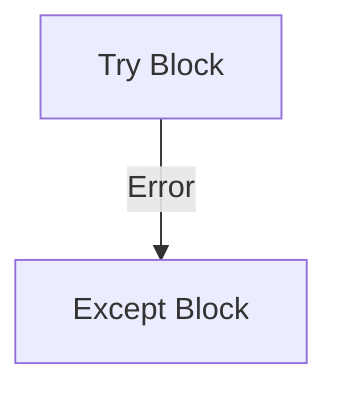

---

### 2.13 — Comprehensions
An expression-level loop construct that constructs a new `list`, `dict`, or `set` in a single readable line.
#### 💡 The Beginner Analogy: Factory Assembly Line Filter
A smart conveyor belt with built-in sensors that filters and transforms items directly into the output box.
#### 💻 Code Example & ⚠️ Why It Matters
```python
open_ids = [r["id"] for r in rows if r["status"] == "OPEN"]
```
**Why It Matters**: Faster because CPython avoids attribute lookup overhead for `.append()`.
#### 🤖 Real-Time AI/ML Use Case
High-speed dataset preprocessing and feature extraction (e.g. cleaning text chunks, filtering out low-confidence predictions `[p for p in predictions if p.score > 0.85]`, or extracting embedding vectors from API response payloads).
#### 🎨 Visual Concept
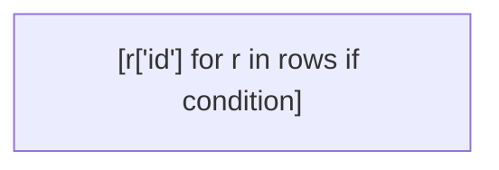

---

### 2.14 — Context Managers (`with` statement)
An object that manages resource setup and teardown automatically.
#### 💡 The Beginner Analogy: Auto-Locking Hotel Room
The instant you step out of the room, the door automatically locks shut behind you (`file.close()`).
#### 💻 Code Example & ⚠️ Why It Matters
```python
with open("data.csv") as f:
    pass
```
**Why It Matters**: Unclosed file handles lead to OS file locks and descriptor exhaustion.
#### 🤖 Real-Time AI/ML Use Case
GPU Memory Management & Inference Optimization (`with torch.no_grad():` to disable gradient calculation and free up VRAM), Mixed Precision Training (`with torch.cuda.amp.autocast():`), and tracking experiment metrics (`with mlflow.start_run():`).
#### 🎨 Visual Concept


---

### 2.15 — `defaultdict`
Subclass of `dict` that auto-creates missing keys.
#### 💡 The Beginner Analogy: Self-Refilling Refreshment Stand
If you request a new key, it automatically creates a fresh empty cup instantly without crashing.
#### 💻 Code Example & ⚠️ Why It Matters
```python
totals = defaultdict(float)
totals["vendor"] += 100.0
```
**Why It Matters**: Eliminates repetitive checking boilerplate.
#### 🤖 Real-Time AI/ML Use Case
Building N-Gram Frequency distributions in language modeling, word frequency counting for TF-IDF / BM25 search engines, and constructing node adjacency lists for Graph Neural Networks (GNNs).
#### 🎨 Visual Concept
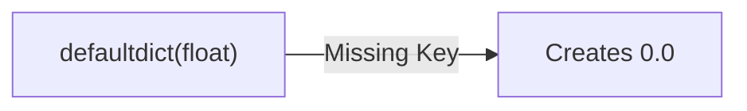

---

### 2.16 — Falsy / `.get()`
Values evaluating to `False` (`""`, `0`, `[]`).
#### 💡 The Beginner Analogy: Empty Envelopes
An empty envelope exists physically but contains nothing.
#### 💻 Code Example & ⚠️ Why It Matters
```python
# ❌ TRAP: .get() defaults don't trigger on empty string values
val1 = row.get("vendor", "UNK")
# ✅ CORRECT for CSV
val2 = row.get("vendor") or "UNK"
```
**Why It Matters**: CSV parsers set missing values to empty strings `""`, rendering `.get()` defaults useless.
#### 🤖 Real-Time AI/ML Use Case
Parsing unstructured or dirty JSON model responses generated by LLMs during structured extraction tasks, ensuring that optional missing or empty string fields don't cause downstream AI pipeline crashes.
#### 🎨 Visual Concept


---

### 2.17 — Lexicographic Ordering
Character-by-character dictionary sorting.
#### 💡 The Beginner Analogy: Alphabetical Phonebook
"150000" comes before "9000" alphabetically because '1' < '9'.
#### 💻 Code Example & ⚠️ Why It Matters
```python
wrong = sorted(["9000.0", "150000.0"])
```
**Why It Matters**: Reading numbers from CSV leaves them as strings, corrupting numeric sorts.
#### 🤖 Real-Time AI/ML Use Case
Loading and sorting model checkpoint files from disk storage (e.g. using zero-padded filenames `model_epoch_002.pt` vs `model_epoch_010.pt` so alphabetical string sorting matches actual numerical training epoch order).
#### 🎨 Visual Concept
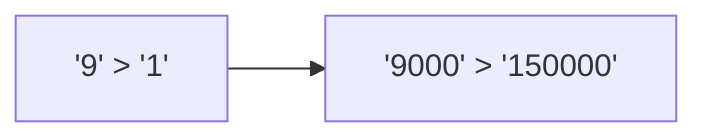

---

### 2.18 — Vectorization
Expressing math over an entire array simultaneously in C.
#### 💡 The Beginner Analogy: Stamp Press vs. Hand Pen
A giant industrial stamp press that stamps 1,000 documents simultaneously.
#### 💻 Code Example & ⚠️ Why It Matters
```python
out_vec = np.array(prices) * 1.18
```
**Why It Matters**: Vectorization delivers 10x-100x speedups.
#### 🤖 Real-Time AI/ML Use Case
The bedrock of Modern Deep Learning & Vector Search. Computing dot-product cosine similarities between 1536-dimensional embedding vectors across millions of documents simultaneously via SIMD / GPU matrix operations (`Q @ K.T`).
#### 🎨 Visual Concept
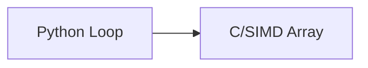

---

### 2.19 — Generators
Memory-efficient iterables that yield one item at a time lazily.
#### 💡 The Beginner Analogy: A Water Hose
Produces water exactly when you turn the nozzle, but once it flows out, it's gone.
#### 💻 Code Example & ⚠️ Why It Matters
```python
gen = (x * 2 for x in range(3))
list(gen)
list(gen) # Empty!
```
**Why It Matters**: Iterating twice quietly yields nothing, creating notoriously difficult bugs.
#### 🤖 Real-Time AI/ML Use Case
Streaming LLM text outputs token-by-token to UI clients (ChatGPT-style response streaming using `yield token`) and streaming multi-terabyte training datasets chunk-by-chunk using PyTorch `DataLoader` generators to prevent out-of-memory (OOM) crashes.
#### 🎨 Visual Concept
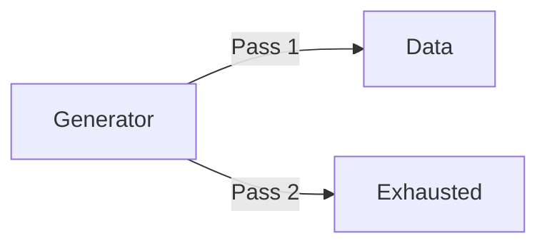

---

### 2.20 — Decorators
Functions that wrap other functions in additional behavior.
#### 💡 The Beginner Analogy: Gift Wrapping
Wrapping a plain box in shiny paper without changing the gift inside.
#### 💻 Code Example & ⚠️ Why It Matters
```python
@log_call
def my_func():
    pass
```
**Why It Matters**: Essential for routing in web frameworks (0.9).
#### 🤖 Real-Time AI/ML Use Case
Wrapping ML evaluation functions with `@torch.no_grad()`, registering AI tools in LangChain/LlamaIndex using `@tool`, serving model inference endpoints via FastAPI `@app.post("/predict")`, and caching embedding results with `@lru_cache`.
#### 🎨 Visual Concept
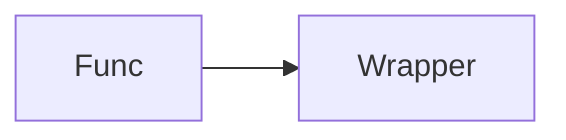

---

### 2.21 — Type Hints
Annotations for expected types, ignored at runtime.
#### 💡 The Beginner Analogy: A Sticky Note Request
A sticky note asking "Blue pens only". It doesn't physically block red pens.
#### 💻 Code Example & ⚠️ Why It Matters
```python
def add(a: int): pass
add("str") # Executes without crash!
```
**Why It Matters**: Believing type hints prevent bad data at runtime leads to insecure APIs.
#### 🤖 Real-Time AI/ML Use Case
Building Pydantic data schemas for LLM Structured Outputs (enforcing structured JSON outputs during function calling and API tool interactions) and validating tensor pipeline signatures in enterprise ML codebases.
#### 🎨 Visual Concept
```mermaid
flowchart LR
    T["Type Hint"] -->|Runtime| I["Ignored!"]
```

---

### 2.22 — `if __name__ == "__main__":`
An execution guard preventing top-level code from running on import.
#### 💡 The Beginner Analogy: Reading vs Acting
A script asking, "Are we on stage right now?"
#### 💻 Code Example & ⚠️ Why It Matters
```python
if __name__ == "__main__":
    main()
```
**Why It Matters**: Missing this breaks pytest by running the application script during test collection.
#### 🤖 Real-Time AI/ML Use Case
Multi-processing protection in PyTorch `DataLoader` worker processes and distributed GPU training. Prevents secondary worker processes spawned for batch data loading from re-executing model initialization or re-triggering dataset downloads.
#### 🎨 Visual Concept
```mermaid
flowchart LR
    I["Import"] --> S["Skips main()"]
```

---

## 3. Skip Test — Answered

> Gate **before** studying. Both correct from memory → skip the topic. Contrast with §7, whose answers are deliberately withheld.

**① Write a function that reads a CSV, filters rows where `amount` > 1000, and returns a list of dicts.**

```python
import csv
from pathlib import Path

def load_and_filter(path: Path, threshold: float = 1000) -> list[dict]:
    with path.open(newline="", encoding="utf-8") as fh:
        return [r for r in csv.DictReader(fh) if float(r["amount"]) > threshold]
```

Three things must be present: `with` (handle closes on exception), `DictReader` (key by name, not position), and `float()` (CSV yields strings — see the Demo 4 output below for what happens without it).

**② Write a `try/except` that catches `FileNotFoundError` and prints a custom message.**

```python
try:
    rows = load_and_filter(Path("invoices.csv"))
except FileNotFoundError:
    print("No invoice file found — create it and re-run.")
```

The load-bearing detail is that the exception is **specific**. A bare `except:` also swallows `KeyboardInterrupt` and `SystemExit`, which is how you get a process that ignores Ctrl-C.

---

## 3. Visual Concept Diagrams

### 3.1 — Comprehension desugaring

A comprehension is not different logic, it is the *same* logic reordered. The expression that was last in the loop body moves to the front.

```mermaid
flowchart LR
    subgraph Loop ["Explicit loop — 4 statements"]
        L1["out = []"] --> L2["for r in rows:"]
        L2 --> L3["if float(r['amount']) > 50000:"]
        L3 --> L4["out.append(r['invoice_id'])"]
    end

    subgraph Comp ["Comprehension — 1 expression"]
        C1["r['invoice_id']<br>the APPEND expression, moved to front"]
        C2["for r in rows"]
        C3["if float(r['amount']) > 50000"]
        C1 --- C2 --- C3
    end

    L4 -.->|"moves to position 1"| C1
    L2 -.->|"unchanged, position 2"| C2
    L3 -.->|"unchanged, position 3"| C3

    style C1 fill:#1b4332,stroke:#40916c,color:#fff
    style L4 fill:#1b4332,stroke:#40916c,color:#fff
    style L1 fill:#6b705c,stroke:#a5a58d,color:#fff
```

### 3.2 — The CSV `.get()` trap

This is the diagram worth internalising, because it contradicts the rule most people carry. `DictReader` **never gives you a missing key** — it gives you an empty string. So the `.get(key, default)` default never fires on CSV data.

```mermaid
flowchart TD
    subgraph SourceA ["Source A: CSV row missing a field"]
        A1["csv.DictWriter writes ''<br>for the absent field"]
        A2["DictReader returns:<br>{'vendor': '', 'amount': '88000'}"]
        A1 --> A2
    end

    subgraph SourceB ["Source B: LLM JSON omitting a field (4.8)"]
        B1["Model simply does not emit the key"]
        B2["Parsed dict:<br>{'amount': '42000'}"]
        B1 --> B2
    end

    A2 --> D1{"row.get('vendor', 'UNK')"}
    B2 --> D2{"row.get('vendor', 'UNK')"}

    D1 --> R1["Returns ''<br>DEFAULT DID NOT FIRE<br>key exists, value is empty"]
    D2 --> R2["Returns 'UNK'<br>DEFAULT FIRED<br>key genuinely absent"]

    R1 --> FIX["Correct idiom for CSV:<br>row.get('vendor') or 'UNK'<br>'' is falsy, so `or` catches both cases"]

    style R1 fill:#9b2226,stroke:#ae2012,color:#fff
    style R2 fill:#2d6a4f,stroke:#52b788,color:#fff
    style FIX fill:#005f73,stroke:#0a9396,color:#fff
```

### 3.3 — Why the loop is slow, and where 0.6 goes next

```mermaid
flowchart LR
    subgraph PyLoop ["Python for-loop + append"]
        P1["Interpreter bytecode<br>per iteration"] --> P2["Attribute lookup<br>out.append EVERY time"]
        P2 --> P3["~100 ms / 2M rows"]
    end

    subgraph PyComp ["List comprehension"]
        Q1["Loop machinery runs in C"] --> Q2["append resolved ONCE"]
        Q2 --> Q3["~95 ms / 2M rows<br>~1.05x — modest"]
    end

    subgraph NumPy ["NumPy boolean mask (0.6)"]
        N1["NO Python-level loop at all"] --> N2["Whole-array op in C/SIMD"]
        N2 --> N3["~4.6 ms / 2M rows<br>~22x — the real win"]
    end

    PyLoop --> PyComp --> NumPy

    style P3 fill:#9b2226,stroke:#ae2012,color:#fff
    style Q3 fill:#6b705c,stroke:#a5a58d,color:#fff
    style N3 fill:#2d6a4f,stroke:#52b788,color:#fff
```

---

## 4. Core Technical Deep Dive

| Idiom | Why it exists | Where it returns |
|---|---|---|
| `pathlib.Path` | Windows dev, Linux deploy — string paths break at the separator | **0.10**, **0.13** |
| `with` context manager | Handle closes even on exception; leaked fds are fatal in a long-lived server | **0.9** |
| List comprehension | The dominant idiom in the source you will read | **Phase 2**, **Phase 6** |
| `dict.get(k, default)` | Missing keys are a normal state in LLM JSON, not a bug | **4.8** |
| `row.get(k) or default` | **CSV-specific** — empty string is falsy, missing-key default is not enough | **2.2** |
| `defaultdict(float)` | Removes accumulator boilerplate | **2.2** feature engineering |
| Specific `except` | Bare `except` swallows `KeyboardInterrupt` | **6.14** typed errors |
| `if __name__ == "__main__"` | Makes the module importable, which pytest requires | **0.5** |

**The `float()` rule.** `csv` returns strings, always. String comparison is lexicographic, so `'9000' > '150000'` evaluates `True` — a silent, plausible-looking wrong answer rather than a crash. Demo 4 below proves it.

---

## 5. Hands-On Script & Verified Output

Run: `python 01_python_basics.py`. Output below is **actual, captured on Python 3.14.4** — not illustrative.

```text
Python 3.14.4
====================================================================
DEMO 1 — Variables (No type declaration needed, Python infers)
====================================================================
  x = 10   -> int
  x = 10.0 -> float
====================================================================
DEMO 2 — Strings (Immutable, every method returns a new string)
====================================================================
  original string : 'hello'
  after .upper()  : 'hello'  <- unchanged
  returned string : 'HELLO'
====================================================================
DEMO 3 — f-strings (The modern string formatting)
====================================================================
  Forgot 'f' prefix : '{vendor} owes {amount}'
  Correct f-string  : 'Acme owes 51,000'
====================================================================
DEMO 4 — Conditionals (if / elif / else)
====================================================================
  status is 'OVERDUE'
  -> ALERT: Invoice is overdue!
====================================================================
DEMO 5 — Loops (for / break / continue)
====================================================================
  Processing 10
  Processing 15
  Encountered -1, skipping (continue).
  Processing 20
====================================================================
DEMO 6 — Lists (Ordered, mutable, allows duplicates)
====================================================================
  list.sort() ret: None  <- returns None!
  mutated list   : [1, 2, 3]  <- sorted in-place
====================================================================
DEMO 7 — Slicing ([start:stop:step])
====================================================================
  seq[1:4] : [1, 2, 3]  <- excludes stop index 4
  seq[::-1]: [5, 4, 3, 2, 1, 0]  <- reverses the list
====================================================================
DEMO 8 — Tuples (Ordered, immutable, single element trap)
====================================================================
  (42)  type is : int
  (42,) type is : tuple
====================================================================
DEMO 9 — Dicts (Key-value pairs, hashable keys only)
====================================================================
  Tuple as key  : {('INV', 101): 'OPEN'}
  List as key   : raised TypeError(cannot use 'list' as a dict key (unhashable type: 'list'))
====================================================================
DEMO 10 — Sets (Unordered, unique elements, O(1) lookup)
====================================================================
  deduplicated  : ['apple', 'banana', 'orange']  <- duplicates removed
  'apple' in set: True  <- O(1) check
====================================================================
DEMO 11 — Functions & Arguments (*args, **kwargs)
====================================================================
  args  : (1, 2)
  kwargs: {'name': 'Acme', 'status': 'OPEN'}
====================================================================
DEMO 12 — Exception Handling (try / except / finally)
====================================================================
  Caught specific error: ZeroDivisionError
  Cleanup happens regardless of errors.
====================================================================
DEMO 13 — Comprehensions (vs explicit loop)
====================================================================
  loop  : ['INV-001', 'INV-003', 'INV-004', 'INV-005', 'INV-006']
  comp  : ['INV-001', 'INV-003', 'INV-004', 'INV-005', 'INV-006']
  identical? True
====================================================================
DEMO 14 — Context Managers (with guarantees cleanup)
====================================================================
  File created. After 'with' block, f.closed is: True
====================================================================
DEMO 15 — defaultdict (removes accumulator boilerplate)
====================================================================
  auto totals : {'Acme': 123000.0, 'Beta': 72000.0, 'Gamma': 150000.0, 'UNKNOWN': 88000.0}
====================================================================
DEMO 16 — Falsy / .get() (The CSV empty string trap)
====================================================================
  csv row              : {'invoice_id': 'INV-006', 'vendor': '', 'amount': '88000', 'status': 'OPEN'}
  .get('vendor','UNK') : ''  <- default did NOT fire
  .get('vendor') or UNK: 'UNK'  <- correct for CSV
====================================================================
DEMO 17 — Lexicographic Ordering (Sorting numbers as strings)
====================================================================
  sorted as strings   : ['9000', '88000', '72000', '63000', '51000', '150000']
  sorted as floats    : [150000, 88000, 72000, 63000, 51000, 9000]
  '9000' > '150000' ? True   <- TRUE!
====================================================================
DEMO 18 — Vectorization (Preview of 0.6)
====================================================================
  rows scanned      : 2,000,000
  list comprehension:    95.0 ms
  numpy mask        :     6.5 ms
  speedup vs comp   : 14.7x
====================================================================
DEMO 19 — Generators (Lazy iteration, can only iterate once)
====================================================================
  first iteration : [0, 2, 4]
  second iteration: []  <- exhausted, yields nothing!
====================================================================
DEMO 20 — Decorators (Wrap function behavior)
====================================================================
  [LOG] Calling process_invoice...
  Processing...
====================================================================
DEMO 21 — Type hints (Documentation, not enforcement)
====================================================================
  add_numbers('hello', ' world') -> 'hello world'
====================================================================
DEMO 22 — if __name__ == '__main__': (Makes scripts importable)
====================================================================
  Current __name__ is: '__main__'
```

**Read Demo 17 carefully.** `'9000'` sorts *above* `'150000'` because `'9'` > `'1'` at the first character. Nothing raises. A report built on that ranking is simply wrong, and nobody notices until someone questions the numbers.

**Read Demo 5 honestly.** The comprehension is only ~1.05x faster — both still loop in Python. The 22x figure comes from NumPy removing the Python-level loop entirely. Comprehensions are for *readability*; **0.6** is where the performance argument actually lives.

**Modify and re-run** (this is the practice step, not optional):
- Change the Demo 1 threshold to `100_000` and predict the output before running.
- Delete `float()` from Demo 1's filter and predict what happens. Then run it.
- Add a row with `amount` = `"abc"` and see which demo breaks first, and how.

---

## 6. Video

**Corey Schafer — Python tutorials** — [youtube.com/@coreyms](https://www.youtube.com/@coreyms). The standard recommendation at this level: idiomatic, no filler, one topic per video.

A specific beginner-Python video title and current URL is **[VERIFY]** — the OOP series used in 0.2 was confirmed live, but an individual basics video was not verified for this pass. Search the channel directly rather than trusting a guessed link.

---

## 7. Retrieval Checkpoint — Unanswered

> Gate **after** studying. Close this file. No notes. Answers deliberately not given here.

1. Rewrite as a single comprehension: `out = []` / `for r in rows:` / `if r["status"] == "OPEN":` / `out.append(r["id"])`
2. A CSV row is missing the `vendor` column. Does `row.get("vendor", "UNKNOWN")` return `"UNKNOWN"`? Explain your answer and give the idiom that does work.
3. Why does `if __name__ == "__main__":` exist, and what specifically breaks in **0.5** without it?

---

## 8. Closed-Book Rebuild

With this file **and** the script closed, write from scratch: read a CSV of invoices, filter above a threshold using a comprehension, group totals by vendor using `defaultdict`, handle the missing-vendor case with the CSV-correct idiom, sort descending, and catch the missing-file case with a specific exception.

---

---

## Review again in

**7 days** — low conceptual density, high mechanical familiarity. If the Closed-Book Rebuild takes under 15 minutes with no lookups, mark 0.1 done and do not revisit. The one item genuinely worth retaining is the CSV `.get()` trap from §2.16.
