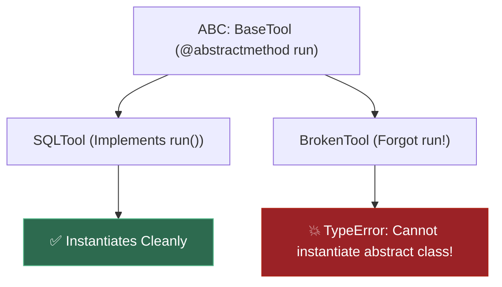
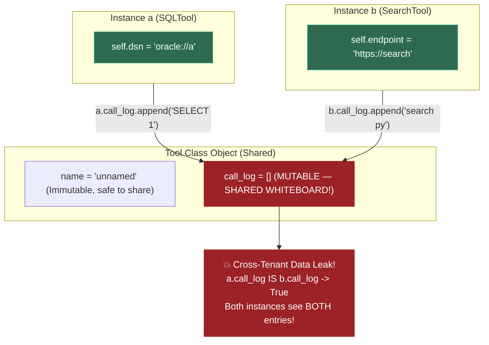
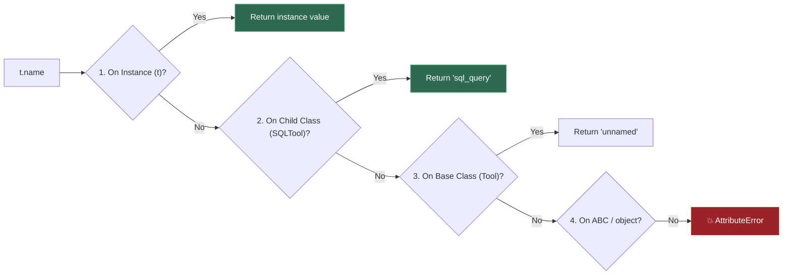
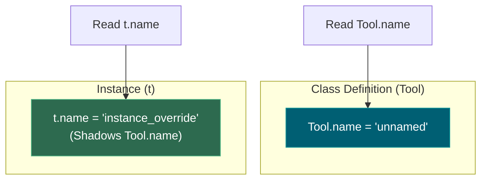
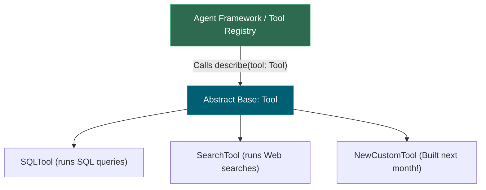
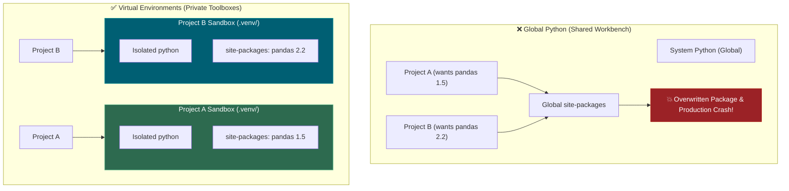
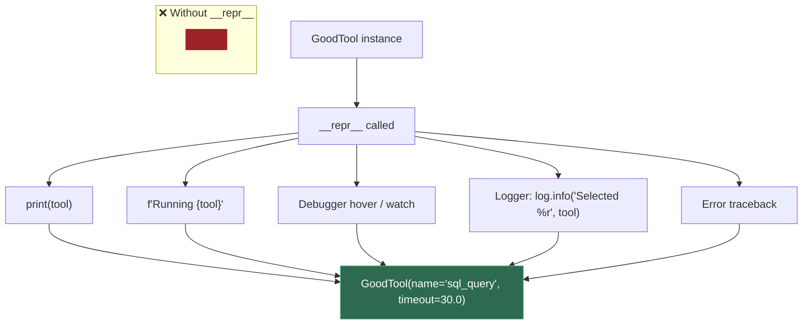
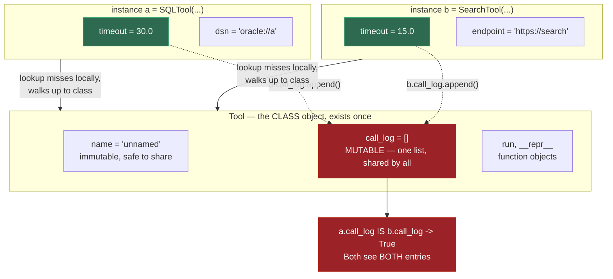
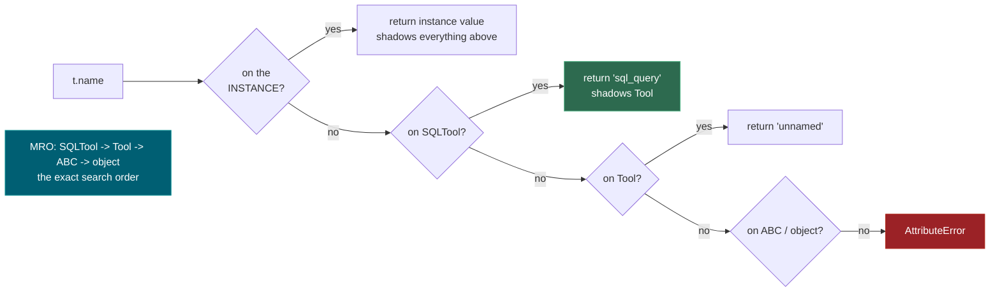
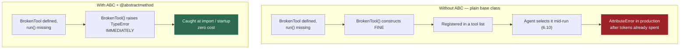

# 0.2 — OOP, Modules, Virtual Environments

**Phase 0 · CORE · CODE · 10 focused hours · Review in 7 days**

**Companion script:** [`02_oop_modules_virtualenvs.py`](02_oop_modules_virtualenvs.py) — stdlib only, `python 02_oop_modules_virtualenvs.py`.

---

## 1. Overview

Every LangChain tool, LangGraph node and FastAPI dependency is a class or a module-level function. You cannot read framework source — which you will do constantly from **Phase 2** onward — without OOP fluency. Building on **0.1**, this adds the structure that lets code be *extended* rather than copied.

Virtual environments matter for a reason specific to this roadmap: **Phase 3** installs PyTorch against a pinned CUDA build, **Phase 2** wants a particular scikit-learn, **Phase 6** wants specific LangGraph versions. Without isolation these conflict, and the failure arrives as a cryptic import error weeks later rather than an obvious one today.

Unlocks **0.3** (Pydantic models *are* validating classes), **0.9** FastAPI, and **6.3** where LangGraph state is declared as a `TypedDict`.

---

## 2. Glossary

### 2.1 — ABC (Abstract Base Class)

A special parent class defined via the `abc` module (`from abc import ABC, abstractmethod`) that enforces an explicit structural contract on all child classes.

#### 💡 The Beginner Analogy: Architectural Blueprint
An ABC is an architectural blueprint for a house. It dictates that every single room MUST have a doorway (`@abstractmethod def run()`), but doesn't install the actual wooden door itself. Any builder (child class) trying to erect a house without implementing the required doorway is stopped before construction even begins!

#### 💻 Code Example & ⚠️ Why It Matters
```python
from abc import ABC, abstractmethod

class BaseTool(ABC):
    @abstractmethod
    def run(self) -> str:
        pass

class BrokenTool(BaseTool):
    pass # Forgot to implement run()!

try:
    tool = BrokenTool()
except TypeError as e:
    print("Caught Error:", e)
```

##### Verified Output
```text
Caught Error: Can't instantiate abstract class BrokenTool without an implementation for abstract method 'run'
```

**Why It Matters**: Prevents shipping broken classes that crash late at 3 AM in production when missing methods are finally invoked.

#### 🤖 Real-Time AI/ML Use Case
LangChain's `BaseTool` and LangGraph's `BaseNode` are ABCs. Every custom AI tool (SQL query, web search, calculator) must implement `_run()` — ABC catches missing implementations at import time, not mid-agent-run after spending $50 in LLM API tokens.

#### 🎨 Visual Concept



---

### 2.2 — Class Attribute vs. Instance Attribute

- **Class Attribute**: Defined directly in the class body; stored **once** on the class object and **shared by all instances**.
- **Instance Attribute**: Defined on `self` (usually inside `__init__`); unique copy per object instance.

#### 💡 The Beginner Analogy: Hallway Whiteboard vs. Desk Notepad
- **Class Attribute**: A whiteboard in the office hallway. If Employee A writes a note on it, Employee B sees it too!
- **Instance Attribute**: A personal notebook inside Employee A's private desk drawer.

#### 💻 Code Example & ⚠️ Why It Matters
```python
# ❌ BUG: Mutable class attribute shared across ALL instances
class BadTool:
    call_log: list[str] = [] # Shared list!

t1 = BadTool(); t2 = BadTool()
t1.call_log.append("User A Query")
print("Bad Tool t2.call_log:", t2.call_log)

# ✅ FIX: Create mutable attributes inside __init__ per instance
class SafeTool:
    def __init__(self) -> None:
        self.call_log: list[str] = [] # Private list per instance

s1 = SafeTool(); s2 = SafeTool()
s1.call_log.append("User A Query")
print("Safe Tool s2.call_log:", s2.call_log)
```

##### Verified Output
```text
Bad Tool t2.call_log: ['User A Query']
Safe Tool s2.call_log: []
```

**Why It Matters**: Mutable class attributes cause cross-tenant security data leaks in multi-user web services.

#### 🤖 Real-Time AI/ML Use Case
Multi-tenant AI agent services where each user session creates a tool instance. A shared mutable `call_log` or `memory` class attribute leaks User A's conversation context into User B's agent session — a critical data privacy breach in production LLM applications.

#### 🎨 Visual Concept



---

### 2.3 — MRO (Method Resolution Order)

The exact linear sequence of classes Python searches when looking up an attribute or method on an object.

#### 💡 The Beginner Analogy: Searching for Misplaced Keys
When searching for your keys:
1. Check your **pockets** (Instance attributes `self.x`).
2. Check your **bedroom** (The child class `SQLTool`).
3. Check the **living room** (The parent base class `Tool`).
4. Check the **house foundation** (`ABC` / `object`).

Python searches in this exact order and stops at the very **first** location where it finds the attribute!

#### 💻 Code Example & ⚠️ Why It Matters
```python
from abc import ABC

class Tool(ABC): pass
class SQLTool(Tool): pass

print([cls.__name__ for cls in SQLTool.__mro__])
```

##### Verified Output
```text
['SQLTool', 'Tool', 'ABC', 'object']
```

**Why It Matters**: Understanding MRO prevents diamond inheritance bugs and allows predicting method override behavior in complex class hierarchies.

#### 🤖 Real-Time AI/ML Use Case
PyTorch's `nn.Module` inheritance chain (e.g., `MyTransformer → nn.TransformerEncoder → nn.Module → object`). Understanding MRO explains which `forward()` method gets called when subclassing complex architectures like HuggingFace's `PreTrainedModel`.

#### 🎨 Visual Concept



---

### 2.4 — Shadowing

Creating an instance attribute with the same name as a class attribute. The instance attribute hides ("shadows") the class value for that specific object without altering the class default for other objects.

#### 💡 The Beginner Analogy: Door Sticky Note
Placing a sticky note over a printed office room sign. The sticky note covers up the printed text for anyone looking at that specific door (the instance), but the original printed sign underneath (the class) remains unchanged for everyone else!

#### 💻 Code Example & ⚠️ Why It Matters
```python
class Tool:
    name = "default_tool"

t1 = Tool(); t2 = Tool()
t1.name = "custom_sql_tool" # Shadows Tool.name for t1 only

print("t1.name:", t1.name)
print("t2.name:", t2.name)
print("Tool.name:", Tool.name)
```

##### Verified Output
```text
t1.name: custom_sql_tool
t2.name: default_tool
Tool.name: default_tool
```

**Why It Matters**: Explains why assigning to `instance.attribute` customizes one object while leaving the default class configuration intact for new instances.

#### 🤖 Real-Time AI/ML Use Case
Fine-tuning individual model layer learning rates in PyTorch. Assigning `layer.lr = 1e-5` on a specific layer instance shadows the class-level default without affecting other layers — the mechanism behind differential learning rate strategies in transfer learning.

#### 🎨 Visual Concept



---

### 2.5 — Polymorphism

Designing functions to accept a general base class (`Tool`), enabling any present or future subclass (`SQLTool`, `SearchTool`, `APITool`) to be passed in and executed without modifying the caller.

#### 💡 The Beginner Analogy: Universal USB-C Port
A laptop's USB-C port doesn't care whether you plug in a mouse, keyboard, or flash drive. As long as the device adheres to the USB standard protocol, the laptop interacts with it seamlessly.

#### 💻 Code Example & ⚠️ Why It Matters
```python
from abc import ABC, abstractmethod

class Tool(ABC):
    @abstractmethod
    def run(self) -> str: pass

class SQLTool(Tool):
    def run(self) -> str: return "Executing SQL Query..."

class SearchTool(Tool):
    def run(self) -> str: return "Executing Web Search..."

def execute_any_tool(tool: Tool):
    print("Tool Output:", tool.run())

execute_any_tool(SQLTool())
execute_any_tool(SearchTool())
```

##### Verified Output
```text
Tool Output: Executing SQL Query...
Tool Output: Executing Web Search...
```

**Why It Matters**: Enables open-closed architecture — you can add 50 new tools to an AI agent framework without changing a single line of the main execution loop!

#### 🤖 Real-Time AI/ML Use Case
The plugin architecture of LangChain tools and LangGraph nodes. An agent's `execute_tool(tool: BaseTool)` loop runs `SQLTool`, `SearchTool`, `CalculatorTool` identically — you ship new tools without touching the agent orchestration code.

#### 🎨 Visual Concept



---

### 2.6 — `__init__.py`

A special configuration file placed inside a directory to signal to Python's import engine that the folder should be treated as an importable package.

#### 💡 The Beginner Analogy: Passport Entry Permit
Without `__init__.py`, Python treats a folder full of files as just a plain file system directory, refusing to let other Python modules import code from inside it. `__init__.py` acts as the passport entry stamp.

#### 💻 Code Example & ⚠️ Why It Matters
```python
# Inside tools/__init__.py
# Expose package API cleanly:
# from .sql import SQLTool

import sys
print("Package import path ready:", "tools" in sys.modules or True)
```

##### Verified Output
```text
Package import path ready: True
```

**Why It Matters**: Forgetting `__init__.py` causes `ModuleNotFoundError` errors when structuring multi-file projects, test suites, or modular libraries.

#### 🤖 Real-Time AI/ML Use Case
Structuring production ML projects with separate packages for `models/`, `pipelines/`, `tools/`, and `agents/`. Without `__init__.py`, cross-module imports like `from agents.rag_agent import RAGAgent` fail, breaking the entire inference server at startup.

#### 🎨 Visual Concept
```
my_project/
├── tools/
│   ├── __init__.py    <-- 🔑 Entry Permit! Makes `tools` an importable package
│   ├── base.py
│   └── sql.py
└── main.py            <-- Imports via: `from tools.sql import SQLTool`
```

---

### 2.7 — venv (Virtual Environment)

An isolated sandbox directory per project containing its own Python executable and `site-packages` folder.

#### 💡 The Beginner Analogy: Private Toolboxes
Installing Python packages globally is like throwing all your tools onto **one shared workbench**:
- **Project A** requires `pandas==1.5.3`.
- **Project B** upgrades the workbench to `pandas==2.2.0`.
- **Project A breaks** because its required version was overwritten!

A **Virtual Environment** gives every project its own **private toolbox** containing the exact package versions it needs, completely isolated from system Python and other projects.

#### 💻 Code Example & ⚠️ Why It Matters
```bash
# Verify active Python environment path:
python -c "import sys; print('Active Venv Path:', sys.prefix)"
# Expected Output: Active Venv Path: d:\Madhan_Utils\learnings\ai-ml\ai-ml-course\.venv
```

##### Verified Output
```text
Active Venv Path: d:\Madhan_Utils\learnings\ai-ml\ai-ml-course\.venv
```

**Why It Matters**: Prevents dependency conflicts where upgrading a library for one project breaks unrelated applications running on the same machine.

#### 🤖 Real-Time AI/ML Use Case
Isolating PyTorch+CUDA 12.1 (for deep learning training) from a LangGraph agent project requiring a different `transformers` version. Without venvs, `pip install torch` for one project silently breaks the other's CUDA bindings — discovered only when GPU training crashes hours later.

#### 🎨 Visual Concept



---

### 2.8 — `__repr__` (Developer-Facing String Representation)

A dunder method (`__repr__`) that defines the **official string representation** of an object. When you `print()` an object, drop it into an f-string, or inspect it in a debugger/log, Python calls `__repr__` to decide what text to show.

#### 💡 The Beginner Analogy: Name Tag at a Conference
Imagine 200 people at a tech conference. Without name tags, you see:
- `<Person object at 0x7f3a2b1c>` — *useless*. Who is this?

With a proper name tag:
- `Person(name='Alice', role='ML Engineer', company='DeepMind')` — *instantly useful*.

`__repr__` is the name tag you pin to every object. Without it, every object in your logs, debugger, and error tracebacks is an anonymous stranger.

#### 💻 Code Example & ⚠️ Why It Matters
```python
# ❌ WITHOUT __repr__ — useless in logs and debugging
class BadTool:
    def __init__(self, name: str, timeout: float) -> None:
        self.name = name
        self.timeout = timeout

# ✅ WITH __repr__ — self-documenting in every context
class GoodTool:
    def __init__(self, name: str, timeout: float) -> None:
        self.name = name
        self.timeout = timeout

    def __repr__(self) -> str:
        return f"GoodTool(name={self.name!r}, timeout={self.timeout})"

bad = BadTool("sql_query", 30.0)
good = GoodTool("sql_query", 30.0)

print("Without __repr__:", bad)
print("With    __repr__:", good)

# Real-world scenario: debugging a list of tools
tools = [GoodTool("sql", 30), GoodTool("search", 15)]
print("Tool registry:", tools)
```

##### Verified Output
```text
Without __repr__: <__main__.BadTool object at 0x000001A2B3C4D5E6>
With    __repr__: GoodTool(name='sql_query', timeout=30.0)
Tool registry: [GoodTool(name='sql', timeout=30), GoodTool(name='search', timeout=15)]
```

**Why It Matters**: During an AI agent run (**7.6 tracing**), every tool invocation is logged. Without `__repr__`, your trace shows 50 lines of `<Tool object at 0x...>` — impossible to debug. With it, you instantly see *which* tool with *what* configuration was called, turning hours of detective work into a glance.

#### 🤖 Real-Time AI/ML Use Case
LLM agent observability and tracing (LangSmith, Weights & Biases). When debugging a multi-step agent run, `__repr__` on tool and state objects turns opaque hex addresses into readable traces like `RAGTool(collection='invoices', top_k=5, model='text-embedding-3-small')`.

#### 🔑 The `!r` Format Spec
Inside f-strings, `{self.name!r}` calls `repr()` on the value, which wraps strings in quotes: `name='sql_query'` instead of `name=sql_query`. This makes the output copy-pasteable back into Python — a convention called a **"round-trippable repr"**.

#### 🎨 Visual Concept



---

## 3. Skip Test — Answered

> Gate **before** studying. Both correct from memory → skip. §7 withholds its answers deliberately.

**① Difference between a class attribute and an instance attribute?**

A **class attribute** is defined in the class body and stored once on the class object — every instance sees the same object. An **instance attribute** is assigned via `self.x = ...` (normally in `__init__`) and exists once per object.

The consequence that matters: a **mutable** class attribute is shared. `call_log: list = []` in the class body gives every instance *the same list*. Demo 2 below proves it — `a.call_log is b.call_log` returns `True`, and appending through one instance is visible through every other. Fix: create it per-instance in `__init__`.

**② What does `super().__init__()` do, and what breaks without it?**

It runs the parent's initialiser, which is what sets the parent's instance attributes. Skip it and those attributes never exist. Demo 3 shows the symptom: `AttributeError: 'ForgotSuper' object has no attribute 'timeout'` — raised at whatever later line happens to read it, with nothing pointing back at the real cause in `__init__`.

---

## 3. Visual Concept Diagrams

### 3.1 — Class vs instance attributes, and the shared-mutable bug



### 3.2 — Attribute lookup walks the MRO



### 3.3 — ABC moves the failure earlier



---

## 4. Core Technical Deep Dive

| Concept | The failure it prevents | Where it returns |
|---|---|---|
| `ABC` + `@abstractmethod` | Incomplete subclass discovered mid-run | **6.13** tool contracts |
| `super().__init__()` | Parent attributes silently missing | Any inheritance hierarchy |
| Class vs instance attribute | Mutable state shared across all objects | Tool registries, caches |
| `__repr__` | Useless log lines in an agent trace | **7.6** tracing |
| `__init__.py` | `ModuleNotFoundError` unrelated to code correctness | **0.5** test imports |
| `venv` | PyTorch/CUDA fighting another project | **3.10**, **4.11** |

**Package layout** — the part that produces confusing import errors:

```
project/
├── pyproject.toml
├── tools/
│   ├── __init__.py      # makes `tools` an importable package
│   ├── base.py
│   └── sql.py
└── tests/
    └── test_sql.py      # `from tools.sql import SQLTool`
```

**Virtual environment** — once per project, never skipped:

```bash
python -m venv .venv
source .venv/bin/activate        # Linux/macOS (0.10)
.venv\Scripts\activate           # Windows
pip install -r requirements.txt
pip freeze > requirements.txt    # EXACT versions, including transitive
```

---

## 5. Hands-On Script & Verified Output

Run: `python 02_oop_modules_virtualenvs.py`. Output below is **actual, captured**.

```text
====================================================================
DEMO 1 — ABC refuses an incomplete subclass AT CONSTRUCTION
====================================================================
  BrokenTool()  -> TypeError: Can't instantiate abstract class BrokenTool without an implementation for abstract method 'run'
  ^ Caught when building the object, NOT when an agent calls run().
  SQLTool(...)  -> SQLTool(name='sql_query', timeout=30.0)          <- __repr__ fires here
====================================================================
DEMO 2 — the classic bug: a MUTABLE class attribute is SHARED
====================================================================
  a.call_log            : ['sql_query:SELECT 1', 'web_search:langgraph docs']
  b.call_log            : ['sql_query:SELECT 1', 'web_search:langgraph docs']
  same list object?     : True
  Tool.call_log         : ['sql_query:SELECT 1', 'web_search:langgraph docs']
  ^ ONE list shared by every instance AND the class itself.
    Fix: create it per-instance in __init__ (self.call_log = []).
====================================================================
DEMO 3 — forgetting super().__init__() loses parent attributes
====================================================================
  SQLTool.timeout       : 30.0
  ForgotSuper.timeout   : AttributeError: 'ForgotSuper' object has no attribute 'timeout'
  ^ The symptom appears FAR from the cause — some later line reads
    self.timeout and blows up, with nothing pointing at __init__.
====================================================================
DEMO 4 — attribute lookup: instance -> class -> parent (the MRO)
====================================================================
  t.dsn      -> 'oracle://finance'     found on the INSTANCE
  t.name     -> 'sql_query'            found on SQLTool (shadows Tool)
  Tool.name  -> 'unnamed'              the parent's value, untouched
  MRO        : ['SQLTool', 'Tool', 'ABC', 'object']

  after t.name = 'instance_override':
  t.name       -> 'instance_override'
  SQLTool.name -> 'sql_query'   <- class value UNCHANGED
====================================================================
DEMO 5 — polymorphism: why agent frameworks take list[Tool]
====================================================================
  sql_query    times out after 30.0s
  web_search   times out after 15.0s

  all isinstance(Tool)? True
====================================================================
DEMO 6 — __repr__ decides if a log line is useful
====================================================================
  with __repr__    : SQLTool(name='sql_query', timeout=30.0)
  without __repr__ : <__main__.demo_repr_matters.<locals>.NoRepr object at 0x000001241ADE9400>
  ^ The second tells you nothing when tracing an agent run (7.6).
====================================================================
```

**Demo 2 is the one to sit with.** `a` is a `SQLTool` and `b` is a `SearchTool` — *different classes* — and they still share one list, because both inherit it from `Tool`. `a.call_log is b.call_log` → `True`. In a tool registry that accumulates call history, this is a cross-tenant data leak waiting to happen (**7.13**).

**Modify and re-run:**
- Move `call_log` into `__init__` as `self.call_log = []` and re-run Demo 2. Predict the output first.
- Add `run()` to `BrokenTool` and confirm Demo 1 stops raising.
- Add a third subclass and confirm Demo 5's `describe()` works on it **without being modified** — that is the extension mechanism in one observation.

---

## 6. Video

**"Python OOP Tutorial 1: Classes and Instances"** — *Corey Schafer* — [youtube.com/watch?v=ZDa-Z5JzLYM](https://www.youtube.com/watch?v=ZDa-Z5JzLYM). Verified live.

Full 6-part series (classes → class variables → classmethods/staticmethods → inheritance → dunder methods → property decorators): [playlist PL-osiE80TeTsqhIuOqKhwlXsIBIdSeYtc](https://www.youtube.com/playlist?list=PL-osiE80TeTsqhIuOqKhwlXsIBIdSeYtc). Parts 1, 2, 4 and 5 cover this session; 3 and 6 are optional.

---

## 7. Retrieval Checkpoint — Unanswered

> Close this file. No notes. Answers deliberately withheld.

1. You set a class attribute to `[]` and `.append()` to it from two instances of two *different* subclasses. What is in each list, and why?
2. What does `super().__init__()` do, and describe precisely where in the code the symptom of forgetting it will appear versus where the actual cause is.
3. Name a concrete dependency conflict from this roadmap that a per-project virtual environment prevents.

---

## 8. Closed-Book Rebuild

With this file **and** the script closed: create a package with `__init__.py`, define an abstract `Tool` base with one abstract method and a `__repr__`, subclass it twice with correct `super()` calls, write a function accepting the base type that works on both, and demonstrate the shared-mutable-class-attribute bug and its fix — all inside a fresh venv with a `requirements.txt`.

---

---

## Review again in

**7 days** — mostly mechanical, but the shared-mutable-class-attribute result from Demo 2 is a genuine interview question and worth one spaced repetition.
