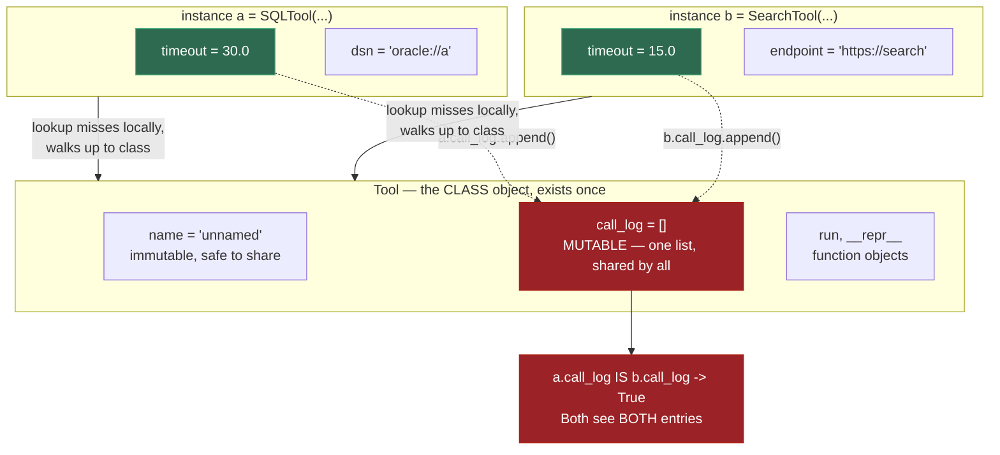
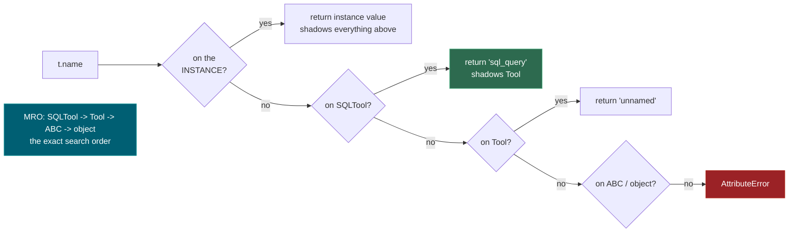
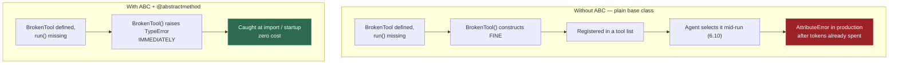

# 0.2 — OOP, Modules, Virtual Environments

**Phase 0 · CORE · CODE · 10 focused hours · Review in 7 days**

**Companion script:** [`02_oop_modules_virtualenvs.py`](02_oop_modules_virtualenvs.py) — stdlib only, `python 02_oop_modules_virtualenvs.py`.

---

## 1. Overview

Every LangChain tool, LangGraph node and FastAPI dependency is a class or a module-level function. You cannot read framework source — which you will do constantly from **Phase 2** onward — without OOP fluency. Building on **0.1**, this adds the structure that lets code be *extended* rather than copied.

Virtual environments matter for a reason specific to this roadmap: **Phase 3** installs PyTorch against a pinned CUDA build, **Phase 2** wants a particular scikit-learn, **Phase 6** wants specific LangGraph versions. Without isolation these conflict, and the failure arrives as a cryptic import error weeks later rather than an obvious one today.

Unlocks **0.3** (Pydantic models *are* validating classes), **0.9** FastAPI, and **6.3** where LangGraph state is declared as a `TypedDict`.

---

## 2. Skip Test — Answered

> Gate **before** studying. Both correct from memory → skip. §7 withholds its answers deliberately.

**① Difference between a class attribute and an instance attribute?**

A **class attribute** is defined in the class body and stored once on the class object — every instance sees the same object. An **instance attribute** is assigned via `self.x = ...` (normally in `__init__`) and exists once per object.

The consequence that matters: a **mutable** class attribute is shared. `call_log: list = []` in the class body gives every instance *the same list*. Demo 2 below proves it — `a.call_log is b.call_log` returns `True`, and appending through one instance is visible through every other. Fix: create it per-instance in `__init__`.

**② What does `super().__init__()` do, and what breaks without it?**

It runs the parent's initialiser, which is what sets the parent's instance attributes. Skip it and those attributes never exist. Demo 3 shows the symptom: `AttributeError: 'ForgotSuper' object has no attribute 'timeout'` — raised at whatever later line happens to read it, with nothing pointing back at the real cause in `__init__`.

---

## 3. Visual Concept Diagrams

### 3.1 — Class vs instance attributes, and the shared-mutable bug



### 3.2 — Attribute lookup walks the MRO



### 3.3 — ABC moves the failure earlier



---

## 4. Core Technical Deep Dive

| Concept | The failure it prevents | Where it returns |
|---|---|---|
| `ABC` + `@abstractmethod` | Incomplete subclass discovered mid-run | **6.13** tool contracts |
| `super().__init__()` | Parent attributes silently missing | Any inheritance hierarchy |
| Class vs instance attribute | Mutable state shared across all objects | Tool registries, caches |
| `__repr__` | Useless log lines in an agent trace | **7.6** tracing |
| `__init__.py` | `ModuleNotFoundError` unrelated to code correctness | **0.5** test imports |
| `venv` | PyTorch/CUDA fighting another project | **3.10**, **4.11** |

**Package layout** — the part that produces confusing import errors:

```
project/
├── pyproject.toml
├── tools/
│   ├── __init__.py      # makes `tools` an importable package
│   ├── base.py
│   └── sql.py
└── tests/
    └── test_sql.py      # `from tools.sql import SQLTool`
```

**Virtual environment** — once per project, never skipped:

```bash
python -m venv .venv
source .venv/bin/activate        # Linux/macOS (0.10)
.venv\Scripts\activate           # Windows
pip install -r requirements.txt
pip freeze > requirements.txt    # EXACT versions, including transitive
```

---

## 5. Hands-On Script & Verified Output

Run: `python 02_oop_modules_virtualenvs.py`. Output below is **actual, captured**.

```text
====================================================================
DEMO 1 — ABC refuses an incomplete subclass AT CONSTRUCTION
====================================================================
  BrokenTool()  -> TypeError: Can't instantiate abstract class BrokenTool without an implementation for abstract method 'run'
  ^ Caught when building the object, NOT when an agent calls run().
  SQLTool(...)  -> SQLTool(name='sql_query', timeout=30.0)          <- __repr__ fires here
====================================================================
DEMO 2 — the classic bug: a MUTABLE class attribute is SHARED
====================================================================
  a.call_log            : ['sql_query:SELECT 1', 'web_search:langgraph docs']
  b.call_log            : ['sql_query:SELECT 1', 'web_search:langgraph docs']
  same list object?     : True
  Tool.call_log         : ['sql_query:SELECT 1', 'web_search:langgraph docs']
  ^ ONE list shared by every instance AND the class itself.
    Fix: create it per-instance in __init__ (self.call_log = []).
====================================================================
DEMO 3 — forgetting super().__init__() loses parent attributes
====================================================================
  SQLTool.timeout       : 30.0
  ForgotSuper.timeout   : AttributeError: 'ForgotSuper' object has no attribute 'timeout'
  ^ The symptom appears FAR from the cause — some later line reads
    self.timeout and blows up, with nothing pointing at __init__.
====================================================================
DEMO 4 — attribute lookup: instance -> class -> parent (the MRO)
====================================================================
  t.dsn      -> 'oracle://finance'     found on the INSTANCE
  t.name     -> 'sql_query'            found on SQLTool (shadows Tool)
  Tool.name  -> 'unnamed'              the parent's value, untouched
  MRO        : ['SQLTool', 'Tool', 'ABC', 'object']

  after t.name = 'instance_override':
  t.name       -> 'instance_override'
  SQLTool.name -> 'sql_query'   <- class value UNCHANGED
====================================================================
DEMO 5 — polymorphism: why agent frameworks take list[Tool]
====================================================================
  sql_query    times out after 30.0s
  web_search   times out after 15.0s

  all isinstance(Tool)? True
====================================================================
DEMO 6 — __repr__ decides if a log line is useful
====================================================================
  with __repr__    : SQLTool(name='sql_query', timeout=30.0)
  without __repr__ : <__main__.demo_repr_matters.<locals>.NoRepr object at 0x000001241ADE9400>
  ^ The second tells you nothing when tracing an agent run (7.6).
====================================================================
```

**Demo 2 is the one to sit with.** `a` is a `SQLTool` and `b` is a `SearchTool` — *different classes* — and they still share one list, because both inherit it from `Tool`. `a.call_log is b.call_log` → `True`. In a tool registry that accumulates call history, this is a cross-tenant data leak waiting to happen (**7.13**).

**Modify and re-run:**
- Move `call_log` into `__init__` as `self.call_log = []` and re-run Demo 2. Predict the output first.
- Add `run()` to `BrokenTool` and confirm Demo 1 stops raising.
- Add a third subclass and confirm Demo 5's `describe()` works on it **without being modified** — that is the extension mechanism in one observation.

---

## 6. Video

**"Python OOP Tutorial 1: Classes and Instances"** — *Corey Schafer* — [youtube.com/watch?v=ZDa-Z5JzLYM](https://www.youtube.com/watch?v=ZDa-Z5JzLYM). Verified live.

Full 6-part series (classes → class variables → classmethods/staticmethods → inheritance → dunder methods → property decorators): [playlist PL-osiE80TeTsqhIuOqKhwlXsIBIdSeYtc](https://www.youtube.com/playlist?list=PL-osiE80TeTsqhIuOqKhwlXsIBIdSeYtc). Parts 1, 2, 4 and 5 cover this session; 3 and 6 are optional.

---

## 7. Retrieval Checkpoint — Unanswered

> Close this file. No notes. Answers deliberately withheld.

1. You set a class attribute to `[]` and `.append()` to it from two instances of two *different* subclasses. What is in each list, and why?
2. What does `super().__init__()` do, and describe precisely where in the code the symptom of forgetting it will appear versus where the actual cause is.
3. Name a concrete dependency conflict from this roadmap that a per-project virtual environment prevents.

---

## 8. Closed-Book Rebuild

With this file **and** the script closed: create a package with `__init__.py`, define an abstract `Tool` base with one abstract method and a `__repr__`, subclass it twice with correct `super()` calls, write a function accepting the base type that works on both, and demonstrate the shared-mutable-class-attribute bug and its fix — all inside a fresh venv with a `requirements.txt`.

---

## 9. Glossary

**ABC (Abstract Base Class)** — a class that cannot be instantiated directly and whose `@abstractmethod`s must be implemented by subclasses. Moves "you forgot a method" from runtime to construction time.

**Class attribute** — defined in the class body, stored once on the class object, shared by all instances. Safe when immutable, a bug source when mutable.

**Instance attribute** — assigned via `self.x`, one copy per object.

**MRO (Method Resolution Order)** — the linearised sequence of classes Python searches for an attribute. Readable via `type(obj).__mro__`.

**Shadowing** — a name found earlier in the MRO hiding the same name later. Assigning `t.name` on an instance shadows the class value without changing it.

**Polymorphism** — code written against a base type working unmodified with any subclass, including ones that do not exist yet. The mechanism behind `list[Tool]` in agent frameworks.

**`__init__.py`** — marks a directory as an importable package. Its absence causes `ModuleNotFoundError` that has nothing to do with the code being wrong.

**venv** — an isolated interpreter and `site-packages` per project, so version pins do not collide across projects.

---

## Review again in

**7 days** — mostly mechanical, but the shared-mutable-class-attribute result from Demo 2 is a genuine interview question and worth one spaced repetition.
