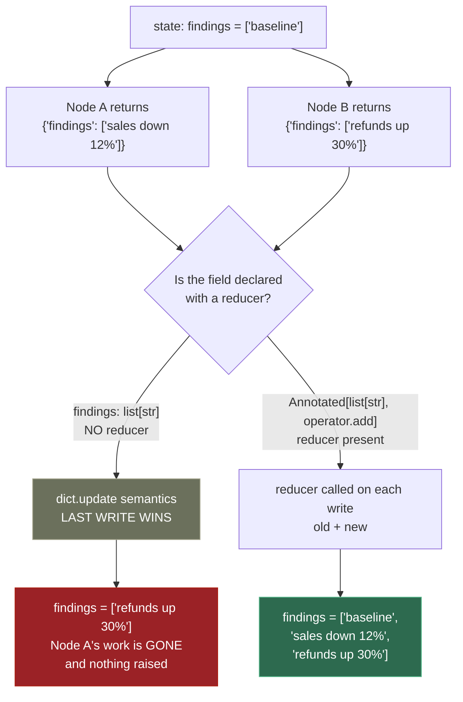
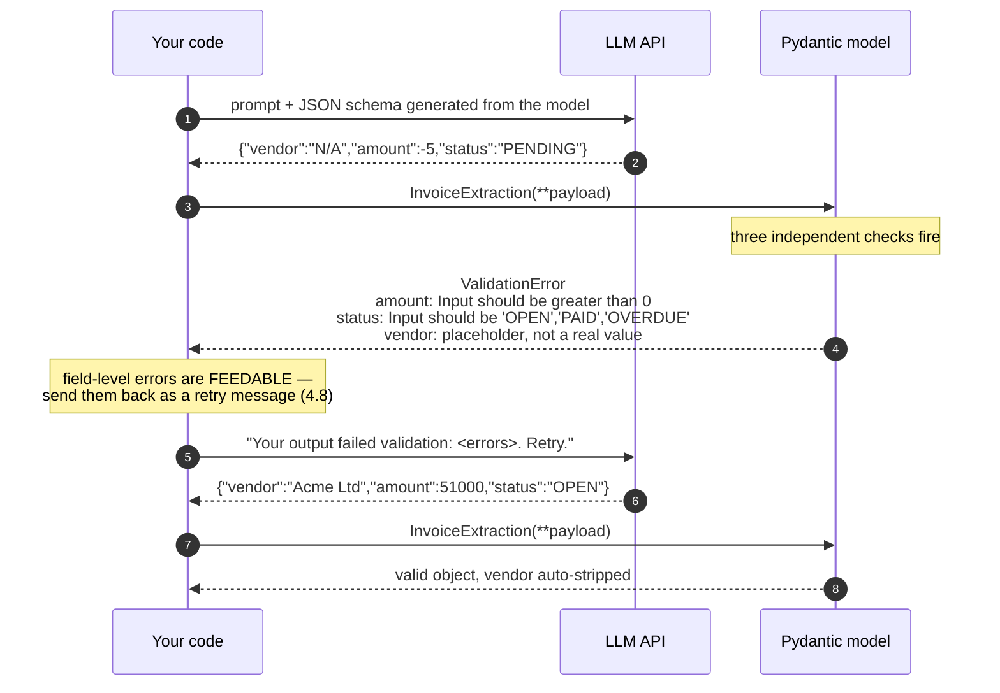
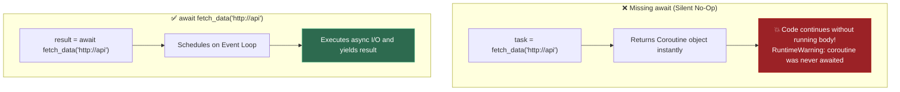
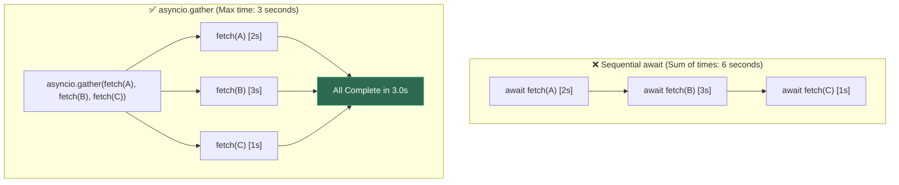
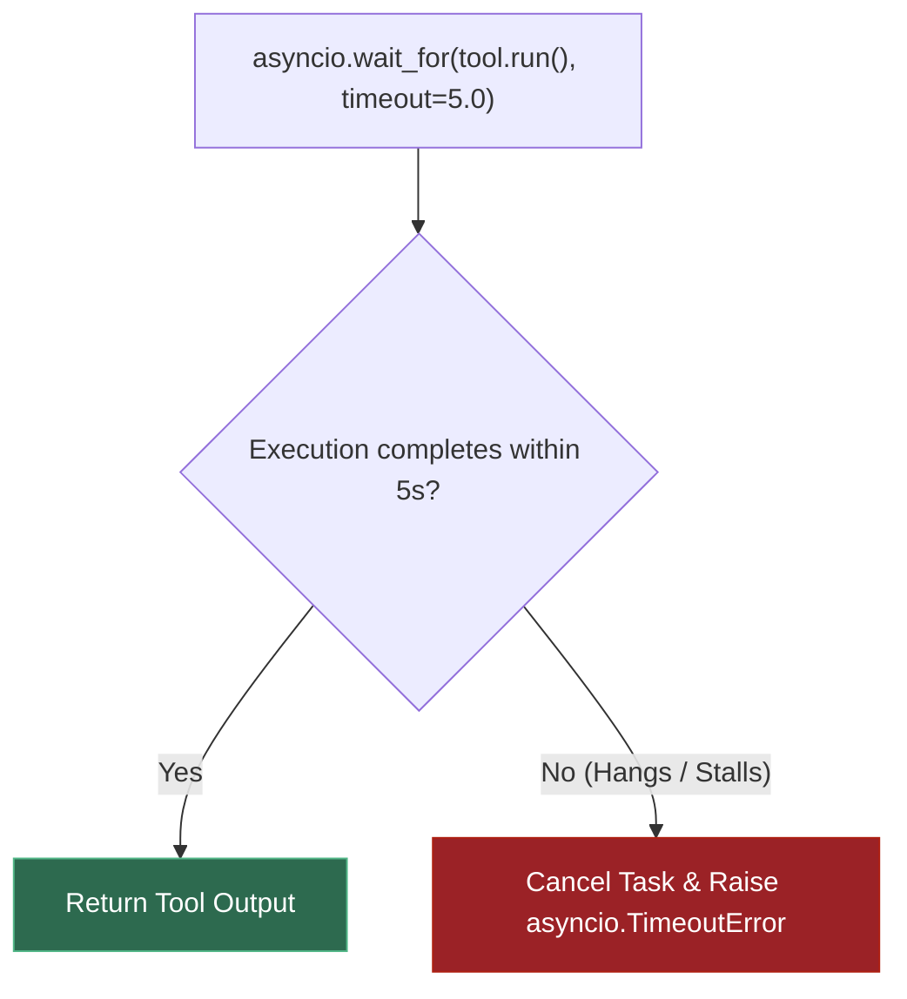
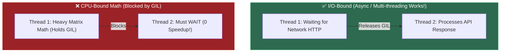
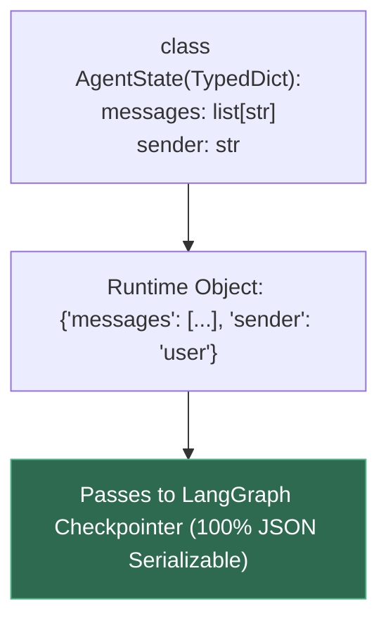
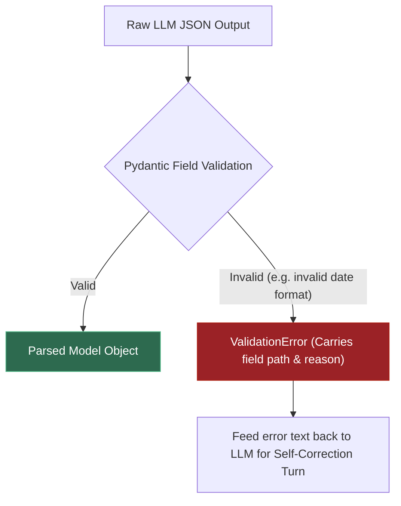

# 0.3 — Async, Type Hints, Pydantic v2

**Phase 0 · CORE · CODE · 8 focused hours · Review in 3 days**

**Companion script:** [`03_async_typehints_pydantic.py`](03_async_typehints_pydantic.py) — `pip install pydantic`, then `python 03_async_typehints_pydantic.py`.

---

## 1. Overview

This is the highest-leverage topic in Phase 0 for everything after it, because three separate things converge here.

**Type hints** are how you read framework signatures. `Annotated[list[str], operator.add]` in **6.3** is not decoration — the `operator.add` *is* the reducer that merges concurrent writes. If `Annotated` is unfamiliar, that line is unreadable.

**Pydantic v2** is how structured LLM output gets validated in **4.8** and how FastAPI validates request bodies in **0.9**. A Pydantic model is a class (**0.2**) whose fields carry runtime-enforced constraints.

**Async** is how an agent calls three tools concurrently instead of serially. In **6.9** streaming and **7.7** latency engineering, this is the difference between acceptable and unacceptable.

Depends on **0.2**; unlocks **0.9**, **4.8**, **6.3**, **6.14**.

---

## 2. Skip Test — Answered

> Gate **before** studying. Both correct from memory → skip. §7 withholds its answers deliberately.

**① Difference between `asyncio.gather` and sequential awaits?**

Sequential `await`s run one at a time — each blocks until it finishes, so total time is the **sum** of the delays. `asyncio.gather` schedules all coroutines immediately and waits for all of them, so total time is the **maximum** of the delays. Demo 3 measures exactly this: 1.53s sequential versus 0.51s gathered for three 0.5-second calls — a 3.02x difference.

The catch: `gather` only helps for **I/O-bound** work. Three CPU-bound functions gain nothing, because the GIL means only one runs at a time.

**② What does a Pydantic field validator do that a type hint alone cannot?**

A type hint constrains the *type*; a validator constrains the *meaning*. `vendor: str` accepts `"N/A"`, `"unknown"` and `""` — all genuinely strings, all useless. A `@field_validator` rejects them, and can also normalise (strip whitespace, uppercase a code) on the way through. Demo 1 shows `"  Acme Ltd  "` being auto-stripped and `"N/A"` being rejected.

---

## 3. Visual Concept Diagrams

### 3.1 — Sequential vs gathered: where the wall-clock goes

```mermaid
gantt
    title Three 0.5s tool calls — measured 1.53s vs 0.51s
    dateFormat SSS
    axisFormat %L ms

    section Sequential (sum)
    sql      :s1, 000, 500ms
    search   :s2, after s1, 500ms
    email    :s3, after s2, 500ms

    section Gathered (max)
    sql      :g1, 000, 500ms
    search   :g2, 000, 500ms
    email    :g3, 000, 500ms
```



### 3.2 — The reducer: merge vs clobber

The single most common LangGraph bug, and it fails **silently** — no error, no warning, just a missing finding.



### 3.3 — Where validation sits in the LLM round trip



---

## 4. Core Technical Deep Dive

| Construct | What it does | Where it returns |
|---|---|---|
| `BaseModel` + `Field(gt=0)` | Runtime constraint, not a hint | **4.8**, **0.9** |
| `@field_validator` | Rejects semantically-null but type-correct values | **4.8** retry loops |
| `Literal[...]` | Exact allowed set; appears in the generated JSON schema | Tool schemas in **6.13** |
| `TypedDict` | A plain dict at runtime, typed statically | **6.3** — must stay serializable for **6.5** checkpointing |
| `Annotated[T, reducer]` | Second arg tells LangGraph how to **merge** concurrent writes | **6.3** — omitting it clobbers |
| `asyncio.gather` | Schedules all, waits for all — max not sum | **6.10** fan-out, **7.7** |
| `asyncio.wait_for` | Bounds a call that may never return | **6.14** failure mode #1 |

**Pydantic v1 → v2 traps.** Tutorials written before 2023 use the old names and will not run:

| v1 | v2 |
|---|---|
| `.dict()` | `.model_dump()` |
| `.json()` | `.model_dump_json()` |
| `@validator` | `@field_validator` + `@classmethod` under it |
| `.parse_obj()` | `.model_validate()` |

**When `gather` does nothing.** It parallelises *waiting*, not *computing*. Three network calls overlap; three tight numeric loops do not, because of the GIL. For CPU-bound work you need `ProcessPoolExecutor` — or, far more likely in this roadmap, NumPy (**0.6**), which releases the GIL inside its C routines anyway.

---

## 5. Hands-On Script & Verified Output

Run: `python 03_async_typehints_pydantic.py`. Output below is **actual, captured** on Python 3.14.4 / Pydantic 2.13.3.

```text
======================================================================
DEMO 1 — Pydantic rejects bad data AT CONSTRUCTION
======================================================================
  valid   : vendor='Acme Ltd' amount=51000.0 status='OPEN' currency='INR'
  note    : vendor was auto-stripped by the validator -> 'Acme Ltd'
  as json : {"vendor":"Acme Ltd","amount":51000.0,"status":"OPEN","currency":"INR"}
  negative amount : rejected -> amount: Input should be greater than 0
  bad status      : rejected -> status: Input should be 'OPEN', 'PAID' or 'OVERDUE'
  placeholder     : rejected -> vendor: Value error, vendor is a placeholder, not a real value
  amount as words : rejected -> amount: Input should be a valid number, unable to parse string as a
======================================================================
DEMO 2 — Annotated reducer: merge vs clobber on concurrent writes
======================================================================
  question annotation: <class 'str'>
  findings annotation: typing.Annotated[list[str], <built-in function add>]
  extracted reducer  : add

  no reducer (clobber): ['refunds up 30%']
  operator.add (merge): ['baseline', 'sales down 12%', 'refunds up 30%']
  ^ Without the reducer one agent's work vanishes silently —
    no error, no warning. The single most common LangGraph bug.
======================================================================
DEMO 3 — asyncio.gather vs sequential awaits (3 x 0.5s tools)
======================================================================
  sequential : 1.53s  ['sql done', 'search done', 'email done']
  gather     : 0.51s  ['sql done', 'search done', 'email done']
  speedup    : 3.02x
  same result: True
  ^ sequential = SUM of delays. gather = MAX of delays.
======================================================================
DEMO 4 — asyncio.wait_for bounds a hung call
======================================================================
  called a 30s tool with timeout=1.0s
  returned after 1.02s -> TIMEOUT after 1.0s -> return a typed error to the agent
  ^ Without wait_for, this blocks a graph node until the process dies.
======================================================================
```

**Demo 1's error messages are the product, not the failure.** `amount: Input should be greater than 0` names the field and the rule. That string is what you send back to the model to retry (**4.8**) — which is why validation belongs at the boundary rather than scattered through your business logic.

**Demo 2 is the one that costs people days.** The clobbered result contains only `['refunds up 30%']`. Node A ran, succeeded, and its finding vanished. Nothing raised. In a multi-agent system (**6.10**) this presents as "the researcher agent seems to be ignored sometimes."

**Modify and re-run:**
- Change `operator.add` to `operator.or_` and re-run Demo 2 with `set` instead of `list`. Predict the deduplication behaviour first.
- Make the three tools in Demo 3 CPU-bound (a tight `sum(range(10**7))` loop instead of `asyncio.sleep`). Predict the speedup before running — it will not be 3x, and understanding why is the point.
- Drop `timeout=1.0` from Demo 4 and confirm it now takes 30 seconds. That is what an unbounded tool call does to a graph node.

---

## 6. Video

**"Next-Level Concurrent Programming In Python With Asyncio"** — *ArjanCodes* — [youtube.com/watch?v=GpqAQxH1Afc](https://www.youtube.com/watch?v=GpqAQxH1Afc). Verified live.

For Pydantic v2 specifically: **[VERIFY]** — no single video was confirmed current for this pass. The official docs at `docs.pydantic.dev` are the reliable source, and their migration guide is the fastest way to unlearn v1 habits picked up from older tutorials.

---

## 7. Retrieval Checkpoint — Unanswered

> Close this file. No notes. Answers deliberately withheld.

1. What does `Annotated[list[str], operator.add]` do in a LangGraph state schema that plain `list[str]` does not, and describe exactly what a user would *observe* when the reducer is missing.
2. Three tools each take 0.5 seconds. Give the total wall-clock for sequential awaits and for `gather`, then name one situation where `gather` gives no speedup at all.
3. Name the Pydantic v2 replacements for `.dict()`, `.json()` and `@validator`.

---

## 8. Closed-Book Rebuild

With this file **and** the script closed: write a Pydantic v2 model with one constrained numeric field, one `Literal` field and one custom validator rejecting placeholder strings; then an async function calling three simulated tools concurrently with a timeout on the batch; then demonstrate merge-versus-clobber on a state dict with and without a reducer.

---

## 9. Glossary

### 9.1 — Coroutine

A special generator-based object returned when calling an `async def` function. Calling an `async def` function does **not** execute its body immediately — it produces a coroutine object that stays paused until it is explicitly `await`ed or scheduled on the event loop.

#### 💡 The Beginner Analogy: A Claim Check Ticket
Calling an `async def fetch()` function is like receiving a **dry cleaning claim check ticket**. Getting the ticket does not clean your suit. You must hand the ticket to the counter (`await fetch()`) to actually execute the cleaning and get your suit back.

#### 🎨 Unawaited Coroutine vs. Aawaited Coroutine



#### 💻 Code Example & ⚠️ Why It Matters
```python
async def fetch_db():
    return "data"

# ❌ TRAP: Forgot await! Returns <coroutine object fetch_db at 0x...>, does NOT run body!
result = fetch_db() 

# ✅ CORRECT: Suspends execution until event loop returns result
result = await fetch_db()
```
**Why It Matters**: Omitting `await` is a top source of silent bugs in async Python. Operations like database commits or API network calls are completely skipped without throwing an error at the call site.

---

### 9.2 — `asyncio.gather`

A concurrent execution utility that schedules multiple awaitable objects (coroutines/tasks) on the event loop simultaneously and pauses until **all** of them complete, returning a list of their results in original order.

#### 💡 The Beginner Analogy: Ordering at a Fast Food Counter
Executing requests sequentially with `await` is like sending 3 people to order food **one after another in line** (total time = 5s + 5s + 5s = 15s). `asyncio.gather` is like sending all 3 people to **3 separate cashier counters at the same time** (total time = 5s max).

#### 🎨 Sequential vs. Concurrent Execution Timeline



#### 💻 Code Example & ⚠️ Why It Matters
```python
import asyncio

# ❌ Sequential (Total wall-clock: 3.0s)
res1 = await fetch_api_1() # 1.0s
res2 = await fetch_api_2() # 2.0s

# ✅ Concurrent (Total wall-clock: 2.0s max)
res1, res2 = await asyncio.gather(fetch_api_1(), fetch_api_2())
```
**Why It Matters**: Dramatically reduces network latency in AI microservices and LangChain tool executions by overlapping independent API requests.

---

### 9.3 — `asyncio.wait_for`

A timeout wrapper that bounds the total execution time of an awaitable, raising `TimeoutError` and cancelling the underlying task if it exceeds the specified duration.

#### 💡 The Beginner Analogy: Restaurant Timer
If an oven timer is set for 10 minutes (`timeout=10.0`), and the chef hasn't finished baking by minute 10, the kitchen manager immediately pulls the dish out and sounds an alarm (`TimeoutError`).

#### 🎨 Timeout Circuit Breaker



#### 💻 Code Example & ⚠️ Why It Matters
```python
try:
    # Protects graph nodes from hanging infinitely on external APIs
    result = await asyncio.wait_for(slow_web_search(), timeout=3.0)
except asyncio.TimeoutError:
    result = "Search timed out. Fallback triggered."
```
**Why It Matters**: Prevents a hung web scraper or stalled LLM API request from permanently locking background workers or agent execution graphs.

---

### 9.4 — GIL (Global Interpreter Lock)

A mutex lock inside CPython that ensures only **one operating system thread executes Python bytecode at a single time**.

#### 💡 The Beginner Analogy: Single Microphone in a Debate
No matter how many speakers (threads) are standing on stage, there is only **one physical microphone** (the GIL). Only the person holding the microphone can talk. If a speaker stops to read a document (I/O waiting), they hand off the microphone to someone else. But two people cannot talk simultaneously.

#### 🎨 I/O-Bound Parallelism vs. CPU-Bound Block



#### 💻 Code Example & ⚠️ Why It Matters
```python
# ❌ Threads give ZERO speedup for heavy CPU computation in Python!
# For CPU math (matrix multiplication, image processing), use multiprocessing or NumPy/C extensions.
```
**Why It Matters**: Explains why `asyncio` and threading accelerate web server I/O, but heavy CPU model training must use multiprocessing or CUDA C extensions to bypass Python's thread lock.

---

### 9.5 — `TypedDict`

A dictionary structure defined at type-checking time using `typing.TypedDict` that enforces explicit key names and value types without changing the runtime dict representation.

#### 💡 The Beginner Analogy: Standardized Form Paper
A plain Python `dict` is like a blank sheet of paper — you can write any key-value pair on it. A `TypedDict` is a **printed application form**: it enforces exact box labels (`messages: list`, `next_step: str`) while remaining standard paper (a plain Python dictionary at runtime).

#### 🎨 State Enforcement in LangGraph



#### 💻 Code Example & ⚠️ Why It Matters
```python
from typing import TypedDict

class AgentState(TypedDict):
    messages: list[str]
    next_node: str

# Pure dict at runtime, but type checkers ensure state contract compliance!
state: AgentState = {"messages": ["hello"], "next_node": "agent"}
```
**Why It Matters**: Essential for LangGraph state management. LangGraph requires plain serializable dicts for state checkpointing and persistence, making `TypedDict` superior to full OOP classes for graph state.

---

### 9.6 — `Annotated[T, metadata]` & Reducers

A Python type hint wrapper that attaches arbitrary domain metadata (such as a LangGraph state **Reducer** function) to a field type `T`.

#### 💡 The Beginner Analogy: Luggage Tag Rules
The type `list[str]` specifies *what* is inside the suitcase (strings). `Annotated[list[str], operator.add]` attaches a **special handling luggage tag** instructing the state manager: *"When new items arrive, do NOT overwrite the suitcase — append them to the existing list!"*

#### 🎨 Default Overwrite vs. Annotated Reducer Append

```mermaid
flowchart TD
    subgraph DefaultOverwrite ["❌ Without Reducer (Default Overwrite)"]
        O1["State: ['msg1']"] -->|New Write: ['msg2']| O2["Result: ['msg2'] (msg1 ERASED!)"]
    end

    subgraph AnnotatedReducer ["✅ Annotated[list, operator.add] (Reducer Append)"]
        R1["State: ['msg1']"] -->|New Write: ['msg2']| R2["Result: ['msg1', 'msg2'] (Concatenated!)"]
    end

    style O2 fill:#9b2226,stroke:#ae2012,color:#fff
    style R2 fill:#2d6a4f,stroke:#52b788,color:#fff
```

#### 💻 Code Example & ⚠️ Why It Matters
```python
import operator
from typing import Annotated, TypedDict

class GraphState(TypedDict):
    # operator.add tells LangGraph to CONCATENATE incoming lists instead of overwriting
    messages: Annotated[list[str], operator.add]
```
**Why It Matters**: Without `Annotated` reducers, multi-agent updates in LangGraph overwrite previous chat history and state context instead of accumulating updates.

---

### 9.7 — Field Validator & `ValidationError`

- **Field Validator**: A `@field_validator` method hook in Pydantic that intercepts parsed input values to enforce business rules and data normalization.
- **`ValidationError`**: Pydantic's structured error exception raised when input data fails type coercion or validation rules.

#### 💡 The Beginner Analogy: Bouncer & Form Reject Slip
A Pydantic model is a club venue. A **Field Validator** is the bouncer at the door checking IDs (e.g. verifying `age >= 18`). If an invalid guest attempts entry, the bouncer issues a detailed **`ValidationError` slip** detailing exactly which field failed and why.

#### 🎨 Validation & Self-Correction Flow



#### 💻 Code Example & ⚠️ Why It Matters
```python
from pydantic import BaseModel, field_validator, ValidationError

class UserProfile(BaseModel):
    username: str

    @field_validator("username")
    def must_be_lowercase(cls, v: str) -> str:
        if not v.islower():
            raise ValueError("Username must be lowercase")
        return v

try:
    user = UserProfile(username="ADMIN")
except ValidationError as e:
    print(e.json()) # Structured error report sent back to model or API client
```
**Why It Matters**: Structured `ValidationError` outputs are feedable back to LLMs as targeted retry prompts, enabling self-healing LLM output pipelines.

---

## Review again in

**3 days** — high density, three distinct subjects in one topic. The `Annotated` reducer will not stick on one pass and is load-bearing for all of Phase 6.
