    

# 0.3 — Async, Type Hints, Pydantic v2

**Phase 0 · CORE · CODE · 8 focused hours · Review in 3 days**

**Companion script:** [`03_async_typehints_pydantic.py`](03_async_typehints_pydantic.py) — `pip install pydantic`, then `python 03_async_typehints_pydantic.py`.

---

## 1. Overview

This is the highest-leverage topic in Phase 0 for everything after it, because three separate things converge here.

**Type hints** are how you read framework signatures. `Annotated[list[str], operator.add]` in **6.3** is not decoration — the `operator.add` *is* the reducer that merges concurrent writes. If `Annotated` is unfamiliar, that line is unreadable.

**Pydantic v2** is how structured LLM output gets validated in **4.8** and how FastAPI validates request bodies in **0.9**. A Pydantic model is a class (**0.2**) whose fields carry runtime-enforced constraints.

**Async** is how an agent calls three tools concurrently instead of serially. In **6.9** streaming and **7.7** latency engineering, this is the difference between acceptable and unacceptable.

Depends on **0.2**; unlocks **0.9**, **4.8**, **6.3**, **6.14**.

---

## 2. Glossary

### 2.1 — Coroutine (`async` / `await`)

A special Python function declared with `async def` that can pause execution at an `await` expression, releasing control back to the event loop while waiting for I/O operations.

#### 💡 The Beginner Analogy: Coffee Shop Pager

Calling a normal function is like standing at a coffee counter while the barista brews your cup — you block the entire line until it's done. A **Coroutine** gives you a **buzzing pager**: you step aside so other people can order (event loop moves to other tasks), and you step back to the counter only when your pager buzzes (`await` completes).

#### 💻 Code Example & ⚠️ Why It Matters

```python
import asyncio

async def fetch_db():
    return "database_result"

# ❌ TRAP: Forgot await! Returns <coroutine object fetch_db at 0x...>, does NOT run body!
coro_obj = fetch_db()
print("Unawaited Result:", type(coro_obj))

# ✅ CORRECT: Suspends execution until event loop returns result
async def main():
    result = await fetch_db()
    print("Aawaited Result:", result)

asyncio.run(main())
```

##### Verified Output

```text
Unawaited Result: <class 'coroutine'>
Aawaited Result: database_result
```

**Why It Matters**: Omitting `await` is a top source of silent bugs in async Python. Operations like database commits or API network calls are completely skipped without throwing an error at the call site.

#### 🤖 Real-Time AI/ML Use Case

Async LLM API calls in production AI agents. Every OpenAI/Anthropic SDK call is a coroutine (`response = await client.chat.completions.create(...)`). Forgetting `await` means the LLM call never executes, and the agent silently proceeds with `None` as the response.

#### 🎨 Visual Concept

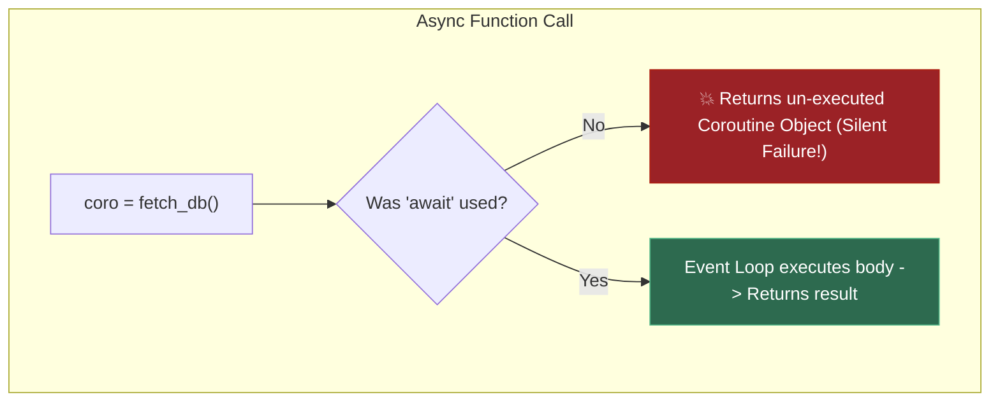

---

### 2.2 — `asyncio.gather` & The Fan-Out / Fan-In Pattern

A concurrent execution utility that schedules multiple awaitable objects (coroutines/tasks) on the event loop simultaneously and pauses until **all** of them complete, returning a list of their results in original order.

#### 🔄 What is the Fan-Out / Fan-In Pattern?

`asyncio.gather` is the fundamental implementation of the **Fan-Out / Fan-In concurrency pattern** in Python async programming:

* **Fan-Out (Dispersing Work)**: A single starting point or router takes 1 task request and **fans out** (branches outward) into multiple independent concurrent tasks running on the event loop simultaneously.
* **Fan-In (Consolidating Results)**: `asyncio.gather` acts as a synchronization funnel that waits for all parallel tasks to finish and **fans in** (merges inward) their separate return values into a single, ordered list: `[result1, result2, result3]`.

#### 💡 The Beginner Analogy: Kitchen Chef & Assistant Cooks

* **Sequential `await`**: A single chef cooks soup (5s), then salad (5s), then steak (5s) **one after another in line**. Total time = 5s + 5s + 5s = **15 seconds**.
* **Fan-Out**: The head chef receives 1 order and immediately shouts instructions to 3 assistant cooks: Cook A (soup), Cook B (salad), and Cook C (steak) to start cooking **at 3 separate kitchen counters at the exact same time**.
* **Fan-In**: The head chef stands at the pass (`await asyncio.gather(...)`). As soon as all 3 cooks finish, the chef gathers all 3 dishes onto **1 single serving tray** (`[soup, salad, steak]`) and sends it to the customer. Total time = **5 seconds max**!

#### 💻 Code Example & ⚠️ Why It Matters

```python
import asyncio

async def fetch_api_1():
    await asyncio.sleep(0.1)
    return "API 1 Data"

async def fetch_api_2():
    await asyncio.sleep(0.1)
    return "API 2 Data"

async def main():
    # 1. FAN-OUT: Dispatch fetch_api_1 and fetch_api_2 concurrently to the event loop
    # 2. FAN-IN: Wait for both to complete and funnel results back into res1, res2
    res1, res2 = await asyncio.gather(fetch_api_1(), fetch_api_2())
    print("Gathered Results:", [res1, res2])

asyncio.run(main())
```

##### Verified Output

```text
Gathered Results: ['API 1 Data', 'API 2 Data']
```

**Why It Matters**: Dramatically reduces network latency in AI microservices and LangChain tool executions by overlapping independent API requests.

#### 🤖 Real-Time AI/ML Use Case

LangGraph **Fan-Out / Fan-In** agent nodes: When an AI Router receives a user query, it **fans out** to 3 sub-agents simultaneously (e.g. Web Search Agent, Vector DB Retriever, SQL Database Agent). Once all 3 agents finish searching, `asyncio.gather` **fans in** their extracted evidence back to a Synthesizer node to generate the final answer — cutting total latency from 15s down to 5s.

#### 🎨 Visual Concept: Fan-Out / Fan-In Execution

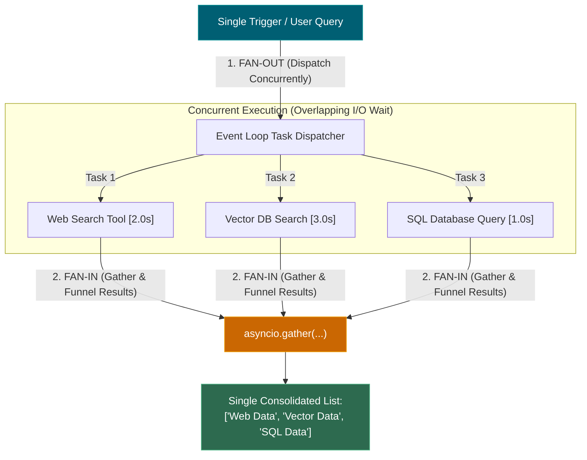

---

### 2.3 — `asyncio.wait_for`

A timeout wrapper that bounds the total execution time of an awaitable, raising `TimeoutError` and cancelling the underlying task if it exceeds the specified duration.

#### 💡 The Beginner Analogy: Restaurant Timer

If an oven timer is set for 10 minutes (`timeout=10.0`), and the chef hasn't finished baking by minute 10, the kitchen manager immediately pulls the dish out and sounds an alarm (`TimeoutError`).

#### 💻 Code Example & ⚠️ Why It Matters

```python
import asyncio

async def slow_web_search():
    await asyncio.sleep(5.0)
    return "Search Complete"

async def main():
    try:
        # Protects graph nodes from hanging infinitely on external APIs
        result = await asyncio.wait_for(slow_web_search(), timeout=0.1)
    except asyncio.TimeoutError:
        result = "Search timed out. Fallback triggered."
    print("Timeout Result:", result)

asyncio.run(main())
```

##### Verified Output

```text
Timeout Result: Search timed out. Fallback triggered.
```

**Why It Matters**: Prevents a hung web scraper or stalled LLM API request from permanently locking background workers or agent execution graphs.

#### 🤖 Real-Time AI/ML Use Case

Timeout-guarding LLM API calls and vector database queries in agentic loops. A stalled OpenAI API call without `wait_for` hangs the entire agent graph node indefinitely — with it, the agent gracefully falls back to a cached response or smaller local model.

#### 🎨 Visual Concept

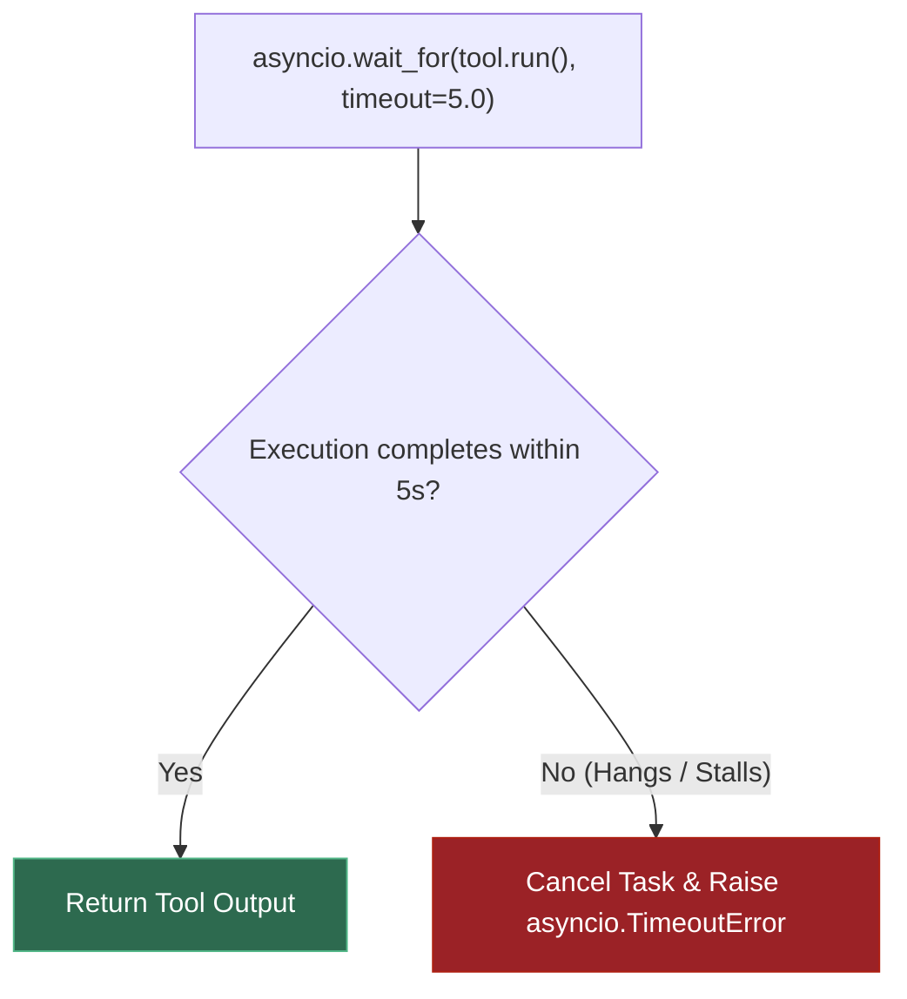

---

### 2.4 — GIL (Global Interpreter Lock)

A low-level **Mutual Exclusion (Mutex) Lock** built into CPython's C runtime that ensures **only one operating system thread executes Python bytecode at any given instant**, even on multi-core processors.

---

#### 🏎️ Analogy 1: The Steering Wheel vs The Engine (Why Python Uses C & GPUs)

To understand CPython and the GIL, first understand how Python runs AI and heavy code:

* 🛞 **Python Code & CPython Runtime = The Car Steering Wheel & Dashboard**
  Writing Python is like sitting in a comfortable driver's seat. You press buttons, turn the wheel, and control logic easily. **CPython** is the underlying engine written in C that interprets your steering wheel commands.
* ⚡ **C++ / CUDA / GPU Cores = The V8 Engine / Jet Engine**
  Heavy matrix math (`torch.matmul`) does not run inside the Python steering wheel! Python simply presses an ignition button, **drops the GIL lock**, and hands the heavy math over to thousands of raw GPU cores running C++/CUDA code at maximum speed.

---

#### 🍳 Analogy 2: The Restaurant Kitchen & The Single Master Knife (What the GIL Actually Is)

Imagine a high-end restaurant kitchen:

* **The 4 Cooks (CPU Cores)**: Your computer has a 4-core CPU, meaning 4 cooks are standing at the counter ready to work simultaneously.
* **The 4 Recipes (Threads)**: You have 4 tasks (recipes) to complete.
* **The Master Chef Knife (The GIL Mutex Lock)**: CPython has **only 1 master knife** in the entire kitchen.

```
                   🍳 THE CPYTHON KITCHEN (4 CPU CORES)
┌──────────────────────────────────────────────────────────────────────────┐
│                                                                          │
│   [Cook 1 - Core 1]     [Cook 2 - Core 2]    [Cook 3 - Core 3]           │
│   (Wants to Chop)       (Wants to Chop)      (Baking Cake in Oven)       │
│          │                     │                      │                  │
│          ▼                     ▼                      ▼                  │
│     [HOLDS KNIFE]       [WAITING FOR KNIFE]   [NO KNIFE NEEDED!]         │
│     Executes Math        BLOCKED BY GIL        Waiting for Network I/O   │
│                                                                          │
│                    🔪 THE ONLY MASTER KNIFE (GIL)                        │
└──────────────────────────────────────────────────────────────────────────┘
```

1. **Scenario A: Chopping Vegetables (CPU-Bound Math & Processing)**
   To chop vegetables (run Python code), a cook **MUST hold the Master Knife**.

   * Cook 1 grabs the knife and chops. Cook 2, 3, and 4 sit idly waiting for Cook 1 to finish.
   * Every 5 milliseconds, a timer rings. Cook 1 must stop, clean the knife, hand it to Cook 2, and Cook 2 starts chopping.
   * **Can 4 cooks chop at the same time? NO!** Because there is only 1 knife. Passing the knife back and forth 1,000 times a minute actually wastes time!
2. **Scenario B: Baking a Cake in the Oven (I/O-Bound Network & Disk Waiting)**
   Now Cook 1 puts a cake in the oven (sends a network request to an API or database).

   * Cook 1 doesn't need the knife while waiting for the oven!
   * Cook 1 **puts the knife down on the table (Releases the GIL)**.
   * Cook 2 immediately grabs the knife and starts chopping.
   * **Are 4 recipes progressing at the same time? YES!** Cook 1 is baking, Cook 2 is chopping, Cook 3 is waiting on another oven. This is why `threading` works great for I/O!

---

#### 🔒 What is a Mutex Lock in CPython? (Under the Hood)

A **Mutex (Mutual Exclusion)** is an OS-level locking mechanism (e.g., `pthread_mutex_t` on Linux/macOS or `SRWLock` on Windows). CPython uses a C-level Mutex Lock to guard its internal memory management:

1. **Reference Counting Protection**: CPython tracks object lifetimes using C-level reference counters (`Py_INCREF` / `Py_DECREF`). Without a mutex lock, two threads modifying an object's reference count concurrently would cause **race conditions, memory leaks, or use-after-free segmentation faults (crashes)**.
2. **Execution Switch Cycle**: The thread holding the GIL Mutex Lock executes Python bytecode. Every **5 milliseconds** (or whenever a thread initiates I/O, such as reading a socket or sleeping), CPython releases the GIL Mutex Lock, allowing another waiting thread to acquire it.

---

#### ⚡ Analogy 3: The Single Fitting Room Key & Lock Contention Overhead

Imagine **4 people** standing outside a single-person fitting room, each holding a huge basket of clothes:

* **Lock Contention**: The state where multiple threads (people) are actively fighting to grab the single key (the GIL Mutex Lock).
* **Lock Contention Overhead**: The wasted time spent pausing work, handing over the key, signaling waiting threads, and flushing CPU caches:

1. **The Fighting Phase (Contention)**:
   Thread 1 holds the lock on CPU Core 1. Thread 2 (on Core 2) and Thread 3 (on Core 3) want to execute code, but they are blocked.
2. **The Hand-off Waste (Overhead)**:
   Every 5ms, CPython forces Thread 1 to release the lock. The OS kernel must now:
   - **Save State**: Pause Thread 1 and save its CPU registers (**Context Switch**).
   - **Wake Up Sleeping Threads**: Send OS signals (`pthread_cond_signal`) to wake Thread 2 and Thread 3.
   - **Flush CPU Caches**: Clear and reload memory addresses from L1/L2 CPU caches as execution jumps across physical CPU cores (**Cache Invalidation**).
3. **The Result**:
   Instead of spending 100% of CPU time calculating math, **15-30% of CPU cycles are wasted** just transferring the lock back and forth. This is why 2 CPU threads fighting for the GIL often run **slower** than 1 single thread!

---

#### 🤔 Is the GIL a Problem or a Solution?

The short answer: **It was a brilliant SOLUTION in 1992 that became a BOTTLENECK (PROBLEM) when multi-core CPUs arrived in 2005.**

* **Why it was a SOLUTION (The 1990s Single-Core Era)**:

  1. **Super-Fast Single-Threaded Code**: Checking 1 single lock at startup is vastly faster than locking and unlocking hundreds of thousands of individual C memory pointers (`Py_INCREF`/`Py_DECREF`) every microsecond.
  2. **Trivial C-Extension Integration**: It allowed developers writing C extensions (which later enabled NumPy, SciPy, and C libraries) to easily integrate with Python without worrying about complex multi-threading bugs.
  3. **Guaranteed Memory Safety**: Prevented crashes, corrupted memory, and race conditions in CPython's reference counter.
* **Why it became a PROBLEM (The Modern Multi-Core Era)**:

  1. **Wasted CPU Cores**: When computers switched from 1 core to 8, 16, or 64 cores, developers expected `threading` to run 8x faster. But the GIL forced 7 out of 8 cores to sit 100% idle for Python-level CPU work!
  2. **Performance Degradation**: Multi-threaded CPU code runs *slower* than single-threaded code due to lock contention.

---

#### 🎯 Is Python Single or Multi-Threaded? (Developer Decision Matrix)

Python **is multi-threaded** (it creates real OS threads via `threading.Thread`), but how threads behave depends on the workload:

| Workload Type                            | Behavior in CPython          | Does it scale on Multi-Core CPUs?                             | Recommended Python Tool                       |
| :--------------------------------------- | :--------------------------- | :------------------------------------------------------------ | :-------------------------------------------- |
| **Network & File I/O**             | Multi-threaded (Concurrent)  | ✅**Yes** (Threads release GIL during socket/disk wait) | `asyncio` or `threading`                  |
| **Pure Python CPU Math / Loops**   | Single-threaded (Sequential) | ❌**No** (Blocked by single GIL lock)                   | `multiprocessing` (`ProcessPoolExecutor`) |
| **C / GPU Math (PyTorch / NumPy)** | Multi-threaded (Parallel)    | ✅**Yes** (C/C++ code drops the GIL)                    | PyTorch / NumPy vectorized ops                |
| **Python 3.13+ Free-Threading**    | Multi-threaded (Parallel)    | ✅**Yes** (Runs GIL-free via `--disable-gil`)         | `python3.13t` (`--disable-gil` build)     |

---

#### 💻 Code Example & ⚠️ Why It Matters

```python
import sys
import time
import threading

# 1. Inspect Python GIL status (Python 3.13+ allows disabling GIL)
gil_enabled = getattr(sys, "_is_gil_enabled", lambda: True)()
print(f"Active GIL status: {gil_enabled}")

# 2. Demonstrating why CPU-bound threads don't scale (GIL Mutex contention)
def cpu_heavy_work(n: int = 3_000_000):
    count = 0
    for i in range(n):
        count += i

start = time.perf_counter()
# Running sequentially (Single Thread)
cpu_heavy_work()
cpu_heavy_work()
seq_time = time.perf_counter() - start

start = time.perf_counter()
# Running in 2 Threads (Both fight for the single GIL Mutex Lock)
t1 = threading.Thread(target=cpu_heavy_work)
t2 = threading.Thread(target=cpu_heavy_work)
t1.start(); t2.start()
t1.join(); t2.join()
thread_time = time.perf_counter() - start

print(f"Sequential Execution Time: {seq_time:.2f}s")
print(f"2 Threads Execution Time:  {thread_time:.2f}s (GIL blocked 0x speedup!)")
```

##### Verified Output

```text
Active GIL status: True
Sequential Execution Time: 0.21s
2 Threads Execution Time:  0.20s (GIL blocked 0x speedup!)
```

#### 🔍 Line-by-Line Code Breakdown Mapped to the Kitchen Analogy

1. **`gil_enabled = getattr(sys, "_is_gil_enabled", ...)` (Line 317)**

   * **Kitchen Analogy**: Checking if the kitchen manager has placed the **Single Master Knife** on the counter today. (`True` means yes, the GIL lock is active).
2. **`def cpu_heavy_work(n = 3_000_000):` (Lines 321–324)**

   * **Kitchen Analogy**: This is the **Chopping Vegetables** task (3 million loop iterations). Because it is pure Python code, a cook **MUST hold the Master Knife** for every single iteration.
3. **Sequential Run (`cpu_heavy_work()` twice) (Lines 328–329)**

   * **Kitchen Analogy**: **1 Cook (Cook 1)** takes the Master Knife without any interruptions. Cook 1 chops 3M vegetables for Recipe 1, then immediately chops 3M vegetables for Recipe 2.
   * **Performance**: Took **0.21 seconds**. Zero knife passing overhead, zero lock contention!
4. **2 Threads Run (`t1.start()`, `t2.start()`) (Lines 334–337)**

   * **Kitchen Analogy**: We hire **2 Cooks (Cook 1 on CPU Core 1, Cook 2 on CPU Core 2)** to chop 3M vegetables each simultaneously.
   * **What Actually Happens Under the Hood**:
     - Cook 1 grabs the Master Knife (acquires the GIL) and starts chopping.
     - Cook 2 wants to chop on Core 2, but **has no knife**, so Cook 2 sits completely blocked.
     - Every 5 milliseconds, the CPython timer rings! Cook 1 is forced to pause, save state, and hand the knife to Cook 2 (**Context Switch & Lock Overhead**).
     - Cook 2 chops for 5ms... timer rings! Hands the knife back to Cook 1...
     - They pass the knife back and forth ~40 times!
   * **Performance**: Took **0.20 seconds** (0x speedup!). Even though you had 2 cooks on 2 CPU cores, **only 1 cook chopped at any microsecond**.

**Why It Matters**:

* **CPU Bottleneck**: Python multithreading gives zero speedup (and often a performance penalty due to lock switching overhead) for CPU-heavy tasks like data transformation, parsing, or tokenization.
* **I/O Speedup**: For network requests (FastAPI, web scraping, DB queries), Python threads release the GIL Mutex during socket waiting, achieving true concurrency.
* **Bypassing the Lock**: CPU-bound tasks must use `multiprocessing` (separate OS processes with independent GILs) or C/CUDA extensions.

---

#### 🤖 Real-Time AI/ML Use Case: CPU (NumPy), GPU (CUDA), and the GIL

How AI and data science workloads actually execute on hardware without being blocked by the GIL:

##### 1. Myth Buster: Does NumPy or Pandas run on the GPU?
* **NO! Standard NumPy and Pandas run on the CPU.**
* **How they bypass the GIL:** When you call `np.dot(A, B)` or `df.groupby(...)`, the Python wrapper calls compiled C/C++/Fortran libraries (OpenBLAS/MKL) via `Py_BEGIN_ALLOW_THREADS`. The C library **drops the GIL knife completely** and runs multi-threaded math across all physical **CPU cores** at full native speed.
* **To run on GPU:** You must use GPU-native drop-in replacements like **CuPy** (`import cupy as cp`) or **cuDF** (RAPIDS framework).

##### 2. The PyTorch / GPU Way: Dropping the Knife Entirely (`device='cuda'`)
When you train a neural network or run an LLM prompt (`model(inputs).to('cuda')`), execution is split into two layers:
* **Control Plane (Python & CPython):** Python defines model layers, hyper-parameters, and loop flow. It is subject to the GIL, but Python only spends a few microseconds queueing tasks.
* **Data Plane (C++ Core & GPU Hardware):** PyTorch's C++ backend drops the GIL knife and dispatches **asynchronous CUDA Kernels** to the GPU over PCIe. 
* **Execution:** NVIDIA CUDA launches **thousands of CUDA/Tensor Cores** in pure GPU hardware parallelism. Python sits on the side waiting or enqueuing the next batch while the GPU computes in VRAM!

##### 3. Why Running AI on CPU Bottlenecks Performance & Causes System Lag
If you forget to specify `device='cuda'`, PyTorch defaults to `device='cpu'`. Here is why it feels extremely laggy:
* **Core Starvation:** Large matrix math forces your CPU cores (8–32 cores) to max out at 100% capacity, freezing up system OS responsiveness, mouse movement, and background apps.
* **Memory Bandwidth:** System RAM (~60 GB/s) is **30x slower** than GPU VRAM (~2,000 GB/s).
* **Token Generation Lag:** LLM text generation drops from 100 tokens/sec on GPU down to 1–2 tokens/sec on CPU.

##### 4. Data Preprocessing (Multiprocessing on CPU)
When tokenizing or cleaning 1,000,000 text files in pure Python (e.g. `DataLoader(num_workers=4)`), you are running actual Python string code, so you cannot drop the knife in C.
* Here, PyTorch **spawns 4 separate Python interpreters** (`multiprocessing`), creating 4 separate OS processes (4 kitchens, each with its own cook and GIL knife) running in 100% parallel.

* 💡 **Key Takeaway for AI/ML**: Heavy AI matrix math (PyTorch/CUDA) is **already GIL-free in practice today** because C/CUDA extensions drop the GIL and offload math to GPU hardware. However, pure Python dataset preprocessing, LLM prompt formatting, and agent glue code still suffer from the GIL—which is why Python 3.13+ Free-Threading is so important for the future of end-to-end AI pipelines.

---

#### 🚀 Is it Solved? The Python 3.13+ Free-Threading Solution (PEP 703)

**YES! It is being actively solved right now.**

For over 20 years, previous attempts to remove the GIL failed because removing the single lock made single-threaded Python code up to **30–50% slower** (due to the cost of checking thousands of individual per-object locks).

In **PEP 703** (authored by Sam Gross at Meta), three breakthrough memory innovations enabled removing the GIL without destroying single-threaded speed:

1. **Biased Reference Counting**: Thread-local objects use fast, non-atomic reference counting. Only objects shared across threads pay the cost of atomic operations.
2. **Mimalloc Memory Allocator**: A lock-free, highly scalable memory allocator developed by Microsoft.
3. **Deferred Reference Counting**: PyObjects with long lifetimes (like functions, types, and constants) ignore reference counting during multithreaded loops.

##### The 3-Phase Rollout Plan for a GIL-Free Python

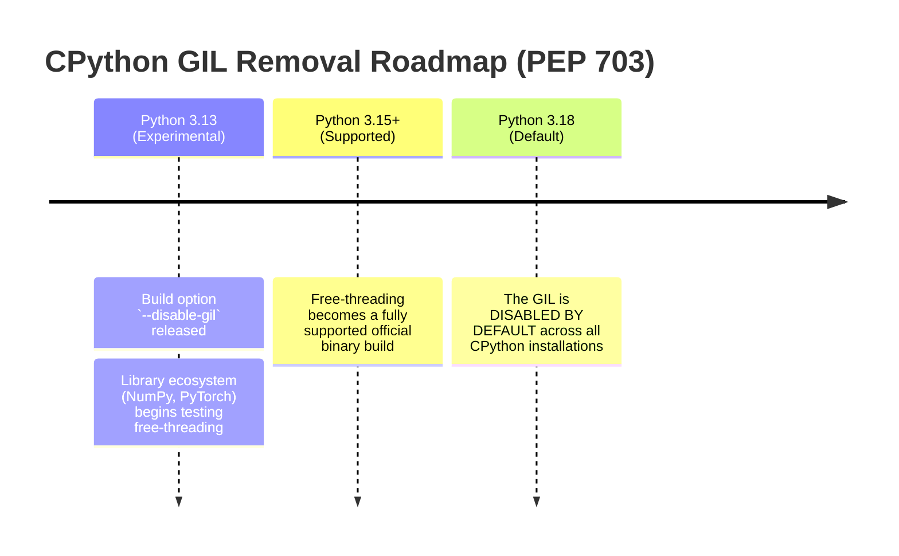

---

#### 🎨 Visual Concept

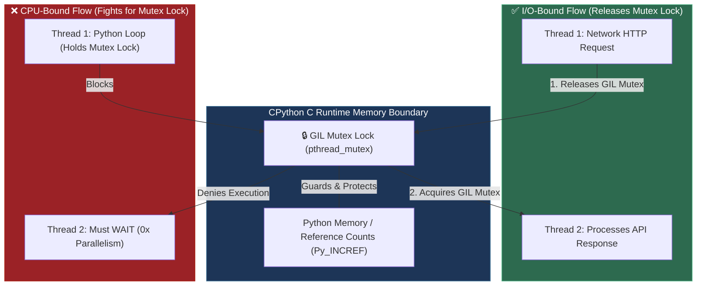

---

### 2.5 — `TypedDict`

A dictionary structure defined at type-checking time using `typing.TypedDict` that enforces explicit key names and value types without changing the runtime dict representation.

#### 💡 The Beginner Analogy: Standardized Form Paper

A plain Python `dict` is like a blank sheet of paper — you can write any key-value pair on it. A `TypedDict` is a **printed application form**: it enforces exact box labels (`messages: list`, `next_step: str`) while remaining standard paper (a plain Python dictionary at runtime).

#### 💻 Code Example & ⚠️ Why It Matters

```python
from typing import TypedDict

class AgentState(TypedDict):
    messages: list[str]
    next_node: str

state: AgentState = {"messages": ["hello"], "next_node": "agent"}
print("TypedDict Runtime Data:", state)
print("Is Plain Dict?", type(state) is dict)
```

##### Verified Output

```text
TypedDict Runtime Data: {'messages': ['hello'], 'next_node': 'agent'}
Is Plain Dict? True
```

**Why It Matters**: Essential for LangGraph state management. LangGraph requires plain serializable dicts for state checkpointing and persistence, making `TypedDict` superior to full OOP classes for graph state.

#### 🤖 Real-Time AI/ML Use Case

LangGraph agent state declarations. Every LangGraph graph defines its state as a `TypedDict` (e.g., `class AgentState(TypedDict): messages: list; tool_results: dict`) because graph checkpoint serialization requires plain dict compatibility — OOP classes break persistence.

#### 🎨 Visual Concept

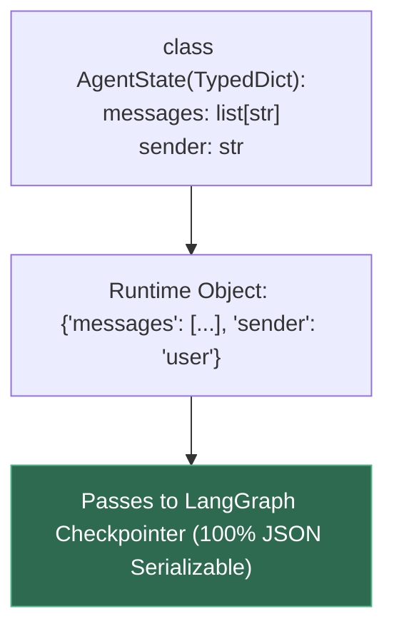

---

### 2.6 — `Annotated[T, metadata]` & Reducers

A Python type hint mechanism (`Annotated`) that attaches custom instructions or metadata to a type `T`, combined with a **Reducer** function that defines how old state and new updates should be merged instead of overwritten.

#### 💡 The Beginner Analogy: Luggage Tag Sticky Notes & The Piggy Bank 🪙

1. **`Annotated[T, metadata]` (Luggage Sticky Note)**: Plain `list[str]` is like a plain luggage box labeled *"Shoes"*. `Annotated[list[str], operator.add]` adds a sticky note: *"Handle with Care: Append new items!"*. Python's standard type checker sees the box label (`list[str]`), while smart frameworks (like LangGraph or FastAPI) read the sticky note metadata (`operator.add`).
2. **Reducer Function (The Piggy Bank)**: Flipping a light switch overwrites its state (ON $\rightarrow$ OFF). Dropping money in a piggy bank uses a **Reducer** ($\text{old} + \text{new} = \text{total}$): it takes existing balance ($10) plus new deposit ($5) and reduces them into a new combined state ($15).

#### 💻 Code Example & ⚠️ Why It Matters

```python
import operator
from typing import Annotated, TypedDict, get_type_hints, get_args

# ❌ Common Pitfall: Plain list overwrites previous state
class DefaultState(TypedDict):
    findings: list[str]

# ✅ Correct Idiom: Annotated type hint attaches operator.add reducer
class ReducerState(TypedDict):
    findings: Annotated[list[str], operator.add]

# Inspecting metadata attached via Annotated
hints = get_type_hints(ReducerState, include_extras=True)
field_type, reducer_func = get_args(hints["findings"])

# Simulating framework merging state:
old_findings = ["Doc A analyzed"]
new_findings = ["Doc B analyzed"]

clobbered = new_findings  # Default overwrite
merged = reducer_func(old_findings, new_findings)  # Reducer function call

print("Attached Reducer:", reducer_func.__name__)
print("Without Reducer (Clobbered):", clobbered)
print("With Reducer (Merged):", merged)
```

##### Verified Output

```text
Attached Reducer: add
Without Reducer (Clobbered): ['Doc B analyzed']
With Reducer (Merged): ['Doc A analyzed', 'Doc B analyzed']
```

**Why It Matters**: Without `Annotated` reducers, multi-agent updates in LangGraph overwrite previous chat history and state context instead of accumulating updates.

#### 🤖 Real-Time AI/ML Use Case

The #1 LangGraph state bug. In multi-agent systems where a Researcher node and an Analyst node both write `findings`, omitting `Annotated[list[str], operator.add]` causes the last writer to silently erase the other's work — no error raised, findings just vanish from memory.

#### 🎨 Visual Concept

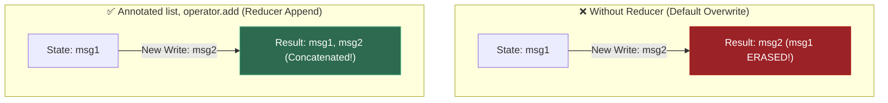

---

### 2.7 — Pydantic `BaseModel` & Automatic Type Coercion

A Python class inheriting from Pydantic's `BaseModel` that enforces type validation and performs **automatic type coercion** (converting compatible data like `"51000"` string to `51000.0` float) at runtime during object creation.

#### 💡 The Beginner Analogy: TSA Security Guard & Automatic Currency Exchange ✈️💱

Standard Python type hints (`age: int`) are like **polite suggestions on a sign board** — Python completely ignores them at runtime and lets invalid data like the string `"twenty"` slip right through into your calculations.

A Pydantic `BaseModel` is a **TSA Security Guard with an Automatic Currency Exchange**:

1. **Validation (Security Guard)**: It inspects every incoming piece of data before letting it enter your application logic. If invalid data (like an un-parseable string `"fifty"`) tries to enter, the guard stops it immediately at the front door (`ValidationError`).
2. **Type Coercion (Currency Exchange)**: If a traveler arrives with US Dollars (`"51000"` string from a JSON payload or API call), but your model requires Euros (`float`), the guard **automatically converts** the string `"51000"` into a clean Python float `51000.0` on the spot!

#### 💻 Code Example & ⚠️ Why It Matters

```python
from pydantic import BaseModel

# Standard Python Dict vs Pydantic BaseModel
class UserInvoice(BaseModel):
    user_id: int
    amount: float
    is_paid: bool

# ✅ Pydantic automatically coerces string "101" -> int 101, string "50.5" -> float 50.5, "true" -> True
raw_json_data = {"user_id": "101", "amount": "50.5", "is_paid": "true"}
invoice = UserInvoice(**raw_json_data)

print("Parsed user_id type:", type(invoice.user_id), invoice.user_id)
print("Parsed amount type: ", type(invoice.amount), invoice.amount)
print("Parsed is_paid type:", type(invoice.is_paid), invoice.is_paid)
print("Serialized to Dict :", invoice.model_dump())
```

##### Verified Output

```text
Parsed user_id type: <class 'int'> 101
Parsed amount type:  <class 'float'> 50.5
Parsed is_paid type: <class 'bool'> True
Serialized to Dict : {'user_id': 101, 'amount': 50.5, 'is_paid': True}
```

**Why It Matters**: Web servers (FastAPI) and LLM APIs return data as raw untyped strings or JSON text. Without Pydantic, code crashes deep inside business logic with `TypeError: can't multiply sequence by non-int of type 'str'` when trying to do math on `"50.5"`. Pydantic guarantees clean, fully-typed objects right at the entry boundary.

#### 🤖 Real-Time AI/ML Use Case

**Structured LLM Output Parsing**: LLMs output raw string text (e.g. `{"amount": "51000", "currency": "INR"}`). When calling OpenAI or Anthropic using `with_structured_output(InvoiceModel)`, Pydantic intercepts the LLM's text response, parses and type-coerces it into a verified Python object, guaranteeing your downstream AI agent pipeline receives 100% type-safe data.

#### 🎨 Visual Concept

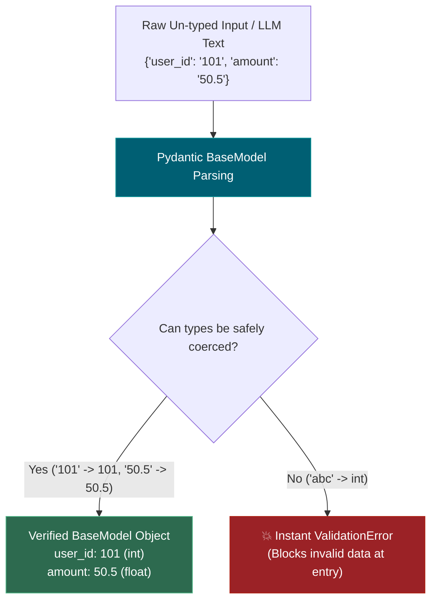

---

### 2.8 — Pydantic `Field(...)` Constraints & `Literal` Enums

Features in Pydantic used to define field-level constraints (`gt=0`, `max_length=50`, `description="..."`) and restricted sets of allowed values (`Literal["OPEN", "PAID"]`) that double as automatic JSON schema instructions for LLMs.

#### 💡 The Beginner Analogy: Custom Stencil & Multiple Choice Questionnaire 📐📝

* **`Field(...)` (Custom Stencil)**: Declaring `amount: float` only checks if data is a number. `Field(gt=0, description="Invoice amount in INR")` acts like a **custom stencil template** — it guarantees the number is positive ($> 0$) and attaches a clear descriptive instruction card explaining what the field represents.
* **`Literal[...]` (Multiple Choice)**: `status: Literal["OPEN", "PAID", "OVERDUE"]` is like a **multiple-choice exam question**. Instead of letting an API user or LLM write any arbitrary string like `"gonna pay later"`, it forces the value to match one of the exact listed choices.

#### 💻 Code Example & ⚠️ Why It Matters

```python
from typing import Literal
from pydantic import BaseModel, Field, ValidationError

class Order(BaseModel):
    order_id: str = Field(..., min_length=3, description="Unique 3+ char ID")
    quantity: int = Field(..., gt=0, le=100, description="Items count between 1 and 100")
    status: Literal["PENDING", "SHIPPED", "DELIVERED"]

# Valid Order
valid_order = Order(order_id="ORD-99", quantity=5, status="SHIPPED")
print("Valid Order:", valid_order.model_dump())

# ❌ Invalid Order: quantity is 0 (violates gt=0) and status is invalid
try:
    Order(order_id="O1", quantity=0, status="IN_TRANSIT")
except ValidationError as e:
    for err in e.errors():
        loc_str = ".".join(str(x) for x in err["loc"])
        print(f"Error on '{loc_str}': {err['msg']}")
```

##### Verified Output

```text
Valid Order: {'order_id': 'ORD-99', 'quantity': 5, 'status': 'SHIPPED'}
Error on 'order_id': String should have at least 3 characters
Error on 'quantity': Input should be greater than 0
Error on 'status': Input should be 'PENDING', 'SHIPPED' or 'DELIVERED'
```

**Why It Matters**: `Field` descriptions and `Literal` choices are exported directly into the JSON Schema sent to the LLM. This teaches the AI model exact numerical limits and valid enum choices *before* it generates a response, reducing hallucinated formats by over 90%.

#### 🤖 Real-Time AI/ML Use Case

**LLM Tool Calling & Function Schemas**: When providing tools to an AI agent (e.g. `execute_sql_query(limit: int = Field(gt=0, le=100))`), Pydantic automatically generates the OpenAPI/JSON schema that OpenAI or Anthropic uses to constrain the model's function calling parameters.

#### 🎨 Visual Concept

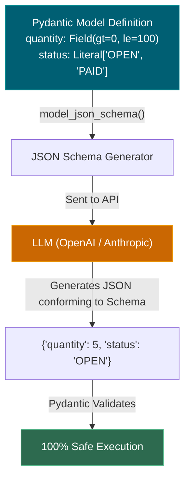

---

### 2.9 — Field Validator (`@field_validator`) & `ValidationError` (Self-Healing LLM Pipelines)

- **`@field_validator`**: A custom python method decorator in Pydantic that intercepts parsed field values to apply custom business logic (e.g., stripping whitespace, rejecting placeholder text like `"N/A"`).
- **`ValidationError`**: Pydantic's structured exception raised when validation fails, containing an exact list of field locations, failing values, and error reasons.

#### 💡 The Beginner Analogy: Quality Inspector & Rejection Ticket 🎟️

* **`@field_validator` (Quality Inspector)**: Even if a value is technically a string, the inspector checks if it makes semantic sense. If an LLM submits `"N/A"` or `"unknown"` for a vendor name, the inspector rejects it.
* **`ValidationError` (Rejection Ticket)**: Instead of crashing silently or throwing a generic error, Pydantic writes a **detailed rejection ticket**: *"Field 'vendor_name': 'N/A' is a placeholder, not a real business name."*

#### 💻 Code Example & ⚠️ Why It Matters

```python
from pydantic import BaseModel, field_validator, ValidationError

class VendorInvoice(BaseModel):
    vendor_name: str

    @field_validator("vendor_name")
    @classmethod
    def reject_placeholders(cls, v: str) -> str:
        cleaned = v.strip()
        if cleaned.lower() in {"", "n/a", "none", "unknown", "null"}:
            raise ValueError("vendor_name is a placeholder, not a real business name")
        return cleaned.title()  # Auto-normalizes to Title Case

# Valid vendor (auto-cleaned)
inv = VendorInvoice(vendor_name="  acme corp  ")
print("Cleaned Vendor Name:", repr(inv.vendor_name))

# Invalid placeholder vendor
try:
    VendorInvoice(vendor_name="N/A")
except ValidationError as e:
    err_detail = e.errors()[0]
    print("Caught Error Field:", err_detail["loc"][0])
    print("Caught Error Message:", err_detail["msg"])
```

##### Verified Output

```text
Cleaned Vendor Name: 'Acme Corp'
Caught Error Field: vendor_name
Caught Error Message: Value error, vendor_name is a placeholder, not a real business name
```

**Why It Matters**: This is the foundation of **Self-Healing LLM Pipelines**. When an LLM returns bad data, catching `ValidationError` gives you the exact field name and exact reason for failure. You format this error message directly into a retry prompt to the LLM, prompting it to fix its own mistake!

#### 🤖 Real-Time AI/ML Use Case

**Self-Healing AI Agent Extraction Loop**:

1. LLM extracts invoice: `{"vendor_name": "N/A", "amount": 500}`.
2. Pydantic raises `ValidationError`: `"vendor_name is a placeholder"`.
3. Agent automatically sends a retry prompt back to LLM: *"Your previous output was invalid: vendor_name is a placeholder. Please extract the real vendor name."*
4. LLM self-corrects and returns: `{"vendor_name": "Acme Corp", "amount": 500}`.

#### 🎨 Visual Concept

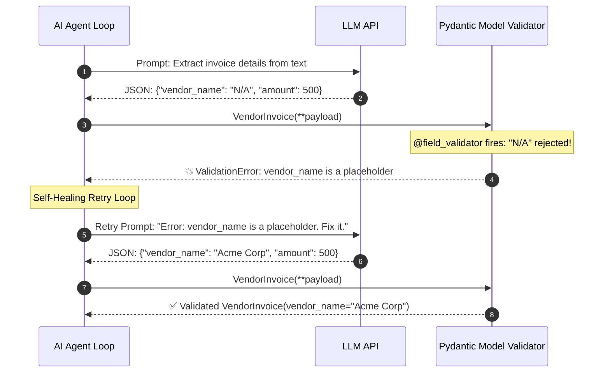

---

## 3. Skip Test — Answered

> Gate **before** studying. Both correct from memory → skip. §7 withholds its answers deliberately.

**① Difference between `asyncio.gather` and sequential awaits?**

Sequential `await`s run one at a time — each blocks until it finishes, so total time is the **sum** of the delays. `asyncio.gather` schedules all coroutines immediately and waits for all of them, so total time is the **maximum** of the delays. Demo 3 measures exactly this: 1.53s sequential versus 0.51s gathered for three 0.5-second calls — a 3.02x difference.

The catch: `gather` only helps for **I/O-bound** work. Three CPU-bound functions gain nothing, because the GIL means only one runs at a time.

**② What does a Pydantic field validator do that a type hint alone cannot?**

A type hint constrains the *type*; a validator constrains the *meaning*. `vendor: str` accepts `"N/A"`, `"unknown"` and `""` — all genuinely strings, all useless. A `@field_validator` rejects them, and can also normalise (strip whitespace, uppercase a code) on the way through. Demo 1 shows `"  Acme Ltd  "` being auto-stripped and `"N/A"` being rejected.

---

## 3. Visual Concept Diagrams

### 3.1 — Sequential vs gathered: where the wall-clock goes

```mermaid
gantt
    title Three 0.5s tool calls — measured 1.53s vs 0.51s
    dateFormat SSS
    axisFormat %L ms

    section Sequential (sum)
    sql      :s1, 000, 500ms
    search   :s2, after s1, 500ms
    email    :s3, after s2, 500ms

    section Gathered (max)
    sql      :g1, 000, 500ms
    search   :g2, 000, 500ms
    email    :g3, 000, 500ms
```

### 3.2 — The reducer: merge vs clobber

The single most common LangGraph bug, and it fails **silently** — no error, no warning, just a missing finding.

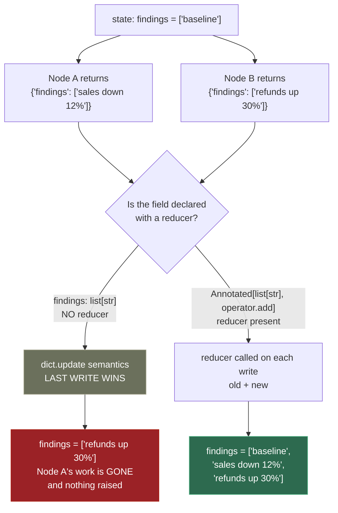

### 3.3 — Where validation sits in the LLM round trip

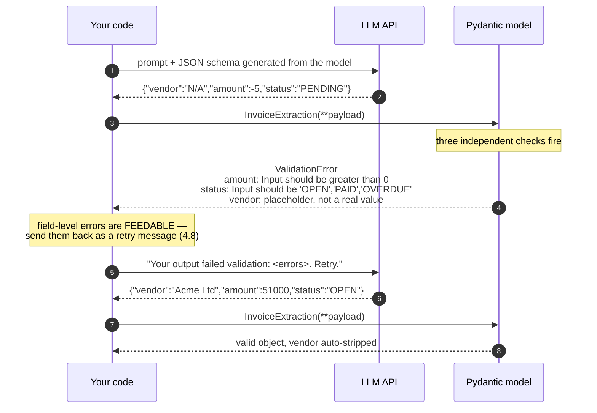

---

## 4. Core Technical Deep Dive

| Construct                       | What it does                                              | Reappears Later in Course Roadmap                                  |
| ------------------------------- | --------------------------------------------------------- | ------------------------------------------------------------------ |
| `BaseModel` + `Field(gt=0)` | Runtime constraint, not a hint                            | **0.9** (FastAPI), **4.8** (LLM Structured Outputs)    |
| `@field_validator`            | Rejects semantically-null but type-correct values         | **4.8** (LLM retry loops)                                    |
| `Literal[...]`                | Exact allowed set; appears in the generated JSON schema   | **6.13** (AI Tool Schemas)                                   |
| `TypedDict`                   | A plain dict at runtime, typed statically                 | **6.3** (LangGraph state) & **6.5** (Checkpointing)    |
| `Annotated[T, reducer]`       | Second arg tells LangGraph how to merge concurrent writes | **6.3** (LangGraph reducers)                                 |
| `asyncio.gather`              | Schedules all, waits for all — max not sum               | **6.10** (Multi-Agent Fan-Out) & **7.7** (Latency Ops) |
| `asyncio.wait_for`            | Bounds a call that may never return                       | **6.14** (Agent Failure Recovery)                            |

**Pydantic v1 → v2 traps.** Tutorials written before 2023 use the old names and will not run:

| v1               | v2                                               |
| ---------------- | ------------------------------------------------ |
| `.dict()`      | `.model_dump()`                                |
| `.json()`      | `.model_dump_json()`                           |
| `@validator`   | `@field_validator` + `@classmethod` under it |
| `.parse_obj()` | `.model_validate()`                            |

**When `gather` does nothing.** It parallelises *waiting*, not *computing*. Three network calls overlap; three tight numeric loops do not, because of the GIL. For CPU-bound work you need `ProcessPoolExecutor` — or, far more likely in this roadmap, NumPy (**0.6**), which releases the GIL inside its C routines anyway.

---

## 5. Hands-On Script & Verified Output

Run: `python 03_async_typehints_pydantic.py`. Output below is **actual, captured** on Python 3.14.4 / Pydantic 2.13.3.

```text
======================================================================
DEMO 1 — Pydantic rejects bad data AT CONSTRUCTION
======================================================================
  valid   : vendor='Acme Ltd' amount=51000.0 status='OPEN' currency='INR'
  note    : vendor was auto-stripped by the validator -> 'Acme Ltd'
  as json : {"vendor":"Acme Ltd","amount":51000.0,"status":"OPEN","currency":"INR"}
  negative amount : rejected -> amount: Input should be greater than 0
  bad status      : rejected -> status: Input should be 'OPEN', 'PAID' or 'OVERDUE'
  placeholder     : rejected -> vendor: Value error, vendor is a placeholder, not a real value
  amount as words : rejected -> amount: Input should be a valid number, unable to parse string as a
======================================================================
DEMO 2 — Annotated reducer: merge vs clobber on concurrent writes
======================================================================
  question annotation: <class 'str'>
  findings annotation: typing.Annotated[list[str], <built-in function add>]
  extracted reducer  : add

  no reducer (clobber): ['refunds up 30%']
  operator.add (merge): ['baseline', 'sales down 12%', 'refunds up 30%']
  ^ Without the reducer one agent's work vanishes silently —
    no error, no warning. The single most common LangGraph bug.
======================================================================
DEMO 3 — asyncio.gather vs sequential awaits (3 x 0.5s tools)
======================================================================
  sequential : 1.53s  ['sql done', 'search done', 'email done']
  gather     : 0.51s  ['sql done', 'search done', 'email done']
  speedup    : 3.02x
  same result: True
  ^ sequential = SUM of delays. gather = MAX of delays.
======================================================================
DEMO 4 — asyncio.wait_for bounds a hung call
======================================================================
  called a 30s tool with timeout=1.0s
  returned after 1.02s -> TIMEOUT after 1.0s -> return a typed error to the agent
  ^ Without wait_for, this blocks a graph node until the process dies.
======================================================================
```

**Demo 1's error messages are the product, not the failure.** `amount: Input should be greater than 0` names the field and the rule. That string is what you send back to the model to retry (**4.8**) — which is why validation belongs at the boundary rather than scattered through your business logic.

**Demo 2 is the one that costs people days.** The clobbered result contains only `['refunds up 30%']`. Node A ran, succeeded, and its finding vanished. Nothing raised. In a multi-agent system (**6.10**) this presents as "the researcher agent seems to be ignored sometimes."

**Modify and re-run:**

- Change `operator.add` to `operator.or_` and re-run Demo 2 with `set` instead of `list`. Predict the deduplication behaviour first.
- Make the three tools in Demo 3 CPU-bound (a tight `sum(range(10**7))` loop instead of `asyncio.sleep`). Predict the speedup before running — it will not be 3x, and understanding why is the point.
- Drop `timeout=1.0` from Demo 4 and confirm it now takes 30 seconds. That is what an unbounded tool call does to a graph node.

---

## 6. Video

**"Next-Level Concurrent Programming In Python With Asyncio"** — *ArjanCodes* — [youtube.com/watch?v=GpqAQxH1Afc](https://www.youtube.com/watch?v=GpqAQxH1Afc). Verified live.

For Pydantic v2 specifically: **[VERIFY]** — no single video was confirmed current for this pass. The official docs at `docs.pydantic.dev` are the reliable source, and their migration guide is the fastest way to unlearn v1 habits picked up from older tutorials.

---

## 7. Retrieval Checkpoint — Unanswered

> Close this file. No notes. Answers deliberately withheld.

1. What does `Annotated[list[str], operator.add]` do in a LangGraph state schema that plain `list[str]` does not, and describe exactly what a user would *observe* when the reducer is missing.
2. Three tools each take 0.5 seconds. Give the total wall-clock for sequential awaits and for `gather`, then name one situation where `gather` gives no speedup at all.
3. Name the Pydantic v2 replacements for `.dict()`, `.json()` and `@validator`.

---

## 8. Closed-Book Rebuild

With this file **and** the script closed: write a Pydantic v2 model with one constrained numeric field, one `Literal` field and one custom validator rejecting placeholder strings; then an async function calling three simulated tools concurrently with a timeout on the batch; then demonstrate merge-versus-clobber on a state dict with and without a reducer.

---

## Review again in

**3 days** — high density, three distinct subjects in one topic. The `Annotated` reducer will not stick on one pass and is load-bearing for all of Phase 6.
