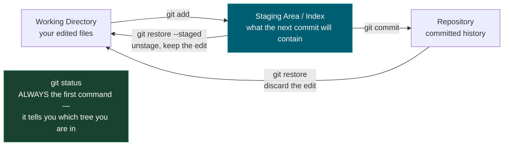
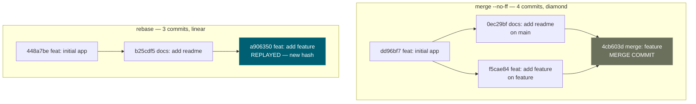
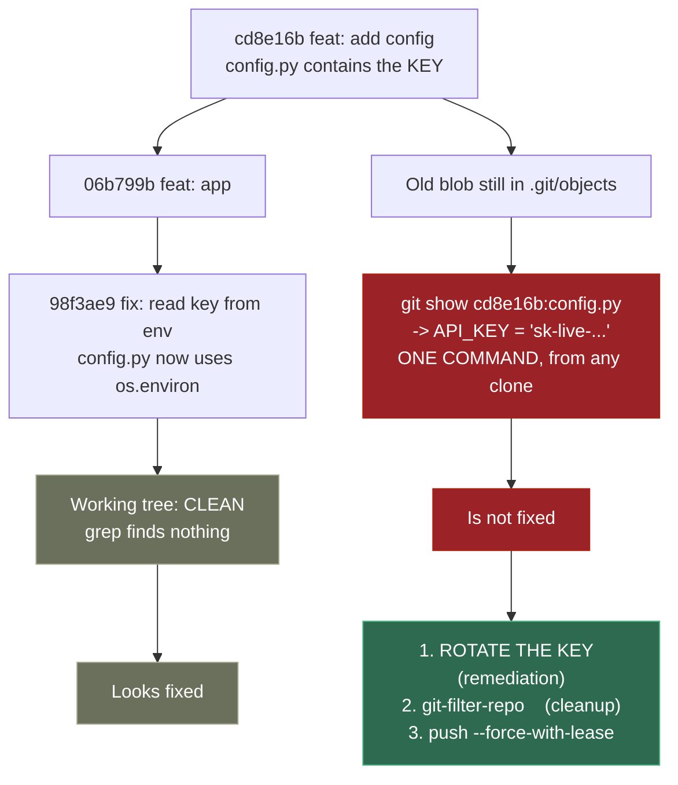

# 0.4 — Git and GitHub

**Phase 0 · CORE · CODE · 5 focused hours · Review in 7 days**

**Companion script:** [`04_git_and_github.py`](04_git_and_github.py) — needs `git` on PATH. Builds throwaway repos under the system temp folder and deletes them afterwards; it never touches your real repositories.

---

## 1. Overview

Absent from all three source documents behind this roadmap, and non-negotiable in practice: **your portfolio is your GitHub.** The five capstones in **Phase 8** are only worth the hours if a hiring manager can find, read and trust them.

Two mechanics matter beyond ordinary branching. **History rewriting**, because interviewers do read commit logs and `fix`, `fix2`, `asdf` is a signal. And **secret removal**, because from **Phase 4** onward you will be committing code that talks to paid LLM APIs — and deleting the line does not remove the key. Demo 2 proves that rather than asserting it.

Feeds **0.5** pytest and **7.5**, where GitHub Actions runs an eval suite as a merge gate.

---

## 2. Skip Test — Answered

> Gate **before** studying. Both correct from memory → skip. §7 withholds its answers deliberately.

**① What does `git rebase` do differently from `git merge`?**

`merge` joins two branches with a **merge commit**, preserving the true shape of what happened — you get a diamond in the graph. `rebase` **replays** your commits on top of the target branch as though you had written them after it, giving a straight line. Demo 1 runs identical work through both: merge yields 4 commits with a visible diamond, rebase yields 3 in a line.

The trade-off: rebase is more readable, but it **rewrites commit hashes**. Never rebase a branch someone else has pulled — their history and yours diverge irreconcilably.

**② How would you remove a committed API key from history?**

Two steps, and the order matters. **First, rotate the key** — assume it is compromised the moment it is pushed. **Then** purge it with `git-filter-repo` (not the deprecated `filter-branch`) and force-push with `--force-with-lease`.

The reason rotation comes first is Demo 2: the key stays fetchable from the old blob no matter how clean the working tree looks. Rewriting history is cleanup; rotation is the actual remediation.

---

## 3. Visual Concept Diagrams

### 3.1 — The three trees

Almost every confusing Git moment is not knowing which of these three places your change is sitting in.



### 3.2 — Merge vs rebase, as actually produced by Demo 1



### 3.3 — Why a deleted secret is still live



---

## 4. Core Technical Deep Dive

| Situation | Correct command | Why not the alternative |
|---|---|---|
| Messy commits before a PR | `git rebase -i HEAD~5` | Squashing at merge time hides which change caused what |
| Undo a **pushed** commit | `git revert <sha>` | `reset --hard` + force-push breaks everyone's clone |
| Undo a **local** commit | `git reset` | `revert` leaves a pointless "undo" commit in history |
| Leaked key | Rotate, **then** `git-filter-repo` | Deleting the line leaves the blob fetchable (Demo 2) |
| Force-push after a rewrite | `--force-with-lease` | Plain `--force` silently overwrites others' pushes |
| Discard an unstaged edit | `git restore <file>` | — |
| Unstage but keep the edit | `git restore --staged <file>` | — |

**Prevention, applied once per repo:**

```gitignore
.env
.venv/
__pycache__/
*.ipynb_checkpoints
mlruns/          # 7.10 MLflow local runs — large and machine-specific
data/raw/        # never commit datasets
```

**Portfolio presentation.** This is what converts Phase 8 hours into interviews. Each capstone repo needs a README that opens with **what it does and what it measured** — not installation steps — plus the decision log the roadmap asks for, a `requirements.txt` that actually installs, and commit messages a stranger can follow.

---

## 5. Hands-On Script & Verified Output

Run: `python 04_git_and_github.py`. Output below is **actual, captured** on git 2.53.0. Hashes will differ on your machine; the shapes will not.

```text
git version: git version 2.53.0.windows.2
scratch dir: ...\Temp\git-demo-aglzogtv  (safe — nothing here is yours)
======================================================================
DEMO 1 — merge vs rebase: the SAME work, two different histories
======================================================================

  --- MERGE (4 commits on main) ---
    *   4cb603d merge: feature
    |\
    | * f5cae84 feat: add feature
    * | 0ec29bf docs: add readme
    |/
    * dd96bf7 feat: initial app

  --- REBASE (3 commits on main) ---
    * a906350 feat: add feature
    * b25cdf5 docs: add readme
    * 448a7be feat: initial app

  merge  : preserves the true shape, adds a merge commit (diamond)
  rebase : replays commits onto main -> linear, readable, but the
           commit HASHES change. Never rebase a branch others pulled.
======================================================================
DEMO 2 — deleting a secret does NOT remove it from history
======================================================================
  working tree now clean? secret in config.py: False
  commits still containing the secret (git log -S):
    98f3ae9 fix: read key from env
    cd8e16b feat: add config

  git show cd8e16b0:config.py
    -> API_KEY = "sk-live-DEMO0000NOTAREALKEY0000"
  SECRET STILL FETCHABLE: True

  ^ The file looks clean. The key is one command away for anyone
    who clones the repo. Step 1 is ROTATE THE KEY; rewriting
    history afterwards is cleanup, not remediation.
======================================================================
DEMO 3 — rewriting history changes every downstream hash
======================================================================
  BEFORE                        AFTER
    6104341 feat: one            0b189f3 feat: one (reworded)  <- changed
    06b799b feat: two            f64db64 feat: two  <- changed
    176a707 feat: three          41c4342 feat: three  <- changed

  ^ Editing the OLDEST commit changed the hash of EVERY commit
    after it. That is why force-push is required, and why
    --force-with-lease (not --force) is the safe form.
======================================================================
```

**Demo 1's two graphs are the whole argument.** Same work, same files, same order — 4 commits with a diamond versus 3 in a line. Neither is wrong; they encode different priorities.

**Demo 2 is the one to internalise.** `grep` on the working tree finds nothing. `git log -S` finds two commits. `git show <sha>:config.py` prints the key in full. Anyone who has ever cloned the repo — or any fork, or a cached view — has it.

**Demo 3 explains the force-push requirement.** Changing the *oldest* commit changed all three hashes, because a commit's hash includes its parent's. History is a chain, so an edit anywhere rewrites everything after it.

**Modify and re-run:**
- In Demo 1, drop `--no-ff` from the merge and re-run. Predict the graph first — Git will fast-forward and you will get a *third* shape.
- In Demo 2, add a `.gitignore` with `.env` before the first commit, move the key there, and confirm `git log -S` finds nothing.
- In Demo 3, amend the **newest** commit instead of the oldest. Predict how many hashes change before running.

---

## 6. Video

**"Git & GitHub Crash Course for Beginners [2026]"** — *freeCodeCamp.org* — [youtube.com/watch?v=mAFoROnOfHs](https://www.youtube.com/watch?v=mAFoROnOfHs). Verified live. Covers add/commit/status/log/reset/restore, branching and merge conflicts, push/pull, and stash/revert/rebase. ~81 minutes. If branching and merging are already comfortable, skip to the rebase and conflict-resolution sections.

---

## 7. Retrieval Checkpoint — Unanswered

> Close this file. No notes. Answers deliberately withheld.

1. What does `git rebase` do differently from `git merge`, and name the one situation where rebasing is actively dangerous — and why.
2. You committed and pushed an API key three commits ago. List the steps in order, and state which step is remediation and which is merely cleanup.
3. What does `--force-with-lease` protect against that `--force` does not?

---

## 8. Closed-Book Rebuild

With this file **and** the script closed: initialise a repo, make three messy commits including a fake secret in a config file, then produce a clean single-commit history with the secret purged, a working `.gitignore`, and a README that opens with what the project measured. Verify with `git log --all -S` that the secret is genuinely gone.

---

## 9. Glossary

**Working directory / staging area / repository** — the three places a change can live. `git add` moves left to right; `git restore` moves right to left.

**Merge commit** — a commit with two parents, produced by `git merge`, recording that two lines of development joined.

**Fast-forward** — when the target branch has not moved, Git just advances the pointer instead of creating a merge commit. `--no-ff` forces the merge commit anyway.

**Rebase** — replaying commits onto a new base. Produces linear history at the cost of new commit hashes.

**Commit hash** — a SHA of the commit's content *including its parent*. This is why rewriting one commit cascades to every descendant.

**`git log -S <string>`** — searches history for commits that added or removed a string. The correct way to hunt a leaked secret; `grep` on the working tree is not.

**`git-filter-repo`** — the current supported tool for rewriting history at scale. Replaces the deprecated and dangerously slow `filter-branch`.

**`--force-with-lease`** — force-push that aborts if the remote moved since your last fetch, so you cannot silently destroy someone else's work.

**`git revert`** — creates a *new* commit that undoes an old one. Safe on shared branches, unlike `reset --hard`.

---

## Review again in

**7 days** — low density. Rehearse the secret-purge sequence once more, because the first time it happens for real it will be under pressure.

