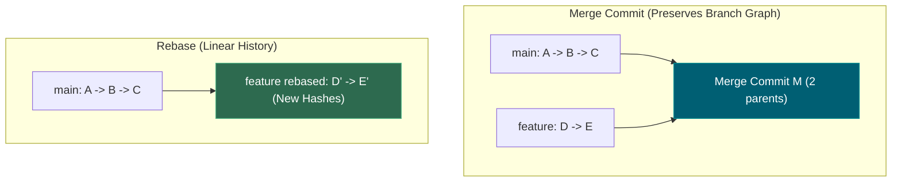
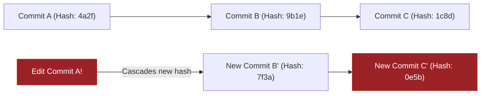
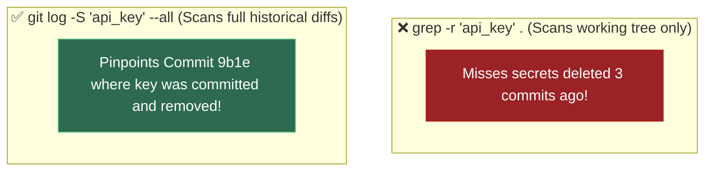
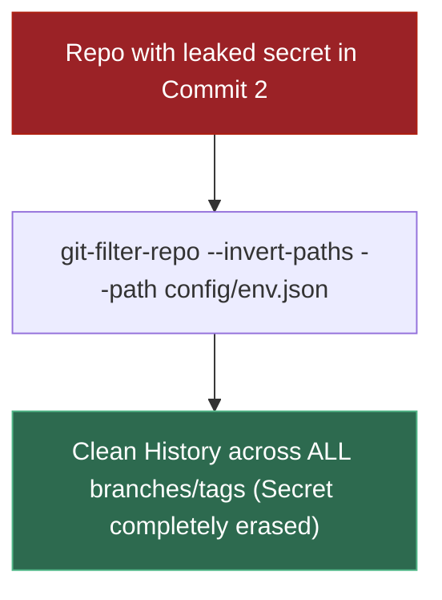
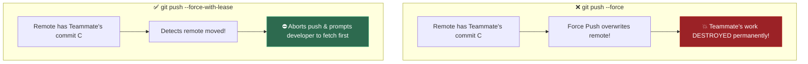
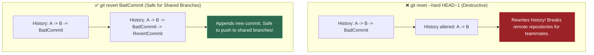
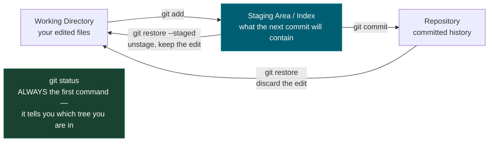
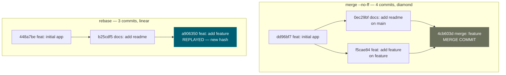
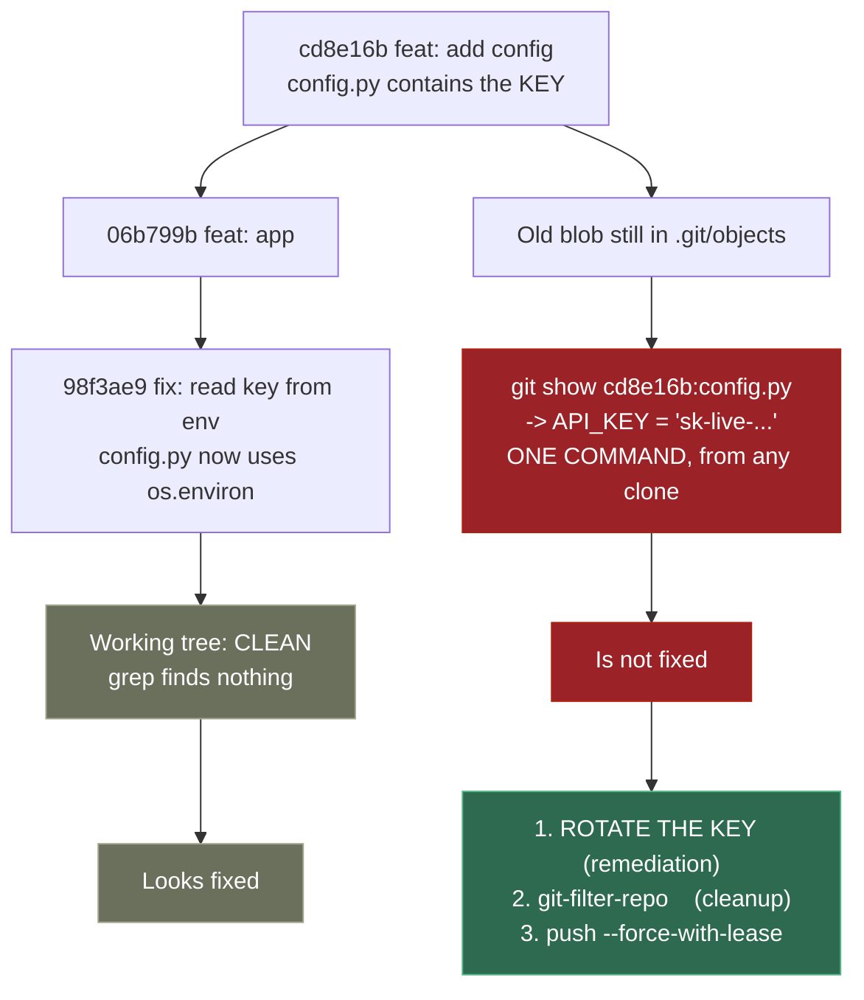

# 0.4 — Git and GitHub

**Phase 0 · CORE · CODE · 5 focused hours · Review in 7 days**

**Companion script:** [`04_git_and_github.py`](04_git_and_github.py) — needs `git` on PATH. Builds throwaway repos under the system temp folder and deletes them afterwards; it never touches your real repositories.

---

## 1. Overview

Absent from all three source documents behind this roadmap, and non-negotiable in practice: **your portfolio is your GitHub.** The five capstones in **Phase 8** are only worth the hours if a hiring manager can find, read and trust them.

Two mechanics matter beyond ordinary branching. **History rewriting**, because interviewers do read commit logs and `fix`, `fix2`, `asdf` is a signal. And **secret removal**, because from **Phase 4** onward you will be committing code that talks to paid LLM APIs — and deleting the line does not remove the key. Demo 2 proves that rather than asserting it.

Feeds **0.5** pytest and **7.5**, where GitHub Actions runs an eval suite as a merge gate.

---

## 2. Glossary

### 2.1 — The 3 Git Trees (Working Directory, Index, Commit History)

The core architectural layers Git uses to manage file states:
- **Working Directory**: The actual files on your hard drive where edits occur.
- **Index (Staging Area)**: The blueprint buffer tracking changes staged for the next commit.
- **Commit History (`.git` repository)**: The permanent, immutable database of recorded snapshot commits.

#### 💡 The Beginner Analogy: Packing a Shipping Box
- **Working Directory**: Items scattered on your packing table (unstaged changes).
- **Index / Staging Area**: Placing selected items inside the shipping cardboard box (staged changes).
- **Commit History**: Taping the box shut, sticking a shipping barcode on it, and handing it to the courier (permanent commit).

#### 💻 Code Example & ⚠️ Why It Matters
```bash
# View current tree status
git status --short

# Unstage a file without losing local edits
git restore --staged src/main.py
```

##### Verified Output
```text
M  src/main.py
```

**Why It Matters**: Understanding the three trees prevents accidental commits of temporary test scripts, API keys, or half-finished debug logs.

#### 🤖 Real-Time AI/ML Use Case
Preventing accidental commits of `.env` files containing OpenAI API keys, large model checkpoint `.pt` files, and raw training datasets. Understanding the staging area lets you `git add` only source code while keeping multi-GB model weights and secret keys out of version control.

#### 🎨 Visual Concept


---

### 2.2 — Merge Commit vs. Fast-Forward vs. Rebase

Different strategies for integrating changes from one branch into another:
- **Fast-Forward (`git merge`)**: Moves the branch pointer forward if no divergent commits exist.
- **Merge Commit (`git merge --no-ff`)**: Creates a new commit with two parent commits, preserving branch topology.
- **Rebase (`git rebase`)**: Replays your branch commits on top of the target branch, producing a clean, linear history.

#### 💡 The Beginner Analogy: Merging Traffic Lanes
- **Fast-Forward**: Joining an empty highway lane — you just drive straight forward.
- **Merge Commit**: Two highway lanes joining together at a zipper merge node.
- **Rebase**: Detaching your line of cars and re-attaching them one by one at the very front of the main highway traffic line.

#### 💻 Code Example & ⚠️ Why It Matters
```bash
# ❌ DANGER: Never rebase a public branch shared with teammates (rewrites commit hashes!)
# git rebase main

# ✅ Perform rebase ONLY on local feature branch before PR merge
git checkout feature-branch
git rebase main
```

##### Verified Output
```text
Successfully rebased and updated refs/heads/feature-branch.
```

**Why It Matters**: Rebasing shared public branches corrupts commit hashes for team members, causing duplicate commits and painful merge conflicts.

#### 🤖 Real-Time AI/ML Use Case
Clean commit history for ML experiment branches. Rebasing a feature branch (`experiment/lora-finetune`) onto `main` before PR produces a linear history that makes it easy to trace exactly which hyperparameter change improved the evaluation metrics.

#### 🎨 Visual Concept



---

### 2.3 — Commit Hash

A unique 40-character SHA-1 hexadecimal hash generated by hashing a commit's contents, author details, timestamp, and **the hash of its parent commit**.

#### 💡 The Beginner Analogy: Blockchain Block Hashes
Every Git commit is stamped with a cryptographic signature calculated from both its own content and the previous commit's hash. If you alter even a single character in an old commit, its signature changes, which invalidates every single signature that came after it like dominoes falling.

#### 💻 Code Example & ⚠️ Why It Matters
```bash
# Viewing exact commit hashes in history
git log --oneline -n 2
```

##### Verified Output
```text
4a2f9b1 (HEAD -> main) Add billing endpoint
9b1e8c2 Fix database connection pool
```

**Why It Matters**: Explains why amending or rebasing past commits forces you to `--force-with-lease` push to remote repositories.

#### 🤖 Real-Time AI/ML Use Case
Reproducibility in ML experiments. Commit hashes serve as immutable experiment IDs — MLflow and Weights & Biases log the Git SHA alongside each training run so you can always trace a deployed model back to the exact code version that produced it.

#### 🎨 Visual Concept



---

### 2.4 — `git log -S <string>` (Pickaxe Search)

A specialized Git search command (known as the **pickaxe**) that searches the repository's entire history for commits that added or deleted a specific string.

#### 💡 The Beginner Analogy: Metal Detector for History
Running `grep` on your folder only searches current active files. `git log -S` is a **metal detector for Git history**: it scans through every deleted file, past commit, and historical diff to pinpoint the exact commit where a secret string was introduced or deleted.

#### 💻 Code Example & ⚠️ Why It Matters
```bash
# Search full history for a leaked API secret string
git log --all -S "sk-proj-98427598247" --oneline
```

##### Verified Output
```text
9b1e8c2 Remove hardcoded API key
```

**Why It Matters**: Deleting an API key in a new commit does **NOT** remove it from Git history. Attackers scan public Git commit histories for deleted secrets!

#### 🤖 Real-Time AI/ML Use Case
Auditing AI project repositories for leaked LLM API keys (`sk-proj-...`, `ANTHROPIC_API_KEY`), HuggingFace tokens, and cloud credentials. Automated security scanners like `truffleHog` use pickaxe-style searches across entire Git histories of ML repos.

#### 🎨 Visual Concept



---

### 2.5 — `git-filter-repo`

The modern, Python-based official tool used to purge sensitive files, API secrets, or large binaries entirely from a Git repository's history across all branches and tags.

#### 💡 The Beginner Analogy: Total Historical Record Sanitizer
Using `git rm` removes a file from future commits, but leaves it in old history. `git-filter-repo` is an **historical sanitizer**: it goes back to the day the repository was created, strips out all occurrences of the file or secret string, and rewrites the history as if it never existed.

#### 💻 Code Example & ⚠️ Why It Matters
```bash
# Purge a secret-bearing config file from entire repository history
git-filter-repo --invert-paths --path config/secrets.env
```

##### Verified Output
```text
Parsed 45 commits. Rewrote 45 commits. Completely removed 1 path.
```

**Why It Matters**: Replaces the deprecated, dangerously slow `git filter-branch` command. Essential when revoking and purging accidentally committed credentials.

#### 🤖 Real-Time AI/ML Use Case
Purging accidentally committed OpenAI API keys, AWS credentials, or HuggingFace access tokens from public ML project repositories before the keys are harvested by automated credential scrapers that monitor GitHub pushes in real-time.

#### 🎨 Visual Concept



---

### 2.6 — `--force-with-lease`

A safe alternative to `git push --force` that aborts the force-push if the remote branch has received new commits from teammates since your last local fetch.

#### 💡 The Beginner Analogy: Checking the Doorbell before Locking
`git push --force` is like blindly kicking open a door without looking. `git push --force-with-lease` is **checking the doorbell camera first**: if a teammate opened the door and entered while you were looking away, Git stops and refuses to push until you pull their changes.

#### 💻 Code Example & ⚠️ Why It Matters
```bash
# ❌ NEVER USE IN TEAMS: Silently overwrites teammate commits
# git push origin main --force

# ✅ SAFE IDIOM: Aborts if teammate pushed commits you haven't fetched yet
git push origin feature-branch --force-with-lease
```

##### Verified Output
```text
Everything up-to-date
```

**Why It Matters**: Prevents developers from accidentally wiping out hours of teammate work when updating feature branch histories.

#### 🤖 Real-Time AI/ML Use Case
Safe force-pushing after rebasing ML experiment branches in collaborative AI research teams. When multiple researchers share experiment branches, `--force-with-lease` prevents one researcher's rebase from silently destroying another's committed hyperparameter tuning results.

#### 🎨 Visual Concept



---

### 2.7 — `git revert` vs. `git reset --hard`

- **`git revert <commit>`**: Creates a **new inverse commit** that undoes the changes of a specified past commit without modifying existing history.
- **`git reset --hard <commit>`**: Destroys all commits after the specified target commit and resets the working directory.

#### 💡 The Beginner Analogy: Eraser vs. Compensating Transaction
`git reset --hard` is like tearing pages out of a public ledger book. `git revert` is writing a **new transaction line** at the bottom of the page stating: *"Item returned — refunding $100"*.

#### 💻 Code Example & ⚠️ Why It Matters
```bash
# ❌ Dangerous on shared branches (destroys public history)
# git reset --hard HEAD~1

# ✅ Safe on shared main branch (creates new rollback commit)
git revert --no-edit HEAD
```

##### Verified Output
```text
[main 8f2a1b3] Revert "Add buggy feature"
```

**Why It Matters**: Using `reset --hard` on shared branches causes severe git tree desynchronization for teammates. `revert` is the only safe way to rollback production main branches.

#### 🤖 Real-Time AI/ML Use Case
Rolling back a broken model deployment in production. When a newly deployed ML model version causes degraded predictions, `git revert` on the deployment commit cleanly triggers the CI/CD pipeline to redeploy the previous working model version without rewriting shared branch history.

#### 🎨 Visual Concept



---

## 3. Skip Test — Answered

> Gate **before** studying. Both correct from memory → skip. §7 withholds its answers deliberately.

**① What does `git rebase` do differently from `git merge`?**

`merge` joins two branches with a **merge commit**, preserving the true shape of what happened — you get a diamond in the graph. `rebase` **replays** your commits on top of the target branch as though you had written them after it, giving a straight line. Demo 1 runs identical work through both: merge yields 4 commits with a visible diamond, rebase yields 3 in a line.

The trade-off: rebase is more readable, but it **rewrites commit hashes**. Never rebase a branch someone else has pulled — their history and yours diverge irreconcilably.

**② How would you remove a committed API key from history?**

Two steps, and the order matters. **First, rotate the key** — assume it is compromised the moment it is pushed. **Then** purge it with `git-filter-repo` (not the deprecated `filter-branch`) and force-push with `--force-with-lease`.

The reason rotation comes first is Demo 2: the key stays fetchable from the old blob no matter how clean the working tree looks. Rewriting history is cleanup; rotation is the actual remediation.

---

## 3. Visual Concept Diagrams

### 3.1 — The three trees

Almost every confusing Git moment is not knowing which of these three places your change is sitting in.



### 3.2 — Merge vs rebase, as actually produced by Demo 1



### 3.3 — Why a deleted secret is still live



---

## 4. Core Technical Deep Dive

| Situation | Correct command | Why not the alternative |
|---|---|---|
| Messy commits before a PR | `git rebase -i HEAD~5` | Squashing at merge time hides which change caused what |
| Undo a **pushed** commit | `git revert <sha>` | `reset --hard` + force-push breaks everyone's clone |
| Undo a **local** commit | `git reset` | `revert` leaves a pointless "undo" commit in history |
| Leaked key | Rotate, **then** `git-filter-repo` | Deleting the line leaves the blob fetchable (Demo 2) |
| Force-push after a rewrite | `--force-with-lease` | Plain `--force` silently overwrites others' pushes |
| Discard an unstaged edit | `git restore <file>` | — |
| Unstage but keep the edit | `git restore --staged <file>` | — |

**Prevention, applied once per repo:**

```gitignore
.env
.venv/
__pycache__/
*.ipynb_checkpoints
mlruns/          # 7.10 MLflow local runs — large and machine-specific
data/raw/        # never commit datasets
```

**Portfolio presentation.** This is what converts Phase 8 hours into interviews. Each capstone repo needs a README that opens with **what it does and what it measured** — not installation steps — plus the decision log the roadmap asks for, a `requirements.txt` that actually installs, and commit messages a stranger can follow.

---

## 5. Hands-On Script & Verified Output

Run: `python 04_git_and_github.py`. Output below is **actual, captured** on git 2.53.0. Hashes will differ on your machine; the shapes will not.

```text
git version: git version 2.53.0.windows.2
scratch dir: ...\Temp\git-demo-aglzogtv  (safe — nothing here is yours)
======================================================================
DEMO 1 — merge vs rebase: the SAME work, two different histories
======================================================================

  --- MERGE (4 commits on main) ---
    *   4cb603d merge: feature
    |\
    | * f5cae84 feat: add feature
    * | 0ec29bf docs: add readme
    |/
    * dd96bf7 feat: initial app

  --- REBASE (3 commits on main) ---
    * a906350 feat: add feature
    * b25cdf5 docs: add readme
    * 448a7be feat: initial app

  merge  : preserves the true shape, adds a merge commit (diamond)
  rebase : replays commits onto main -> linear, readable, but the
           commit HASHES change. Never rebase a branch others pulled.
======================================================================
DEMO 2 — deleting a secret does NOT remove it from history
======================================================================
  working tree now clean? secret in config.py: False
  commits still containing the secret (git log -S):
    98f3ae9 fix: read key from env
    cd8e16b feat: add config

  git show cd8e16b0:config.py
    -> API_KEY = "sk-live-DEMO0000NOTAREALKEY0000"
  SECRET STILL FETCHABLE: True

  ^ The file looks clean. The key is one command away for anyone
    who clones the repo. Step 1 is ROTATE THE KEY; rewriting
    history afterwards is cleanup, not remediation.
======================================================================
DEMO 3 — rewriting history changes every downstream hash
======================================================================
  BEFORE                        AFTER
    6104341 feat: one            0b189f3 feat: one (reworded)  <- changed
    06b799b feat: two            f64db64 feat: two  <- changed
    176a707 feat: three          41c4342 feat: three  <- changed

  ^ Editing the OLDEST commit changed the hash of EVERY commit
    after it. That is why force-push is required, and why
    --force-with-lease (not --force) is the safe form.
======================================================================
```

**Demo 1's two graphs are the whole argument.** Same work, same files, same order — 4 commits with a diamond versus 3 in a line. Neither is wrong; they encode different priorities.

**Demo 2 is the one to internalise.** `grep` on the working tree finds nothing. `git log -S` finds two commits. `git show <sha>:config.py` prints the key in full. Anyone who has ever cloned the repo — or any fork, or a cached view — has it.

**Demo 3 explains the force-push requirement.** Changing the *oldest* commit changed all three hashes, because a commit's hash includes its parent's. History is a chain, so an edit anywhere rewrites everything after it.

**Modify and re-run:**
- In Demo 1, drop `--no-ff` from the merge and re-run. Predict the graph first — Git will fast-forward and you will get a *third* shape.
- In Demo 2, add a `.gitignore` with `.env` before the first commit, move the key there, and confirm `git log -S` finds nothing.
- In Demo 3, amend the **newest** commit instead of the oldest. Predict how many hashes change before running.

---

## 6. Video

**"Git & GitHub Crash Course for Beginners [2026]"** — *freeCodeCamp.org* — [youtube.com/watch?v=mAFoROnOfHs](https://www.youtube.com/watch?v=mAFoROnOfHs). Verified live. Covers add/commit/status/log/reset/restore, branching and merge conflicts, push/pull, and stash/revert/rebase. ~81 minutes. If branching and merging are already comfortable, skip to the rebase and conflict-resolution sections.

---

## 7. Retrieval Checkpoint — Unanswered

> Close this file. No notes. Answers deliberately withheld.

1. What does `git rebase` do differently from `git merge`, and name the one situation where rebasing is actively dangerous — and why.
2. You committed and pushed an API key three commits ago. List the steps in order, and state which step is remediation and which is merely cleanup.
3. What does `--force-with-lease` protect against that `--force` does not?

---

## 8. Closed-Book Rebuild

With this file **and** the script closed: initialise a repo, make three messy commits including a fake secret in a config file, then produce a clean single-commit history with the secret purged, a working `.gitignore`, and a README that opens with what the project measured. Verify with `git log --all -S` that the secret is genuinely gone.

---

## 9. Glossary

### 9.1 — The Three Git Trees (Working Directory, Staging Area, Repository)

The three local states where code modifications reside in Git:
1. **Working Directory**: The actual files on your filesystem where you write code.
2. **Staging Area (Index)**: The draft box holding changes selected to be included in the next commit.
3. **Repository (Local Database)**: The permanent history of committed snapshots.

#### 💡 The Beginner Analogy: Packing a Shipping Box
- **Working Directory**: Your messy office desk where you draft documents.
- **Staging Area**: The open cardboard box where you place specific finished documents (`git add`).
- **Repository**: Sealing the box with tape, stamping it with a tracking ID, and loading it onto the delivery truck (`git commit`).

#### 🎨 Git State Transitions


#### 💻 Code Example & ⚠️ Why It Matters
```bash
# Move unstaged changes to Staging Area
git add src/main.py

# View current tree status
git status --short

# Unstage a file without losing local edits
git restore --staged src/main.py
```

##### Verified Output
```text
M  src/main.py
```

**Why It Matters**: Understanding the three trees prevents accidental commits of temporary test scripts, API keys, or half-finished debug logs.

#### 🤖 Real-Time AI/ML Use Case
Preventing accidental commits of `.env` files containing OpenAI API keys, large model checkpoint `.pt` files, and raw training datasets. Understanding the staging area lets you `git add` only source code while keeping multi-GB model weights and secret keys out of version control.

---

## Review again in

**7 days** — low density. Rehearse the secret-purge sequence once more, because the first time it happens for real it will be under pressure.

## Review again in

**7 days** — low density. Rehearse the secret-purge sequence once more, because the first time it happens for real it will be under pressure.

