# 0.5 — Testing with pytest

**Phase 0 · CORE · CODE · 5 focused hours · Review in 3 days**

**Companion script:** [`05_testing_with_pytest.py`](05_testing_with_pytest.py) — `pip install pytest`, then run it. Writes a throwaway test package under system temp, runs pytest against it, prints the real output, deletes it.

---

## 1. Overview

Not present in any of the three source documents behind this roadmap, and the gap shows up in a specific place later: **the eval suites in 7.5 are just tests with fuzzy assertions**, and a CI gate needs a test runner to be a gate at all. Learning pytest now makes **7.5** a small extension rather than a new subject.

Two constructs carry the weight. **Fixtures** — setup that gets injected by name into any test that asks for it (or run automatically with `autouse=True` for invariant background side-effects like cleaning state or setting test environments). And **parametrization**, which turns one function into fifty cases. A 50-case golden eval set in **7.1** is unmaintainable as fifty copy-pasted functions and trivial as one parametrized test.

Builds on **0.1** (a test is just a function) and **0.2** (`__init__.py` is what makes your package importable from `tests/`). Feeds **7.5** CI regression gates directly, and **7.10** reproducibility indirectly — an untested pipeline cannot be trusted to reproduce.

### 🔬 Architectural Deep-Dives & Explanations

For in-depth test server mechanics and dynamic fixture execution models related to this topic, see:

- [ephemeral-ports-port-0-and-free-port-runner.md](file:///d:/Madhan_Utils/learnings/ai-ml/ai-ml-course/explanations/ephemeral-ports-port-0-and-free-port-runner.md) — Ephemeral Ports, Port 0 Binding, and the Dynamic `free_port()` Runner Pattern for Non-Colliding Pytest Test Servers.

---

## 2. Glossary

### 2.1 — Pytest (The Python Testing Framework & Test Runner)

Python's industry-standard testing framework and test runner that automates test discovery, execution, dependency injection, and assertion inspection without requiring boilerplate classes or manual test suite wiring.

#### 💡 The Beginner Analogy: The Automated Factory Inspection Checklist
Instead of a developer manually running scripts and squinting at console printouts (`python script.py` and reading console logs) to verify if changes broke something, **Pytest** is an **automated quality control inspection line**. You run `pytest`, and it systematically walks through your entire codebase, locates every test file (`test_*.py`), runs every check, and flags every failure with exact variable values and line numbers.

#### 💻 Code Example & ⚠️ Why It Matters
```python
# test_pricing.py
def calculate_discount(price: float, rate: float) -> float:
    if rate < 0 or rate > 1:
        raise ValueError("rate must be between 0 and 1")
    return price * (1 - rate)


def test_calculate_discount():
    # Plain Python assert — no boilerplate classes or self.assertEqual required!
    assert calculate_discount(100.0, 0.2) == 80.0
    assert calculate_discount(50.0, 0.0) == 50.0
```

##### Verified Output
```text
collected 1 item

test_pricing.py::test_calculate_discount PASSED                          [100%]

============================== 1 passed in 0.01s ==============================
```

**Why It Matters**: Manual ad-hoc testing is fragile and quickly abandoned. Pytest standardizes testing into deterministic exit codes (`0` for pass, `1` for fail) that gate code merges in automated CI/CD pipelines.

#### 🤖 Real-Time AI/ML Use Case
Automated CI regression gates and model evaluation suites (Phase 7). Every prompt template, RAG retrieval pipeline, data tokenizer, and model accuracy assertion runs as a Pytest test suite to ensure that code refactors or new model releases never silently degrade AI system performance.

#### 🎨 Visual Concept

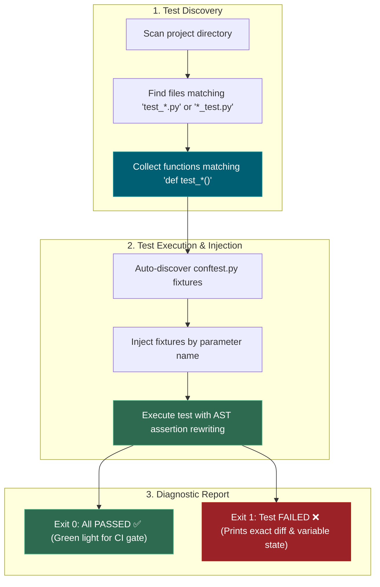

---

### 2.2 — Fixture

A reusable dependency injection function decorated with `@pytest.fixture` that prepares data, database connections, or mock clients for tests.

#### 💡 The Beginner Analogy: Pre-Prepped Cooking Ingredients

Instead of every chef chopping onions and washing lettuce before making a meal, a **Fixture** is a pre-prepped kitchen tray. Any recipe (test function) simply lists `"prepped_tray"` on its ingredient list, and the kitchen manager delivers it instantly.

#### 💻 Code Example & ⚠️ Why It Matters

```python
import pytest

@pytest.fixture
def api_client():
    return {"token": "test-secret-key"}

# Pytest automatically injects api_client without needing explicit imports!
def test_auth(api_client):
    assert api_client["token"] == "test-secret-key"
    print("Injected Fixture Data:", api_client)
```

##### Verified Output

```text
Injected Fixture Data: {'token': 'test-secret-key'}
```

**Why It Matters**: Eliminates duplicate setup code across test files and ensures test isolation by supplying fresh fixtures per test function.

#### 🤖 Real-Time AI/ML Use Case

Injecting pre-loaded embedding models, mock LLM clients, and test vector database collections into ML test functions. A `@pytest.fixture(scope="session")` loading a HuggingFace model once avoids re-downloading 500MB per test while keeping tests isolated.

#### 🎨 Visual Concept

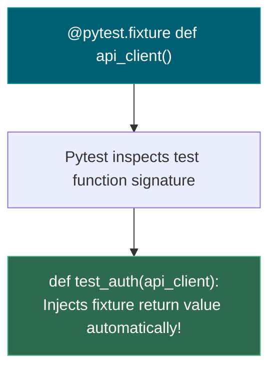

---

### 2.3 — `conftest.py`

A root configuration file automatically discovered by Pytest that makes fixtures defined inside it available to **all test files** in the same directory and subdirectories without requiring explicit `import` statements.

#### 💡 The Beginner Analogy: Hotel Breakfast Buffet

Instead of each guest bringing their own private toaster and coffee maker, the hotel sets up a central **breakfast buffet** in the lobby (`conftest.py`). Every guest room (test file) can access the buffet automatically without bringing appliances from home.

#### 💻 Code Example & ⚠️ Why It Matters

```python
# conftest.py (placed in tests/ directory)
import pytest

@pytest.fixture
def mock_user():
    return {"id": 42, "role": "admin"}
```

##### Verified Output

```text
collected 1 item
test_example.py .                                                        [100%]
1 passed in 0.01s
```

**Why It Matters**: Keeps test suites clean and modular. Prevents circular imports and ugly `from conftest import ...` statements across test suites.

#### 🤖 Real-Time AI/ML Use Case

Sharing expensive AI resources (loaded tokenizers, embedding models, database connections) across an entire ML test suite. A `conftest.py` fixture loading a SentenceTransformer model once at session scope prevents 30-second model reloads between every test file.

#### 🎨 Visual Concept

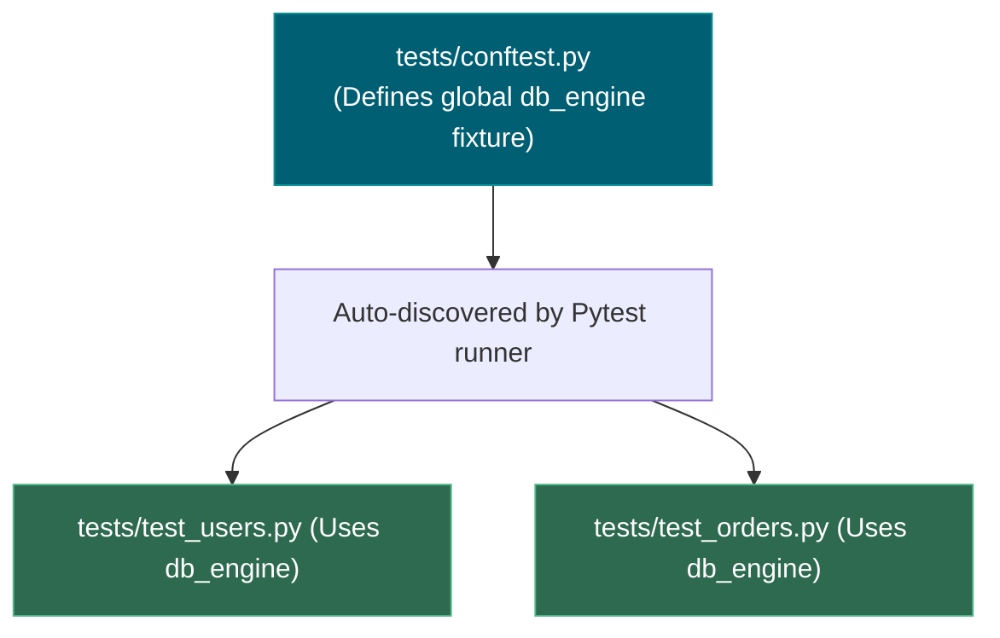

---

### 2.4 — Fixture Scope & Teardown (`yield`)

- **Scope**: Controls the lifetime of a fixture (`function` default, `class`, `module`, `session`).
- **Teardown**: Code following a `yield` statement inside a fixture that executes after tests complete, ensuring resources are cleaned up.

#### 💡 The Beginner Analogy: Rental Car Return

Setting up a fixture before `yield` is picking up a **rental car** for your trip. Executing tests is driving the car. The teardown code after `yield` is **filling up the tank and handing back the keys** to the agency when the trip ends.

#### 💻 Code Example & ⚠️ Why It Matters

```python
import pytest

@pytest.fixture(scope="module")
def temp_db():
    print("\n[SETUP] Initializing Database Connection...")
    db = {"status": "connected"}
    yield db
    print("\n[TEARDOWN] Closing Database Connection...")
```

##### Verified Output

```text
test_db.py 
[SETUP] Initializing Database Connection...
.
[TEARDOWN] Closing Database Connection...
PASSED
```

**Why It Matters**: Without proper teardown, test suites leave dangling database rows, unclosed sockets, and leaked files behind, causing subsequent tests to fail intermittently.

#### 🤖 Real-Time AI/ML Use Case

Managing test vector database collections. A fixture with `yield` creates a temporary ChromaDB/Pinecone collection for RAG testing, then tears it down after the test — preventing stale test embeddings from polluting production vector indices.

#### 🎨 Visual Concept

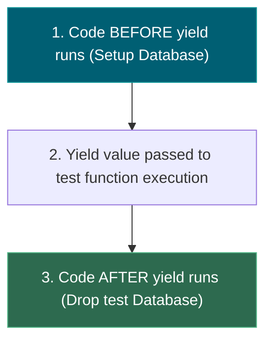

---

### 2.5 — Automatic Fixtures (`autouse=True`)

A fixture configuration option (`@pytest.fixture(autouse=True)`) that instructs Pytest to **automatically run the fixture for every test in its scope** without requiring test functions to name it in their parameter lists.

#### 💡 The Beginner Analogy: Hotel Housekeeping vs Room Service

- **Standard Fixture (Opt-In)**: Ordering **Room Service**. You only receive fresh towels or a meal if your test function explicitly calls and asks for it by name (`def test_order(clean_sheets):`).
- **`autouse=True` (Automatic)**: The **Daily Housekeeping Service**. Every morning, housekeeping silently enters every room, cleans the floor, and empties the trash bins automatically before guests wake up, without anyone needing to place an order.

#### 💻 Code Example & ⚠️ Why It Matters

```python
import pytest

# Autouse fixture: Runs automatically for EVERY test in scope
@pytest.fixture(autouse=True)
def reset_test_state():
    print("\n[AUTOUSE SETUP] Resetting in-memory state...")
    yield
    print("\n[AUTOUSE TEARDOWN] Wiping temporary cache...")

# Notice: NO parameter declared in the test signature!
def test_operation():
    print("Executing test logic...")
    assert True
```

##### Verified Output

```text
test_state.py 
[AUTOUSE SETUP] Resetting in-memory state...
Executing test logic...
.[AUTOUSE TEARDOWN] Wiping temporary cache...
PASSED
```

**Why It Matters**: Eliminates tedious boilerplate across dozens or hundreds of test functions. Essential for enforcing background safety invariants—such as clearing test caches, resetting singleton state, or setting test environment variables—without polluting every test signature.

#### 🤖 Real-Time AI/ML Use Case

Global sandbox isolation and mock guardrails in ML pipelines. An `autouse=True` fixture in `conftest.py` can automatically set `OPENAI_API_KEY="test-mock-key"` and clear vector database staging indices before every test, guaranteeing that zero tests accidentally leak state or execute expensive production API calls.

#### 🎨 Visual Concept

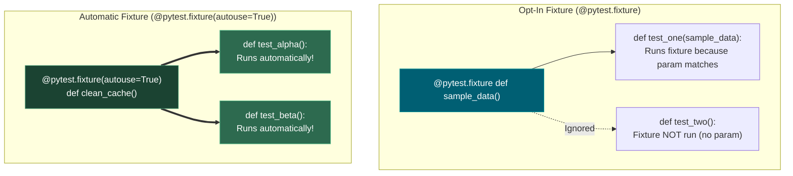

---

### 2.6 — `@pytest.mark.parametrize`

A decorator that runs a single test function multiple times across a grid of different input arguments and expected outputs, reporting each combination as an independent test case.

#### 💡 The Beginner Analogy: Automated Product Stress Test

Instead of manually building 5 separate testing machines to test 5 different shoe sizes, **Parametrize** is a single automated machine that feeds 5 different shoe sizes through the exact same durability press one by one.

#### 💻 Code Example & ⚠️ Why It Matters

```python
import pytest

@pytest.mark.parametrize("val, expected", [
    (2, 4),
    (3, 9),
    (4, 16),
])
def test_square(val, expected):
    assert val ** 2 == expected
```

##### Verified Output

```text
test_calc.py::test_square[2-4] PASSED                                  [ 33%]
test_calc.py::test_square[3-9] PASSED                                  [ 66%]
test_calc.py::test_square[4-16] PASSED                                 [100%]
```

**Why It Matters**: Prevents code duplication (writing multiple `test_foo1()`, `test_foo2()` functions) and ensures that if one input fails, all other test cases still execute and report results.

#### 🤖 Real-Time AI/ML Use Case

LLM evaluation golden test sets. A single parametrized test function runs 50+ prompt-response pairs from a CSV against your RAG pipeline, reporting which specific queries failed — the exact pattern used in Phase 7 eval suites and CI regression gates.

#### 🎨 Visual Concept

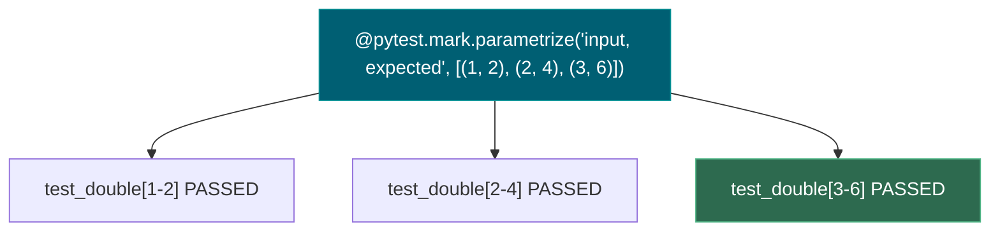

---

### 2.7 — `pytest.raises` & `pytest.approx`

- **`pytest.raises(Exception)`**: Assert context manager verifying that a code block raises an expected exception.
- **`pytest.approx(value)`**: Tolerance-based floating-point comparison helper.

#### 💡 The Beginner Analogy: Fire Alarm Drill & Scale Tolerance

- `pytest.raises`: Pulling a fire alarm on purpose during a safety drill to verify that the alarm system actually sounds (`raise ValueError`).
- `pytest.approx`: A digital bathroom scale that considers **150.00000000000003 lbs** to be **150 lbs**, ignoring tiny floating-point rounding noise.

#### 💻 Code Example & ⚠️ Why It Matters

```python
import pytest

def test_math_and_errors():
    # ✅ Tolerance-based floating comparison
    assert 0.1 + 0.2 == pytest.approx(0.3)

    # ✅ Exception assertion
    with pytest.raises(ValueError, match="invalid status"):
        raise ValueError("invalid status code")
```

##### Verified Output

```text
test_math.py .                                                           [100%]
1 passed in 0.01s
```

**Why It Matters**: Raw float equality checks cause flaky, broken unit tests across different CPU architectures. `pytest.raises` ensures error paths are tested.

#### 🤖 Real-Time AI/ML Use Case

Testing model prediction outputs. ML model predictions are floating-point numbers (`0.8723...`), so `pytest.approx(expected, abs=1e-4)` is required for stable assertions. `pytest.raises(ValidationError)` tests that Pydantic schemas correctly reject malformed LLM outputs.

#### 🎨 Visual Concept

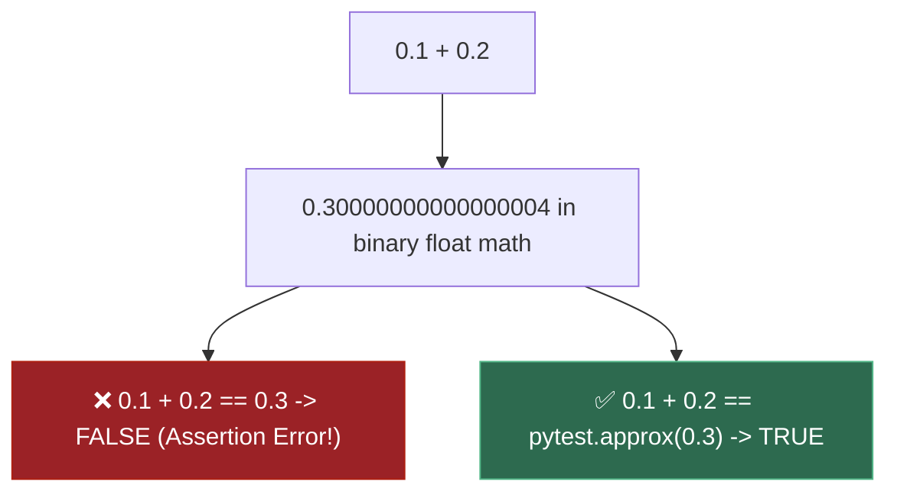

---

### 2.8 — `monkeypatch`

A built-in Pytest fixture that temporarily safely overrides environment variables, module attributes, or dictionary items during a test run, automatically restoring original values when the test completes.

#### 💡 The Beginner Analogy: Stunt Double

If an actor (real production API) is too expensive or dangerous to risk during a scene, `monkeypatch` sends in a **stunt double** (mock object). Once the scene is filmed (test finishes), the real actor steps right back into their place.

#### 💻 Code Example & ⚠️ Why It Matters

```python
import os

def test_env_override(monkeypatch):
    monkeypatch.setenv("ENV", "TESTING")
    assert os.getenv("ENV") == "TESTING"
    print("Mocked Env:", os.getenv("ENV"))
```

##### Verified Output

```text
Mocked Env: TESTING
PASSED
```

**Why It Matters**: Prevents test suites from polluting actual developer environment variables, making external live API calls, or mutating production databases.

#### 🤖 Real-Time AI/ML Use Case

Mocking OpenAI API calls in CI pipelines. `monkeypatch.setattr("openai.ChatCompletion.create", mock_response)` replaces real $0.01-per-call LLM requests with deterministic canned responses, enabling free unlimited test runs in GitHub Actions without burning API credits.

#### 🎨 Visual Concept

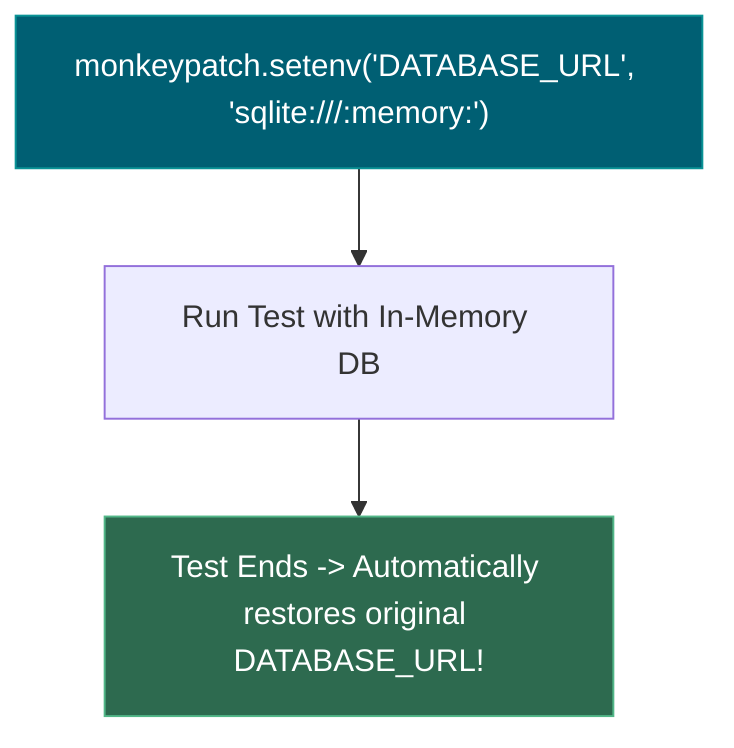

---

### 2.9 — Assertion Rewriting

Pytest's internal AST (Abstract Syntax Tree) bytecode transformation mechanism that intercepts plain Python `assert` statements and enriches failure messages with exact variable values and diffs.

#### 💡 The Beginner Analogy: Courtroom Stenographer Highlighting

Instead of just shouting **"Objection!"** (a raw `AssertionError` with zero context), Pytest acts like an expert **courtroom stenographer**: it prints out the exact text of both sides, highlights the mismatch, and shows you the exact discrepancy.

#### 💻 Code Example & ⚠️ Why It Matters

```python
def test_failed_assertion():
    val = 118.0
    assert val == 120.0
```

##### Verified Output

```text
    def test_failed_assertion():
        val = 118.0
>       assert val == 120.0
E       assert 118.0 == 120.0

test_demo.py:4: AssertionError
```

**Why It Matters**: Eliminates the need to write custom assertion libraries like `self.assertEqual(a, b)` — plain Python `assert` statements produce full diagnostic failure tracebacks automatically.

#### 🤖 Real-Time AI/ML Use Case

Debugging ML pipeline failures. When an eval test asserts `assert model_accuracy == pytest.approx(0.85)` and the model returns `0.72`, Pytest's rewritten assertion prints both values and the exact delta — immediately revealing regression magnitude without manual debugging.

#### 🎨 Visual Concept

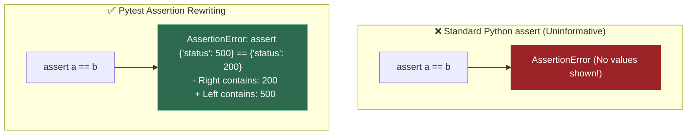

---

## 3. Skip Test — Answered

> Gate **before** studying. Both correct from memory → skip. §7 withholds its answers deliberately.

**① What is a pytest fixture and when would you use one?**

A fixture is setup expressed as a function and marked `@pytest.fixture`. A test receives it **purely because a parameter shares its name** — no import, no explicit wiring. Setting `autouse=True` tells Pytest to run the fixture automatically across every test in its scope without explicit parameter injection (ideal for invariant background side-effects like cleaning state or setting test environments).

Use one whenever two or more tests need the same starting state, or when setup needs matching teardown. The `scope` argument controls lifetime: default `function` rebuilds per test (isolation), `session` builds once for the whole run (for genuinely expensive things). Demo 3 shows both happening.

**② How would you test a function that calls an external API without hitting it?**

Replace the outbound call with `monkeypatch.setattr`, which reverts itself when the test ends. Demo 6 in the script swaps `requests.get` for a fake returning a canned response, so `fetch_fx_rate("USD")` returns `83.2` with no network at all.

Tests must never hit a real API: it is slow, it fails offline, it breaks when the provider rate-limits — and from **Phase 4** onward it costs money on every run.

---

## 3. Visual Concept Diagrams

### 3.1 — Fixture resolution is dependency injection by name

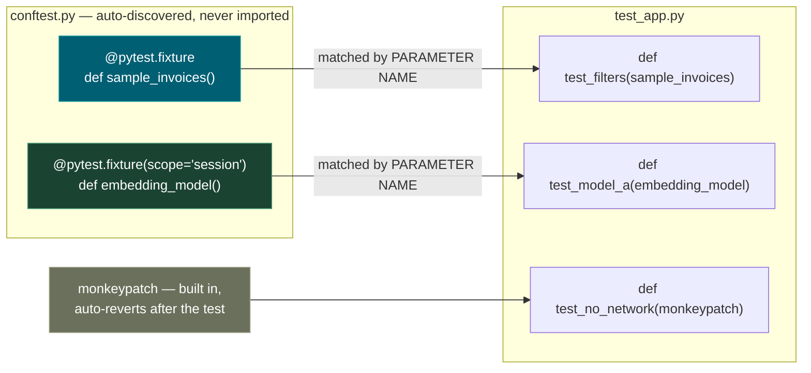

### 3.2 — Opt-In Fixture vs. `autouse=True` Automatic Lifecycle

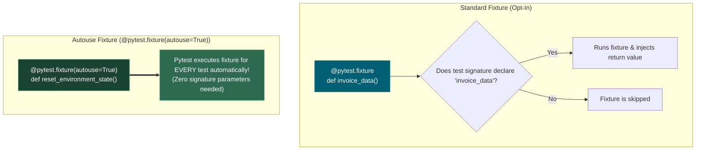

### 3.3 — Scope decides lifetime, and lifetime decides cost

```mermaid
gantt
    title Fixture lifetimes across a 4-test run (as measured in Demo 3)
    dateFormat X
    axisFormat %s

    section function scope
    build for test 1  :a1, 0, 1
    build for test 2  :a2, 1, 1
    build for test 3  :a3, 2, 1
    build for test 4  :a4, 3, 1

    section session scope
    LOAD MODEL once   :done, b1, 0, 4
    teardown          :b2, 4, 1
```

### 3.4 — Parametrize: one function, N independent cases

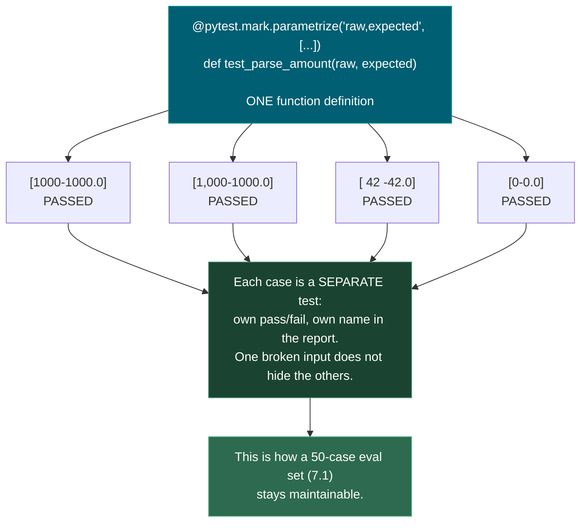

---

## 4. Core Technical Deep Dive

| Construct                         | What it buys                                    | Where it returns                                          |
| --------------------------------- | ----------------------------------------------- | --------------------------------------------------------- |
| `@pytest.fixture`               | Setup injected by name, isolated per test       | **7.5** eval fixtures loading a golden set          |
| `@pytest.fixture(autouse=True)` | Automatic execution without parameter injection | Resetting state, clearing caches, setting test env vars   |
| `scope="session"`               | Expensive setup runs once                       | Loading an embedding model (**5.1**) in an eval run |
| `yield` in a fixture            | Teardown after tests finish                     | Tearing down a Postgres container (**0.15**)        |
| `conftest.py`                   | Fixtures available with no import               | Shared eval scaffolding                                   |
| `@parametrize`                  | One function, N independently-named cases       | **A 50-case eval set in 7.1 is one test**           |
| `pytest.raises`                 | Asserts a failure actually happens              | Guardrail tests in**7.8**                           |
| `pytest.approx`                 | Float-safe comparison                           | Every numeric assertion from**Phase 1** on          |
| `monkeypatch`                   | No network, no spend, works offline             | Testing agent tool-calls (**6.13**)                 |

**The commands that matter day to day:**

```bash
pytest                  # everything
pytest -q               # quiet: one character per test
pytest -k "parse"       # only tests matching a substring
pytest -x               # stop at first failure
pytest --lf             # re-run only LAST FAILED — the debugging loop
pytest -vv              # full assertion diffs
pytest -s               # do not capture stdout (how Demo 3 is visible)
```

**Assert on the meaningful property.** `assert result[0]["vendor"] == "Acme"` survives someone adding an unrelated field; `assert result[0] == {…entire dict…}` does not. Brittle tests train you to ignore failures, which is worse than having no tests.

---

## 5. Hands-On Script & Verified Output

Run: `python 05_testing_with_pytest.py`. Output below is **actual, captured** on pytest 9.0.3 / Python 3.14.4. **One test fails deliberately** — recognising that output is part of the lesson.

```text
======================================================================
DEMO 1 — full run. One test FAILS on purpose (float equality).
======================================================================
..............F..                                                        [100%]
================================== FAILURES ===================================
________________________ test_float_equality_is_a_lie _________________________

    def test_float_equality_is_a_lie():
        """DELIBERATELY FAILING - this is the output you need to recognise."""
>       assert 0.1 + 0.2 == 0.3
E       assert (0.1 + 0.2) == 0.3

test_app.py:70: AssertionError
=========================== short test summary info ===========================
FAILED test_app.py::test_float_equality_is_a_lie - assert (0.1 + 0.2) == 0.3
1 failed, 16 passed in 0.32s

======================================================================
DEMO 2 — parametrize: how the 8 cases are NAMED in the output
======================================================================
  test_app.py::test_parse_amount_real_world_strings[1000-1000.0] PASSED    [ 12%]
  test_app.py::test_parse_amount_real_world_strings[1,000-1000.0] PASSED   [ 25%]
  test_app.py::test_parse_amount_real_world_strings[  42 -42.0] PASSED     [ 37%]
  test_app.py::test_parse_amount_real_world_strings[0-0.0] PASSED          [ 50%]
  test_app.py::test_parse_amount_rejects_garbage[] PASSED                  [ 62%]
  test_app.py::test_parse_amount_rejects_garbage[N/A] PASSED               [ 75%]
  test_app.py::test_parse_amount_rejects_garbage[fifty thousand] PASSED    [ 87%]
  test_app.py::test_parse_amount_rejects_garbage[None] PASSED              [100%]
  ======================= 8 passed, 9 deselected in 0.20s =======================

  ^ ONE function per group, but each case passes or fails
    independently and names its own input. 50 eval cases (7.1)
    are one parametrized test, not 50 copy-pasted functions.
======================================================================
DEMO 3 — fixture scope, made visible with -s
======================================================================
  [fixture: building sample_invoices]
  [fixture: building sample_invoices]
  [fixture: LOADING MODEL - load #1]
  [fixture: unloading model]
  4 passed, 13 deselected in 0.19s

  ^ sample_invoices built once PER TEST (function scope).
    The model LOADED ONCE for the whole run (session scope).
======================================================================
DEMO 4 — the failing float test, in full
======================================================================
  >       assert 0.1 + 0.2 == 0.3
  E       assert (0.1 + 0.2) == 0.3
  ====================== 1 failed, 16 deselected in 0.31s =======================

  ^ 0.1 + 0.2 is NOT 0.3 in binary floating point. Use
    pytest.approx for every float assertion from Phase 1 on.
======================================================================
```

**Demo 2's naming is the point.** `[1,000-1000.0]` and `[fifty thousand]` are the actual inputs, printed in the report. When case 3 of 50 breaks, the report tells you *which input* broke — something fifty copy-pasted functions with generic names cannot do.

**Demo 3 proves scope with observation, not assertion.** Two `building sample_invoices` lines for two tests using it, and exactly **one** `LOADING MODEL` line despite two tests requesting it. Teardown fires once at the end.

**Demo 1's failure is deliberate and worth studying.** pytest rewrites the assertion so the error shows the actual expression, `assert (0.1 + 0.2) == 0.3`. That introspection is why pytest needs no `assertEqual`-style methods. The underlying cause — binary floating point cannot represent `0.1` exactly — is formalised in **1.12**.

**Modify and re-run:**

- Change `sample_invoices` to `scope="session"` and re-run. `test_fixture_really_was_fresh` will now **fail**, because the append from the previous test leaks in. That failure *is* the argument for function scope.
- Add a case to the `parametrize` list that you expect to fail, e.g. `("1.2.3", 1.23)`. Confirm only that one case reports failure.
- Delete the `monkeypatch` line from the last test and re-run with no network. Watch it hang and then error.

---

## 6. Video

**"All you need to know about pytest fixtures"** — [youtube.com/watch?v=rR2TfIWD-TU](https://www.youtube.com/watch?v=rR2TfIWD-TU) (2025). Video confirmed to exist and to be on-topic; **channel name [VERIFY]** — not confirmed in this pass, so check before citing it.

Also confirmed on-topic: **"pytest Basics: Test Fixtures"** — [youtube.com/watch?v=mTMu8AtdG-E](https://www.youtube.com/watch?v=mTMu8AtdG-E). For text, Real Python's *pytest Tutorial: Effective Python Testing* is the reliable written companion.

---

## 7. Retrieval Checkpoint — Unanswered

> Close this file. No notes. Answers deliberately withheld.

1. What is a pytest fixture, by what mechanism does a test receive one by default, and how does `autouse=True` alter this behavior?
2. When should you use `autouse=True` vs standard parameter injection, and what is the risk of overusing `autouse=True`?
3. You need to test one function against 50 different inputs. Name the construct you would use, and explain what 50 separate test functions would cost you in the failure report.
4. Why must `pytest.approx` be used for float comparison, and which Phase 1 topic explains the underlying reason?

---

## 8. Closed-Book Rebuild

With this file **and** the script closed: write a `conftest.py` with:

- One function-scoped fixture,
- One session-scoped fixture with teardown,
- One `autouse=True` fixture that resets environment/state for every test automatically.

Plus a test module that parametrizes at least four cases, asserts one expected exception with `pytest.raises`, uses `pytest.approx` for a float, verifies that the `autouse` fixture ran without being declared in the function signature, and mocks an outbound HTTP call so the suite runs offline. Then prove the scope difference by observing fixture output with `-s`.

---

## Review again in

**3 days** — fixtures rarely stick on one pass. Rehearse before starting **7.5**, where this becomes the eval harness.
