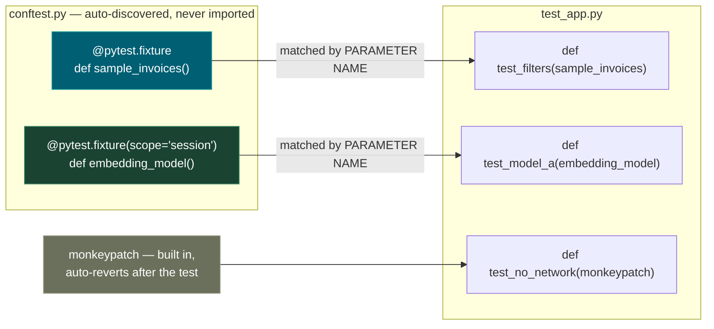
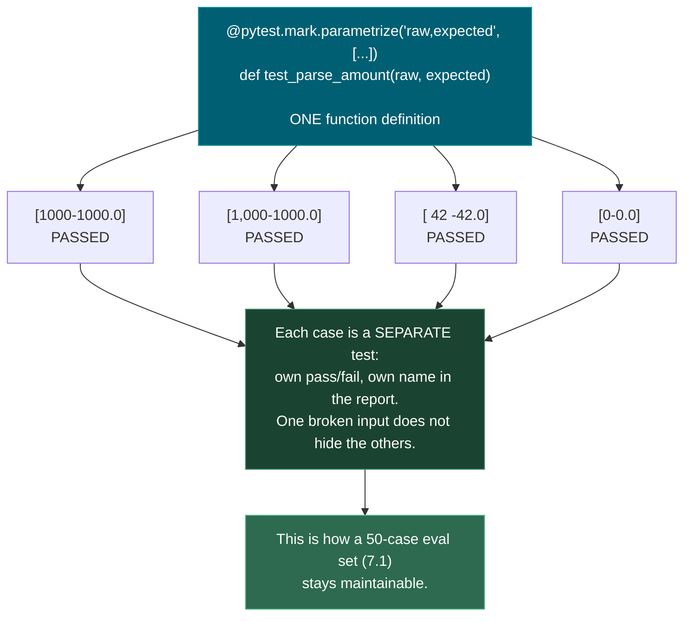
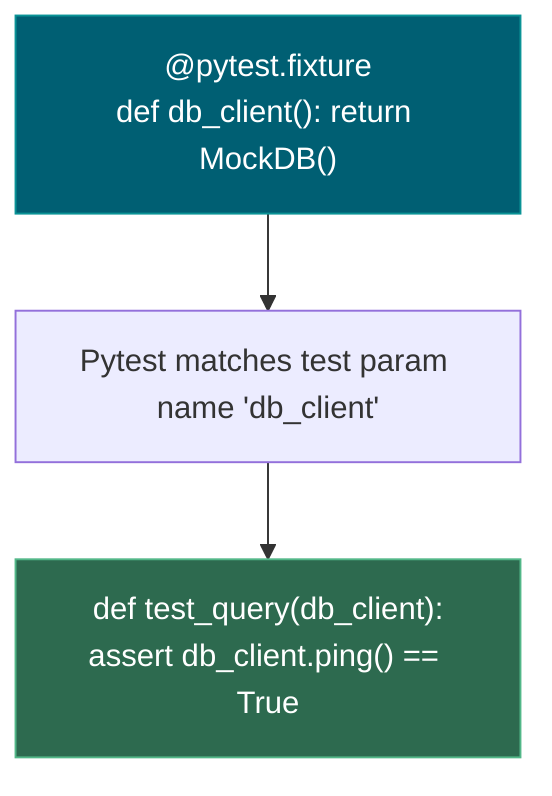
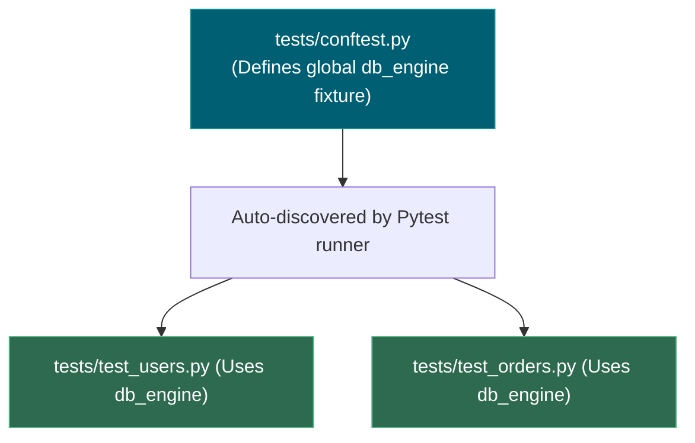
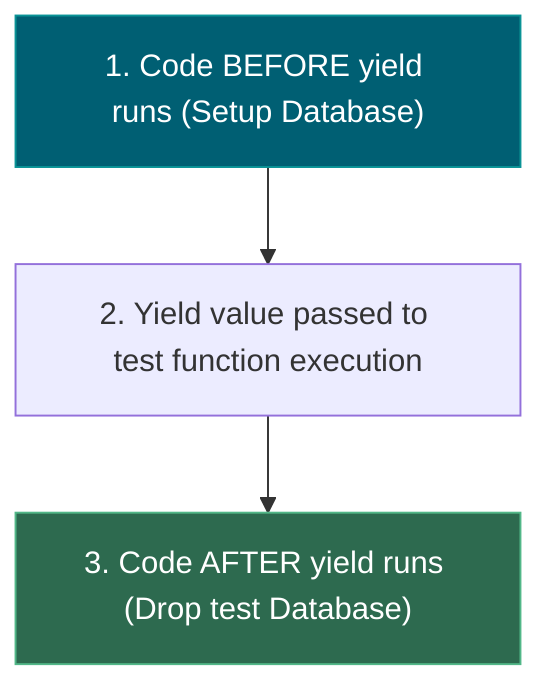
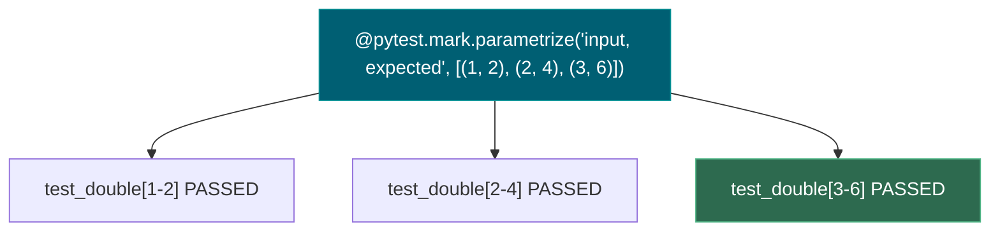
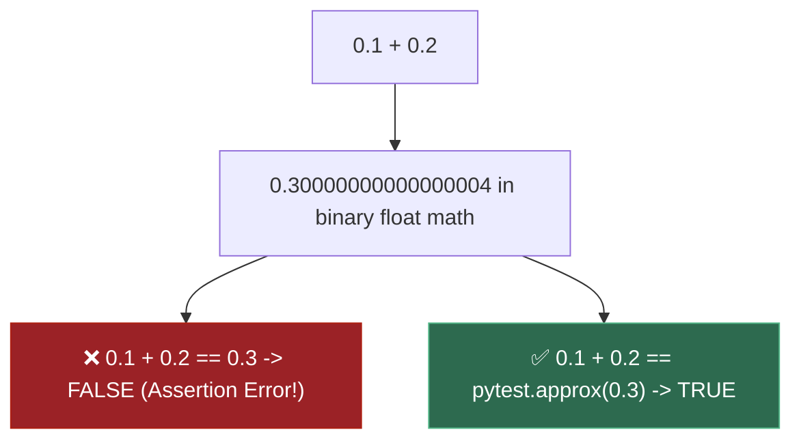
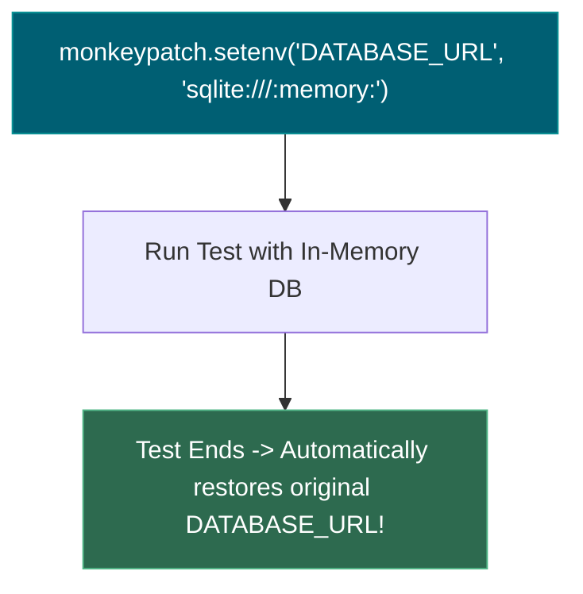
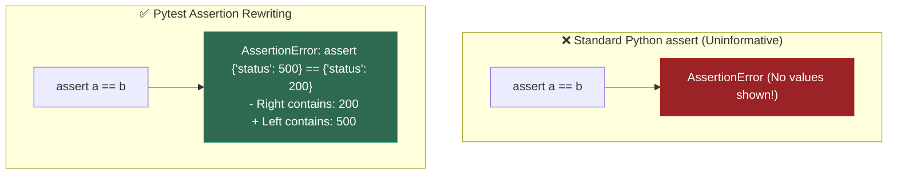

# 0.5 — Testing with pytest

**Phase 0 · CORE · CODE · 5 focused hours · Review in 3 days**

**Companion script:** [`05_testing_with_pytest.py`](05_testing_with_pytest.py) — `pip install pytest`, then run it. Writes a throwaway test package under system temp, runs pytest against it, prints the real output, deletes it.

---

## 1. Overview

Not present in any of the three source documents behind this roadmap, and the gap shows up in a specific place later: **the eval suites in 7.5 are just tests with fuzzy assertions**, and a CI gate needs a test runner to be a gate at all. Learning pytest now makes **7.5** a small extension rather than a new subject.

Two constructs carry the weight. **Fixtures** — setup that gets injected by name into any test that asks for it. And **parametrization**, which turns one function into fifty cases. A 50-case golden eval set in **7.1** is unmaintainable as fifty copy-pasted functions and trivial as one parametrized test.

Builds on **0.1** (a test is just a function) and **0.2** (`__init__.py` is what makes your package importable from `tests/`). Feeds **7.5** CI regression gates directly, and **7.10** reproducibility indirectly — an untested pipeline cannot be trusted to reproduce.

---

## 2. Skip Test — Answered

> Gate **before** studying. Both correct from memory → skip. §7 withholds its answers deliberately.

**① What is a pytest fixture and when would you use one?**

A fixture is setup expressed as a function and marked `@pytest.fixture`. A test receives it **purely because a parameter shares its name** — no import, no explicit wiring. That is dependency injection, and it is why fixtures placed in `conftest.py` are available to every test in that directory and below.

Use one whenever two or more tests need the same starting state, or when setup needs matching teardown. The `scope` argument controls lifetime: default `function` rebuilds per test (isolation), `session` builds once for the whole run (for genuinely expensive things). Demo 3 shows both happening.

**② How would you test a function that calls an external API without hitting it?**

Replace the outbound call with `monkeypatch.setattr`, which reverts itself when the test ends. Demo 5 in the script swaps `requests.get` for a fake returning a canned response, so `fetch_fx_rate("USD")` returns `83.2` with no network at all.

Tests must never hit a real API: it is slow, it fails offline, it breaks when the provider rate-limits — and from **Phase 4** onward it costs money on every run.

---

## 3. Visual Concept Diagrams

### 3.1 — Fixture resolution is dependency injection by name



### 3.2 — Scope decides lifetime, and lifetime decides cost

```mermaid
gantt
    title Fixture lifetimes across a 4-test run (as measured in Demo 3)
    dateFormat X
    axisFormat %s

    section function scope
    build for test 1  :a1, 0, 1
    build for test 2  :a2, 1, 1
    build for test 3  :a3, 2, 1
    build for test 4  :a4, 3, 1

    section session scope
    LOAD MODEL once   :done, b1, 0, 4
    teardown          :b2, 4, 1
```



### 3.3 — Parametrize: one function, N independent cases



---

## 4. Core Technical Deep Dive

| Construct | What it buys | Where it returns |
|---|---|---|
| `@pytest.fixture` | Setup injected by name, isolated per test | **7.5** eval fixtures loading a golden set |
| `scope="session"` | Expensive setup runs once | Loading an embedding model (**5.1**) in an eval run |
| `yield` in a fixture | Teardown after tests finish | Tearing down a Postgres container (**0.15**) |
| `conftest.py` | Fixtures available with no import | Shared eval scaffolding |
| `@parametrize` | One function, N independently-named cases | **A 50-case eval set in 7.1 is one test** |
| `pytest.raises` | Asserts a failure actually happens | Guardrail tests in **7.8** |
| `pytest.approx` | Float-safe comparison | Every numeric assertion from **Phase 1** on |
| `monkeypatch` | No network, no spend, works offline | Testing agent tool-calls (**6.13**) |

**The commands that matter day to day:**

```bash
pytest                  # everything
pytest -q               # quiet: one character per test
pytest -k "parse"       # only tests matching a substring
pytest -x               # stop at first failure
pytest --lf             # re-run only LAST FAILED — the debugging loop
pytest -vv              # full assertion diffs
pytest -s               # do not capture stdout (how Demo 3 is visible)
```

**Assert on the meaningful property.** `assert result[0]["vendor"] == "Acme"` survives someone adding an unrelated field; `assert result[0] == {…entire dict…}` does not. Brittle tests train you to ignore failures, which is worse than having no tests.

---

## 5. Hands-On Script & Verified Output

Run: `python 05_testing_with_pytest.py`. Output below is **actual, captured** on pytest 9.0.3 / Python 3.14.4. **One test fails deliberately** — recognising that output is part of the lesson.

```text
======================================================================
DEMO 1 — full run. One test FAILS on purpose (float equality).
======================================================================
.............F..                                                         [100%]
================================== FAILURES ===================================
________________________ test_float_equality_is_a_lie _________________________

    def test_float_equality_is_a_lie():
        """DELIBERATELY FAILING - this is the output you need to recognise."""
>       assert 0.1 + 0.2 == 0.3
E       assert (0.1 + 0.2) == 0.3

test_app.py:61: AssertionError
=========================== short test summary info ===========================
FAILED test_app.py::test_float_equality_is_a_lie - assert (0.1 + 0.2) == 0.3
1 failed, 15 passed in 0.32s

======================================================================
DEMO 2 — parametrize: how the 8 cases are NAMED in the output
======================================================================
  test_app.py::test_parse_amount_real_world_strings[1000-1000.0] PASSED    [ 12%]
  test_app.py::test_parse_amount_real_world_strings[1,000-1000.0] PASSED   [ 25%]
  test_app.py::test_parse_amount_real_world_strings[  42 -42.0] PASSED     [ 37%]
  test_app.py::test_parse_amount_real_world_strings[0-0.0] PASSED          [ 50%]
  test_app.py::test_parse_amount_rejects_garbage[] PASSED                  [ 62%]
  test_app.py::test_parse_amount_rejects_garbage[N/A] PASSED               [ 75%]
  test_app.py::test_parse_amount_rejects_garbage[fifty thousand] PASSED    [ 87%]
  test_app.py::test_parse_amount_rejects_garbage[None] PASSED              [100%]
  ======================= 8 passed, 8 deselected in 0.18s =======================

  ^ ONE function per group, but each case passes or fails
    independently and names its own input. 50 eval cases (7.1)
    are one parametrized test, not 50 copy-pasted functions.
======================================================================
DEMO 3 — fixture scope, made visible with -s
======================================================================
  [fixture: building sample_invoices]
  [fixture: building sample_invoices]
  [fixture: LOADING MODEL - load #1]
  [fixture: unloading model]
  4 passed, 12 deselected in 0.19s

  ^ sample_invoices built once PER TEST (function scope).
    The model LOADED ONCE for the whole run (session scope).
======================================================================
DEMO 4 — the failing float test, in full
======================================================================
  >       assert 0.1 + 0.2 == 0.3
  E       assert (0.1 + 0.2) == 0.3
  ====================== 1 failed, 15 deselected in 0.37s =======================

  ^ 0.1 + 0.2 is NOT 0.3 in binary floating point. Use
    pytest.approx for every float assertion from Phase 1 on.
======================================================================
```

**Demo 2's naming is the point.** `[1,000-1000.0]` and `[fifty thousand]` are the actual inputs, printed in the report. When case 3 of 50 breaks, the report tells you *which input* broke — something fifty copy-pasted functions with generic names cannot do.

**Demo 3 proves scope with observation, not assertion.** Two `building sample_invoices` lines for two tests using it, and exactly **one** `LOADING MODEL` line despite two tests requesting it. Teardown fires once at the end.

**Demo 1's failure is deliberate and worth studying.** pytest rewrites the assertion so the error shows the actual expression, `assert (0.1 + 0.2) == 0.3`. That introspection is why pytest needs no `assertEqual`-style methods. The underlying cause — binary floating point cannot represent `0.1` exactly — is formalised in **1.12**.

**Modify and re-run:**
- Change `sample_invoices` to `scope="session"` and re-run. `test_fixture_really_was_fresh` will now **fail**, because the append from the previous test leaks in. That failure *is* the argument for function scope.
- Add a case to the `parametrize` list that you expect to fail, e.g. `("1.2.3", 1.23)`. Confirm only that one case reports failure.
- Delete the `monkeypatch` line from the last test and re-run with no network. Watch it hang and then error.

---

## 6. Video

**"All you need to know about pytest fixtures"** — [youtube.com/watch?v=rR2TfIWD-TU](https://www.youtube.com/watch?v=rR2TfIWD-TU) (2025). Video confirmed to exist and to be on-topic; **channel name [VERIFY]** — not confirmed in this pass, so check before citing it.

Also confirmed on-topic: **"pytest Basics: Test Fixtures"** — [youtube.com/watch?v=mTMu8AtdG-E](https://www.youtube.com/watch?v=mTMu8AtdG-E). For text, Real Python's *pytest Tutorial: Effective Python Testing* is the reliable written companion.

---

## 7. Retrieval Checkpoint — Unanswered

> Close this file. No notes. Answers deliberately withheld.

1. What is a pytest fixture, by what mechanism does a test receive one, and which filename makes fixtures available without importing them?
2. You need to test one function against 50 different inputs. Name the construct you would use, and explain what 50 separate test functions would cost you in the failure report.
3. Why must `pytest.approx` be used for float comparison, and which Phase 1 topic explains the underlying reason?

---

## 8. Closed-Book Rebuild

With this file **and** the script closed: write a `conftest.py` with one function-scoped fixture and one session-scoped fixture with teardown, plus a test module that parametrizes at least four cases, asserts one expected exception with `pytest.raises`, uses `pytest.approx` for a float, and mocks an outbound HTTP call so the suite runs offline. Then prove the scope difference by observing fixture output with `-s`.

---

## 9. Glossary

### 9.1 — Fixture & Dependency Injection

A specialized setup function decorated with `@pytest.fixture` that prepares test data, state, or mock dependencies. Tests request fixtures by declaring matching argument names in their signatures.

#### 💡 The Beginner Analogy: Surgical Tray Preparation
Before a surgeon performs an operation (a test), a surgical nurse prepares a standardized **tray of sterilized tools** (the fixture). The surgeon simply requests the tray by name (`def test_surgery(sterile_tray):`), ensuring every procedure starts with identical, clean equipment.

#### 🎨 Dependency Injection Flow



#### 💻 Code Example & ⚠️ Why It Matters
```python
import pytest

@pytest.fixture
def api_client():
    return {"token": "test-secret-key"}

# Pytest automatically injects api_client without needing explicit imports!
def test_auth(api_client):
    assert api_client["token"] == "test-secret-key"
```
**Why It Matters**: Eliminates duplicate setup code across test files and ensures test isolation by supplying fresh fixtures per test function.

---

### 9.2 — `conftest.py`

A root configuration file automatically discovered by Pytest that makes fixtures defined inside it available to **all test files** in the same directory and subdirectories without requiring explicit `import` statements.

#### 💡 The Beginner Analogy: Hotel Breakfast Buffet
Instead of each guest bringing their own private toaster and coffee maker, the hotel sets up a central **breakfast buffet** in the lobby (`conftest.py`). Every guest room (test file) can access the buffet automatically without bringing appliances from home.

#### 🎨 Auto-Discovery Architecture



#### 💻 Code Example & ⚠️ Why It Matters
```python
# conftest.py (placed in tests/ directory)
import pytest

@pytest.fixture
def mock_user():
    return {"id": 42, "role": "admin"}
```
**Why It Matters**: Keeps test suites clean and modular. Prevents circular imports and ugly `from conftest import ...` statements across test suites.

---

### 9.3 — Fixture Scope & Teardown (`yield`)

- **Scope**: Controls the lifetime of a fixture (`function` default, `class`, `module`, `session`).
- **Teardown**: Code following a `yield` statement inside a fixture that executes after tests complete, ensuring resources are cleaned up.

#### 💡 The Beginner Analogy: Rental Car Return
Setting up a fixture before `yield` is picking up a **rental car** for your trip. Executing tests is driving the car. The teardown code after `yield` is **filling up the tank and handing back the keys** to the agency when the trip ends.

#### 🎨 Fixture Lifecycle & Teardown Execution



#### 💻 Code Example & ⚠️ Why It Matters
```python
@pytest.fixture(scope="session")
def temp_db():
    db = create_test_db() # 1. Setup
    yield db              # 2. Test Execution
    db.drop_all()         # 3. Teardown (Clean up)
```
**Why It Matters**: Without proper teardown, test suites leave dangling database rows, unclosed sockets, and leaked files behind, causing subsequent tests to fail intermittently.

---

### 9.4 — `@pytest.mark.parametrize`

A decorator that runs a single test function multiple times across a grid of different input arguments and expected outputs, reporting each combination as an independent test case.

#### 💡 The Beginner Analogy: Automated Product Stress Test
Instead of manually building 5 separate testing machines to test 5 different shoe sizes, **Parametrize** is a single automated machine that feeds 5 different shoe sizes through the exact same durability press one by one.

#### 🎨 Single Test Function expanded into N Test Cases



#### 💻 Code Example & ⚠️ Why It Matters
```python
@pytest.mark.parametrize("val, expected", [
    (2, 4),
    (3, 9),
    (4, 16),
])
def test_square(val, expected):
    assert val ** 2 == expected
```
**Why It Matters**: Prevents code duplication (writing multiple `test_foo1()`, `test_foo2()` functions) and ensures that if one input fails, all other test cases still execute and report results.

---

### 9.5 — `pytest.raises` & `pytest.approx`

- **`pytest.raises(Exception)`**: Assert context manager verifying that a code block raises an expected exception.
- **`pytest.approx(value)`**: Tolerance-based floating-point comparison helper.

#### 💡 The Beginner Analogy: Fire Alarm Drill & Scale Tolerance
- `pytest.raises`: Pulling a fire alarm on purpose during a safety drill to verify that the alarm system actually sounds (`raise ValueError`).
- `pytest.approx`: A digital bathroom scale that considers **150.00000000000003 lbs** to be **150 lbs**, ignoring tiny floating-point rounding noise.

#### 🎨 Floating-Point Rounding Error Trap



#### 💻 Code Example & ⚠️ Why It Matters
```python
# ❌ TRAP: Exact float comparisons fail in binary computer math!
# assert 0.1 + 0.2 == 0.3  <-- AssertionError!

# ✅ CORRECT: Tolerance-based comparison
assert 0.1 + 0.2 == pytest.approx(0.3)

# Verify error handling paths
with pytest.raises(ValueError, match="invalid status"):
    process_order(status="INVALID")
```
**Why It Matters**: Raw float equality checks cause flaky, broken unit tests across different CPU architectures. `pytest.raises` ensures error paths are tested.

---

### 9.6 — `monkeypatch`

A built-in Pytest fixture that temporarily safely overrides environment variables, module attributes, or dictionary items during a test run, automatically restoring original values when the test completes.

#### 💡 The Beginner Analogy: Stunt Double
If an actor (real production API) is too expensive or dangerous to risk during a scene, `monkeypatch` sends in a **stunt double** (mock object). Once the scene is filmed (test finishes), the real actor steps right back into their place.

#### 🎨 Temporary Attribute Substitution



#### 💻 Code Example & ⚠️ Why It Matters
```python
def test_offline_mode(monkeypatch):
    # Safely mock environment variable without polluting OS state for other tests!
    monkeypatch.setenv("ENV", "TESTING")
    assert get_env_setting() == "TESTING"
```
**Why It Matters**: Prevents test suites from polluting actual developer environment variables, making external live API calls, or mutating production databases.

---

### 9.7 — Assertion Rewriting

Pytest's internal AST (Abstract Syntax Tree) bytecode transformation mechanism that intercepts plain Python `assert` statements and enriches failure messages with exact variable values and diffs.

#### 💡 The Beginner Analogy: Courtroom Stenographer Highlighting
Instead of just shouting **"Objection!"** (a raw `AssertionError` with zero context), Pytest acts like an expert **courtroom stenographer**: it prints out the exact text of both sides, highlights the mismatch, and shows you the exact discrepancy.

#### 🎨 Standard Assert vs. Pytest Assertion Rewriting



#### 💻 Code Example & ⚠️ Why It Matters
```python
# Plain Python assert syntax...
assert calculate_total(100) == 120

# ...becomes rich diagnostic output on failure:
# > E   AssertionError: assert 118.0 == 120
# > E     + where 118.0 = calculate_total(100)
```
**Why It Matters**: Eliminates the need to write custom assertion libraries like `self.assertEqual(a, b)` — plain Python `assert` statements produce full diagnostic failure tracebacks automatically.

---

## Review again in

**3 days** — fixtures rarely stick on one pass. Rehearse before starting **7.5**, where this becomes the eval harness.
