# 0.6 — Scientific Python: NumPy, Pandas, Matplotlib

**Phase 0 · CORE · CODE · 14 focused hours · Review in 1 day**

**Companion script:** [`06_numpy_pandas_matplotlib.py`](06_numpy_pandas_matplotlib.py) — `pip install numpy pandas matplotlib`, then run it. Writes `eda_0_6.png` beside itself; everything else prints.

> **The single most under-rated topic in Phase 0.** It is easy to skim because the syntax looks simple. Skimming it makes all of **Phase 2** twice as hard, because every model-fitting exercise assumes DataFrame fluency you do not have.

---

## 1. Overview

Three libraries that behave as one toolchain. **NumPy** gives you the n-dimensional array and vectorized operations — the substrate every other numeric library sits on, including scikit-learn in **Phase 2** and PyTorch in **3.10**. **Pandas** is NumPy with labelled axes: rows and columns with names, which is what real tabular data looks like. **Matplotlib** turns both into pictures, which is how **2.2** EDA actually happens.

The mental shift that matters is **vectorization**: you stop writing loops over rows and start expressing operations over whole arrays. This is not merely faster — it is the notation that makes **1.14** broadcasting, **1.2** matrix operations, and eventually **4.2** batched attention readable. Someone who writes `for i in range(len(df))` in Phase 2 will not be able to read a transformer implementation in Phase 4.

Depends on **0.1**; directly unlocks **1.14**, **2.2**, and every model-fitting topic from **2.3** onward.

---

## 2. Glossary

### 2.1 — NumPy (Numerical Python)

Python's foundational scientific computing library providing high-performance multidimensional arrays (`ndarray`) and vectorized mathematical operations implemented in compiled C and Fortran.

#### 💡 The Beginner Analogy: Sticky Notes vs. An Egg Carton

- **Python List (Pointer Dereferencing)**: Imagine a binder with 5 sticky notes. Each sticky note doesn't hold an egg; it holds **directions to a different room in a giant warehouse** where one egg is stored. To do math on all 5 eggs, the CPU has to walk to Room 402, inspect the egg, walk to Room 815, inspect the egg, and so on. All that walking between scattered memory rooms is **pointer dereferencing**.
- **NumPy `ndarray` (Zero Dereferencing)**: A standard **egg carton** where 5 eggs sit directly side-by-side in a single row. The CPU grabs the whole carton in one motion without walking anywhere.

#### 💻 Code Example & ⚠️ Why It Matters

```python
import numpy as np

# Standard Python list (slow, scattered pointers) vs NumPy ndarray (fast, contiguous C-array)
py_list = [1, 2, 3, 4, 5]
np_arr = np.array([1, 2, 3, 4, 5])

# In Python: py_list * 2 duplicates elements
# In NumPy: np_arr * 2 computes element-wise vectorized arithmetic
print("Python List * 2:", py_list * 2)
print("NumPy Array * 2:", np_arr * 2)
```

##### Verified Output

```text
Python List * 2: [1, 2, 3, 4, 5, 1, 2, 3, 4, 5]
NumPy Array * 2: [ 2  4  6  8 10]
```

**Why It Matters (Under the Hood: Pointer Dereferencing vs. Contiguous Memory)**:

In computer memory (RAM), a **pointer** is simply a memory address (e.g. `0x7fff5fbff840`) indicating *where* a piece of data actually lives. **Dereferencing a pointer** means following that memory address to read the actual value.

1. **Python List (The 2-Hop Memory Penalty)**:
   In standard Python, `numbers = [10, 20, 30]` does *not* store the raw numbers `10, 20, 30` inside the list. Instead, Python creates full C-structures (`PyObject`) on the heap for each integer, and the list only stores **pointers** (memory addresses) to those scattered objects:

   - **Hop 1**: Fetch the pointer at index `i`.
   - **Hop 2 (Pointer Dereferencing)**: Follow that pointer and jump across RAM to that memory address.
   - **Hop 3**: Unpack the `PyObject` structure (type info, reference count) to read the integer value.
   - Because these objects are scattered all over memory, looping over them causes constant **CPU Cache Misses** (the CPU stalls while waiting for slow RAM).
2. **NumPy `ndarray` (Contiguous Flat Bytes + SIMD Speed)**:
   A NumPy array `np.array([10, 20, 30], dtype=np.int64)` allocates **one single, unbroken block of RAM**:

   - Numbers sit directly side-by-side (`offset = index * 8 bytes`).
   - There are **zero pointers to individual elements**.
   - The CPU pre-fetches the entire block into ultra-fast L1/L2 CPU caches and uses **SIMD (Single Instruction, Multiple Data)** registers to compute 4 to 8 numbers simultaneously in a single clock cycle at native C speed (20x to 100x faster).

| Feature                          | Python List                                                 | NumPy`ndarray`                                |
| :------------------------------- | :---------------------------------------------------------- | :---------------------------------------------- |
| **What it stores**         | Array of memory addresses (pointers)                        | Raw binary data (contiguous bytes)              |
| **Pointer Dereferencing?** | **Yes, for every single element** (slow memory jumps) | **No** (direct sequential memory reads)   |
| **CPU Cache Efficiency**   | Low (Frequent cache misses & memory stalls)                 | Ultra-high (Pre-fetched into CPU L1/L2 cache)   |
| **SIMD / Vectorization**   | Impossible (data scattered across heap)                     | Enabled (processes 4–8 numbers simultaneously) |

#### 🤖 Real-Time AI/ML Use Case

The mathematical foundation for all modern machine learning and deep learning frameworks. PyTorch tensors, TensorFlow tensors, JAX arrays, and Scikit-learn feature matrices are direct extensions of NumPy's memory model. Every neural network weight matrix, token embedding, and loss gradient calculation is an array computation built on NumPy principles.

#### 🎨 Visual Concept

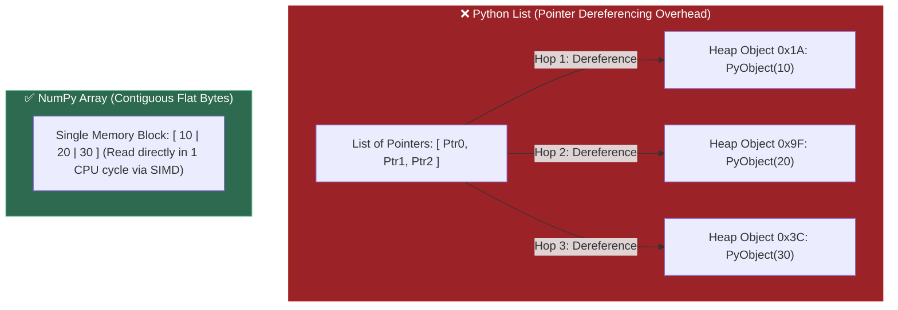

---

A fast, flexible data analysis and manipulation library built directly on top of NumPy that provides labeled 2D tabular structures (`DataFrame`) and 1D series (`Series`) with SQL-like query, grouping, joining, and data cleaning capabilities.

#### 💡 The Beginner Analogy: Crude Oil Refinery vs. Supercar Engine

- **Raw Data is Crude Oil**: Straight from the ground, crude oil is thick, sludgy, and full of sulfur, water, and dirt. If you pour crude oil directly into a Ferrari engine (Machine Learning Model / PyTorch), the engine immediately seizes and explodes.
- **Pandas is the Oil Refinery (The Wrangling Engine)**: It filters out contaminants, converts types, fills missing values, and refines the sludge into high-octane gasoline.
- **NumPy & ML Models are the Supercar Engine**: PyTorch, XGBoost, and Scikit-learn only accept clean, pure numerical arrays. They cannot process missing fields (`NaN`), dollar signs (`"$100"`), messy date strings, or misaligned rows.

#### 💻 Code Example & ⚠️ Why It Matters

```python
import numpy as np
import pandas as pd

# ❌ The Raw Messy Data (What real-world data looks like)
raw_data = {
    "user": ["Alice", "Bob", "Charlie", "David"],
    "raw_salary": ["$95,000", "$120,000", None, "$85,000"],
    "join_date": ["2024-01-15", "2023-06-20", "2024-03-01", "invalid_date"],
    "churned": ["no", "yes", "no", "yes"]
}
df = pd.DataFrame(raw_data)

# 🛠️ The Pandas Wrangling Pipeline (3 vectorized steps):
# 1. Clean Salary: Strip '$' and ',', convert to float, fill missing with median
df["salary_clean"] = (
    df["raw_salary"]
    .str.replace("$", "", regex=False)
    .str.replace(",", "", regex=False)
    .astype(float)
)
df["salary_clean"] = df["salary_clean"].fillna(df["salary_clean"].median())

# 2. Parse Dates: Coerce errors into NaT, extract tenure in days
df["join_date_parsed"] = pd.to_datetime(df["join_date"], errors="coerce")
df["tenure_days"] = (pd.Timestamp("2026-08-16") - df["join_date_parsed"]).dt.days.fillna(0)

# 3. Encode Categorical Label: Convert "yes"/"no" to 1 / 0 for ML
df["target_churn"] = (df["churned"] == "yes").astype(int)

# Select only the clean numerical features for the ML model
ml_features = df[["salary_clean", "tenure_days", "target_churn"]]
print("--- CLEAN WRANGLED DATA (Model-Ready) ---")
print(ml_features)
```

##### Verified Output

```text
--- CLEAN WRANGLED DATA (Model-Ready) ---
   salary_clean  tenure_days  target_churn
0       95000.0        944.0             0
1      120000.0       1153.0             1
2       95000.0        898.0             0
3       85000.0          0.0             1
```

**Why It Matters (Under the Hood: The 5 Pillars of the Data Wrangling Engine)**:

In industry, **70% to 80% of an AI/ML Engineer's time is spent on data wrangling**. Feeding raw, messy data into an AI model leads to **"Garbage In, Garbage Out"** (the model crashes, hallucinates, or makes broken predictions). Pandas compresses complex data engineering into 5 core pillars:

| Wrangling Task                   | Raw Data Problem                                                             | What Pandas Does                                                               |
| :------------------------------- | :--------------------------------------------------------------------------- | :----------------------------------------------------------------------------- |
| **1. Missing Data**        | Gaps in surveys, dropped network packets (`NaN`, `None`, empty strings). | `fillna()`, `dropna()`, or forward-fill `ffill()` in 1 line.             |
| **2. Type Casting**        | Numbers stored as strings (`"$4,500.50"` or `"True"`/`"False"`).       | String stripping +`.astype(float)` vector conversion.                        |
| **3. Temporal Data**       | Inconsistent date strings (`"2026-08-16"` vs `"16/08/26"`).              | `pd.to_datetime()` enables extracting day, hour, or calculating time deltas. |
| **4. Multi-Source Joins**  | User profiles in SQL, transactions in CSV, click logs in JSON.               | `pd.merge()` joins them by `user_id` like SQL relational joins.            |
| **5. Feature Aggregation** | 1,000 raw clicks per user.                                                   | `.groupby("user_id").agg()` collapses clicks into 1 summary row per user.    |

#### 🤖 Real-Time AI/ML Use Case

Ingesting multi-gigabyte CSV, Parquet, and SQL datasets, performing Exploratory Data Analysis (EDA), cleaning missing tokens/features, encoding categorical metadata, computing aggregate features across customer cohorts, and formatting clean training matrices for Scikit-learn, XGBoost, and LightGBM pipelines.

#### 🎨 Visual Concept

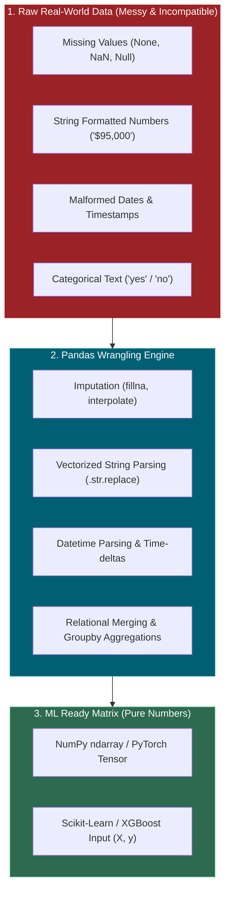

---

### 2.3 — Matplotlib (Data Visualization)

Python's foundational 2D data visualization and plotting library that provides an object-oriented API (`Figure` and `Axes`) to render publication-quality statistical charts, graphs, histograms, and diagnostic plots directly from NumPy arrays and Pandas DataFrames.

#### 💡 The Beginner Analogy: The Visual Camera & Canvas

If NumPy computes the raw numbers and Pandas organizes them into a clean table, **Matplotlib** is the **high-resolution camera** that snaps visual pictures of that data. Patterns, distributions, correlations, outliers, and errors that are completely invisible in a table of 100,000 numbers become instantly obvious the moment they are plotted on a chart.

#### 💻 Code Example & ⚠️ Why It Matters

```python
import matplotlib
matplotlib.use("Agg")  # Headless rendering for cloud/CI environments
import matplotlib.pyplot as plt
import numpy as np

# Plotting loss curve over training epochs
epochs = np.array([1, 2, 3, 4, 5])
loss = np.array([0.85, 0.42, 0.25, 0.15, 0.08])

fig, ax = plt.subplots(figsize=(6, 3))
ax.plot(epochs, loss, marker="o", color="crimson", label="Train Loss")
ax.set_title("Training Loss Curve")
ax.set_xlabel("Epoch")
ax.set_ylabel("Loss")
ax.grid(True)
fig.savefig("loss_curve.png")
print(f"Rendered {len(epochs)} epoch points to loss_curve.png successfully.")
```

##### Verified Output

```text
Rendered 5 epoch points to loss_curve.png successfully.
```

**Why It Matters**: Without visualization, critical machine learning flaws—such as skewed feature distributions, severe class imbalance, data leakage, and vanishing/exploding gradients—remain invisible inside raw numerical tables.

#### 🤖 Real-Time AI/ML Use Case

Plotting training and validation loss/accuracy curves to diagnose model overfitting vs. underfitting in real time, rendering ROC-AUC/PR curves and confusion matrices for classification evaluations, and generating attention heatmaps in transformer interpretability workflows.

#### 🎨 Visual Concept

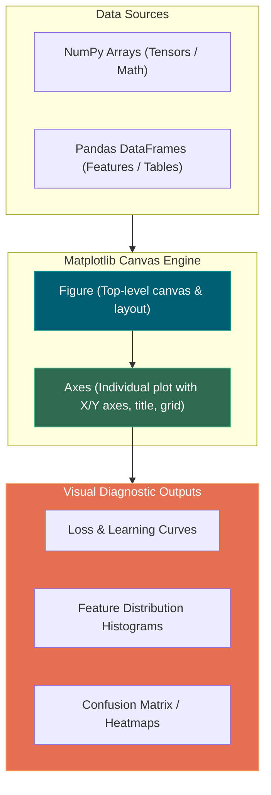

---

### 2.4 — `ndarray` & Vectorization

NumPy's core `ndarray` (n-dimensional array) stores fixed-type data in contiguous memory blocks. Vectorization performs mathematical operations across the entire array simultaneously in compiled C, avoiding Python `for` loops.

#### 💡 The Beginner Analogy: Assembly Line Stamp vs. Hand Pen

A Python list of numbers is a loose pile of items — doing math on it requires picking up each item individually and inspecting its type. An `ndarray` is an **orderly egg carton** where every slot holds the exact same size item (`int64` or `float64`), allowing a **single industrial stamp** (C operation) to process all slots at once.

#### 💻 Code Example & ⚠️ Why It Matters

```python
import numpy as np

# Vectorized C-speed computation
arr = np.array([1, 2, 3, 4])
res = arr * 2

print("Vectorized Multiply:", res)
```

##### Verified Output

```text
Vectorized Multiply: [2 4 6 8]
```

**Why It Matters**: AI/ML libraries (PyTorch, scikit-learn, TensorFlow) depend on contiguous `ndarray` memory layouts to feed data into GPU matrix multiplication cores.

#### 🤖 Real-Time AI/ML Use Case

The memory substrate of all neural network computation. PyTorch tensors and TensorFlow tensors are extended ndarrays. Every embedding vector, attention weight matrix, and gradient update in transformer models operates on contiguous ndarray-style memory blocks.

#### 🎨 Visual Concept

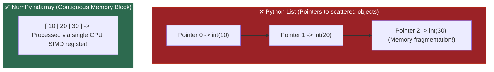

---

### 2.5 — Boolean Mask

An array of `True`/`False` values of matching shape used to filter elements from another array or DataFrame, returning only the elements corresponding to `True` positions.

#### 💡 The Beginner Analogy: Stencil Cutout

A boolean mask is like laying a **cardboard stencil with holes cut out** over a sheet of paper. Spraying paint (indexing) only passes through where the holes (`True`) exist, ignoring the covered paper (`False`).

#### 💻 Code Example & ⚠️ Why It Matters

```python
import numpy as np

prices = np.array([12.0, 99.0, 5.0, 150.0])

# Vectorized boolean masking
expensive = prices[prices > 50.0]
print("Filtered Prices:", expensive)
```

##### Verified Output

```text
Filtered Prices: [ 99. 150.]
```

**Why It Matters**: Enables instantaneous vector filtering across multi-gigabyte datasets without writing complex `for` loops or `if` statements.

#### 🤖 Real-Time AI/ML Use Case

Filtering training dataset samples by confidence score (`predictions[predictions > 0.85]`), masking padding tokens in transformer attention matrices (`attention_mask = tokens != PAD_ID`), and selecting top-k vector search results above a similarity threshold.

#### 🎨 Visual Concept

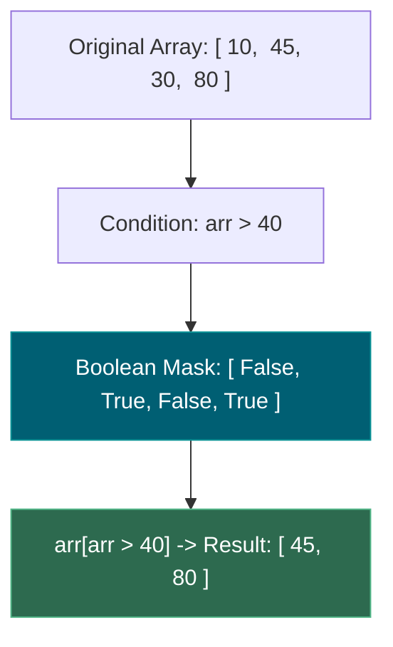

---

### 2.6 — Axis (Reduction Dimensions)

The dimension index along which a reduction operation (like `.sum()` or `.mean()`) operates, collapsing that dimension out of the resulting shape.

#### 💡 The Beginner Analogy: Squishing a Cardboard Box

Think of a 2D table of Rows x Columns:

- `axis=0`: Pushing down from the top lid to **squish rows into a single flat line** (yielding 1 result per column).
- `axis=1`: Pushing in from the side to **squish columns into a single vertical line** (yielding 1 result per row).

#### 💻 Code Example & ⚠️ Why It Matters

```python
import numpy as np

matrix = np.array([
    [10, 20],
    [30, 40]
])

col_sums = matrix.sum(axis=0) # -> [40, 60] (Row dimension collapses)
row_sums = matrix.sum(axis=1) # -> [30, 70] (Col dimension collapses)

print("Column Sums (axis=0):", col_sums)
print("Row Sums (axis=1):", row_sums)
```

##### Verified Output

```text
Column Sums (axis=0): [40 60]
Row Sums (axis=1): [30 70]
```

**Why It Matters**: Mixing up `axis=0` and `axis=1` is the #1 bug when calculating feature means or batch statistics in machine learning pipelines.

#### 🤖 Real-Time AI/ML Use Case

Batch normalization in neural networks. Computing per-feature mean/std across the batch dimension (`axis=0`) for layer normalization, and computing per-sample softmax across the class dimension (`axis=1`) for classification output layers.

#### 🎨 Visual Concept

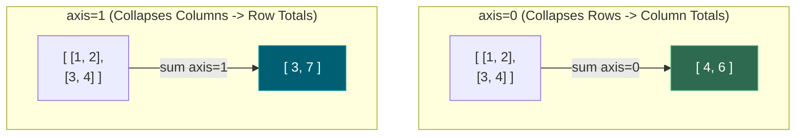

---

### 2.7 — Broadcasting

NumPy's automatic rule set for performing element-wise arithmetic between arrays of different shapes by virtually expanding smaller dimensions without allocating redundant memory copies.

#### 💡 The Beginner Analogy: Rubber Stamp Duplication

If you want to add a $5 tip to 1,000 separate bill amounts, you don't write out a 1,000-element array filled with `5`. Broadcasting takes a single scalar `5` and **virtually stamps** it across all 1,000 bill slots during computation.

#### 💻 Code Example & ⚠️ Why It Matters

```python
import numpy as np

prices = np.array([[100, 200], [300, 400]])
discount = np.array([10, 20])

final_prices = prices - discount
print("Broadcast Subtraction:\n", final_prices)
```

##### Verified Output

```text
Broadcast Subtraction:
 [[90 180]
 [290 380]]
```

**Why It Matters**: Allows performing matrix-vector operations (like subtracting feature means for model normalization) with zero memory overhead.

#### 🤖 Real-Time AI/ML Use Case

Feature standardization (`(X - mean) / std`) where `mean` is a (1, n_features) vector broadcast across all (m_samples, n_features) rows. Also powers the scaled dot-product attention formula `(Q @ K.T) / sqrt(d_k)` where `sqrt(d_k)` is a scalar broadcast across the entire attention matrix.

#### 🎨 Visual Concept

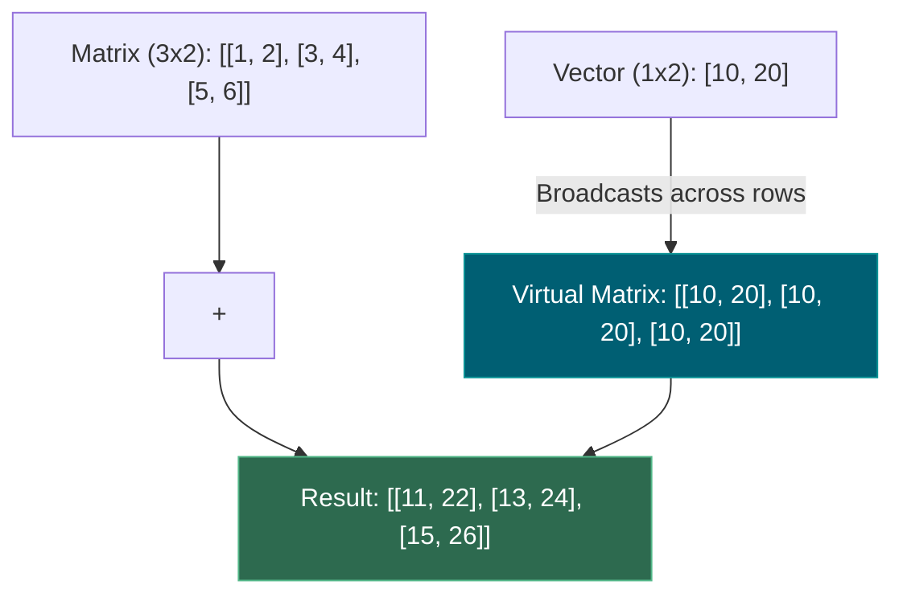

---

### 2.8 — Series, DataFrame & Index

- **Series**: Pandas 1-dimensional labeled array.
- **DataFrame**: Pandas 2-dimensional tabular structure composed of a dictionary of Series sharing a common Index.
- **Index**: Immutable row labels that anchor data alignment across transformations.

#### 💡 The Beginner Analogy: Spreadsheet Sheet & Row Headers

A **Series** is a single column in an Excel sheet. A **DataFrame** is the entire multi-column sheet. The **Index** is the frozen row numbers / dates on the far left that ensure data rows stay locked to the right records even when sorted.

#### 💻 Code Example & ⚠️ Why It Matters

```python
import pandas as pd

df = pd.DataFrame({
    "price": [10.0, 20.0],
    "category": ["A", "B"]
}, index=["item_1", "item_2"])

print("DataFrame:\n", df)
```

##### Verified Output

```text
DataFrame:
         price category
item_1   10.0        A
item_2   20.0        B
```

**Why It Matters**: Pandas aligns operations by **Index**, not by raw position. If two DataFrames have different indices, adding them together produces unexpected `NaN` values!

#### 🤖 Real-Time AI/ML Use Case

Loading, cleaning, and feature-engineering tabular ML training datasets. Every scikit-learn and XGBoost workflow starts with a Pandas DataFrame holding features and labels. Proper index management prevents train/test data leakage caused by misaligned row joins.

#### 🎨 Visual Concept

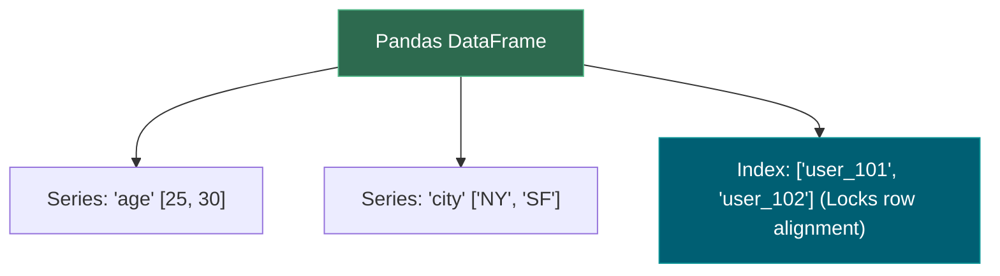

---

### 2.9 — `.loc` vs. `.iloc`

- **`.loc`**: Label-based indexing using explicit index names and column labels.
- **`.iloc`**: Integer position-based indexing using 0-indexed integer coordinates (like standard Python lists).

#### 💡 The Beginner Analogy: Street Address vs. GPS Coordinates

- `.loc`: Looking up a house by its **postal address label** (`"123 Main St"`).
- `.iloc`: Looking up a house by its **exact physical position** (the 3rd house from the corner).

#### 💻 Code Example & ⚠️ Why It Matters

```python
import pandas as pd

df = pd.DataFrame({"val": [10, 20, 30]}, index=[2, 1, 0])

# .loc[0] looks for index LABEL 0 (the LAST row)
val_loc = df.loc[0, "val"]

# .iloc[0] looks for integer POSITION 0 (the FIRST row)
val_iloc = df.iloc[0, "val"]

print("loc[0]:", val_loc)
print("iloc[0]:", val_iloc)
```

##### Verified Output

```text
loc[0]: 30
iloc[0]: 10
```

**Why It Matters**: After filtering a DataFrame, index labels become non-sequential. Using raw brackets `df[0]` or mixing `.loc` and `.iloc` produces silent lookup bugs.

#### 🤖 Real-Time AI/ML Use Case

Accessing specific training samples by dataset ID (`.loc["sample_42"]`) vs. by batch position (`.iloc[0:32]` for the first mini-batch). Critical when building custom PyTorch `Dataset` classes that need positional indexing into a filtered DataFrame.

#### 🎨 Visual Concept

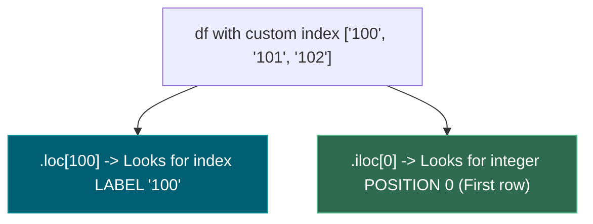

---

### 2.10 — `groupby` (Split-Apply-Combine)

A 3-stage data aggregation workflow:

1. **Split**: Partition data into groups based on key values.
2. **Apply**: Compute summary statistics (`mean`, `sum`, `count`) per group independently.
3. **Combine**: Reassemble group results into a single output DataFrame.

#### 💡 The Beginner Analogy: Sorting Laundry Baskets

Imagine sorting a giant pile of mixed laundry (Split into white, dark, and color baskets), washing each basket separately (Apply), and folding them back into a single clean drawer (Combine).

#### 💻 Code Example & ⚠️ Why It Matters

```python
import pandas as pd

df = pd.DataFrame({
    "category": ["A", "B", "A", "B"],
    "sales": [100, 200, 300, 400]
})

res = df.groupby("category")["sales"].agg(["sum", "mean"])
print(res)
```

##### Verified Output

```text
          sum   mean
category    
A         400  200.0
B         600  300.0
```

**Why It Matters**: The fundamental pattern for computing per-category summary statistics, user cohort metrics, and feature aggregations in data analytics.

#### 🤖 Real-Time AI/ML Use Case

Feature engineering for ML models. Computing per-customer aggregate features (`df.groupby("customer_id")["purchase_amount"].agg(["mean", "count", "max"])`) to create predictive signals for churn prediction, recommendation engines, and fraud detection models.

#### 🎨 Visual Concept

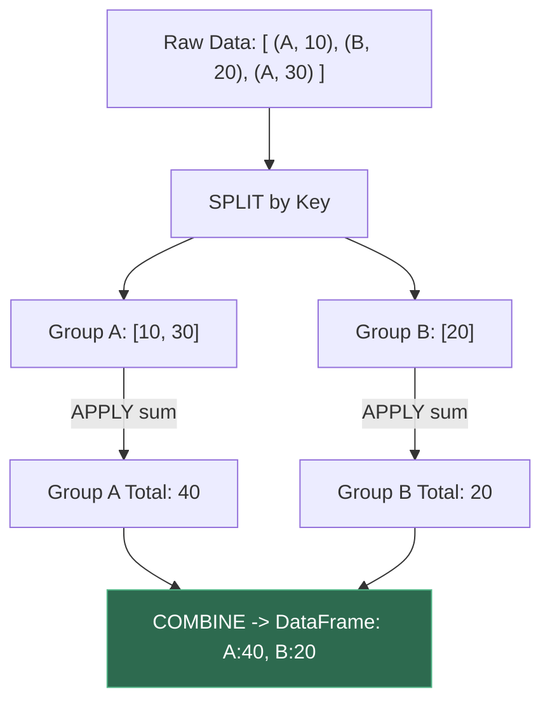

---

### 2.11 — Skew & `log1p` Transformation

- **Skew**: Asymmetry of a statistical distribution. Right-skewed data features a long tail of extreme high values (e.g. house prices, income levels).
- **`log1p` (`log(1 + x)`)**: A natural log transform that compresses extreme values into a bell-curve distribution while safely handling zero values (`log1p(0) = 0`).

#### 💡 The Beginner Analogy: Compressible Telescope Lens

Right-skewed data is like looking at objects scattered across a 10-mile field — tiny house values are bunched up near 0 while billionaire mansions sit miles away. A `log1p` transform acts as a **wide-angle telephoto lens**: it zooms in on the zero cluster while pulling far-away outliers closer so the machine learning model can see everything on one scale.

#### 💻 Code Example & ⚠️ Why It Matters

```python
import numpy as np

prices = np.array([0.0, 100.0, 500.0, 10000.0])
prices_transformed = np.log1p(prices)

print("Transformed:", np.round(prices_transformed, 2))
```

##### Verified Output

```text
Transformed: [0.   4.62 6.22 9.21]
```

**Why It Matters**: Linear regression and neural networks perform poorly on skewed data. `log1p` normalizes feature distributions and prevents numerical overflow during training.

#### 🤖 Real-Time AI/ML Use Case

Normalizing right-skewed features (income, page views, token counts) before feeding them into gradient-based models. Without `log1p`, a few extreme outliers dominate the loss function gradient, causing the model to underfit the majority of normal samples.

#### 🎨 Visual Concept

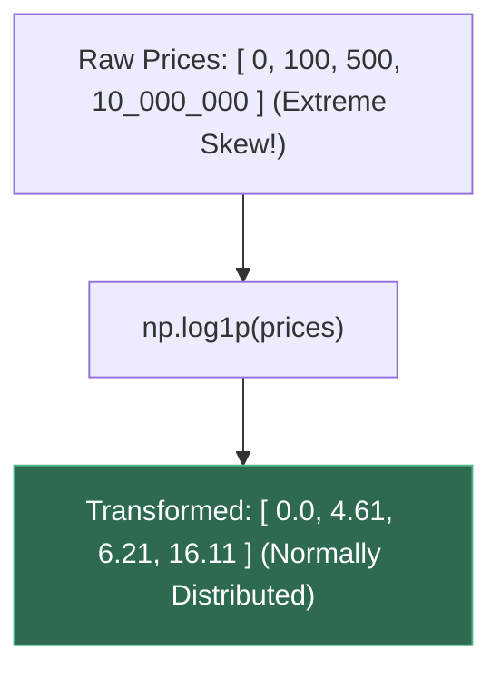

---

### 2.12 — `Agg` Backend (Matplotlib)

Matplotlib's non-interactive Anti-Grain Geometry (`Agg`) rendering engine that outputs raster graphics (`PNG`, `JPEG`) directly to file buffers without requiring a GUI desktop window manager.

#### 💡 The Beginner Analogy: Headless Virtual Camera

Standard plot rendering attempts to pop up a physical window on your desktop monitor. The **`Agg` backend** is a **headless virtual camera**: it renders high-resolution plots directly to disk in the background, making it work over remote SSH servers without a physical monitor attached.

#### 💻 Code Example & ⚠️ Why It Matters

```python
import matplotlib
matplotlib.use("Agg")
import matplotlib.pyplot as plt

fig, ax = plt.subplots()
ax.plot([1, 2], [3, 4])
fig.savefig("test_output.png")

print("Saved figure headlessly to test_output.png")
```

##### Verified Output

```text
Saved figure headlessly to test_output.png
```

**Why It Matters**: Prevents Matplotlib scripts from crashing when executed inside headless cloud VMs (like AWS/OCI), Docker containers, or automated CI/CD pipelines.

#### 🤖 Real-Time AI/ML Use Case

Automated ML experiment reporting. Training scripts running on headless GPU cloud servers (AWS SageMaker, OCI, Google Colab) use the Agg backend to render loss curves, confusion matrices, and ROC plots directly to PNG files for logging to MLflow/Weights & Biases dashboards.

#### 🎨 Visual Concept

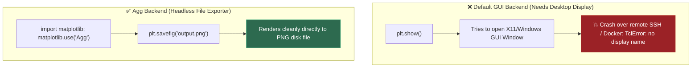

---

## 3. Skip Test — Answered

> Gate **before** studying. Both correct from memory → skip. §7 withholds its answers deliberately.

**① Group by one column, compute the mean of another, keep groups with more than 10 rows.**

**The Intuitive 2-Step Approach (Recommended for Beginners):**
Compute both the count and the mean in one summary table, then filter by row count:

```python
# Step 1: Group by vendor and compute both the count (n) and average (mean)
stats = df.groupby("vendor")["amount"].agg(count="count", mean_amount="mean")

# Step 2: Filter to keep only vendors with more than 10 transactions
big_vendors_mean = stats[stats["count"] > 10]["mean_amount"]
```

**Alternative (Using Groupby Filter):**

```python
# Filter out small groups directly, then compute mean
result = df.groupby("vendor").filter(lambda group: len(group) > 10).groupby("vendor")["amount"].mean()
```

**② Difference between `.loc` and `.iloc`?**

`.loc` selects by **label**; `.iloc` selects by **position**. They agree only while the index happens to be `0..n-1`.

The moment you filter, they diverge — filtering *keeps the original labels*. Demo 5 shows exactly this: after a filter, `big.iloc[3]` returns Acme/63000 and `big.loc[3]` returns Gamma/78000. **Neither raises.** You simply read the wrong invoice. `reset_index(drop=True)` after filtering is what prevents it.

---

## 3. Visual Concept Diagrams

### 3.1 — `axis` is the dimension that disappears

The single most confused NumPy argument. It does not mean "operate along" — it means "collapse this one".

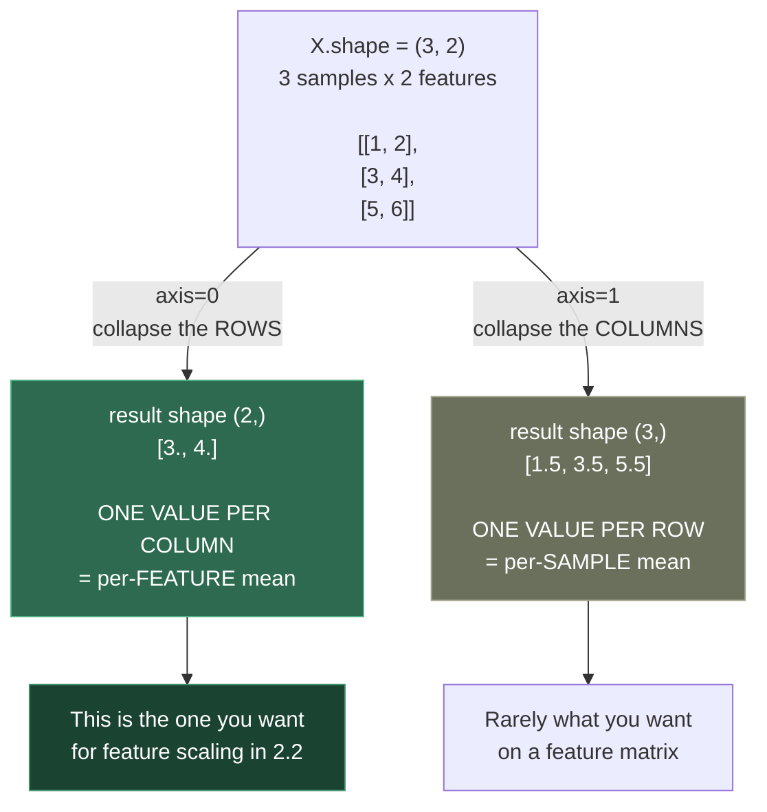

### 3.2 — Broadcasting: what NumPy does instead of tiling

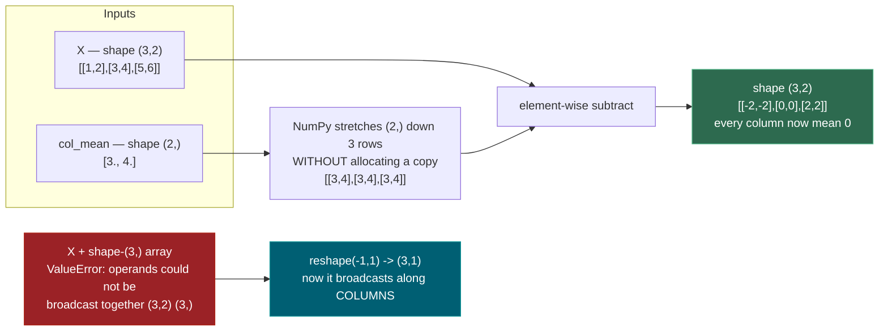

### 3.3 — The `.loc` / `.iloc` divergence, as measured

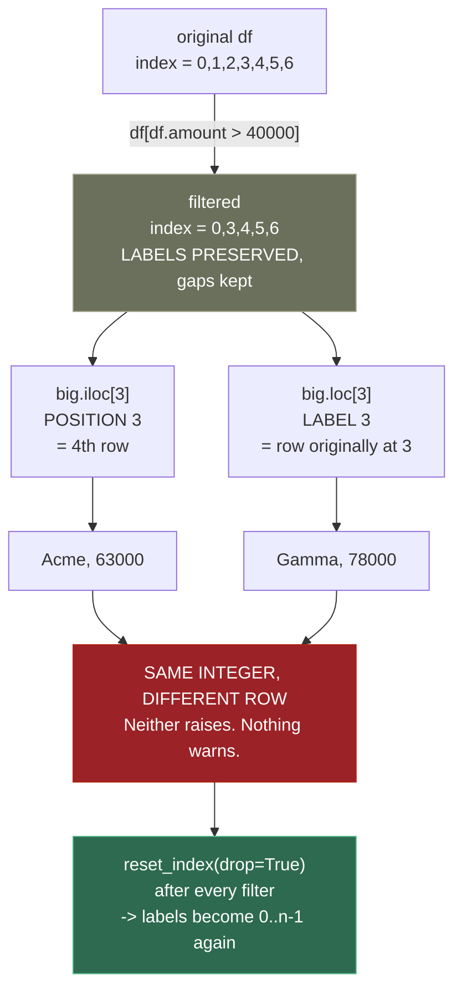

### 3.4 — Three fillna strategies are three different claims about the world

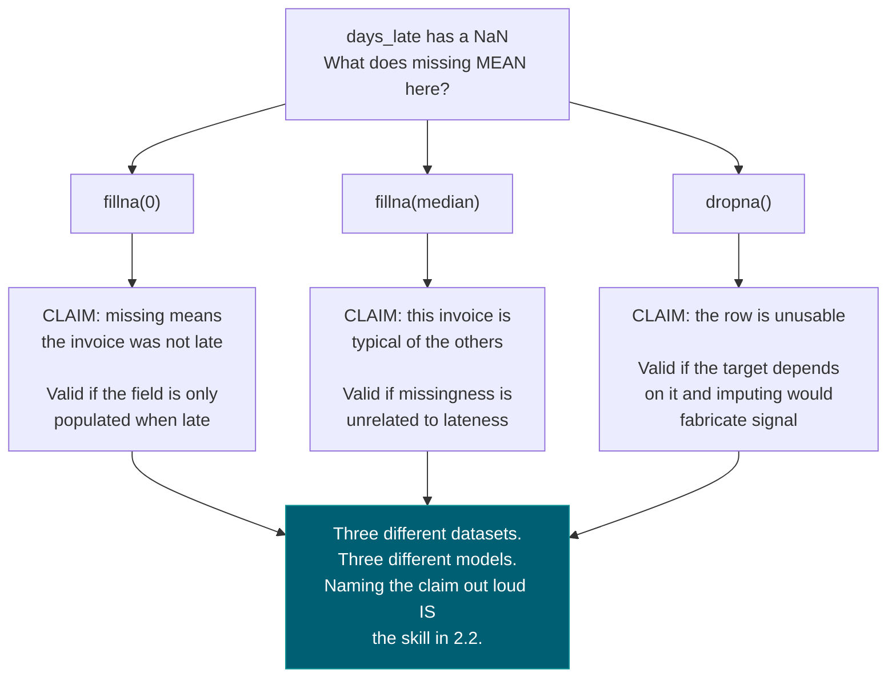

---

## 4. Core Technical Deep Dive

| Idiom                         | Replaces                                 | Where it returns                                              |
| ----------------------------- | ---------------------------------------- | ------------------------------------------------------------- |
| `arr[arr > x]` boolean mask | A filtering loop                         | **2.8** threshold selection                             |
| `axis=0` vs `axis=1`      | Manual row/column iteration              | **2.2** per-feature scaling                             |
| Broadcasting                  | `np.tile` and manual copies            | **1.14** formally, **4.3** batched attention      |
| `.reshape(-1, 1)`           | —                                       | Every scikit-learn call in**Phase 2**                   |
| `.loc` vs `.iloc`         | —                                       | Silent wrong-row bugs after any filter                        |
| `&` `\|` with parentheses  | `and` / `or` (which **raise**) | The most common Pandas exception                              |
| `groupby().agg()`           | Nested accumulator loops                 | **2.2** feature engineering                             |
| `.fillna()` choice          | —                                       | **2.2** — each option is a different assumption        |
| `hist` then `scatter`     | —                                       | **2.2** EDA, and deciding whether **2.3** applies |

**The four commands to run on every new dataset, in order:** `df.head()` to eyeball real values, `df.info()` for dtypes and non-null counts, `df.describe()` to spot impossible values, `df.isna().sum()` to size the missing-data problem. Doing this before modelling is the difference between EDA and guessing.

**Why `and` raises.** Python's `and` needs a single truth value, but a Series has many — hence `ValueError: The truth value of a Series is ambiguous`. `&` is the element-wise operator. The parentheses are mandatory because `&` binds *tighter* than `>`, so `df.a > 1 & df.b < 2` parses as `df.a > (1 & df.b) < 2`.

**The one rule:** if you are writing `for i in range(len(df))`, stop. There is a vectorized form, it is 15–100x faster (Demo 1 measures **17.2x**), and it is the notation the rest of this course is written in.

---

## 5. Hands-On Script & Verified Output

Run: `python 06_numpy_pandas_matplotlib.py`. Output below is **actual, captured** on numpy 2.4.4 / pandas 3.0.2 / matplotlib 3.11.1. Abridged to the load-bearing parts.

```text
numpy 2.4.4 | pandas 3.0.2 | matplotlib 3.11.1
======================================================================
DEMO 1 — vectorization: the same filter, three ways
======================================================================
  n = 2,000,000
  python loop + append :     63.0 ms
  list comprehension   :     58.0 ms   (1.09x)
  numpy boolean mask   :      3.7 ms   (17.2x)
  all same length?     : True

  The mask arr > 1_000_000 is itself an array of True/False:
    (arr > 1_000_000)[:8] -> [False False False False False False False False]
======================================================================
DEMO 2 — axis = the dimension that DISAPPEARS
======================================================================
  X.shape            : (3, 2)   (rows=samples, cols=features)
  X.mean(axis=0)     : [3. 4.]  shape (2,)
                       ^ collapsed ROWS -> one value PER COLUMN
  X.mean(axis=1)     : [1.5 3.5 5.5]  shape (3,)
                       ^ collapsed COLS -> one value PER ROW
======================================================================
DEMO 3 — broadcasting: (3,2) - (2,) with no manual tiling
======================================================================
  X - col_mean =
[[-2. -2.]
 [ 0.  0.]
 [ 2.  2.]]
  new column means   : [0. 0.]   <- all ~0, as intended

  X + shape-(3,) array -> ValueError: operands could not be broadcast
                          together with shapes (3,2) (3,)
  Fix: reshape to (3,1) so it broadcasts along columns
======================================================================
DEMO 4 — the four commands to run on EVERY new dataset
======================================================================
  df.isna().sum()   <- drives every 2.2 decision
vendor       0
amount       0
status       0
days_late    1
  dtypes: {'vendor': 'str', 'amount': 'int64', 'status': 'str',
           'days_late': 'float64'}
======================================================================
DEMO 5 — .loc vs .iloc: the silent wrong-row bug after a filter
======================================================================
  original index : [0, 1, 2, 3, 4, 5, 6]
  filtered index : [0, 3, 4, 5, 6]   <- NOT 0,1,2,3!

  big.iloc[3] -> vendor='Acme' amount=63000   (POSITION 3)
  big.loc[3]  -> vendor='Gamma' amount=78000   (LABEL 3)
  SAME INTEGER, DIFFERENT ROW: True
  Neither raises. Nothing warns. You just read the wrong invoice.

  big.loc[1] -> KeyError: 1   (label 1 was filtered out)
  ^ this one at least fails loudly

  after reset_index(drop=True), index = [0, 1, 2, 3, 4]
  now .loc[3] and .iloc[3] agree: 'Acme' == 'Acme'
======================================================================
DEMO 6 — `and` RAISES on a Series. Use & with parentheses.
======================================================================
  using `and` -> ValueError: The truth value of a Series is ambiguous.
                 Use a.empty, a.bool(), a.item(), a.any() or a.al...
  using &     -> 5 rows match
======================================================================
DEMO 7 — groupby: split -> apply -> combine
======================================================================
  multi-statistic .agg()
         total  n  worst_delay
vendor
Acme    126000  3         12.0
Beta     54000  2          0.0
Delta   150000  1          NaN
Gamma    78000  1         45.0
======================================================================
DEMO 8 — three fillna strategies = three DIFFERENT assumptions
======================================================================
  raw           : [12.0, 0.0, 3.0, 45.0, 0.0, 7.0, nan]
  fillna(0)     : [12.0, 0.0, 3.0, 45.0, 0.0, 7.0, 0.0]
                  assumption: missing MEANS not late
  fillna(median): [12.0, 0.0, 3.0, 45.0, 0.0, 7.0, 5.0]
                  assumption: missing is a TYPICAL case
  dropna()      : [12.0, 0.0, 3.0, 45.0, 0.0, 7.0]  (row removed entirely)
                  assumption: the row is UNUSABLE without it
======================================================================
DEMO 9 — the two first plots for any dataset
======================================================================
  wrote eda_0_6.png (30,669 bytes)
  amount skew: 1.20  (>0 = right tail, which the histogram shows)
======================================================================
```

**Demo 1 is honest about where the win comes from.** The list comprehension is only **1.09x** faster than the loop — both still iterate in Python. NumPy is **17.2x**, because it removes Python-level iteration entirely. Comprehensions are for readability; vectorization is for speed.

**Demo 5 is the one that costs people a whole afternoon.** `iloc[3]` and `loc[3]` return different invoices and neither complains. A report built on that is wrong and looks fine. The `KeyError` case is the *lucky* failure — at least it is loud.

**Demo 8 has no correct answer, and that is the point.** Three one-line changes produce three different datasets encoding three different claims about why the value is missing. **2.2** is about defending the claim, not memorising the method.

**Modify and re-run:**

- In Demo 2, predict `X.sum(axis=0)` and `X.sum(axis=1)` before running. Then try `X.mean(axis=0).shape` versus `X.mean(axis=0, keepdims=True).shape` and work out why `keepdims` exists.
- In Demo 5, change the filter threshold to `> 0` so nothing is dropped. Confirm `.loc` and `.iloc` now agree — and understand why that makes the bug *harder* to catch in testing.
- In Demo 9, add a third panel with a box plot of `amount` grouped by `status`. Predict which status has the widest spread before looking.

---

## 6. Video

**"Complete Python Pandas Data Science Tutorial! (2024 Updated Edition)"** — *Keith Galli* — [youtube.com/watch?v=2uvysYbKdjM](https://www.youtube.com/watch?v=2uvysYbKdjM). Verified live, ~690k views. Covers loading CSV/Excel, `.loc`/`.iloc`, filtering with multiple conditions and regex, `groupby` aggregation, merging and concatenating, handling nulls, and saving.

Companion notebook: [github.com/KeithGalli/complete-pandas-tutorial](https://github.com/KeithGalli/complete-pandas-tutorial) — run it alongside rather than watching passively.

NumPy-specific and Matplotlib-specific videos: **[VERIFY]** — not confirmed in this pass. The Pandas tutorial covers enough NumPy incidentally to proceed.

---

## 7. Retrieval Checkpoint — Unanswered

> Close this file. No notes. Answers deliberately withheld.

1. Given a DataFrame, group by one column, compute the mean of another, and keep only groups with more than 10 rows. Write the code.
2. `X` has shape `(100, 5)`. What shape does `X.mean(axis=0)` return, what does each number represent, and why is that the version you want for feature scaling?
3. After filtering a DataFrame, `df.iloc[3]` and `df.loc[3]` return different rows and neither raises. Explain why, and give the one-line fix.

---

## 8. Closed-Book Rebuild

With this file **and** the script closed: load a CSV into a DataFrame, run the four inspection commands, engineer one boolean and one log-transformed column without a loop, filter on two conditions combined correctly, group by a categorical column with a multi-statistic aggregation, handle a missing column with a stated assumption, and save a two-panel figure containing a histogram and a scatter plot.

---

## Review again in

**1 day** — the highest-density topic in Phase 0. Everything in Phase 2 depends on this being automatic rather than looked up. Do the Closed-Book Rebuild tomorrow, then again after Phase 1.
