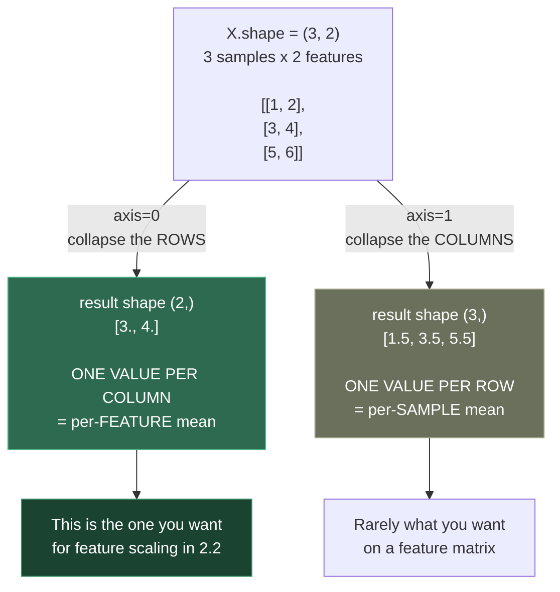
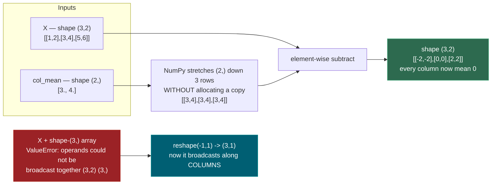
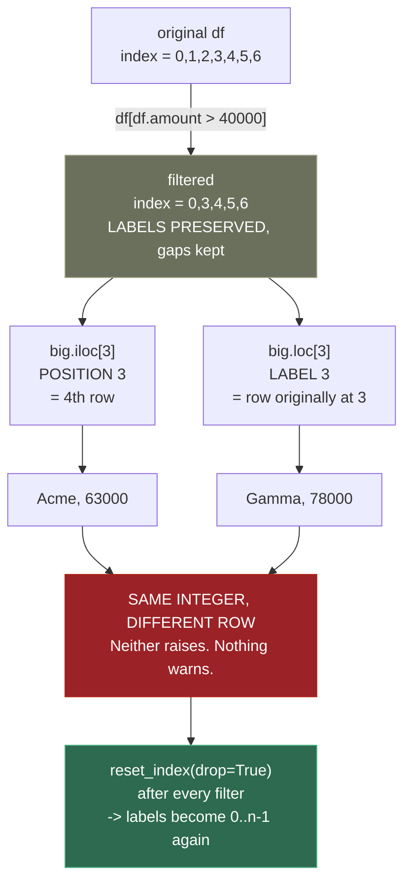
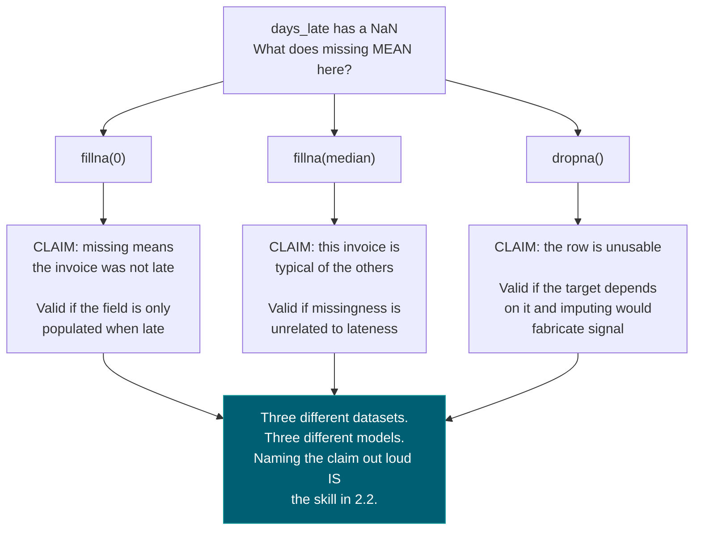

# 0.6 — Scientific Python: NumPy, Pandas, Matplotlib

**Phase 0 · CORE · CODE · 14 focused hours · Review in 1 day**

**Companion script:** [`06_numpy_pandas_matplotlib.py`](06_numpy_pandas_matplotlib.py) — `pip install numpy pandas matplotlib`, then run it. Writes `eda_0_6.png` beside itself; everything else prints.

> **The single most under-rated topic in Phase 0.** It is easy to skim because the syntax looks simple. Skimming it makes all of **Phase 2** twice as hard, because every model-fitting exercise assumes DataFrame fluency you do not have.

---

## 1. Overview

Three libraries that behave as one toolchain. **NumPy** gives you the n-dimensional array and vectorized operations — the substrate every other numeric library sits on, including scikit-learn in **Phase 2** and PyTorch in **3.10**. **Pandas** is NumPy with labelled axes: rows and columns with names, which is what real tabular data looks like. **Matplotlib** turns both into pictures, which is how **2.2** EDA actually happens.

The mental shift that matters is **vectorization**: you stop writing loops over rows and start expressing operations over whole arrays. This is not merely faster — it is the notation that makes **1.14** broadcasting, **1.2** matrix operations, and eventually **4.2** batched attention readable. Someone who writes `for i in range(len(df))` in Phase 2 will not be able to read a transformer implementation in Phase 4.

Depends on **0.1**; directly unlocks **1.14**, **2.2**, and every model-fitting topic from **2.3** onward.

---

## 2. Skip Test — Answered

> Gate **before** studying. Both correct from memory → skip. §7 withholds its answers deliberately.

**① Group by one column, compute the mean of another, keep groups with more than 10 rows.**

```python
g = df.groupby("vendor")
result = g.filter(lambda x: len(x) > 10).groupby("vendor")["amount"].mean()
```

Or, keeping it as one aggregation and filtering afterwards — usually clearer:

```python
agg = df.groupby("vendor").agg(mean_amount=("amount", "mean"), n=("amount", "size"))
result = agg[agg["n"] > 10]["mean_amount"]
```

**② Difference between `.loc` and `.iloc`?**

`.loc` selects by **label**; `.iloc` selects by **position**. They agree only while the index happens to be `0..n-1`.

The moment you filter, they diverge — filtering *keeps the original labels*. Demo 5 shows exactly this: after a filter, `big.iloc[3]` returns Acme/63000 and `big.loc[3]` returns Gamma/78000. **Neither raises.** You simply read the wrong invoice. `reset_index(drop=True)` after filtering is what prevents it.

---

## 3. Visual Concept Diagrams

### 3.1 — `axis` is the dimension that disappears

The single most confused NumPy argument. It does not mean "operate along" — it means "collapse this one".



### 3.2 — Broadcasting: what NumPy does instead of tiling



### 3.3 — The `.loc` / `.iloc` divergence, as measured



### 3.4 — Three fillna strategies are three different claims about the world



---

## 4. Core Technical Deep Dive

| Idiom | Replaces | Where it returns |
|---|---|---|
| `arr[arr > x]` boolean mask | A filtering loop | **2.8** threshold selection |
| `axis=0` vs `axis=1` | Manual row/column iteration | **2.2** per-feature scaling |
| Broadcasting | `np.tile` and manual copies | **1.14** formally, **4.3** batched attention |
| `.reshape(-1, 1)` | — | Every scikit-learn call in **Phase 2** |
| `.loc` vs `.iloc` | — | Silent wrong-row bugs after any filter |
| `&` `\|` with parentheses | `and` / `or` (which **raise**) | The most common Pandas exception |
| `groupby().agg()` | Nested accumulator loops | **2.2** feature engineering |
| `.fillna()` choice | — | **2.2** — each option is a different assumption |
| `hist` then `scatter` | — | **2.2** EDA, and deciding whether **2.3** applies |

**The four commands to run on every new dataset, in order:** `df.head()` to eyeball real values, `df.info()` for dtypes and non-null counts, `df.describe()` to spot impossible values, `df.isna().sum()` to size the missing-data problem. Doing this before modelling is the difference between EDA and guessing.

**Why `and` raises.** Python's `and` needs a single truth value, but a Series has many — hence `ValueError: The truth value of a Series is ambiguous`. `&` is the element-wise operator. The parentheses are mandatory because `&` binds *tighter* than `>`, so `df.a > 1 & df.b < 2` parses as `df.a > (1 & df.b) < 2`.

**The one rule:** if you are writing `for i in range(len(df))`, stop. There is a vectorized form, it is 15–100x faster (Demo 1 measures **17.2x**), and it is the notation the rest of this course is written in.

---

## 5. Hands-On Script & Verified Output

Run: `python 06_numpy_pandas_matplotlib.py`. Output below is **actual, captured** on numpy 2.4.4 / pandas 3.0.2 / matplotlib 3.11.1. Abridged to the load-bearing parts.

```text
numpy 2.4.4 | pandas 3.0.2 | matplotlib 3.11.1
======================================================================
DEMO 1 — vectorization: the same filter, three ways
======================================================================
  n = 2,000,000
  python loop + append :     63.0 ms
  list comprehension   :     58.0 ms   (1.09x)
  numpy boolean mask   :      3.7 ms   (17.2x)
  all same length?     : True

  The mask arr > 1_000_000 is itself an array of True/False:
    (arr > 1_000_000)[:8] -> [False False False False False False False False]
======================================================================
DEMO 2 — axis = the dimension that DISAPPEARS
======================================================================
  X.shape            : (3, 2)   (rows=samples, cols=features)
  X.mean(axis=0)     : [3. 4.]  shape (2,)
                       ^ collapsed ROWS -> one value PER COLUMN
  X.mean(axis=1)     : [1.5 3.5 5.5]  shape (3,)
                       ^ collapsed COLS -> one value PER ROW
======================================================================
DEMO 3 — broadcasting: (3,2) - (2,) with no manual tiling
======================================================================
  X - col_mean =
[[-2. -2.]
 [ 0.  0.]
 [ 2.  2.]]
  new column means   : [0. 0.]   <- all ~0, as intended

  X + shape-(3,) array -> ValueError: operands could not be broadcast
                          together with shapes (3,2) (3,)
  Fix: reshape to (3,1) so it broadcasts along columns
======================================================================
DEMO 4 — the four commands to run on EVERY new dataset
======================================================================
  df.isna().sum()   <- drives every 2.2 decision
vendor       0
amount       0
status       0
days_late    1
  dtypes: {'vendor': 'str', 'amount': 'int64', 'status': 'str',
           'days_late': 'float64'}
======================================================================
DEMO 5 — .loc vs .iloc: the silent wrong-row bug after a filter
======================================================================
  original index : [0, 1, 2, 3, 4, 5, 6]
  filtered index : [0, 3, 4, 5, 6]   <- NOT 0,1,2,3!

  big.iloc[3] -> vendor='Acme' amount=63000   (POSITION 3)
  big.loc[3]  -> vendor='Gamma' amount=78000   (LABEL 3)
  SAME INTEGER, DIFFERENT ROW: True
  Neither raises. Nothing warns. You just read the wrong invoice.

  big.loc[1] -> KeyError: 1   (label 1 was filtered out)
  ^ this one at least fails loudly

  after reset_index(drop=True), index = [0, 1, 2, 3, 4]
  now .loc[3] and .iloc[3] agree: 'Acme' == 'Acme'
======================================================================
DEMO 6 — `and` RAISES on a Series. Use & with parentheses.
======================================================================
  using `and` -> ValueError: The truth value of a Series is ambiguous.
                 Use a.empty, a.bool(), a.item(), a.any() or a.al...
  using &     -> 5 rows match
======================================================================
DEMO 7 — groupby: split -> apply -> combine
======================================================================
  multi-statistic .agg()
         total  n  worst_delay
vendor
Acme    126000  3         12.0
Beta     54000  2          0.0
Delta   150000  1          NaN
Gamma    78000  1         45.0
======================================================================
DEMO 8 — three fillna strategies = three DIFFERENT assumptions
======================================================================
  raw           : [12.0, 0.0, 3.0, 45.0, 0.0, 7.0, nan]
  fillna(0)     : [12.0, 0.0, 3.0, 45.0, 0.0, 7.0, 0.0]
                  assumption: missing MEANS not late
  fillna(median): [12.0, 0.0, 3.0, 45.0, 0.0, 7.0, 5.0]
                  assumption: missing is a TYPICAL case
  dropna()      : [12.0, 0.0, 3.0, 45.0, 0.0, 7.0]  (row removed entirely)
                  assumption: the row is UNUSABLE without it
======================================================================
DEMO 9 — the two first plots for any dataset
======================================================================
  wrote eda_0_6.png (30,669 bytes)
  amount skew: 1.20  (>0 = right tail, which the histogram shows)
======================================================================
```

**Demo 1 is honest about where the win comes from.** The list comprehension is only **1.09x** faster than the loop — both still iterate in Python. NumPy is **17.2x**, because it removes Python-level iteration entirely. Comprehensions are for readability; vectorization is for speed.

**Demo 5 is the one that costs people a whole afternoon.** `iloc[3]` and `loc[3]` return different invoices and neither complains. A report built on that is wrong and looks fine. The `KeyError` case is the *lucky* failure — at least it is loud.

**Demo 8 has no correct answer, and that is the point.** Three one-line changes produce three different datasets encoding three different claims about why the value is missing. **2.2** is about defending the claim, not memorising the method.

**Modify and re-run:**
- In Demo 2, predict `X.sum(axis=0)` and `X.sum(axis=1)` before running. Then try `X.mean(axis=0).shape` versus `X.mean(axis=0, keepdims=True).shape` and work out why `keepdims` exists.
- In Demo 5, change the filter threshold to `> 0` so nothing is dropped. Confirm `.loc` and `.iloc` now agree — and understand why that makes the bug *harder* to catch in testing.
- In Demo 9, add a third panel with a box plot of `amount` grouped by `status`. Predict which status has the widest spread before looking.

---

## 6. Video

**"Complete Python Pandas Data Science Tutorial! (2024 Updated Edition)"** — *Keith Galli* — [youtube.com/watch?v=2uvysYbKdjM](https://www.youtube.com/watch?v=2uvysYbKdjM). Verified live, ~690k views. Covers loading CSV/Excel, `.loc`/`.iloc`, filtering with multiple conditions and regex, `groupby` aggregation, merging and concatenating, handling nulls, and saving.

Companion notebook: [github.com/KeithGalli/complete-pandas-tutorial](https://github.com/KeithGalli/complete-pandas-tutorial) — run it alongside rather than watching passively.

NumPy-specific and Matplotlib-specific videos: **[VERIFY]** — not confirmed in this pass. The Pandas tutorial covers enough NumPy incidentally to proceed.

---

## 7. Retrieval Checkpoint — Unanswered

> Close this file. No notes. Answers deliberately withheld.

1. Given a DataFrame, group by one column, compute the mean of another, and keep only groups with more than 10 rows. Write the code.
2. `X` has shape `(100, 5)`. What shape does `X.mean(axis=0)` return, what does each number represent, and why is that the version you want for feature scaling?
3. After filtering a DataFrame, `df.iloc[3]` and `df.loc[3]` return different rows and neither raises. Explain why, and give the one-line fix.

---

## 8. Closed-Book Rebuild

With this file **and** the script closed: load a CSV into a DataFrame, run the four inspection commands, engineer one boolean and one log-transformed column without a loop, filter on two conditions combined correctly, group by a categorical column with a multi-statistic aggregation, handle a missing column with a stated assumption, and save a two-panel figure containing a histogram and a scatter plot.

---

## 9. Glossary

**ndarray** — NumPy's n-dimensional array: fixed dtype, contiguous memory, operated on as a whole rather than element by element.

**Vectorization** — expressing an operation over an entire array so the loop runs in C rather than Python. The source of the 17x in Demo 1.

**Boolean mask** — an array of `True`/`False` used as an index, selecting the `True` positions. `arr[arr > x]` is the canonical filtering idiom.

**Axis** — the dimension that *disappears* in a reduction. `axis=0` collapses rows and yields one value per column.

**Broadcasting** — NumPy's rule for combining arrays of different shapes by virtually stretching the smaller one, with no copy allocated.

**Series / DataFrame** — Pandas' 1-D and 2-D labelled structures. A DataFrame is a dict of Series sharing one index.

**Index** — the row labels of a DataFrame. Preserved through filtering, which is what makes `.loc` and `.iloc` diverge.

**`.loc` vs `.iloc`** — label-based versus position-based selection. Identical only while the index is `0..n-1`.

**`groupby`** — split-apply-combine: partition by key, compute per group, reassemble.

**Skew** — asymmetry of a distribution. Positive means a long right tail, which is why `log1p` is a common fix in **2.2**.

**`Agg` backend** — Matplotlib's non-interactive renderer, writing straight to file. Required for headless runs over SSH (**0.10**).

---

## Review again in

**1 day** — the highest-density topic in Phase 0. Everything in Phase 2 depends on this being automatic rather than looked up. Do the Closed-Book Rebuild tomorrow, then again after Phase 1.
