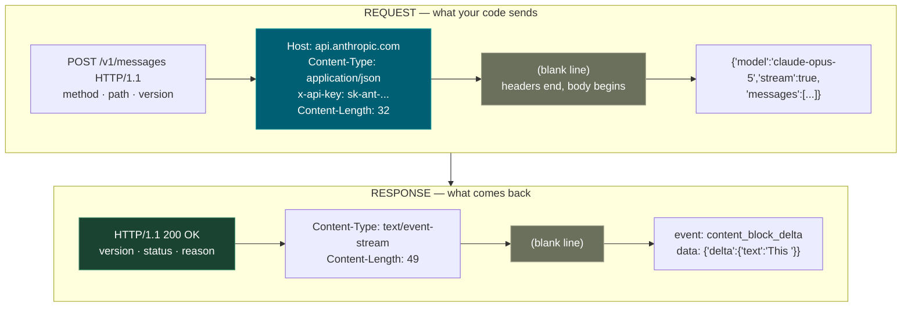
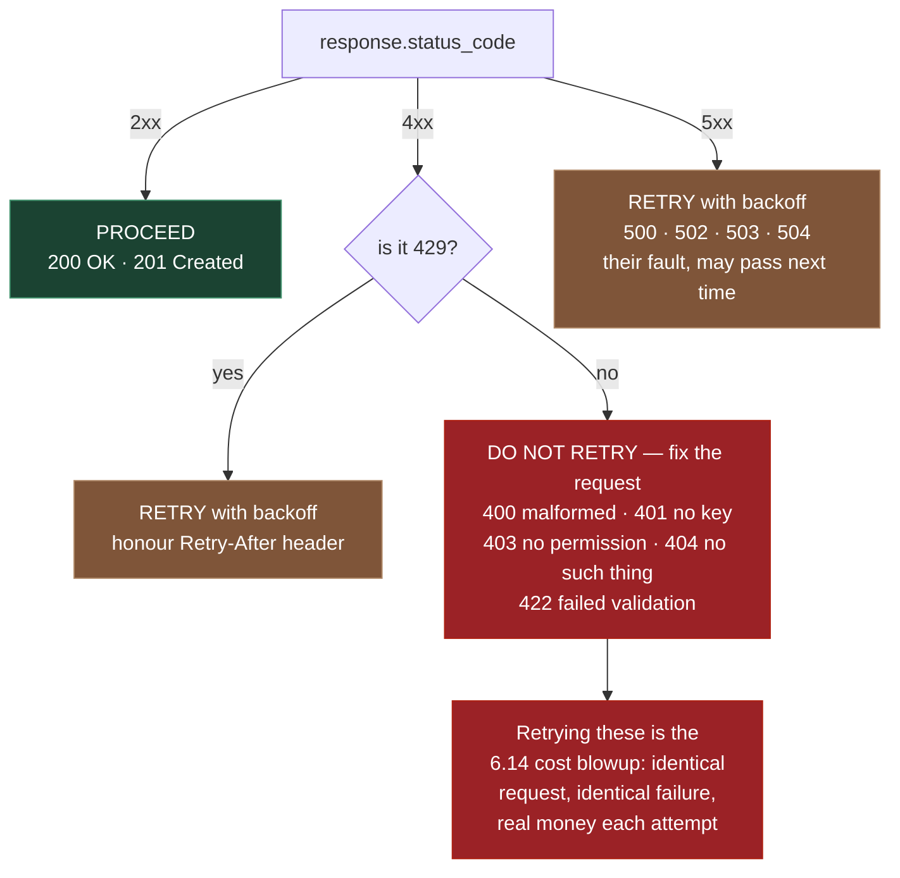
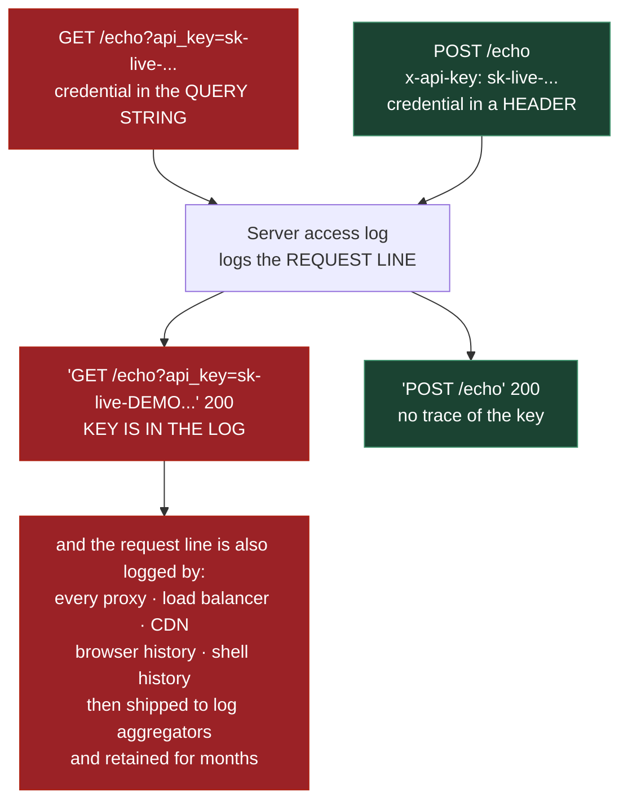

# 0.7 — HTTP Fundamentals

**Phase 0 · CORE · CODE · 2 focused hours · Review in 7 days**

**Companion script:** [`07_http_fundamentals.py`](07_http_fundamentals.py) — standard library only, no installs. It starts a throwaway HTTP server on `127.0.0.1` on a random free port, talks to it, and shuts it down. Fully offline; no real API keys, nothing leaves the machine.

---

## 1. Overview

Status codes, headers and JSON payloads are the vocabulary of every LLM API call in **Phase 4** and every MCP transport in **6.12**. This is not general web knowledge here — it is operationally load-bearing. A `429` and a `400` demand opposite responses from an agent: one means back off and retry, the other means the request itself is broken and retrying it burns money forever without ever succeeding.

Streaming matters more than usual on this path. **4.9** streaming and **6.9** LangGraph streaming modes both depend on the response body arriving incrementally rather than all at once, and **0.12** NGINX can silently defeat that with response buffering. Demo 4 measures the difference rather than asserting it.

Unlocks **0.8** consuming APIs, **0.9** FastAPI, and **6.12** MCP Streamable HTTP.

---

## 2. Skip Test — Answered

> Gate **before** studying. Both correct from memory → skip. §7 withholds its answers deliberately.

**① What is the difference between `400`, `422`, and `429` — and which one should a client retry?**

`400` means the request was **malformed** — bad JSON, a missing required field, something the server could not even parse. `422` means the request was **well-formed but semantically wrong** — valid JSON whose *contents* fail validation, such as `max_tokens: -5`. In Phase 4 onward this is usually Pydantic (**0.3**) rejecting a payload. `429` means **rate limited** — the request was perfectly fine, there were just too many of them.

Only `429` is worth retrying. `400` and `422` will return exactly the same result on every attempt because nothing about the request changed. The general rule Demo 2 prints: **4xx means you are wrong, 5xx means they are wrong**, with `429` the single 4xx exception.

**② Where does an API key belong in a request, and why not in the URL?**

In a **header** (`x-api-key` or `Authorization`), never in a query string. Demo 5 proves why by reading the server's own access log: the query-string request appears in the log **with the key in it**, the header request does not — despite sending the identical key. Every server, proxy, load balancer and CDN in the path logs the request line, and those logs get retained, shipped to log aggregators, and indexed.

---

## 3. Visual Concept Diagrams

### 3.1 — Anatomy of one exchange

Every HTTP call is two text blocks. Headers, then a blank line, then the body — in both directions.



### 3.2 — The status-code decision tree

This is not a reference table to memorise. It is **three actions**, and it becomes literal agent behaviour in **6.14**.



### 3.3 — Streaming vs buffered, at the measured timings

Both finish at the same moment. Only one has anything on screen before then.

```mermaid
gantt
    title Same 314 bytes, same total time — measured by Demo 4
    dateFormat SSS
    axisFormat %L ms

    section Streaming client
    first token visible   :done, a1, 000, 10ms
    tokens keep arriving  :active, a2, 010, 743ms

    section Buffered client
    user stares at nothing :crit, b1, 000, 753ms
    entire response appears :done, b2, 753, 10ms
```



### 3.4 — Why the key belongs in a header



---

## 4. Core Technical Deep Dive

**The parts of a request, and what each one decides.**

| Part | What it does | Why it matters on this path |
|---|---|---|
| `POST` vs `GET` | `GET` is idempotent, `POST` is not | Decides whether a retry in **6.14** is safe — Demo 6 |
| `Content-Type: application/json` | Declares the body format | Omit it and many servers return `415` — Demo 3 |
| `x-api-key` header | Credential in a **header**, never the URL | URLs land in logs and history — Demo 5, **7.13** |
| `anthropic-version` style header | Pins API behaviour | Stops a provider change silently altering output |
| `Content-Length` | Exact byte count of the body | Wrong value and the server hangs or misreads |
| Body, not query params | Large structured payload | Query strings are length-limited; prompts are long |
| `"stream": true` | Response arrives incrementally | **4.9**, and NGINX must not buffer it — **0.12** |

**Status codes, by the action they demand:**

| Code | Meaning | Correct client response |
|---|---|---|
| `200` / `201` | OK / Created | Proceed |
| `400` | Malformed request | **Do not retry** — fix the code |
| `401` | Not authenticated | **Do not retry** — key missing or wrong |
| `403` | Authenticated, not permitted | **Do not retry** — scope or permission issue (**7.13**) |
| `404` | No such resource | Do not retry the same URL |
| `422` | Well-formed, semantically invalid | **Do not retry unchanged** — Pydantic rejecting a payload (**0.3**, **4.8**) |
| `429` | Rate limited | **Retry with backoff**, honour `Retry-After` |
| `500` / `502` / `503` / `504` | Server-side fault | Retry with backoff |

**Streaming is a different body format, not a flag.** A normal response is one JSON document. A streaming response is a sequence of **Server-Sent Events** — `event:` and `data:` lines separated by blank lines, arriving over hundreds of milliseconds. Demo 4 shows `json.loads()` failing on it outright. You either iterate the lines yourself or let a provider SDK do it; there is no third option where `.json()` works.

**Query parameter vs body.** Query params (`?limit=10`) belong in `GET` for filtering and paging, are visible in every log, and are length-limited. Body params belong in `POST`/`PUT`, carry structure, and stay out of URL logs. An API key in a query param is the classic credential leak, and Demo 5 shows the exact log line that leaks it.

---

## 5. Hands-On Script & Verified Output

Run: `python 07_http_fundamentals.py`. Output below is **actual, captured** on Python 3.14.4. Port numbers, dates and timings will differ on your machine; the shapes will not.

```text
throwaway server on http://127.0.0.1:51015  (offline, 127.0.0.1 only)
======================================================================
DEMO 1 - HTTP is TEXT. Hand-typed request over a raw socket.
======================================================================
  --- what goes ON THE WIRE (\r\n shown as line breaks) ---
    POST /echo HTTP/1.1
    Host: 127.0.0.1:51015
    Content-Type: application/json
    x-api-key: sk-live-DEMO0000NOTAREALKEY0000
    Connection: close
    Content-Length: 32
    <-- BLANK LINE: headers end, body begins
    {"model":"demo","max_tokens":10}

  --- what comes BACK, byte for byte ---
    HTTP/1.1 200 OK
    Server: BaseHTTP/0.6 Python/3.14.4
    Date: Sat, 01 Aug 2026 10:37:22 GMT
    Content-Type: application/json
    Content-Length: 49
    <-- BLANK LINE: headers end, body begins
    {"received": {"model": "demo", "max_tokens": 10}}
======================================================================
DEMO 2 - status codes, grouped by the ACTION they demand
======================================================================
  code  meaning                            Retry-After  action
  ----- ---------------------------------- ------------ ---------------------------
  200   OK                                 -            PROCEED
  201   Created                            -            PROCEED
  400   Malformed request                  -            DO NOT RETRY - request wrong
  401   Not authenticated                  -            DO NOT RETRY - request wrong
  403   Authenticated but not permitted    -            DO NOT RETRY - request wrong
  404   No such resource                   -            DO NOT RETRY - request wrong
  422   Valid JSON, invalid meaning        -            DO NOT RETRY - request wrong
  429   Rate limited                       2            RETRY with backoff
  500   Server fault                       -            RETRY with backoff
  503   Temporarily unavailable            -            RETRY with backoff
======================================================================
DEMO 3 - the same body, one header apart
======================================================================
  Content-Type: (none - urllib sends x-www-form-urlencoded)  -> 415 expected
                                             Content-Type: application/json
  Content-Type: application/json                             -> 200 OK

  Identical bytes in the body. One header decided the outcome.
======================================================================
DEMO 4 - streaming: time to FIRST token vs time to LAST
======================================================================
  Content-Type: text/event-stream

  streaming   : first token at      1 ms, complete at    753 ms
  buffered    : first token at    754 ms, complete at    754 ms
  reassembled : 'This invoice is overdue.'

  Same 314 bytes, same total time. The ONLY difference is
  when the user sees the first word: 753 ms earlier.

  --- and why .json() cannot work on this body ---
    json.loads(body) -> JSONDecodeError: Expecting value: line 1 column 1 (char 0)
======================================================================
DEMO 5 - key in the URL vs key in the body: read the server log
======================================================================
  server access log, exactly as written:
    "GET /echo?api_key=sk-live-DEMO0000NOTAREALKEY0000&limit=10 HTTP/1.1" 200 -
    "POST /echo HTTP/1.1" 200 -

  entries containing the key: 1 of 2
======================================================================
DEMO 6 - GET is idempotent. POST is not. Hence retry policy.
======================================================================
  GET  /counter x3 -> 0, 0, 0   (nothing changed)
  POST /orders  x3 -> order ids [1, 2, 3]   (THREE orders now exist)
======================================================================
server stopped
```

**Demo 1 is the point of the whole topic.** There is no library in that exchange — a socket, a hand-typed string, and bytes back. `requests`, `httpx` and every provider SDK in Phase 4 are typing those same bytes on your behalf. Once that is concrete, "the API returned a 415" stops being mysterious.

**Demo 3 is a two-line diff with a different outcome.** Identical body bytes; one header present or absent decides `200` versus `415`. This is the most common cause of "it worked in curl but not in my code" — curl sets `Content-Type` for you in cases where a raw client does not.

**Demo 4 quantifies streaming.** Both clients finish at ~753 ms and receive the same 314 bytes. The streaming client had the first word on screen at **1 ms**. Nothing about the total is faster; the *perceived* latency is 753 ms lower. Then it shows `json.loads()` failing on that same body — which is why streaming needs different client code, not just a different flag.

**Demo 5 is the one to remember.** Both requests sent the identical key. One of them is now sitting in a log file. Note that this is the server's *own* logging, with no misconfiguration involved — it is the default behaviour of essentially every HTTP server ever written.

**Demo 6 explains why a timed-out `POST` is genuinely hard.** Three `GET`s changed nothing; three `POST`s created three orders. When a `POST` times out you do not know whether the server processed it before the timeout fired — so a blind retry may double-charge. That is why **0.8** treats write retries differently from read retries.

**Modify and re-run:**
- In Demo 1, change `Content-Length: 32` to `40` and re-run. Predict what happens before you do — the server will wait for eight bytes that never arrive.
- Add a `418` route to the server and see what `decide()` returns for it. Then decide what an agent *should* do with an unclassified code.
- Raise `STREAM_GAP` to `1.0` and re-run Demo 4. Watch the perceived-latency gap widen to five seconds — this is what streaming buys on a long generation.
- In Demo 5, add a header called `Authorization` and confirm it also stays out of the log. Then log `self.headers` in the handler and watch it leak anyway — the lesson is about *default* logging, not about headers being magic.

---

## 6. Video

**[VERIFY]** — no specific HTTP fundamentals video was confirmed currently live in this pass, and inventing a title would be worse than saying so. The MDN HTTP reference (`developer.mozilla.org/en-US/docs/Web/HTTP`) is the reliable source here: read the **status-code list** and the **Server-Sent Events** page specifically. Running the companion script covers most of what a video would show, with the advantage that you can change it.

---

## 7. Retrieval Checkpoint — Unanswered

> Close this file. No notes. Answers deliberately withheld.

1. What does `422` mean, how does it differ from `400`, and which library on this path will most often be the thing generating it?
2. Which single 4xx status code is worth retrying, what header should you honour when you do, and what specifically happens to an agent that retries the others anyway?
3. Why can you not call `.json()` on a streaming response, and which NGINX setting turns a working stream into a delayed blob?
4. Both a query-string key and a header key reach the server identically. Explain precisely why only one of them ends up in a log.

---

## 8. Closed-Book Rebuild

With this file **and** the script closed: write out by hand a complete `POST` request — request line, headers including authentication and content type, blank line, JSON body — with a correct `Content-Length`. Then write the retry decision for `400`, `401`, `422`, `429`, and `500`: one line each, stating retry or not and why. Finally, name the one status code in that list that tells you *how long* to wait.

---

## 9. Glossary

**Request line** — the first line of a request: method, path, HTTP version. This is what servers log, which is why credentials must not appear in the path or query string.

**Header** — a `Name: value` line before the blank line. Carries credentials, content type, versioning, and caching instructions.

**Body** — everything after the blank line. Structured payloads and prompts go here, not in the URL.

**`Content-Length`** — the exact byte count of the body. Wrong values cause hangs or corrupted reads; libraries compute it for you.

**Idempotent** — repeating the request produces the same state as doing it once. `GET` is; `POST` is not. This is what determines whether a blind retry is safe.

**`415 Unsupported Media Type`** — the server understood the request but rejects the declared (or missing) `Content-Type`.

**`422 Unprocessable Content`** — syntactically valid, semantically invalid. On this path, usually a Pydantic validation failure.

**`Retry-After`** — a response header giving the number of seconds to wait. When present it overrides your own backoff calculation; the provider knows better than your formula.

**Server-Sent Events (SSE)** — a streaming body format of `event:`/`data:` lines separated by blank lines, served as `text/event-stream`. Not parseable as a single JSON document.

**Time to first token** — how long until the user sees *anything*. Distinct from total latency, and the metric streaming actually improves.

**`proxy_buffering`** — the NGINX setting (**0.12**) that, left at its default, holds streamed chunks until the response completes and silently converts a stream into a blob.

---

## Review again in

**7 days** — low density. The one thing genuinely worth retaining is the status-code decision tree in §3.2, because it becomes literal agent behaviour in **6.14** and the cost of getting it wrong is measured in money.
