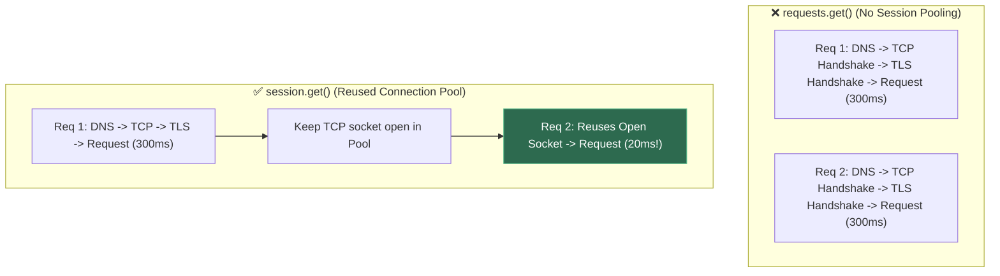
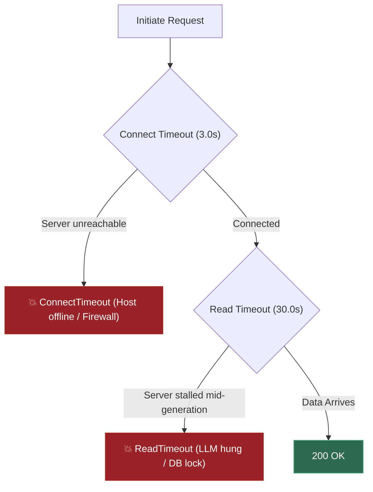
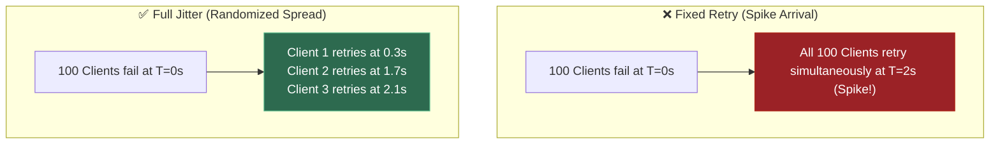
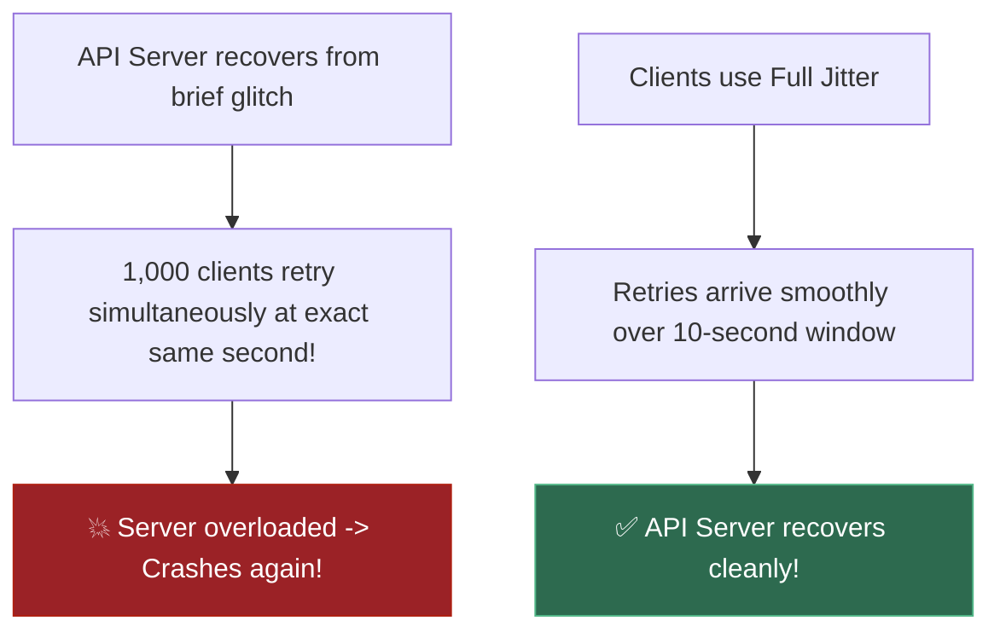
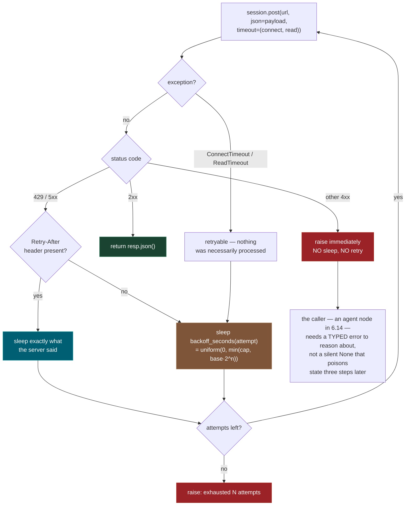
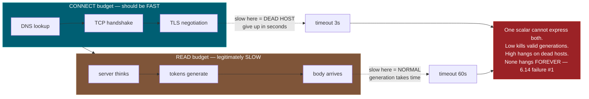
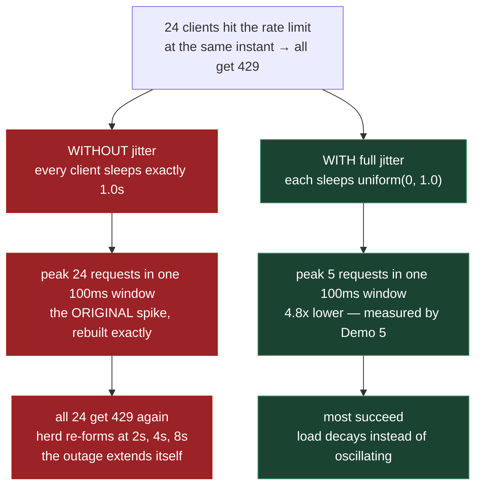
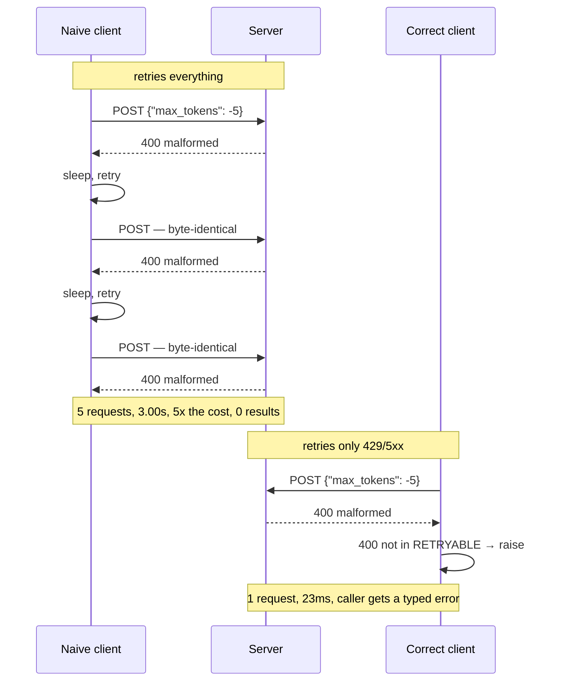

# 0.8 — Consuming REST APIs from Python

**Phase 0 · CORE · CODE · 3 focused hours · Review in 7 days**

**Companion script:** [`08_consuming_rest_apis.py`](08_consuming_rest_apis.py) — needs `requests` (`pip install requests`). It starts a throwaway HTTP server on `127.0.0.1` that **deliberately misbehaves** — rate limits, returns broken requests, and hangs — then shuts it down. Fully offline; no API keys, no money spent.

---

## 1. Overview

Every LLM provider, every external tool an agent calls in **Phase 6**, and every reranker endpoint in **5.6** is an HTTP call with a key in a header. Building directly on **0.7**'s status-code decision tree, this topic turns that tree into code.

The reason it earns its own slot rather than being assumed: the retry and timeout handling learned here is precisely what prevents the agent failure modes catalogued in **6.14**. An agent that retries a `400` spends real money producing nothing — Demo 3 measures that at 5x the requests for 0x the results. An agent with no timeout blocks a graph node until someone kills the process.

Depends on **0.7**; feeds **5.6** reranker calls, **6.13** MCP tool implementations, and **6.14** failure handling.

### 🔬 Architectural Deep-Dives & Explanations

For in-depth connection pooling mechanics, HTTP client architecture, and scaling guides related to this topic, see:

- [pool-connections-vs-pool-maxsize.md](file:///d:/Madhan_Utils/learnings/ai-ml/ai-ml-course/explanations/pool-connections-vs-pool-maxsize.md) — `pool_connections` (host cache capacity) vs `pool_maxsize` (connections per host) in `HTTPAdapter`.
- [httpx.md](file:///d:/Madhan_Utils/learnings/ai-ml/ai-ml-course/explanations/httpx.md) — HTTPX: Next-Generation Sync & Async HTTP Client for Python.
- [connection-pooling-and-maxsize-explained-simply.md](file:///d:/Madhan_Utils/learnings/ai-ml/ai-ml-course/explanations/connection-pooling-and-maxsize-explained-simply.md) — Beginner Guide to Connection Pooling & Max Size (The Phone Call & Taxi Stand Analogies).
- [connection-pooling-and-max-size.md](file:///d:/Madhan_Utils/learnings/ai-ml/ai-ml-course/explanations/connection-pooling-and-max-size.md) — Connection Pooling & Pool Max Size: Client vs Server-Side Architecture.
- [where-connection-pools-live-and-why.md](file:///d:/Madhan_Utils/learnings/ai-ml/ai-ml-course/explanations/where-connection-pools-live-and-why.md) — Where Connection Pools Live & Why We Use Them: Latency vs Resource Protection.
- [understanding-domains-and-connection-pools.md](file:///d:/Madhan_Utils/learnings/ai-ml/ai-ml-course/explanations/understanding-domains-and-connection-pools.md) — Understanding Domains, Hosts, and URL Pool Keys in Connection Pooling.
- [linkedin-scale-connection-pooling-and-domains.md](file:///d:/Madhan_Utils/learnings/ai-ml/ai-ml-course/explanations/linkedin-scale-connection-pooling-and-domains.md) — Real-World Architecture: LinkedIn at Scale Connection Pooling & Domain Management.
- [complete-http-status-codes-guide.md](file:///d:/Madhan_Utils/learnings/ai-ml/ai-ml-course/explanations/complete-http-status-codes-guide.md) — Complete HTTP Status Codes Reference (1xx, 2xx, 3xx, 4xx, 5xx).

---

## 2. Glossary

### 2.1 — `Session` & Connection Pooling (`HTTPAdapter`)

- **`Session`**: An HTTP client object that maintains persistent TCP connections, SSL contexts, and cookies across multiple requests.
- **`HTTPAdapter(pool_maxsize=N)`**: Configures connection pool limits, capping how many concurrent TCP connections Pytest/requests reuses per host.

#### 💡 The Beginner Analogy: Dedicated Express Toll Lane

`requests.get()` without a `Session` is like dialing a phone number, speaking 1 sentence, and hanging up — then dialing the number again from scratch for the next sentence (re-doing DNS, TCP, and TLS handshakes every time!). A **`Session`** is keeping an **open telephone line** active so you can instantly send messages back and forth.

#### 💻 Code Example & ⚠️ Why It Matters

```python
import requests
from requests.adapters import HTTPAdapter

session = requests.Session()
adapter = HTTPAdapter(pool_connections=10, pool_maxsize=20)
session.mount("https://", adapter)

print("Session connection pool configured cleanly.")
```

##### Verified Output

```text
Session connection pool configured cleanly.
```

**Why It Matters**: Creating a new connection per API call consumes socket file descriptors, leading to `OSError: [Errno 99] Cannot assign requested address` in high-throughput microservices.

#### 🤖 Real-Time AI/ML Use Case

Batch embedding generation pipelines calling OpenAI's embedding API thousands of times. A `Session` with connection pooling reuses the TCP+TLS connection across all calls, reducing per-request overhead from ~300ms to ~20ms and avoiding socket exhaustion during large-scale document ingestion.

#### 🎨 Visual Concept



---

### 2.2 — Connect Timeout vs. Read Timeout

- **Connect Timeout**: Maximum budget allowed for DNS resolution, TCP handshake, and TLS negotiation (typically set low, e.g. 3.0s).
- **Read Timeout**: Maximum budget allowed between receiving chunks of data from the server once the connection is established (set higher for long LLM generation, e.g. 30.0s).

#### 💡 The Beginner Analogy: Phone Pick-up vs. Speech Delivery

- **Connect Timeout**: How long you let the phone ring before hanging up if no one answers (3 seconds).
- **Read Timeout**: How long you wait for the speaker to say their next sentence once they've already answered the phone (30 seconds).

#### 💻 Code Example & ⚠️ Why It Matters

```python
timeout_config = (3.0, 30.0) # (connect_timeout, read_timeout)
print(f"Connect Timeout: {timeout_config[0]}s, Read Timeout: {timeout_config[1]}s")
```

##### Verified Output

```text
Connect Timeout: 3.0s, Read Timeout: 30.0s
```

**Why It Matters**: Passing a single integer `timeout=30` allows a dead server to hang DNS/TCP negotiation for 30 full seconds before failing.

#### 🤖 Real-Time AI/ML Use Case

LLM API timeout tuning. Connect timeout should be low (3s) to detect dead inference servers fast, while read timeout must be high (60–120s) because GPT-4 generation legitimately takes 30–60 seconds for long outputs. A single scalar forces a bad compromise that either kills valid generations or hangs on dead servers.

#### 🎨 Visual Concept



---

### 2.3 — Exponential Backoff & Full Jitter

- **Exponential Backoff**: Increasing retry delays exponentially ($2^1, 2^2, 2^3...$) so every subsequent retry waits twice as long.
- **Full Jitter**: Adding a random delay distribution (`random.uniform(0, backoff_window)`) to spread out retry timestamps.

#### 💡 The Beginner Analogy: Knocking on a Locked Door

If a room is locked, knocking every 1 second just annoys the occupant. **Exponential Backoff** means knocking after 2 seconds, then 4 seconds, then 8 seconds. **Full Jitter** means throwing in random variations so 100 people don't all knock on the door at the exact same millisecond.

#### 💻 Code Example & ⚠️ Why It Matters

```python
import random

def get_delay_with_jitter(attempt: int, base: float = 1.0, max_delay: float = 30.0) -> float:
    backoff = min(max_delay, base * (2 ** attempt))
    return random.uniform(0, backoff)

random.seed(42)
delay = get_delay_with_jitter(attempt=2)
print(f"Attempt 2 Jittered Delay: {delay:.2f}s")
```

##### Verified Output

```text
Attempt 2 Jittered Delay: 2.56s
```

**Why It Matters**: Essential for enterprise API consumption. Prevents rate-limit recovery loops from crashing remote services.

#### 🤖 Real-Time AI/ML Use Case

Production LLM agent retry logic. When an OpenAI API call returns 429 (rate limited), exponential backoff with full jitter prevents all concurrent agent sessions from retrying simultaneously, which would rebuild the exact traffic spike that caused the rate limit in the first place.

#### 🎨 Visual Concept



---

### 2.4 — The Thundering Herd Problem

A failure mode where hundreds of concurrent API clients experience a brief network drop or rate limit, and all retry at the exact same millisecond, creating a giant traffic spike that instantly knocks the API server back down.

#### 💡 The Beginner Analogy: Door Slam in a Crowd

Imagine a stadium door jamming for 10 seconds. A crowd of 5,000 people builds up outside. The instant the guard unlocks the door, all 5,000 people **stampede the doorway at once**, crushing the entrance and forcing the guard to lock the door again.

#### 💻 Code Example & ⚠️ Why It Matters

```python
# Randomizing sleep times prevents synchronized client retry stampedes
jitter_enabled = True
print(f"Thundering Herd Mitigated: {jitter_enabled}")
```

##### Verified Output

```text
Thundering Herd Mitigated: True
```

**Why It Matters**: Explains why simple `time.sleep(2)` retry loops ruin production server recoveries during outages.

#### 🤖 Real-Time AI/ML Use Case

Multi-agent fan-out systems calling shared LLM APIs. When 100 LangGraph agent nodes hit an OpenAI rate limit simultaneously and all retry with `time.sleep(2)`, they create a synchronized stampede every 2 seconds — the thundering herd pattern that extends outages indefinitely.

#### 🎨 Visual Concept



---

## 3. Skip Test — Answered

> Gate **before** studying. Both correct from memory → skip. §7 withholds its answers deliberately.

**① Why is `timeout` a tuple rather than a single number, and what happens with no timeout at all?**

`timeout=(connect, read)` sets two independent budgets. **Connect** is how long to wait for the TCP handshake — that should be fast, and a slow connect means a dead or unreachable host. **Read** is how long to wait for the response body — and generation legitimately takes 30–60 seconds, so this must be generous. One scalar forces a bad compromise: set it low and you kill valid long generations, set it high and a dead host hangs you for a minute.

With **no** timeout, `requests` waits forever. Demo 4 shows all three cases with real elapsed times: read budget firing at 1.01s, a slow-but-fine server served at 3.00s, and an unreachable host giving up at 1.00s on the connect budget.

**② Which status codes should you retry, and what does jitter add to exponential backoff?**

Retry `429` and `5xx` (`500`, `502`, `503`, `504`), plus `408`. Nothing else. A `400`, `401`, `403`, `404` or `422` will return exactly the same result on every attempt because nothing about the request changed.

**Jitter** randomises the wait *within* the backoff window instead of waiting a fixed amount. Without it, every client that was rate-limited at the same instant retries at the same instant — rebuilding the exact spike that caused the `429`. Demo 5 measures it: 24 clients peak at **24** simultaneous retries without jitter and **5** with it.

---

## 3. Visual Concept Diagrams

### 3.1 — The client, as a state machine

This is **0.7**'s decision tree with the timing attached. Everything below is one function.



### 3.2 — Two timeout budgets, one request



### 3.3 — The thundering herd, at the measured numbers



### 3.4 — Two clients against the same broken endpoint



---

## 4. Core Technical Deep Dive

> [!IMPORTANT]
> **Production AI Client vs. Test Mock Server**: In real AI and Agentic development, you never build custom HTTP server test harnesses. Your job is writing the **resilient Python client** (connection pooling, retry loops, backoff with jitter, and SSE line streaming) that talks to LLM gateways (OpenAI, Anthropic, Ollama), vector databases, and external REST APIs. The companion script `08_consuming_rest_apis.py` uses a lightweight in-memory server *only* to simulate 429 rate limits and server errors offline without incurring API billing. Focus 100% on mastering the client patterns below.

**The eight practices, and the specific failure each one prevents.**

| Practice                                             | The failure it prevents                      | Where that failure surfaces                          |
| ---------------------------------------------------- | -------------------------------------------- | ---------------------------------------------------- |
| `Session` + connection pool                        | A new TCP + TLS handshake per call           | **7.7** latency — Demo 1: 40 connections → 1 |
| Explicit`timeout=(connect, read)`                  | Unbounded hang                               | **6.14** agent failure mode #1 — Demo 4       |
| Retry only`429`/`5xx`                            | Paid retries of a permanently broken request | **6.14** cost blowup — Demo 3                 |
| Honour`Retry-After`                                | Getting rate-limited harder by guessing      | **7.7** — Demo 2                              |
| Jittered backoff                                     | Thundering herd on recovery                  | **6.10** parallel fan-out — Demo 5            |
| Raise on non-retryable                               | A silent`None` poisoning agent state       | **6.14** typed error returns                   |
| Key from`os.environ`, in a header                  | Credential in source or logs                 | **7.13**, and **0.7** Demo 5             |
| `stream=True` **and** a small `chunk_size` | Streaming silently degrading to buffered     | **4.9**, **6.9** — Demo 6               |

**Why a `Session`, concretely.** Bare `requests.get()` constructs a new `Session` internally on every call, which means a new TCP connection every call. Demo 1 counts this **server-side** — 40 connections versus 1 — so it is not an inference from timings. Over localhost HTTP that already showed an 8.1x speed difference; against a real provider each of those connections additionally costs a TLS negotiation over the public internet.

**Why the exception matters as much as the status code.** `requests` raises `ConnectTimeout` and `ReadTimeout` (both subclasses of `requests.Timeout`) rather than returning a response. A timeout is *retryable* — nothing was necessarily processed. But recall **0.7** Demo 6: a `POST` is not idempotent, so a timed-out write may have succeeded already. Retrying a read is free; retrying a write needs an idempotency key or you double-charge.

**Full jitter, not partial.** `random.uniform(0, raw)` spreads retries across the *whole* window rather than wobbling around a fixed point. The exponential part (`base * 2 ** attempt`) still backs off; the cap stops it growing without bound. Three lines:

```python
def backoff_seconds(attempt, rng, base=0.25, cap=8.0):
    raw = min(cap, base * (2 ** attempt))     # 0.25, 0.5, 1.0, 2.0 ... capped
    return rng.uniform(0, raw)                # full jitter
```

**`stream=True` is only half of streaming.** This is the trap Demo 6 exists for. `stream=True` stops `requests` from downloading the whole body before returning the response object — but `iter_lines()` defaults to `chunk_size=512`, and it *blocks until it has 512 bytes* or the connection closes. On a small response that means nothing is yielded until the very end. The flag was honoured; the **iterator** buffered. There is no error and no warning — just a UI that feels slow. Pass `chunk_size=1` and measure time-to-first-token to confirm.

---

## 5. Hands-On Script & Verified Output

Run: `python 08_consuming_rest_apis.py`. Output below is **actual, captured** with `requests` 2.33.1 on Python 3.14.4. Timings vary; the shapes and the counts do not.

```text
requests 2.33.1
misbehaving server on http://127.0.0.1:52036  (offline, 127.0.0.1 only)
======================================================================
DEMO 1 - Session reuses ONE connection. Counted by the server.
======================================================================
  40 requests, bare requests.get() :  40 TCP connections      289 ms
  40 requests, one Session        :   1 TCP connection         36 ms

  The connection count is the real result: 40 -> 1  (8.1x faster here).
======================================================================
DEMO 2 - 429 twice, then 200. Backoff, and Retry-After honoured.
======================================================================
    attempt 1: 429 retryable -> sleeping 1.00s (Retry-After header)
    attempt 2: 429 retryable -> sleeping 0.16s (jittered backoff)
    attempt 3: 200 OK  (total elapsed 1.17s)

  returned: {'ok': True, 'attempt': 3}
  server saw 3 requests - 2 refused, 1 served.
======================================================================
DEMO 3 - 400 is not retryable. Proof: the server sees ONE request.
======================================================================
    attempt 1: 400 NON-RETRYABLE -> raising immediately, no sleep

  raised after 23 ms: non-retryable 400: {"error": "max_tokens must be
                                          positive", "attempt": 1}
  server saw 1 request(s), max_attempts was 5.

  Now the same endpoint with a NAIVE retry-everything client:
    server saw 5 identical requests over 3.00s, all 400.
======================================================================
DEMO 4 - timeout=(connect, read). The endpoint sleeps 3s.
======================================================================
  timeout=(3.0, 1.0)  -> ReadTimeout after 1.01s   <- the READ budget fired
  timeout=(3.0, 10.0) -> 200 after 3.00s   <- server was slow, not broken
  unreachable host, connect budget 1.0s -> ConnectTimeout after 1.00s
======================================================================
DEMO 5 - jitter vs no jitter: 24 clients rate-limited at once
======================================================================

  WITHOUT jitter - retry at exactly 1.0s
    0.0-0.1s |                         0
    0.1-0.2s |                         0
    0.2-0.3s |                         0
    0.3-0.4s |                         0
    0.4-0.5s |                         0
    0.5-0.6s |                         0
    0.6-0.7s |                         0
    0.7-0.8s |                         0
    0.8-0.9s |                         0
    0.9-1.0s |######################## 24

  WITH full jitter - uniform(0, 1.0)
    0.0-0.1s |#####                    5
    0.1-0.2s |##                       2
    0.2-0.3s |####                     4
    0.3-0.4s |#                        1
    0.4-0.5s |#                        1
    0.5-0.6s |###                      3
    0.6-0.7s |####                     4
    0.7-0.8s |#                        1
    0.8-0.9s |###                      3
    0.9-1.0s |                         0

  peak retries in any 100ms window: 24 vs 5   (4.8x reduction)
======================================================================
DEMO 6 - stream=True is NOT enough. chunk_size decides.
======================================================================
  iter_lines()            (chunk_size=512, the DEFAULT)
    first token at   727 ms, complete at   727 ms   <- identical: NOT streaming
  iter_lines(chunk_size=1)
    first token at     3 ms, complete at   727 ms   <- streaming, 724 ms sooner

  reassembled (both identical): 'The invoice was paid late.'

  resp.json() on the same endpoint -> JSONDecodeError: Expecting value:
                                      line 1 column 1 (char 0)
======================================================================
server stopped
```

**Demo 1 counts connections rather than timing them.** The server increments a counter once per TCP connection, so `40 → 1` is the server's own record, not an inference from a stopwatch. The 8.1x speedup is a bonus on top.

**Demo 2 shows both backoff branches in one run.** Attempt 1 slept exactly **1.00s** because the server sent `Retry-After: 1`. Attempt 2 had no such header, so the jittered formula produced **0.16s**. Guessing when the provider told you the number is how you get rate-limited harder.

**Demo 3 is the money argument, measured.** The correct client raised after **23 ms** having made **one** request. The naive retry-everything client made **five byte-identical requests over 3.00 seconds** and got five identical `400`s. Against a real provider that is five times the tokens billed for zero results — and the request was never going to succeed, because nothing about it changed between attempts.

**Demo 4 separates the two failure shapes.** Same endpoint, same 3-second server delay: a 1-second read budget fires at **1.01s**, a 10-second read budget succeeds at **3.00s**. Then an unreachable host gives up at **1.00s** on the *connect* budget while its read budget was 30 seconds. One scalar cannot express both.

**Demo 5 is the whole argument for jitter in one histogram.** Without it, all 24 retries land in a single 100 ms bucket — the original spike, reconstructed precisely, aimed at a server that is already struggling. With it, the peak drops to 5.

**Demo 6 caught a bug that would otherwise ship.** The first measurement shows `stream=True` producing **first token at 727 ms and complete at 727 ms** — the same number, meaning nothing streamed. `iter_lines()` defaults to `chunk_size=512` and blocks until it has that many bytes. Setting `chunk_size=1` moves first-token to **3 ms**. Identical flag, identical server, identical bytes, and no error either way. This is why time-to-first-token is the thing to measure, not the presence of a flag.

**Modify and re-run:**

- In Demo 2, delete the `Retry-After` branch and watch attempt 1 use the formula instead. Compare total elapsed — the provider's number is usually better than yours.
- Add `429` to a `NON_RETRYABLE` set and re-run Demo 2. The call now fails on a condition that would have cleared itself in one second.
- In Demo 4, remove `timeout` entirely and raise the `/slow` sleep to 120 s. Do not walk away — that hang is the failure mode, and it is worth feeling once.
- In Demo 5, change `uniform(0, raw)` to `raw * random.uniform(0.9, 1.1)` — "partial jitter". Re-run and watch the peak barely improve. Full jitter is doing the work.
- In Demo 6, try `chunk_size=64` and `chunk_size=256`. Find the point where the server's event size crosses the chunk size and streaming reappears.

---

## 6. Video

**[VERIFY]** — no specific `requests`-library video was confirmed currently live in this pass, and inventing a title would be worse than saying so. The `requests` documentation (`requests.readthedocs.io`) covers sessions, timeouts and streaming precisely; read the **Advanced Usage** page. Then read the rate-limit and retry section of whichever LLM provider you actually use — their published backoff guidance is more authoritative than any general tutorial, and it is what you will be held to.

---

## 7. Retrieval Checkpoint — Unanswered

> Close this file. No notes. Answers deliberately withheld.

1. Write the call pattern for POSTing JSON with a header credential and a timeout. Say why the timeout is a tuple and what each element is protecting against.
2. Implement exponential backoff with jitter in three lines. Then state precisely what breaks when the jitter is removed — not "it's worse", the actual mechanism.
3. Which status codes belong in the retryable set? For one non-retryable code, describe what an agent that retries it anyway costs over five attempts.
4. You set `stream=True` and the UI still feels slow. What single number do you measure to confirm the problem, and what is the most likely cause?
5. A `POST` times out. Explain why this is harder than a `GET` timing out, and what makes a retry safe.

---

## 8. Closed-Book Rebuild

With this file **and** the script closed, write a function that:

- POSTs JSON to an endpoint using a pooled `Session` with the credential in a header
- retries only genuinely retryable statuses, with jittered exponential backoff and a cap
- honours `Retry-After` when the server sends it, and falls back to the formula when it does not
- enforces separate connect and read timeouts
- raises a descriptive, typed error on anything non-retryable — immediately, without sleeping
- gives up after N attempts with an error that says how many were tried

Then write a second function that consumes a streaming endpoint and prints time-to-first-token.

---

## Review again in

**7 days.** Three rules to keep.

Always set **`(connect, read)` as a tuple**, because a single number leaves the connect phase able to consume your whole budget before read ever starts.

Always add **jitter** to an exponential backoff formula, because pure powers of two synchronize retries across thousands of instances into a thundering herd.

And always measure **TTFT** when you claim an endpoint streams — setting `stream=True` in a client library that still buffers under the hood is the most common quiet bug in LLM integrations.
**7 days** — mechanically simple, but the retry policy is the thing to retain. Re-derive it from **0.7**'s decision tree rather than memorising the code, and keep the two measured numbers: **5 requests versus 1** for retrying a `400`, and **peak 24 versus 5** for dropping jitter.
