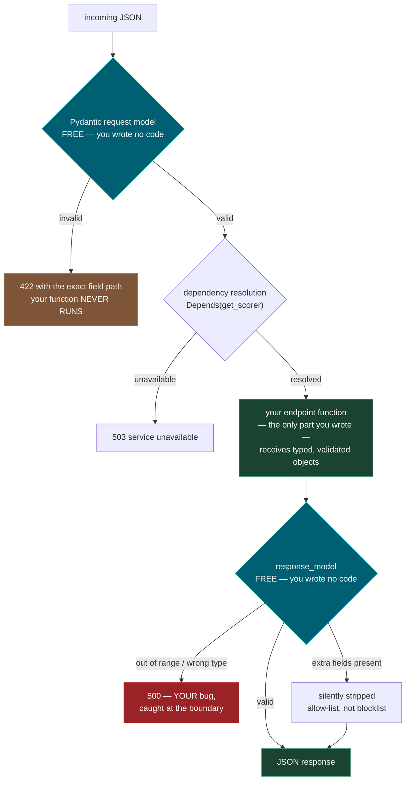
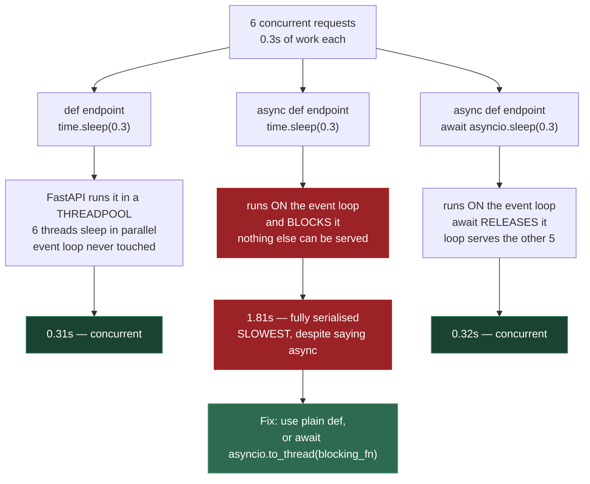
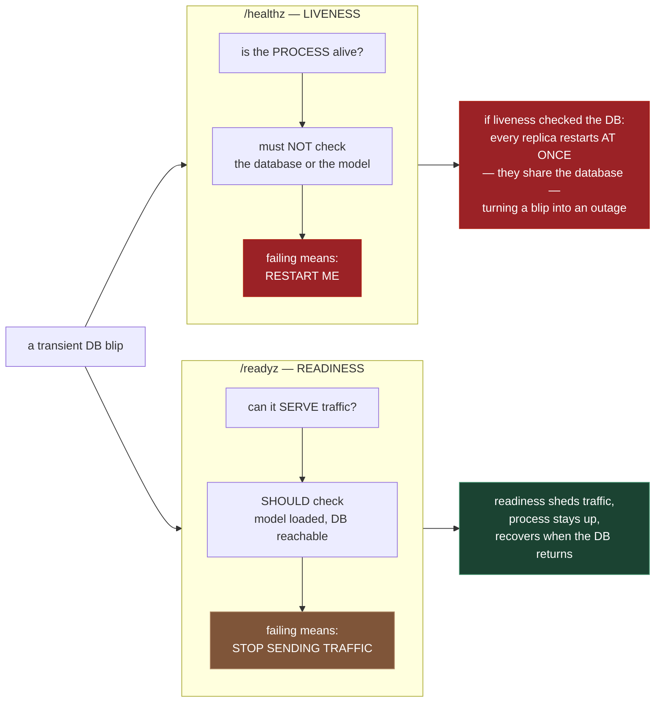
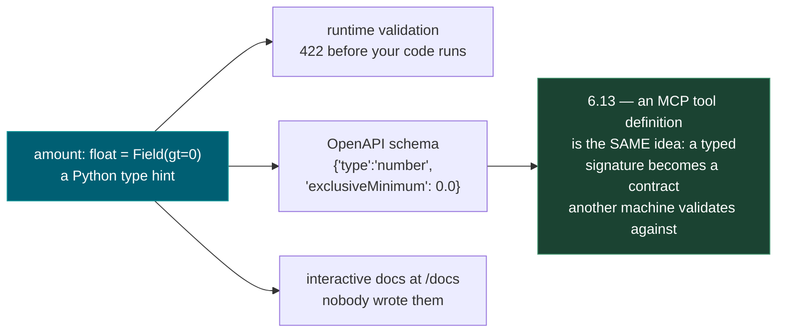

# 0.9 — Building APIs with FastAPI

**Phase 0 · CORE · CODE · 10 focused hours · Review in 7 days**

**Companion script:** [`09_building_apis_with_fastapi.py`](09_building_apis_with_fastapi.py) — needs `fastapi`, `uvicorn` and `httpx` (`pip install fastapi uvicorn httpx`). Runs the app in-process **and** on a local uvicorn server bound to `127.0.0.1` on a free port, then shuts it down. Fully offline.

---

## 1. Overview

FastAPI is the serving surface for everything built on this path: the classical ML model in capstone **C1**, the RAG service in **C3**, the agent in **C4**. Its Pydantic integration is literally the same validation machinery used for structured LLM output in **4.8**, which is why **0.3** is a prerequisite rather than a nicety.

Two properties make it the right choice here rather than Flask. It is **async-native**, so the concurrent tool calls from **0.3** work without a worker-per-request model — though Demo 5 shows that this cuts both ways and is the one thing on this page you must actually think about. And it **generates an OpenAPI schema from your type hints**, which matters more than usual because MCP tool definitions in **6.13** are the same idea: a machine-readable contract derived from typed signatures.

Depends on **0.3** and **0.7**; unlocks **6.13** MCP servers, **7.11** deployment, and every capstone.

---

## 2. Skip Test — Answered

> Gate **before** studying. Both correct from memory → skip. §7 withholds its answers deliberately.

**① What is the difference between a `def` and an `async def` endpoint, and when is `async def` the *wrong* choice?**

A plain `def` endpoint is run by FastAPI in a **threadpool**, so blocking code inside it cannot stall anything else. An `async def` endpoint runs **directly on the single event loop** — which is a large win when the body genuinely awaits, and a disaster when it does not.

`async def` is wrong whenever the body makes a **blocking** call: `time.sleep`, a synchronous database driver, a `requests` call, or CPU-heavy work. That call holds the only event loop, so every other request in the process waits — including ones touching nothing related. Demo 5 measures it with 6 concurrent clients: `def` + blocking finishes in **0.31s**, `async def` + blocking takes **1.81s**. Either use plain `def`, or push the blocking call to a thread with `asyncio.to_thread`.

**② What does `response_model` do that request validation does not?**

It validates and filters the way **out**. Two distinct benefits, both in Demo 2. It catches bugs in *your own* output — a handler returning `risk=1.7` against a `le=1` field produces a loud `500` instead of shipping nonsense to whoever stores and charts it. And it acts as an **allow-list**: a handler that carelessly returns `internal_api_key`, `raw_prompt` and `db_connection` alongside the real fields has all three stripped before the response leaves the process (**7.13**).

---

## 3. Visual Concept Diagrams

### 3.1 — The request lifecycle is a pipeline of gates

Two of these gates are free. That is why a FastAPI endpoint contains so little defensive code.



### 3.2 — The async trap, at the measured numbers

There is **one** event loop. What you put on it decides whether requests overlap or queue.



### 3.3 — Liveness and readiness ask different questions



### 3.4 — One typed signature, three artefacts



---

## 4. Core Technical Deep Dive

| Feature | What it prevents | Where it returns |
|---|---|---|
| `lifespan` startup | Reloading the model on every request | **7.7** p99 latency, **C1** |
| Pydantic request model | Hand-written validation and ad-hoc `400`s | **0.3**, **4.8** |
| `response_model` | Malformed output escaping; internal fields leaking | **C1** correctness, **7.13** |
| `Depends` | Untestable endpoints | **0.5**, **7.5** |
| `def` vs `async def` | One blocking call stalling every request | **7.7** — Demo 5 |
| `StreamingResponse` + `X-Accel-Buffering` | A stream arriving as one blob | **0.12**, **4.9**, **6.9** |
| Separate `healthz` / `readyz` | Restart loops; traffic to a warming pod | **7.11** |
| Auto OpenAPI schema | Hand-maintained, drifting API docs | **6.13** — same idea as MCP tool schemas |

**The validation gate is genuinely free.** Demo 1 sends five malformed payloads and counts how many times the endpoint body executed: **zero**. Each rejection names the exact field and reason — `amount: Input should be greater than 0`, `vendor: Field required`. No `if not payload.get(...)` anywhere. This is **0.7**'s `422` and **0.3**'s Pydantic wired together, and it is why FastAPI endpoints look so thin.

**`Depends` is a testing seam, not tidiness.** Because the model arrives as a resolved dependency rather than being read from a global inside the function, a test replaces it with one line:

```python
app.dependency_overrides[get_scorer] = lambda: {"name": "test-stub-v0"}
```

Demo 3 shows the same endpoint returning `test-stub-v0` and then `gbm-v3` with **no change to the endpoint**. That substitution is what makes an eval suite (**7.5**) runnable in CI with no GPU, no weights and no provider key. Reaching for a module-level global inside the handler forecloses it.

**Two gotchas the script hit, both worth knowing.**

`TestClient(app)` used as a context manager runs the lifespan — including **shutdown** on exit. If your `lifespan` teardown clears shared state, and something else is using that app, the teardown wipes it. The script uses `TestClient(app)` without `with` for exactly this reason, and says so in a comment. In an ordinary test file, `with TestClient(app) as c:` is the correct form.

`httpx.Client()` construction costs roughly **450 ms** — it loads the CA bundle — and it costs that on *every* construction, not just the first. Demo 6 originally timed the construction alongside the request and made streaming look 450 ms slower than it is. Build the client once and reuse it; this is **0.8** Demo 1 seen from the client side.

**Lifespan, not per-request.** Demo 7 confirms the startup hook ran exactly **once** across many requests. Loading a model inside an endpoint means every request pays the load cost, which is the most common cause of a terrible p99 (**7.7**).

**Streaming needs the header.** `X-Accel-Buffering: no` instructs NGINX (**0.12**) not to hold chunks. Without it, the application streams perfectly, the proxy collects the whole response, and the user still waits — a failure that appears only in production, which is the worst place to discover it.

---

## 5. Hands-On Script & Verified Output

Run: `python 09_building_apis_with_fastapi.py`. Output below is **actual, captured** on FastAPI 0.141.1 / uvicorn 0.45.0 / httpx 0.28.1 / Python 3.14.4. Timings vary; the ratios do not.

```text
fastapi 0.141.1 | uvicorn 0.45.0 | httpx 0.28.1
uvicorn on http://127.0.0.1:53306  (offline, 127.0.0.1 only)
======================================================================
DEMO 1 - bad input never reaches your function
======================================================================
  amount must be > 0         -> 422  amount: Input should be greater than 0
  vendor min_length=1        -> 422  vendor: String should have at least 1 char
  vendor missing entirely    -> 422  vendor: Field required
  wrong type                 -> 422  amount: Input should be a valid number
  days_late >= 0             -> 422  days_late: Input should be >= 0
  valid request              -> 200  {'risk': 0.984, 'band': 'HIGH',
                                      'model_version': 'gbm-v3'}

  endpoint body entered: 1 time(s), out of 6 requests.
======================================================================
DEMO 2 - response_model guards the way OUT, not just the way in
======================================================================
  handler RETURNED keys : ['risk', 'band', 'model_version',
                           'internal_api_key', 'raw_prompt', 'db_connection']
  client RECEIVED keys  : ['risk', 'band', 'model_version']
  secrets in response   : False

  and a genuine bug - the handler computes risk=1.7:
    status 500
======================================================================
DEMO 3 - Depends is a testing seam, not just tidiness
======================================================================
  with override    -> model_version='test-stub-v0'
  without override -> model_version='gbm-v3'
======================================================================
DEMO 4 - the schema is GENERATED from the type hints
======================================================================
  9 paths registered, no docs written by hand:
    POST  /score
    POST  /score-buggy
    POST  /score-leaky
    GET   /sync-blocking
    GET   /async-blocking

  ScoreRequest, as a machine-readable contract:
    vendor      {'type': 'string', 'minLength': 1}
    amount      {'type': 'number', 'exclusiveMinimum': 0.0}
    days_late   {'type': 'integer', 'minimum': 0.0, 'default': 0}
======================================================================
DEMO 5 - THE ASYNC TRAP: 6 concurrent clients, 0.3s work each
======================================================================
  endpoint          what it does                     wall clock  verdict
  ----------------- -------------------------------- ----------- ---------------
  /sync-blocking    def + time.sleep                    0.31s    threadpool
  /async-blocking   async def + time.sleep              1.81s    BLOCKS THE LOOP
  /async-correct    async def + await asyncio.sleep     0.32s    loop released

  Ideal concurrent time is ~0.3s: all 6 overlap.
  Serialised time is ~1.8s: they queue.
======================================================================
DEMO 6 - StreamingResponse, and the header that keeps it streaming
======================================================================
  Content-Type     : text/event-stream; charset=utf-8
  X-Accel-Buffering: no

  first token at     3 ms, complete at   631 ms
  reassembled: 'analysing invoice for Acme now '

  (aside: constructing that httpx.Client took 482 ms -
   MORE than the entire request. Client objects are expensive and
   meant to be reused; this is 0.8 Demo 1 from the other side.)
======================================================================
DEMO 7 - lifespan runs ONCE. Liveness and readiness differ.
======================================================================
  lifespan startups after several requests: 1
  /healthz -> 200  liveness: is the PROCESS alive?
  /readyz  -> 200  readiness: can it SERVE?

  now with the model unloaded (simulating a dependency blip):
  /healthz -> 200  still alive: do NOT restart me
  /readyz  -> 503  not ready: stop sending me traffic
======================================================================
server stopped
```

**Demo 1's last line is the whole argument.** Six requests, five of them malformed, and the endpoint body executed **once**. Not "handled the errors gracefully" — the function never ran. And every rejection names its field.

**Demo 2 shows the output gate doing two different jobs.** The handler returned six keys including `internal_api_key` and a `postgres://` connection string; the client received three, and `secrets in response` is `False`. Separately, a handler bug producing `risk=1.7` became a `500` at the boundary rather than a plausible-looking wrong number in someone's dashboard.

**Demo 4 is the link forward to MCP.** Nobody wrote `{'type': 'number', 'exclusiveMinimum': 0.0}` — it came from `amount: float = Field(gt=0)`. In **6.13** an MCP tool definition is the same trick: a typed Python signature becomes a contract another machine reads and validates against. Learning it here means **6.13** is a new transport, not a new idea.

**Demo 5 is the one to internalise.** The middle row *says* async and is **5.8x slower** than the row that does not. One blocking call in one `async def` serialised all six requests. Note the first row: plain `def` was as fast as correct async, because FastAPI puts it in a threadpool. So "make it async" is not a performance strategy — matching the keyword to what the body actually does is.

**Demo 6 needed its measurement fixed before it was true.** The first version timed `httpx.Client()` construction inside the stopwatch and reported first-token at 506 ms. Constructing the client is **482 ms** on its own — more than the entire request. Measured correctly, first token arrives at **3 ms** and the response completes at 631 ms.

**Demo 7 shows why two probes exist.** With the model unloaded, `/healthz` stays `200` and `/readyz` returns `503`. If liveness had checked the model, that blip would have restarted the process — and every replica simultaneously, since they share the same dependency. Readiness sheds traffic; liveness restarts. Different questions, very different blast radius.

**Modify and re-run:**
- Delete `response_model=ScoreResponse` from `/score-leaky` and re-run Demo 2. Watch the API key appear in the response body.
- In Demo 5, change `/async-blocking` to `await asyncio.to_thread(time.sleep, BLOCK)`. Predict the new timing before running.
- Raise `CLIENTS` to 40 and re-run Demo 5. The `def` row will stop scaling — find out why, and what `anyio` setting controls it.
- Add a field to `ScoreRequest` with `Field(pattern=...)` and re-run Demo 4. Watch the regex appear in the OpenAPI schema without touching any docs.
- In Demo 7, make `/healthz` check `ml_models` too, then unload the model. That is the configuration that turns a dependency blip into a restart loop.

---

## 6. Video

**"Python API Development — Comprehensive Course for Beginners"** — *freeCodeCamp.org*, taught by Sanjeev Thiyagarajan. ~19 hours; builds a full API including PostgreSQL setup, pytest, Dockerisation and deployment — which overlaps **0.14**, **0.15**, **0.5** and **7.11** as well. The course is confirmed to exist via freeCodeCamp's own announcement and the companion repo at [github.com/Sanjeev-Thiyagarajan/fastapi-course](https://github.com/Sanjeev-Thiyagarajan/fastapi-course); **exact YouTube URL [VERIFY]** — search the title on the freeCodeCamp.org channel rather than trusting a guessed link.

It is 19 hours end to end. With prior web-API experience in any language, jump straight to the sections on dependencies, testing and deployment rather than watching linearly. Nothing in that course covers the async trap in Demo 5 as directly as running Demo 5 does.

---

## 7. Retrieval Checkpoint — Unanswered

> Close this file. No notes. Answers deliberately withheld.

1. How does FastAPI generate its OpenAPI docs, and what is the direct parallel to how MCP tool schemas work in **6.13**?
2. What is `Depends` for beyond code tidiness — describe concretely what it enables in a test that is otherwise impossible.
3. Name the difference between a liveness and a readiness probe, and describe the specific bad outcome of having liveness check the database.
4. You have an endpoint that calls a synchronous database driver. Should it be `def` or `async def`, and what exactly goes wrong with the other choice?
5. Give the two distinct jobs `response_model` performs, and name a security failure the second one prevents.

---

## 8. Closed-Book Rebuild

With this file **and** the script closed, build a FastAPI app with:

- a `lifespan` that loads a fake model once and clears it on shutdown
- one POST endpoint with a validated request model **and** a `response_model`
- the model injected via `Depends`, plus one test that overrides it
- one endpoint that does blocking work, declared with the correct keyword
- one streaming endpoint with the headers that survive a proxy
- separate liveness and readiness endpoints where only one checks the model
- one test asserting `422` on invalid input **and** asserting the endpoint body never ran

---

## 9. Glossary

**`lifespan`** — an async context manager run once at startup and once at shutdown. Where models load and connection pools open and close.

**Request model** — a Pydantic model as a parameter type. FastAPI parses, validates and rejects with `422` before your function is called.

**`response_model`** — a Pydantic model declared on the route. Validates outgoing data and **filters it to an allow-list**, so extra fields cannot leak.

**`Depends`** — declares that a value comes from a callable FastAPI resolves per request. The substitution point that makes endpoints testable.

**`app.dependency_overrides`** — a dict mapping a dependency to a replacement. The whole reason `Depends` beats a module-level global.

**Event loop** — the single thread that runs all `async def` endpoint bodies. Blocking it blocks every concurrent request in the process.

**Threadpool** — where FastAPI runs plain `def` endpoints, so blocking code there is safe. Bounded, so it does not scale indefinitely.

**`asyncio.to_thread`** — moves a blocking call off the event loop from inside an `async def`. The fix when you cannot change the keyword.

**`StreamingResponse`** — returns an async generator's output incrementally as the body arrives, rather than buffering it.

**`X-Accel-Buffering: no`** — a header instructing NGINX not to buffer this response. Without it, streaming through a proxy silently becomes one blob.

**Liveness probe** — "is the process alive?" Failing it means restart. Must not depend on external services.

**Readiness probe** — "can it serve traffic?" Failing it means stop routing here. Should depend on external services.

**OpenAPI schema** — the JSON contract FastAPI generates from your type hints, serving `/docs` and machine clients. Conceptually identical to an MCP tool definition (**6.13**).

---

## Review again in

**7 days** — the mechanics are quick to absorb; two things are worth retaining. The **lifespan-versus-per-request** distinction and the **dependency-override** pattern, both of which return in **7.5** and **7.11**. And Demo 5's numbers — `0.31s / 1.81s / 0.32s` — because the trap is invisible in code review and only shows up under concurrency.
