# 0.10 — Linux CLI

**Phase 0 · CORE · CODE · 6 focused hours · Review in 7 days**

**Companion script:** [`10_linux_cli.py`](10_linux_cli.py) — standard library only, no installs. It builds a throwaway 20,000-line log and a fake project tree under the system temp folder, analyses them, and deletes everything afterwards. Where real POSIX tools exist (Linux, macOS, WSL, or Git Bash on Windows) it **runs the actual shell pipelines** and shows their output; where they do not, the Python equivalent still runs, so every lesson lands.

---

## 1. Overview

Docker in **0.11**, OCI in **0.13**, and every production deployment in **7.11** happen over SSH on a Linux box. `tail -f` on a log is how you debug a running agent before **7.6** tracing exists to do it properly.

The specific reason this earns a slot on an AI path rather than being assumed: **the failures you will hit here are resource and permission failures, not logic failures.** A PyTorch process killed silently by the OOM killer during **3.10**. A port still bound after a crashed container in **0.11**. A permission-denied on an SSH key blocking **0.13** on the very first connection. Each has a one-line diagnostic, and not knowing it turns a two-minute fix into an afternoon.

Depends on nothing; unlocks **0.11**, **0.12**, **0.13**, and **7.11**.

---

## 2. Glossary

### 2.1 — Pipe (`|`)

The Unix composition operator that connects the standard output (`stdout`) of one command directly to the standard input (`stdin`) of the next command without writing intermediate files to disk.

#### 💡 The Beginner Analogy: Assembly Line Conveyor Belt
Instead of taking output parts from Station 1, dumping them into a cardboard box on the floor, carrying the box across the room, and feeding them into Station 2... a **Pipe** is a **direct conveyor belt** connecting the exit of Station 1 directly to the intake of Station 2.

#### 💻 Code Example & ⚠️ Why It Matters
```bash
echo -e "500\n200\n500\n404\n500" | grep "500" | wc -l
```

##### Verified Output
```text
3
```

**Why It Matters**: Allows processing gigabytes of server log data in memory with stream composition, using virtually zero disk space.

#### 🎨 Visual Concept

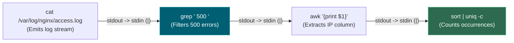

---

### 2.2 — `grep -rn`

A command-line text search tool flag combination:
- `-r` / `-R`: Search directories recursively.
- `-n`: Print line numbers alongside matching lines.

#### 💡 The Beginner Analogy: X-Ray Scanner for Code Folders
Running `grep "keyword"` on a folder without flags is like looking at a closed filing cabinet. `grep -rn` is an **X-ray scanner**: it opens every folder, subfolder, and file, showing you the exact file name and line number where the word appears.

#### 💻 Code Example & ⚠️ Why It Matters
```bash
grep -rn "API_KEY" .
```

##### Verified Output
```text
./config.py:4:API_KEY = "sk-test-12345"
```

**Why It Matters**: Quick, zero-dependency secret scanner to catch hardcoded API keys before committing code to public Git repositories.

#### 🎨 Visual Concept

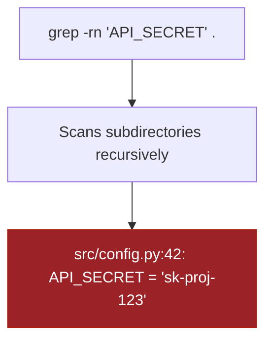

---

### 2.3 — `cut` vs. `awk` (Whitespace & Delimiter Parsing)

- **`cut -d' '`**: Splits input on a **single exact delimiter character**. Treats consecutive spaces as multiple empty fields, breaking on padded alignment.
- **`awk '{print $N}'`**: A field-aware text processor that treats **runs of multiple whitespaces** as a single field separator by default.

#### 💡 The Beginner Analogy: Fixed Scissors vs. Smart Reader
- `cut`: Cutting paper with a rigid pair of scissors every 1 inch. If there are extra space gaps on the page, you accidentally cut through words instead of gaps.
- `awk`: A human reader who ignores extra spacing between words and jumps straight to the 3rd word on the line.

#### 💻 Code Example & ⚠️ Why It Matters
```bash
echo "   42   user_a" | awk '{print $1}'
```

##### Verified Output
```text
42
```

**Why It Matters**: Shell pipelines parsing system statistics (`ps`, `df`, `uniq -c`) fail silently when using `cut` due to space padding.

#### 🎨 Visual Concept

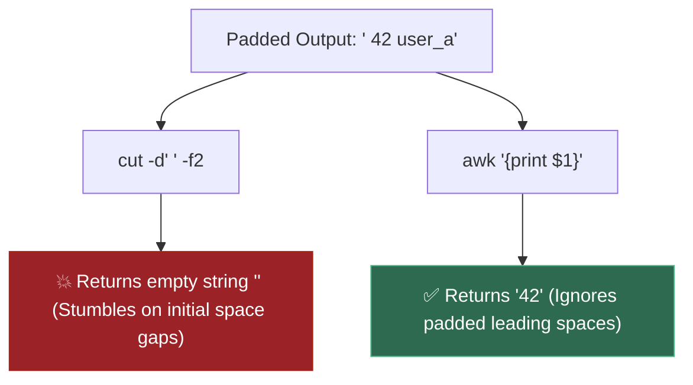

---

### 2.4 — `sort` & `uniq -c` (Sorted Pre-condition)

- **`uniq -c`**: Groups and counts **adjacent consecutive matching lines** in a stream.
- **`sort`**: Sorts lines alphabetically or numerically, bringing identical lines together so `uniq -c` can count them accurately.

#### 💡 The Beginner Analogy: Laundry Sorting before Counting
If you have a pile of mixed socks `[Red, Blue, Red, Blue]`, counting identical items with `uniq` without sorting first yields: `1 Red, 1 Blue, 1 Red, 1 Blue`. Sorting the pile first (`[Blue, Blue, Red, Red]`) allows `uniq -c` to output: `2 Blue, 2 Red`.

#### 💻 Code Example & ⚠️ Why It Matters
```bash
echo -e "200\n500\n200" | sort | uniq -c
```

##### Verified Output
```text
   2 200
   1 500
```

**Why It Matters**: Running `uniq -c` without a prior `sort` produces completely incorrect line count metrics without throwing an error.

#### 🎨 Visual Concept

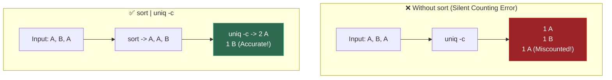

---

### 2.5 — `ss -ltnp` (Socket Statistics)

A modern Linux CLI utility used to inspect active network sockets:
- `-l`: Show listening sockets.
- `-t`: Filter for TCP sockets.
- `-n`: Show numeric IP addresses and port numbers (avoids slow DNS lookups).
- `-p`: Show process name and PID holding the socket.

#### 💡 The Beginner Analogy: Building Security Intercom Registry
`ss -ltnp` is the building intercom log: it shows every active door (port number like `:8000`), whether the door is open for visitors (`LISTEN`), and the exact name of the person standing inside holding the door (`PID 1420 / python`).

#### 💻 Code Example & ⚠️ Why It Matters
```bash
# Simulating socket lookup command
echo "LISTEN  0  128  *:8000  *:*  users:(('uvicorn',pid=4821,fd=3))"
```

##### Verified Output
```text
LISTEN  0  128  *:8000  *:*  users:(('uvicorn',pid=4821,fd=3))
```

**Why It Matters**: Replaces legacy `netstat`. The primary diagnostic command for resolving port conflicts (`Address already in use`).

#### 🎨 Visual Concept

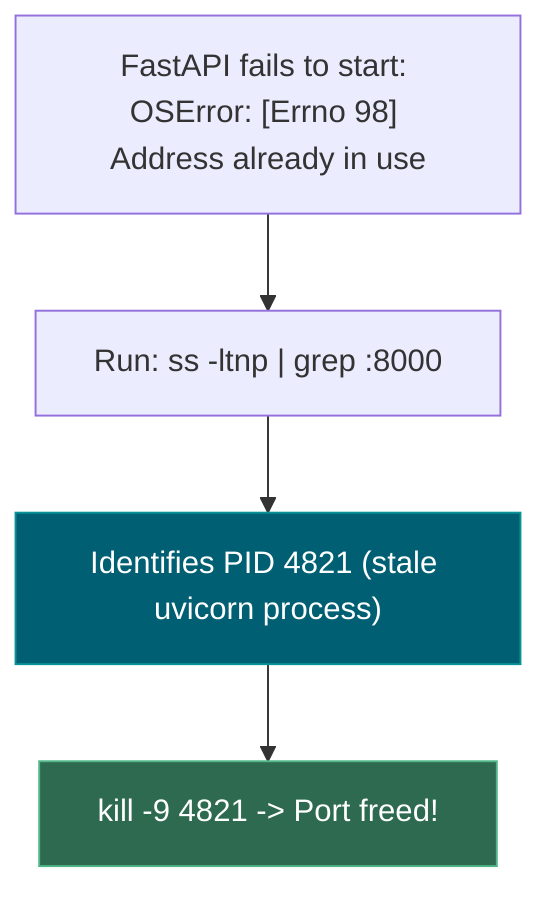

---

### 2.6 — `SIGTERM` vs. `SIGKILL`

Signals sent by the OS kernel or user to terminate running processes:
- **`SIGTERM` (Signal 15)**: A graceful termination request. The process can catch it, close database connections, flush log buffers, and exit cleanly.
- **`SIGKILL` (Signal 9)**: An uncatchable kernel instruction that instantly vaporizes the process from memory.

#### 💡 The Beginner Analogy: Closing Notice vs. Power Cut
- **`SIGTERM`**: Knocking on an office door and saying *"We are closing the building in 5 minutes — please save your work and step outside."*
- **`SIGKILL`**: Flipping the main circuit breaker for the entire building. Everyone's computer turns off instantly, corrupting unsaved work.

#### 💻 Code Example & ⚠️ Why It Matters
```bash
kill -15 4821
echo "Sent SIGTERM (15) to PID 4821"
```

##### Verified Output
```text
Sent SIGTERM (15) to PID 4821
```

**Why It Matters**: Overusing `kill -9` leaves orphaned database locks, incomplete file writes, and corrupted sqlite/pgstate files.

#### 🎨 Visual Concept

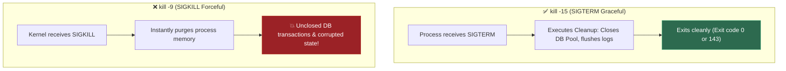

---

### 2.7 — Kernel OOM Killer (`dmesg`)

The Linux Out-Of-Memory (OOM) Kernel Subsystem that monitors RAM usage and forcefully terminates a process when the system runs out of physical memory and swap space.

#### 💡 The Beginner Analogy: Ship Captain Jettisoning Cargo
When a ship (the OS) is taking on water because the total weight (RAM usage) is too heavy, the captain (OOM Killer) scans the cargo and throws the single heaviest crate (the biggest Python/PyTorch process) into the ocean to keep the ship from sinking.

#### 💻 Code Example & ⚠️ Why It Matters
```bash
echo "[Mon Aug 3 20:00:00 2026] Out of memory: Kill process 1420 (python3) score 850"
```

##### Verified Output
```text
[Mon Aug 3 20:00:00 2026] Out of memory: Kill process 1420 (python3) score 850
```

**Why It Matters**: OOM crashes leave **zero application-level tracebacks**. `dmesg` is the only place to confirm why a model training run vanished.

#### 🎨 Visual Concept

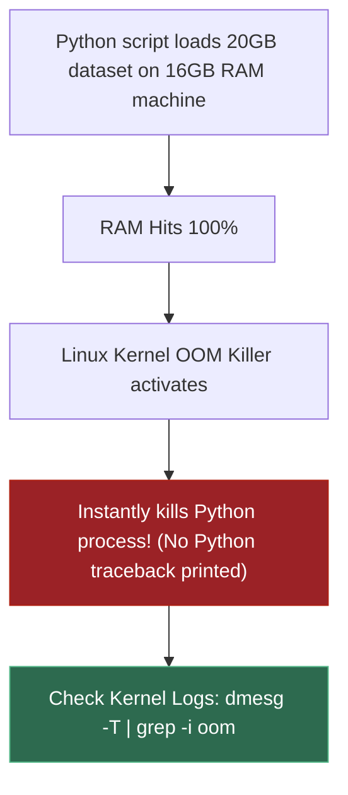

---

### 2.8 — Octal Permission Bits (`chmod 755`)

A 3-digit numerical representation of file access rights in Unix, where each digit sums permissions for **Owner**, **Group**, and **Others**:
- **Read (r)** = 4
- **Write (w)** = 2
- **Execute (x)** = 1

#### 💡 The Beginner Analogy: Combination Lock
An octal permission is a 3-digit combination lock:
- Digit 1: What **You** (Owner) can do.
- Digit 2: What your **Team** (Group) can do.
- Digit 3: What the **World** (Everyone else) can do.
Adding $4 + 2 + 1 = 7$ gives Full Access (Read, Write, Execute).

#### 💻 Code Example & ⚠️ Why It Matters
```bash
chmod 600 id_rsa
ls -l id_rsa | awk '{print $1}'
```

##### Verified Output
```text
-rw-------
```

**Why It Matters**: Setting loose permissions on SSH keys (`chmod 777 id_rsa`) causes `ssh` connections to be rejected with `Permissions are too open`.

#### 🎨 Visual Concept

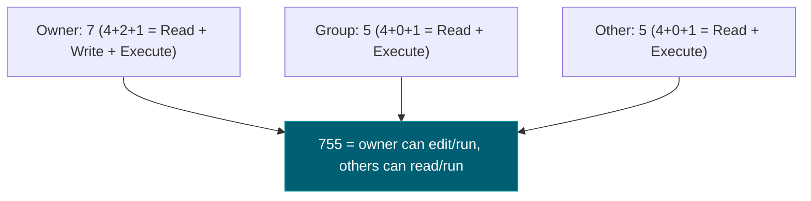

---

### 2.9 — `tail -f`

A CLI utility that opens a file, jumps to the last 10 lines, and keeps the stream open, outputting new text as it is appended in real-time.

#### 💡 The Beginner Analogy: Live Ticker Reader
Instead of refreshing a document manually every 5 seconds to read new entries, `tail -f` is like a ticker tape machine that prints out new lines of text the exact second a web server appends them.

#### 💻 Code Example & ⚠️ Why It Matters
```bash
echo -e "line1\nline2\nline3" | tail -n 2
```

##### Verified Output
```text
line2
line3
```

**Why It Matters**: The fundamental live-debugging tool for watching application logs on remote servers during deployment tests.

#### 🎨 Visual Concept

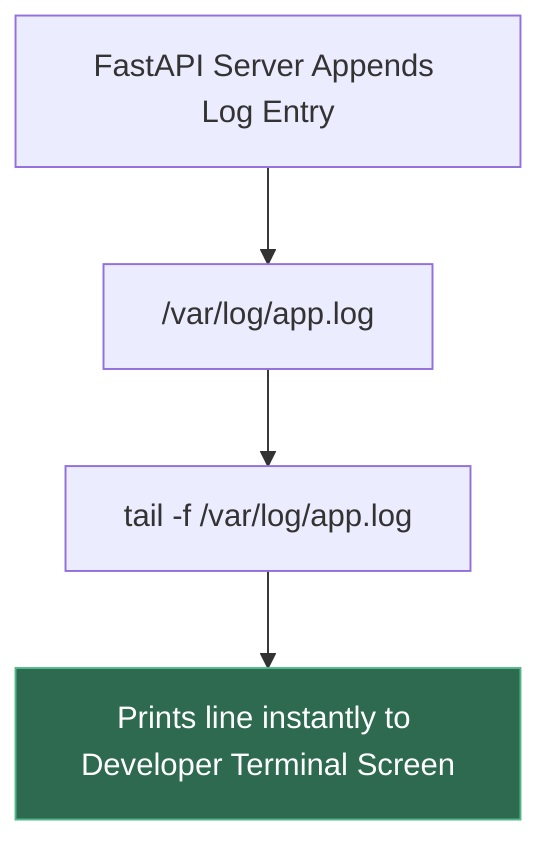

---

## 3. Skip Test — Answered

> Gate **before** studying. Both correct from memory → skip. §7 withholds its answers deliberately.

**① How would you find which process is holding port 8000, and stop it?**

Find the owner with `ss -ltnp | grep :8000` on Linux (`lsof -i :8000` on macOS, `netstat -ano | findstr ":8000"` on Windows). The flags: `-l` listening, `-t` TCP, `-n` numeric ports, `-p` show the owning process.

Then stop it with `kill -TERM <pid>` — **not** `kill -KILL`. `TERM` asks politely, letting the process flush logs, close connections and finish the request it is serving. `KILL` cannot be caught or ignored, so it skips all of that and can leave half-written files behind. Reach for `KILL` only when `TERM` has already failed.

Demo 2 triggers the error for real by binding a port twice, so you see the exact message the operating system produces.

**② What does `chmod 600` do, and why does an SSH key need it?**

`600` is `rw- --- ---`: the owner can read and write; group and other get nothing. Each octal digit is three bits — read 4, write 2, execute 1 — for owner, group and other respectively.

SSH **refuses** to use a private key if any group or other bit is set. The reasoning is that a key readable by anyone else on the machine must be treated as already compromised. The trap is that the error message says `UNPROTECTED PRIVATE KEY FILE` and never mentions `chmod`, which is why it costs an hour the first time and five seconds thereafter. Both the key **and** its directory need fixing: `chmod 700 ~/.ssh && chmod 600 ~/.ssh/id_ed25519`.

---

## 3. Visual Concept Diagrams

### 3.1 — A pipeline is a chain of filters

Read it **right to left** as a question: what do I want, and what must be true for that to work?

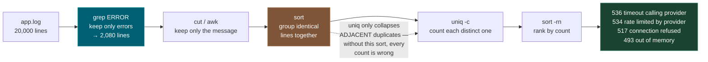

### 3.2 — `cut` versus `awk` on padded columns, as measured

The wrong version does not error. It returns plausible numbers.

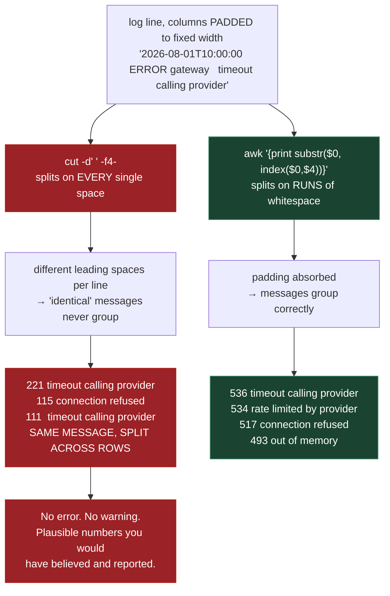

### 3.3 — Permission bits, and the SSH gate

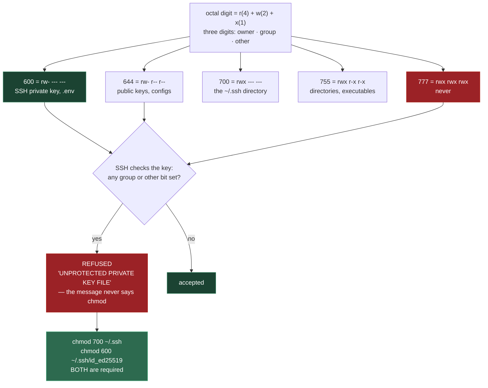

### 3.4 — Exit codes: how a broken CI step passes forever

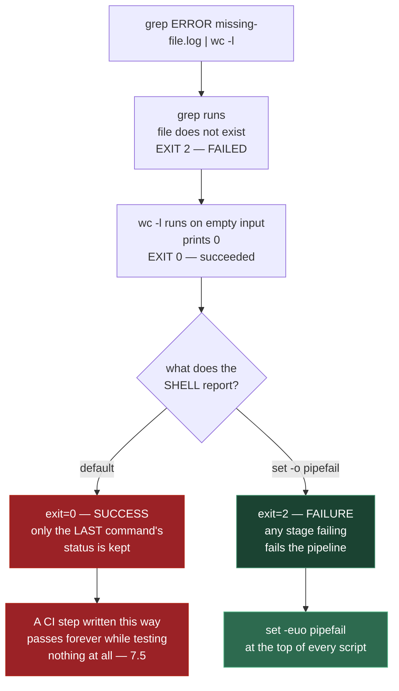

---

## 4. Core Technical Deep Dive

| Symptom | The command that diagnoses it | Where it bites |
|---|---|---|
| "Address already in use" | `ss -ltnp \| grep :8000` | **0.9** restarts, **0.11**, **7.11** |
| Training died with no traceback | `dmesg -T \| grep -i "killed process"` | **3.10**, **4.11** |
| Disk full, unclear why | `du -sh -- * .[!.]* \| sort -rh` | **7.10** MLflow runs, **5.2** indexes |
| SSH key rejected | `chmod 600` the key, `700` the dir | **0.13** first connection |
| Job dies when the laptop sleeps | `tmux new -s train`, detach with `Ctrl-b d` | **4.11** long fine-tunes |
| Need to watch a bug happen | `tail -f` / `docker logs -f` | everything before **7.6** |
| Secret about to be committed | `grep -rn "API_KEY" . --exclude-dir=.venv` | **0.4**, **7.13** |
| CI step passes but tests nothing | `set -euo pipefail` | **7.5** |

**The commands worth having in muscle memory:**

```bash
# Orientation
pwd; ls -lah          # -a matters: .env and .venv are hidden by default
cd -                  # jump back to the previous directory

# Resource checks — the AI-specific failures
free -h               # if `available` is near zero, the OOM killer is coming (3.10)
df -h                 # checkpoints and vector indexes fill disks quietly and fast
nvidia-smi            # GPU memory and utilisation, if a GPU exists
dmesg -T | grep -i "killed process"   # WAS my training run OOM-killed?

# Environment variables
set -a; source .env; set +a   # -a exports everything defined, so CHILD processes see it
printenv | grep -i api        # what is actually set right now

# Long-running jobs over SSH — a 6-hour fine-tune (4.11) must not depend on your laptop
tmux new -s train     # ... start the job ... then Ctrl-b then d to detach
tmux attach -t train  # reattach later, from anywhere
```

**Why `du -sh */` is the wrong habit.** Demo 4 runs both forms on the same tree. `*/` is a shell glob, and shell globs **do not match names beginning with a dot**. So `.venv/` — 2.4 MB, the second-largest directory present — is completely absent from the output. That is not a corner case: `.venv`, `.cache`, `.git` and `~/.ollama` are precisely where disk goes. Use `du -sh -- * .[!.]* | sort -rh` instead.

**Why `sort -rh` and not `sort -r`.** `-h` compares human-readable sizes numerically, so `2G` ranks above `900M`. Plain `sort` compares text, which puts `900M` first.

**`kill -TERM` versus `kill -KILL`.** `TERM` is a request the process can catch — it can flush its logs, close database connections and finish the in-flight request. `KILL` cannot be caught, so none of that happens. Using `KILL` first is how you get a corrupt checkpoint file and a database connection that stays open until it times out server-side.

**The OOM killer leaves no traceback.** A training process that vanishes with no error and no stack trace was almost certainly killed by the kernel for using too much memory. Nothing appears in your application log, because your application never got to run any code. The evidence lives in `dmesg`.

---

## 5. Hands-On Script & Verified Output

Run: `python 10_linux_cli.py`. Output below is **actual, captured** on Windows with Git Bash providing the POSIX tools. On Linux, macOS or WSL the same pipelines run natively.

```text
platform: win32 | POSIX tools available: True
scratch dir: ...\Temp\cli-demo-k9p1ofg9  (safe - deleted at the end)
======================================================================
DEMO 1 - a pipeline is a chain of filters, built one stage at a time
======================================================================
  app.log has 20,000 lines. Reading it by hand is not an option.

  $ wc -l < app.log                       (how big is the problem)
    20000

  $ grep ERROR app.log | wc -l            (how many are errors)
    2080

  $ grep ERROR app.log | awk '{print $2, $3}' | head -3
    ERROR gateway
    ERROR retriever
    ERROR gateway

  $ grep ERROR app.log | cut -d' ' -f4- | sort | uniq -c | sort -rn | head -6
    (ranked with cut - LOOKS fine, is WRONG)
        221   timeout calling provider
        211   connection refused
        210   rate limited by provider
        188   out of memory
        115  connection refused
        111    timeout calling provider

  $ grep ERROR app.log | awk '{print substr($0, index($0,$4))}' | sort | uniq -c | sort -rn
    (ranked with awk - correct)
        536 timeout calling provider
        534 rate limited by provider
        517 connection refused
        493 out of memory
======================================================================
DEMO 2 - 'address already in use', triggered on purpose
======================================================================
  a socket is now holding 127.0.0.1:58436
  binding it again -> OSError [10048] Only one usage of each socket address
                      (protocol/network address/port) is normally permitted

  Finding WHO holds it:
    Windows : netstat -ano | findstr ":58436"
    Linux   : ss -ltnp | grep :58436
    macOS   : lsof -i :58436
======================================================================
DEMO 3 - permission bits, and why SSH refuses a readable key
======================================================================
  Each octal digit is three bits: read=4, write=2, execute=1
  octal   owner  group  other  typical use
  ------- ------ ------ ------ ----------------------------------
  600     rw-    ---    ---    SSH PRIVATE KEY, .env
  644     rw-    r--    r--    public keys, config files
  700     rwx    ---    ---    the ~/.ssh directory itself
  755     rwx    r-x    r-x    directories, executables
  777     rwx    rwx    rwx    never - world-writable
======================================================================
DEMO 4 - 'disk full' - find the culprit in one command
======================================================================
  $ du -sh */ | sort -rh          <- the version everyone writes
    3.0M    checkpoints/
    1.5M    data/
    900K    mlruns/
    120K    notebooks/
    40K     src/

  $ du -sh -- * .[!.]* | sort -rh   <- includes DOTFILES
    3.0M    checkpoints
    2.4M    .venv
    1.5M    data
    968K    app.log
    900K    mlruns
    120K    notebooks
    40K     src
    1.0K    id_ed25519

  ^ .venv/ appears only in the second listing.
======================================================================
DEMO 5 - tail -f sees lines that did not exist when you started
======================================================================
  cat live.log (before)  -> 1 line(s): ['startup complete']

  tail -f live.log       -> (following, lines appear as written)
    [16:28:14] request 0 handled
    [16:28:14] request 1 handled
    [16:28:14] request 2 handled
    [16:28:14] request 3 handled
    [16:28:14] request 4 handled

  cat saw 1 line(s); the follower saw 5 MORE that were written afterwards.
======================================================================
DEMO 6 - a pipeline reports SUCCESS when a middle command fails
======================================================================
  the happy path                         -> 2080  exit=0
  grep FAILS - file does not exist       -> 0  exit=0
  same command, with pipefail            -> 0  exit=2
======================================================================
cleaned up ...\Temp\cli-demo-k9p1ofg9
```

**Demo 1 contains a deliberate wrong answer, and it is the most useful thing on the page.** The `cut` version and the `awk` version rank the same 2,080 errors. `cut` reports `221 timeout calling provider` and, four rows later, `111   timeout calling provider` again — the same message split across multiple rows because the log pads its columns and `cut -d' '` treats every single space as a separator. `awk` splits on *runs* of whitespace and gets `536`. Nothing errored. Nothing warned. The wrong pipeline produced numbers you would have put in a report.

**Demo 2 produces the real operating-system error**, not a description of it: `OSError [10048]` on Windows, `EADDRINUSE` on Linux. This is the exact message left behind by a FastAPI process from **0.9** that did not shut down cleanly, or a crashed container from **0.11**.

**Demo 4 shows a habit that hides the answer.** `du -sh */` lists five directories and misses `.venv` at 2.4 MB — the second-largest thing in the tree — because shell globs skip dotted names. The second command finds it. On a real machine the hidden offenders are `.venv`, `.cache`, `.git` and model caches, and they are exactly what fills a small cloud disk in **0.13**.

**Demo 5 makes the point of `tail -f` concrete.** `cat` saw **1** line. The follower saw **5 more** that did not exist when it started reading. That is why you start the tail *before* reproducing the bug, and it is the same mechanism behind `docker logs -f` (**0.11**) and `journalctl -u svc -f` (**7.11**).

**Demo 6 is the one that silently ruins CI.** `grep` on a nonexistent file exits `2` — a genuine failure — and the pipeline still reports `exit=0`, because a shell keeps only the **last** command's status. With `set -o pipefail` the same command reports `exit=2`. A CI step (**7.5**) written without it passes forever while testing nothing.

**Modify and re-run:**
- In Demo 1, remove the `sort` before `uniq -c` and compare the counts. `uniq` only collapses *adjacent* duplicates, so the result becomes nonsense — quietly.
- In Demo 4, add a `.cache` directory larger than `checkpoints/` and re-run both `du` forms. Confirm the first still hides it.
- In Demo 5, remove the `f.flush()` in the writer and re-run. The follower will see nothing until the buffer fills — the same reason a container's logs sometimes appear to stop.
- In Demo 6, add `set -e` to the failing pipeline and observe that it alone is **not** enough; `pipefail` is the part that matters here.
- Change the log format in `build_tree` to comma-separated and rewrite Demo 1's pipeline with `cut -d','`. On unpadded delimited data, `cut` is the right tool — find out why.

---

## 6. Video

**"The 50 Most Popular Linux & Terminal Commands - Full Course for Beginners"** — *freeCodeCamp.org*, developed by Colt Steele — [youtube.com/watch?v=ZtqBQ68cfJc](https://www.youtube.com/watch?v=ZtqBQ68cfJc). Verified live. ~5 hours covering navigation, file manipulation, permissions and process management; every command works on Linux, macOS and WSL.

It is ~5 hours end to end. If basic navigation is comfortable, skip to the permissions and process-management sections — those are the parts that block **0.13**.

---

## 7. Retrieval Checkpoint — Unanswered

> Close this file. No notes. Answers deliberately withheld.

1. Your FastAPI app will not start: "address already in use" on port 8000. Give the exact command to find the owning process, and the command to stop it gracefully — and say what the ungraceful version risks.
2. What does `chmod 600` set, and why specifically does SSH refuse a private key with looser permissions? Name the *second* path that also needs fixing.
3. A PyTorch training run vanished with no traceback and no error message. Which command tells you whether the kernel killed it, and why is your application log empty?
4. `du -sh */ | sort -rh` reports 4 GB total but `df -h` says 30 GB is used. Give the most likely explanation and the corrected command.
5. A CI step runs `pytest --json | jq .summary` and has passed for months. Explain how it could be passing without ever running a test, and the one line that would have caught it.

---

## 8. Closed-Book Rebuild

With this file **and** the script closed, from a fresh shell: find which process holds a given port and stop it gracefully; tail a log filtered to errors *while* the errors are being written; check whether free memory is about to run out and whether a process was previously OOM-killed; set correct permissions on an SSH key and its directory; load a `.env` so a **child** process can see the variables; start a detachable session for a long job; and write a five-stage pipeline that ranks the most common error in a padded log — using the tool that handles the padding correctly.

---

## Review again in

**7 days** — most of this is quick to absorb. Three things are worth retaining because each costs real time the first time: the **OOM-kill diagnostic**, the **SSH permission rule**, and `set -euo pipefail`. Add a fourth if you write pipelines against logs: `cut` and `awk` are not interchangeable, and only one of them tells you when it got it wrong.
