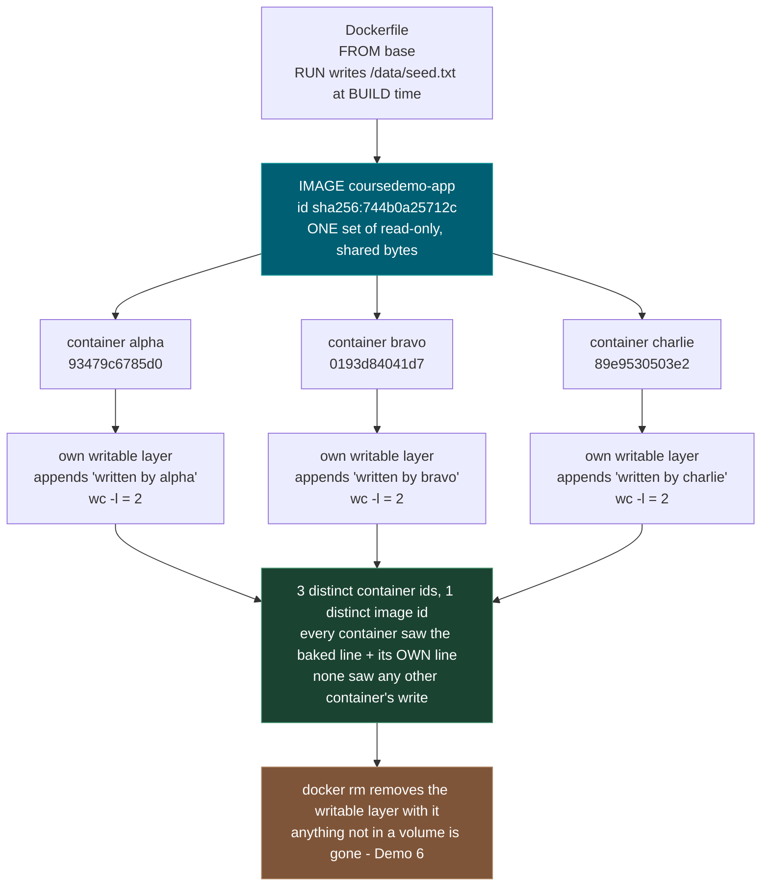
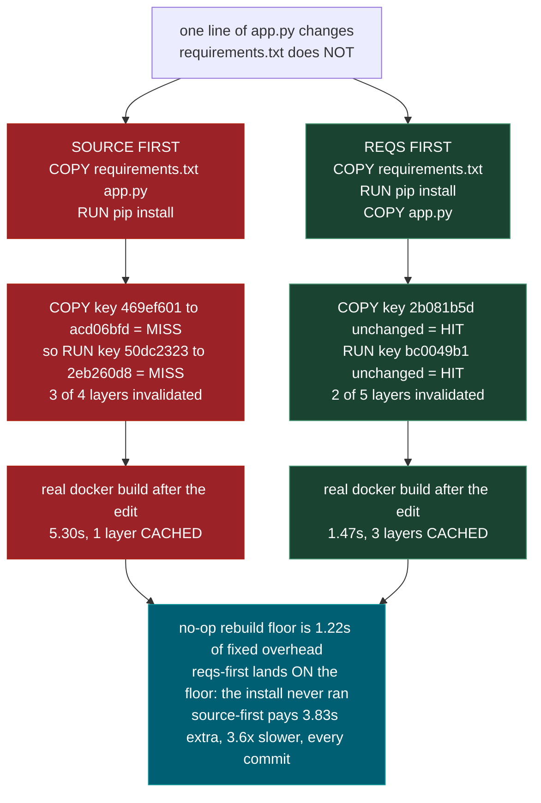
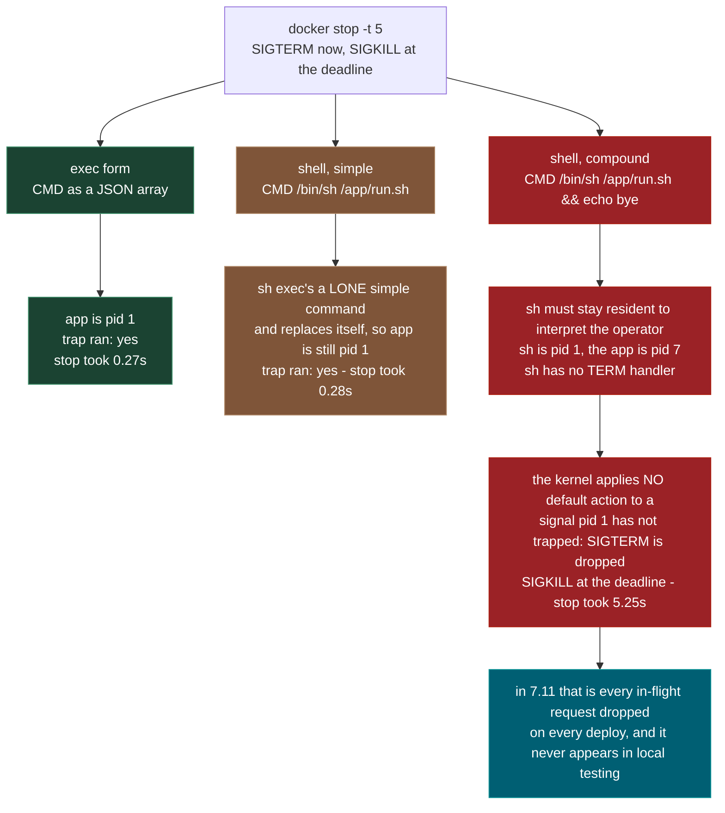
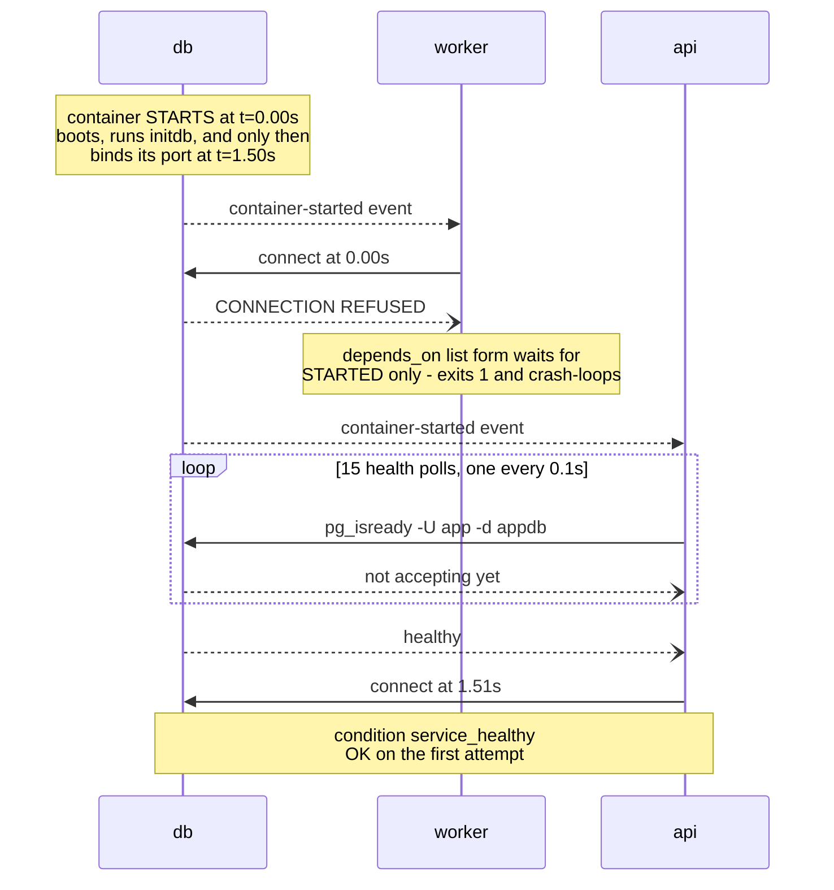

# 0.11 — Docker and Docker Compose

**Phase 0 · CORE · CODE · 10 focused hours · Review in 7 days**

**Companion script:** [`11_docker_and_compose.py`](11_docker_and_compose.py) — needs `PyYAML` for Demo 7 (`pip install pyyaml`); Docker itself is optional. It builds **real throwaway images** from a base image that is **already on the machine**, tags everything `coursedemo-*-<run nonce>`, runs every build and container with `--network=none`, publishes no port, and removes every image, container and volume it created in a `finally` block. It never pulls, never touches a resource it did not create, and refuses any image whose name contains `supabase`.

---

## 1. Overview

Reproducibility is the whole point, and it matters more here than in ordinary web work: **3.10** pins a PyTorch build against a specific CUDA version, **Phase 2** wants a particular scikit-learn, **Phase 6** wants specific LangGraph versions. The **0.2** virtual environment isolates Python packages; the container isolates everything below them — the interpreter, the system libraries, the CUDA runtime, the OS.

The second reason it earns ten hours rather than two: the local stack for the rest of the course — Postgres with pgvector for **5.2** vectors and **6.5** checkpoints, Redis for **7.7** caching — is one `docker compose up` instead of four manual installs, and every capstone in **Phase 8** ships as an image. The failures in this topic are not syntax failures. They are a build that takes four minutes instead of one on every commit, a deploy that drops in-flight requests, and a database that vanishes because of one flag.

**What is real and what is modelled.** Demos 1 and 3–6 run actual `docker build`, `docker run` and `docker stop` against a base image found already local — on the machine that produced the output below that was `fnproject/python:3.11`, which is simply what happened to be present. **If no usable local base image exists, those demos print `SKIPPED` rather than pulling one**, so the output varies by machine. Three things are deliberately modelled: the expensive install layer is `RUN sleep 3` standing in for `pip install -r requirements.txt`, because the sandbox has no network; Demo 2 computes BuildKit's cache-key chain in ~10 lines of Python rather than reading BuildKit's real digests; and Demo 7 parses a real Compose file but times the Postgres race with a thread that flips a flag after 1.5 s — no Postgres container runs. §4 gives the real syntax for all three so the model never has to be un-learned.

Depends on **0.10**; unlocks **0.13** OCI deployment, **0.15** the data stack, and **7.11** production serving.

---

## 2. Skip Test — Answered

> Gate **before** studying. Both correct from memory → skip. §7 withholds its answers deliberately.

**① Explain the difference between an image and a container.**

An **image** is a read-only, content-addressed stack of filesystem layers plus metadata (entrypoint, command, environment, exposed ports). A **container** is one running instance of that image with a thin **writable layer** stacked on top, plus its own process namespace, network namespace and lifecycle. Image is the class; container is the instance — except the sharing is literal, not conceptual: the layer bytes on disk are shared, not copied.

Demo 1 counts it rather than asserting it. One image, `sha256:744b0a25712c`, three containers — `93479c6785d0`, `0193d84041d7`, `89e9530503e2`. Each appends its own line to `/data/seed.txt`, a file that was baked in at build time, and each then reports `2` lines: the baked line plus its own. Not 3, not 4. No container saw any other container's write, because each write landed in that container's private writable layer.

The second half of the answer is Demo 6: remove the container and the writable layer goes with it. Container 1 wrote to a plain path *and* to a named volume; after `docker rm -f`, container 2 reads `volume : row 1 - the vector index` and `layer : GONE`.

**② State why you copy `requirements.txt` and install before copying source code in a Dockerfile.**

Because a layer's cache key is a **hash chain**: `key(i) = H(key(i-1) || instruction || content of any files it copies)`. Changing a file changes the key of the `COPY` that brought it in, and therefore every key below it. An install step whose parent key is unchanged is never re-executed, however expensive it is.

Demo 2 computes both orderings against the same one-line edit to `app.py` while `requirements.txt` stays byte-identical. Source-first invalidates **3 of 4** layers, including `RUN pip install` (`50dc2323 -> 2eb260d8`). Requirements-first invalidates **2 of 5**, and the install key `bc0049b1` is unchanged — a HIT.

Demo 3 puts a stopwatch on real `docker build`. After the same one-line source edit: source-first **5.30s** with 1 layer CACHED, requirements-first **1.47s** with 3 layers CACHED, against a no-op rebuild floor of **1.22s**. The requirements-first rebuild lands on that floor, meaning the install layer genuinely did not run. That is **3.6x** slower and **3.83s** of avoidable work — on a 3-second install. A real torch wheel takes minutes, and the gap scales with it.

---

## 3. Visual Concept Diagrams

### 3.1 — One image, three containers, as counted



### 3.2 — The cache key is a hash chain, and the numbers it produced

Same edit both sides: one line of `app.py`, `v1` to `v2`. `requirements.txt` byte-identical.



### 3.3 — CMD form decides whether `docker stop` is graceful



### 3.4 — `depends_on` waits for STARTED, not for READY



---

## 4. Core Technical Deep Dive

| Practice | The failure it prevents | Measured here | Where it bites |
|---|---|---|---|
| `COPY requirements.txt` first | Full reinstall on every code edit | Demo 3: **1.47s** vs **5.30s** rebuild | every commit, every CI build for **0.13** |
| `.dockerignore` | Shipping the whole tree to the daemon; baking `.git`/`.env` into the image | Demo 4: **13.91MB → 176B** | build time everywhere, credential leak **7.13** |
| Exec-form `CMD` | `SIGTERM` dropped, `SIGKILL` at the deadline | Demo 5: **0.27s** vs **5.25s** | **7.11** rolling restarts |
| Named volume | Losing the database on teardown | Demo 6: volume kept, layer `GONE` | **5.2** pgvector index, **6.5** checkpoints |
| `condition: service_healthy` | API crash-looping before Postgres accepts TCP | Demo 7: **0.00s** refused vs **1.51s** OK | local stack for **0.15** |
| Multi-stage build | Compilers and apt caches shipped to production | not measured here | deploy bandwidth, **0.13**, **7.11** |
| Pinned base tag | A moving base breaking yesterday's build | not measured here | reproducibility, **3.10** CUDA pins |
| Non-root `USER` | A container escape landing as root on the host | not measured here | **7.13** |
| Bind `0.0.0.0`, not `127.0.0.1` | "Starts fine, nothing can connect" | not measured here | first deploy, every time |

**The real Dockerfile — multi-stage and cache-aware.** This is the syntax; the script's `RUN sleep 3` is only a stand-in for line 2 of the install stage.

```dockerfile
# ============ STAGE 1: build ============================================
# Pin the exact minor version. "python:3.12" silently moves under you and
# breaks a build that worked yesterday — the opposite of reproducibility.
FROM python:3.12-slim AS builder

WORKDIR /app

# Build-only deps (compilers for packages with C extensions). Needed to
# INSTALL numpy/psycopg but not to RUN them — which is the entire reason
# this is a separate stage.
RUN apt-get update && apt-get install -y --no-install-recommends \
        build-essential gcc \
    && rm -rf /var/lib/apt/lists/*

# *** THE LAYER-CACHE RULE ***
# Copy ONLY the dependency manifest, install, and copy source AFTER.
# requirements.txt changes rarely; source changes on every commit. Swap
# these two and every one-character edit re-runs the install below.
COPY requirements.txt .
RUN pip install --no-cache-dir --prefix=/install -r requirements.txt

# ============ STAGE 2: runtime ==========================================
FROM python:3.12-slim

# Copy ONLY the installed packages. Compilers, apt caches and build
# artifacts from stage 1 never enter the final image. On an ML image that
# is routinely ~6 GB versus ~1.5 GB — bandwidth and cost on every deploy.
COPY --from=builder /install /usr/local

WORKDIR /app

# Run as a non-root user. A container escape as root is a host compromise;
# as an unprivileged user it is far less useful to an attacker (7.13).
RUN useradd --create-home --uid 1000 appuser
COPY --chown=appuser:appuser . .
USER appuser

# Documents the port. Does NOT publish it — that is `-p` at run time.
EXPOSE 8000

# Exec form (JSON array). Demo 5 measures exactly what this buys.
CMD ["uvicorn", "main:app", "--host", "0.0.0.0", "--port", "8000"]
#                                    ^^^^^^^ NOT 127.0.0.1. Binding to
# localhost INSIDE a container makes it unreachable from outside it — the
# single most common "my container starts but I cannot connect" cause.
```

```
# ---- .dockerignore — one file, measured at 13.91MB → 176B in Demo 4 ----
.git
.venv
__pycache__
node_modules
data
*.log
.env
```

**A layer is a filesystem diff, and the cache key is a chain.** Each instruction produces a layer; the layers stack copy-on-write. BuildKit derives a key per layer from the parent key, the instruction text, and — for `COPY`/`ADD` — a content hash of the files brought in. Demo 2 reproduces that in ten lines, and Demo 3 confirms the model against real builds. Two consequences fall straight out of the definition: changing a file invalidates every layer **below** the `COPY` that brought it in, and a `RUN` whose parent key is unchanged is never re-executed no matter how expensive it is. The whole ordering rule is a corollary of one hash function.

**The build context is shipped before the first instruction runs.** `docker build .` tars the directory and sends it to the daemon on **every** build, cached layers or not. Demo 4 measures 13.91MB going across for a project whose actual source is two files. Worse than the seconds: without a `.dockerignore`, `COPY . .` bakes `.git` and `.env` into a published image, and image layers are readable by anyone who can pull the tag (**7.13**). `.dockerignore` prunes ignored directories rather than filtering their contents, which is why the daemon never even hears about `.venv`.

**PID 1 is not an ordinary process.** For a normal process the kernel applies a default action to an unhandled signal — SIGTERM terminates it. For PID 1 there is **no** default action: a signal PID 1 has not explicitly trapped is discarded. So a container's main process must both install a handler and actually *be* PID 1. `docker stop` sends SIGTERM, waits (10 s by default; the script uses 5 s to stay short), then SIGKILLs.

The usual write-up — "shell form wraps you in `/bin/sh`, which swallows SIGTERM" — is **not what Demo 5 measured**. `CMD /bin/sh /app/run.sh` is a lone simple command, so `sh` `exec`s it and replaces itself; the app is still PID 1 and stops in **0.28s**. Add any shell syntax — `&&`, a pipe, a variable expansion — and `sh` must stay resident to interpret it. Then `sh` is PID 1, `sh` has no TERM trap, the signal is dropped, and the container is SIGKILLed at the deadline: **5.25s**, with the app at pid **7**. Exec form is the rule because it is the form that cannot accidentally acquire shell semantics — not because shell form is always fatal.

**Volumes versus the writable layer.** The writable layer is part of the container and dies with it. A **named volume** is managed by the daemon, lives outside any container, and is mounted in. A **bind mount** maps a host path in — perfect for live code reload in development, wrong in production because it overwrites what the image contains. Demo 6 removes the container entirely (which is what a redeploy does) and shows the volume file intact and the layer file `GONE`.

**`depends_on` and the two spellings.** The list form is the one that bites:

```yaml
    depends_on:
      - db                    # waits for STARTED only. Nothing more.
```

```yaml
    depends_on:
      db:
        condition: service_healthy   # waits for the healthcheck to pass
```

A healthcheck is what makes the second form mean anything. The real one for Postgres, in the Compose file the script parses:

```yaml
  db:
    image: pgvector/pgvector:pg16
    environment:
      POSTGRES_USER: app
      POSTGRES_PASSWORD: secret
      POSTGRES_DB: appdb
    healthcheck:
      test: ["CMD-SHELL", "pg_isready -U app -d appdb"]
      interval: 5s
      retries: 10
    volumes:
      - pgdata:/var/lib/postgresql/data   # NAMED volume: survives `down`

volumes:
  pgdata:
```

Service names are DNS names on the Compose network, which is why `postgresql://app:secret@db:5432/appdb` resolves and why `localhost` there would point the API at itself.

**The commands worth having in muscle memory:**

```bash
docker compose up -d --build     # build and start detached
docker compose ps                # what is up, and is it healthy
docker compose logs -f api       # follow ONE service's logs (0.10)
docker compose exec db psql -U app -d appdb   # shell into the DB (0.14)
docker compose down              # stop, KEEP named volumes
docker compose down -v           # stop and DESTROY volumes — data gone
docker build --progress=plain .  # show CACHED/transferring-context lines
docker image inspect <tag> --format '{{.Id}}'
docker system prune -af          # reclaim disk when du -sh flags Docker (0.10)
```

`down` versus `down -v` is one character and an afternoon. Demo 6 exists so that difference is felt once, cheaply.

---

## 5. Hands-On Script & Verified Output

Run: `python 11_docker_and_compose.py`. Output below is **actual, captured** against Docker server **29.6.1** with PyYAML present, using `fnproject/python:3.11` as the base — simply the first usable image already present on that machine. Timings vary; the shapes, the counts and the ratios do not. On a machine with no local base image, Demos 1 and 3–6 print `SKIPPED` instead, and nothing is pulled to fix that. Trimmed below to the measurements; the script's own commentary between demos is interpreted in prose instead.

```text
docker server 29.6.1 | pyyaml yes
base image (already local, NOT pulled): fnproject/python:3.11
scratch dir ...\Temp\course011-77r0jzjk
run nonce   8a25dbff
======================================================================
DEMO 1 - ONE image, THREE containers. Counted, not asserted.
======================================================================
  image coursedemo-app-8a25dbff
    id sha256:744b0a25712c   <- ONE set of read-only bytes

  container    id            lines in /data/seed.txt   its own line
  -----------  ------------  -----------------------   ------------
  alpha        93479c6785d0                      2   alpha
  bravo        0193d84041d7                      2   bravo
  charlie      89e9530503e2                      2   charlie

  distinct container ids: 3   distinct image ids: 1
======================================================================
DEMO 2 - why the ordering rule works: the key is a HASH CHAIN
======================================================================
  the edit: one line of app.py, 'v1' -> 'v2'.
  requirements.txt is byte-identical in both runs.

  SOURCE FIRST  (COPY . . then pip install)
    HIT   7f45b28f -> 7f45b28f  WORKDIR /app
    MISS  469ef601 -> acd06bfd  COPY requirements.txt app.py
    MISS  50dc2323 -> 2eb260d8  RUN pip install -r requirements.txt     <-- reinstalls EVERYTHING
    MISS  59069f26 -> 24911617  CMD uvicorn main:app
    3 of 4 layers invalidated

  REQS FIRST    (COPY requirements.txt, pip, then COPY app.py)
    HIT   7f45b28f -> 7f45b28f  WORKDIR /app
    HIT   2b081b5d -> 2b081b5d  COPY requirements.txt
    HIT   bc0049b1 -> bc0049b1  RUN pip install -r requirements.txt
    MISS  dad560ea -> ce427543  COPY app.py
    MISS  c133e74e -> de45c8b1  CMD uvicorn main:app
    2 of 5 layers invalidated
======================================================================
DEMO 3 - the same rule with a stopwatch on real `docker build`
======================================================================
  the install layer is `RUN sleep 3` - a stand-in
  for `pip install -r requirements.txt`, because this sandbox has
  no network. What is measured is whether it RE-RUNS.

  Dockerfile ordering    cold    no-op    after 1-line src edit
  --------------------  ------  -------  -----------------------
  source-first           5.42s    1.22s     5.30s  (1 layer(s) CACHED)
  reqs-first             4.92s    1.25s     1.47s  (3 layer(s) CACHED)

  rebuild ratio: 3.6x slower for the wrong ordering; 3.83s of avoidable
  work on a 3s install step.
======================================================================
DEMO 4 - .dockerignore decides how many bytes leave your machine
======================================================================
  a project shaped like a real one:
    everything on disk         8 files     13.90 MB
    after .dockerignore        2 files      0.00 MB
    excluded                   6 files     13.90 MB  (100.0% of the weight)

  BuildKit's own number, from `docker build --progress=plain`:
    no .dockerignore     transferring context: 13.91MB    (2.62s total)
    with .dockerignore   transferring context: 176B       (1.19s total)
======================================================================
DEMO 5 - CMD form decides whether `docker stop` is graceful
======================================================================
  each container is stopped with `docker stop -t 5`.
  SIGTERM first; SIGKILL when the grace period runs out.

  CMD written as              app pid   trap ran   stop took
  --------------------------  -------   --------   ---------
  exec form                         1        yes       0.27s
  shell, simple                     1        yes       0.28s
  shell, compound                   7         no       5.25s

    exec form        CMD ["/bin/sh", "/app/run.sh"]
    shell, simple    CMD /bin/sh /app/run.sh
    shell, compound  CMD /bin/sh /app/run.sh && echo "bye"
======================================================================
DEMO 6 - a named volume outlives the container; the layer does not
======================================================================
  container 1 (2125a3815077) wrote /vol/pgdata.txt and /scratch/notes.txt
  container 1 removed  (this is what a redeploy does)
  container 2 (59c36cdfd9e4) reads the same paths:
    volume  : row 1 - the vector index
    layer   : GONE
======================================================================
DEMO 7 - depends_on waits for STARTED, not for READY
======================================================================
  parsed 4 services, 3 depends_on edges, 1 named volume(s)

  service   depends on   as spelled                  db healthy?
  --------  -----------  --------------------------  -----------
  api       db           service_healthy             WAITS
  api       cache        service_started             RACE
  worker    db           service_started (implied)   RACE

  start wave 0: cache, db
  start wave 1: api, worker

  now timed. The db container STARTS at t=0 and only begins
  accepting connections at t=1.5s.

    worker (depends_on: [db])          connects at  0.00s -> CONNECTION REFUSED, container exits 1
    api (condition: service_healthy)   connects at  1.51s -> OK after 15 health polls

  a compose file where api needs db and db needs api:
    services with no unmet dependency: 0
    -> nothing can start. Compose reports a circular dependency
======================================================================
CLEANUP - removing only what this run created
======================================================================
  containers removed:  7 of 7
  images removed    :  9 of 9
  volumes removed   :  1 of 1
  every name carried the nonce 8a25dbff; nothing else was touched.
scratch dir removed: True
```

**Demo 1 makes "image versus container" a counting exercise.** Three containers, three distinct ids, one image id — and the decisive column is the middle one. Each container appended a line to a file that already existed in the image and then counted `2` lines. If the image were mutable, charlie would have seen `4`. It saw `2`, because alpha's and bravo's writes went into their own writable layers and never touched the shared read-only bytes.

**Demo 2 and Demo 3 are the same claim at two levels, and they agree.** The pure-Python model says the install layer's key is `bc0049b1` before and after the edit under requirements-first — a HIT — while source-first moves it from `50dc2323` to `2eb260d8`. The stopwatch then says the requirements-first rebuild took **1.47s** against a no-op floor of **1.22s**, and the source-first rebuild took **5.30s**. Two independent methods, one conclusion. Note honestly that the **cold** column, 5.42s versus 4.92s, is noise — both cold builds execute the same 3-second sleep, and a 0.50s spread there carries no lesson. The signal lives entirely in the warm column, and the no-op column is what makes it readable: without knowing that 1.22s is unavoidable overhead, 1.47s would look like a small win rather than a total one.

**Demo 3's honest caveat is that the install is `RUN sleep 3`.** The 3.83s of avoidable work is small in absolute terms *because the modelled install is small*. What is being measured is not duration but whether the layer re-executes at all, and that verdict — 1 layer CACHED versus 3 — is unaffected by how long the layer takes. Substitute a real `pip install torch` at two to five minutes and the same 3.6x ratio applies to minutes, paid on every commit, by every developer, and by every CI run that builds the image for **7.11**.

**Demo 4's headline is 13.91MB versus 176B, and its "100.0%" is a rounding artifact.** The Python walk prints `after .dockerignore 2 files 0.00 MB` because two tiny source files round to zero at two decimals, so "100.0% of the weight" is a display artifact rather than a literal claim that nothing was sent. BuildKit's own report is the number to trust: **176B** across the wire, including tar overhead, against **13.91MB** without the ignore file — and total build time **1.19s** versus **2.62s**. That whole 13.9MB is `.venv`, `.git`, `node_modules` and `data`, tarred and shipped before the first instruction executes, on every single build.

**Demo 5 contradicts the folk explanation, and the pid column is why.** "Shell form swallows SIGTERM" predicts that both shell rows fail. They did not: `shell, simple` stopped in **0.28s**, indistinguishable from exec form's **0.27s**, because `sh` `exec`s a lone simple command and replaces itself, leaving the app as pid **1**. Only `shell, compound` failed — pid **7**, trap `no`, and **5.25s**, which is the full 5-second grace period plus SIGKILL. The rule survives, with a better reason attached: exec form is correct because it is the form that cannot accidentally acquire shell semantics when somebody appends `&& echo done` next quarter.

**Demo 7 shows the race and the fix in the same 1.5 seconds.** The `worker`, using the list spelling of `depends_on`, connected at **0.00s** and got `CONNECTION REFUSED` — the container was started, and started is all the list form waits for. The `api`, with `condition: service_healthy`, polled **15** times at the healthcheck interval and connected at **1.51s**, first attempt, no error. Both services are in start wave 1 behind the same wave-0 `db`; the only difference is the condition. The topological sort is not incidental either — feed Compose a file where `api` needs `db` and `db` needs `api` and **0** services have no unmet dependency, which is how Compose reports a circular dependency instead of hanging.

**Modify and re-run:**
- Raise `INSTALL_SECONDS` from `3` to `30` and re-run Demo 3. The no-op floor should stay near **1.22s** while the source-first warm rebuild grows to roughly 32s and the reqs-first one does not move. The floor is fixed; only the ratio scales.
- In Demo 3, edit `requirements.txt` instead of `app.py` and re-run. Requirements-first loses its entire advantage — the rule protects *code* edits, and dependency edits legitimately cost a reinstall in both orderings.
- In Demo 5, delete the `trap` line from `RUN_SH` and re-run the exec form. The pid stays `1` but `stop took` returns to the full grace period, proving exec form is necessary and not sufficient: the process still has to handle the signal.
- In Demo 4, drop a 200 MB file into `data/` and re-run. Watch BuildKit's `transferring context` and the total build time move for the un-ignored build while the ignored build stays at **176B** and ~1.2s.
- In Demo 7, change `api`'s condition to `service_started` and re-run — both services now race. Then add `cache` to `worker`'s `depends_on` and check whether the start waves change or only the edge count does.

---

## 6. Video

**"Docker Tutorial for Beginners [FULL COURSE in 3 Hours]"** — *TechWorld with Nana* — [youtube.com/watch?v=3c-iBn73dDE](https://www.youtube.com/watch?v=3c-iBn73dDE). Title and channel confirmed live via YouTube's oEmbed endpoint in this pass. Covers containers versus virtual machines, the main commands, debugging a running container, Compose for multiple services, writing a Dockerfile, and pushing to a private registry.

For the two things this note measures most closely, the authoritative sources are short and worth reading directly: the **Dockerfile reference** on `docs.docker.com` (the `CMD` section states the exec/shell distinction and the PID 1 consequence) and the **Compose file reference** section on `depends_on` (which states plainly that it does not wait for readiness without a condition). Read the build-cache page too — it is the primary source for the ordering rule Demos 2 and 3 measure.

---

## 7. Retrieval Checkpoint — Unanswered

> Close this file. No notes. Answers deliberately withheld.

1. Three containers run from one image. Container A writes a 1 GB file. What does container B see, where did those bytes go, and what happens to them on `docker rm A`?
2. Write the four Dockerfile lines that make a one-character source edit rebuild in about a second instead of re-running `pip install`. Then state the mechanism — not "caching", the actual rule about keys.
3. Your container ignores `docker stop` and dies ten seconds later. Give two distinct causes and the one-line check that distinguishes them.
4. `docker compose up` brings the stack up and the API crash-loops for a few seconds before settling. Name the exact YAML that fixes it, the thing that YAML depends on existing, and the second defence that belongs in the application code (**0.8**).
5. Your build takes 40 seconds before the first instruction runs, and the image ends up containing your `.git` directory. Name the single file that fixes both, and say why the second consequence is more serious than the first.

---

## 8. Closed-Book Rebuild

With this file **and** the script closed, write a multi-stage Dockerfile that installs dependencies in a builder stage, copies only the installed packages into a slim runtime stage, runs as a non-root user, orders its layers so a source edit does not re-run the install, uses exec-form `CMD`, and binds to an address reachable from outside the container. Add the `.dockerignore` that belongs beside it.

Then write a Compose file that brings up that API with pgvector-enabled Postgres and Redis: service-name DNS in the connection strings, a Postgres healthcheck the API's `depends_on` actually waits on, a named volume for the database, and a bind mount for live reload that you would remove in production. Finally, state which single command destroys the database and which one does not.

---

## 9. Glossary

**Image** — a read-only, content-addressed stack of filesystem layers plus metadata. Identified by a digest; tags are movable labels pointing at one.

**Container** — one running instance of an image with a private writable layer, process namespace and network namespace stacked on top of the shared read-only bytes.

**Layer** — the filesystem diff produced by one instruction. Layers are shared between images and containers rather than copied.

**Writable layer** — the per-container copy-on-write layer. Everything written outside a volume lives here and is destroyed with the container.

**Build context** — the directory tarred and sent to the daemon before the first instruction runs, on every build.

**`.dockerignore`** — patterns excluded from the build context. Prunes whole directories, so the daemon never hears about their contents.

**Cache key** — the hash chaining parent key, instruction text and copied-file content. Determines whether a layer is re-executed or served from cache.

**`CACHED`** — BuildKit's own marker in `--progress=plain` output for a layer served from cache. The thing to count when checking an ordering.

**Multi-stage build** — multiple `FROM` statements where a later stage copies artifacts out of an earlier one, leaving compilers and build caches behind.

**Exec form** — `CMD ["prog", "arg"]`. Runs the program directly as PID 1, with no shell interposed.

**Shell form** — `CMD prog arg`. Runs via `/bin/sh -c`. A lone simple command is `exec`ed away; anything with shell syntax leaves `sh` resident as PID 1.

**PID 1** — the init process of the container's PID namespace. The kernel applies **no** default action for a signal PID 1 has not explicitly trapped.

**`SIGTERM` / `SIGKILL`** — the catchable stop request `docker stop` sends first, and the uncatchable one it sends when the grace period expires.

**Stop grace period** — the wait between the two, 10 seconds by default, settable with `docker stop -t`.

**Named volume** — daemon-managed storage that outlives any container. Kept by `docker compose down`, destroyed by `down -v`.

**Bind mount** — a host path mapped into the container. Right for development reload, wrong in production because it overwrites the image's contents.

**`EXPOSE`** — documentation only. Publishing a port is `-p host:container` at run time, or `ports:` in Compose.

**Healthcheck** — a command the daemon runs on an interval to decide whether a container is healthy. What `condition: service_healthy` waits on.

**`depends_on`** — start ordering. The list form waits for **started**; only `condition: service_healthy` waits for **ready**.

**Compose service DNS** — every service is reachable by its service name on the shared network, which is why `db:5432` resolves and `localhost:5432` does not.

**`docker system prune -af`** — reclaims dangling images, stopped containers and build cache. The answer when `du -sh` (**0.10**) points at Docker.

---

## Review again in

**7 days.** Four things are worth retaining because each costs real time when missed: the **ordering rule and the hash-chain reason behind it** (1.47s versus 5.30s against a 1.22s floor), **exec-form `CMD` and the PID 1 rule** (0.27s versus 5.25s), **`down` versus `down -v`**, and **`condition: service_healthy`** (0.00s refused versus 1.51s OK). Re-derive the ordering rule from the key definition rather than memorising the Dockerfile — it also tells you why editing `requirements.txt` is *supposed* to be slow.
