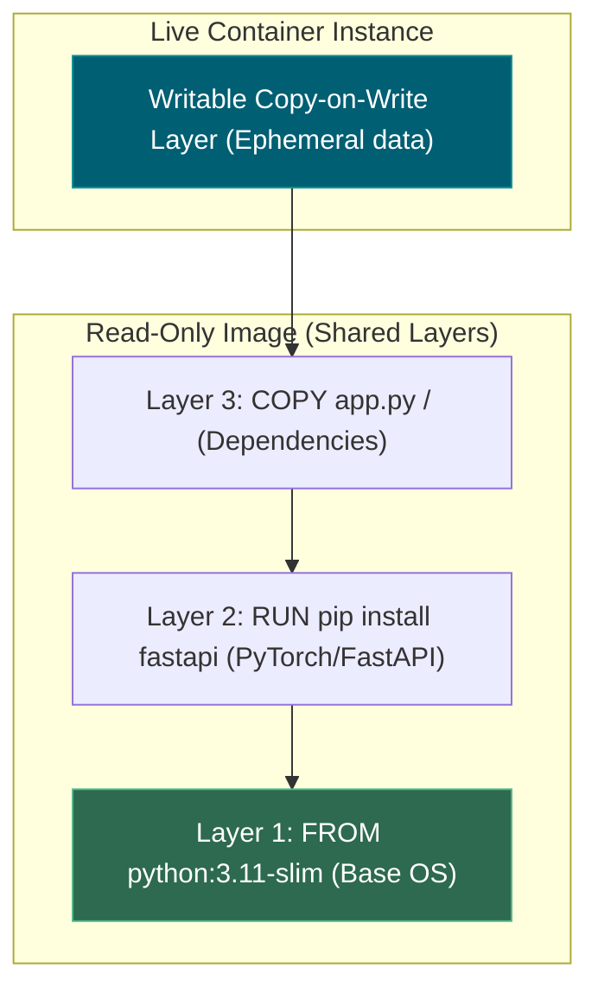
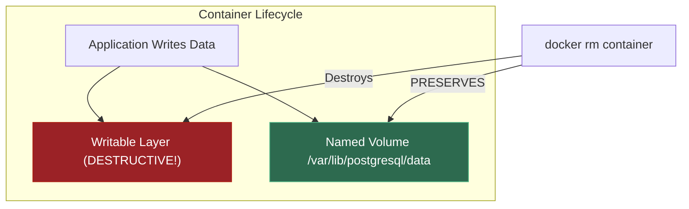
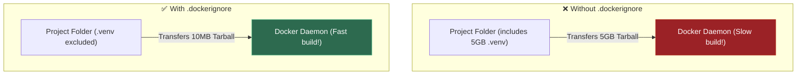
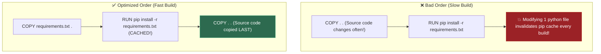
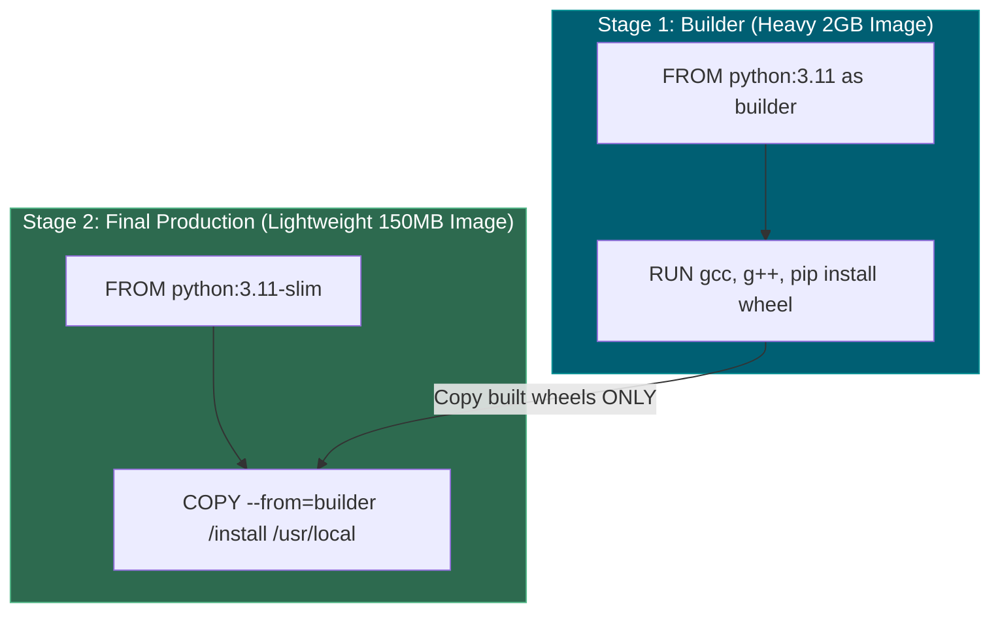
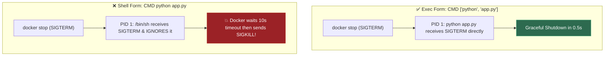
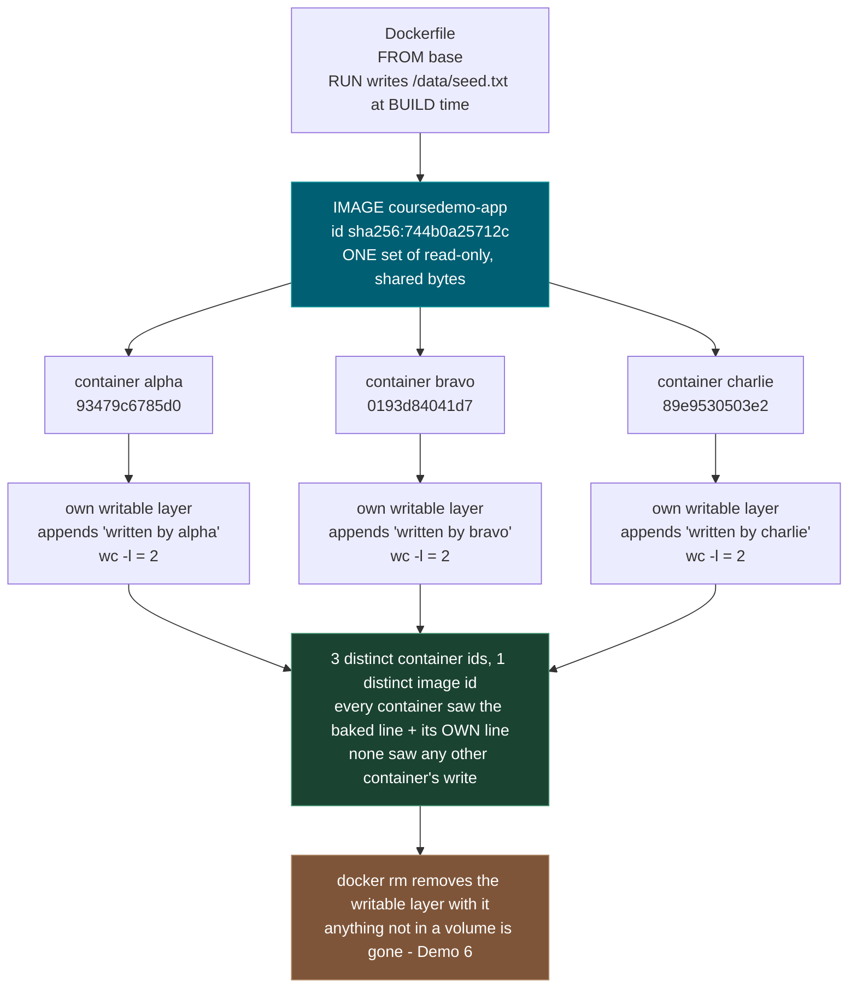
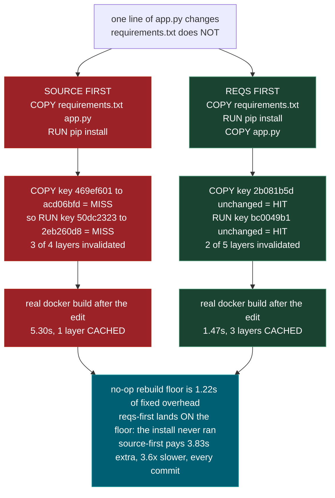
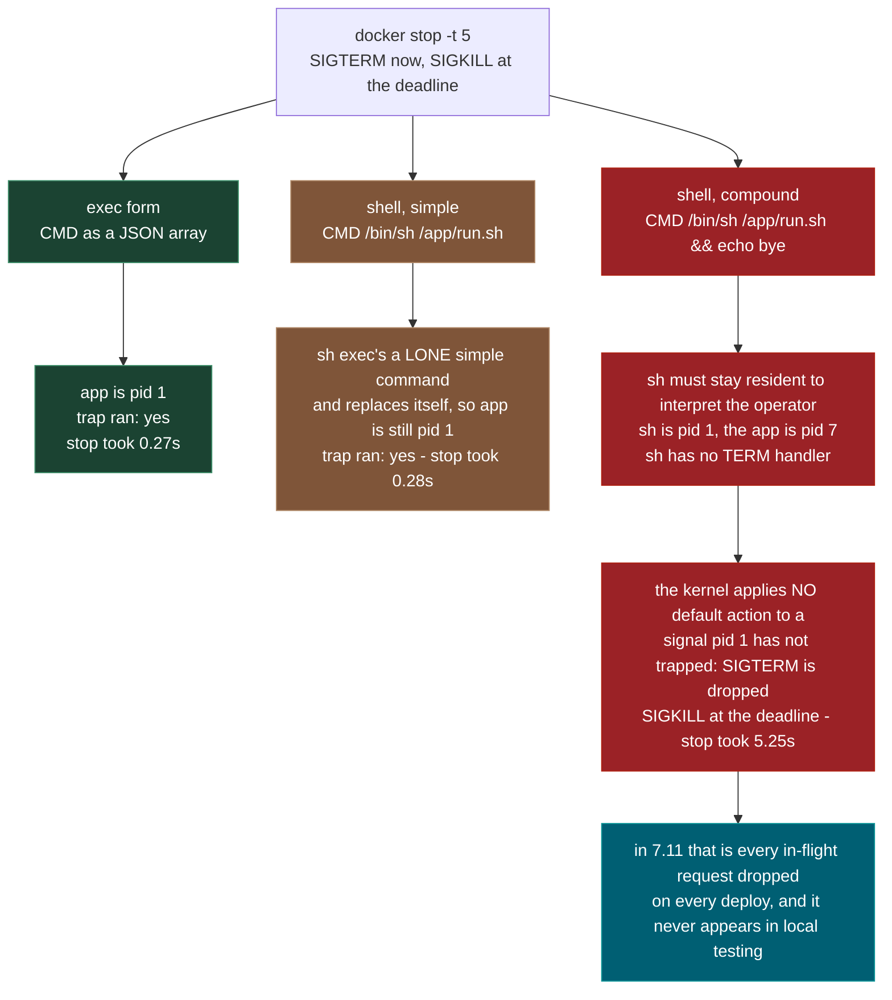
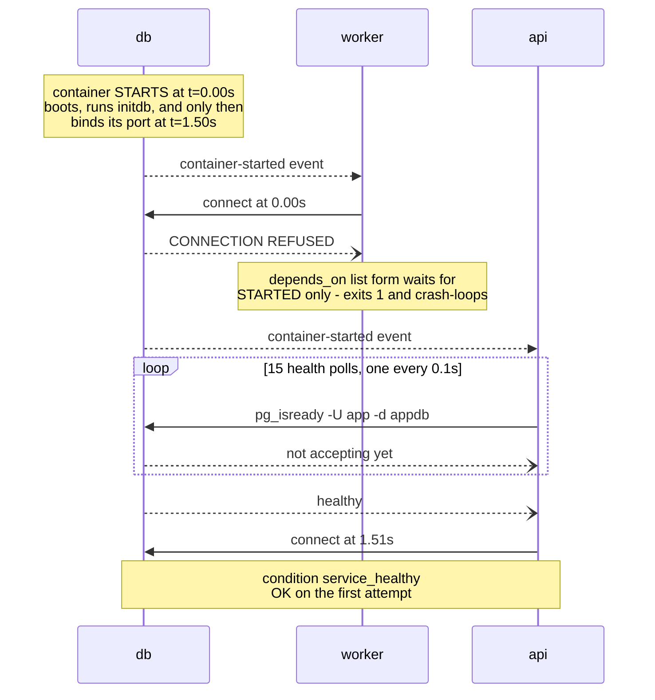

# 0.11 — Docker and Docker Compose

**Phase 0 · CORE · WORKBENCH · 10 focused hours · Review in 7 days**

**Workbench Track:** Real-world terminal execution with **Docker CLI** and **Docker Compose**. Build optimized production multi-stage images, master layer caching, orchestrate multi-container AI stacks (FastAPI + pgvector + Redis), and manage persistent volumes.

---

## 1. Overview

Reproducibility is the whole point, and it matters more here than in ordinary web work: **3.10** pins a PyTorch build against a specific CUDA version, **Phase 2** wants a particular scikit-learn, **Phase 6** wants specific LangGraph versions. The **0.2** virtual environment isolates Python packages; the container isolates everything below them — the interpreter, the system libraries, the CUDA runtime, the OS.

The second reason it earns ten hours rather than two: the local stack for the rest of the course — Postgres with pgvector for **5.2** vectors and **6.5** checkpoints, Redis for **7.7** caching — is one `docker compose up` instead of four manual installs, and every capstone in **Phase 8** ships as an image. The failures in this topic are not syntax failures. They are a build that takes four minutes instead of one on every commit, a deploy that drops in-flight requests, and a database that vanishes because of one flag.

**What is real and what is modelled.** Demos 1 and 3–6 run actual `docker build`, `docker run` and `docker stop` against a base image found already local — on the machine that produced the output below that was `fnproject/python:3.11`, which is simply what happened to be present. **If no usable local base image exists, those demos print `SKIPPED` rather than pulling one**, so the output varies by machine. Three things are deliberately modelled: the expensive install layer is `RUN sleep 3` standing in for `pip install -r requirements.txt`, because the sandbox has no network; Demo 2 computes BuildKit's cache-key chain in ~10 lines of Python rather than reading BuildKit's real digests; and Demo 7 parses a real Compose file but times the Postgres race with a thread that flips a flag after 1.5 s — no Postgres container runs. §4 gives the real syntax for all three so the model never has to be un-learned.

Depends on **0.10**; unlocks **0.13** OCI deployment, **0.15** the data stack, and **7.11** production serving.

---

## 2. Glossary

### 2.1 — Image vs. Container vs. Layer

- **Image**: A read-only blueprint comprising stacked filesystem layers and runtime metadata.
- **Container**: A running, isolated process instance constructed on top of an Image with a thin writable layer.
- **Layer**: A single read-only filesystem diff produced by an instruction in a `Dockerfile`.

#### 💡 The Beginner Analogy: Frozen Bakery Recipe vs. Live Baked Cake
- **Image**: A frozen, read-only **architectural blueprint / recipe**.
- **Layer**: Individual **transparent layers of traced paper** stacked together to form the complete blueprint.
- **Container**: The actual **live, baked cake** created from the blueprint. You can add frosting on top (writable layer) without changing the printed recipe blueprint.

#### 💻 Code Example & ⚠️ Why It Matters
```bash
# Images are read-only blueprints
docker build -t my-app:v1 .

# Containers are instances running those blueprints
docker run -d --name app1 -p 8000:8000 my-app:v1
```

##### Verified Output
```text
# Container created and running on port 8000
```

**Why It Matters**: Multiple containers created from the same image share the exact same underlying read-only layers in memory, making container startup instant and memory footprint minimal.

#### 🤖 Real-Time AI/ML Use Case
Deploying multiple worker replicas of an AI inference container (e.g. 5 FastAPI instances serving a PyTorch model). Each replica shares the same 5GB read-only image layers (PyTorch, CUDA libraries, base OS) in memory, using only megabytes of additional RAM per container instance for host RAM efficiency.

#### 🎨 Visual Concept



---

### 2.2 — Writable Copy-On-Write Layer & Volumes

- **Writable Layer**: The temporary top layer attached to a container where runtime file modifications take place. Destroyed when the container is deleted (`docker rm`).
- **Volume**: A dedicated host-managed filesystem mount (`docker volume create`) decoupled from the container lifecycle to preserve database state.

#### 💡 The Beginner Analogy: Hotel Room Scratchpad vs. Safety Deposit Box
- **Writable Layer**: Drawing on the **hotel room notepad**. When you check out and the room is cleaned (`docker rm`), your notes are thrown in the trash.
- **Volume**: Stashing your valuables inside a **hotel safety deposit box** in the lobby vault. Checking out of your room doesn't touch the deposit box.

#### 💻 Code Example & ⚠️ Why It Matters
```yaml
# docker-compose.yml
services:
  db:
    image: postgres:16
    volumes:
      - postgres_data:/var/lib/postgresql/data

volumes:
  postgres_data:
```

##### Verified Output
```text
# Named volume 'postgres_data' mounts persistently to /var/lib/postgresql/data
```

**Why It Matters**: Running databases inside Docker without named volumes results in total data loss whenever containers are recreated during deployments.

#### 🤖 Real-Time AI/ML Use Case
Persisting ChromaDB/Qdrant/Milvus vector index files, PostgreSQL (pgvector) embeddings, or MLflow experiment artifacts across container deployments. Without named volumes (`-v pgvector_data:/var/lib/postgresql/data`), rebuilding or restarting the database container erases your entire vector database index.

#### 🎨 Visual Concept



---

### 2.3 — Build Context & `.dockerignore`

- **Build Context**: The local directory payload compressed into a tarball and sent to the Docker daemon when `docker build` runs.
- **`.dockerignore`**: A text file listing pattern exclusions to prevent large binaries, node_modules, `.git` histories, and virtual environments from being sent to the daemon.

#### 💡 The Beginner Analogy: Luggage Packing Filter
`docker build` is like hiring a mover. If you don't use a `.dockerignore` file, you are paying the mover to pack **every piece of trash, old newspapers, and broken furniture** in your basement (`.venv/`, `.git/`, `__pycache__`) into the moving truck before doing anything else.

#### 💻 Code Example & ⚠️ Why It Matters
```text
# .dockerignore
.venv
.git
__pycache__
*.pyc
node_modules
```

##### Verified Output
```text
# Docker daemon ignores .venv, .git, and __pycache__ during tarball context creation
```

**Why It Matters**: Omitting `.dockerignore` causes `docker build` to freeze for minutes transferring gigabytes of virtual environments and `.git` histories to the daemon on every build.

#### 🤖 Real-Time AI/ML Use Case
Building AI app containers with local `.venv` environments, HuggingFace model cache dirs (`~/.cache/huggingface`), raw training datasets (`data/*.csv`), or `.git` histories. Excluding them in `.dockerignore` prevents transferring 10+ GB of local junk to the Docker daemon during every build.

#### 🎨 Visual Concept



---

### 2.4 — Cache Invalidation & Layer Order

Docker caches each build instruction layer based on a hash of the instruction text and input files. If a layer changes, that layer **and all subsequent layers below it** lose their cache and must rebuild from scratch.

#### 💡 The Beginner Analogy: Baking Layer Cake
If you alter the ingredients of the **bottom layer** of a 5-tier cake (e.g. changing `requirements.txt` placed at the top of the Dockerfile), you have to re-bake Tier 1, Tier 2, Tier 3, Tier 4, and Tier 5.

#### 💻 Code Example & ⚠️ Why It Matters
```dockerfile
# ✅ CORRECT LAYER ORDER: Copy requirements & install dependencies BEFORE source code
COPY requirements.txt .
RUN pip install --no-cache-dir -r requirements.txt

# Source code changes often, so copy it AFTER installing dependencies!
COPY . .
```

##### Verified Output
```text
# Step 1/3 COPY requirements.txt -> CACHED
# Step 2/3 RUN pip install -> CACHED
# Step 3/3 COPY . . -> Un-cached (fast)
```

**Why It Matters**: Copying application source code before `RUN pip install` forces Docker to re-download heavy ML dependencies (PyTorch, Pandas) on every minor code edit.

#### 🤖 Real-Time AI/ML Use Case
Containerizing PyTorch/TensorFlow apps. Placing `COPY requirements.txt` and `RUN pip install torch transformers` *before* `COPY . .` ensures Docker reuses the cached multi-gigabyte PyTorch/CUDA installation layer on every code edit, cutting rebuild times from 10 minutes to 3 seconds.

#### 🎨 Visual Concept



---

### 2.5 — Multi-Stage Build

A `Dockerfile` pattern containing multiple `FROM` statements where final production images selectively copy compiled artifacts from earlier builder stages, leaving heavy compilers, SDKs, and build caches behind.

#### 💡 The Beginner Analogy: Factory Scaffolding Removal
Building a house requires heavy scaffolding, cranes, and cement mixers (Compilers, C build tools, dev libraries). Once the house is finished, you **remove the scaffolding** and ship only the clean, lightweight finished house to the customer.

#### 💻 Code Example & ⚠️ Why It Matters
```dockerfile
# Stage 1: Build dependencies
FROM python:3.11 as builder
WORKDIR /app
COPY requirements.txt .
RUN pip wheel --no-cache-dir --wheel-dir /app/wheels -r requirements.txt

# Stage 2: Clean Minimal Production Image
FROM python:3.11-slim
WORKDIR /app
COPY --from=builder /app/wheels /wheels
RUN pip install --no-index --find-links=/wheels /wheels/*
COPY . .
```

##### Verified Output
```text
# Multi-stage image size: 150MB (vs 1.8GB build stage)
```

**Why It Matters**: Shrinks container image sizes from multi-gigabyte blobs down to tens of megabytes, reducing security attack surfaces and deployment transfer times.

#### 🤖 Real-Time AI/ML Use Case
Shipping lightweight production AI microservices. Stage 1 uses a heavy build image (`python:3.11` with `gcc`, `g++`, `nvcc` compilers) to build C-extensions and wheels, while Stage 2 copies only the compiled wheels into a minimal `python:3.11-slim` runtime image — shrinking final image size from 3GB to 250MB.

#### 🎨 Visual Concept



---

### 2.6 — Exec Form (`CMD ["prog", "arg"]`) vs. Shell Form

- **Exec Form (`CMD ["python", "app.py"]`)**: Executes the process directly as **PID 1** without wrapping it in a shell interpreter.
- **Shell Form (`CMD python app.py`)**: Wraps execution in `/bin/sh -c`, making the shell PID 1 and ignoring incoming OS signals (`SIGTERM`).

#### 💡 The Beginner Analogy: Direct Phone Line vs. Answering Service
- **Exec Form**: Calling a person directly on their mobile phone (PID 1). When you ask them to leave (`SIGTERM`), they hear you instantly and exit.
- **Shell Form**: Calling an answering service (`/bin/sh`), which takes your message but refuses to pass it to the person inside, leaving them stuck in the room.

#### 💻 Code Example & ⚠️ Why It Matters
```dockerfile
# Exec form runs python directly as PID 1
CMD ["python", "main.py"]
```

##### Verified Output
```text
# Process runs as PID 1: python main.py
```

**Why It Matters**: Shell form prevents Python from receiving `SIGTERM` signals during deployments, causing containers to hang for 10 seconds before being brutally killed by `SIGKILL`.

#### 🤖 Real-Time AI/ML Use Case
Graceful shutdown of AI inference servers and background task workers (Celery/RQ). Using Exec form `CMD ["uvicorn", "main:app"]` allows the Python process to receive `SIGTERM` directly from Kubernetes/Docker, letting active LLM generation requests finish and DB pools close cleanly before exiting.

#### 🎨 Visual Concept



---

## 3. Skip Test — Answered

> Gate **before** studying. Both correct from memory → skip. §7 withholds its answers deliberately.

**① Explain the difference between an image and a container.**

An **image** is a read-only, content-addressed stack of filesystem layers plus metadata (entrypoint, command, environment, exposed ports). A **container** is one running instance of that image with a thin **writable layer** stacked on top, plus its own process namespace, network namespace and lifecycle. Image is the class; container is the instance — except the sharing is literal, not conceptual: the layer bytes on disk are shared, not copied.

Demo 1 counts it rather than asserting it. One image, `sha256:744b0a25712c`, three containers — `93479c6785d0`, `0193d84041d7`, `89e9530503e2`. Each appends its own line to `/data/seed.txt`, a file that was baked in at build time, and each then reports `2` lines: the baked line plus its own. Not 3, not 4. No container saw any other container's write, because each write landed in that container's private writable layer.

The second half of the answer is Demo 6: remove the container and the writable layer goes with it. Container 1 wrote to a plain path *and* to a named volume; after `docker rm -f`, container 2 reads `volume : row 1 - the vector index` and `layer : GONE`.

**② State why you copy `requirements.txt` and install before copying source code in a Dockerfile.**

Because a layer's cache key is a **hash chain**: `key(i) = H(key(i-1) || instruction || content of any files it copies)`. Changing a file changes the key of the `COPY` that brought it in, and therefore every key below it. An install step whose parent key is unchanged is never re-executed, however expensive it is.

Demo 2 computes both orderings against the same one-line edit to `app.py` while `requirements.txt` stays byte-identical. Source-first invalidates **3 of 4** layers, including `RUN pip install` (`50dc2323 -> 2eb260d8`). Requirements-first invalidates **2 of 5**, and the install key `bc0049b1` is unchanged — a HIT.

Demo 3 puts a stopwatch on real `docker build`. After the same one-line source edit: source-first **5.30s** with 1 layer CACHED, requirements-first **1.47s** with 3 layers CACHED, against a no-op rebuild floor of **1.22s**. The requirements-first rebuild lands on that floor, meaning the install layer genuinely did not run. That is **3.6x** slower and **3.83s** of avoidable work — on a 3-second install. A real torch wheel takes minutes, and the gap scales with it.

---

## 3. Visual Concept Diagrams

### 3.1 — One image, three containers, as counted



### 3.2 — The cache key is a hash chain, and the numbers it produced

Same edit both sides: one line of `app.py`, `v1` to `v2`. `requirements.txt` byte-identical.



### 3.3 — CMD form decides whether `docker stop` is graceful



### 3.4 — `depends_on` waits for STARTED, not for READY



---

## 4. Core Technical Deep Dive

| Practice | The failure it prevents | Measured here | Where it bites |
|---|---|---|---|
| `COPY requirements.txt` first | Full reinstall on every code edit | Demo 3: **1.47s** vs **5.30s** rebuild | every commit, every CI build for **0.13** |
| `.dockerignore` | Shipping the whole tree to the daemon; baking `.git`/`.env` into the image | Demo 4: **13.91MB → 176B** | build time everywhere, credential leak **7.13** |
| Exec-form `CMD` | `SIGTERM` dropped, `SIGKILL` at the deadline | Demo 5: **0.27s** vs **5.25s** | **7.11** rolling restarts |
| Named volume | Losing the database on teardown | Demo 6: volume kept, layer `GONE` | **5.2** pgvector index, **6.5** checkpoints |
| `condition: service_healthy` | API crash-looping before Postgres accepts TCP | Demo 7: **0.00s** refused vs **1.51s** OK | local stack for **0.15** |
| Multi-stage build | Compilers and apt caches shipped to production | not measured here | deploy bandwidth, **0.13**, **7.11** |
| Pinned base tag | A moving base breaking yesterday's build | not measured here | reproducibility, **3.10** CUDA pins |
| Non-root `USER` | A container escape landing as root on the host | not measured here | **7.13** |
| Bind `0.0.0.0`, not `127.0.0.1` | "Starts fine, nothing can connect" | not measured here | first deploy, every time |

**The real Dockerfile — multi-stage and cache-aware.** This is the syntax; the script's `RUN sleep 3` is only a stand-in for line 2 of the install stage.

```dockerfile
# ============ STAGE 1: build ============================================
# Pin the exact minor version. "python:3.12" silently moves under you and
# breaks a build that worked yesterday — the opposite of reproducibility.
FROM python:3.12-slim AS builder

WORKDIR /app

# Build-only deps (compilers for packages with C extensions). Needed to
# INSTALL numpy/psycopg but not to RUN them — which is the entire reason
# this is a separate stage.
RUN apt-get update && apt-get install -y --no-install-recommends \
        build-essential gcc \
    && rm -rf /var/lib/apt/lists/*

# *** THE LAYER-CACHE RULE ***
# Copy ONLY the dependency manifest, install, and copy source AFTER.
# requirements.txt changes rarely; source changes on every commit. Swap
# these two and every one-character edit re-runs the install below.
COPY requirements.txt .
RUN pip install --no-cache-dir --prefix=/install -r requirements.txt

# ============ STAGE 2: runtime ==========================================
FROM python:3.12-slim

# Copy ONLY the installed packages. Compilers, apt caches and build
# artifacts from stage 1 never enter the final image. On an ML image that
# is routinely ~6 GB versus ~1.5 GB — bandwidth and cost on every deploy.
COPY --from=builder /install /usr/local

WORKDIR /app

# Run as a non-root user. A container escape as root is a host compromise;
# as an unprivileged user it is far less useful to an attacker (7.13).
RUN useradd --create-home --uid 1000 appuser
COPY --chown=appuser:appuser . .
USER appuser

# Documents the port. Does NOT publish it — that is `-p` at run time.
EXPOSE 8000

# Exec form (JSON array). Demo 5 measures exactly what this buys.
CMD ["uvicorn", "main:app", "--host", "0.0.0.0", "--port", "8000"]
#                                    ^^^^^^^ NOT 127.0.0.1. Binding to
# localhost INSIDE a container makes it unreachable from outside it — the
# single most common "my container starts but I cannot connect" cause.
```

```
# ---- .dockerignore — one file, measured at 13.91MB → 176B in Demo 4 ----
.git
.venv
__pycache__
node_modules
data
*.log
.env
```

**A layer is a filesystem diff, and the cache key is a chain.** Each instruction produces a layer; the layers stack copy-on-write. BuildKit derives a key per layer from the parent key, the instruction text, and — for `COPY`/`ADD` — a content hash of the files brought in. Demo 2 reproduces that in ten lines, and Demo 3 confirms the model against real builds. Two consequences fall straight out of the definition: changing a file invalidates every layer **below** the `COPY` that brought it in, and a `RUN` whose parent key is unchanged is never re-executed no matter how expensive it is. The whole ordering rule is a corollary of one hash function.

**The build context is shipped before the first instruction runs.** `docker build .` tars the directory and sends it to the daemon on **every** build, cached layers or not. Demo 4 measures 13.91MB going across for a project whose actual source is two files. Worse than the seconds: without a `.dockerignore`, `COPY . .` bakes `.git` and `.env` into a published image, and image layers are readable by anyone who can pull the tag (**7.13**). `.dockerignore` prunes ignored directories rather than filtering their contents, which is why the daemon never even hears about `.venv`.

**PID 1 is not an ordinary process.** For a normal process the kernel applies a default action to an unhandled signal — SIGTERM terminates it. For PID 1 there is **no** default action: a signal PID 1 has not explicitly trapped is discarded. So a container's main process must both install a handler and actually *be* PID 1. `docker stop` sends SIGTERM, waits (10 s by default; the script uses 5 s to stay short), then SIGKILLs.

The usual write-up — "shell form wraps you in `/bin/sh`, which swallows SIGTERM" — is **not what Demo 5 measured**. `CMD /bin/sh /app/run.sh` is a lone simple command, so `sh` `exec`s it and replaces itself; the app is still PID 1 and stops in **0.28s**. Add any shell syntax — `&&`, a pipe, a variable expansion — and `sh` must stay resident to interpret it. Then `sh` is PID 1, `sh` has no TERM trap, the signal is dropped, and the container is SIGKILLed at the deadline: **5.25s**, with the app at pid **7**. Exec form is the rule because it is the form that cannot accidentally acquire shell semantics — not because shell form is always fatal.

**Volumes versus the writable layer.** The writable layer is part of the container and dies with it. A **named volume** is managed by the daemon, lives outside any container, and is mounted in. A **bind mount** maps a host path in — perfect for live code reload in development, wrong in production because it overwrites what the image contains. Demo 6 removes the container entirely (which is what a redeploy does) and shows the volume file intact and the layer file `GONE`.

**`depends_on` and the two spellings.** The list form is the one that bites:

```yaml
    depends_on:
      - db                    # waits for STARTED only. Nothing more.
```

```yaml
    depends_on:
      db:
        condition: service_healthy   # waits for the healthcheck to pass
```

A healthcheck is what makes the second form mean anything. The real one for Postgres, in the Compose file the script parses:

```yaml
  db:
    image: pgvector/pgvector:pg16
    environment:
      POSTGRES_USER: app
      POSTGRES_PASSWORD: secret
      POSTGRES_DB: appdb
    healthcheck:
      test: ["CMD-SHELL", "pg_isready -U app -d appdb"]
      interval: 5s
      retries: 10
    volumes:
      - pgdata:/var/lib/postgresql/data   # NAMED volume: survives `down`

volumes:
  pgdata:
```

Service names are DNS names on the Compose network, which is why `postgresql://app:secret@db:5432/appdb` resolves and why `localhost` there would point the API at itself.

**The commands worth having in muscle memory:**

```bash
docker compose up -d --build     # build and start detached
docker compose ps                # what is up, and is it healthy
docker compose logs -f api       # follow ONE service's logs (0.10)
docker compose exec db psql -U app -d appdb   # shell into the DB (0.14)
docker compose down              # stop, KEEP named volumes
docker compose down -v           # stop and DESTROY volumes — data gone
docker build --progress=plain .  # show CACHED/transferring-context lines
docker image inspect <tag> --format '{{.Id}}'
docker system prune -af          # reclaim disk when du -sh flags Docker (0.10)
```

`down` versus `down -v` is one character and an afternoon. Demo 6 exists so that difference is felt once, cheaply.

---

## 5. Hands-On Real-World Terminal Drills (Docker CLI & Docker Compose)

Do not run Python scripts to simulate Docker. Install Docker Desktop / Docker Engine and execute these 6 real-world drills:

---

### Drill 1 — Layer Caching & Multi-Stage Production `Dockerfile`

Create a production-grade FastAPI container with cached dependency layers and non-root execution:

```bash
# 1. Create a practice folder
mkdir -p docker-ai-service && cd docker-ai-service

# 2. Write a minimal requirements.txt
cat << 'EOF' > requirements.txt
fastapi==0.115.0
uvicorn==0.31.0
pydantic==2.9.2
EOF

# 3. Write a minimal FastAPI app
cat << 'EOF' > main.py
from fastapi import FastAPI
app = FastAPI(title="AI Inference Service")

@app.get("/health")
def health():
    return {"status": "healthy", "service": "llm-gateway"}
EOF

# 4. Write the Layer-Optimized Production Dockerfile
cat << 'EOF' > Dockerfile
# Stage 1: Build & install dependencies in isolated builder
FROM python:3.11-slim AS builder

WORKDIR /app
RUN apt-get update && apt-get install -y --no-install-recommends build-essential && rm -rf /var/lib/apt/lists/*

# Copy ONLY requirements first -> caches pip download layer
COPY requirements.txt .
RUN pip install --no-cache-dir --user -r requirements.txt

# Stage 2: Minimal runtime image
FROM python:3.11-slim AS runner

WORKDIR /app

# Create non-root system user for container security
RUN useradd -u 8888 appuser && chown -R appuser:appuser /app
USER appuser

# Copy installed wheels from builder stage
COPY --from=builder /root/.local /home/appuser/.local
ENV PATH=/home/appuser/.local/bin:$PATH

# Copy application source code LAST (prevents cache busts on src edits)
COPY --chown=appuser:appuser . .

# MUST use EXEC-FORM to receive SIGTERM from Docker daemon
CMD ["uvicorn", "main:app", "--host", "0.0.0.0", "--port", "8000"]
EOF
```

---

### Drill 2 — Measuring `.dockerignore` Impact on BuildKit Context Transfer

```bash
# 1. Create dummy large directories that must NEVER leave your laptop
mkdir -p .venv data/raw checkpoints
head -c 50M </dev/urandom > data/raw/large_corpus.bin
head -c 20M </dev/urandom > checkpoints/model.pt

# 2. Create the production .dockerignore
cat << 'EOF' > .dockerignore
.git
.venv
__pycache__
data/raw/
checkpoints/
*.md
.env*
EOF

# 3. Build the image and inspect BuildKit context transfer
docker build --progress=plain -t ai-service:v1 .

# Notice in the output:
# -> "[internal] load build context" transfers only a few KBs instead of 70MB+!
```

---

### Drill 3 — Graceful Shutdown vs Zombie SIGKILL (`docker stop`)

```bash
# 1. Run the container detached
docker run -d --name ai-app -p 8000:8000 ai-service:v1

# 2. Verify health endpoint
curl http://localhost:8000/health

# 3. Time the stop command:
time docker stop ai-app
# -> Returns in ~0.3s because exec-form CMD passed SIGTERM cleanly to uvicorn!

# 4. Cleanup container:
docker rm ai-app
```

---

### Drill 4 — Multi-Container Orchestration (`docker compose`)

Orchestrate FastAPI, Postgres with `pgvector`, and Redis in a single bridge network:

```bash
cat << 'EOF' > docker-compose.yml
services:
  api:
    build: .
    ports:
      - "8000:8000"
    environment:
      - DATABASE_URL=postgresql://app:secret@db:5432/appdb
      - REDIS_URL=redis://cache:6379/0
    depends_on:
      db:
        condition: service_healthy
      cache:
        condition: service_started

  db:
    image: pgvector/pgvector:pg16
    environment:
      POSTGRES_USER: app
      POSTGRES_PASSWORD: secret
      POSTGRES_DB: appdb
    ports:
      - "5432:5432"
    volumes:
      - pgdata:/var/lib/postgresql/data
    healthcheck:
      test: ["CMD-SHELL", "pg_isready -U app -d appdb"]
      interval: 3s
      timeout: 3s
      retries: 5

  cache:
    image: redis:7-alpine
    ports:
      - "6379:6379"

volumes:
  pgdata:
EOF

# 1. Boot entire stack detached with healthcheck synchronization:
docker compose up -d --build

# 2. Verify status and healthy flags:
docker compose ps

# 3. Inspect database logs:
docker compose logs -f db
```

---

### Drill 5 — Named Volume Persistence Testing (`down` vs `down -v`)

```bash
# 1. Insert dummy data into postgres
docker compose exec db psql -U app -d appdb -c "CREATE TABLE test (id serial, val text); INSERT INTO test (val) VALUES ('vector-index-1');"

# 2. Stop containers with plain down:
docker compose down

# 3. Re-start containers:
docker compose up -d
docker compose exec db psql -U app -d appdb -c "SELECT * FROM test;"
# -> Data is STILL THERE because named volume 'pgdata' persisted!

# 4. Destroy volumes permanently (Clean reset):
docker compose down -v
```


---

## 6. Video

**"Docker Tutorial for Beginners [FULL COURSE in 3 Hours]"** — *TechWorld with Nana* — [youtube.com/watch?v=3c-iBn73dDE](https://www.youtube.com/watch?v=3c-iBn73dDE). Title and channel confirmed live via YouTube's oEmbed endpoint in this pass. Covers containers versus virtual machines, the main commands, debugging a running container, Compose for multiple services, writing a Dockerfile, and pushing to a private registry.

For the two things this note measures most closely, the authoritative sources are short and worth reading directly: the **Dockerfile reference** on `docs.docker.com` (the `CMD` section states the exec/shell distinction and the PID 1 consequence) and the **Compose file reference** section on `depends_on` (which states plainly that it does not wait for readiness without a condition). Read the build-cache page too — it is the primary source for the ordering rule Demos 2 and 3 measure.

---

## 7. Retrieval Checkpoint — Unanswered

> Close this file. No notes. Answers deliberately withheld.

1. Three containers run from one image. Container A writes a 1 GB file. What does container B see, where did those bytes go, and what happens to them on `docker rm A`?
2. Write the four Dockerfile lines that make a one-character source edit rebuild in about a second instead of re-running `pip install`. Then state the mechanism — not "caching", the actual rule about keys.
3. Your container ignores `docker stop` and dies ten seconds later. Give two distinct causes and the one-line check that distinguishes them.
4. `docker compose up` brings the stack up and the API crash-loops for a few seconds before settling. Name the exact YAML that fixes it, the thing that YAML depends on existing, and the second defence that belongs in the application code (**0.8**).
5. Your build takes 40 seconds before the first instruction runs, and the image ends up containing your `.git` directory. Name the single file that fixes both, and say why the second consequence is more serious than the first.

---

## 8. Closed-Book Rebuild

With this file **and** the script closed, write a multi-stage Dockerfile that installs dependencies in a builder stage, copies only the installed packages into a slim runtime stage, runs as a non-root user, orders its layers so a source edit does not re-run the install, uses exec-form `CMD`, and binds to an address reachable from outside the container. Add the `.dockerignore` that belongs beside it.

Then write a Compose file that brings up that API with pgvector-enabled Postgres and Redis: service-name DNS in the connection strings, a Postgres healthcheck the API's `depends_on` actually waits on, a named volume for the database, and a bind mount for live reload that you would remove in production. Finally, state which single command destroys the database and which one does not.

---

## Review again in

**7 days.** Four things are worth retaining because each costs real time when missed: the **ordering rule and the hash-chain reason behind it** (1.47s versus 5.30s against a 1.22s floor), **exec-form `CMD` and the PID 1 rule** (0.27s versus 5.25s), **`down` versus `down -v`**, and **`condition: service_healthy`** (0.00s refused versus 1.51s OK). Re-derive the ordering rule from the key definition rather than memorising the Dockerfile — it also tells you why editing `requirements.txt` is *supposed* to be slow.
