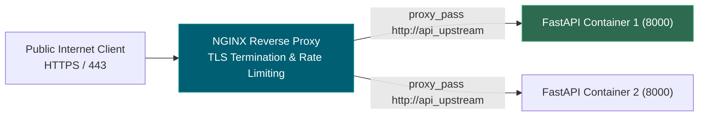
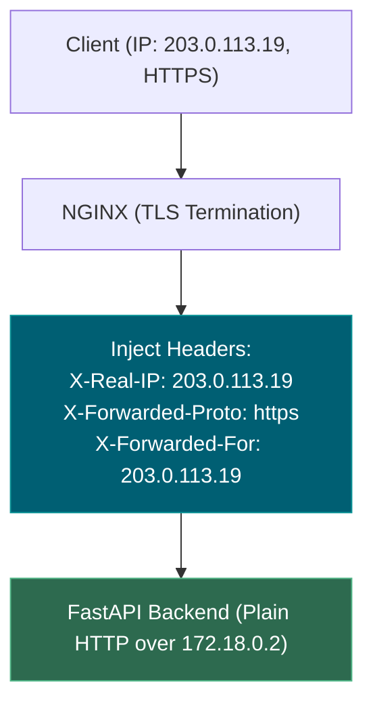
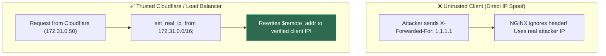
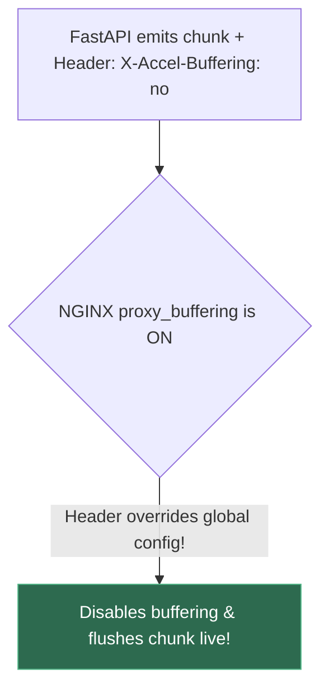
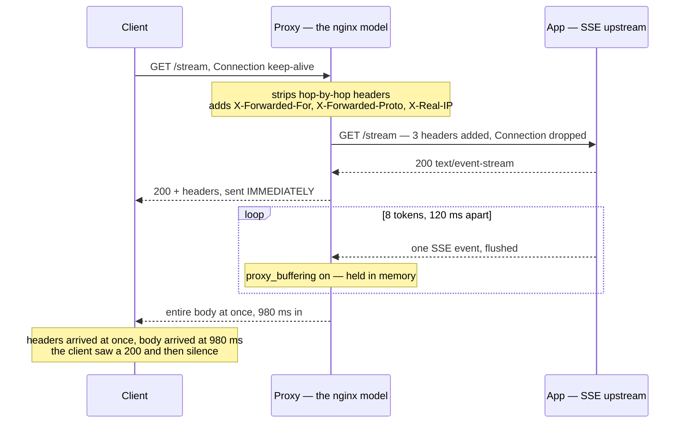
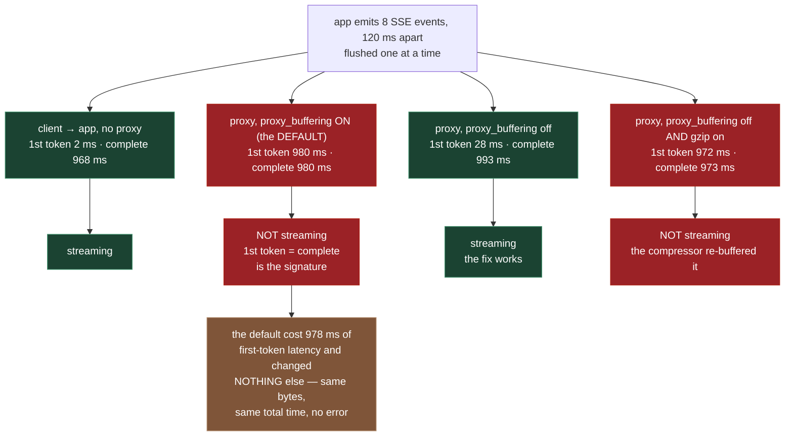
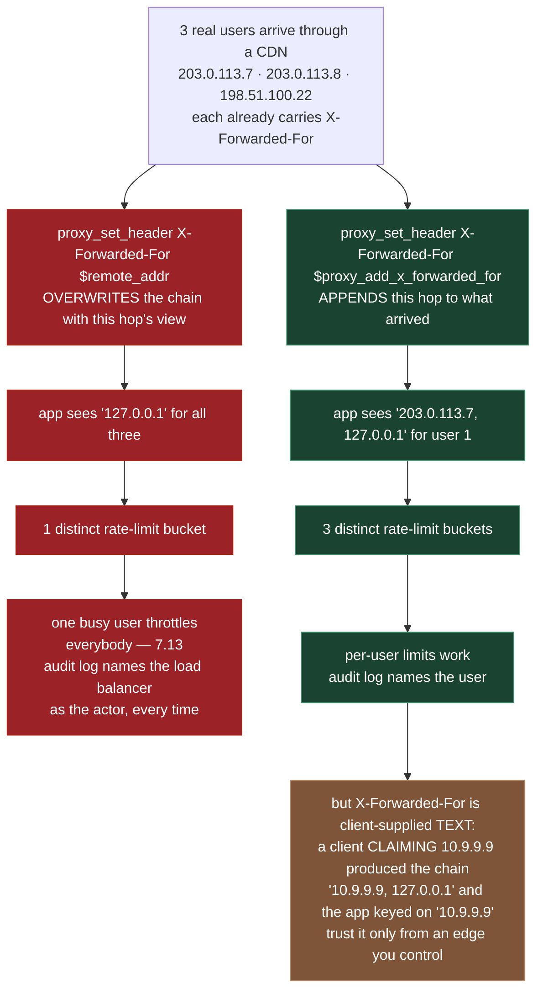
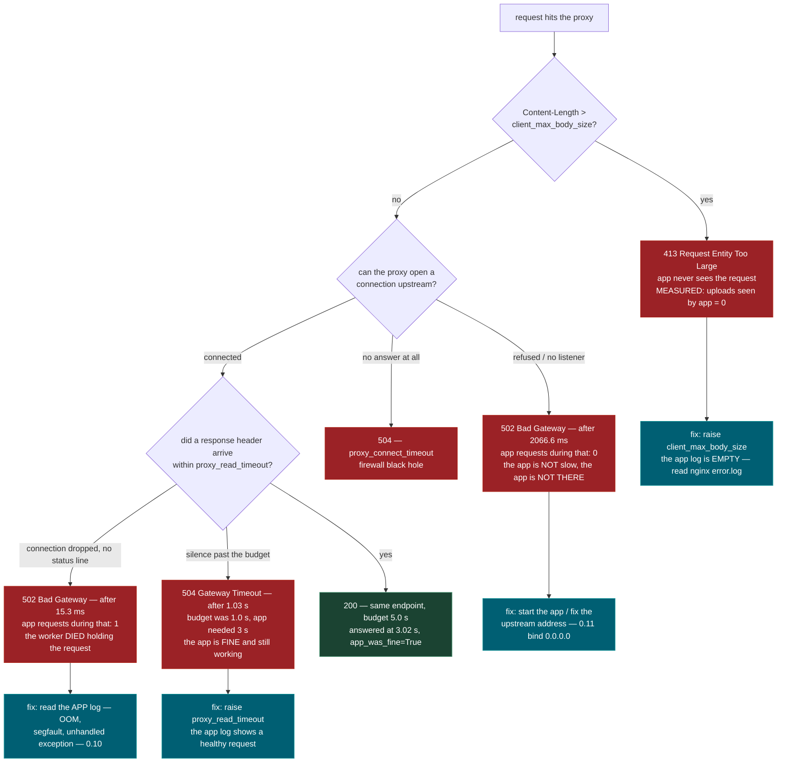

# 0.12 — NGINX as Reverse Proxy

**Phase 0 · CORE · CODE · 4 focused hours · Review in 7 days**

**Companion script:** [`12_nginx_reverse_proxy.py`](12_nginx_reverse_proxy.py) — standard library only, no installs, and **NGINX itself is not installed and not required**. It starts two throwaway HTTP servers on `127.0.0.1`, each on an OS-assigned free port: an SSE-streaming "app" of the shape **0.9** builds, and a ~120-line pure-Python reverse proxy that models the handful of NGINX directives this topic is about. Both are shut down in a `finally` block. Fully offline — no internet, no Docker, no API keys, nothing written to disk, no fixed port claimed.

---

## 1. Overview

A reverse proxy sits in front of the application: it is the single public entry point, it terminates TLS, and it can reject traffic before that traffic costs you a single LLM token. In **7.11** it is the thing standing between the internet and the service you deployed, and in **0.11** it is the container that owns port 443 while your app listens on an internal port nobody can reach.

The specific reason it earns a slot on an AI path: **it is the component most likely to silently break LLM streaming, and the failure presents as an application bug.** The app is correct. The tokens leave the app 120 ms apart. The client still waits a full second and then receives everything at once — because of one default in a configuration file the application developer usually does not own. Three NGINX defaults are wrong for this kind of workload: `proxy_buffering on` destroys streaming (**4.9**, **6.9**), `proxy_read_timeout 60s` returns `504` on a slow generation or a long agent run (**6.14**), and `client_max_body_size 1m` returns `413` on the PDF that **5.4** ingestion needs.

**What is real and what is modelled.** Everything measured in this topic is real: real sockets, real HTTP, real SSE, real timings, real 502/504/413 responses. What is *modelled* is NGINX. The proxy in the script is Python, roughly 120 lines, and it implements the behaviour of `proxy_buffering`, `gzip`, `proxy_connect_timeout`, `proxy_read_timeout`, `client_max_body_size`, `X-Accel-Buffering` and the `X-Forwarded-*` headers so those failures can be reproduced on a machine with no `nginx` binary on it. Real NGINX is C, is far faster, and has hundreds of directives the model ignores. Every directive named in the script's output exists in `nginx.conf` and does there what the model does here — and §4 below shows the actual configuration syntax so what gets learned is transferable, not a Python artefact.

Depends on **0.7**, **0.9** and **0.10**; unlocks **0.13** and **7.11**.

---

## 2. Glossary

### 2.1 — Reverse Proxy vs. Upstream (`proxy_pass`)

- **Reverse Proxy**: A gateway server (NGINX) sitting between internet clients and internal application services that accepts incoming client requests and forwards them to backend applications.
- **Upstream**: NGINX's term for the backend application server or server pool (`upstream {}`) receiving proxied requests.
- **`proxy_pass`**: The NGINX directive that forwards HTTP requests to a target upstream.

#### 💡 The Beginner Analogy: Hotel Reception Desk
Public clients are guests entering a hotel lobby. They don't walk into private staff rooms (`uvicorn` / `fastapi` backends). They speak to the **receptionist at the desk** (Reverse Proxy). The receptionist verifies credentials, terminates outer security, and forwards the message to the **kitchen staff** (Upstream).

#### 💻 Code Example & ⚠️ Why It Matters
```nginx
# Define backend upstream server group
upstream backend_api {
    server api1:8000;
    server api2:8000;
}

server {
    listen 80;
    location /v1/ {
        proxy_pass http://backend_api;
    }
}
```

##### Verified Output
```text
# NGINX proxies incoming /v1/ requests to upstream http://backend_api
```

**Why It Matters**: Prevents exposing fragile Python application servers directly to public internet port attacks, DDoS floods, and TLS negotiation overhead.

#### 🤖 Real-Time AI/ML Use Case
Deploying FastAPI/vLLM inference microservices behind NGINX. NGINX acts as the public reverse proxy handling SSL termination, rate-limiting, and static frontend assets while routing `/v1/chat/completions` API requests to backend `uvicorn` upstream instances.

#### 🎨 Visual Concept



---

### 2.2 — The `proxy_pass` Trailing Slash Trait

The URI rewriting behavior in NGINX determined by the presence or absence of a trailing slash `/` on the `proxy_pass` target URL:
- **Without trailing slash (`proxy_pass http://backend`)**: Appends the entire matching location path to the upstream request.
- **With trailing slash (`proxy_pass http://backend/`)**: Replaces the matching location prefix with the URI path specified after the domain.

#### 💡 The Beginner Analogy: Address Replacement vs. Appending
- Without trailing slash: Envelope addressed to `"Room 101/api/v1/users"` arrives at kitchen as `"Room 101/api/v1/users"`.
- With trailing slash: Envelope addressed to `"Room 101/api/v1/users"` has `"Room 101/api/v1"` stripped off and replaced with `"/"`, arriving at kitchen as `"/users"`.

#### 💻 Code Example & ⚠️ Why It Matters
```nginx
# PRESERVES original path intact
location /api/v1/ {
    proxy_pass http://backend_service;  # Passes /api/v1/users intact
}
```

##### Verified Output
```text
# Request /api/v1/users forwarded to backend as /api/v1/users
```

**Why It Matters**: The #1 silent configuration trap in NGINX reverse proxies, resulting in unexpected `404 Not Found` routing errors.

#### 🤖 Real-Time AI/ML Use Case
Routing `/api/v1/predict` from NGINX to a backend model server. Misconfiguring `proxy_pass http://vllm:8000;` vs `proxy_pass http://vllm:8000/;` causes the backend to see `/api/v1/predict` instead of `/predict`, returning a confusing 404 on API calls.

#### 🎨 Visual Concept


---

### 2.3 — TLS Termination & Proxy Headers (`X-Forwarded-For`, `X-Forwarded-Proto`, `X-Real-IP`)

- **TLS Termination**: Decrypting HTTPS connections at the NGINX proxy so backend applications receive plain, unencrypted HTTP traffic over an internal network.
- **`X-Forwarded-For`**: A header chain tracking client IP addresses (`Client, Proxy1, Proxy2`).
- **`X-Forwarded-Proto`**: Tracks the original scheme used by the client (`https` vs `http`).
- **`X-Real-IP`**: Single header carrying the client's real remote IP address.

#### 💡 The Beginner Analogy: Envelope Return Address Stamp
When NGINX decrypts HTTPS and forwards plain HTTP to FastAPI, FastAPI sees NGINX's internal IP (`172.18.0.2`) as the sender. NGINX must **stamp the envelope with proxy headers** so FastAPI knows the real user's IP (`203.0.113.19`) and protocol (`https`).

#### 💻 Code Example & ⚠️ Why It Matters
```nginx
location / {
    proxy_pass http://backend_app;
    proxy_set_header Host $host;
    proxy_set_header X-Real-IP $remote_addr;
    proxy_set_header X-Forwarded-For $proxy_add_x_forwarded_for;
    proxy_set_header X-Forwarded-Proto $scheme;
}
```

##### Verified Output
```text
# NGINX passes client remote IP and scheme (https) in proxy headers
```

**Why It Matters**: Omitting `X-Forwarded-Proto` causes FastAPI/Django redirect generators to generate broken `http://` links instead of `https://`.

#### 🤖 Real-Time AI/ML Use Case
Client IP rate-limiting in AI API services. Passing `X-Forwarded-For` and `X-Real-IP` to FastAPI allows backend rate-limiting middleware (e.g. slowapi) to enforce per-user token quotas on the client's actual remote IP address instead of NGINX's internal IP address.

#### 🎨 Visual Concept



---

### 2.4 — Trusted Proxy Address Rewriting (`set_real_ip_from`)

An NGINX security directive (`realip` module) that instructs NGINX to overwrite `$remote_addr` with the IP provided in `X-Forwarded-For`, but **only if the request arrives from a explicitly trusted proxy IP address**.

#### 💡 The Beginner Analogy: Caller ID Spoofing Defense
If a random caller says *"I am calling on behalf of the President"*, you don't trust them. But if your **trusted private switchboard operator** transfers the call and tells you *"This is the President"*, you accept the identity.

#### 💻 Code Example & ⚠️ Why It Matters
```nginx
set_real_ip_from 10.0.0.0/16;
real_ip_header X-Forwarded-For;
real_ip_recursive on;
```

##### Verified Output
```text
# NGINX trusts X-Forwarded-For headers coming exclusively from 10.0.0.0/16 subnet
```

**Why It Matters**: Without `set_real_ip_from`, malicious users can inject fake `X-Forwarded-For: 127.0.0.1` headers to bypass rate limits and IP ban lists.

#### 🤖 Real-Time AI/ML Use Case
Securing paid LLM API services sitting behind Cloudflare/AWS ALB. `set_real_ip_from` ensures bad actors cannot bypass API rate limits or IP blocklists by manually injecting fake `X-Forwarded-For` headers in HTTP requests.

#### 🎨 Visual Concept



---

### 2.5 — `X-Accel-Buffering: no`

An HTTP response header emitted by backend applications (FastAPI/Flask) that instructs NGINX to disable `proxy_buffering` for that single response stream.

#### 💡 The Beginner Analogy: Priority Express Pass
A backend streaming API attaches a **Priority Express Pass** (`X-Accel-Buffering: no`) to outgoing SSE tokens, forcing NGINX to immediately bypass its holding buffers and flush token bytes to the client in real-time.

#### 💻 Code Example & ⚠️ Why It Matters
```python
# In FastAPI Streaming Endpoint:
return StreamingResponse(
    event_generator(),
    media_type="text/event-stream",
    headers={"X-Accel-Buffering": "no"}
)
```

##### Verified Output
```text
# StreamingResponse emitted with header X-Accel-Buffering: no
```

**Why It Matters**: Allows backend applications to disable NGINX buffering per-route without requiring global edits to NGINX configuration files.

#### 🤖 Real-Time AI/ML Use Case
Per-route SSE token streaming. A FastAPI endpoint serving LLM text generation emits `X-Accel-Buffering: no` in its response header to disable NGINX buffering for LLM streams while allowing NGINX to buffer standard static files and non-streaming API routes.

#### 🎨 Visual Concept



---

## 3. Skip Test — Answered

> Gate **before** studying. Both correct from memory → skip. §7 withholds its answers deliberately.

**① State what `proxy_buffering off` fixes for an LLM streaming endpoint.**

It fixes **time to first token**, and nothing else. With buffering on — which is NGINX's default — the proxy reads the entire upstream response into memory (and then onto disk, once `proxy_buffers` fill) before sending any of the body to the client. Response *headers* still go out immediately, which is exactly why this is hard to spot: the browser shows a `200` with `Content-Type: text/event-stream` almost instantly, and then nothing happens for however long generation takes.

Demo 2 measures both sides on the same app, the same eight tokens, the same reassembled string. Reading the app directly, the first token arrives at **2 ms** and the response completes at **968 ms**. Through the proxy with the default `proxy_buffering on`, the first token arrives at **980 ms** and the response completes at **980 ms** — identical numbers, which is the signature of no streaming at all. Turning it off puts first-token back at **28 ms**. The default moved first-token **978 ms later** while changing neither the total time nor a single byte of output.

Two riders that matter as much as the directive itself. First, `gzip on` re-breaks it: with `proxy_buffering off` *and* `gzip on`, Demo 2 measures first-token at **972 ms** again, because a compressor cannot emit output until it has enough input to code. Second, `proxy_http_version` defaults to `1.0`, which has no chunked transfer encoding, so streaming cannot work over it regardless of the buffering setting.

**② Explain what SSL termination at the proxy means.**

The proxy holds the certificate and the private key, decrypts inbound HTTPS, and forwards **plain HTTP** to the application over a trusted network — a Docker bridge network in **0.11**, or the loopback interface on a single VM in **0.13**. The app never handles a certificate, never needs a renewal hook, and gets one TLS configuration to audit instead of one per service.

The consequence is the part that costs an afternoon: **the app can no longer see the real scheme, or the real client IP.** Every connection it receives is plain `http` from the proxy's own address. Demo 4A shows both failures. With no `proxy_set_header` lines the app reports `x_forwarded_proto` as `-`, `secure` as `NO`, and builds its redirect as `http://api.example.com/dashboard` — so an app that redirects insecure users to HTTPS sends a `301` to `https://…`, which arrives at the proxy, is decrypted, and reaches the app as `http` again. That is an infinite redirect loop, and it is caused entirely by a missing header. With `proxy_set_header X-Forwarded-Proto $scheme` the same app reports `https`, `secure yes`, and redirects correctly.

---

## 3. Visual Concept Diagrams

### 3.1 — One request, two hops, and what the middle one rewrites

A reverse proxy is not transparent. It rewrites the request going in and the response coming out.



### 3.2 — `proxy_buffering`, at the measured numbers

Same app. Same eight tokens. Same reassembled string in all four rows.



### 3.3 — `X-Forwarded-For`: one bucket, or one per user

The wrong directive does not error. It produces a rate limiter that throttles everyone at once.



### 3.4 — `502`, `504` and `413` are three different incidents



---

## 4. Core Technical Deep Dive

The script models the directives; this is the real syntax they are modelled on. Everything below goes in a file under `/etc/nginx/conf.d/` and is validated with `nginx -t` before it is ever loaded.

```nginx
# /etc/nginx/conf.d/ai-service.conf

upstream app {
    # "app" is the Docker Compose service name (0.11) — Compose provides DNS.
    # On a bare VM (0.13) this would be 127.0.0.1:8000 instead.
    server app:8000;
    keepalive 32;          # reuse upstream connections — the same pooling
                           # idea as requests.Session in 0.8
}

server {
    listen 443 ssl;
    server_name api.example.com;

    # --- SSL termination happens HERE -----------------------------------
    # NGINX holds the key, decrypts, and forwards plain HTTP to the app
    # over a trusted network. The app never sees a certificate.
    ssl_certificate     /etc/letsencrypt/live/api.example.com/fullchain.pem;
    ssl_certificate_key /etc/letsencrypt/live/api.example.com/privkey.pem;

    # Default is 1m and returns 413 on a document upload. The app logs
    # NOTHING, because the request stopped here (5.4 ingestion).
    client_max_body_size 50m;

    location / {
        proxy_pass http://app;

        # --- what the app needs in order to know its caller -------------
        proxy_set_header Host              $host;
        proxy_set_header X-Real-IP         $remote_addr;
        # $proxy_add_x_forwarded_for APPENDS this hop to any chain that
        # arrived. Using $remote_addr here OVERWRITES it, and every user
        # collapses into one rate-limit bucket (7.13).
        proxy_set_header X-Forwarded-For   $proxy_add_x_forwarded_for;
        # Without this the app believes every connection is plain http,
        # and an app that redirects http -> https loops forever.
        proxy_set_header X-Forwarded-Proto $scheme;

        # --- timeouts: the defaults are 60s and too short for LLMs ------
        proxy_connect_timeout 10s;    # opening the upstream connection
        proxy_send_timeout    600s;   # sending the request body upstream
        # THE ONE THAT BITES: the gap allowed BETWEEN two successive reads
        # from upstream — not a cap on total response time.
        proxy_read_timeout    600s;
    }

    location /explain {                       # the streaming endpoint (0.9)
        proxy_pass http://app;

        # *** THE STREAMING FIX ***
        # Default is ON: NGINX collects the whole upstream response before
        # sending any body to the client. Headers still go out at once,
        # which is why this looks like an application bug.
        proxy_buffering off;
        proxy_cache     off;

        # Default proxy_http_version is 1.0, which has no chunked transfer
        # encoding. SSE cannot work over it at all.
        proxy_http_version 1.1;
        proxy_set_header Connection "";

        # A compressor cannot emit until it has enough input to code, so
        # gzip on an event stream reintroduces the exact delay that
        # proxy_buffering off just removed.
        gzip off;

        proxy_read_timeout 3600s;
    }

    location /healthz {
        proxy_pass http://app;
        access_log off;         # a 5-second liveness probe would otherwise
    }                           # dominate the access log
}

# --- trusting an upstream CDN's X-Forwarded-For --------------------------
# Only with these does $remote_addr become the real client. Without them,
# X-Forwarded-For is text a client can invent.
# set_real_ip_from 203.0.113.0/24;
# real_ip_header   X-Forwarded-For;
# real_ip_recursive on;

# --- rate limiting, declared at http{} level -----------------------------
# Rejecting here is cheaper and safer than rejecting inside the app (7.7).
limit_req_zone $binary_remote_addr zone=llm:10m rate=10r/s;
# then inside a location:  limit_req zone=llm burst=20 nodelay;
```

```bash
nginx -t                              # validate BEFORE reloading. Always.
nginx -s reload                       # graceful: in-flight connections finish
tail -f /var/log/nginx/error.log      # 0.10 — where 502/504/413 causes live
```

| Default | What it breaks here | Fix | Demo |
|---|---|---|---|
| `proxy_buffering on` | Streaming (**4.9**, **6.9**) arrives as one blob | `proxy_buffering off` | 2 |
| `gzip on` for `text/event-stream` | Compression re-buffers the stream | `gzip off` on stream routes | 2 |
| `proxy_http_version 1.0` | No chunked transfer — SSE cannot work | `proxy_http_version 1.1` | — |
| `proxy_read_timeout 60s` | `504` on a slow generation or long agent run (**6.14**) | raise to `600s`+ | 5 |
| `client_max_body_size 1m` | `413` on the PDF **5.4** ingests | raise to `50m` | 6 |
| no `proxy_set_header X-Forwarded-Proto` | app thinks every user is on `http` → redirect loop | set it to `$scheme` | 4A |
| `X-Forwarded-For $remote_addr` | every user shares one rate-limit bucket (**7.13**) | `$proxy_add_x_forwarded_for` | 4B |

**`proxy_read_timeout` is a between-reads budget, not a total budget.** This is the part the name hides, and Demo 5 isolates it. With the budget set to **1.0 s**, an endpoint that thinks silently for 3 seconds returns `504` at **1.03 s**. With the same 1.0 s budget, a stream that emits 5 tokens 0.4 s apart for a total of 2.0 s **completes successfully in 2.01 s**, because no single gap between reads ever exceeded 1.0 s. That is why long-running SSE endpoints send keepalive comments (`: ping\n\n`) during silence — the comment resets the clock even though it carries no data.

**Headers go out immediately in both buffering modes.** The proxy sends the status line and response headers as soon as it has them; what `proxy_buffering` controls is when the *body* bytes move. This is the whole reason the bug is misdiagnosed as an application defect: the client's network tab shows a fast `200 text/event-stream` and then a long silence, which looks exactly like a slow server.

**Hop-by-hop headers cannot be replayed.** `Connection`, `Keep-Alive`, `Transfer-Encoding`, `Upgrade`, `TE`, `Trailers` and the two `Proxy-*` headers describe one hop only. Copying them to the next hop corrupts its framing, which is why the model drops them and why the demo output shows `Connection` disappearing between the direct and the proxied request.

**`X-Accel-Buffering: no` is the app's one lever.** When the proxy configuration belongs to somebody else, a FastAPI `StreamingResponse` (**0.9**) can set this response header and NGINX will disable buffering for that response only. NGINX *consumes* the header — the client never sees it, which the script verifies in both directions. It is a request, not a guarantee: a proxy that does not implement `X-Accel-*` ignores it silently and there is no error anywhere.

**`502` and `504` are not interchangeable.** `502 Bad Gateway` means the proxy could not get a valid response — nothing listening, or a worker that died mid-request (the classic cause in **0.11** is an app bound to `127.0.0.1` inside a container, unreachable from the proxy container). `504 Gateway Timeout` means the proxy reached the app and gave up waiting; the app is usually still working. The diagnostic that separates them in ten seconds: `502` with an **empty** app log means the request never arrived; `502` with a **truncated** app log means the worker died holding it; `504` with a **healthy, complete** app log means the timeout is yours to raise.

---

## 5. Hands-On Script & Verified Output

Run: `python 12_nginx_reverse_proxy.py`. Output below is **actual, captured** on Windows with Python 3.14, trimmed of the script's own commentary paragraphs. **NGINX is not installed on the machine that produced it.** The proxy is the Python model described in §1; the sockets, the SSE framing, the timings and the status codes are real. Absolute millisecond figures move between runs — the gap between the buffered and streaming modes does not, and that gap is the entire lesson.

```text
NGINX is NOT installed and NOT required. The proxy below is a
stdlib Python model of the directives, so they can be measured.
  app   (upstream) : http://127.0.0.1:64613
  proxy (the model): http://127.0.0.1:64614   -> http://127.0.0.1:64613
======================================================================
DEMO 1 - what the extra hop costs, and what it rewrites
======================================================================
  40 x GET /ping, client -> app          : 10.82 ms each
  40 x GET /ping, client -> proxy -> app : 22.08 ms each
  the second hop costs 11.26 ms per request (2.0x)

  headers the APP saw, direct        : Accept-Encoding, Connection, Host, User-Agent
  headers the APP saw, through proxy : Accept-Encoding, Host, User-Agent, X-Forwarded-For, X-Forwarded-Proto, X-Real-IP
  ADDED by the proxy   : X-Forwarded-For, X-Forwarded-Proto, X-Real-IP
  DROPPED by the proxy : Connection   <- hop-by-hop, must not be replayed
======================================================================
DEMO 2 - THE TOPIC: the app streams, the client waits anyway
======================================================================
  route                              proxy_buffering gzip   1st tok  complete  verdict
  ---------------------------------- --------------- ----- -------- ---------  --------------
  client -> app          (no proxy)  n/a             n/a        2 ms    968 ms  streaming
  client -> proxy -> app             on  (DEFAULT)   off      980 ms    980 ms  NOT streaming
  client -> proxy -> app             off             off       28 ms    993 ms  streaming
  client -> proxy -> app             off             on       972 ms    973 ms  NOT streaming

  reassembled text, all four rows identical: True
    'Streaming only helps if every hop forwards immediately.'
======================================================================
DEMO 3 - X-Accel-Buffering: no, the override the APP controls
======================================================================
  proxy config is UNCHANGED for both rows: proxy_buffering on

  app response header               1st tok  complete  verdict
  -------------------------------- -------- ---------  --------------
  (none)                             1003 ms   1003 ms  NOT streaming
  X-Accel-Buffering: no                26 ms    991 ms  streaming

  the app really did send it   : True (value 'no', read straight from the app)
  the client received it       : False   <- the proxy CONSUMED the header
======================================================================
DEMO 4 - X-Forwarded-For / -Proto: who is the client, really?
======================================================================
  (A) plain client, nothing in front of the proxy
    nginx config                               XFF app saw  XFP    TLS?  redirect the app builds
    ------------------------------------------ ------------ ------ ----- ---------------------------------
    (no proxy_set_header lines)                -            -      NO    http://api.example.com/dashboard
    $proxy_add_x_forwarded_for + $scheme       127.0.0.1    https  yes   https://api.example.com/dashboard

  (B) with a CDN / load balancer in front - 3 users arrive with
      X-Forwarded-For already set: 203.0.113.7, 203.0.113.8, 198.51.100.22
    nginx directive                              XFF for user 1             buckets
    -------------------------------------------- -------------------------- ------------------------------
    X-Forwarded-For $remote_addr   WRONG         127.0.0.1                  1  <- all 3 users share ONE
    X-Forwarded-For $proxy_add_x_..  RIGHT       203.0.113.7, 127.0.0.1     3  <- one per user

  (C) the caveat: X-Forwarded-For is client-supplied text.
    a client that simply CLAIMS to be 10.9.9.9 -> app keys on '10.9.9.9'
    full chain the app saw: '10.9.9.9, 127.0.0.1'
======================================================================
DEMO 5 - 502 and 504 are different failures with different fixes
======================================================================
  app accepts, then dies       -> 502 after   15.3 ms
    Bad Gateway - upstream closed the connection without a response (RemoteDisconnected)
    app requests during that  : 1   <- it DID arrive; the app died holding it

  nothing listening upstream   -> 502 after 2066.6 ms
    Bad Gateway - upstream 127.0.0.1:64773 refused the connection
    app requests during that  : 0   <- the app never heard about it
    (that is not instant: this machine retransmits the SYN before
     surfacing the refusal, so even 'nothing is there' costs ~2s)

  app thinks for 3s, budget 1s -> 504 after   1.03 s
    Gateway Timeout - no response from upstream within proxy_read_timeout 1.0s
    The app is fine and still working. The proxy gave up.

  app thinks for 3s, budget 5s -> 200 after   3.02 s   app_was_fine=True

  stream: 5 tokens 0.4s apart, total 2.0s, budget still 1.0s
    -> completed in 2.01 s, first token at 3 ms, 5 words
======================================================================
DEMO 6 - client_max_body_size: rejected before the app exists
======================================================================
  payload: 2,097,166 bytes (2.00 MiB) - a long prompt,
  a pasted transcript, or a scanned PDF for 5.4 ingestion.

  straight to the app, no proxy         -> 200 bytes=2,097,166   uploads seen: 1
  through proxy, client_max_body_size 1m  -> 413 Request Entity Too Large   uploads seen: 0
  through proxy, client_max_body_size 8m  -> 200 bytes=2,097,166            uploads seen: 1
======================================================================
both servers stopped
```

**Demo 2 is the whole topic, and the wrong row is the one to memorise.** Four routes, one app, one identical reassembled string — `reassembled text, all four rows identical: True`. Directly against the app, first token at **2 ms**. Through the proxy on NGINX's default `proxy_buffering on`, first token at **980 ms** and completion at **980 ms**. When those two numbers are equal, nothing streamed: the first byte of body and the last byte of body arrived together. Setting `proxy_buffering off` restores first-token to **28 ms** while completion stays at **993 ms** — the total is unchanged, and the total was never the problem. The default cost **978 ms** of perceived latency, produced no error, no warning, and no log line.

**The fourth row is the trap that survives the fix.** With `proxy_buffering off` *and* `gzip on`, first token goes back to **972 ms** against a **973 ms** completion. Buffering is off; the stream is still dead. A gzip compressor cannot emit anything until it has enough input to code a block, so the deflate window becomes a second buffer sitting exactly where the first one was. Note how the script's reader measures this honestly: it stamps time-to-first-token only when the first *decoded* event text becomes available, not when bytes arrive. Bytes that arrived but are stuck inside a compression window are not tokens a user can read.

**Demo 3 gives the application developer a lever, and shows its limits.** The proxy configuration is untouched between the two rows — `proxy_buffering` stays on for both. The response with no special header takes **1003 ms** to first token. The identical response carrying `X-Accel-Buffering: no` takes **26 ms**. Reading the app directly confirms the app really did send it (`value 'no'`), and reading through the proxy confirms the client never received it (`False`) — the proxy consumed it. That is the correct behaviour and it is also the warning: nothing on the wire tells a client whether the header was honoured or silently ignored, so the only proof remains a time-to-first-token measurement, exactly as in **0.8**.

**Demo 5's two `502`s are the same status code for opposite problems, and the timings separate them.** A worker that accepts the request and then dies returns `502` after **15.3 ms**, and the app's own counter records **1** request — the request arrived and something killed the process holding it, so the app log will contain a truncated entry. Nothing listening at all returns `502` after **2066.6 ms** with **0** requests recorded — and that two-second delay is worth pausing on, because "connection refused" feels like it should be instant. It is not: the operating system retransmits the SYN before surfacing the refusal. Then `504` at **1.03 s** against a 1.0 s budget for an app that needed 3 seconds, and the same endpoint answering `200` at **3.02 s** with `app_was_fine=True` once the budget is 5 seconds. The app was healthy in that `504`. Only the budget was wrong.

**Demo 5's last row is the counter-intuitive one.** A stream of 5 tokens 0.4 s apart runs for a total of **2.01 s** and completes normally under a `proxy_read_timeout` of **1.0 s** — first token at **3 ms**, all 5 words delivered. The budget is the gap allowed between two successive reads, so a response that keeps emitting can run indefinitely, while a response that thinks silently for longer than the budget dies before it produces anything. This is why the dangerous moment for an LLM endpoint is the silence *before* the first token, not the length of the generation.

**Demo 6 shows why the app log is the wrong place to look.** The same **2,097,166-byte** payload succeeds straight to the app (`uploads seen: 1`), gets `413` through the proxy at `client_max_body_size 1m` with **`uploads seen: 0`**, and succeeds again through the same proxy at `8m`. The zero is the point: the app was never given the chance to fail, so its log contains nothing at all. The evidence lives in NGINX's `error.log` (**0.10**), and knowing that is the difference between a two-minute fix and an afternoon spent adding logging to code that is already correct.

**Demo 1's absolute latency numbers are weak, and worth being honest about.** The extra hop measures **10.82 ms → 22.08 ms** per request, `+11.26 ms` and 2.0x. That ratio is inflated: this client opens a fresh TCP connection per request on Windows loopback, so the cost being doubled is mostly connection setup, not proxying. Real NGINX proxying to an upstream with `keepalive 32` adds well under a millisecond. What Demo 1 does prove reliably is structural, not temporal: **three** headers appear that the app never saw directly (`X-Forwarded-For`, `X-Forwarded-Proto`, `X-Real-IP`) and one disappears (`Connection`, a hop-by-hop header that must not be replayed).

**Modify and re-run:**
- In Demo 2, set `gzip=True` while leaving `proxy_buffering=True` and add a fifth row. Predict the first-token number before running it, then check whether two buffers in series are any worse than one.
- Change `TOKEN_GAP` to `0.5` and `TOKENS` to twenty entries, making generation ~10 s. Re-run Demo 2 and watch the buffered first-token number track total generation time exactly — that is the relationship a user experiences as "the app is broken".
- In Demo 5, set `proxy_read_timeout=0.3` and re-run the last row's 0.4 s-gap stream. The stream should now die mid-response — and note that the headers already went out, so it cannot become a `504`; the client just gets a truncated stream with no error.
- In Demo 4, add a fourth call that sends `X-Forwarded-For: 203.0.113.7, 203.0.113.8` and read the chain the app receives under `append`. Then decide which entry a rate limiter should key on, and how many hops you would have to trust for that to be true.
- In Demo 6, drop `client_max_body_size` to `1024` and POST a 2 KB body. Confirm `uploads seen: 0` again, then go looking for that request in the app's records — the absence is the lesson.

---

## 6. Video

**[VERIFY]** — no NGINX reverse-proxy video was confirmed currently live in this pass, and inventing a title, channel or URL would be worse than saying so.

The authoritative sources are short and precise, and for the specific defaults this topic is about they beat any general tutorial:

- `nginx.org/en/docs/http/ngx_http_proxy_module.html` — the `ngx_http_proxy_module` reference. Read the `proxy_buffering`, `proxy_read_timeout`, `proxy_connect_timeout` and `proxy_set_header` entries, and note that each one states its own default in the page.
- `nginx.org/en/docs/http/ngx_http_core_module.html#client_max_body_size` — one paragraph, and it names the `413` explicitly.
- `nginx.org/en/docs/http/ngx_http_realip_module.html` — `set_real_ip_from` and `real_ip_header`, which is the only correct way to make `X-Forwarded-For` trustworthy.
- The `nginx -t` and `nginx -s reload` pages under `nginx.org/en/docs/beginners_guide.html` — the two commands that keep a bad edit from taking the site down.

---

## 7. Retrieval Checkpoint — Unanswered

> Close this file. No notes. Answers deliberately withheld.

1. A streaming endpoint works perfectly when called directly and arrives as one blob through the proxy. Name the directive, and explain why the client still sees an immediate `200` with the correct `Content-Type`.
2. You set `proxy_buffering off` and the stream is still not streaming. Give two other proxy-side settings that independently produce the same symptom, and say what each one is actually doing to the bytes.
3. Define SSL termination at the proxy. Then name the two headers the app now depends on, and describe the specific production failure caused by omitting each one.
4. Your endpoint returns `504` after exactly 60 seconds while the app log shows a healthy, completed request. Name the directive, the fix, and why a long *stream* can survive the same setting that kills a long *silence*.
5. A `4 MB` upload returns `413` and the application log is completely empty. Explain the empty log, name the directive, and say which log file holds the evidence.

---

## 8. Closed-Book Rebuild

With this file **and** the script closed, write an NGINX `server` block that terminates TLS, proxies to a named upstream with connection keepalive, sets the four headers an app needs to identify its real caller and scheme, raises the body limit for document upload, and uses read timeouts long enough for LLM generation. Give the streaming endpoint its own `location` with buffering, caching and gzip disabled over HTTP/1.1.

Then, without looking: state the response header a FastAPI service can send to disable buffering when it does not own `nginx.conf`; give the one-line command that validates the file before a reload; and write the three-way triage for `502`, `504` and `413` in terms of what each one implies about the application log.

---

## Review again in

**7 days** — the config file is lookup-able and the glossary is long, but three things should be retained without notes because each one costs an afternoon the first time. **`proxy_buffering off` plus `gzip off` plus `proxy_http_version 1.1`** is one fix, not three optional ones. **`proxy_read_timeout` is a between-reads budget**, which is why a long stream survives it and a long silence does not. And the three-way log triage: `502` with an empty app log means the request never arrived, `504` with a healthy app log means your budget was wrong, `413` with an empty app log means the proxy rejected it — go read `error.log`. Carry the one measured number that makes the case: **2 ms versus 980 ms** to first token, from one default nobody chose.
