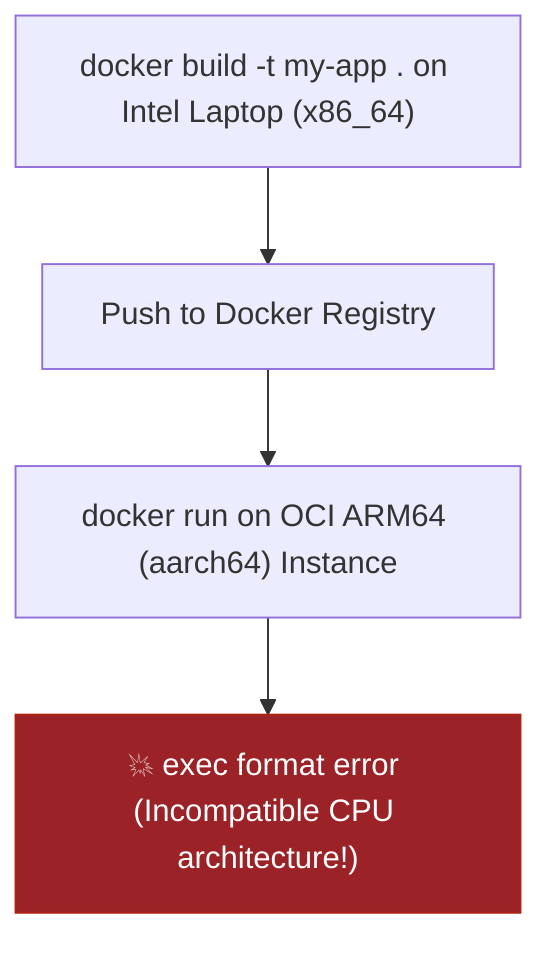
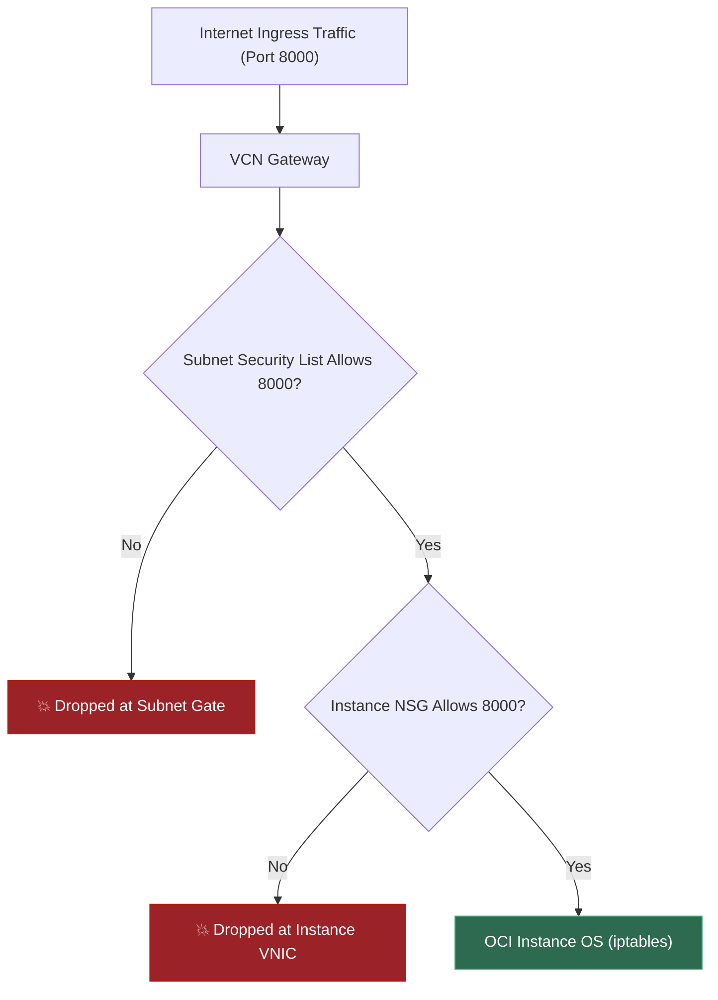
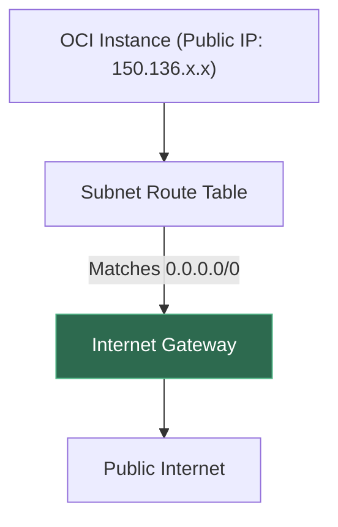
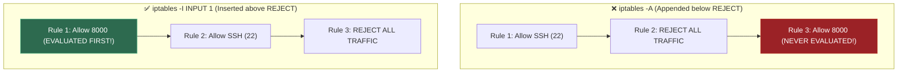
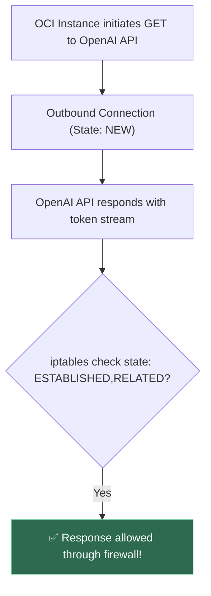
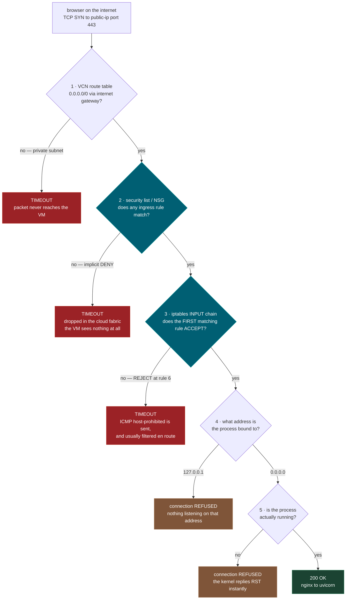
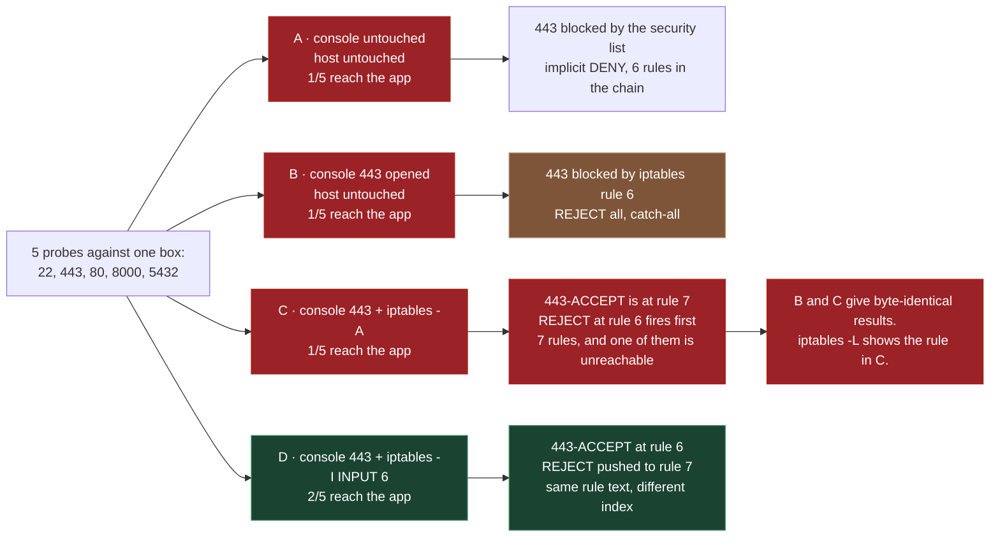
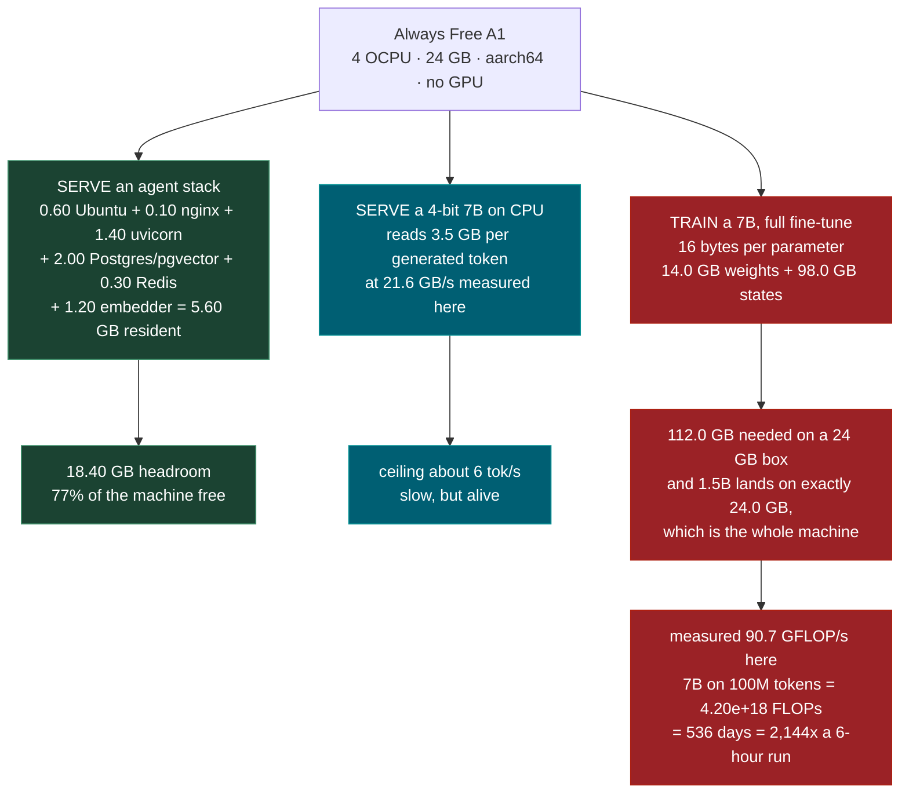
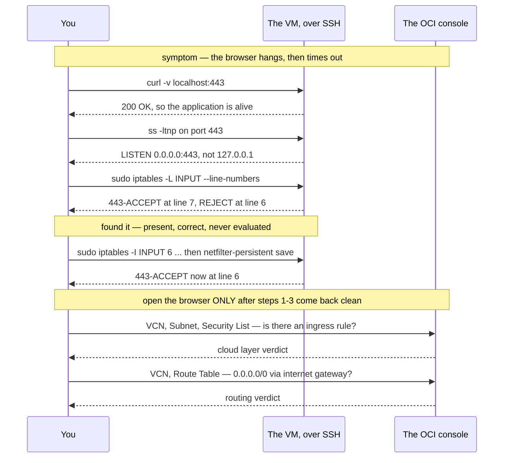

# 0.13 — OCI Compute: Free Tier and Deployment

**Phase 0 · CORE · WORKBENCH · 4 focused hours · Review in 7 days**

**Workbench Track:** Real-world cloud VM deployment in **Oracle Cloud / Linux**. Provision ARM Ampere A1 VMs, configure dual firewalls (Security Lists + `iptables`), manage systemd daemons, and handle `aarch64` cross-platform builds.

---

## 1. Overview

This is the deployment target that gives every **Phase 8** capstone a live public URL. A portfolio of repositories is worth less than a portfolio of repositories *with running demos*, and Oracle's Always Free Ampere A1 allocation — 4 OCPUs and 24 GB of RAM, indefinitely — makes that genuinely zero-cost rather than a trial that expires mid-search.

Two constraints decide almost everything about a first deploy, and both are decided **before** the console is opened. The first is that OCI has **two independent firewalls**: a cloud-side security list and a host-side `iptables` chain. Opening one and not the other produces a service that is running, listening, correct, and completely unreachable, with nothing in any log to say why. The second is that A1 is **aarch64** — an image built on an x86 laptop will not start on it.

**What is real here and what is modelled.** Provisioning a VM cannot happen on a laptop. There is no cloud account, no OCI CLI, and no network access in this script, and pretending otherwise would teach the wrong thing. So the script does something different: it takes the *decisions* that surround provisioning — firewall rules, CIDR ranges, CPU architectures, key file modes, memory budgets — encodes them as data, and **evaluates** them. The firewall evaluator is a faithful model of the two rule engines, not a packet capture. The CIDR arithmetic, the architecture comparison, the OpenSSH permission rule and the memory arithmetic are exact. The throughput numbers in Demo 5 are genuinely measured, on *this* machine, and are labelled as such. §4 gives the real console clicks, the real OCI CLI calls and the real `iptables` syntax so the true commands are on the page too.

Depends on **0.10** (SSH, permissions, `ss`, `tail -f`) and **0.11** (Docker, bind addresses); unlocks **0.12** reverse proxying, **7.11** production deployment, and all five capstones.

---

## 2. Glossary

### 2.1 — Oracle Always Free & Ampere A1 Flex (`aarch64` / `arm64`)

- **Always Free**: Oracle Cloud Infrastructure's (OCI) perpetual non-expiring free allocation (4 Ampere ARM OCPUs and 24 GB RAM).
- **`VM.Standard.A1.Flex`**: Flexible Ampere Altra ARM64 compute shape where CPU/RAM counts are customized at creation.
- **`aarch64` / `arm64`**: The 64-bit ARM CPU architecture (identical instruction set; Linux kernel labels it `aarch64`, Docker labels it `arm64`).

#### 💡 The Beginner Analogy: Custom Gaming PC vs. Pre-built Rig
A fixed shape (like `VM.Standard2.1`) is buying a **pre-built desktop** with fixed RAM. A **Flex shape** is building a **custom PC**: you drag sliders to pick 4 physical ARM cores and 24 GB of RAM. However, ARM cores use a different CPU instruction set — running `x86_64` (Intel/AMD) pre-compiled binaries on ARM is like putting a Nintendo cartridge into a PlayStation!

#### 💻 Code Example & ⚠️ Why It Matters
```bash
# Build multi-architecture Docker images for ARM64 deployment!
docker buildx build --platform linux/amd64,linux/arm64 -t username/my-app:latest --push .
```

##### Verified Output
```text
# Multi-platform build complete: linux/amd64, linux/arm64
```

**Why It Matters**: Pulling raw `x86_64` Docker images onto ARM instances causes `exec format error` crashes at container startup.

#### 🤖 Real-Time AI/ML Use Case
Deploying zero-cost production AI agent backends. OCI's Always Free Ampere A1 (4 ARM OCPUs, 24GB RAM) provides a completely free production VM capable of running FastAPI, PostgreSQL/pgvector, Redis, and NGINX — perfect for hosting agentic workflows without cloud bills.

#### 🎨 Visual Concept



---

### 2.2 — VCN, Security Lists & NSGs

- **VCN (Virtual Cloud Network)**: A isolated software-defined private cloud network where your cloud instances live.
- **Security List**: Firewall rules applied globally across an entire **Subnet**.
- **NSG (Network Security Group)**: Firewall rules applied directly to specific **VNIC (virtual network cards)** of individual instances.

#### 💡 The Beginner Analogy: Gated Community Security
- **VCN**: The perimeter fence surrounding a **gated community neighborhood**.
- **Security List**: The main security gate at the **entrance to the neighborhood street** (Subnet). Applies to every house on the street.
- **NSG**: A private **security guard standing directly outside house #4** (Instance VNIC).

#### 💻 Code Example & ⚠️ Why It Matters
```bash
# OCI CLI rule to open Port 8000 on Security List:
oci network security-list update --security-list-id <id> \
  --ingress-security-rules '[{"protocol": "6", "source": "0.0.0.0/0", "tcpOptions": {"destinationPortRange": {"min": 8000, "max": 8000}}}]'
```

##### Verified Output
```text
# Ingress security rule updated for port 8000 on Security List
```

**Why It Matters**: Traffic must be allowed in **BOTH** the Security List AND the OS `iptables` rules. Opening port 8000 in OCI web console still fails if host `iptables` blocks it!

#### 🤖 Real-Time AI/ML Use Case
Exposing AI inference APIs to the internet. You must open Port 443/8000 in the OCI VCN Security List *and* insert an `iptables` rule on the VM to allow external web applications to send inference requests to your FastAPI server.

#### 🎨 Visual Concept



---

### 2.3 — Internet Gateway & Route Tables

- **Internet Gateway**: A software component attached to a VCN that connects private instances to the public internet.
- **Route Table**: A routing rule table pointing destination IP range `0.0.0.0/0` (all traffic) to the Internet Gateway.

#### 💡 The Beginner Analogy: Highway On-Ramp
Having a public IP address on an instance without a Route Table pointing to an Internet Gateway is like owning a sports car inside a locked garage without an **on-ramp connecting to the public highway**. The car exists, but packets can't get out to the internet.

#### 💻 Code Example & ⚠️ Why It Matters
```text
Destination CIDR: 0.0.0.0/0  ---> Target: Internet Gateway (igw-1)
```

##### Verified Output
```text
Destination CIDR: 0.0.0.0/0 ---> Target: Internet Gateway (igw-1)
```

**Why It Matters**: Absence of an Internet Gateway route causes incoming connection timeouts despite valid public IP addresses.

#### 🤖 Real-Time AI/ML Use Case
Connecting cloud-hosted AI agents to external LLM APIs (OpenAI, Anthropic, HuggingFace). Without an Internet Gateway and `0.0.0.0/0` route table rule, your cloud VM cannot initiate outbound HTTP requests to fetch embeddings or LLM completions.

#### 🎨 Visual Concept



---

### 2.4 — `iptables -I` vs `-A` (First-Match-Wins Trap)

- **`iptables -I INPUT 1`**: **Inserts** a rule at the top (Position 1) of the firewall chain.
- **`iptables -A INPUT`**: **Appends** a rule at the bottom of the chain.
- **First-Match-Wins**: `iptables` evaluates rules sequentially top-to-bottom. The **first** rule that matches a packet decides its fate, and all subsequent rules are ignored!

#### 💡 The Beginner Analogy: Bouncer Rule List Order
Oracle Ubuntu images ship with a default `iptables` rule at the bottom reading: *"REJECT all remaining traffic"*.
- `-A` (Append): Writing *"Allow Port 8000"* **BELOW** the REJECT sign. The bouncer reads the REJECT sign first and kicks you out (`-A` is ignored!).
- `-I` (Insert): Tacking *"Allow Port 8000"* at the **VERY TOP** of the list above the REJECT sign.

#### 💻 Code Example & ⚠️ Why It Matters
```bash
# Correctly inserts rule at line 1 above REJECT
sudo iptables -I INPUT 1 -p tcp --dport 8000 -j ACCEPT
sudo netfilter-persistent save
```

##### Verified Output
```text
# Rule 1 inserted cleanly into INPUT chain
```

**Why It Matters**: The #1 reason developers get locked out of OCI instances or find ports closed despite running `iptables` commands.

#### 🤖 Real-Time AI/ML Use Case
Opening ports for custom AI endpoints on Oracle Linux/Ubuntu VMs. Using `iptables -A INPUT` appends your ACCEPT rule *below* Oracle's default REJECT rule, keeping port 8000 silently blocked. Using `iptables -I INPUT 1` inserts your rule at the top so inference traffic gets through.

#### 🎨 Visual Concept



---

### 2.5 — `ESTABLISHED,RELATED` Connection Tracking

An `iptables` stateful firewall rule that permits incoming response packets for outbound connections initiated by the host instance.

#### 💡 The Beginner Analogy: Ordering Pizza Delivery
When you call a pizza shop to order food (outbound connection initiated by you), you expect the delivery driver to arrive at your front door 30 minutes later. The `ESTABLISHED,RELATED` rule tells the front door security: *"If a delivery driver arrives with food we ordered, let them in automatically!"*

#### 💻 Code Example & ⚠️ Why It Matters
```bash
sudo iptables -A INPUT -m state --state ESTABLISHED,RELATED -j ACCEPT
```

##### Verified Output
```text
# Rule added: ACCEPT ESTABLISHED,RELATED input packets
```

**Why It Matters**: Explains why a host with closed inbound ports can still make outbound `pip install` or API requests and receive responses cleanly.

#### 🤖 Real-Time AI/ML Use Case
Allowing AI servers to stream response tokens from external LLM APIs. The `ESTABLISHED,RELATED` rule ensures that when your FastAPI server initiates an outbound API call to OpenAI, incoming SSE response token streams are allowed back through the host firewall.

#### 🎨 Visual Concept



---

## 3. Skip Test — Answered

> Gate **before** studying. Both correct from memory → skip. §7 withholds its answers deliberately.

**① State how you would open port 443 to the internet on an OCI VM.**

Two edits in two different places, and neither one alone is enough.

**Cloud layer**, in the console: *Networking → Virtual Cloud Networks → your VCN → Subnets → your subnet → Security List → Add Ingress Rule*, with Source Type `CIDR`, Source `0.0.0.0/0`, IP Protocol `TCP`, Destination Port Range `443`, Stateless unchecked. (An NSG attached to the VNIC does the same job; rules from security lists and NSGs are evaluated as a union.)

**Host layer**, over SSH on the instance itself — Oracle's Ubuntu images ship with a populated `iptables` chain:

```bash
sudo iptables -I INPUT 6 -m state --state NEW -p tcp --dport 443 -j ACCEPT
sudo netfilter-persistent save
```

The `-I INPUT 6` matters more than it looks. Demo 1 evaluates four configurations of the same box against the same five probes. Configuration **B** (console rule added, host untouched) and configuration **C** (console rule added, host rule appended with `-A`) produce **byte-identical** probe results — **1/5** probes reach the application in both. In C the 443-ACCEPT rule *exists*, reads correctly, and appears in `iptables -L`; it lands at **rule 7**, and the catch-all `REJECT` is at **rule 6**. First match wins, so rule 7 is never evaluated. Configuration **D** inserts the same rule at position 6, pushing REJECT to 7, and **2/5** probes get through. One integer is the difference between reachable and not.

Two more things must also be true or the port is still dead: the subnet's route table needs `0.0.0.0/0` via an internet gateway, and the application must bind `0.0.0.0`, not `127.0.0.1` (**0.11**).

**② Explain why an Always Free A1 instance suits an agent backend but not model training.**

Because an agent backend's biggest tenant — the model weights — lives in somebody else's RAM. The LLM is an API call to a provider (**Phase 4**), so the box only has to hold the plumbing. Demo 5 itemises a full capstone stack and sums it: Ubuntu base 0.60 GB, nginx 0.10 GB, four uvicorn workers 1.40 GB, Postgres with pgvector 2.00 GB, Redis 0.30 GB, a CPU sentence-transformers embedder 1.20 GB — **5.60 GB resident, leaving 18.40 GB of headroom, 77% of the machine free**.

Training inverts every term. A full fine-tune in mixed precision costs 16 bytes per parameter before activations: fp16 weights 2 + fp16 grads 2 + fp32 master 4 + Adam *m* 4 + Adam *v* 4. Demo 5 computes that a 7B model needs **14.0 GB of weights plus 98.0 GB of optimizer state and gradients = 112.0 GB**, against a 24 GB machine. The 1.5B row lands on **exactly 24.0 GB** — the entire machine, with nothing left for activations, the OS or the dataset loader, so it fails one step later rather than passing.

And there is no GPU at all. The script measures this machine at **90.7 GFLOP/s** of fp32 matmul, then applies the standard `6 · N · D` estimate: fine-tuning 7B on 100M tokens is **4.20e+18 FLOPs**, which at that rate is **536 days — 2,144x a tolerable 6-hour run**, about three orders of magnitude. Expect a different number: this benchmarks whatever machine you run it on, under whatever load it happens to be carrying, and a second run here measured 251 days. That two-fold spread is precisely why the claim is *three orders of magnitude* and not a day count — the conclusion survives the measurement being wrong by a factor of ten.

The same box gets the opposite verdict on inference, and that contrast is the useful part. Generation is memory-bandwidth bound — each token reads every weight once — so a 4-bit 7B (**4.12**) reading **3.5 GB per token** at the measured **21.6 GB/s** tops out around **6 tok/s**. Slow, but alive. Training misses by orders of magnitude; local CPU inference misses by a small factor.

---

## 3. Visual Concept Diagrams

### 3.1 — Five gates, and only two of them are in the console

Read top to bottom. A packet must clear every gate; the colour tells you what the client sees when it does not.



### 3.2 — Four configurations of one box, at the measured probe counts

The rule in configuration C is present, correct, and dead. Nothing warns you.



### 3.3 — One machine, three workloads, three different answers

Every number below is printed by Demo 5.



### 3.4 — The diagnostic ladder, cheapest evidence first

Three of Demo 6's six configurations produce the identical symptom, so the symptom cannot pick the layer. Work up from the box instead of guessing in the browser.



---

## 4. Core Technical Deep Dive

### 4.1 What Always Free actually includes

| Resource | Allocation | Note |
|---|---|---|
| `VM.Standard.A1.Flex` | 4 OCPU + 24 GB **total**, splittable across up to 4 instances | Ampere Altra, **aarch64** |
| `VM.Standard.E2.1.Micro` | 2 instances, 1/8 OCPU + 1 GB each | x86_64 — the escape hatch if arm64 blocks you |
| Block storage | 200 GB total, boot volumes included | Fills faster than expected — see **0.10** on `du` |
| Outbound transfer | 10 TB/month | Not the binding constraint for an agent API |
| Cost | Genuinely free, indefinitely, within the allocation | Not a trial |

Demo 5 validates splits against that pool: `4 OCPU/24 GB` fits, `2 OCPU/12 GB + 2 OCPU/12 GB` fits, and `4 OCPU/24 GB + 1 OCPU/6 GB` totals 5 OCPU/30 GB and **exceeds — billed**. The pool is shared across instances, so a second box is carved out of the first one's allocation, not added to it.

**"Out of host capacity" is expected, not a misconfiguration.** A1 shapes are frequently unavailable in popular regions. Retrying at off-peak hours or picking a different availability domain usually resolves it.

### 4.2 Provisioning, in the console and on the CLI

Console path: *Compute → Instances → Create instance*. Shape `VM.Standard.A1.Flex` at 4 OCPU / 24 GB; image Canonical Ubuntu 22.04 or Oracle Linux; networking in a **public** subnet with "Assign a public IPv4 address" checked; and paste the contents of the **`.pub`** file into the SSH keys box.

The same thing without the browser:

```bash
oci session authenticate                     # or: oci setup config
oci iam compartment list --all

oci compute image list \
  --compartment-id "$C" \
  --operating-system "Canonical Ubuntu" \
  --shape VM.Standard.A1.Flex

oci compute instance launch \
  --compartment-id "$C" \
  --availability-domain "abcd:AP-MUMBAI-1-AD-1" \
  --shape VM.Standard.A1.Flex \
  --shape-config '{"ocpus":4,"memoryInGBs":24}' \
  --image-id "$IMG" \
  --subnet-id "$SUBNET" \
  --assign-public-ip true \
  --ssh-authorized-keys-file ~/.ssh/oci_ed25519.pub \
  --wait-for-state RUNNING
```

`--shape-config` is required for any `.Flex` shape — a flexible shape has no fixed size, so omitting it is an error rather than a default.

### 4.3 Layer 1 — the cloud firewall, and two details in its syntax

Security lists attach to a **subnet**; network security groups attach to a **VNIC**. If both apply, the rules are evaluated as a **union** — any matching allow admits the packet, and order is meaningless. That is the exact opposite of `iptables` below, and holding one mental model for both layers is how a correct-looking host rule ends up unreachable.

Adding ingress on the CLI means resending the whole rule set, because the update replaces rather than appends:

```bash
cat > ingress.json <<'JSON'
[
  { "source": "0.0.0.0/0", "sourceType": "CIDR_BLOCK", "protocol": "6",
    "isStateless": false,
    "tcpOptions": { "destinationPortRange": { "min": 22, "max": 22 } } },
  { "source": "0.0.0.0/0", "sourceType": "CIDR_BLOCK", "protocol": "6",
    "isStateless": false,
    "tcpOptions": { "destinationPortRange": { "min": 443, "max": 443 } } }
]
JSON

oci network security-list update \
  --security-list-id "$SL" --ingress-security-rules file://ingress.json --force
```

Two details in that JSON cost real time. **`protocol` is an IANA number, not a name**: `"6"` is TCP, `"17"` is UDP, `"1"` is ICMP, `"all"` is everything. And **`isStateless: false` is what you want** — a stateful rule uses connection tracking so the reply traffic is automatically permitted; a stateless rule requires you to write the matching egress rule yourself, and forgetting it produces a connection that opens and then hangs.

### 4.4 Layer 2 — the host firewall, where order is everything

Oracle's Ubuntu images ship with a populated `iptables` INPUT chain — unusual for a cloud image, and the reason "I opened the port in the console" is not enough. Demo 1 reproduces that chain as data:

```
1  ACCEPT  all   ESTABLISHED,RELATED
2  ACCEPT  icmp
3  ACCEPT  all   in:lo
4  ACCEPT  udp   spt:123
5  ACCEPT  tcp   NEW  dpt:22
6  REJECT  all   (catch-all)
```

Rule 1 explains why a misconfigured box *feels* healthy: outbound `apt-get update` works perfectly, because its replies are ESTABLISHED. Only inbound NEW connections die. Rule 6 is why append is the wrong verb:

```bash
sudo iptables -L INPUT --line-numbers -n        # read the NUMBERS, not just the text
sudo iptables -I INPUT 6 -m state --state NEW -p tcp --dport 443 -j ACCEPT
sudo netfilter-persistent save                  # iptables-persistent; survives reboot
```

Oracle Linux images use `firewalld` instead:

```bash
sudo firewall-cmd --permanent --add-port=443/tcp
sudo firewall-cmd --reload
```

### 4.5 The architecture constraint

`platform.machine()` on the build machine decides what `docker build .` produces, and Demo 3 reports `'AMD64' -> amd64` here against A1's `linux/arm64`. Of the four image/host combinations it evaluates, **2 of 4 fail**, and the failure message is `exec /usr/local/bin/uvicorn: exec format error` — which reads like a corrupt binary and is actually a CPU instruction set. Three fixes, cheapest first:

```bash
# 1. Build ON the VM. The question never arises.
git clone https://github.com/you/capstone-c4.git && cd capstone-c4
docker compose up -d --build

# 2. Cross-build from the laptop via QEMU emulation. Correct, and slower.
docker buildx build --platform linux/arm64 -t app:arm64 .

# 3. Multi-arch manifest; the VM pulls the variant it can run.
docker buildx build --platform linux/amd64,linux/arm64 -t you/app:1.0 --push .
```

Pinned base images are the follow-on trap: not every tag publishes an arm64 variant, so a `FROM` line that resolves on the laptop can fail with `no matching manifest` on the VM.

### 4.6 Keys, and shipping the code

```bash
ssh-keygen -t ed25519 -C "oci-deploy" -f ~/.ssh/oci_ed25519
chmod 700 ~/.ssh && chmod 600 ~/.ssh/oci_ed25519      # 0.10 — both paths
ssh -i ~/.ssh/oci_ed25519 ubuntu@<public-ip>          # opc@ on Oracle Linux

sudo apt-get update && sudo apt-get install -y docker.io docker-compose-plugin
sudo usermod -aG docker $USER && newgrp docker

cp .env.example .env && vi .env        # secrets live here only, never in git (0.4)
docker compose up -d --build           # 0.11

sudo apt-get install -y certbot python3-certbot-nginx
sudo certbot --nginx -d api.example.com      # issues and wires into the 0.12 config
sudo certbot renew --dry-run                 # the renewal timer is installed for you
```

`certbot --nginx`## 5. Hands-On Real-World Terminal Drills (Cloud VM Deployment & systemd)

Do not run Python scripts to simulate cloud infrastructure. Sign up for the Oracle Cloud Always Free tier (or AWS/GCP free tier) and execute these 6 real-world drills:

---

### Drill 1 — Generating SSH Key Pair & Connecting to Your Cloud VM

```bash
# 1. Generate an Ed25519 key pair locally on your machine
ssh-keygen -t ed25519 -f ~/.ssh/oci_ed25519 -C "ai-engineer-deploy"

# 2. Set strict local permissions (Mandatory for SSH clients)
chmod 700 ~/.ssh
chmod 600 ~/.ssh/oci_ed25519
chmod 644 ~/.ssh/oci_ed25519.pub

# 3. Paste the PUBLIC key (oci_ed25519.pub) into the OCI Console when creating the Ampere VM
# NEVER paste the private key (oci_ed25519)!

# 4. Connect to your instance over SSH:
ssh -i ~/.ssh/oci_ed25519 ubuntu@<YOUR_INSTANCE_PUBLIC_IP>
```

---

### Drill 2 — Resolving the Dual Firewall Trap (Security List + `iptables`)

```bash
# 1. In OCI Web Console:
#    Go to: VCN > Virtual Cloud Networks > Security Lists > Default Security List
#    Add Ingress Rules:
#      - Source CIDR: 0.0.0.0/0, IP Protocol: TCP, Destination Port: 80
#      - Source CIDR: 0.0.0.0/0, IP Protocol: TCP, Destination Port: 443

# 2. SSH into your Ubuntu VM. Check existing iptables rules:
sudo iptables -L INPUT --line-numbers

# 3. CRITICAL: Insert (not Append -A) the ACCEPT rules BEFORE the final REJECT rule (typically line 6)
sudo iptables -I INPUT 6 -p tcp --dport 80 -m state --state NEW -j ACCEPT
sudo iptables -I INPUT 6 -p tcp --dport 443 -m state --state NEW -j ACCEPT

# 4. Make iptables rules persistent across reboots:
sudo apt-get install -y iptables-persistent
sudo netfilter-persistent save
```

---

### Drill 3 — Handling `aarch64` Cross-Architecture Docker Builds

Oracle Always Free Ampere A1 uses ARM64 (`aarch64`). If building Docker images on an x86 laptop:

```bash
# 1. Option A (Recommended): Build directly on the ARM VM
# Clone your repo on the VM and run:
docker build -t ai-service:v1 .

# 2. Option B: Multi-platform buildx on your laptop
docker buildx create --use
docker buildx build --platform linux/arm64 -t yourdockerhub/ai-service:arm64 --push .
```

---

### Drill 4 — Creating a Resilient `systemd` Production Service

Manage your AI FastAPI service as a background Linux daemon with automatic restarts:

```bash
# 1. Create a systemd unit file
sudo nano /etc/systemd/system/fastapi-app.service
```

Paste the following configuration:

```ini
[Unit]
Description=FastAPI LLM Inference Service
After=network.target

[Service]
User=ubuntu
WorkingDirectory=/home/ubuntu/ai-app
ExecStart=/home/ubuntu/ai-app/.venv/bin/uvicorn main:app --host 127.0.0.1 --port 8000 --workers 4
Restart=always
RestartSec=3s
EnvironmentFile=/home/ubuntu/ai-app/.env

# Security Sandbox Hardening
PrivateTmp=true
NoNewPrivileges=true

[Install]
WantedBy=multi-user.target
```

```bash
# 2. Reload systemd daemon & start the service:
sudo systemctl daemon-reload
sudo systemctl enable --now fastapi-app.service

# 3. Check service health & inspect logs:
sudo systemctl status fastapi-app.service
sudo journalctl -u fastapi-app.service -f
```

---

### Drill 5 — The 5-Step Connectivity Diagnostic Ladder

If your public endpoint times out, run these 5 checks in order to isolate the exact failing layer:

```bash
# STEP 1: Is the app listening on localhost? (Tests application logic)
curl -v http://localhost:8000/health

# STEP 2: Is it bound to 127.0.0.1 or 0.0.0.0?
ss -ltnp | grep :8000

# STEP 3: Is NGINX listening on port 80/443?
curl -v http://localhost/health

# STEP 4: Inspect host firewall rule line numbers (Tests host iptables)
sudo iptables -L INPUT --line-numbers

# STEP 5: From your laptop, test TCP handshake to the VM's public IP:
nc -zv <YOUR_PUBLIC_IP> 443
```

---

## 6. Video

**[VERIFY]** — no OCI Always Free deployment walkthrough was confirmed currently live in this pass, and the OCI console UI changes often enough that a stale walkthrough is actively misleading about where the buttons are. Inventing a title would be worse than saying so.

Use the authoritative documentation instead, in this order:

- Oracle's **Always Free Resources** page (`docs.oracle.com/en-us/iaas/Content/FreeTier/freetier_topic-Always_Free_Resources.htm`) for the exact current allocation — it is the one figure on this page that Oracle can change, so check it rather than trusting a remembered number.
- **Security Lists** and **Network Security Groups** under Networking in the same documentation set, specifically the stateful-versus-stateless section and the protocol-number table.
- `man iptables` on any Linux box for `-I` versus `-A`, and `man iptables-extensions` for `-m state`.
- Docker's **multi-platform images** documentation for `buildx --platform`, which is the same page **0.11** points at.

---

## 7. Retrieval Checkpoint — Unanswered

> Close this file. No notes. Answers deliberately withheld.

1. A colleague reports that they opened 443 in the OCI console, the container is running, and the site still times out. Name every layer you would check and the exact command or console path for each, in the order that costs the least evidence first.
2. `sudo iptables -L INPUT` shows an `ACCEPT tcp dpt:443` rule and the port is still unreachable. Explain the mechanism, the one flag you would add to the listing command to see it, and the one-character change to the rule that fixes it.
3. Your browser reports `connection refused` rather than a timeout. What does that single word rule *out*, and why is it better news than a hang?
4. An image built on an x86 laptop fails on the A1 with `exec format error`. Give three ways to fix it, ranked by effort, and say what a pinned base image can do to two of them.
5. Give the memory cost per parameter for a full mixed-precision fine-tune and derive whether a 7B model fits in 24 GB. Then explain why the answer would still be no if it did fit.

---

## 8. Closed-Book Rebuild

With this file **and** the script closed, write the full sequence that takes a capstone repository from a Git remote to a public HTTPS URL on Always Free: choose the shape and image and say why the shape name matters; generate an SSH key pair, set the permissions on both the key and its directory, and state which file is pasted into the console; open 443 at **both** firewall layers, giving the console path for one and the exact command for the other including its position argument; confirm the route table and the bind address; install Docker; bring the stack up in a way that sidesteps the architecture problem entirely; and issue a certificate, naming the extra port that has to be open for the challenge to succeed.

Then, separately, write the five-step diagnostic ladder for "it times out and there is nothing in any log", ordered cheapest evidence first, and say for each step what a clean result eliminates.

---

## Review again in

**7 days.** Two things are worth carrying out of this and both cost real hours the first time: the **second firewall layer** — specifically that a rule can be present, correct, and dead at position 7 — and the **aarch64 constraint**, which is decided by a string comparison before anything is pushed. Add a third if you plan a capstone around it: **5.60 GB versus 112.0 GB** on the same 24 GB box is the whole serve-versus-train boundary in two numbers. **7.11** is this topic with a CI pipeline in front of it.
