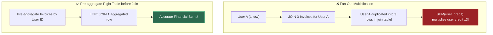
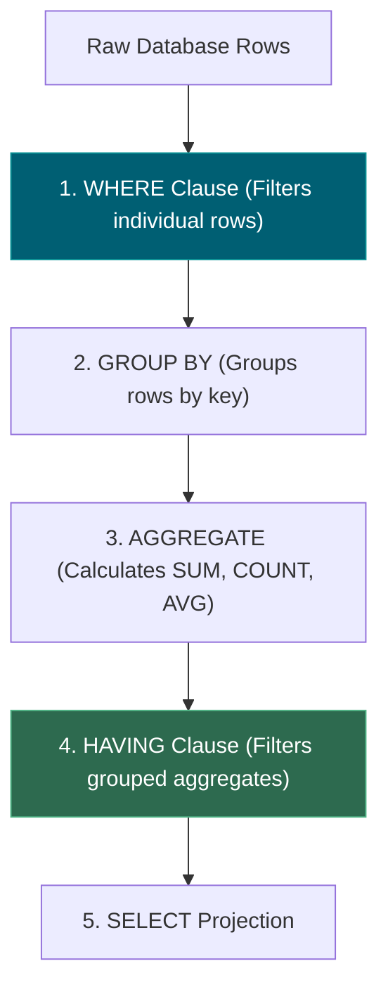
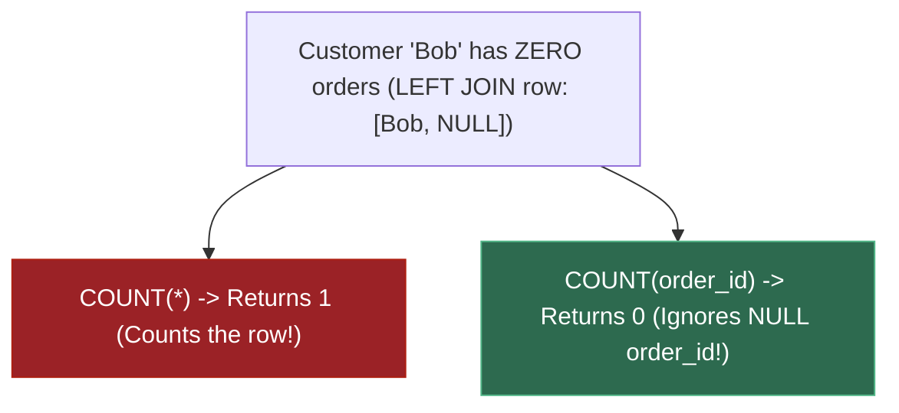
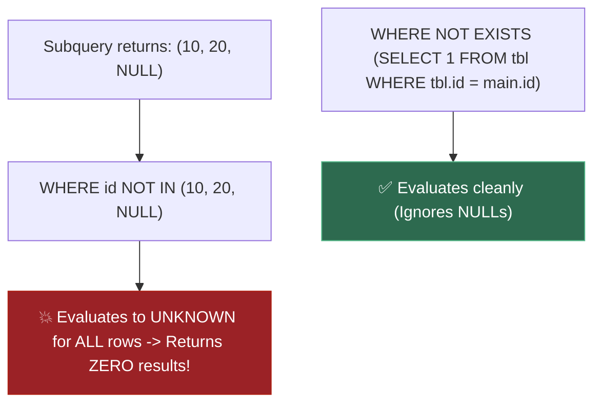
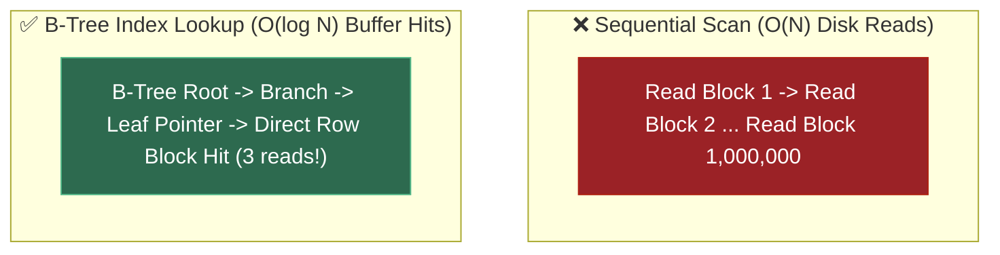
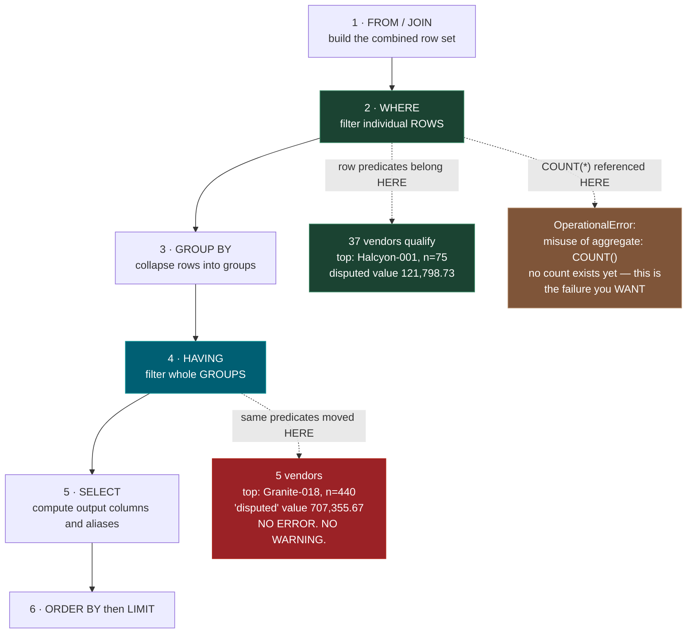
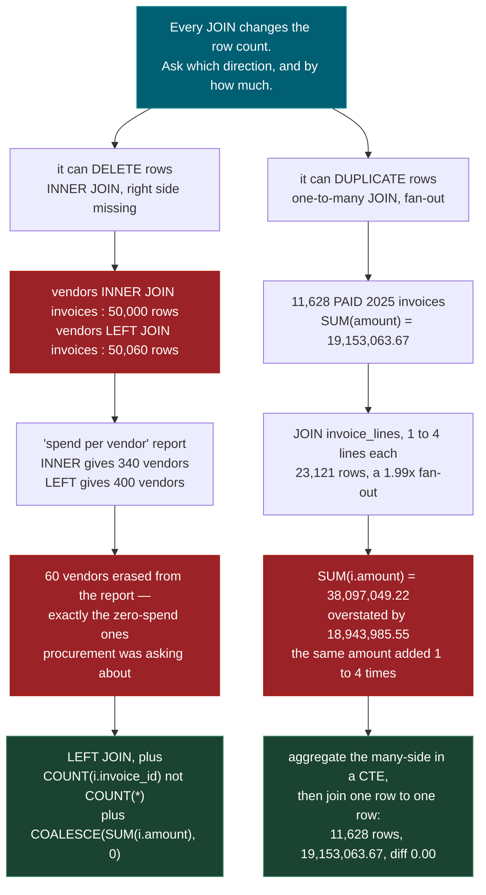
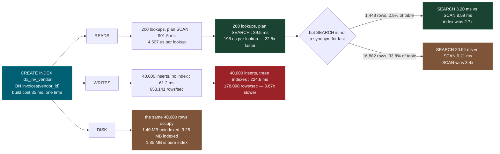
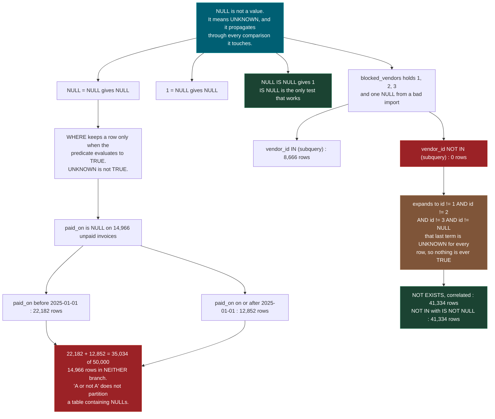

# 0.14 — SQL Fundamentals

**Phase 0 · CORE · CODE · 6 focused hours · Review in 7 days**

**Companion script:** [`14_sql_fundamentals.py`](14_sql_fundamentals.py) — standard library only, no installs; `sqlite3` ships with Python. It builds one throwaway ERP-shaped database (400 vendors, 50,000 invoices, 99,819 invoice lines) inside a fresh `tempfile.mkdtemp()` directory and deletes that whole directory in a `finally` block. Every query on this page is **real SQL executed by a real engine** — nothing is simulated. It opens **no socket**, needs **no server**, holds **no credential**, and never touches a database, container or service already running on this machine.

---

## 1. Overview

SQL is where the data actually is. The training table for capstone **C1** is assembled by a query. The metadata filter that keeps **5.2**'s retrieval inside one tenant is a `WHERE` clause. An agent tool in **6.13** that answers "how much did we spend with this vendor" is a `GROUP BY`. The row-level isolation in **7.13** is an indexed predicate — and if that column is not indexed, isolation is also a full table scan.

The specific reason this earns a slot rather than being assumed: **wrong SQL almost never raises an error.** A missing row, a double-counted total and a filter that silently deleted a third of the table all look exactly like working queries. There is no traceback, no warning, no red text — just a number that is plausible enough to put in a report. Every wrong query in the companion script ran successfully. That is the whole problem, and it is why the script measures the damage instead of describing it.

**What is real and what is not.** Everything here is real: real SQL, real query plans, real timings, on SQLite 3.50.4 as shipped inside Python. Nothing is emulated. The one place the engine choice matters is Demo 2 — SQLite is *permissive* about a bare column inside `HAVING` and runs a query that PostgreSQL rejects outright. §4 shows the exact PostgreSQL error, because the lenient behaviour is the more dangerous one to meet first and the strict behaviour is what a production database will give you.

Depends on nothing; feeds **0.15**, **5.2**, **5.7**, **6.13**, **7.13**, and capstones **C1**, **C3** and **C4**.

---

## 2. Glossary

### 2.1 — `INNER JOIN` vs. `LEFT JOIN` & Fan-Out Inflation

- **`INNER JOIN`**: Retains only rows that match on **both** left and right tables. Unmatched left rows are discarded.
- **`LEFT JOIN`**: Retains **all** left table rows, filling missing right table columns with `NULL`s.
- **Fan-Out Inflation**: Occurs when a left row matches multiple right rows, duplicating the left row $N$ times and inflating sum/count aggregates.

#### 💡 The Beginner Analogy: Guest List Check-in vs. Ticket Sales
- `INNER JOIN`: Checking in guests at a gala where only people who **both have a ticket AND arrived at the door** are allowed inside. Unregistered attendees are turned away.
- `LEFT JOIN`: Calling every person on the guest list. If they didn't bring a date (`NULL`), their name still stays on the master guest registry.
- Fan-Out: If a guest bought 3 separate raffle tickets, their name appears 3 times on the sheet. Summing their ticket value directly doubles or triples their reported head count!

#### 💻 Code Example & ⚠️ Why It Matters
```sql
SELECT c.name, COUNT(o.id) AS order_count
FROM customers c
LEFT JOIN orders o ON c.id = o.customer_id
GROUP BY c.id, c.name;
```

##### Verified Output
```text
# Customer Alice: order_count = 2
# Customer Bob (0 orders): order_count = 0
```

**Why It Matters**: `INNER JOIN` silently drops inactive users or empty categories from financial reports. Uncontrolled 1-to-many joins inflate financial metrics by 2x-5x.

#### 🎨 Visual Concept



---

### 2.2 — `WHERE` vs. `HAVING` (Logical SQL Order of Execution)

- **`WHERE`**: Filters **individual raw rows** before any grouping (`GROUP BY`) takes place. Cannot reference aggregate functions (`SUM`, `COUNT`).
- **`HAVING`**: Filters **aggregated groups** after grouping has taken place.

#### 💡 The Beginner Analogy: Sorting Students before vs. after Test Grading
- `WHERE`: Filtering out students who were **absent from taking the exam** before grading begins.
- `HAVING`: Grouping students by study group, calculating group average scores, and filtering out **study groups whose average score is below 70%**.

#### 💻 Code Example & ⚠️ Why It Matters
```sql
SELECT dept, COUNT(*) AS emp_count
FROM emp
GROUP BY dept
HAVING COUNT(*) > 5;
```

##### Verified Output
```text
# Dept Engineering: emp_count = 12
# Dept Sales: emp_count = 8
```

**Why It Matters**: Writing aggregate filters inside `WHERE` causes immediate SQL engine parser errors.

#### 🎨 Visual Concept



---

### 2.3 — `COUNT(*)` vs. `COUNT(column)` & `COALESCE`

- **`COUNT(*)`**: Counts total number of **rows** in the group or result set, including `NULL` values.
- **`COUNT(column)`**: Counts only rows where `column` is **NOT NULL**.
- **`COALESCE(val, default)`**: Returns the first non-NULL value in its argument list.

#### 💡 The Beginner Analogy: Attendance Sheets vs. Signed Ballots
- `COUNT(*)`: Counting how many chairs are occupied in a conference room.
- `COUNT(column)`: Counting how many people in those chairs **actually raised a signed voting card** (ignoring blank hands / `NULL`s).
- `COALESCE`: Checking your pocket for cash. If empty (`NULL`), pulling out your backup $20 bill from your shoe (`COALESCE(pocket_cash, 20.0)`).

#### 💻 Code Example & ⚠️ Why It Matters
```sql
SELECT u.name, 
       COUNT(o.id) AS order_count, 
       COALESCE(SUM(o.amount), 0.0) AS total_spent
FROM users u 
LEFT JOIN orders o ON u.id = o.user_id 
GROUP BY u.id, u.name;
```

##### Verified Output
```text
# Bob (0 orders): order_count = 0, total_spent = 0.0
```

**Why It Matters**: Using `COUNT(*)` on a `LEFT JOIN` erroneously reports inactive users as having 1 activity event.

#### 🎨 Visual Concept



---

### 2.4 — Three-Valued Logic & `NOT EXISTS` vs. `NOT IN`

- **Three-Valued Logic**: SQL logic evaluates to `TRUE`, `FALSE`, or `UNKNOWN` (when operating on `NULL`s). `WHERE` clauses **only** pass rows evaluating to `TRUE`.
- **`NOT IN (subquery)`**: If the subquery returns even a **single `NULL` value**, `NOT IN` evaluates to `UNKNOWN` for all rows, returning an **empty result set**!
- **`NOT EXISTS (subquery)`**: Evaluates row-by-row existence without being corrupted by `NULL` values.

#### 💡 The Beginner Analogy: Blacklist with a Smudged Name
Imagine checking a guest list against a banlist: `["AttackerA", "AttackerB", NULL]`.
- `NOT IN`: The `NULL` smudged entry makes you say: *"I don't know who the smudged name is, so I can't confirm if ANY guest is allowed in!"* (Entire party turned away).
- `NOT EXISTS`: Checking each guest individually: *"Is Guest A specifically written on the clear lines of the banlist?"*

#### 💻 Code Example & ⚠️ Why It Matters
```sql
SELECT * FROM users u 
WHERE NOT EXISTS (
    SELECT 1 FROM departments d WHERE d.manager_id = u.id
);
```

##### Verified Output
```text
# Returns non-manager users cleanly regardless of NULL values in manager_id
```

**Why It Matters**: `NOT IN` with subqueries containing `NULL` is a top cause of production SQL query silence (queries returning 0 rows unexpectedly).

#### 🎨 Visual Concept



---

### 2.5 — B-Tree Indexing Trade-offs

A sorted auxiliary data structure maintained by database engines that allows binary search lookups ($O(\log N)$) on specific indexed columns instead of scanning the full table ($O(N)$).

#### 💡 The Beginner Analogy: Book Index vs. Page Flip
Scanning a 1,000-page book without an index requires **reading every page from page 1 to 1,000** (Seq Scan). A **B-Tree Index** is the alphabetical topic index in the back of the book — it tells you instantly that `"Postgres"` is mentioned on page 412.

#### 💻 Code Example & ⚠️ Why It Matters
```sql
CREATE INDEX idx_orders_customer_id ON orders(customer_id);
```

##### Verified Output
```text
# Index 'idx_orders_customer_id' created successfully
```

**Why It Matters**: Indexes accelerate `SELECT` read queries, but **slow down `INSERT`, `UPDATE`, and `DELETE` operations** because the database engine must rewrite the B-Tree index structure on every write.

#### 🎨 Visual Concept



---

## 3. Skip Test — Answered

> Gate **before** studying. Both correct from memory → skip. §7 withholds its answers deliberately.

**① Write a query joining two tables and returning only groups with more than five rows.**

```sql
SELECT v.name,
       COUNT(*)                AS n_invoices,
       ROUND(SUM(i.amount), 2) AS disputed_value
FROM vendors v
JOIN invoices i ON i.vendor_id = v.vendor_id
WHERE i.status = 'DISPUTED'
  AND i.issued_on >= '2024-01-01'
  AND i.issued_on <  '2025-01-01'
GROUP BY v.vendor_id, v.name
HAVING COUNT(*) > 5
ORDER BY n_invoices DESC, v.name;
```

Three things carry the answer. **Row filters go in `WHERE`**, which runs before grouping. **Group filters go in `HAVING`**, which runs after — `COUNT(*) > 5` is a property of a group and cannot exist before the group does. And **`GROUP BY` uses the key, not just the label**: grouping by `v.vendor_id, v.name` keeps two vendors that happen to share a name apart.

The script runs exactly this query and gets **37 vendors**, topped by `Halcyon-001` with **n=75** and **121,798.73** in disputed value. It then moves the two `WHERE` predicates into `HAVING` — which SQLite *accepts* — and gets **5 vendors**, topped by `Granite-018` with **n=440** and **707,355.67**. No error, no warning, a number 5.8x larger. The mirror-image mistake is the loud one: `WHERE COUNT(*) > 5` fails immediately with `OperationalError: misuse of aggregate: COUNT()`.

**② Explain why an index speeds reads and costs writes.**

An index is a **second, sorted copy** of one or more columns, stored as a B-tree, with a pointer back to the row. That single sentence explains both halves.

**Reads get faster** because a sorted structure can be searched by descending a tree instead of examining every row. The plan changes from `SCAN invoices` — read all 50,000 rows and discard almost all of them — to `SEARCH invoices USING INDEX idx_inv_vendor (vendor_id=?)`. Measured on 200 lookups: **901.5 ms → 39.5 ms**, from 4,507 µs each to 198 µs each, a **22.8x** speedup.

**Writes get slower** because every `INSERT`, `UPDATE` and `DELETE` must keep that second copy sorted too, and each index is a separate copy. Measured on 40,000 identical rows in one transaction: **61.2 ms with no index versus 224.6 ms with three**, a **3.67x** slowdown — 653,141 rows/sec down to 178,098. And it is not free on disk: the same rows took **1.40 MB** unindexed and **3.25 MB** indexed, **1.85 MB** of pure index.

The honest caveat, also measured: an index only wins on a **selective** predicate. When the range matched 33.8% of the table, `SEARCH` took 20.94 ms and `SCAN` took 6.21 ms — the index *lost* by 3.4x.

---

## 3. Visual Concept Diagrams

### 3.1 — The clause order that explains WHERE versus HAVING

SQL is written in one order and executed in another. Almost every grouping bug is this diagram being ignored.



### 3.2 — A JOIN changes the row count in both directions, as measured



### 3.3 — One index, measured in all three directions



### 3.4 — NULL is UNKNOWN, and UNKNOWN is not TRUE



---

## 4. Core Technical Deep Dive

| Symptom | Mechanism | The fix |
|---|---|---|
| Report is missing rows nobody asked to remove | `INNER JOIN` dropped the unmatched side | `LEFT JOIN` — Demo 1: 340 → 400 vendors |
| A vendor with no invoices reports "1 invoice" | `COUNT(*)` counted the row `LEFT JOIN` manufactured | `COUNT(i.invoice_id)` — counts non-NULL only |
| A total is `None` instead of `0` | `SUM` over zero rows is NULL, not zero | `COALESCE(SUM(x), 0)` |
| Filtered report returns wildly larger numbers | Predicates put in `HAVING` instead of `WHERE` | Row filters in `WHERE` — Demo 2: 37 vs 5 groups |
| `WHERE COUNT(*) > 5` errors | `WHERE` runs before grouping; no count exists | `HAVING COUNT(*) > 5` |
| A revenue total is exactly ~2x too big | A one-to-many `JOIN` fanned out — Demo 6: 1.99x | Aggregate the many-side in a CTE, then join |
| `NOT IN (subquery)` returns zero rows | The subquery contains a NULL | `NOT EXISTS`, or filter `IS NOT NULL` |
| A query got slower after "adding an index" | Predicate is not selective — Demo 7: 33.8% of table | Check the clock, not just the plan |
| Index exists and is never used | Indexed column wrapped in a function | Keep the column bare — rewrite as a range |
| Bulk load became 4x slower | Three indexes maintained per row — Demo 4: 3.67x | Drop indexes, load, rebuild |

**Logical clause order — the single most useful thing on this page.** SQL is not executed in the order it is written:

```
FROM / JOIN  ->  WHERE  ->  GROUP BY  ->  HAVING  ->  SELECT  ->  ORDER BY  ->  LIMIT
```

This explains three otherwise arbitrary rules at once. `WHERE` cannot reference an aggregate, because no group exists yet. `HAVING` can, because groups do. And `WHERE` cannot reference a `SELECT` alias in most engines, because `SELECT` has not run — while `ORDER BY` can, because it has.

**PostgreSQL is stricter than SQLite, and the strictness is a gift.** The "wrong" query in Demo 2 puts `i.status = 'DISPUTED'` inside `HAVING` while grouping by `v.vendor_id, v.name`. SQLite runs it and quietly resolves `i.status` to an arbitrary row of the group. PostgreSQL refuses:

```
ERROR:  column "i.status" must appear in the GROUP BY clause
        or be used in an aggregate function
```

MySQL behaves like PostgreSQL when `ONLY_FULL_GROUP_BY` is set — which is the default in MySQL 5.7 and later, and should never be turned off. If a query works on SQLite and fails on PostgreSQL with that message, the PostgreSQL answer is the correct one.

**Index syntax, for real.** SQLite and PostgreSQL agree on the basic form and diverge on the interesting options:

```sql
-- Both engines
CREATE INDEX idx_inv_vendor  ON invoices (vendor_id);
CREATE INDEX idx_inv_status  ON invoices (status, vendor_id);   -- composite
CREATE UNIQUE INDEX uq_vendor_code ON vendors (code);

-- Composite order matters. (status, vendor_id) serves:
--     WHERE status = 'OPEN'
--     WHERE status = 'OPEN' AND vendor_id = 7
-- and does NOT serve:
--     WHERE vendor_id = 7          <- leftmost column missing
-- Leftmost-prefix rule. Put the equality column first.

-- PostgreSQL only, and worth knowing (0.15)
CREATE INDEX CONCURRENTLY idx_inv_issued ON invoices (issued_on);  -- no write lock
CREATE INDEX idx_inv_open ON invoices (vendor_id)
    WHERE status = 'OPEN';                       -- partial: smaller, cheaper
CREATE INDEX idx_inv_lower_email ON vendors (lower(email));  -- expression index
```

That last one is the escape hatch for the Demo 7 trap: if you genuinely must query `lower(email) = ?`, index the *expression*, not the column.

**Reading the plan, in both engines.** SQLite prints an estimate; PostgreSQL prints an estimate *and* what actually happened:

```sql
-- SQLite (what the script uses)
EXPLAIN QUERY PLAN SELECT COUNT(*) FROM invoices WHERE vendor_id = 7;
--  SCAN invoices                                       <- reads every row
--  SEARCH invoices USING INDEX idx_inv_vendor (vendor_id=?)

-- PostgreSQL (0.15) — the one to reach for in production
EXPLAIN (ANALYZE, BUFFERS) SELECT COUNT(*) FROM invoices WHERE vendor_id = 7;
--  Seq Scan / Index Scan / Bitmap Heap Scan
--  rows=... (estimated)  vs  actual rows=...   <- a large gap means stale stats
--  ANALYZE invoices;                           <- refresh the statistics
```

The word to look for is the gap between estimated and actual rows. The planner chooses using estimates; when the estimates are wrong the plan is wrong, and no amount of index-adding fixes it.

**Sargable predicates — keep the indexed column bare.** An index on `issued_on` stores `issued_on`, not `strftime('%Y-%m', issued_on)`. Wrapping the column in anything throws the index away at every selectivity:

```sql
-- index dead                                  -- index usable, identical answer
WHERE strftime('%Y-%m', issued_on) = '2024-03'   WHERE issued_on >= '2024-03-01'
                                                   AND issued_on <  '2024-04-01'
WHERE lower(email) = 'a@b.com'                   WHERE email = 'a@b.com'   (citext / expression index)
WHERE CAST(id AS TEXT) = '42'                    WHERE id = 42
WHERE amount * 1.2 > 100                         WHERE amount > 100 / 1.2
WHERE name LIKE '%acme%'                         WHERE name LIKE 'acme%'   (leading wildcard kills it)
```

**Three NULL rules, memorised as rules.** `NULL` compared to anything — including another `NULL` — yields `NULL`, not true and not false. `WHERE` keeps a row only when the predicate is `TRUE`, so `NULL` rows silently disappear from *both* sides of a supposedly exhaustive split. And aggregates disagree on purpose: `COUNT(*)` counts rows, `COUNT(col)` counts non-NULL values, `SUM` over zero rows returns `NULL`. Use `IS NULL` / `IS NOT NULL` to test, `COALESCE(x, 0)` to default, and prefer `NOT EXISTS` over `NOT IN` by habit — `NOT EXISTS` is immune to the NULL collapse, `NOT IN` is not.

**The fan-out rule.** The moment a `JOIN` can match more than one row on the right, every aggregate downstream of it is wrong until proven otherwise. Check the row count before and after the join; if it changed, the `SUM` changed with it. The fix is a CTE that collapses the many-side to one row per key *before* the join:

```sql
WITH per_invoice AS (
    SELECT invoice_id, SUM(line_amount) AS lines_total
    FROM invoice_lines
    GROUP BY invoice_id
)
SELECT SUM(i.amount), SUM(p.lines_total)
FROM invoices i
JOIN per_invoice p ON p.invoice_id = i.invoice_id
WHERE i.status = 'PAID';
```

---

## 5. Hands-On Script & Verified Output

Run: `python 14_sql_fundamentals.py`. Output below is **actual, captured** on Python 3.14.4 with SQLite 3.50.4. Every query is real SQL against a real engine — nothing is modelled or simulated. Row counts, plans and ratios are seeded and reproducible; only the millisecond timings move between runs, and the temp path is abbreviated here.

```text
python 3.14.4 | sqlite 3.50.4
throwaway db: ...\Temp\sql_fundamentals_yxmdbwzu\erp.db
vendors 400 | invoices 50,000 | lines 99,819 | 4.80 MB | built in 533 ms
======================================================================
DEMO 1 - INNER JOIN silently DROPS rows. Counted, not asserted.
======================================================================
  vendors table                    :     400
  invoices table                   :  50,000
  vendors INNER JOIN invoices      :  50,000 rows
  vendors LEFT  JOIN invoices      :  50,060 rows   (+60)
  the +60 are vendors with NO invoice. INNER JOIN deleted them.

  'spend per vendor' report, INNER : 340 vendors
  'spend per vendor' report, LEFT  : 400 vendors
  Nothing errors. The report is just quietly missing the vendors
  with zero spend - usually the exact ones being asked about.

  And the trap inside the fix - LEFT JOIN + COUNT(*):
    vendor            COUNT(*)   COUNT(i.invoice_id)   SUM(i.amount)
    Halcyon-341              1                     0            None
    Onyx-342                 1                     0            None
    Borealis-343             1                     0            None
    COUNT(*) says 1 invoice. COUNT(i.invoice_id) says 0. The 0 is
    correct: COUNT(col) skips NULLs, COUNT(*) counts rows. And
    SUM over no rows is None, not 0 - COALESCE(SUM(...), 0).
======================================================================
DEMO 2 - WHERE filters ROWS. HAVING filters GROUPS. Not the same.
======================================================================
  CORRECT - predicate in WHERE, aggregate test in HAVING:
    WHERE status='DISPUTED' AND issued_on in 2024
    GROUP BY vendor  HAVING COUNT(*) > 5
    -> 37 vendors qualify. Top 3:
       Halcyon-001      n=75    disputed value=  121,798.73
       Onyx-002         n=49    disputed value=   80,304.86
       Borealis-003     n=45    disputed value=   88,780.54

  WRONG - same predicates moved into HAVING:
    -> 5 vendors, and the counts are not the same number at all:
       Granite-018      n=440   'disputed' value=  707,355.67
       Kestrel-030      n=238   'disputed' value=  380,257.17
       Lumen-153        n=78    'disputed' value=  119,778.10
    It ran. No error. The counts now include EVERY invoice for
    that vendor - all statuses, all three years - because the
    grouping happened before the filter ever applied.

  WHERE COUNT(*) > 5   -> OperationalError: misuse of aggregate: COUNT()
    WHERE runs BEFORE the rows are grouped, so no count exists
    yet. That is the whole rule, and it is why HAVING exists.
======================================================================
DEMO 3 - one index: SCAN becomes SEARCH. Timed both ways.
======================================================================
  query: SELECT COUNT(*), SUM(amount) FROM invoices WHERE vendor_id = ?
  plan BEFORE the index:
    SCAN invoices
  200 lookups, no index :    901.5 ms   (  4507 us each)

  plan AFTER  the index:
    SEARCH invoices USING INDEX idx_inv_vendor (vendor_id=?)
  200 lookups, indexed  :     39.5 ms   (   198 us each)

  read speedup       : 22.8x
  index build time   : 35 ms (one time)
  database grew      : 4.80 MB -> 5.26 MB  (+0.46 MB)
  SCAN reads all 50,000 rows and throws almost all of them away.
  SEARCH walks a sorted B-tree straight to the matching rows.
======================================================================
DEMO 4 - the other direction: what that index costs on writes.
======================================================================
  40,000 identical rows, one transaction, best of 3:
    no indexes        :     61.2 ms   (  653,141 rows/sec)
    three indexes     :    224.6 ms   (  178,098 rows/sec)
    write slowdown    : 3.67x

  storage for the same rows:
    no indexes        : 1.40 MB  (359 pages)
    three indexes     : 3.25 MB  (833 pages)
    index overhead    : 1.85 MB

  Index the columns you filter and join on. Not the rest.
======================================================================
DEMO 5 - NULL is not a value. It is 'unknown', and it spreads.
======================================================================
  SELECT NULL = NULL   -> None      (not true - UNKNOWN)
  SELECT NULL <> NULL  -> None      (also not true)
  SELECT NULL IS NULL  -> 1         (IS NULL is the only test)
  SELECT 1 = NULL      -> None      (any comparison to NULL)

  COUNT(*)         on invoices :  50,000
  COUNT(paid_on)   on invoices :  35,034   (14,966 unpaid rows skipped)
  COUNT(*)         on vendors  :     400
  COUNT(country)   on vendors  :     370   (30 vendors have no country on file)
  COUNT(col) counts NON-NULL values. COUNT(*) counts rows. If a
  'coverage' metric uses the wrong one, it is silently wrong.

  WHERE paid_on <  '2025-01-01' :  22,182
  WHERE paid_on >= '2025-01-01' :  12,852
  the two branches sum to       :  35,034  of 50,000 rows
  14,966 rows are in NEITHER branch - every unpaid invoice.
  'A or not A' does not partition a table that contains NULLs.

  SUM over zero rows           : None   <- not 0
  COALESCE(SUM(...), 0)        : 0      <- the fix

  blocked_vendors holds 1, 2, 3 and one NULL (a bad import):
    vendor_id IN     (subquery)            :   8,666
    vendor_id NOT IN (subquery)            :       0   <- ZERO ROWS
    NOT IN (subquery WHERE id IS NOT NULL) :  41,334
    NOT EXISTS (correlated)                :  41,334
  NOT IN expands to id<>1 AND id<>2 AND id<>3 AND id<>NULL. That
  last term is UNKNOWN for every row, so nothing is ever TRUE.
  IN survives it; NOT IN does not. Prefer NOT EXISTS by default.
======================================================================
DEMO 6 - a JOIN that fans out multiplies every SUM after it.
======================================================================
  invoices matching the filter                 :  11,628
  SUM(amount) straight from invoices           :   19,153,063.67

  after JOIN invoice_lines (1..4 lines each):
    rows                                       :  23,121   (1.99x)
    SUM(i.amount)                              :   38,097,049.22
    inflation                                  :            1.99x
    overstated by                              :   18,943,985.55
  Nothing is broken. The join duplicated each invoice row once per
  line item, and SUM faithfully added the same amount 1-4 times.

  FIX - aggregate the many-side in a CTE, then join 1-to-1:
    rows                                       :  11,628
    SUM(i.amount)                              :   19,153,063.67
    SUM(per-invoice line totals)               :   19,153,063.67
    difference vs the true total               :            0.00
  Rule of thumb: the instant a JOIN can match more than one row,
  every aggregate downstream of it is suspect until proven.
  Check the row count before and after a join. Every time.
======================================================================
DEMO 7 - a function around an indexed column throws the index away
         - and SEARCH is not automatically faster than SCAN.
======================================================================
  A - the SAME month, asked two ways:
    predicate                                     plan       ms/run
    strftime('%Y-%m', issued_on) = '2024-03'      SCAN        22.06
    issued_on >= '2024-03-01' AND < '2024-04-01'  SEARCH       3.38
    identical answers: True   (1,448 rows)   ->  6.5x
    The index stores issued_on, NOT strftime(issued_on), so the
    first form can never use it at any selectivity. Same trap in
    LOWER(email) = ?, CAST(id AS TEXT) = ?, amount * 1.2 > 100.
    Keep the indexed column bare on one side of the comparison.

  B - the SAME range predicate, index allowed vs forbidden:
    window         rows  % table    SEARCH      SCAN   verdict
    1 month       1,448     2.9%      3.20      8.59   index wins 2.7x
    12 months    16,882    33.8%     20.94      6.21   SCAN wins 3.4x
    36 months    50,000   100.0%     51.47      7.84   SCAN wins 6.6x

  SEARCH is not a synonym for fast. Each index hit costs a B-tree
  descent plus a jump back to the row, so once the predicate
  matches a large fraction of the table, reading the table in
  order is cheaper. Indexes pay off on SELECTIVE predicates.
======================================================================
Every wrong answer above ran without an error message. That is
what makes SQL bugs expensive: the query succeeds, the number
is plausible, and it reaches a dashboard, a training set (C1)
or an agent tool result (6.13) before anyone checks it.
======================================================================
temp database deleted: True
```

**Demo 1's damage is 60 rows and the report never mentions them.** `INNER JOIN` and `LEFT JOIN` return **50,000** and **50,060** rows respectively — a 0.12% difference that sounds like nothing. Grouped into the report a procurement team actually asks for, it becomes **340 vendors versus 400**. Sixty vendors are absent, and they are absent for the specific reason that they have zero spend, which is usually why someone opened the report. Then the fix has a trap inside it: `Halcyon-341` reports `COUNT(*) = 1` because `LEFT JOIN` manufactured an all-NULL outer row, while `COUNT(i.invoice_id)` correctly reports `0`, and `SUM(i.amount)` returns `None` rather than `0`. Three different right answers depending on which function you reached for.

**Demo 2 is the centrepiece, and the contrast is 37 against 5.** The same two predicates, the same two tables, the same `HAVING COUNT(*) > 5` — moved from `WHERE` to `HAVING`. The correct query finds **37 vendors** with `Halcyon-001` at **n=75** and **121,798.73**. The wrong one finds **5 vendors** with `Granite-018` at **n=440** and **707,355.67**. The counts are not slightly off; they are counting *every invoice for that vendor across all three years and all three statuses*, because the grouping already happened before the filter was applied. SQLite accepted a bare `i.status` in `HAVING` and resolved it against an arbitrary row of the group. PostgreSQL would have raised `column "i.status" must appear in the GROUP BY clause` — which is why the strict engine is the safer place to be wrong. And immediately below it, the mistake in the other direction: `WHERE COUNT(*) > 5` raises `misuse of aggregate: COUNT()` on the spot. That error is a favour. The `HAVING` version is not.

**Demos 3 and 4 are one measurement taken from both ends.** The plan text changes from `SCAN invoices` to `SEARCH invoices USING INDEX idx_inv_vendor (vendor_id=?)`, and 200 lookups go from **901.5 ms to 39.5 ms** — 4,507 µs down to 198 µs each, **22.8x**. Note that the script runs the workload once before timing it, both times, so the page cache is warm in the no-index case too; the 22.8x is a conservative figure, not an inflated one. The bill arrives in Demo 4: **40,000 identical rows** in a single transaction take **61.2 ms** with no index and **224.6 ms** with three, a **3.67x** slowdown, and occupy **1.40 MB versus 3.25 MB** — **1.85 MB** of index for 40,000 rows. The main database also grew from **4.80 MB to 5.26 MB** from that one index on 50,000 rows. Both halves come from the same fact: an index is a second sorted copy, and someone has to keep it sorted.

**Demo 5's single most expensive number is a zero.** `vendor_id NOT IN (SELECT vendor_id FROM blocked_vendors)` returns **0 rows out of 50,000**, because the block list picked up one `NULL` from a bad import. The correct answer is **41,334**, which both `NOT EXISTS` and the `IS NOT NULL`-filtered `NOT IN` produce. `IN` survives the same NULL and returns **8,666**; only the negation collapses. Just as costly and much quieter: `paid_on < '2025-01-01'` gives **22,182** and `paid_on >= '2025-01-01'` gives **12,852**, summing to **35,034** of **50,000** — **14,966 invoices are in neither branch** because their `paid_on` is NULL. A reconciliation built on those two "exhaustive" halves loses 30% of the table and balances perfectly while doing it.

**Demo 6 produces the largest error on the page: 18,943,985.55.** The true total of the 11,628 matching invoices is **19,153,063.67**. Joining `invoice_lines` turns 11,628 rows into **23,121** — a **1.99x** fan-out, because most invoices have one to four lines — and `SUM(i.amount)` faithfully adds each invoice amount once per line, reporting **38,097,049.22**. Nothing malfunctioned; `SUM` summed exactly what the join handed it. Aggregating the many-side in a CTE first restores **11,628** rows and **19,153,063.67**, and the independently-computed line totals land on the same figure with a difference of **0.00**. That 0.00 is the proof the fix is correct and not merely different.

**Demo 7 contradicts Demo 3 on purpose, and the honest result is uncomfortable.** Part A is straightforward: `strftime('%Y-%m', issued_on) = '2024-03'` forces a `SCAN` at **22.06 ms**, the equivalent range predicate gets a `SEARCH` at **3.38 ms**, **6.5x** apart on **identical answers** of 1,448 rows. Part B is the surprise. The *same* range predicate, index allowed versus forbidden: at **2.9%** of the table the index wins **2.7x** (3.20 ms vs 8.59 ms); at **33.8%** it *loses* **3.4x** (20.94 ms vs 6.21 ms); across the whole table it loses **6.6x** (51.47 ms vs 7.84 ms). Every index hit costs a B-tree descent plus a jump back to the row, and once you are fetching a third of the table, reading it in storage order is simply cheaper. The plan tells you what the engine did; only a clock tells you whether it helped.

**Modify and re-run:**
- In Demo 2, change `HAVING COUNT(*) > 5` to `HAVING COUNT(*) >= 5` and then to `> 50`. Watch the qualifying group count move from 37 and confirm you can predict the direction before you run it.
- In Demo 3, raise `N_INVOICES` to 500,000 and re-run. The `SCAN` cost grows with the table; the `SEARCH` cost grows with the *logarithm* of it, so the 22.8x should widen substantially.
- In Demo 4, cut the index count from three to one and re-measure. Find out whether the 3.67x slowdown is roughly linear in the number of indexes or not.
- In Demo 5, delete the `NULL` row from `blocked_vendors` and re-run. `NOT IN` should jump from 0 to 41,334 with no other change — one bad row, the entire result set.
- In Demo 7 part B, add a 3-month and a 6-month window. Locate the selectivity where `SEARCH` and `SCAN` cross over on this machine; it is usually somewhere between 5% and 20% and it is not a universal constant.

---

## 6. Video

**[VERIFY]** — no specific SQL course video was confirmed currently live in this pass, and inventing a title, channel or URL would be worse than saying so. Two authoritative sources cover this material better than a general tutorial would:

- **SQLite's own query-planner documentation** — the *Query Planner Overview* and *EXPLAIN QUERY PLAN* pages at `sqlite.org/queryplanner.html` and `sqlite.org/eqp.html`. This is the exact engine the companion script runs, so the `SCAN` and `SEARCH` output in §5 is documented there line for line.
- **The PostgreSQL manual**, chapters *Indexes* and *Using EXPLAIN* at `postgresql.org/docs/current/indexes.html` and `postgresql.org/docs/current/using-explain.html`. This is the engine **0.15** moves to, and its `EXPLAIN (ANALYZE, BUFFERS)` output is what you will be reading in production.

Read the SQLite pages first because they are short and match the script; read the PostgreSQL `Indexes` chapter second, specifically the sections on multicolumn indexes, partial indexes and index-only scans.

---

## 7. Retrieval Checkpoint — Unanswered

> Close this file. No notes. Answers deliberately withheld.

1. Write the logical clause execution order from `FROM` to `LIMIT`. Then use it to explain, in one sentence each, why `WHERE` cannot reference `COUNT(*)` and why `ORDER BY` can reference a `SELECT` alias while `WHERE` cannot.
2. A monthly spend report shows 340 vendors; the vendor master has 400. No error was raised. Name the cause, the one-word fix, and the *second* bug that fix introduces along with the two functions that repair it.
3. A dashboard total is almost exactly double the finance figure. Give the most likely cause, the single diagnostic you run first, and the query shape that fixes it permanently.
4. `SELECT COUNT(*) FROM orders WHERE customer_id NOT IN (SELECT customer_id FROM churned)` returns 0 and you are certain that is wrong. Explain the mechanism precisely, and give two different fixes.
5. You added an index and the query got slower. Give two distinct reasons this can happen, and say what you measure to tell them apart.

---

## 8. Closed-Book Rebuild

With this file **and** the script closed, against any table pair you like: write a query that joins two tables, filters rows, groups by the key rather than the label, and returns only groups above a threshold — then state which clause each of those four jobs belongs to and why.

Then, on the same data: produce a per-parent report that includes parents with **zero** children, with a count that reads `0` rather than `1` and a total that reads `0` rather than `NULL`. Aggregate a one-to-many child table without double-counting the parent's amount, and prove the result by comparing it to the parent total directly. Create an index, print the query plan before and after, and time the same lookup both ways. Then find a predicate on that same indexed column where the index makes the query **slower**, and explain why. Finally, write an exclusion query against a list that might contain `NULL` such that it still returns the right rows.

---

## Review again in

**7 days** — the syntax is small and the traps are not. Four things are worth retaining because each one produces a wrong answer with no error attached: **`INNER JOIN` deletes rows** (340 of 400), **`HAVING` is not a second `WHERE`** (37 groups versus 5), **fan-out doubles every downstream `SUM`** (1.99x, 18.9 million overstated), and **`NOT IN` over a NULL returns nothing** (0 rows instead of 41,334). Keep one number for the index trade too: the same mechanism bought 22.8x on reads and cost 3.67x on writes — and lost 3.4x on a predicate that was not selective enough.
