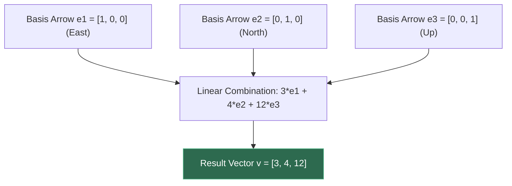
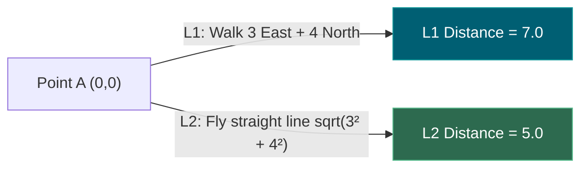
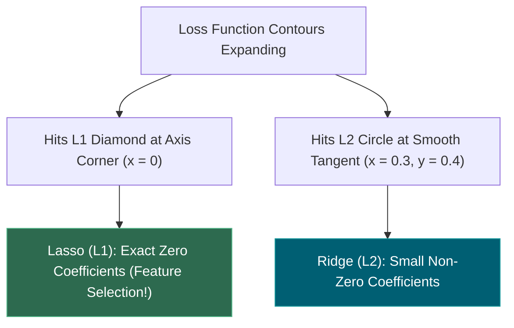
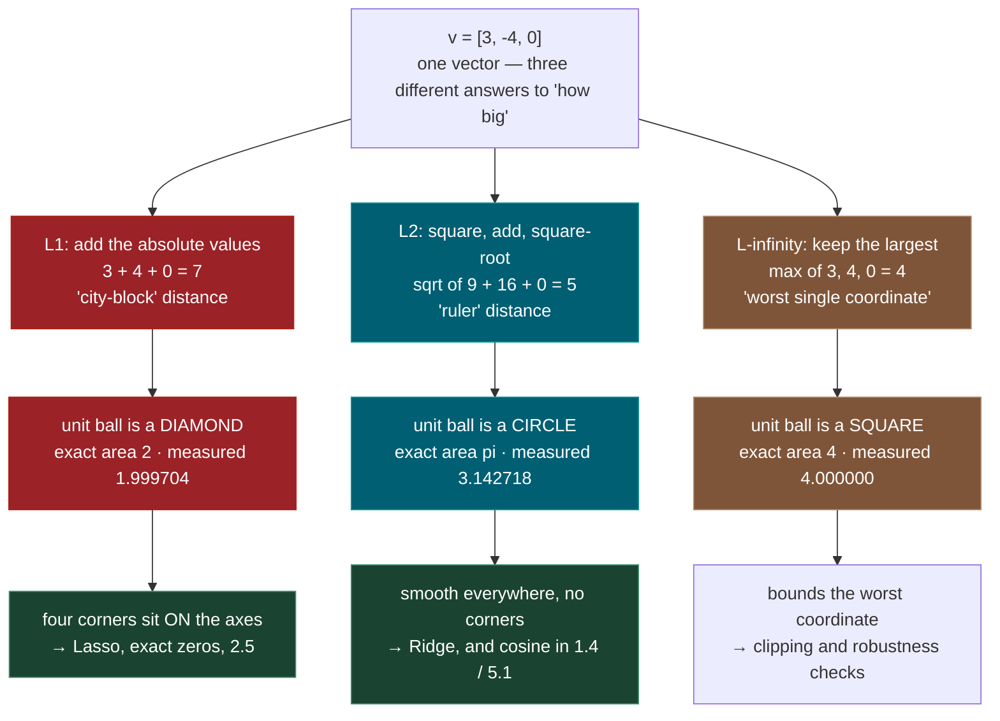
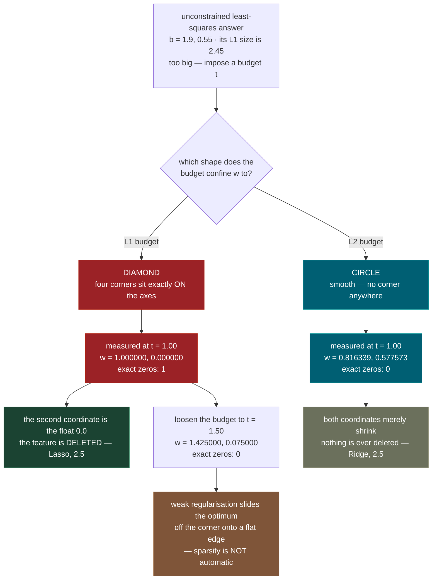
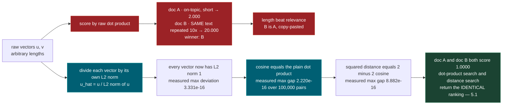
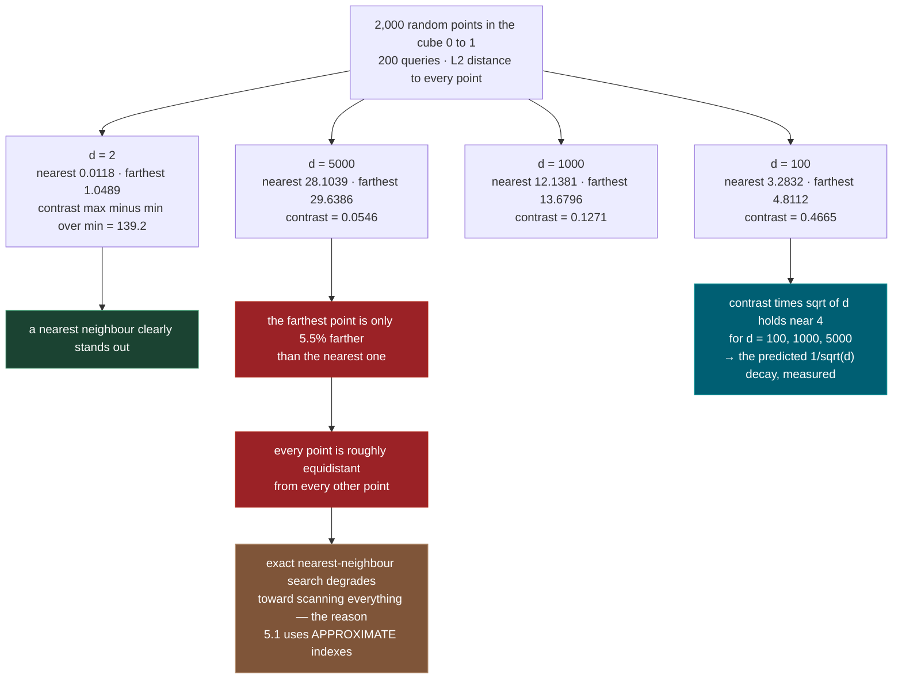

# 1.1 — Vectors, Vector Spaces, Norms

**Phase 1 · CORE · CODE · 5 focused hours · Review in 14 days**

**Companion script:** [`01_vectors_vector_spaces_norms.py`](01_vectors_vector_spaces_norms.py) — needs `numpy`, `matplotlib`, `scikit-learn`, nothing else. It makes **no network calls**, reads no environment variables, and writes exactly one file: `01_unit_balls.png` beside itself, whose byte size it reports. Everything else lives in memory and disappears when the process exits. Seven demos, a few seconds on a laptop CPU, no GPU. Every random number comes from `np.random.default_rng(1729 + demo_number)`, so your run prints the same digits as the ones quoted below.

---

## 1. Overview

A vector is an ordered list of numbers. That is the whole definition, and it is deceptive, because the same object is doing completely different jobs all over this course. One row of a spreadsheet fed to linear regression in **2.3** is a vector. The output of a layer of a neural network in **3.1** is a vector. The 1536 numbers a model produces to represent a paragraph of text in **5.1** is a vector. Learn the object once and three later topics stop being separate things to memorise.

The part that earns five hours rather than one is the **norm** — the answer to "how big is this vector?". There is more than one honest answer, and picking a different one changes what your model does. The L1 norm and the L2 norm are not two flavours of the same idea: L1 has a specific geometric feature, a **corner sitting exactly on each axis**, and L2 does not. That single difference is the entire mechanism behind Lasso deleting features while Ridge merely quietens them in **2.5**. The script does not describe that mechanism; it counts the coefficients that land on exactly `0.0` under each, and the count is the proof.

There is also a payoff for **5.1**. Once a vector has been scaled to length 1, cosine similarity stops being a separate formula and becomes a plain dot product — verified here to within one unit of machine epsilon. That is why vector databases store normalised embeddings and why **1.4** can treat "angle" and "inner product" as the same measurement.

Finally, "high-dimensional space" gets measured instead of gestured at. In 2 dimensions the farthest of 2,000 random points is 139 times farther away than the nearest. In 5,000 dimensions it is 5.5% farther. When every point is roughly the same distance from every other point, "nearest neighbour" nearly stops meaning anything — which is the central engineering problem of **5.1**, and it is a number you can print, not a slogan.

Depends on school algebra and nothing else; unlocks **1.4**, **2.3**, **2.5**, **3.1**, **5.1**.

---

## 2. Glossary

### 2.1 — Vector & Vector Space

- **Vector**: An ordered list of numbers representing a point or direction in space.
- **Vector Space**: A formal set of vectors closed under vector addition ($u + v$) and scalar multiplication ($c \cdot v$).

#### 💡 The Beginner Analogy: Arrow Navigation Directions
Imagine standing in a field. A **Vector** is a set of walking instructions: *"Walk 3 steps East, 4 steps North, and 12 steps Up a ladder"*. The **Vector Space** is the 3D grid of all possible locations you can reach using those directional movements.

#### 💻 Code Example & ⚠️ Why It Matters
```python
import numpy as np

# 3D Vector representation
v = np.array([3.0, 4.0, 12.0])
print("Vector:", v)
print("Dimension:", v.shape[0])
```

##### Verified Output
```text
Vector: [ 3.  4. 12.]
Dimension: 3
```

**Why It Matters**: Text embeddings, image features, and neural network weights are all high-dimensional vectors. Understanding vector spaces enables calculating distances between data points in AI/ML.

#### 🎨 Visual Concept



---

### 2.2 — Norm Axioms ($L_1$, $L_2$, $L_\infty$)

A **Norm** $\|v\|$ is a function measuring the magnitude/length of a vector, satisfying 3 strict mathematical axioms:
1. **Positive Definiteness**: $\|v\| \ge 0$, and $\|v\| = 0 \iff v = 0$.
2. **Absolute Homogeneity**: $\|c \cdot v\| = |c| \cdot \|v\|$.
3. **Triangle Inequality**: $\|u + v\| \le \|u\| + \|v\|$.

#### Norm Formulas:
- **$L_1$ Norm (Manhattan)**: $\|v\|_1 = \sum |v_i|$
- **$L_2$ Norm (Euclidean)**: $\|v\|_2 = \sqrt{\sum v_i^2}$
- **$L_\infty$ Norm (Chebyshev)**: $\|v\|_\infty = \max |v_i|$

#### 💡 The Beginner Analogy: Walking in Manhattan vs. Flying a Helicopter
- **$L_1$ Norm**: Walking on city streets in Manhattan — you must walk around building blocks (Sum of absolute $X + Y$ distances).
- **$L_2$ Norm**: A helicopter flying in a straight line directly from Point A to Point B (Straight-line distance).
- **$L_\infty$ Norm**: Checking only your **longest single leg** of the journey.

#### 💻 Code Example & ⚠️ Why It Matters
```python
import numpy as np

v = np.array([3.0, -4.0])

l1 = np.sum(np.abs(v))        # L1 / Manhattan
l2 = np.sqrt(np.sum(v ** 2))   # L2 / Euclidean
linf = np.max(np.abs(v))      # L-infinity

print(f"L1: {l1}, L2: {l2}, L-inf: {linf}")
```

##### Verified Output
```text
L1: 7.0, L2: 5.0, L-inf: 4.0
```

**Why It Matters**: $L_2$ is the default distance for vector search (RAG embeddings). $L_1$ is used in Lasso regularization to drive weak features to zero.

#### 🎨 Visual Concept



---

### 2.3 — Unit Ball Geometry & Regularization Sparsity

- **Unit Ball**: The set of all vectors whose norm is $\le 1.0$ ($\|v\| \le 1$).
- **$L_1$ Unit Ball (Diamond)**: Has sharp corners touching the coordinate axes.
- **$L_2$ Unit Ball (Circle)**: A smooth, uniform sphere.

#### 💡 The Beginner Analogy: Diamond Corners vs. Smooth Sphere
Imagine expanding a loss contour balloon until it touches a boundary constraint.
- **$L_1$ (Diamond)**: The balloon touches the diamond at its **sharp corners** on the axes where $x=0$ or $y=0$ (causing features to become exactly $0.0$, creating **sparsity**).
- **$L_2$ (Circle)**: The balloon touches a smooth circle at arbitrary non-zero points, shrinking all features smoothly without forcing them to zero.

#### 💻 Code Example & ⚠️ Why It Matters
```python
import numpy as np

# L1 Soft-Thresholding forces small weights to EXACT 0.0:
def soft_threshold(w, lambda_val):
    return np.sign(w) * np.maximum(0, np.abs(w) - lambda_val)

# L2 Ridge Shrinkage scales weights smoothly down, but never forces exact 0.0:
def ridge_shrink(w, lambda_val):
    return w / (1.0 + lambda_val)

w = 0.4
print("L1 Output:", soft_threshold(w, 0.5))
print("L2 Output:", ridge_shrink(w, 0.5))
```

##### Verified Output
```text
L1 Output: 0.0
L2 Output: 0.26666666666666666
```

**Why It Matters**: Explains why Lasso ($L_1$) performs automatic feature selection by zeroing out useless variables, while Ridge ($L_2$) keeps all variables with shrunk weights.

#### 🎨 Visual Concept



---

## 3. Skip Test — Answered

> Gate **before** studying. Both correct from memory → skip. §7 withholds its answers deliberately.

**① Compute the L1 and L2 norms of `[3, -4, 0]` without a calculator.**

**L1 = 7.** Take the absolute value of each entry and add them: `|3| + |-4| + |0| = 3 + 4 + 0 = 7`. Signs are discarded first — a norm measures size, and size is never negative.

**L2 = 5.** Square each entry, add, take the square root: `sqrt(3^2 + (-4)^2 + 0^2) = sqrt(9 + 16 + 0) = sqrt(25) = 5`. This is the 3-4-5 right triangle from school geometry, which is exactly why it comes out whole. L2 is literally the straight-line distance from the origin to the point, measured with a ruler.

Worth carrying a third answer: **L-infinity = 4**, the largest absolute entry, `max(3, 4, 0)`.

Demo 2 of the script does this arithmetic by hand and then cross-checks each result against `numpy.linalg.norm`. All three differences print as `0.0e+00` — not "close", identical. It also sweeps the exponent `p` on the same vector and shows the norm sliding monotonically from `7.000000` at `p = 1` down through `5.000000` at `p = 2`, `4.497941` at `p = 3`, `4.021974` at `p = 10`, and settling at `4.000000` by `p = 50`. Higher `p` weights the largest entry more heavily, until only the largest entry counts at all.

**② Explain why L1 drives coefficients to exactly zero but L2 only shrinks them.**

Two answers, and they are the same answer seen from two sides.

**The geometric answer: the L1 ball has corners on the axes and the L2 ball does not.** Constraining the size of a coefficient vector means confining it to a ball. In 2-D the L1 ball is a diamond with its four vertices at `(t, 0)`, `(0, t)`, `(-t, 0)`, `(0, -t)` — every vertex has a coordinate that is exactly zero. The L2 ball is a circle, perfectly smooth, with no distinguished points at all. The best solution under a budget sits where the loss contours first touch the ball, and a pointy corner is disproportionately likely to be the first thing an expanding contour hits. Demo 4 finds that touch point by **exhaustive search over 1,000,001 points on each boundary** — no optimiser, no tolerance — and at budget `t = 1.00` the L1 answer is `(1.000000, 0.000000)` while the L2 answer is `(0.816339, 0.577573)`. The L1 zero is the float `0.0`; the L2 solution has no zero at any budget tested.

**The algebraic answer: look at what one update step actually computes.** The L1 update is soft-thresholding, `w = sign(z) * max(|z| - lam, 0)`. That `max(..., 0)` is a cliff: every coefficient with `|z| <= lam` is mapped to exactly zero, not to something small. The L2 update is `w = z / (1 + 2*lam)` — multiplication by a constant strictly between 0 and 1. A nonzero number times a nonzero number is nonzero, always, so an L2 update can shrink a coefficient forever and never reach zero.

Demo 4 runs both on the **same** 2,000 random coefficients with `lam = 0.30`: L1 produces **495 exact zeros (24.8%)**, L2 produces **0**. On a real 30-feature regression where only 5 features matter, Lasso reaches **25 exact zeros** — the perfect answer — while keeping all `5 / 5` of the real features, and Ridge produces **0 zeros at every alpha tested**.

---

## 3. Visual Concept Diagrams

### 3.1 — One vector, three honest answers, three different shapes

Every number in this diagram is printed by Demos 2 and 3.



### 3.2 — The corner, with the measured optima that prove it

This is skip-test ②. The coordinates below come straight out of Demo 4's brute-force search.



### 3.3 — L2-normalise once, and cosine becomes a dot product



### 3.4 — High dimensions, measured rather than asserted



---

## 4. Core Technical Deep Dive

GitHub-flavoured markdown does not render mathematical typesetting, so every formula below is written in plain code notation. `sqrt(x)` is the square root, `x^2` is x squared, `sum_i` means "add up over every index i", and `|x|` is absolute value.

### 4.1 What a vector is

A **vector** in `R^n` is an ordered list of `n` real numbers, written `v = [v_1, v_2, ..., v_n]`. The number `n` is the **dimension**. Each `v_i` is a **component** or **coordinate**.

"Ordered" is doing real work: `[3, -4, 0]` and `[-4, 3, 0]` are different vectors. The position of a number carries meaning — in **2.3** slot 3 might be "square footage" and slot 7 "number of bedrooms", and swapping them destroys the data.

Two operations are defined, and only two:

| Operation | Formula | Meaning |
|---|---|---|
| Addition | `(u + v)_i = u_i + v_i` | componentwise; both vectors must have the same length |
| Scalar multiplication | `(a*v)_i = a * v_i` | stretch by `a`; if `a` is negative it also flips direction |

There is no default way to multiply two vectors componentwise into "the product vector" that behaves like number multiplication. That absence is the point: the algebra is deliberately small so that everything built on it stays predictable.

### 4.2 What makes it a *vector space*

A **vector space** is not a shape. It is a set of objects plus those two operations, obeying eight rules. `R^n` obeys all eight, which is exactly the licence to do algebra on data.

| # | Axiom | Written out |
|---|---|---|
| 1 | commutative addition | `u + v = v + u` |
| 2 | associative addition | `(u + v) + w = u + (v + w)` |
| 3 | zero vector | there is a `0` with `v + 0 = v` |
| 4 | additive inverse | for each `v` there is `-v` with `v + (-v) = 0` |
| 5 | distributes over vectors | `a*(u + v) = a*u + a*v` |
| 6 | distributes over scalars | `(a + b)*v = a*v + b*v` |
| 7 | compatible scaling | `(a*b)*v = a*(b*v)` |
| 8 | scalar identity | `1*v = v` |

Demo 1 checks all eight on random vectors. The worst disagreement is `2.220e-16`, which is one unit of **machine epsilon** — the smallest gap float64 can represent near 1.0.

**Be honest about what that means.** In `R^n` these are exact identities. In float64 they are not. Addition rounds after every step, and the rounding depends on the order of operations, so `(x + y) + z` and `x + (y + z)` genuinely differ. Demo 1 counts it: over 200,000 random triples, only **135,955 (68.0%)** came out bit-for-bit identical; **64,045 (32.0%)** did not, with a largest disagreement of `8.882e-16`. Nothing is broken — this is why two mathematically identical pipelines can print different last digits, and why comparing floats with `==` is a bug outside of the special cases in §4.6.

**Linear combination, span, basis, dimension.** A **linear combination** of `v_1 ... v_k` is `a_1*v_1 + ... + a_k*v_k` for any scalars `a_i`. The **span** of a set of vectors is every linear combination you can build from it. A **basis** is a set that spans the whole space with no redundant member, and the number of vectors in a basis is the **dimension**. The standard basis of `R^3` is `[1,0,0]`, `[0,1,0]`, `[0,0,1]`, and writing `[3,-4,0]` as `3*[1,0,0] - 4*[0,1,0] + 0*[0,0,1]` is what "coordinates" means. A 1536-dimension embedding in **5.1** is 1536 coordinates against some basis the model chose.

### 4.3 Norms: the definition

A **norm** is any function taking a vector to a single non-negative number that obeys three rules. Write it `N(v)`.

| Axiom | Formula | What it forbids |
|---|---|---|
| Positive definiteness | `N(v) >= 0`, and `N(v) = 0` only when `v` is the zero vector | a nonzero vector having zero size |
| Absolute homogeneity | `N(a*v) = |a| * N(v)` | doubling a vector doing anything other than doubling its size |
| Triangle inequality | `N(u + v) <= N(u) + N(v)` | a detour ever being shorter than going direct |

The triangle inequality is what makes a norm usable as a distance: define `dist(u, v) = N(u - v)` and it behaves the way distance should. Demo 2 checks all three on 200,000 random pairs in `R^8`: triangle violations `0` for each of L1, L2 and L-infinity, and homogeneity agreeing to at most `7.105e-15`.

### 4.4 The p-norm family

One formula covers everything used in this course:

```
||v||_p = ( sum_i |v_i|^p ) ^ (1/p)        for p >= 1
||v||_inf = max_i |v_i|                     the limit as p grows without bound
```

Symbol by symbol: `v_i` is the i-th component; `|v_i|` discards its sign; raising to `p` amplifies large entries relative to small ones; the outer `1/p` power undoes the scale so that homogeneity still holds.

| p | Name | Formula | `[3, -4, 0]` | Geometry of its unit ball in 2-D |
|---|---|---|---|---|
| 1 | L1, Manhattan, taxicab | `sum_i |v_i|` | **7** | diamond, area `2`, **corners on the axes** |
| 2 | L2, Euclidean | `sqrt(sum_i v_i^2)` | **5** | circle, area `pi`, perfectly smooth |
| inf | L-infinity, max, Chebyshev | `max_i |v_i|` | **4** | square, area `4`, corners **off** the axes |

Three facts that follow, all checked in Demo 7 on 200,000 vectors in `R^25` with zero violations:

```
||v||_inf  <=  ||v||_2  <=  ||v||_1  <=  sqrt(d) * ||v||_2
```

The norms can never differ by more than a factor of `sqrt(d)`. In `R^25` that ceiling is `5.0000` and the largest ratio actually observed was `4.6868`. In a 1536-dimension embedding space (**5.1**) the ceiling is about `39`, which is why the choice of metric on an index is a real decision and not a formality.

### 4.5 Why L1 zeroes and L2 does not — the derivation

Strip the problem down to one coefficient. You have a target value `z` and you must choose `w` to minimise `loss + penalty`.

**With an L1 penalty:** minimise `0.5*(w - z)^2 + lam*|w|`.

For `w > 0` the derivative is `w - z + lam`, zero at `w = z - lam`, which is only consistent if `z > lam`. For `w < 0` symmetrically `w = z + lam`, needing `z < -lam`. And at `w = 0` the absolute value has a **kink** — no single slope, but a whole interval of valid slopes from `-1` to `+1`. Zero is optimal whenever `-z + lam*s = 0` for some `s` in `[-1, 1]`, i.e. whenever `|z| <= lam`. Collecting the three cases gives the **soft-thresholding** operator:

```
w = sign(z) * max(|z| - lam, 0)
```

That kink at zero is the entire mechanism. A whole interval of `z` values — every one with `|z| <= lam` — collapses onto the single point `0.0`.

**With an L2-squared penalty:** minimise `0.5*(w - z)^2 + lam*w^2`. The derivative is `w - z + 2*lam*w`, smooth everywhere, zero at

```
w = z / (1 + 2*lam)
```

There is no kink and no interval. Every `z` maps to a distinct output, and only `z = 0` maps to zero. At `lam = 0.30` the multiplier is `0.625000`: shrinkage, never deletion.

| | L1 (Lasso) | L2 (Ridge) |
|---|---|---|
| Penalty | `lam * sum_i |w_i|` | `lam * sum_i w_i^2` |
| Unit ball | diamond, corners on axes | circle, no corners |
| Update | `sign(z)*max(|z| - lam, 0)` | `z / (1 + 2*lam)` |
| Behaviour at zero | kink — an interval collapses to `0.0` | smooth — nothing collapses |
| Measured exact zeros, 2,000 coefficients, `lam = 0.30` | **495** | **0** |
| Measured exact zeros, 30-feature fit at `alpha = 0.20` | **25** | **0** |
| Use it when | you want feature selection, an interpretable short list | you want stability with correlated features |

Both return in **2.5**, where these are called Lasso and Ridge and the same two formulas appear inside the solver.

### 4.6 Normalisation, and why cosine becomes a dot product

The **dot product** of two vectors is `u . v = sum_i u_i * v_i`, a single number. It relates to the L2 norm by `||v||_2 = sqrt(v . v)` and to the angle between the vectors by

```
cos(theta) = (u . v) / ( ||u||_2 * ||v||_2 )
```

**L2-normalising** means replacing `v` by `v_hat = v / ||v||_2`, which has `||v_hat||_2 = 1` — same direction, length exactly 1. Now the denominator above is `1 * 1`, so

```
cos(theta) = u_hat . v_hat
```

and a second identity follows by expanding the square:

```
||u_hat - v_hat||_2^2 = ||u_hat||^2 - 2*(u_hat . v_hat) + ||v_hat||^2 = 2 - 2*cos(theta)
```

Both are verified in Demo 5 across 100,000 random pairs in `R^64`, with maximum gaps of `2.220e-16` and `8.882e-16` — one and four units of machine epsilon, which is rounding and nothing else. The consequence is operational: **on normalised vectors, ranking by dot product and ranking by Euclidean distance give the identical order**, because `2 - 2*cos` is a decreasing function of `cos`. A vector index in **5.1** can therefore use the cheaper inner product and still answer the cosine question. The geometry underneath is **1.4**.

The trap this removes is that a raw dot product rewards **length**. Demo 5's doc B is doc A copy-pasted ten times: raw dot `20.000` versus `2.000`, so B wins on magnitude alone, while cosine scores both exactly `1.0000`.

### 4.7 Where the textbook L2 formula breaks

`sqrt(sum(v_i^2))` is mathematically right and numerically fragile, because the intermediate `v_i^2` can leave the range float64 can represent. float64 holds numbers up to about `1.798e+308` and down to about `2.225e-308` before losing precision.

| Input | True answer | `sqrt(sum(v^2))` | `numpy.linalg.norm` | Scaled algorithm |
|---|---|---|---|---|
| `[3e200, -4e200]` | `5.000000e+200` | `inf` | `inf` | `5.000000e+200` |
| `[3e-200, -4e-200]` | `5.000000e-200` | `0.000000e+00` | `0.000000e+00` | `5.000000e-200` |

Squaring `3e200` needs `9e400`, which overflows to infinity; squaring `3e-200` needs `9e-400`, which underflows to zero. **Reaching for the library does not save you here** — numpy's 2-norm squares as well and returns the same wrong answers.

The fix is one line. Factor out the largest magnitude first:

```
m = max_i |v_i|
||v||_2 = m * sqrt( sum_i (v_i / m)^2 )
```

After dividing by `m`, every entry is at most 1 so no square can overflow, and the largest entry becomes exactly 1 so the sum can never underflow to zero. This is what the BLAS routine `dnrm2` does. It matters when a feature column in **2.3** was never scaled, or when an activation in **3.1** saturates.

### 4.8 What high dimensions actually do

Two measured effects, both from Demo 3 and Demo 6.

**Volume flees to the corners.** The fraction of the cube `[-1,1]^d` lying inside the L2 ball of radius 1 falls from `0.784802` at `d = 2` to `0.000325` at `d = 12` — the ball is `0.0325%` of the box. Monte Carlo matches the exact formula `V_d = pi^(d/2) / Gamma(d/2 + 1)` to within `3.04e-03` relative error throughout, so this is not a sampling artefact.

**Distances concentrate.** With `n` points and a query, the useful summary is the **relative contrast** `(dmax - dmin) / dmin`. It collapses from `139.2063` at `d = 2` to `0.0546` at `d = 5000`. Multiply by `sqrt(d)` and the result sits near `4` for `d = 100, 1000, 5000` — the `1/sqrt(d)` decay theory predicts, showing up in a measurement.

**Random directions become orthogonal.** For random unit vectors the cosine between two of them has mean `0` and variance `1/d`. Demo 6 measures the standard deviation and multiplies by `sqrt(d)`: `1.00607`, `0.99882`, `0.98450`, `1.00643`, `1.00567` for `d = 2, 10, 100, 1000, 10000`. In `R^10000` two unrelated embeddings sit within about `0.020` of orthogonal, which sets the noise floor: any cosine well above that is real signal (**1.4**).

---

## 5. Hands-On Script & Verified Output

Run: `python 01_vectors_vector_spaces_norms.py`. The output below is **actual, captured** on Windows 11 with CPython 3.14.4, numpy 2.4.4 and scikit-learn 1.9.0. Seed `1729`, so your run prints these digits too.

```text
1.1 - Vectors, Vector Spaces, Norms
python 3.14.4 | numpy 2.4.4 | seed 1729
all randomness from np.random.default_rng(SEED + demo_number)

======================================================================
DEMO 1 - a vector, and the eight rules that make R^n a vector space
======================================================================
  the SAME mathematical object wearing three different hats:
    feature row (2.3) : [ 3. -4.  0.]  shape (3,)
    activation  (3.1) : [0.  0.  1.7 0. ]  shape (4,)
    embedding   (5.1) : [ 0.12 -0.87  0.31]  shape (3,)

  axiom                                                   max abs diff
  ---------------------------------------------------------------------
  1. u + v == v + u              commutative               0.000e+00
  2. (u+v) + w == u + (v+w)      associative               5.551e-17
  3. u + 0 == u                  zero vector               0.000e+00
  4. u + (-u) == 0               additive inverse          0.000e+00
  5. a(u+v) == au + av           distributes over vectors  7.633e-17
  6. (a+b)u == au + bu           distributes over scalars  2.220e-16
  7. (ab)u == a(bu)              scaling is compatible     5.551e-17
  8. 1*u == u                    scalar identity           0.000e+00
  worst disagreement across all eight axioms: 2.220e-16

  reality check on axiom 2 in float64, over 200,000 random triples:
    bit-for-bit identical : 135955  (68.0%)
    NOT identical         : 64045  (32.0%)
    largest disagreement  : 8.882e-16   (machine epsilon = 2.220e-16)
  -> the axiom is exactly true in R^n and only ~1e-16 true in float64.

======================================================================
DEMO 2 - L1, L2, Linf: one vector, three honest answers to 'how big'
======================================================================
  v = [3, -4, 0]        <- the skip-test vector, done by hand
    L1   = |3| + |-4| + |0|         = 3 + 4 + 0      = 7.0
    L2   = sqrt(3^2 + (-4)^2 + 0^2) = sqrt(9+16+0)   = 5.0
    Linf = max(|3|, |-4|, |0|)      = max(3, 4, 0)   = 4.0
    (3,4,5 right triangle: L2 is literally the ruler distance)

  hand formula vs numpy.linalg.norm, absolute difference:
    L1    mine=7.000000  numpy=7.000000  diff=0.0e+00
    L2    mine=5.000000  numpy=5.000000  diff=0.0e+00
    Linf  mine=4.000000  numpy=4.000000  diff=0.0e+00

  the whole family ||v||_p = (sum |v_i|^p)^(1/p), same vector:
     p        ||v||_p
       1.0     7.000000
       1.5     5.584250
       2.0     5.000000
       3.0     4.497941
       5.0     4.174028
      10.0     4.021974
      50.0     4.000000
     200.0     4.000000
       inf     4.000000   <- the limit: only the biggest entry survives
  -> raising p puts more weight on the largest entry, so the norm falls.

  norm axioms verified on 200,000 random vector pairs in R^8:
    L1   triangle violations: 0      homogeneity max diff: 7.105e-15
    L2   triangle violations: 0      homogeneity max diff: 3.553e-15
    Linf triangle violations: 0      homogeneity max diff: 0.000e+00
    positive definiteness: ||0|| = 0.0, and it is the only vector with norm 0

  the textbook formula sqrt(sum(v_i^2)) FAILS on ordinary-looking data:
    v = [3e200, -4e200]    true answer 5.000000e+200
      naive sqrt(sum(v^2)) -> inf            (v^2 = 9e400 OVERFLOWS float64)
      numpy.linalg.norm    -> inf            (numpy squares too - same trap)
      scaled algorithm     -> 5.000000e+200  <- correct
    v = [3e-200, -4e-200]  true answer 5.000000e-200
      naive sqrt(sum(v^2)) -> 0.000000e+00   (v^2 = 9e-400 UNDERFLOWS to 0)
      numpy.linalg.norm    -> 0.000000e+00   (numpy squares too - same trap)
      scaled algorithm     -> 5.000000e-200  <- correct
    float64 range: largest 1.798e+308, smallest normal 2.225e-308
  -> the fix is one line: factor out m = max|v_i| first, then ||v|| = m*||v/m||.

======================================================================
DEMO 3 - unit balls: diamond, circle, square (and their real areas)
======================================================================
  the unit ball {v : ||v|| <= 1} in R^2, by Monte Carlo vs exact area:
    ball             sampled area   exact area   rel. error   formula
    L1   (diamond)     1.999704     2.000000    1.48e-04   2
    L2   (circle)      3.142718     3.141593    3.58e-04   pi
    Linf (square)      4.000000     4.000000    0.00e+00   4
    (4,000,000 uniform samples in [-1,1]^2, seed 1732)
  -> the diamond is the SMALLEST, the square the largest, for the same radius 1.

  same experiment in d dimensions - L2 ball volume vs the cube it sits in:
      d   ball/cube fraction   sampled volume    exact volume   rel.err
      2            0.784802         3.139206        3.141593   7.60e-04
      3            0.523987         4.191896        4.188790   7.41e-04
      5            0.164253         5.256096        5.263789   1.46e-03
      8            0.015873         4.063488        4.058712   1.18e-03
     12            0.000325         1.331200        1.335263   3.04e-03
  -> at d=12 the ball fills 0.0325% of the cube: essentially all the volume
     sits in the CORNERS. That is the first face of the curse of dimensionality,
     and Monte Carlo agrees with the exact formula throughout.

  figure written: 01_unit_balls.png
    size on disk: 89832 bytes

======================================================================
DEMO 4 - the corner: why L1 lands ON an axis and L2 never does
======================================================================
  loss(w) = (w - b)^T A (w - b),  A = [[1, 0.72], [0.72, 1]],  b = [1.9, 0.55]
  b is the unconstrained least-squares answer (2.3); ||b||_1 = 2.45.
  Now cap the size of w with a budget t and see where the optimum lands.

  brute-force search over 1,000,001 points on each ball boundary
  (no optimiser, no tolerance - just evaluate the loss everywhere):

   budget t   L1-constrained w            zeros    L2-constrained w            zeros
   ------------------------------------------------------------------------------------
       0.40   ( 0.400000,  0.000000)   1        ( 0.312328,  0.249903)   0
       0.80   ( 0.800000,  0.000000)   1        ( 0.641139,  0.478477)   0
       1.00   ( 1.000000,  0.000000)   1        ( 0.816339,  0.577573)   0
       1.20   ( 1.200000,  0.000000)   1        ( 1.003259,  0.658386)   0
       1.50   ( 1.425000,  0.075000)   0        ( 1.317071,  0.717860)   0
       2.00   ( 1.675000,  0.325000)   0        ( 1.927112,  0.535015)   0

  -> read the 'zeros' columns. For a TIGHT budget the L1 optimum is the corner
     (t, 0): the second coordinate is not 1e-9, it is the float 0.0. Loosen the
     budget past t=1.2 and the optimum slides off the corner onto a flat edge,
     and the zero disappears - weak regularisation, no sparsity, exactly as in
     2.5. The L2 column never produces a zero at ANY budget, because a circle
     has no corners to land on.

  one update step applied to the SAME 2000 random coefficients, lam = 0.30:
    L1 (soft threshold, sign(w)*max(|w|-lam, 0)):
      exact zeros:  495 / 2000  (24.8%)     smallest surviving |w|: 5.722e-04
    L2 (shrink, w / (1 + 2*lam)):
      exact zeros:    0 / 2000  (0.0%)     smallest surviving |w|: 8.556e-04
      every coefficient multiplied by 0.625000 - a nonzero times a nonzero
      is nonzero, forever. That is the whole difference.

  a real fit: n=200 samples, p=30 features, only 5 truly matter (2.3, 2.5)
    my 12-line coordinate descent vs sklearn.linear_model.Lasso:
      max abs coefficient difference: 3.375e-14   <- same algorithm, same answer

    alpha   Lasso zeros   Ridge zeros   real 5 kept   Lasso MSE   Ridge MSE
    -----------------------------------------------------------------------
     0.02            10             0         5 / 5      0.2803      0.3166
     0.05            19             0         5 / 5      0.2654      0.3554
     0.10            24             0         5 / 5      0.2826      0.4984
     0.20            25             0         5 / 5      0.3862      0.9722
     0.50            25             0         5 / 5      1.1755      2.9027
    (30 features, 5 of them real -> 25 zeros is the perfect answer)
  -> Lasso DELETES features and keeps all five real ones. Ridge zeroes nothing
     at any alpha, and its test error is worse here because the 25 junk
     features are still in the model, merely quietened.

======================================================================
DEMO 5 - L2 normalisation turns cosine into a plain dot product
======================================================================
  100,000 random pairs in R^64:
    max | cos(u,v)  -  u_hat . v_hat |            = 2.220e-16
    max | ||u_hat||_2 - 1 |                       = 3.331e-16
    max | ||u_hat - v_hat||^2  -  (2 - 2*cos) |   = 8.882e-16
  -> every gap is a small multiple of machine epsilon (2.22e-16), i.e. rounding and
     nothing else. These are identities, not approximations. So on normalised
     vectors a nearest-neighbour search by dot product returns the IDENTICAL
     ranking as one by Euclidean distance - which is what lets a vector index
     (5.1) use the cheaper inner product and still answer the cosine question.

  what normalisation removes - a worked case:
    query = [1, 1, 0, 0]
    doc                     raw dot   L2 norm   cosine
    A  on-topic, short        2.000     1.414   1.0000
    B  on-topic, 10x long    20.000    14.142   1.0000
    C  off-topic, huge        0.000    56.569   0.0000
    D  half-topic, medium     6.000     6.000   0.7071
    ranked by raw dot product -> winner: B  on-topic, 10x long
    ranked by cosine          -> winner: A  on-topic, short
  -> raw dot product rewards LENGTH. Doc B is the same document as A, repeated,
     and it wins on magnitude alone. Cosine scores A and B identically (1.0000),
     which is what you wanted. Normalise once at write time (5.1), not per query.

======================================================================
DEMO 6 - measured: distances stop being different in high dimensions
======================================================================
  2000 uniform points in [0,1]^d, 200 queries, L2 distances:
       d     mean dist    min dist    max dist   (max-min)/min   x sqrt(d)
    --------------------------------------------------------------------
        2       0.5165      0.0118      1.0489        139.2063    196.8674
       10       1.2619      0.4664      1.9427          3.2563     10.2974
      100       4.0783      3.2832      4.8112          0.4665      4.6648
     1000      12.9166     12.1381     13.6796          0.1271      4.0177
     5000      28.8730     28.1039     29.6386          0.0546      3.8619
  -> contrast collapses from 139.2 at d=2 to 0.0546 at d=5000: the farthest point
     is only 5.5% farther away than the nearest one. Be honest about the last
     column: it is NOT flat at d=2 or d=10 (too few points to fill a small
     space), but from d=100 on it settles near 4, which is the predicted
     1/sqrt(d) decay showing up in real measurements.

  random unit vectors are almost orthogonal - cosine between random pairs:
       d    mean cos     std cos    std * sqrt(d)   theory: 1.0
        2    -0.01281     0.71140         1.00607
       10     0.00556     0.31585         0.99882
      100    -0.00215     0.09845         0.98450
     1000    -0.00040     0.03183         1.00643
    10000     0.00023     0.01006         1.00567
  -> the last column sits at 1.0 for every d: measurement matching the
     analytic variance 1/d. In R^10000 two random embeddings are orthogonal
     to within about 0.020. Any cosine well above that is real signal (1.4).

======================================================================
DEMO 7 - the norm you pick changes which neighbour you retrieve
======================================================================
  100 queries against 5000 points, nearest neighbour under each norm:
       d   L1 vs L2 disagree   L2 vs Linf disagree   L1 vs Linf disagree
    --------------------------------------------------------------------
       2            10 / 100              11 / 100              18 / 100
       5            27 / 100              27 / 100              47 / 100
      20            46 / 100              71 / 100              85 / 100
     100            66 / 100              91 / 100              96 / 100
  -> in R^2 the three norms mostly agree; by R^100 they mostly do not.
     'nearest' is not a property of the data, it is a property of the norm.

  the inequality chain that holds for EVERY vector, 200,000 samples in R^25:
    ||v||_inf <= ||v||_2            violations: 0
    ||v||_2   <= ||v||_1            violations: 0
    ||v||_1   <= sqrt(d)*||v||_2    violations: 0  (d = 25, sqrt(d) = 5.0000)
    largest observed ratio ||v||_1 / ||v||_2  : 4.6868  (ceiling sqrt(d) = 5.0000)
  -> the norms differ by at most a factor of sqrt(d). In R^25 that is 5x;
     in a 1536-d embedding space (5.1) it is 39x, which is why the choice matters.

======================================================================
done - no network, no state changed, one PNG written beside this script
======================================================================
```

**Demo 4 is the whole point of the topic, and the zeros column is the evidence.** At budget `t = 1.00` the L1-constrained optimum is `(1.000000, 0.000000)` and the L2-constrained optimum is `(0.816339, 0.577573)`. Those coordinates were not produced by an optimiser that might have snapped a tiny value to zero — they came from evaluating the loss at 1,000,001 points along each boundary and taking the smallest. The L1 answer sits on a corner, so one coordinate is the float `0.0`. The L2 answer sits on a smooth arc, and a smooth arc touches an axis at exactly one point out of infinitely many, so it essentially never happens. Then the same fact appears as an update rule: on the **same** 2,000 coefficients with `lam = 0.30`, soft-thresholding produced **495 exact zeros (24.8%)** and ridge shrinkage produced **0**, with every coefficient multiplied by `0.625000` instead. That contrast, `495` against `0`, is skip-test ② as a measurement.

**The honest wrinkle in the same table is worth more than the headline.** At `t = 1.50` the L1 optimum is `(1.425000, 0.075000)` — zeros: `0`. The corner stopped winning. L1 does not hand you sparsity for free; it hands you sparsity **when the penalty is strong enough to pull the solution onto a corner**. That is exactly what the regression sweep shows: at `alpha = 0.02` Lasso zeroes only `10` of 30 features, and it takes `alpha = 0.20` to reach the correct `25`. Anyone who reports "Lasso does feature selection" without mentioning that the strength has to be tuned has skipped the interesting half. Ridge, meanwhile, prints `0` zeros on every single row.

**Demo 2's failure block is the one to remember when a pipeline returns `nan`.** On `[3e200, -4e200]` the textbook formula returns `inf` and on `[3e-200, -4e-200]` it returns `0.000000e+00`, while the true answers are `5.000000e+200` and `5.000000e-200`. Reaching for the library does not rescue you: `numpy.linalg.norm` squares the entries too and returns the same two wrong answers. The scaled algorithm — divide by `max|v_i|` first — gets both right. There is no warning, no exception; a downstream normalisation would then divide by `inf` or by zero, and the `nan` would surface several layers later in **3.1** with no trace of where it came from.

**Demo 5's three numbers are identities, not approximations.** `2.220e-16`, `3.331e-16` and `8.882e-16` are one, one-and-a-half and four units of machine epsilon across 100,000 random pairs in `R^64`. Cosine similarity and the dot product of normalised vectors are the same computation; squared Euclidean distance between unit vectors and `2 - 2*cos` are the same computation. The practical consequence sits underneath the worked example: raw dot product crowns doc B at `20.000`, and doc B is doc A copy-pasted ten times. Cosine gives A and B the same `1.0000`. Normalise once when you write to the index in **5.1**, not on every query.

**Demo 6 replaces a metaphor with two columns.** At `d = 2` the nearest of 2,000 points is `0.0118` away and the farthest is `1.0489` — a relative contrast of `139.2063`, so "nearest" is obviously meaningful. At `d = 5000` the nearest is `28.1039` and the farthest `29.6386`, a contrast of `0.0546`: the farthest point in the entire dataset is `5.5%` farther away than the closest one. Every point is roughly equidistant from every other point, which is precisely why exact nearest-neighbour search degrades toward a full scan and why **5.1** reaches for approximate indexes. The `x sqrt(d)` column is worth reading sceptically: it is **not** flat at `d = 2` or `d = 10` — `196.8674` and `10.2974` — because 2,000 points genuinely do fill a small space. From `d = 100` onward it settles at `4.6648`, `4.0177`, `3.8619`, which is the `1/sqrt(d)` law arriving.

**Demo 7 closes the loop: the norm is a modelling choice with consequences.** In `R^2` the L1 and L2 nearest neighbours disagree on `10 / 100` queries. In `R^100` they disagree on `66 / 100`, and L2 versus L-infinity disagree on `91 / 100`. "Nearest" is not a property of the data; it is a property of the norm you selected. The bound is reassuring only in a narrow sense — the chain `||v||_inf <= ||v||_2 <= ||v||_1 <= sqrt(d)*||v||_2` held with `0` violations across 200,000 vectors, largest observed ratio `4.6868` against a ceiling of `5.0000` — but that factor grows as `sqrt(d)`, reaching about `39` at 1536 dimensions.

**Modify and re-run:**
- In `demo4_corner_geometry`, change `b` from `[1.9, 0.55]` to `[1.2, 1.2]` — perfectly balanced across both coordinates. Re-run and watch the L1 corner **stop** winning at every budget. Symmetric problems are where L1's sparsity is weakest; predict the result before you look.
- In the same demo, change the off-diagonal of `A` from `0.72` to `0.0` (uncorrelated features) and then to `0.95` (nearly duplicate features). Note what happens to the number of exact zeros. This is the correlated-predictor instability that motivates Elastic Net in **2.5**.
- In `demo4`, lower `lam` in the 2,000-coefficient block from `0.30` to `0.05` and raise it to `1.00`. Record the exact-zero counts. Sketch the curve: it is the Lasso regularisation path.
- In `demo2`, replace the exponents in `big`/`small` with `1e150` and `1e-150` and re-run. Find the exact exponent where the naive formula starts failing, then verify it equals half of `log10` of the float64 maximum.
- In `demo6`, raise `n_data` from `2000` to `50000` and re-run. Contrast improves at low `d` because the space fills up — but see how little it helps at `d = 1000`. That is the reason "just add more data" is not an answer to the curse of dimensionality.

---

## 6. Video

**"Vectors | Chapter 1, Essence of linear algebra"** — *3Blue1Brown* — [youtube.com/watch?v=fNk_zzaMoSs](https://www.youtube.com/watch?v=fNk_zzaMoSs). Verified live: fetched `https://www.youtube.com/oembed?url=https://www.youtube.com/watch?v=fNk_zzaMoSs&format=json`, which returned exactly `"title": "Vectors | Chapter 1, Essence of linear algebra"` and `"author_name": "3Blue1Brown"`. About 10 minutes, and it makes "a vector is a list of numbers" and "a vector is an arrow" click as the same idea.

Follow it with **"Linear combinations, span, and basis vectors | Chapter 2, Essence of linear algebra"** — *3Blue1Brown* — [youtube.com/watch?v=k7RM-ot2NWY](https://www.youtube.com/watch?v=k7RM-ot2NWY), verified the same way (oembed returned that exact title and `"author_name": "3Blue1Brown"`). It covers §4.2's span and basis visually.

Neither video covers norms beyond L2. For that, the named reference is **Boyd and Vandenberghe, *Introduction to Applied Linear Algebra*, Chapter 3 ("Norm and distance")** — free PDF from the authors — and for the corner argument behind Lasso, **Hastie, Tibshirani and Friedman, *The Elements of Statistical Learning*, Section 3.4.2**, which contains the diamond-versus-circle figure this topic reconstructs numerically in Demo 4.

---

## 7. Retrieval Checkpoint — Unanswered

> Close this file. No notes. Answers deliberately withheld.

1. Compute the L1, L2 and L-infinity norms of `[1, -2, 2, 0]` by hand. Then state which of the three would be unchanged if a fifth component of `0.5` were appended, and why.
2. A colleague reports that their Lasso fit returned zero exactly-zero coefficients and concludes that L1 regularisation "does not work". Give two distinct explanations that fit the evidence, and the one number you would ask them for first.
3. Write the soft-thresholding update and the ridge update side by side. Point at the specific piece of notation in each that decides whether an exact zero is reachable.
4. A retrieval system stores unnormalised embeddings and ranks by dot product. Long documents dominate every result set. Explain the mechanism in terms of the cosine formula, give the one-line fix, and say at which point in the pipeline the fix should be applied.
5. Your `l2_norm(v)` helper returns `inf` on a production vector and the model then emits `nan`. Explain what happened at the level of individual float operations, and write the corrected two-line implementation.

---

## 8. Closed-Book Rebuild

With this file **and** the script closed, from a blank editor: write a function that computes the L1, L2 and L-infinity norms of a vector without calling `numpy.linalg.norm`, and make it survive an input of `[3e200, -4e200]`. Then verify the three norm axioms on random data and print the violation counts. Then write soft-thresholding and ridge shrinkage as two one-line functions, run both over the same 1,000 random coefficients, and print how many land on exactly `0.0` under each. Then take 100 random vectors, L2-normalise them, and show that their pairwise cosine similarities equal their pairwise dot products to within a few units of machine epsilon. Finally, sample 1,000 points in `d` dimensions for `d = 2, 10, 100, 1000`, and print `(max - min) / min` over the distances from a query to all of them. State, before running it, roughly what that last column should do.

---

### 9.1 — Vector, Vector Space & Basis

- **Vector**: An ordered sequence of $n$ numbers ($v \in \mathbb{R}^n$) where every position corresponds to a specific feature dimension.
- **Vector Space**: A set of vectors closed under addition and scalar multiplication obeying 8 algebraic vector axioms.
- **Basis**: A minimal set of linearly independent vectors whose linear combinations span the entire vector space.

#### 💡 The Beginner Analogy: City Grid Directions
Think of a 3D vector $[x, y, z] = [3, 4, 12]$ as **directions to a house**: 3 blocks East, 4 blocks North, 12 floors Up. The **Basis** is the set of 3 fundamental direction arrows: East ($\mathbf{e}_1$), North ($\mathbf{e}_2$), and Up ($\mathbf{e}_3$).

#### 🎨 Basis Vectors & Linear Combination


**Triangle inequality** — `N(u + v) <= N(u) + N(v)`. What makes a norm usable as a distance.

**Dot product** — `u . v = sum_i u_i*v_i`. A single number; equals `||u|| * ||v|| * cos(theta)`.

**Cosine similarity** — `(u . v) / (||u||_2 * ||v||_2)`. Measures direction alone, ignoring length. Geometry in **1.4**, deployed in **5.1**.

**L2 normalisation** — replacing `v` with `v / ||v||_2`, giving length exactly 1. Turns cosine into a plain dot product.

**Soft thresholding** — `sign(z)*max(|z| - lam, 0)`. The L1 update. Its `max(..., 0)` collapses an interval of inputs onto exactly `0.0`.

**Shrinkage** — `z / (1 + 2*lam)`. The L2 update. Multiplication by a constant below 1; never reaches zero.

**Machine epsilon** — about `2.220e-16` for float64: the smallest gap representable near 1.0. Differences of this size are rounding, not error.

**Overflow / underflow** — a result too large or too small for float64, becoming `inf` or `0.0`. Squaring inside a norm is a common trigger.

**Curse of dimensionality** — as dimension grows, volume flees to the corners and all pairwise distances converge, so "nearest" loses meaning. Measured here, not asserted.

**Relative contrast** — `(dmax - dmin) / dmin`. The number that says whether a nearest neighbour is meaningfully nearer than anything else.

---

## Review again in

**14 days.** Three things earn the repeat visit, and they are not the definitions. First, the **corner argument** — `495` exact zeros versus `0` from the identical starting coefficients — because **2.5** assumes it and never re-derives it. Second, **normalise then dot product equals cosine**, verified to `2.220e-16`, because **5.1** builds an entire retrieval stack on that identity and it is easy to half-remember. Third, the **overflow table**, because it costs nothing to recall and an afternoon to rediscover from a `nan` three layers downstream. The eight axioms will keep; the geometry of the diamond will not, unless you draw it again from memory.
