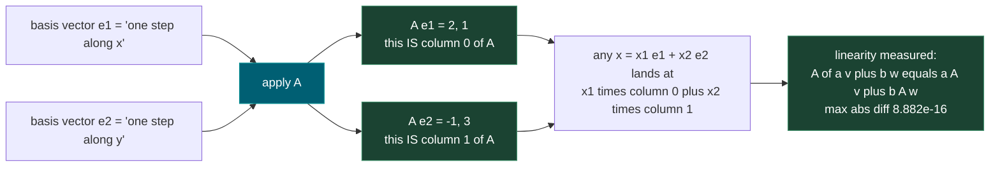
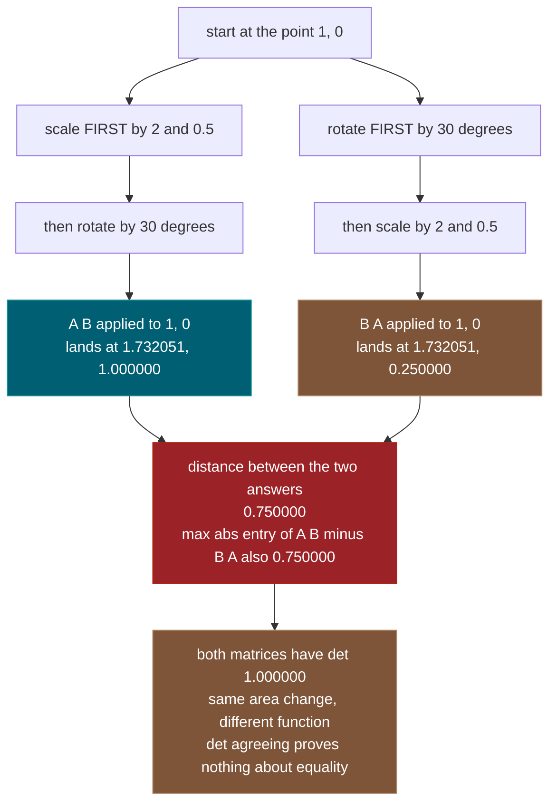
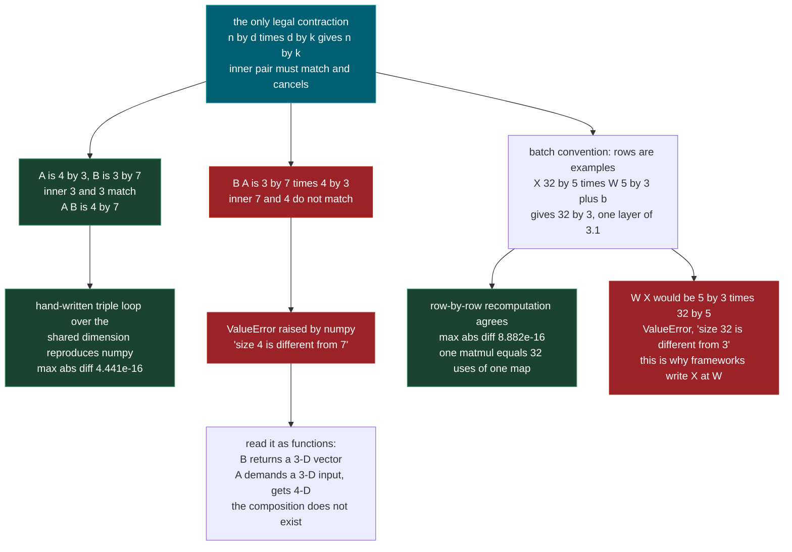
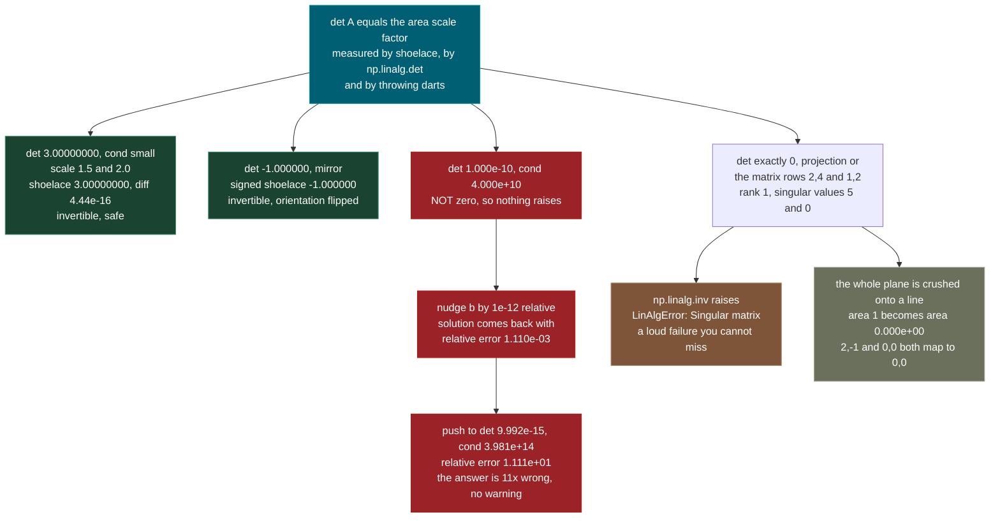
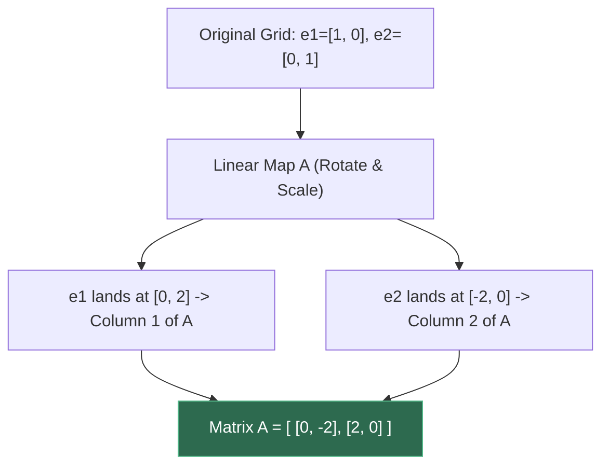
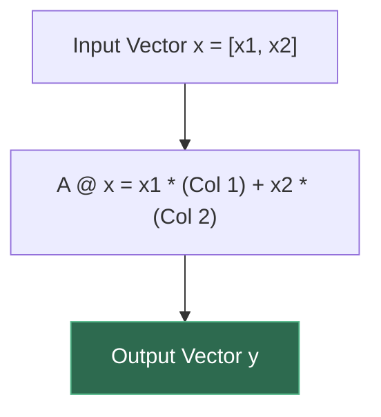
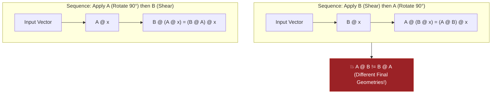
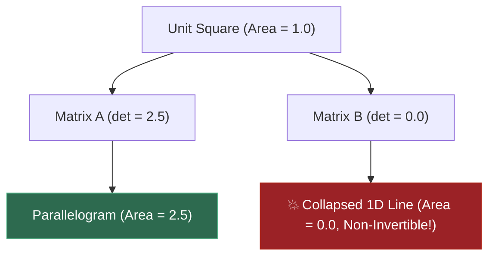

# 1.2 — Matrices and Matrix Multiplication as Linear Maps

**Phase 1 · CORE · CODE · 6 focused hours · Review in 14 days**

**Companion script:** [`02_matrices_as_linear_maps.py`](02_matrices_as_linear_maps.py) — numpy and matplotlib only, both already installed. It runs eight demos that **measure** the mathematics instead of asserting it: every geometric claim is computed a second, independent way and the disagreement is printed. It makes no network calls, starts no subprocesses, and writes exactly one file — a PNG beside itself, whose byte size it reports. All randomness comes from `np.random.default_rng(1202)`, so re-running gives identical numbers.

---

## 1. Overview

A matrix is usually introduced as a grid of numbers with a strange multiplication rule attached. That framing is the reason matrix algebra feels like arithmetic homework. The framing that makes everything downstream legible is different: **a matrix is a function.** It takes a vector in, it gives a vector out, and the numbers in the grid are simply a compact record of where that function sends each coordinate axis.

Once a matrix is a function, matrix multiplication stops being a rule to memorise. `A @ B` is the single function that means *do B first, then do A*. That is all. Every consequence follows: multiplication is associative because composing functions is associative; it is **not** commutative because doing B then A is a different thing from doing A then B; the inner dimensions must match because the output of one function has to fit into the input of the next.

This is the load-bearing idea for most of what comes later. A layer in **3.1** is a matrix multiply plus a bias — one linear map applied to every example in a batch at once. Attention scores in **4.2** are `Q @ K^T`, one matrix multiply producing a token-by-token grid. Multi-head attention in **4.3** is several of those maps running side by side and then recombined. Backpropagation in **3.4** is the chain rule over composed linear maps, read in reverse order — which only makes sense once the forward pass is pictured as composition. The design matrix in **2.3** is a matrix whose columns are features, and least squares is a projection.

There is a second, unglamorous reason this topic earns six hours: **most real failures here are shape failures and conditioning failures, not algebra failures.** A `ValueError` about mismatched core dimensions costs ten minutes if you can read it and an afternoon if you cannot — that is the whole of **1.14**. A near-singular matrix costs far more, because it does not raise anything at all; it returns a confident answer that is wrong by a factor of eleven. Demo 7 produces exactly that, on purpose.

Depends on **1.1** (vectors); feeds **1.14**, **2.3**, **3.1**, **3.4**, **4.2**, **4.3**.

---

## 2. Skip Test — Answered

> Gate **before** studying. Both correct from memory → skip. §7 withholds its answers deliberately.

**① Given A is 4x3 and B is 3x7, state the shape of AB and why BA is undefined.**

`AB` is **4x7**. The rule is that `(n, d) @ (d, k) -> (n, k)`: the two **inner** dimensions must be equal, they cancel, and the two **outer** dimensions survive. Here the inner pair is 3 and 3, which match, so `A(4,3) @ B(3,7) -> (4,7)`. Demo 6 prints exactly this, and then recomputes all 28 entries with a hand-written triple loop; the two agree to `4.441e-16`.

`BA` is undefined because writing it out gives `(3, 7) @ (4, 3)`, and the inner pair is now **7 and 4**, which do not match. The script triggers the real exception rather than describing it:

```text
ValueError: matmul: Input operand 1 has a mismatch in its core dimension 0, with gufunc signature (n?,k),(k,m?)->(n?,m?) (size 4 is different from 7)
```

The reason underneath the rule is the function view. `B` is a function that eats a 7-dimensional vector and returns a 3-dimensional one. `A` is a function that eats a 3-dimensional vector and returns a 4-dimensional one. `AB` means *do B, then do A* — B hands over a 3-D vector, which is exactly what A wants, so the composition exists. `BA` means *do A, then do B* — A hands over a 4-D vector, and B needs a 7-D one. There is nothing to compute. The shape rule is not bookkeeping; it is the statement that the output of the first function has to be a legal input to the second.

**② Describe geometrically what multiplying by a diagonal matrix does.**

It **stretches each coordinate axis independently**, by the number sitting on that axis's diagonal position, and does nothing else. Axis `j` is scaled by `d_j`. No axis is allowed to influence any other: input coordinate 1 can never contribute to output coordinate 2, because the entry that would carry it is zero.

Demo 2 measures this rather than claiming it. For `D = diag(3.0, 0.5, -2.0)` applied to six random 3-D points, the ratio `output[:, j] / input[:, j]` is computed componentwise. If the claim is true, every ratio within a column must be identical:

```text
    axis 0: min 3.000000000000  max 3.000000000000
    axis 1: min 0.500000000000  max 0.500000000000
    axis 2: min -2.000000000000  max -2.000000000000
    max spread within any axis: 0.000e+00   (0 => pure axis scaling)
```

Three details fall out of this. A **negative** diagonal entry (here `-2.0` on axis 2) does not just scale — it also **flips** that axis through the origin. The determinant is the product of the diagonal, `3 * 0.5 * -2 = -3.000000`: volumes triple, and the negative sign records that orientation was reversed. And because no mixing happens, `diag(d) @ x` is identical to the elementwise product `x * d` — the script confirms this at `0.000e+00` difference. That equivalence is why per-channel scaling in a neural network is implemented as a cheap elementwise multiply and never as a real matrix multiply.

One warning the demo makes concrete: stretching axes does **not** always change area. `diag(2.0, 0.5)` turns the unit square into a rectangle of width `2.0000` and height `0.5000` — a visibly different shape — but the area stays at `1.0000`, because `2 * 0.5 = 1`, and the determinant is `1.0000`.

---

## 3. Visual Concept Diagrams

### 3.1 — A matrix is a function, and its columns say where the axes go

The measured values are from Demo 1, with `A` having rows `(2, -1)` and `(1, 3)`.



### 3.2 — Composition order is not decoration, with the measured gap

Both routes use the same two maps: a 30-degree rotation and the scaling `diag(2, 0.5)`. Both have determinant `1.000000`. They are still different functions, and Demo 4 measures how different by following the single point `(1, 0)`.



### 3.3 — Shape discipline: what cancels, what survives, what raises



### 3.4 — The determinant ladder, and the row that raises nothing

Every number below is from Demo 3 and Demo 7. The middle band is the dangerous one.



---

## 4. Core Technical Deep Dive

GitHub does not render LaTeX in this file, so every formula below is written in plain text or inline code. Read `sum_j` as "add up over all values of j", `A[i, j]` as "the entry in row i, column j", and `^T` as "transpose".

### 4.1 What "linear map" actually means

A function `f` from vectors to vectors is **linear** when both of these hold for every pair of vectors `v`, `w` and every pair of numbers `a`, `b`:

```
f(v + w)  =  f(v) + f(w)
f(a * v)  =  a * f(v)
```

Combined into one statement: `f(a*v + b*w) = a*f(v) + b*f(w)`. In words: **it does not matter whether you combine your inputs first and then apply the function, or apply the function to each input and then combine the results.** Demo 1 measures this for a specific `A`, `v`, `w`, with `a = 2.50` and `b = -1.75`, and the two sides differ by `8.882e-16` — the size of ordinary floating-point rounding, not a real difference.

Two geometric consequences fall straight out. The origin never moves, because `f(0) = f(0 * v) = 0 * f(v) = 0`. And straight lines stay straight, evenly spaced grid lines stay evenly spaced. A linear map can rotate, stretch, shear, reflect and flatten space, but it can never bend it or shift it.

Every linear map from d-dimensional vectors to n-dimensional vectors is exactly one `n x d` matrix, and vice versa. That correspondence is the entire subject.

### 4.2 The columns are the whole story

Write `e_j` for the vector with a 1 in position `j` and 0 everywhere else — one step along axis `j`. Then:

```
A @ e_j  =  column j of A
```

Nothing is computed; the answer was already written in the grid. Demo 1 confirms this at `0.000e+00` difference for both columns of a 2x2 matrix.

Now take any vector `x` and split it into its coordinates, `x = x_1*e_1 + x_2*e_2 + ... + x_d*e_d`. Apply `A` and use linearity:

```
A @ x  =  x_1 * (column 1 of A)  +  x_2 * (column 2 of A)  +  ...  +  x_d * (column d of A)
```

So **applying a matrix is taking a weighted sum of its columns**, with the input's coordinates as the weights. This is the "column picture", and it is the most useful mental image of the two. The equivalent "row picture" is the entrywise formula:

```
(A @ x)[i]  =  sum_j  A[i, j] * x[j]
```

where the sum runs over `j = 1 ... d`. Output component `i` is the dot product of row `i` of `A` with `x`. Demo 1 writes this out as a literal double loop and gets `2.220e-16` agreement with numpy on a 5x4 example. Both pictures are correct; the row picture tells you what a single output number is, the column picture tells you what the map is doing to space.

### 4.3 Matrix multiplication is composition

Define `A @ B` to be the matrix of the function "apply `B`, then apply `A`". Column `j` of `A @ B` must therefore be `A @ (B @ e_j)`, which is `A` applied to column `j` of `B`. Writing that out entry by entry gives the familiar formula:

```
(A @ B)[i, j]  =  sum_k  A[i, k] * B[k, j]
```

The index `k` runs over the **shared** dimension. That is the dimension that gets summed away, which is why it must be the same size in both matrices and why it does not appear in the answer's shape:

| Left | Right | Legal? | Result | Multiply-adds |
|---|---|---|---|---|
| `(n, d)` | `(d, k)` | yes — inner `d` matches | `(n, k)` | `n * d * k` |
| `(4, 3)` | `(3, 7)` | yes | `(4, 7)` | 84 |
| `(3, 7)` | `(4, 3)` | **no** — 7 vs 4 | `ValueError` | — |
| `(32, 5)` | `(5, 3)` | yes — a batch through a layer | `(32, 3)` | 480 |
| `(5, 3)` | `(32, 5)` | **no** — 3 vs 32 | `ValueError` | — |

Properties, each of which is a fact about composing functions rather than a rule about grids:

| Property | Statement | Why, in function terms |
|---|---|---|
| Associative | `(A @ B) @ x == A @ (B @ x)` | "do B then A" applied to x is the same as doing them one at a time |
| **Not** commutative | `A @ B != B @ A` in general | doing B then A is a different function from doing A then B |
| Identity | `I @ A == A @ I == A` | `I` is the do-nothing function |
| Transpose reverses | `(A @ B)^T == B^T @ A^T` | this is the shape rule that makes backprop in **3.4** work |
| Determinants multiply | `det(A @ B) == det(A) * det(B)` | area factors compound when you compose |

Associativity is measured in Demo 4 at `0.000e+00` for a 2-D case, and it is not merely aesthetic. With `P` of shape `(200, 3)`, `Q` of shape `(3, 200)` and a vector `v` of length 200, bracketing as `(P @ Q) @ v` costs **160000** multiply-adds and builds a 200x200 intermediate matrix; bracketing as `P @ (Q @ v)` costs **1200** and never builds anything larger than a length-3 vector. Same answer to `4.086e-14`, at `133.3x` less work. Choosing brackets is a real optimisation, and it is the trick behind several cheap attention variants in **4.2** and **4.3**.

Non-commutativity is measured too. With `A` a 30-degree rotation and `B = diag(2, 0.5)`:

```
A @ B  =  rows (1.732051, -0.250000) and (1.000000,  0.433013)
B @ A  =  rows (1.732051, -1.000000) and (0.250000,  0.433013)
```

`det(A @ B) = det(B @ A) = 1.000000`, since determinants multiply and both factors have determinant 1. Equal determinants, different functions. The point `(1, 0)` lands at `(1.732051, 1.000000)` under one and `(1.732051, 0.250000)` under the other — `0.750000` apart.

### 4.4 Diagonal matrices

A diagonal matrix `diag(d_1, ..., d_n)` has `d_j` on the diagonal and zeros everywhere else. Its action is:

```
diag(d) @ x  =  (d_1 * x_1,  d_2 * x_2,  ...,  d_n * x_n)     =  d * x   elementwise
det(diag(d)) =  d_1 * d_2 * ... * d_n
```

Each axis is scaled independently by its own number, with no mixing between axes; a negative entry additionally reflects that axis. This is why diagonal maps cost `O(n)` rather than `O(n^2)`, and why a per-feature scale in a model is stored as a vector, not a matrix.

### 4.5 The determinant

For a 2x2 matrix, `det([[a, b], [c, d]]) = a*d - b*c`. What it **means** is the important part:

> `|det(A)|` is the factor by which `A` multiplies areas (in 2-D) or volumes (in higher dimensions). The **sign** records whether orientation was preserved (positive) or flipped (negative).

Demo 3 tests this three independent ways. The unit square's corners are transformed and its area is computed with the shoelace formula — a pure geometry calculation that never calls `det`:

| Map | `det(A)` | measured shoelace area | difference |
|---|---|---|---|
| rotation, 30 degrees | `1.00000000` | `1.00000000` | `0.00e+00` |
| `diag(2, 0.5)` | `1.00000000` | `1.00000000` | `0.00e+00` |
| `diag(1.5, 2.0)` | `3.00000000` | `3.00000000` | `4.44e-16` |
| shear, `1.5` in x | `1.00000000` | `1.00000000` | `0.00e+00` |
| shear composed with `diag(1.5, 2.0)` | `3.00000000` | `3.00000000` | `4.44e-16` |
| projection onto `y = x` | `0.00000000` | `0.00000000` | `0.00e+00` |
| mirror `[[0,1],[1,0]]` | `-1.000000` | `-1.000000` (signed) | exact |

The third measurement is Monte Carlo: throw darts into a bounding box, map each one backwards through `A^-1`, and count how many land inside the original unit square. With one million darts the estimate is `2.996559` against a true value of `3.00000000` — an error of `0.003441`.

`det(A) = 0` is the special case that matters. It means the map crushes space into something of lower dimension — a plane onto a line, a line onto a point — and once that happens no inverse can exist, because information has been destroyed.

### 4.6 Projections and idempotence

To project onto the line spanned by a vector `u`, build:

```
P  =  (u u^T) / (u^T u)
```

`u u^T` is the **outer** product: a column times a row, producing a matrix. `u^T u` is the **inner** product: a row times a column, producing a single number. For `u = (1, 1)` this gives `P = [[0.5, 0.5], [0.5, 0.5]]`.

Two properties define a projection, and Demo 5 measures both:

```
P @ P == P        (idempotent: once you are on the line, projecting again does nothing)
P^T   == P        (symmetric: it is an ORTHOGONAL projection, the nearest point)
```

Applying `P` ten times in a row differs from applying it once by `0.000e+00`. And `det(P) = 0` with rank 1 — projections are always singular, because flattening is exactly what they do.

The reason this matters for **2.3**: the residual `r = x - P x` is **perpendicular** to the line. For `x = (3, -1)`, `P x = (1, 1)` and `r = (2, -2)`, with `r . u = 0.000e+00` exactly. Perpendicular residual and nearest point are the same statement, which is why least squares is a projection. Pythagoras holds on the nose: `||x||^2 = 10.000000` and `||Px||^2 + ||r||^2 = 10.000000`.

The general form, for projecting onto the column space of a design matrix `X` of shape `(n, d)`, is the **hat matrix**:

```
H  =  X (X^T X)^-1 X^T
```

For a random `50 x 3` design matrix the script builds `H` and finds: shape `(50, 50)`, rank `3`, trace `3.0000000000`, `H @ H - H` at most `5.551e-17`, `H - H^T` at most `2.776e-17`, and the residual orthogonal to every column of `X` to within `1.221e-15`. Trace equalling rank is a general fact about projections and a cheap sanity check.

### 4.7 Rank, inverses, and conditioning

**Rank** is the dimension of the output space that actually gets used. A full-rank `n x n` matrix maps n-dimensional space onto all of n-dimensional space and is invertible. Anything less is **singular**.

For `S = [[2, 4], [1, 2]]`, column 1 is exactly twice column 0. So `det(S) = 2*2 - 4*1 = 0`, rank is 1, and the singular values are `[5, 0]` — that zero *is* the collapse. Every point of the plane lands on the line `y = x/2`; the unit square's image has area `0.000e+00`. Both `(2, -1)` and `(0, 0)` map to `(0, 0)`, so "undo it" has no single answer and `np.linalg.inv` raises `LinAlgError: Singular matrix`.

For solving `S x = b` this splits into two cases with no middle ground: if `b` lies on that line there are **infinitely many** solutions (`lstsq` returns the smallest, `x = [0.6, 1.2]`, residual `9.930e-16`); if `b` is off the line there are **none**, and the best achievable residual is `4.024922` — a number that cannot be driven to zero. That leftover distance is precisely the least-squares residual of **2.3**.

**Conditioning** is the practical danger, and it is worse than singularity because it is silent. The condition number is:

```
cond(A)  =  sigma_max / sigma_min          (ratio of largest to smallest singular value)
```

and it obeys the error bound:

```
relative error in x   <=   cond(A)  *  relative error in b
```

A matrix that is *almost* collapsing has a huge `cond`, so it amplifies any wobble in the data. Demo 7 perturbs `b` by `1e-12` relative — far smaller than any real measurement error — for the family `A = [[1, 1], [1, 1 + eps]]`:

| `eps` | `det(A)` | `cond(A)` | relative error in x | measured amplification |
|---|---|---|---|---|
| `1e-02` | `1.000e-02` | `4.020e+02` | `1.155e-11` | `1.155e+01` |
| `1e-06` | `1.000e-06` | `4.000e+06` | `1.110e-07` | `1.110e+05` |
| `1e-10` | `1.000e-10` | `4.000e+10` | `1.110e-03` | `1.110e+09` |
| `1e-14` | `9.992e-15` | `3.981e+14` | `1.111e+01` | `1.111e+13` |
| `1e-16` | — | — | — | `LinAlgError` |

Only the last row raises. Every row above it returns a confident answer, and the `eps = 1e-14` row is wrong by `1.111e+01` — more than eleven times the size of the true answer. `cond(A)` is the number that warned you, and it is one line to check.

### 4.8 The batch convention, and why it is `X @ W`

Frameworks store a batch of examples as `X` of shape `(n_examples, n_features)` — **rows are examples**. A layer with weights `W` of shape `(n_features, n_outputs)` and bias `b` of length `n_outputs` computes:

```
out  =  X @ W + b            shapes: (n, d) @ (d, k) + (k,)  ->  (n, k)
```

That is one layer of **3.1**, exactly. The bias is broadcast, added identically to every row. Demo 6 checks that the batched matmul really is `n` independent applications of one function by recomputing every row separately as `W^T @ X[i] + b`; over 32 rows the difference is `8.882e-16`. Writing `W @ X` instead gives `(5, 3) @ (32, 5)`, and a `ValueError` about size 32 versus size 3.

The same shape arithmetic runs the attention block of **4.2**. With `T` tokens, model width `d_model` and head width `d_k`:

```
Q = X @ Wq            (T, d_model) @ (d_model, d_k)  ->  (T, d_k)
K = X @ Wk            (T, d_model) @ (d_model, d_k)  ->  (T, d_k)
scores = Q @ K^T / sqrt(d_k)      (T, d_k) @ (d_k, T)  ->  (T, T)
```

`d_k` cancels, leaving a token-by-token grid. **4.3** runs several of these side by side. Demo 6 builds one with `T = 6`, `d_model = 8`, `d_k = 4` and confirms that `scores[0, 1] = -18.437493` equals `Q[0] . K[1] / sqrt(d_k) = -18.437493` — the matmul is a grid of dot products and nothing more.

---

## 5. Hands-On Script & Verified Output

Run: `python 02_matrices_as_linear_maps.py`. Output below is **actual, captured** on Windows with Python 3.14.4 and numpy 2.4.4. It is reproducible: seed 1202.

```text
1.2 - Matrices and Matrix Multiplication as Linear Maps
numpy 2.4.4 | seed 1202 | all randomness from default_rng(seed)

======================================================================
DEMO 1 - a matrix is a FUNCTION; its columns are where the axes go
======================================================================
  A =
      [ 2.0000 -1.0000]
      [ 1.0000  3.0000]

  A @ e1 = [2. 1.]   <- exactly column 0 of A
  A @ e2 = [-1.  3.]   <- exactly column 1 of A
  max abs diff vs the literal columns: 0.000e+00

  linearity check  A(av + bw) == aAv + bAw
    a = 2.50   b = -1.75
    v = [ 0.615163 -1.022223]
    w = [0.917842 1.766435]
    LHS = [  5.510187587984 -17.008771308966]
    RHS = [  5.510187587984 -17.008771308966]
    max abs diff: 8.882e-16

  hand-written double loop vs numpy '@', B is 5x4, x is length 4
    numpy : [-0.4086320243 -1.083662338   0.7459861796 -0.2039462001 -1.5580686771]
    byhand: [-0.4086320243 -1.083662338   0.7459861796 -0.2039462001 -1.5580686771]
    max abs diff: 2.220e-16
======================================================================
DEMO 2 - a DIAGONAL matrix stretches each axis independently
======================================================================
  D = diag(3.0, 0.5, -2.0)
  D @ e1 = [3. 0. 0.]
  D @ e2 = [0.  0.5 0. ]
  D @ e3 = [ 0.  0. -2.]

  measured per-axis ratio out[:, j] / in[:, j] over 6 random points
    axis 0: min 3.000000000000  max 3.000000000000
    axis 1: min 0.500000000000  max 0.500000000000
    axis 2: min -2.000000000000  max -2.000000000000
    max spread within any axis: 0.000e+00   (0 => pure axis scaling)

  diag(d) @ x is the SAME as elementwise x * d
    max abs diff: 0.000e+00
  determinant of D  = -3.000000   (product of the diagonal: 3 * 0.5 * -2)
  |det| = 3.0 => volumes triple; the negative sign flips orientation

  2-D: diag(2.0, 0.5) applied to the unit square corners
    corners in : [[0. 0.] [1. 0.] [1. 1.] [0. 1.]]
    corners out: [[0.  0. ] [2.  0. ] [2.  0.5] [0.  0.5]]
    width  1.0 -> 2.0000   height 1.0 -> 0.5000
    area   1.0 -> 1.0000   det = 1.0000
    note the det is 1, because 2 * 0.5 = 1: the square became a
    wide flat rectangle. The SHAPE changed; the AREA did not.
======================================================================
DEMO 3 - det(A) is the AREA SCALE FACTOR, measured three ways
======================================================================
  unit square starts with area 1.0 (shoelace: 1.000000)

  map                        det(A)    shoelace area     abs diff
  --------------------------------------------------------------
  rotation 30 deg        1.00000000       1.00000000     0.00e+00
  scale (2, 0.5)         1.00000000       1.00000000     0.00e+00
  scale (1.5, 2.0)       3.00000000       3.00000000     4.44e-16
  shear (1.5 in x)       1.00000000       1.00000000     0.00e+00
  shear @ scale_up       3.00000000       3.00000000     4.44e-16
  projection onto y=x    0.00000000       0.00000000     0.00e+00

  det(SHEAR @ SCALE_UP) = 3.00000000 = det(SHEAR) 1.0000 x det(SCALE_UP) 3.0000
    diff: 0.000e+00   -> composing maps MULTIPLIES their area factors

  the signed shoelace area equals det EXACTLY, sign included:
  a negative det means the map turned the square inside out.
    mirror [[0,1],[1,0]]: det = -1.000000  signed area = -1.000000

  Monte-Carlo: area of the image of the unit square under SHEAR @ SCALE_UP
    |det| = 3.00000000   bounding box area = 9.000000
       N darts  area estimate      abs error
          1000       2.916000       0.084000
         10000       3.015000       0.015000
        100000       2.988900       0.011100
       1000000       2.996559       0.003441
  error shrinks as N grows: the geometric claim survives measurement.
======================================================================
DEMO 4 - matmul is COMPOSITION: (AB)x == A(Bx), and AB != BA
======================================================================
  A = rotation 30 deg, B = scale (2, 0.5), x = [-0.781408 -1.555347]
    (A @ B) @ x = [-0.96460129664811 -1.4548927427048 ]
    A @ (B @ x) = [-0.96460129664811 -1.4548927427048 ]
    max abs diff: 0.000e+00
  -> the matrix AB IS the single function 'do B, then do A'.
     This is why a stack of layers in 3.1 with no nonlinearity
     collapses into ONE matrix, and why backprop in 3.4 is a
     chain of matrix products read in the opposite order.

  associativity with rectangles: P(200x3), Q(3x200), v(200,)
    (P @ Q) @ v  builds a 200x200 intermediate: 160000 multiply-adds
    P @ (Q @ v)  builds nothing bigger than 3: 1200 multiply-adds
    cost ratio: 133.3x more work for the SAME answer
    max abs diff between the two: 4.086e-14

  A @ B (scale FIRST, then rotate) =
      [ 1.732051 -0.250000]
      [ 1.000000  0.433013]
  B @ A (rotate FIRST, then scale) =
      [ 1.732051 -1.000000]
      [ 0.250000  0.433013]
    max abs diff |AB - BA|: 0.750000   -> NOT the same function
    point (1, 0) goes to [1.732051 1.      ] under AB
    point (1, 0) goes to [1.732051 0.25    ] under BA
    distance between the two answers: 0.750000
    both have det 1.000000 - equal area change, different shape.

  rotation sanity: R^T R should be the identity
    max abs diff from I: 7.437e-18
    ||y|| = 2.739113283610   ||R y|| = 2.739113283610   diff 4.441e-16
======================================================================
DEMO 5 - a PROJECTION matrix: P @ P == P, verified numerically
======================================================================
  u = (1, 1); P = u u^T / (u^T u) projects onto the line y = x
      [ 0.500000  0.500000]
      [ 0.500000  0.500000]

  P @ P - P, max abs entry: 0.000e+00   (idempotent)
  P applied 10 times minus P, max abs entry: 0.000e+00
  det(P) = 0.000e+00   rank = 1   -> area is crushed to zero

  x = [ 3. -1.]   P x = [1. 1.]
  residual r = x - Px = [ 2. -2.]
  r . u = 0.000e+00   -> the residual is perpendicular to the line
  ||x||^2 = 10.000000 ; ||Px||^2 + ||r||^2 = 10.000000 ; diff 0.000e+00

  hat matrix H = X (X^T X)^-1 X^T for a random 50x3 design matrix
    shape (50, 50)   rank 3   trace 3.0000000000  (trace = rank for a projection)
    max abs entry of H @ H - H: 5.551e-17
    max abs entry of H - H^T:   2.776e-17   (also symmetric)
    residual is orthogonal to every column of X: max |X^T r| = 1.221e-15
======================================================================
DEMO 6 - SHAPE DISCIPLINE: (n,d) @ (d,k) -> (n,k), and nothing else
======================================================================
  A is (4, 3), B is (3, 7)
  A @ B is (4, 7)   <- inner 3 and 3 match and CANCEL; outer 4 and 7 survive
  the contraction sums over the shared dimension of length 3:
    triple loop vs numpy, max abs diff: 4.441e-16

  now the wrong way round - B @ A, which is (3,7) @ (4,3):
    ValueError: matmul: Input operand 1 has a mismatch in its core dimension 0, with gufunc signature (n?,k),(k,m?)->(n?,m?) (size 4 is different from 7)
    7 != 4, so there is no shared dimension to sum over.
    In function terms: B sends 7-D vectors to 3-D vectors; A wants a
    3-D input. B cannot eat A's 4-D output. Composition is undefined.

  batch of 32 examples, 5 features in, 3 outputs
    X (32, 5) @ W (5, 3) + b (3,) -> (32, 3)   <- one layer of 3.1, exactly
    row-by-row recomputation, max abs diff: 8.882e-16
    -> one matmul = 32 independent applications of the same map.

  W @ X would be (5,3) @ (32,5):
    ValueError: matmul: Input operand 1 has a mismatch in its core dimension 0, with gufunc signature (n?,k),(k,m?)->(n?,m?) (size 32 is different from 3)

  attention-shaped chain (4.2): T=6, d_model=8, d_k=4
    X (6, 8) @ Wq (8, 4) -> Q (6, 4)
    X (6, 8) @ Wk (8, 4) -> K (6, 4)
    Q (6, 4) @ K^T (4, 6) -> scores (6, 6)  (token-by-token, d_k cancelled)
    scores[0, 1] = -18.437493; recomputed as Q[0] . K[1] / sqrt(d_k) = -18.437493
======================================================================
DEMO 7 - a SINGULAR matrix: det 0, no inverse, information destroyed
======================================================================
  S = [[2, 4], [1, 2]]   (column 1 is exactly 2x column 0)
    det(S) = 0.000e+00   rank = 1   (full rank would be 2)
    image of the unit square, shoelace area = 0.000e+00
    the four corners land on: [[0. 0.] [2. 1.] [6. 3.] [4. 2.]]
    every one of them sits on the line y = x/2: the whole PLANE
    is crushed onto a LINE. Area 1 -> area 0, exactly as det says.

    np.linalg.inv(S) -> LinAlgError: Singular matrix
    There is no inverse because the map is not reversible: infinitely
    many inputs share one output, so 'undo it' has no single answer.
    proof: S @ (2, -1) = [0. 0.] and S @ (0, 0) = [0. 0.] - same output

  solving S x = b:
    b = [6. 3.] lies ON the image line -> infinitely many solutions
      lstsq picks the smallest one: x = [0.6 1.2], ||Sx - b|| = 9.930e-16
    b = [1. 5.] lies OFF the line -> no solution at all
      best possible x = [0.28 0.56], ||Sx - b|| = 4.024922  (cannot be driven to 0)
      that leftover distance is exactly the least-squares residual of 2.3.
    singular values of S: [5. 0.]  <- one is 0, that IS the collapse

  NEAR-singular is more dangerous than singular - it does not raise.
  Rule: rel_err(x) <= cond(A) * rel_err(b). We nudge b by 1e-12
  relative (far below any real measurement error) and watch x move.
         eps          det      cond(A)     rel err x       amplifn  cond/ampl
       1e-02    1.000e-02    4.020e+02     1.155e-11     1.155e+01       34.8
       1e-06    1.000e-06    4.000e+06     1.110e-07     1.110e+05       36.0
       1e-10    1.000e-10    4.000e+10     1.110e-03     1.110e+09       36.0
       1e-14    9.992e-15    3.981e+14     1.111e+01     1.111e+13       35.8
       1e-16            -            -             -   LinAlgError          -
      (Singular matrix)
  'amplifn' is how many times the input wobble was magnified. It
  tracks cond(A), staying under it because the wobble direction is
  random rather than worst-case. No exception is raised for any of
  the middle rows: numpy returns a confident, wrong answer.
  Read the last usable row: x_true = [ 3. -1.] came back with a
  relative error you would never accept, from a perturbation of 1e-12.
======================================================================
DEMO 8 - the same square under six maps, saved as a PNG
======================================================================
  saved: 02_matrices_as_linear_maps.png
  bytes: 76685
  each panel: dashed grey = the unit square before, teal = after.
  the red and green arrows are literally the COLUMNS of the matrix.
======================================================================
done - every claim above was measured, not asserted.
```

**Demo 1 shows the definition of matrix multiplication is not a convention, it is forced.** A textbook double loop over rows and columns — written out longhand, no numpy tricks — reproduces `B @ x` for a 5x4 matrix with a maximum absolute difference of `2.220e-16`. That is one unit in the last place of a double-precision float, which is to say the two agree exactly and the gap is rounding. Meanwhile `A @ e1` returns `[2, 1]` and `A @ e2` returns `[-1, 3]`, differing from the literal columns of `A` by `0.000e+00`: the matrix is nothing more than a record of where the axes go.

**Demo 2 answers skip-test ② by measurement, and then complicates it usefully.** Over six random points, the ratio `output / input` on each axis has a spread of `0.000e+00` — every point on axis 0 was scaled by exactly `3.000000000000`, every point on axis 2 by exactly `-2.000000000000`. No mixing, no leakage, no exceptions. That is the diagonal claim, verified. The complication is in the 2-D block: `diag(2.0, 0.5)` changes width from `1.0` to `2.0000` and height from `1.0` to `0.5000` — an obviously different shape — while the area stays at `1.0000` and the determinant reads `1.0000`. Determinant zero means collapse, but determinant one does **not** mean nothing happened.

**Demo 3 is three independent measurements of the same geometric claim, and the weakest one is the most honest.** The shoelace area of the transformed unit square matches `np.linalg.det` to `4.44e-16` or better on every map tested, sign included: the mirror gets `det = -1.000000` and signed area `-1.000000`. Composition multiplies area factors, `det(SHEAR @ SCALE_UP) = 3.00000000` against `1.0000 x 3.0000` with `0.000e+00` difference. The dart-throwing estimate is the noisy one and behaves like it: `1000` darts give `2.916000` (error `0.084000`), and a million give `2.996559` (error `0.003441`). The decrease is not monotone — `10000` darts happened to land at error `0.015000` while `100000` gave `0.011100`, barely better — which is exactly what random sampling does. Errors falling like one over the square root of N are not guaranteed to fall at every step.

**Demo 4 separates two things that are easy to conflate: how much a map changes area, and what map it is.** `A @ B` and `B @ A` both have determinant `1.000000`. They are still different functions, and the evidence is the point `(1, 0)`: it lands at `[1.732051, 1.0]` one way and `[1.732051, 0.25]` the other, `0.750000` apart. The associativity check is the same lesson in cost rather than correctness — `(P @ Q) @ v` needs **160000** multiply-adds against **1200** for `P @ (Q @ v)`, and the results differ by `4.086e-14`. Identical answers, a measured `133.3x` cost ratio, decided purely by where the brackets go.

**Demo 5 verifies the projection property that least squares stands on.** `P @ P - P` is `0.000e+00` in every entry, and applying `P` ten times differs from applying it once by `0.000e+00` as well. In 50 dimensions the hat matrix `H = X (X^T X)^-1 X^T` is a `(50, 50)` matrix of rank `3` whose trace is `3.0000000000` — trace equalling rank, as it must for a projection — with `H @ H - H` bounded by `5.551e-17` and asymmetry bounded by `2.776e-17`. The residual is orthogonal to all three columns of `X` to `1.221e-15`. Rank 3 from a `50 x 3` design matrix is not a bug: `H` projects 50-dimensional data onto the 3-dimensional space its features can reach.

**Demo 7 contains the result worth being frightened by.** The singular matrix fails loudly: `LinAlgError: Singular matrix`, singular values `[5, 0]`, unit square area `0.000e+00`, and for a right-hand side off the line the best possible residual is `4.024922` and cannot be reduced. But the near-singular family raises nothing. At `eps = 1e-10` the determinant is `1.000e-10` — not zero — and a `1e-12` relative nudge to `b` comes back as a `1.110e-03` relative error in `x`. The wobble was magnified `1.110e+09` times. At `eps = 1e-14` the same nudge produces a relative error of `1.111e+01`: the answer is more than eleven times the size of the truth, and numpy reports no problem whatsoever. The final column is the honest part — the measured amplification sits a factor of `35.8` **below** `cond(A) = 3.981e+14`, and around `36.0` below it on the two middle rows, because the perturbation direction is random rather than worst-case. `cond(A)` is an upper bound, not a prediction; it is still the right number to check, because it is the only one that flags the danger before the answer arrives.

**Modify and re-run:**
- In Demo 2, change `D = np.diag([3.0, 0.5, -2.0])` to a matrix with one non-zero off-diagonal entry, say `D[0, 1] = 1.0`, and re-run. The per-axis "max spread" jumps away from `0.000e+00` immediately. That single number is a working test for "is this map pure axis scaling".
- In Demo 3, replace `SHEAR @ SCALE_UP` in the Monte-Carlo block with `PROJ`. The map is singular so `np.linalg.inv` will raise — predict what should happen to the dart estimate before you see the traceback, and think about why a zero-area target cannot be measured by sampling.
- In Demo 4, swap the rotation angle to 90 degrees and re-check `A @ B` against `B @ A`. Then try `B = diag(2.0, 2.0)`. Uniform scaling commutes with everything; find out why by looking at what each map does to the axes.
- In Demo 6, change `Wq` to shape `(4, 8)` and re-run. Read the resulting `ValueError` carefully and identify which dimension numpy named — practising that read is the whole of **1.14**.
- In Demo 7, change the perturbation `rel_b` from `1e-12` to `1e-15` (near the floating-point floor) and watch the whole error column shift by three orders of magnitude while `cond(A)` stays put. Then set the perturbation direction to the left singular vector of the smallest singular value instead of a random one, and confirm the amplification climbs to meet `cond(A)`.

The script also writes `02_matrices_as_linear_maps.png` (`76685` bytes), six panels showing the unit square before and after each map, with the red and green arrows drawn as the literal columns of the matrix.

---

## 6. Video

**"Matrix multiplication as composition | Chapter 4, Essence of linear algebra"** — *3Blue1Brown* — [youtube.com/watch?v=XkY2DOUCWMU](https://www.youtube.com/watch?v=XkY2DOUCWMU). Verified live: I fetched `https://www.youtube.com/oembed?url=<watch-url>&format=json` and the endpoint returned exactly `"title": "Matrix multiplication as composition | Chapter 4, Essence of linear algebra"` with `"author_name": "3Blue1Brown"`. Ten minutes, and it is the single best animation of the idea that `AB` means "do B, then A" — including why the order reads right-to-left.

Two companions from the same series, verified the same way:

- **"Linear transformations and matrices | Chapter 3, Essence of linear algebra"** — *3Blue1Brown* — [youtube.com/watch?v=kYB8IZa5AuE](https://www.youtube.com/watch?v=kYB8IZa5AuE). Watch this one **first** if the columns-are-the-images idea in §4.2 has not clicked yet.
- **"The determinant | Chapter 6, Essence of linear algebra"** — *3Blue1Brown* — [youtube.com/watch?v=Ip3X9LOh2dk](https://www.youtube.com/watch?v=Ip3X9LOh2dk). Covers the area-scale-factor picture that Demo 3 measures, and why a negative determinant means orientation flipped.

Chapters 3, 4 and 6 together are about 32 minutes and cover §4.1 through §4.5 of this note. For §4.6 and §4.7 — projections, rank and conditioning — the reference is Gilbert Strang, *Introduction to Linear Algebra*, chapters on projections and least squares, plus the NumPy reference documentation for `numpy.linalg.lstsq`, `numpy.linalg.cond` and `numpy.linalg.matrix_rank`, which state exactly what each routine does when a matrix is rank-deficient.

---

## 7. Retrieval Checkpoint — Unanswered

> Close this file. No notes. Answers deliberately withheld.

1. `W` has shape `(768, 3072)` and a batch `X` has shape `(16, 768)`. Write the multiplication that applies the layer to the batch, state the output shape, and say what would go wrong if you wrote it the other way round — including what the error message would name.
2. Two matrices `A` and `B` both have determinant `1.0`. Someone concludes that `A @ B` and `B @ A` must be the same matrix. Give the shortest concrete demonstration that this is false, and state what `det(A @ B)` actually equals.
3. You are told a matrix `P` satisfies `P @ P == P`. What does that force to be true about its determinant, and what does it mean geometrically about what `P` does to space? Name the object in ordinary least squares that has this property.
4. `np.linalg.solve(A, b)` returns without raising, and the numbers look plausible. What single quantity would you compute to decide whether to trust the result, and roughly what value of it should make you stop? Explain the connection between that quantity and `det(A)`.
5. A colleague speeds up a pipeline by changing `(P @ Q) @ v` to `P @ (Q @ v)` and gets the same answer. Explain which property of matrix multiplication guarantees the answer is unchanged, and estimate the ratio of the two operating counts when `P` is `(n, r)`, `Q` is `(r, n)` and `r` is much smaller than `n`.

---

## 8. Closed-Book Rebuild

With this file **and** the script closed, from a blank Python file: build a 2x2 rotation matrix from an angle and confirm `R^T R` is the identity; state what the columns of any matrix mean and verify it by multiplying by the basis vectors; apply a shear to the unit square's four corners and measure the resulting area with the shoelace formula, then check it against `np.linalg.det`; construct a projection matrix onto a line from a single vector and verify both `P @ P == P` and that the residual is orthogonal; demonstrate that two specific matrices fail to commute and quantify by how much; write down the shape rule for `(n, d) @ (d, k)` and deliberately trigger the `ValueError` for a wrong-way multiply; and finally build a matrix whose determinant is `1e-10`, solve a system with it, perturb the right-hand side by a relative `1e-12`, and report both the resulting relative error in the solution and `np.linalg.cond` of the matrix.

---

### 9.1 — Linear Map & Matrix (Columns as Images of Basis)

- **Linear Map**: A vector transformation $f(v)$ satisfying additivity ($f(u+v) = f(u) + f(v)$) and scaling ($f(c\cdot v) = c\cdot f(v)$), keeping the origin fixed and grid lines straight and parallel.
- **Matrix**: An $n \times d$ rectangular grid of numbers representing a linear map. **Column $j$ of matrix $A$ is the exact vector location where standard basis vector $\mathbf{e}_j$ lands after transformation!**

#### 💡 The Beginner Analogy: Stretching a Rubber Coordinate Sheet
Imagine drawing a grid of squares on a rubber sheet. A **Linear Map** is pulling, rotating, or squishing the sheet. You don't need to track where every point lands — you **ONLY** need to track where the 2 fundamental basis arrows ($[1,0]$ and $[0,1]$) land. Their new landing locations form the columns of your matrix!

#### 🎨 Basis Vector Landing Locations



#### 💻 Code Example & ⚠️ Why It Matters
```python
import numpy as np

A = np.array([
    [0.0, -2.0],
    [2.0,  0.0]
])

e1 = np.array([1.0, 0.0]) # First basis vector
# Multiplying A @ e1 extracts the FIRST column of A!
col1 = A @ e1 # -> [0.0, 2.0]
```
**Why It Matters**: Demystifies matrix multiplication. Any linear layer in a neural network ($y = Wx + b$) is simply a linear transformation whose weights $W$ record the destination coordinates of the input space basis vectors.

---

### 9.2 — Column Picture vs. Row Picture

- **Column Picture**: $A \mathbf{x}$ is a **weighted linear combination of $A$'s columns**, weighted by the components of vector $\mathbf{x}$.
- **Row Picture**: Entry $i$ of $A \mathbf{x}$ is the **dot product** of row $i$ of $A$ with vector $\mathbf{x}$.

#### 💡 The Beginner Analogy: Mixing Paint Buckets vs. Checking Quiz Questions
- **Column Picture**: Mixing buckets of paint! Column 1 is Red Paint, Column 2 is Blue Paint. Vector $\mathbf{x} = [3, 2]$ means mix 3 parts Red + 2 parts Blue.
- **Row Picture**: Checking individual quiz answers row-by-row using dot products.

#### 🎨 Column Picture (Linear Combination of Columns)



#### 💻 Code Example & ⚠️ Why It Matters
```python
A = np.array([[1, 2], [3, 4]])
x = np.array([5, 6])

# Column picture: 5 * [1, 3] + 6 * [2, 4]
res_col = 5 * A[:, 0] + 6 * A[:, 1] # -> [17, 39]

# Matrix multiplication A @ x gives exact same result:
res_mat = A @ x # -> [17, 39]
```
**Why It Matters**: The column picture explains how linear models generate output vectors as linear combinations of feature column vectors in feature space.

---

### 9.3 — Matrix Composition & Non-Commutativity ($A B \neq B A$)

- **Matrix Composition**: Multiplying matrix $A$ by matrix $B$ ($A \cdot B$) produces a single new matrix representing the sequential transformation **"apply $B$ first, then apply $A$"**.
- **Non-Commutativity**: Matrix order matters! In general, $A @ B \neq B @ A$.

#### 💡 The Beginner Analogy: Putting on Socks and Shoes
Order of operations is non-commutative in real life:
- **Action A**: Put on shoes.
- **Action B**: Put on socks.
- **$A$ then $B$**: Put on shoes first, then try to stretch socks over the shoes (Catastrophe!).
- **$B$ then $A$**: Put on socks first, then put on shoes (Normal!).

#### 🎨 Non-Commutative Transformation Flow



#### 💻 Code Example & ⚠️ Why It Matters
```python
# Rotate 90 degrees
R = np.array([[0, -1], [1, 0]])
# Stretch X-axis
S = np.array([[2, 0], [0, 1]])

# Order 1: Stretch then Rotate
T1 = R @ S # -> [[0, -1], [2, 0]]

# Order 2: Rotate then Stretch
T2 = S @ R # -> [[0, -2], [1, 0]]

# T1 != T2!
```
**Why It Matters**: Swapping matrix order in neural network layer equations ($W_2 W_1 x \neq W_1 W_2 x$) produces completely wrong, invalid math.

---

### 9.4 — Determinant ($\det(A)$) & Singular Matrices

- **Determinant**: A single scalar measuring the **scaling factor by which a matrix scales areas (in 2D) or volumes (in 3D)**.
- **Singular Matrix**: A matrix with $\det(A) = 0$. It squishes space down to a lower dimension (e.g. flattening 2D space into a 1D line), destroying information so the transformation cannot be inverted.

#### 💡 The Beginner Analogy: Compressing a 3D Balloon to a Flat Sheet
If a 2D matrix has a determinant of $3.0$, it stretches a $1 \times 1$ unit square into an area of $3.0$. If $\det(A) = 0.0$, it is like stepping on a cardboard box and **squishing it completely flat into a 1D line**. You cannot un-squish the box because volume information was lost!

#### 🎨 Area Scaling vs. Singular Flattening



#### 💻 Code Example & ⚠️ Why It Matters
```python
# Regular matrix (Invertible)
A = np.array([[2.0, 0.0], [0.0, 3.0]])
det_A = np.linalg.det(A) # -> 6.0 (Scales area 6x)

# Singular matrix (Flattening -> Non-invertible)
B = np.array([[1.0, 2.0], [2.0, 4.0]]) # Col 2 is 2x Col 1
det_B = np.linalg.det(B) # -> 0.0! (Cannot be inverted)
```
**Why It Matters**: Matrices with zero (or near-zero) determinants cannot be inverted, causing `LinAlgError: Singular matrix` during linear system solving and model fitting.

**Determinant** — the factor by which a map multiplies area or volume. Negative means orientation flipped. Zero means space was collapsed into a lower dimension. `det(A @ B) = det(A) * det(B)`.

**Shoelace formula** — computes a polygon's signed area directly from its vertices. Used here as an independent check on the determinant.

**Rank** — how many dimensions of output the map actually reaches. Equal to the number of non-zero singular values.

**Singular matrix** — determinant zero, rank less than full, no inverse. Different inputs share one output, so the map cannot be undone.

**Inverse `A^-1`** — the map that undoes `A`. Exists only when `det(A) != 0`.

**Projection matrix** — satisfies `P @ P == P` (idempotent). If also `P^T == P`, it maps each point to the *nearest* point in the target subspace, leaving a residual perpendicular to it.

**Hat matrix `H = X (X^T X)^-1 X^T`** — the projection onto the column space of a design matrix. The geometric core of least squares in **2.3**. Its trace equals its rank.

**Singular values** — the stretch factors of a map along its own natural axes. A zero among them means collapse.

**Condition number `cond(A) = sigma_max / sigma_min`** — how much the map amplifies relative error: `rel_err(x) <= cond(A) * rel_err(b)`. Large means a correct-looking answer can be badly wrong with no error raised.

**Batch convention** — data stored as `(n_examples, n_features)`, rows are examples. A layer is therefore `X @ W + b`, not `W @ X`. One matmul equals `n` independent applications of the same map (**3.1**).

---

## Review again in

**14 days.** Four things are worth being able to produce cold, because each one is load-bearing later and none is memorisation. First, **columns are where the axes go** — the sentence that turns a grid into a function, and the reason `X @ W` is the right way round in **3.1**. Second, **multiplication is composition**, which is why order matters, why brackets changed cost by a measured `133.3x` here, and why **3.4** reverses the order on the way back. Third, **`det = 0` means collapse**, which is what connects projections in **2.3** to non-invertibility. Fourth, and the one most likely to cost real time: **near-singular does not raise**. `np.linalg.cond` is one line, and the difference between checking it and not checking it, in Demo 7, was an answer eleven times too large that arrived with no warning at all.
