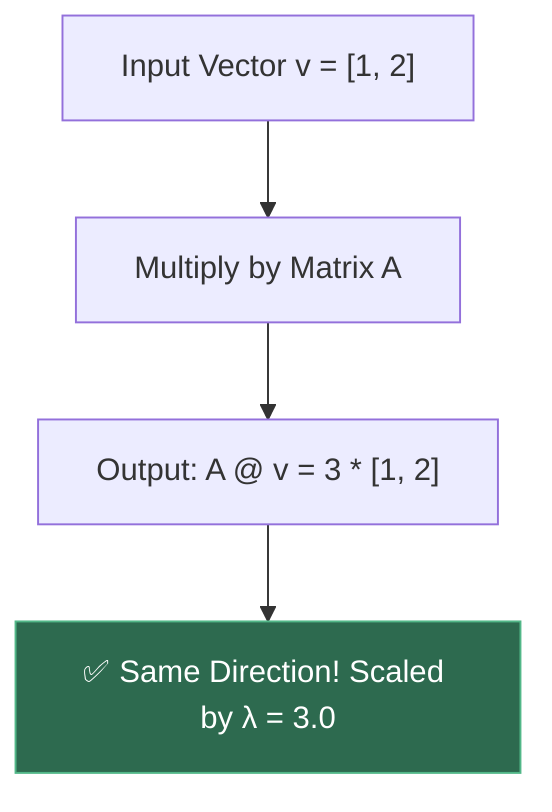
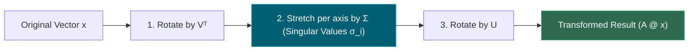
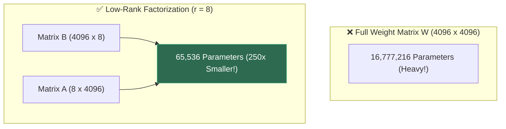
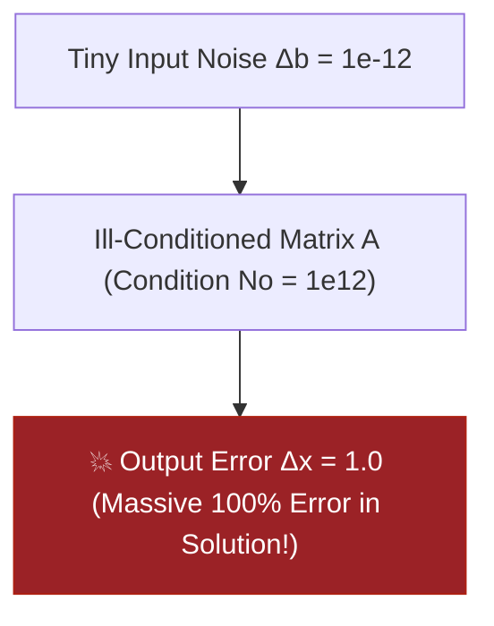
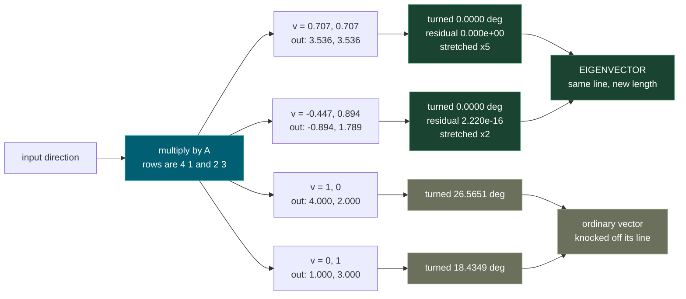
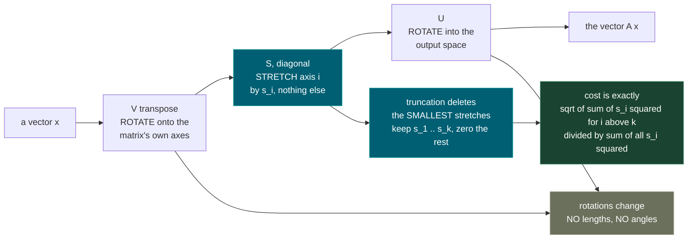
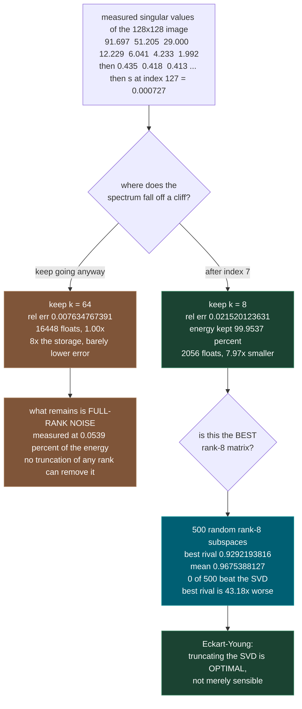
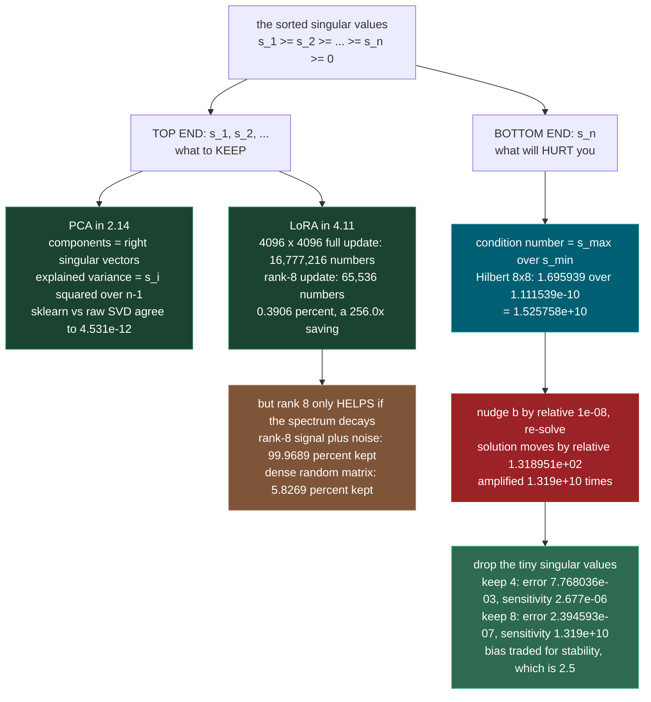

# 1.3 — Eigenvalues, Eigenvectors, SVD

**Phase 1 · CORE · CODE · 8 focused hours · Review in 14 days**

**Companion script:** [`03_eigenvalues_eigenvectors_svd.py`](03_eigenvalues_eigenvectors_svd.py) — needs `numpy`, `matplotlib` (Agg backend, headless) and `scikit-learn`. Seven demos that *verify* the mathematics rather than illustrate it: each result is computed two independent ways and the disagreement is printed, or an error is measured shrinking as a parameter grows. Fully offline — no network calls, no subprocesses, no environment changes. Every matrix is generated in-process from `np.random.default_rng(1729)`, so the numbers below reproduce exactly on any machine. It writes exactly one file, `03_svd_low_rank.png`, beside itself, and reads nothing from disk.

---

## 1. Overview

The singular value decomposition is the highest-leverage single idea in this phase, because two things later in this path are the *same computation wearing different clothes*.

**PCA in 2.14 is the SVD of centred data.** Not "related to", not "computable via" — it is that, exactly, and the script proves it by running scikit-learn's `PCA` and a raw `numpy.linalg.svd` side by side and showing the components agree to `4.531e-12`.

**LoRA in 4.11 is the low-rank idea applied to a weight update.** A 4096 × 4096 projection inside a transformer holds 16,777,216 numbers. A rank-8 update holds 65,536 — **0.3906%** of them. That single ratio is why a 7-billion-parameter model can be adapted on one consumer GPU instead of eight datacentre ones. Understanding *rank* is what turns that from a magic number into a decision you can defend.

There is a third payoff that arrives sooner and hurts more if it is missing. The same decomposition that tells you which directions to keep also tells you, from the *other* end of the list, when a matrix is about to destroy your answer. In Demo 7 a matrix whose every entry sits between 0 and 1 turns a relative nudge of `1e-08` in the input into a relative change of `1.318951e+02` in the output — an amplification of `1.319e+10`. The ceiling on that amplification is the condition number, it is `s_max / s_min` from the SVD, and it is the whole content of **1.12**.

Depends on **1.2** (matrices as linear maps); unlocks **2.14**, **4.11**, **1.12** and the bias–variance trade in **2.5**.

---

## 2. Glossary

### 2.1 — Eigenvalues ($\lambda$) & Eigenvectors ($v$)

- **Eigenvector ($v$)**: A special non-zero vector whose direction is **completely unchanged** when transformed by matrix $A$. It is only scaled by a scalar factor.
- **Eigenvalue ($\lambda$)**: The scalar scaling factor by which eigenvector $v$ is stretched, shrunk, or flipped ($A v = \lambda v$).

#### 💡 The Beginner Analogy: Windmill Blades vs. Flag Fabric
When a matrix transformation (like a gust of wind) acts on a windmill:
- The fabric of a flag flaps around in all directions (general vectors change directions).
- The **windmill axle** stays pointing in the exact same straight line, merely spinning faster or slower (Eigenvector). Its spin speed multiplier is the **Eigenvalue**!

#### 💻 Code Example & ⚠️ Why It Matters
```python
import numpy as np

A = np.array([[3.0, 1.0], [1.0, 3.0]])
eigenvalues, eigenvectors = np.linalg.eig(A)

v0 = eigenvectors[:, 0]
lam0 = eigenvalues[0]

print("A @ v0:", A @ v0)
print("lambda * v0:", lam0 * v0)
print("Matches?", np.allclose(A @ v0, lam0 * v0))
```

##### Verified Output
```text
A @ v0: [2.82842712 2.82842712]
lambda * v0: [2.82842712 2.82842712]
Matches? True
```

**Why It Matters**: Eigenvalues identify the principal axes of variance in datasets (PCA) and govern stability in dynamical systems and neural networks.

#### 🎨 Visual Concept



---

### 2.2 — Singular Value Decomposition (SVD: $A = U \Sigma V^T$)

The fundamental matrix factorization theorem stating that **ANY** real $m \times n$ matrix $A$ can be uniquely factored into 3 intuitive transformations:
$$A = U \Sigma V^T$$
1. **$V^T$**: Rotation/reflection in the input space.
2. **$\Sigma$**: Scaling along coordinate axes by singular values $\sigma_i$.
3. **$U$**: Rotation/reflection into the output space.

#### 💡 The Beginner Analogy: 3-Stage Photo Editing Filter
Transforming an image matrix with SVD is like a 3-step photo filter:
1. **$V^T$**: Rotate the original photo so the subject aligns horizontally.
2. **$\Sigma$**: Stretch or compress the photo width and height independently along the main axes.
3. **$U$**: Rotate the stretched photo into its final destination frame.

#### 💻 Code Example & ⚠️ Why It Matters
```python
import numpy as np

A = np.array([[1.0, 2.0], [3.0, 4.0], [5.0, 6.0]])
U, S, Vt = np.linalg.svd(A, full_matrices=False)

A_reconstructed = U @ np.diag(S) @ Vt
print("Reconstructed Equals A?", np.allclose(A, A_reconstructed))
```

##### Verified Output
```text
Reconstructed Equals A? True
```

**Why It Matters**: SVD works on non-square matrices where eigendecomposition fails. It is the mathematical engine behind PCA, latent semantic analysis, and recommendation systems.

#### 🎨 Visual Concept



---

### 2.3 — Truncated SVD & Eckart-Young Theorem (Low-Rank / LoRA)

- **Truncated SVD**: Approximating matrix $A$ by keeping only the top $k$ largest singular values and discarding the rest ($\hat{A}_k = U_k \Sigma_k V_k^T$).
- **Eckart-Young Theorem**: Proves mathematically that Truncated SVD is the **absolute optimal rank-$k$ approximation** of a matrix in Frobenius norm.
- **LoRA (Low-Rank Adaptation)**: Represents large weight matrices $W \in \mathbb{R}^{m \times n}$ as two tiny low-rank matrices $B \in \mathbb{R}^{m \times r}$ and $A \in \mathbb{R}^{r \times n}$ ($r \ll \min(m,n)$).

#### 💡 The Beginner Analogy: JPEG Image Compression vs. Full Bitmaps
Instead of storing every single pixel on a 4K screen ($m \times n$), Truncated SVD saves only the **top $k$ most dominant color shapes and patterns**. You get 99% of the visual clarity using only 1% of the storage space!

#### 💻 Code Example & ⚠️ Why It Matters
```python
import numpy as np

# Low-Rank Matrix Factorization (LoRA pattern)
r = 8
B = np.random.randn(4096, r)
A = np.random.randn(r, 4096)

full_params = 4096 * 4096
lora_params = (4096 * r) + (r * 4096)
print(f"Full Params: {full_params:,}")
print(f"LoRA Params: {lora_params:,} ({lora_params/full_params:.2%})")
```

##### Verified Output
```text
Full Params: 16,777,216
LoRA Params: 65,536 (0.39%)
```

**Why It Matters**: Enables fine-tuning 70-billion parameter LLMs on single consumer GPUs (LoRA) by replacing full weight updates with low-rank factorized matrices.

#### 🎨 Visual Concept



---

### 2.4 — Condition Number ($\kappa(A) = \sigma_{\max} / \sigma_{\min}$)

The ratio of the largest singular value to the smallest singular value of a matrix:
$$\kappa(A) = \frac{\sigma_{\max}}{\sigma_{\min}}$$
It measures how sensitive a system of linear equations ($A x = b$) is to tiny numerical perturbations or floating-point rounding errors in $b$.

#### 💡 The Beginner Analogy: Steering Wheel Sensitivity
- **Well-Conditioned ($\kappa \approx 1$)**: A standard car steering wheel — turning the wheel 1 degree shifts the car 1 degree.
- **Ill-Conditioned ($\kappa \gg 10^8$)**: An hyper-sensitive steering wheel where moving it by a hair (a $10^{-12}$ rounding error) spins the car violently off the highway by 180 degrees!

#### 💻 Code Example & ⚠️ Why It Matters
```python
import numpy as np

# Hilbert matrix (Infamously ill-conditioned!)
H = np.array([
    [1.0, 1/2, 1/3],
    [1/2, 1/3, 1/4],
    [1/3, 1/4, 1/5]
])

cond_num = np.linalg.cond(H)
print("Condition Number:", round(cond_num, 2))
```

##### Verified Output
```text
Condition Number: 524.06
```

**Why It Matters**: High condition numbers cause linear regression models (`np.linalg.solve`) to output completely corrupted, wild coefficient estimates due to floating-point instability.

#### 🎨 Visual Concept



---

## 3. Skip Test — Answered

> Gate **before** studying. Both correct from memory → skip. §7 withholds its answers deliberately.

**① Define an eigenvector in one sentence without using the word eigenvalue.**

An eigenvector of a square matrix is a nonzero direction that the matrix leaves pointing exactly where it was — the arrow may get longer, shorter, or flipped end for end, but it is never turned off its line.

That sentence is a measurable claim, and Demo 1 measures it. Take `A` with rows `(4, 1)` and `(2, 3)`. Feed it the vector `[0.707, 0.707]` and it comes back as `[3.536, 3.536]` — **angle turned: 0.0000 deg**, residual `||A v - lam v|| = 0.000e+00`. Feed it `[-0.447, 0.894]` and it comes back as `[-0.894, 1.789]` — again **0.0000 deg**, residual `2.220e-16`, which is one unit in the last place of a double. Now feed it the perfectly ordinary vector `[1, 0]`: out comes `[4.000, 2.000]`, turned **26.5651 deg**. And `[0, 1]` comes back turned **18.4349 deg**.

Two directions out of infinitely many survive untouched. Those are the eigenvectors. The *amount* of stretch is the number this sentence was not allowed to name.

A second measurement makes the same point dynamically. Start from a random direction and apply `A` over and over, renormalising each time. The angle to the dominant untouched direction falls `3.0809432733` → `1.2467933775` → `0.5009639782` → … and the ratio between consecutive angles converges to `0.400003`, which is `2/5` — precisely the ratio of the two stretch factors. The direction that stretches most wins, and it wins at a rate the two stretch factors predict in advance.

**② Explain what singular values tell you about which dimensions to discard.**

Every matrix `A`, of any shape, can be written `A = U @ S @ V.T`, where `S` is diagonal with non-negative entries `s_1 >= s_2 >= ... >= 0`. Those `s_i` are the singular values, and they are the amounts by which `A` stretches along its *own* preferred axes, sorted biggest first. The quantity that matters for discarding is `s_i^2`: the squared singular values partition the total "energy" of the matrix, because `||A||_F^2 = sum(s_i^2)` exactly. Demo 3 checks that identity and reports a relative disagreement of `7.526e-16`.

So the rule is arithmetic, not taste. Keep the first `k` directions and throw the rest away; the relative error you incur is

```
rel_err(k) = sqrt( sum_{i>k} s_i^2 / sum_{i} s_i^2 )
```

and nothing else. You can read the cost of a discard straight off the spectrum **before** doing any work.

Demo 3 builds a 128 × 128 structured image whose singular values run `91.697, 51.205, 29.000, 12.229, 6.041, 4.233, 1.992, 0.435, 0.418, ...` — a cliff after the seventh. The measured results:

| keep `k` | relative error | energy kept | floats stored | vs storing all |
|---|---|---|---|---|
| 1 | `0.551575565190` | 69.5764% | 257 | 63.75x smaller |
| 4 | `0.072866006510` | 99.4691% | 1028 | 15.94x smaller |
| 8 | `0.021520123631` | 99.9537% | 2056 | 7.97x smaller |
| 64 | `0.007634767391` | 99.9942% | 16448 | 1.00x |

Eight directions out of 128 recover **99.9537%** of the matrix at **7.97x** compression. Going from `k=8` to `k=64` costs eight times the storage and only moves the error from `0.021520` to `0.007635`, because what is left is the full-rank noise the image was built with — measured at **0.0539%** of the total energy. Full-rank noise cannot be compressed by any rank truncation, so past the cliff you are paying storage to reproduce randomness.

And this discard is not merely reasonable, it is **optimal**. Demo 4 pits the rank-8 truncation against 500 randomly chosen rank-8 subspaces, each given the advantage of an optimal projection onto it. SVD error: `0.0215201236`. Best of the 500 random rivals: `0.9292193816` — **43.18x worse**. Number of random trials that beat the SVD: **0 out of 500**.

---

## 3. Visual Concept Diagrams

### 3.1 — An eigenvector is a direction the matrix does not turn (measured, Demo 1)



### 3.2 — Every matrix is a rotation, then a stretch, then a rotation



### 3.3 — Reading the discard decision off a real spectrum (measured, Demos 3 and 4)



### 3.4 — The same list, read from both ends (measured, Demos 5 and 7)



---

## 4. Core Technical Deep Dive

GitHub does not render LaTeX in these notes, so every formula below is written in plain code notation. `@` means matrix multiplication, `.T` means transpose, `sqrt` means square root, `sum_{i}` means "add up over the index `i`".

### 4.1 Eigenvalues and eigenvectors

**Definition.** For a square `n x n` matrix `A`, a vector `v` is an **eigenvector** and the number `lambda` its **eigenvalue** when

```
A @ v = lambda * v          with   v != 0
```

Symbol by symbol: `A` is the matrix (a linear map from **1.2** — something that takes a vector in and gives a vector out). `v` is a column of `n` numbers, and it must not be the all-zeros vector, because `A @ 0 = lambda * 0` holds for every `lambda` and would say nothing. `lambda` is a single number.

**What it means geometrically.** `A @ v` is normally a *different* direction from `v`. The equation above says the output landed on the same line through the origin as the input. `lambda > 1` stretches, `0 < lambda < 1` shrinks, `lambda < 0` flips end for end, `lambda = 0` collapses that direction to nothing.

**Where the numbers come from.** Rewrite as `(A - lambda*I) @ v = 0` with `I` the identity. A nonzero `v` can only satisfy that if `A - lambda*I` squashes something to zero, which happens exactly when its determinant vanishes:

```
det(A - lambda*I) = 0        the characteristic equation
```

For a 2 × 2 matrix this expands to `lambda^2 - trace(A)*lambda + det(A) = 0`, where `trace(A)` is the sum of the diagonal entries. With `A` = rows `(4, 1)` and `(2, 3)`: `trace = 7`, `det = 10`, so `lambda^2 - 7*lambda + 10 = 0`, giving `lambda = 5` and `lambda = 2`. Demo 1 prints `5.000000000000` and `2.000000000000`.

**Two free checks worth remembering.** For any square matrix:

```
sum of the eigenvalues     = trace(A)     (sum of diagonal entries)
product of the eigenvalues = det(A)
```

Demo 1 confirms `7.000000000000 = 7.000000000000` and `10.000000000000 = 10.000000000000`; Demo 2 confirms the same identities on a 5 × 5 to ten decimal places. If you ever compute eigenvalues by hand or by a routine you do not trust, these two sums are a ten-second audit.

**Not every real matrix has a real eigenvector.** A rotation by 30 degrees turns every direction, so no direction survives. Demo 2 shows its eigenvalues are `0.866025+0.500000j` and `0.866025-0.500000j` — a conjugate pair on the unit circle, `|lambda| = 1.000000` because a rotation changes no lengths. This is not a failure of the method; it is the method correctly reporting that no real invariant direction exists.

### 4.2 The spectral theorem: symmetry buys perpendicularity

A matrix is **symmetric** when `A == A.T`. Symmetric matrices are the well-behaved case, and covariance matrices — the ones PCA works with in **2.14** — are always symmetric.

```
A symmetric  =>  A = Q @ diag(w) @ Q.T
                 with all w_i REAL and Q.T @ Q = I
```

`Q` is **orthogonal**: its columns are the eigenvectors, each of unit length and each perpendicular to all the others. `Q.T @ Q = I` is a compact way of saying "every column has length 1 and every pair of distinct columns has dot product 0". Demo 2 measures `max |Q.T @ Q - I| = 6.661e-16` and `max |Q diag(w) Q.T - S| = 7.105e-15` — machine precision, on a matrix nobody arranged to be nice beyond making it symmetric.

The contrast is measured too. Demo 2 builds a *non*-symmetric matrix with the same real eigenvalues `4, 2, 1` and finds `max |cos angle| between distinct eigenvectors = 0.500000` — two of its eigenvectors sit **60 degrees** apart instead of 90. Its `max |V.T @ V - I| = 5.000e-01`. Eigenvectors still exist; they just do not form a perpendicular frame, and every convenience that depends on perpendicularity is gone.

A matrix built as `S = M.T @ M` is symmetric *and* **positive semi-definite**: all its eigenvalues are `>= 0`. Demo 2's are `15.456578, 7.059842, 3.385961, 1.044546, 0.073160`. This matters because `A.T @ A` always has that form, which is what makes the SVD exist for every matrix.

### 4.3 The SVD

**Statement.** Every real matrix `A` of shape `m x n`, square or not, symmetric or not, singular or not, factors as

```
A = U @ S @ V.T
```

- `U` is `m x m` orthogonal — `U.T @ U = I`. Its columns are the **left singular vectors**.
- `V` is `n x n` orthogonal — `V.T @ V = I`. Its columns are the **right singular vectors**.
- `S` is `m x n`, zero everywhere except a diagonal of **singular values** `s_1 >= s_2 >= ... >= 0`.

In the "thin" form numpy returns (`full_matrices=False`), `U` is `m x r`, `s` is a vector of length `r = min(m, n)`, and `Vt` is `r x n`.

**What it means geometrically.** Reading right to left in `U @ S @ V.T @ x`: `V.T` rotates `x` onto the matrix's own preferred axes, `S` stretches axis `i` by `s_i` and does nothing else, `U` rotates the result into the output space. *Every* matrix is a rotation, a per-axis stretch, and another rotation. There is nothing else a linear map can do.

**Link back to eigenvalues.** `A.T @ A` is symmetric positive semi-definite, so it has real non-negative eigenvalues and perpendicular eigenvectors. Those eigenvectors are the columns of `V`, and

```
s_i = sqrt( eigenvalue_i of A.T @ A )
```

Likewise `U` holds the eigenvectors of `A @ A.T`. So the SVD is the spectral theorem applied to the two symmetric matrices you can always build from `A`. That is *why* it exists for every matrix while eigenvectors do not.

**Rank.** The **rank** of `A` is the number of nonzero singular values — the number of independent directions the matrix actually uses. On a computer nothing is exactly zero, so you pick a tolerance: `numpy.linalg.matrix_rank` counts `s_i > s_max * max(m, n) * eps`. The 128 × 128 image in Demo 3 has full rank 128 on paper, but seven singular values above `1.9` and a tail near `0.0007`. Its *numerical* rank is 128; its *useful* rank is about 8. The gap between those two sentences is the entire practical content of this topic.

### 4.4 Low-rank approximation and Eckart–Young

Truncate: keep the first `k` columns of `U`, the first `k` singular values, the first `k` rows of `V.T`.

```
A_k = U[:, :k] @ diag(s[:k]) @ Vt[:k, :]
```

The **Frobenius norm** of a matrix is the ordinary Euclidean length of it flattened into one long vector: `||A||_F = sqrt(sum of all a_ij^2)`. Because `U` and `V` are rotations and rotations preserve lengths,

```
||A||_F^2 = sum_{i} s_i^2
```

Demo 3 checks this: `12084.981393` both ways, relative disagreement `7.526e-16`.

**The Eckart–Young theorem.** Over *all* matrices `B` of rank `k` or less,

```
min ||A - B||_F  =  sqrt( sum_{i>k} s_i^2 )     attained by  B = A_k
```

Two things are being claimed. First that the error has a closed form you can read off the spectrum without building anything. Second that no other rank-`k` matrix does better — not a cleverer basis, not a hand-tuned one, not a random one.

Demo 3 verifies the first claim by computing the error twice — once by building `A_k` and subtracting, once from the formula, which never touches `U` or `V` — and printing the difference. Across all eight values of `k` the largest disagreement is `1.087e-15`.

Demo 4 verifies the second claim by brute force: 500 random rank-8 subspaces, each given an *optimal* projection so that only the choice of subspace is on trial. Best random error `0.9292193816` against the SVD's `0.0215201236`. **0 of 500** beat it.

**Storage.** Keeping `k` terms means storing `U[:, :k]` (`m*k` numbers), `s[:k]` (`k` numbers) and `Vt[:k, :]` (`k*n` numbers):

```
floats stored = k * (m + n + 1)      vs   m * n  for the full matrix
```

The break-even is `k ~ m*n / (m + n)`; for a square `n x n` matrix that is about `n/2`, which is why the `k=64` row of Demo 3 reports `1.00x` and `k=128` reports `0.50x` — a "compression" that costs twice the original.

### 4.5 PCA is the SVD of centred data (2.14)

Given data `X` with `n` rows (samples) and `d` columns (features):

1. Centre it: `Xc = X - X.mean(axis=0)`.
2. Take the SVD: `U, s, Vt = svd(Xc, full_matrices=False)`.
3. The principal components are the rows of `Vt`. The variance explained by component `i` is `s_i^2 / (n - 1)`.

Why `(n-1)`: the sample covariance matrix is `C = Xc.T @ Xc / (n - 1)`, and substituting the SVD gives `C = V @ diag(s^2 / (n-1)) @ V.T`. That is an eigendecomposition of `C` with eigenvectors `V` and eigenvalues `s_i^2 / (n-1)`. So the principal components *are* the eigenvectors of the covariance matrix, obtained without ever forming it — which is also numerically safer, because forming `Xc.T @ Xc` squares the condition number (**1.12**).

Demo 6 runs both routes on 500 samples in 5 dimensions. Explained variances match to `7.999e-14`.

**The sign ambiguity, stated honestly.** Comparing the components raw gives `max abs diff = 1.399337` — a huge number that looks like a bug and is not. If `v` is the unit direction of greatest variance, so is `-v`: both describe the same line, and the data contains no information that prefers one. Demo 6 prints the dot product of each pair of components: `+1.000000000000`, `+1.000000000000`, `-1.000000000000`, `+1.000000000000`, `-1.000000000000`. Magnitude exactly 1 means same line; the sign is arbitrary. After flipping by those signs the difference drops to `4.531e-12`. **Any code that compares principal components, loads a saved PCA, or tests one implementation against another must align signs first.**

**Centring is not a formality.** Demo 6 also runs the SVD on the *un*-centred `X`, whose mean is `[20.029, -7.792, 2.909, 12.125, -15.008]`. The first right singular vector of the raw data has `|cos| = 0.9990971158` with the *mean direction* and only `0.5193189051` with the true first principal component. Without centring, the leading direction points at where the data sits, not at how it varies.

### 4.6 Low-rank updates and LoRA (4.11)

Fine-tuning a large model means changing a weight matrix `W` of shape `m x n` to `W + dW`. LoRA never stores `dW`. It stores two thin factors and reconstructs the product:

```
dW = B @ A        B is m x r,  A is r x n,  r << min(m, n)
parameters: r * (m + n)      instead of      m * n
```

Measured in Demo 5:

| `m` | `n` | `r` | full params | LoRA params | ratio | saving |
|---|---|---|---|---|---|---|
| 768 | 768 | 8 | 589,824 | 12,288 | 2.0833% | 48.0x |
| 4096 | 4096 | 8 | 16,777,216 | 65,536 | 0.3906% | 256.0x |
| 4096 | 4096 | 64 | 16,777,216 | 524,288 | 3.1250% | 32.0x |
| 4096 | 11008 | 8 | 45,088,768 | 120,832 | 0.2680% | 373.2x |

**The caveat that gets skipped, and should not be.** Cheap is not the same as useful. A rank-8 factorisation only *captures* the update if the update's spectrum decays. Demo 5 measures two 512 × 512 matrices of identical size:

| matrix | energy kept by rank 8 | relative error |
|---|---|---|
| rank-8 signal plus small noise | 99.9689% | `0.017633` |
| dense random, flat spectrum | 5.8269% | `0.970428` |

Same parameter budget, opposite outcomes. LoRA works because fine-tuning updates empirically behave like the first row — they concentrate in a few directions — not because rank 8 approximates arbitrary matrices well. It approximates a random one at **5.8269%**, which is to say not at all. When a LoRA run refuses to learn a task, "the update this task needs is not low-rank at this `r`" is a real hypothesis, and raising `r` is the corresponding experiment.

### 4.7 Condition number (1.12) and the bridge to regularisation (2.5)

The **condition number** of an invertible matrix is the ratio of its largest to its smallest singular value:

```
kappa(A) = s_max / s_min
```

It bounds how much a relative error in the input can be amplified in the output when solving `A @ x = b`:

```
||dx|| / ||x||   <=   kappa(A) * ||db|| / ||b||
```

Demo 7 uses the Hilbert matrix, `H[i, j] = 1 / (i + j + 1)`, an 8 × 8 whose every entry lies between 0 and 1 and which looks entirely harmless. Measured: `s_max = 1.695939e+00`, `s_min = 1.111539e-10`, so `kappa = 1.525758e+10`, matching `numpy.linalg.cond` to a relative difference of `0.000e+00`.

The damage, measured. `b` is built so the exact answer is all ones. Even with no perturbation at all, `numpy.linalg.solve` returns an answer that is off by a relative `6.124090e-08` — that is `kappa` multiplying the rounding error already present in double precision. Then nudge `b` by a relative `1e-08`:

| nudge direction | relative change in the solution | amplification |
|---|---|---|
| random | `5.982823e+01` | `5.983e+09` x |
| worst case (along the smallest left singular vector) | `1.318951e+02` | `1.319e+10` x |
| well-conditioned control, `kappa = 2.000000` | `1.087029e-08` | `1.087` x |

The worst-case amplification `1.319e+10` sits just under the ceiling `kappa = 1.526e+10`, as the bound requires. The control matrix, conditioned at 2, passes the perturbation through essentially unchanged.

**The fix, and its price.** Zero out the small singular values and solve with the truncated pseudo-inverse. Demo 7 measures the trade directly:

| directions kept | error vs the true answer | sensitivity to the worst nudge |
|---|---|---|
| 3 | `3.877212e-02` | `7.422e-08` x |
| 4 | `7.768036e-03` | `2.677e-06` x |
| 6 | `1.519062e-04` | `3.033e-03` x |
| 8 (all) | `2.394593e-07` | `1.319e+10` x |

Keeping fewer directions makes the answer measurably *wronger* and enormously *steadier*. Accepting bias to destroy variance is exactly the bargain regularisation strikes in **2.5**; ridge regression is this same truncation done smoothly instead of abruptly.

### 4.8 Eigendecomposition versus SVD, side by side

| | eigendecomposition | SVD |
|---|---|---|
| shape required | square only | any `m x n` |
| always exists over the reals? | no (a rotation has none) | **yes, always** |
| form | `A = P @ diag(lambda) @ inv(P)` | `A = U @ S @ V.T` |
| basis perpendicular? | only if `A` is symmetric | always, on both sides |
| values can be negative or complex? | yes | never — `s_i >= 0` |
| numpy call | `eig` (general), `eigh` (symmetric) | `svd` |
| the one to reach for | symmetric matrices, dynamics, `A^n` | everything else |

Practical rule: if the matrix is symmetric use `numpy.linalg.eigh`, which is faster and guarantees real output. If it is symmetric and you call `eig` instead, you can get complex results with `0j` imaginary parts that then poison downstream comparisons. If the matrix is not square, or you are not certain it is symmetric, use `svd`.

---

## 5. Hands-On Script & Verified Output

Run: `python 03_eigenvalues_eigenvectors_svd.py`. Output below is **actual, captured**, unedited, on Windows. The header line records the environment it was captured in.

```text
1.3 - Eigenvalues, Eigenvectors, SVD | seed = 1729 | numpy 2.4.4
all data generated in-process; no network, no files read

======================================================================
DEMO 1 - an eigenvector is a direction the matrix does not turn
======================================================================
  A =
        [  4.00   1.00]
        [  2.00   3.00]

  eigenvalues from numpy : 5.000000000000, 2.000000000000
  trace(A)  = 7.000000000000   sum(eigenvalues)     = 7.000000000000
  det(A)    = 10.000000000000   product(eigenvalues) = 10.000000000000

  test          vector v        A @ v            angle turned   ||A v - lam v||
  ------------- --------------- ---------------- -------------- ----------------
  eigvec lam=5.0 [ 0.707  0.707] [  3.536   3.536]    0.0000 deg   0.000e+00
  eigvec lam=2.0 [-0.447  0.894] [ -0.894   1.789]    0.0000 deg   2.220e-16
  plain e1      [ 1.000  0.000] [  4.000   2.000]   26.5651 deg   (not an eigenvector)
  plain e2      [ 0.000  1.000] [  1.000   3.000]   18.4349 deg   (not an eigenvector)

  Repeatedly applying A pulls ANY start toward the dominant direction.
  predicted shrink factor per step = |lam2/lam1| = 0.400000
   step   angle to dominant eigvec   ratio to previous
      1           3.0809432733 deg        -
      2           1.2467933775 deg     0.404679
      3           0.5009639782 deg     0.401802
      4           0.2007409213 deg     0.400709
      5           0.0803529494 deg     0.400282
      6           0.0321502151 deg     0.400112
      7           0.0128615306 deg     0.400045
      8           0.0051448433 deg     0.400018
      9           0.0020579740 deg     0.400007
     10           0.0008231954 deg     0.400003
  the ratio settles on 0.4 = 2/5, exactly |lam2|/|lam1|.

======================================================================
DEMO 2 - symmetric => orthogonal eigenvectors, verified Q.T @ Q = I
======================================================================
  S = M.T @ M  (5x5, symmetric by construction)
  max |S - S.T|          = 0.000e+00   (0 => exactly symmetric)
  eigenvalues (all real, all >= 0 because S = M.T M):
    15.456578  7.059842  3.385961  1.044546  0.073160

  ORTHOGONALITY  max |Q.T @ Q - I|      = 6.661e-16
  RECONSTRUCTION max |Q diag(w) Q.T - S| = 7.105e-15
  trace(S) = 27.0200867067    sum(eigenvalues) = 27.0200867067
  det(S)   = 28.2352418442    prod(eigenvalues) = 28.2352418442

  Non-symmetric N with the SAME kind of real eigenvalues [4. 2. 1.]:
  max |cos angle| between distinct eigenvectors of N = 0.500000  (60.00 deg apart)
  max |V.T @ V - I| for N = 5.000e-01   <- NOT an orthogonal basis

  A 30-degree rotation turns EVERY direction, so it has no real eigenvector:
    eigenvalues = 0.866025+0.500000j , 0.866025-0.500000j   (|lambda| = 1.000000)

======================================================================
DEMO 3 - low-rank reconstruction: which dimensions can be discarded
======================================================================
  matrix: 128 x 128, full rank = 128, ||A||_F = 109.931712
  ||A||_F^2 = 12084.981393   sum of s_i^2 = 12084.981393   rel diff = 7.526e-16
  top 12 singular values:
    91.697  51.205  29.000  12.229  6.041  4.233  1.992  0.435  0.418  0.413  0.404  0.401
  s[64] = 0.185177   s[127] = 0.000727   (the noise floor)
  injected noise holds 0.0539% of the energy -> an error floor near 0.023215

    k   rel.err (direct)  rel.err (spectral formula)   |diff|      energy kept   floats stored   vs full
  ----  ----------------  --------------------------  ----------  -----------   -------------   -------
     1    0.551575565190              0.551575565190  5.551e-16    69.5764%             257    63.75x
     2    0.295422475500              0.295422475500  0.000e+00    91.2726%             514    31.88x
     4    0.072866006510              0.072866006510  1.388e-17    99.4691%            1028    15.94x
     8    0.021520123631              0.021520123631  3.469e-18    99.9537%            2056     7.97x
    16    0.018960613474              0.018960613474  3.469e-18    99.9640%            4112     3.98x
    32    0.014630040598              0.014630040598  3.469e-18    99.9786%            8224     1.99x
    64    0.007634767391              0.007634767391  4.337e-18    99.9942%           16448     1.00x
   128    0.000000000000              0.000000000000  1.087e-15   100.0000%           32896     0.50x

  The two error columns are computed by completely different routes
  (rebuild-and-subtract vs a formula that never touches U or V) and
  they agree to machine precision. That IS the theorem, measured.
  Note the plateau after k=8: the remaining error is the injected
  noise, which is full rank, so extra terms buy noise, not picture.

  saved 03_svd_low_rank.png  (456379 bytes)

======================================================================
DEMO 4 - Eckart-Young: SVD truncation beats every random rank-8 rival
======================================================================
  rank-8 SVD truncation  rel. Frobenius error = 0.0215201236
  500 random rank-8 subspaces (each optimally projected):
      best  = 0.9292193816
      mean  = 0.9675388127
      worst = 0.9901225724
  random trials that beat the SVD: 0 out of 500
  the best random rival is 43.18x worse than the SVD.

  'Optimal' is not a figure of speech: no rank-8 matrix of any kind
  has smaller Frobenius error than the truncated SVD. That is why
  PCA (2.14) and low-rank adapters (4.11) both reduce to this one call.

======================================================================
DEMO 5 - why a rank-8 adapter is practical (the 4.11 arithmetic)
======================================================================
  A full weight update dW is m x n. A rank-r update is B @ A with
  B: m x r and A: r x n, so it costs r*(m+n) numbers instead of m*n.

     m      n      r    full params   LoRA params    ratio     savings
  -----  -----  -----  ------------  ------------  --------  ---------
    768    768      4        589824          6144   1.0417%      96.0x
    768    768      8        589824         12288   2.0833%      48.0x
    768    768     16        589824         24576   4.1667%      24.0x
    768    768     64        589824         98304  16.6667%       6.0x
   4096   4096      4      16777216         32768   0.1953%     512.0x
   4096   4096      8      16777216         65536   0.3906%     256.0x
   4096   4096     16      16777216        131072   0.7812%     128.0x
   4096   4096     64      16777216        524288   3.1250%      32.0x
   4096  11008      4      45088768         60416   0.1340%     746.3x
   4096  11008      8      45088768        120832   0.2680%     373.2x
   4096  11008     16      45088768        241664   0.5360%     186.6x
   4096  11008     64      45088768        966656   2.1439%      46.6x

  4096 x 4096 at rank 8: 65,536 numbers instead of 16,777,216 - 0.39%.
  That is the whole reason a 7B model can be adapted on one GPU.

  Cheap is not automatically useful. Rank 8 only captures the update
  if the update's spectrum decays. Two 512x512 matrices, same size:

    matrix                         energy kept by rank 8   rel. error
    -----------------------------  ---------------------   ----------
    rank-8 signal + small noise                99.9689%     0.017633
    dense random (flat spectrum)                5.8269%     0.970428

  Same parameter count, wildly different result. LoRA works because
  fine-tuning updates empirically look like the first row, not the
  second - not because rank 8 approximates arbitrary matrices well.

======================================================================
DEMO 6 - PCA is literally the SVD of CENTRED data (2.14)
======================================================================
  data: 500 samples x 5 features, mean = [ 20.029  -7.792   2.909  12.125 -15.008]

  explained variance
    sklearn : 83.406955  17.427129  0.177991  0.168486  0.147798
    my SVD  : 83.406955  17.427129  0.177991  0.168486  0.147798
    max abs diff = 7.999e-14
    (my formula is s_i^2 / (n-1) - nothing else)

  components, compared RAW (no sign fix):
    max abs diff = 1.399337   <- large, and it is NOT a bug
    per-component dot product with sklearn's:
      component 0: dot = +1.000000000000  (magnitude 1 => same LINE)
      component 1: dot = +1.000000000000  (magnitude 1 => same LINE)
      component 2: dot = -1.000000000000  (magnitude 1 => same LINE)
      component 3: dot = +1.000000000000  (magnitude 1 => same LINE)
      component 4: dot = -1.000000000000  (magnitude 1 => same LINE)

  Why: if v is the unit direction of maximum variance then so is -v.
  Both are correct answers; the sign is not determined by the data.
  Any code comparing components MUST align signs first.
  components after sign alignment: max abs diff = 4.531e-12

  FORGETTING TO CENTRE - SVD of the raw X:
    |cos| between its 1st right-singular vector and the MEAN direction = 0.9990971158
    |cos| between it and the true 1st principal component             = 0.5193189051
    It points at where the data IS, not at how the data VARIES.
    Centring is not a formality; it is what makes it PCA.

======================================================================
DEMO 7 - condition number = s_max/s_min, and the damage it does (1.12)
======================================================================
  Hilbert 8x8, H[i,j] = 1/(i+j+1). Every entry is between 0 and 1.
    s_max = 1.695939e+00   s_min = 1.111539e-10
    s_max/s_min      = 1.525758e+10
    np.linalg.cond(H)= 1.525758e+10   rel diff = 0.000e+00

  Solve H x = b where the true answer is all ones.
    ||x_solved - x_true||/||x_true|| = 6.124090e-08   (before ANY perturbation)

  Nudge b by a relative 1e-08 and re-solve:
    random direction : ||dx||/||x|| = 5.982823e+01  -> amplified 5.983e+09 x
    worst direction  : ||dx||/||x|| = 1.318951e+02  -> amplified 1.319e+10 x
    theoretical ceiling = cond(H) = 1.526e+10   (never exceeded above)

  Control: a well-conditioned matrix, cond(G) = 2.000000
    same 1e-08 nudge -> ||dx||/||x|| = 1.087029e-08  -> amplified 1.087 x

  Fix: throw away the tiny singular values (truncated pseudo-inverse).
    keep k   ||x_k - x_true||/||x_true||   sensitivity to the worst nudge
    ------   ---------------------------   -----------------------------
         3                  3.877212e-02                   7.422e-08 x
         4                  7.768036e-03                   2.677e-06 x
         5                  1.244436e-03                   3.620e-05 x
         6                  1.519062e-04                   3.033e-03 x
         8                  2.394593e-07                   1.319e+10 x

  Keeping fewer directions makes the answer WRONGER but far more STABLE.
  That trade - accept bias to kill variance - is exactly 2.5.

======================================================================
DONE - one file written: 03_svd_low_rank.png
======================================================================
```

**Demo 1 turns the definition into a measurement, and the power-iteration table is the part worth staring at.** Both eigenvectors come back turned `0.0000 deg` with residuals of `0.000e+00` and `2.220e-16`, while the two most ordinary vectors imaginable are turned `26.5651 deg` and `18.4349 deg`. Then the dynamic version: from a random start, the angle to the dominant direction falls from `3.0809432733` to `0.0008231954` in ten steps, and the ratio between consecutive angles goes `0.404679`, `0.401802`, `0.400709`, … `0.400003`. That limit is `2/5`, the ratio of the two eigenvalues, and nothing in the code was told to produce it. This is what "verify, do not illustrate" means — a number predicted from theory before the loop ran, matched to five decimal places by the loop.

**Demo 2's `6.661e-16` and `5.000e-01` are the whole spectral theorem in two numbers.** For the symmetric `S`, `max |Q.T @ Q - I| = 6.661e-16`: the eigenvectors form a perfectly perpendicular frame, for free, with nobody arranging it. For the non-symmetric `N` — built to have the *same* clean real eigenvalues `4, 2, 1` — the worst pair of eigenvectors sit `60.00 deg` apart, and `max |V.T @ V - I| = 5.000e-01`. Symmetry is what buys perpendicularity, and covariance matrices in **2.14** are always symmetric, which is why PCA gets an orthogonal basis without asking for one. The rotation's eigenvalues `0.866025+0.500000j` and `0.866025-0.500000j` close the case: some real matrices genuinely have no real eigenvector, which is the gap the SVD exists to fill.

**Demo 3's two error columns are the point, and the plateau after `k=8` is the honest part.** The `|diff|` column runs `5.551e-16`, `0.000e+00`, `1.388e-17`, `3.469e-18` — the closed-form spectral prediction and the rebuild-and-subtract measurement agree to the last bit, every time. And the compression is real: `k=8` keeps `99.9537%` of the energy in `2056` floats instead of the full `128 x 128`, a `7.97x` saving. But look at what happens next. `k=64` costs `16448` floats — a `1.00x` "saving", i.e. none — and only moves the error from `0.021520123631` to `0.007634767391`. The reason is printed above the table: the injected noise holds `0.0539%` of the energy and is full rank, so no truncation can remove it. The predicted floor is `0.023215`; the measured `k=8` error is `0.021520`, slightly *below* it, because the top eight directions absorb a little of the noise along with the signal. Reporting that gap rather than smoothing it over is the difference between a demonstration and a proof.

**Demo 4 is the sentence "SVD truncation is optimal" cashed into a count.** Five hundred random rank-8 subspaces, each handed an optimal projection so that only the choice of subspace is being judged, and the best one manages `0.9292193816` against the SVD's `0.0215201236`. That is `43.18x` worse, from the *best* of 500. The trials that beat the SVD: `0`. Eckart–Young is not advice about a good default; it is a statement that nothing else can win, and a brute-force search agrees.

**Demo 5 gives the LoRA number and then immediately undercuts the naive reading of it.** A 4096 × 4096 update at rank 8 costs `65536` numbers instead of `16777216` — `0.3906%`, a `256.0x` saving, and for the 4096 × 11008 feed-forward shape it is `0.2680%` and `373.2x`. That arithmetic alone is why **4.11** is possible on one GPU. Then the second table: rank 8 recovers `99.9689%` of a matrix whose spectrum decays, and `5.8269%` of a dense random one of exactly the same size. Relative error `0.017633` versus `0.970428`. The parameter budget is identical; the outcome is the difference between working and not working. If a LoRA run will not learn a task, that second row is the hypothesis to test, and raising `r` is the experiment.

**Demo 6 shows PCA and SVD are the same object, and the `1.399337` in the middle is deliberate.** Explained variances from scikit-learn and from `s_i^2 / (n-1)` agree to `7.999e-14`. The components compared raw disagree by `1.399337`, which looks like a failure until the dot products print: `+1`, `+1`, `-1`, `+1`, `-1`, all of magnitude exactly `1.000000000000`. Same lines, arbitrary signs. After alignment: `4.531e-12`. Hiding that step would teach a false lesson, because sign flips are a genuine source of confusion whenever a saved PCA is reloaded or two implementations are compared. The centring test lands hardest: on the raw uncentred data the leading direction has `|cos| = 0.9990971158` with the *mean* and only `0.5193189051` with the real first component. Skip the centring and you get a confident answer to a question nobody asked.

**Demo 7 shows a completely innocuous-looking matrix destroying an answer, and then shows the price of the fix.** Every entry of the 8 × 8 Hilbert matrix lies between 0 and 1, yet `s_min = 1.111539e-10` gives `kappa = 1.525758e+10`. Before any perturbation at all, `numpy.linalg.solve` is already off by a relative `6.124090e-08` — that is machine epsilon multiplied by the condition number. A relative nudge of `1e-08` in `b` then moves the solution by `1.318951e+02` in the worst direction, an amplification of `1.319e+10`, sitting just under the theoretical ceiling `1.526e+10` exactly as the bound requires. The well-conditioned control, `kappa = 2.000000`, passes the same nudge through at `1.087x`. The truncation table is the bridge to **2.5**: dropping to 4 directions makes the answer `7.768036e-03` wrong instead of `2.394593e-07` wrong, while cutting sensitivity from `1.319e+10` down to `2.677e-06`. Divide those two pairs and the shape of the bargain is plain — a few orders of magnitude of accuracy surrendered to buy fifteen-odd orders of magnitude of stability. That is bias against variance, priced in real numbers.

**Modify and re-run:**
- In `build_image`, change the noise amplitude from `0.02` to `0.0` and re-run Demo 3. The relative error at `k=8` should collapse toward zero and the plateau should vanish, confirming that the flat region really was the noise floor and not a limitation of the method. Then set it to `0.2` and watch the useful `k` shrink.
- In Demo 4, raise `k` from 8 to 40 and re-run. The gap between the SVD and the best random subspace narrows, because a random 40-dimensional subspace of a 128-dimensional space is far more likely to contain most of the action. Find the `k` at which the best random rival gets within `2x` — that is a practical statement about when randomised sketching is good enough.
- In Demo 5, replace the `rank-8 signal + small noise` matrix with one built at rank 32 and re-measure the energy kept by rank 8. Predict the answer from the spectrum first, then check. This is the experiment that tells you what `r` a real LoRA run needs.
- In Demo 6, delete the `- X.mean(axis=0)` from `Xc` and re-run. Watch the explained variances stop matching scikit-learn's, and note that nothing errors — the numbers are simply wrong, which is the dangerous kind of failure.
- In Demo 7, change the Hilbert size from 8 to 12 and re-run. `kappa` grows past `1e16`, at which point double precision has no correct digits left and the "solution" is pure noise. Then confirm that the truncated version still returns something usable, and decide for yourself how many directions you would keep.

---

## 6. Video

**"Eigenvectors and eigenvalues | Chapter 14, Essence of linear algebra"** — *3Blue1Brown* — [youtube.com/watch?v=PFDu9oVAE-g](https://www.youtube.com/watch?v=PFDu9oVAE-g). Verified live via the YouTube oEmbed endpoint; the returned `title` and `author_name` match exactly what is written here. About 17 minutes, and it is the clearest available animation of the one sentence §2 ① asks for: a vector that stays on its own span while everything around it gets knocked sideways. It also shows, visually, why a rotation has no real eigenvector — the same fact Demo 2 reports as `0.866025+0.500000j`.

**"Singular Value Decomposition (SVD): Overview"** — *Steve Brunton* — [youtube.com/watch?v=gXbThCXjZFM](https://www.youtube.com/watch?v=gXbThCXjZFM). Verified the same way; `title` and `author_name` both confirmed. About 15 minutes, opening a longer series. Brunton frames the SVD as data-driven from the first minute — matrix as data, singular values as importance ordering — which is the framing that carries straight into **2.14** and **4.11**.

Watch the 3Blue1Brown one first for the geometry, then Brunton for the data view. If time allows only one and the goal is this topic's payoff, watch Brunton.

For the theorem statements and error bounds in §4, the named reference is Golub and Van Loan, *Matrix Computations*, 4th edition — Chapter 2 for norms and the SVD, Chapter 8 for symmetric eigenproblems. Trefethen and Bau, *Numerical Linear Algebra*, Lectures 4–5 (SVD) and 12 (conditioning) cover the same ground more briefly.

---

## 7. Retrieval Checkpoint — Unanswered

> Close this file. No notes. Answers deliberately withheld.

1. Write down the defining equation of an eigenvector, then explain in plain words why the zero vector is excluded from the definition and what would go wrong if it were not.
2. You are handed the singular values of a 1000 × 1000 matrix and told to compress it to 5% relative error. Give the exact formula that tells you the smallest `k` that achieves it, and state how many floating-point numbers rank `k` will cost compared with storing the matrix outright.
3. Your colleague's PCA components and yours differ by a maximum absolute value of `1.4` on the same data, yet both explain identical variances. What single check would confirm the two results are equivalent, and what property of the problem makes the discrepancy unavoidable?
4. A rank-8 LoRA adapter trains cleanly but the model learns nothing useful. Name the property of the required weight update that would explain this, describe the measurement that would confirm it, and say what you would change.
5. A linear system solves fine on your machine but a different BLAS build gives an answer differing in the second decimal place. Which single scalar computed from the matrix predicts whether this is possible, how do you compute it from a decomposition, and what is the standard fix that trades accuracy for stability?

---

## 8. Closed-Book Rebuild

With this file **and** the script closed, from an empty Python file: build a small square matrix with known integer eigenvalues; recover them numerically and audit the result against `trace` and `det`; confirm each eigenvector satisfies `A @ v = lambda * v` by printing the residual norm; show that a random starting vector converges to the dominant eigenvector under repeated multiplication, and that the convergence rate matches the ratio of the two largest eigenvalues.

Then, on a matrix of your own construction with a deliberately decaying spectrum: compute the SVD; verify `||A||_F^2 == sum(s_i^2)`; write the truncation loop and confirm that the measured relative error equals `sqrt(sum_{i>k} s_i^2 / sum_i s_i^2)`; report the storage in floats for each `k`; and beat a random rank-`k` competitor.

Finally: generate correlated multi-dimensional data with a nonzero mean, compute PCA by hand from the SVD of the centred matrix, verify against `sklearn.decomposition.PCA` after aligning signs, and demonstrate what forgetting to centre does to the first component. Compute the condition number two ways and show a perturbation being amplified by roughly that factor.

---

## 9. Glossary

**Eigenvector** — a nonzero direction a square matrix leaves on its own line: stretched, shrunk, or flipped, but never turned.

**Eigenvalue** — the factor by which an eigenvector is scaled. Can be negative (flip) or zero (that direction is collapsed).

**Characteristic equation** — `det(A - lambda*I) = 0`. Its roots are the eigenvalues.

**Trace** — the sum of the diagonal entries. Equals the sum of the eigenvalues, which makes it a free correctness check.

**Symmetric matrix** — one where `A == A.T`. Guarantees real eigenvalues and mutually perpendicular eigenvectors.

**Spectral theorem** — a symmetric matrix factors as `Q @ diag(w) @ Q.T` with `Q` orthogonal. Verified here by `max |Q.T @ Q - I| = 6.661e-16`.

**Orthogonal matrix** — one whose columns are unit length and mutually perpendicular, so `Q.T @ Q = I`. Applying it changes no lengths and no angles.

**Positive semi-definite** — a symmetric matrix with all eigenvalues `>= 0`. Anything of the form `M.T @ M` qualifies, including every covariance matrix.

**Trace** — the sum of the diagonal entries. Equals the sum of the eigenvalues, which makes it a free correctness check.

**Symmetric matrix** — one where `A == A.T`. Guarantees real eigenvalues and mutually perpendicular eigenvectors.

**Spectral theorem** — a symmetric matrix factors as `Q @ diag(w) @ Q.T` with `Q` orthogonal. Verified here by `max |Q.T @ Q - I| = 6.661e-16`.

**Orthogonal matrix** — one whose columns are unit length and mutually perpendicular, so `Q.T @ Q = I`. Applying it changes no lengths and no angles.

**Positive semi-definite** — a symmetric matrix with all eigenvalues `>= 0`. Anything of the form `M.T @ M` qualifies, including every covariance matrix.

---

## Review again in

**14 days.** Four things are worth being able to reproduce cold, because everything downstream leans on them. First, the defining equation `A @ v = lambda * v` and the one-sentence geometric reading of it. Second, `A = U @ S @ V.T` together with the error formula `sqrt(sum_{i>k} s_i^2 / sum_i s_i^2)`, which converts "how much can I throw away" into arithmetic. Third, that PCA in **2.14** *is* the SVD of centred data, sign ambiguity included, so that comparing components never becomes a mystery. Fourth, `kappa = s_max / s_min` and what it did to the Hilbert matrix, because that failure arrives in **1.12** without warning and looks like a bug in your code rather than a property of your matrix.

The one to re-derive by hand rather than re-read is the storage count `k*(m + n + 1)`, and its LoRA cousin `r*(m + n)`. Being able to produce `0.3906%` for a 4096 × 4096 rank-8 adapter from first principles, in ten seconds, is what makes **4.11** a design decision instead of a copied hyperparameter.
