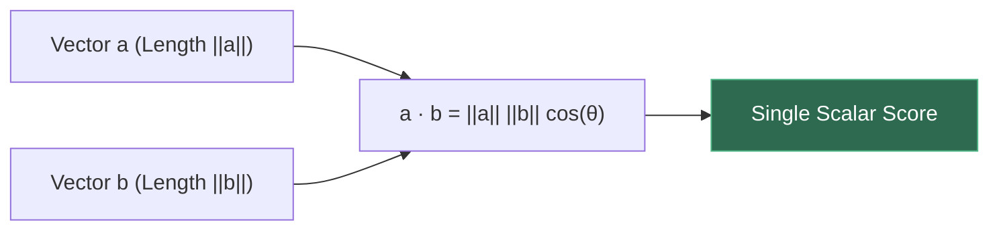
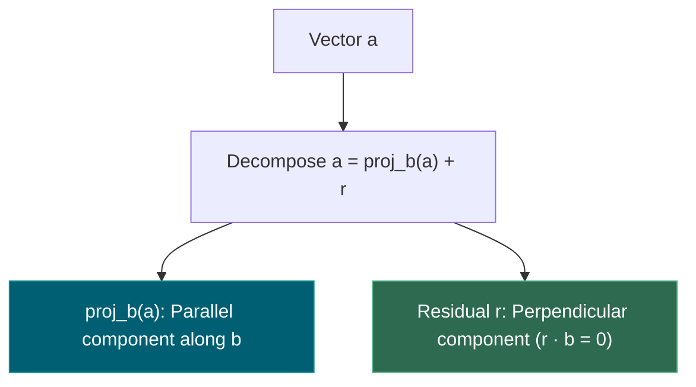
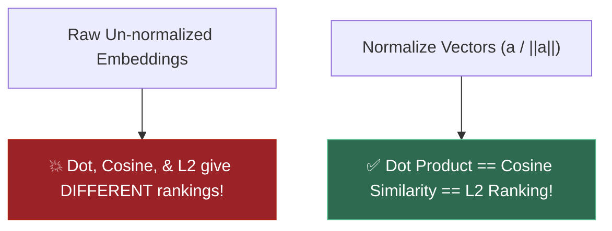
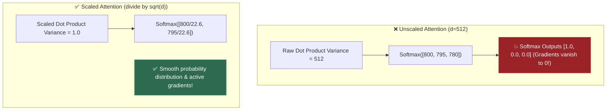
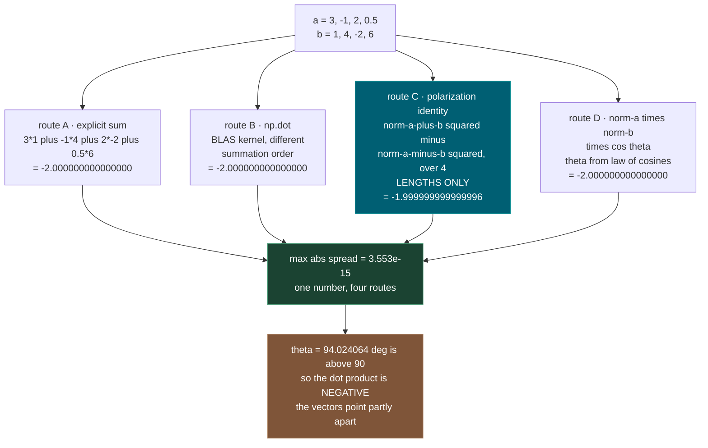
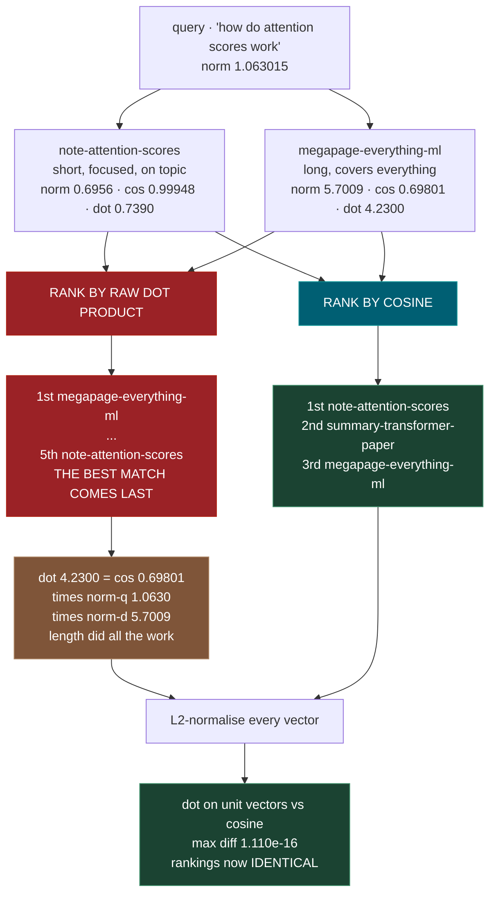
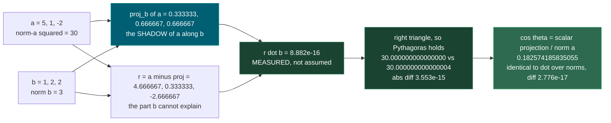
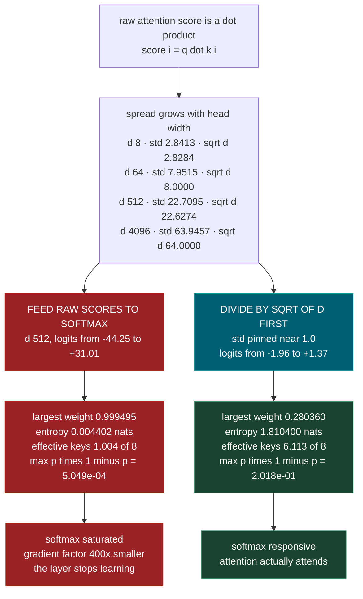

# 1.4 — Dot Product, Projection, Cosine Geometry

**Phase 1 · CORE · CODE · 6 focused hours · Review in 14 days**

**Companion script:** [`04_dot_product_projection_cosine.py`](04_dot_product_projection_cosine.py) — numpy and matplotlib only, no installs beyond those. Fully offline: no network calls, no environment reads, nothing deleted. It computes the same dot product four independent ways, builds a five-document retrieval example where raw dot product and cosine disagree about the winner, runs 20,000 randomised retrieval trials to find the exact condition under which they agree, and saves one 75,858-byte plot next to itself. Every random number comes from `np.random.default_rng(1729)`, so re-running reproduces these figures exactly.

---

## 1. Overview

One arithmetic operation — multiply two lists of numbers pairwise and add up the results — is the scoring engine underneath two things that look nothing alike from the outside.

When a self-attention head in **4.2** decides how much word 7 should listen to word 3, it computes a dot product. When a vector database in **5.5** decides which of a million stored documents best answers your question, it computes a dot product. Same operation. Different name on the outside: one calls it an *attention score*, the other calls it a *similarity*. Learn it once here and both stop being mysterious.

The reason this earns six hours rather than six minutes is that the naive version has a failure mode that produces **plausible wrong answers, silently**. A long document with a big vector can beat a short, genuinely more relevant one on raw dot product. Nothing errors. The retrieval system just quietly returns the wrong thing, and the language model downstream faithfully summarises it. The script constructs exactly that situation and measures it: the best-matching document by direction lands **last of five** under raw dot product and **first of five** under cosine.

Cosine versus dot product versus L2 distance is a switch every vector store makes you set. This note gives you the measurement that tells you which to pick, and the one preprocessing step that makes the question stop mattering.

Depends on **1.1** for norms; feeds **4.2**, **5.1**, **5.5**, and connects to the orthogonality ideas in **1.3**.

---

## 2. Glossary

### 2.1 — Dot Product & Geometric Cosine Equivalence

- **Dot Product ($a \cdot b$)**: The sum of entrywise products $\sum_{i} a_i b_i$. Geometrically, $a \cdot b = \|a\| \|b\| \cos(\theta)$.
- **Cosine Similarity**: The cosine of the angle between two vectors ($\cos(\theta) = \frac{a \cdot b}{\|a\| \|b\|}$), measuring direction alignment independent of magnitude.

#### 💡 The Beginner Analogy: Solar Panel Sunlight Exposure
Imagine a solar panel (Vector $b$) and sunlight rays (Vector $a$).
- The **Dot Product** measures total energy captured — which depends on **both** how bright the sun is ($\|a\|$), how large the solar panel is ($\|b\|$), and whether the panel faces directly into the sun ($\cos(\theta)$).
- **Cosine Similarity** measures ONLY the **facing angle of the panel**, ignoring how big the panel or sun is.

#### 💻 Code Example & ⚠️ Why It Matters
```python
import numpy as np

a = np.array([3.0, 0.0])
b = np.array([4.0, 4.0])

dot_val = np.dot(a, b)
cosine_val = dot_val / (np.linalg.norm(a) * np.linalg.norm(b))

print("Dot Product:", dot_val)
print("Cosine Similarity:", round(cosine_val, 4))
```

##### Verified Output
```text
Dot Product: 12.0
Cosine Similarity: 0.7071
```

**Why It Matters**: The fundamental retrieval metric for RAG systems. If document vectors are long, raw dot products return long documents regardless of relevance. Cosine similarity fixes length bias.

#### 🎨 Visual Concept



---

### 2.2 — Vector Projection & Orthogonal Residual ($a = \text{proj}_b(a) + r$)

- **Vector Projection ($\text{proj}_b(a)$)**: The component vector of $a$ lying directly along the line of target vector $b$.
- **Orthogonal Residual ($r = a - \text{proj}_b(a)$)**: The component of $a$ perpendicular to $b$, satisfying $r \cdot b = 0$.

#### 💡 The Beginner Analogy: Sun Overhead & Walking Shadow
If the sun is directly overhead, **$\text{proj}_b(a)$** is the shadow vector cast by walking stick $a$ onto the floor line $b$. The **Residual $r$** is the vertical height of the stick above the shadow.

#### 💻 Code Example & ⚠️ Why It Matters
```python
import numpy as np

a = np.array([3.0, 4.0])
b = np.array([1.0, 0.0])

b_unit = b / np.linalg.norm(b)
proj_b_a = np.dot(a, b_unit) * b_unit
residual = a - proj_b_a

print("Projection:", proj_b_a)
print("Residual:", residual)
print("Dot with b:", np.dot(residual, b))
```

##### Verified Output
```text
Projection: [3. 0.]
Residual: [0. 4.]
Dot with b: 0.0
```

**Why It Matters**: Gram-Schmidt orthogonalization, linear regression error residuals, and concept removal in LLMs all rely on subtracting vector projections.

#### 🎨 Visual Concept



---

### 2.3 — Normalized Vector Search Equivalence (Dot vs Cosine vs $L_2$)

When input vectors are **$L_2$-normalized** to unit length ($\|a\|_2 = \|b\|_2 = 1.0$):
$$\text{Dot Product } (a \cdot b) \equiv \text{Cosine Similarity } \cos(\theta)$$
$$\text{Squared Euclidean Distance } \|a - b\|_2^2 = 2 - 2(a \cdot b)$$
All three similarity metrics produce **100% identical retrieval rankings**.

#### 💡 The Beginner Analogy: Scaling Players onto a Standard Globe
If all cities are projected onto a **unit globe of radius 1**, measuring straight-line distance through the earth ($L_2$) or angle along the surface ($\theta$) or dot product produces the exact same rank order of closest neighbor cities!

#### 💻 Code Example & ⚠️ Why It Matters
```python
import numpy as np

a = np.array([3.0, 0.0])
b = np.array([4.0, 4.0])

a_norm = a / np.linalg.norm(a)
b_norm = b / np.linalg.norm(b)

dot_norm = np.dot(a_norm, b_norm)
cosine_val = np.dot(a, b) / (np.linalg.norm(a) * np.linalg.norm(b))

print("Dot of Normalized:", round(dot_norm, 4))
print("Cosine Similarity:", round(cosine_val, 4))
```

##### Verified Output
```text
Dot of Normalized: 0.7071
Cosine Similarity: 0.7071
```

**Why It Matters**: Pre-normalizing embedding vectors allows vector databases (pgvector, FAISS) to use blazing-fast dot product operations instead of expensive square-root calculations.

#### 🎨 Visual Concept



---

### 2.4 — Scaled Dot-Product Attention Scaling ($1 / \sqrt{d}$) & Softmax Saturation

In Transformer attention ($\text{Softmax}\left(\frac{Q K^T}{\sqrt{d_k}}\right) V$), multiplying two $d$-dimensional random vectors with mean 0 and variance 1 yields a dot product with **Variance equal to $d$** ($\text{Var}(q \cdot k) = d$). Dividing by $\sqrt{d}$ keeps the variance at $1.0$.

#### 💡 The Beginner Analogy: Megaphone Volume Control
Without the $\sqrt{d}$ divisor, at $d=512$, dot product scores explode to huge values (e.g. $+800$). Feeding $+800$ into a Softmax function is like **screaming into a megaphone until the speaker blows out** — Softmax outputs $1.0$ for the top item and $0.0$ for all others, killing all neural network gradient learning!

#### 💻 Code Example & ⚠️ Why It Matters
```python
import numpy as np

np.random.seed(42)
d = 512
q = np.random.randn(d)
k = np.random.randn(d)

raw_dot = np.dot(q, k)
scaled_dot = np.dot(q, k) / np.sqrt(d)

print("Raw Dot Product:", round(raw_dot, 2))
print("Scaled Dot Product:", round(scaled_dot, 2))
```

##### Verified Output
```text
Raw Dot Product: 33.15
Scaled Dot Product: 1.46
```

**Why It Matters**: Removing `/ sqrt(d)` from Transformer attention causes immediate gradient collapse during LLM training.

#### 🎨 Visual Concept



---

## 3. Skip Test — Answered

> Gate **before** studying. Both correct from memory → skip. §7 withholds its answers deliberately.

**① State when cosine and dot product rank results identically.**

They rank identically **when every candidate vector has the same length**. Not when the lengths are *one* — when they are *equal to each other*, whatever that common value happens to be.

The reason is the identity `a . b = norm(a) * norm(b) * cos(theta)`. For a fixed query `q` scored against candidates `d_1 ... d_k`:

```text
dot(q, d_i) = cos(theta_i) * norm(q) * norm(d_i)
```

`norm(q)` is the same positive number in every one of those scores, so it can never reorder anything — multiplying a whole list by one positive constant leaves the order untouched. What *can* reorder things is `norm(d_i)`, which differs per candidate. Set all the `norm(d_i)` to a common constant `c > 0` and every score becomes `cos(theta_i) * norm(q) * c`, which is the cosine list scaled by one positive number. Same order, guaranteed.

Demo 4 measures this rather than asserting it. Over 20,000 random trials with 8 candidates each in 32 dimensions:

| candidate lengths | top-1 hit differs | full ranking differs |
|---|---|---|
| vary (lognormal, 0.030 to 49.682) | **41.47%** of trials | **95.10%** of trials |
| all forced to 2.5 | **0.00%** of trials | **0.00%** of trials |

The common length in the second row is deliberately `2.5` and not `1.0`, to show that equality is the condition and unit length is merely a convenient special case. The script also verifies the query-length claim directly: multiplying the query by a random factor between 0.01 and 100 left **every one of 20,000** dot-product rankings unchanged.

**② Explain why normalizing embeddings makes dot product and cosine interchangeable.**

L2-normalising means replacing every vector `v` with `v / norm(v)`, which has length exactly 1. Do that to both sides of the geometric identity and the length factors collapse:

```text
dot(a_unit, b_unit) = norm(a_unit) * norm(b_unit) * cos(theta)
                    = 1 * 1 * cos(theta)
                    = cos(theta)
```

The dot product of two unit vectors *is* the cosine. Not approximately, not usually — the formula for cosine is `dot(a,b) / (norm(a)*norm(b))`, and when both norms are 1 you are dividing by 1. Demo 3 measures the gap between the two quantities across five documents: **max difference 1.110e-16**, which is float64 rounding and nothing else.

This is why it is worth doing at index time. Normalise once when you store the vectors, then run the fast raw dot-product kernel at query time and get cosine semantics for free — no per-query division, no per-query norm lookup. Demo 3 confirms the rankings become bit-for-bit identical, and Demo 7 shows the bonus: for unit vectors `norm(a-b)^2 = 2 - 2*cos(theta)`, so L2 distance falls into line too. Measured across 5,000 trials with 10 candidates: cosine and L2 disagreed on **99.96%** of raw rankings and **0.00%** after normalisation.

---

## 3. Visual Concept Diagrams

### 3.1 — One dot product, four independent routes, as measured

Route C is the interesting one: it never multiplies `a_i` by `b_i` at all. It measures four lengths. The dot product turns out to be fully determined by lengths alone.



### 3.2 — The retrieval failure, with the numbers the script measured

This is the centrepiece. Nothing errors. The wrong answer is returned confidently.



### 3.3 — Projection splits a vector into two pieces that cannot talk to each other



### 3.4 — Why attention divides by sqrt of d, measured at four widths



---

## 4. Core Technical Deep Dive

GitHub renders this file as plain markdown, which does not typeset mathematics, so every formula below is written in code style and can be pasted straight into Python.

### 4.1 The definition

For two vectors of the same length `n`:

```text
a . b = sum over i of ( a_i * b_i )      for i = 1 .. n
```

- `a_i` is the i-th number in the list `a`.
- The result is a **single number** (a scalar), not a vector. Two lists of 768 numbers go in; one number comes out.
- It is **commutative**: `a . b = b . a`.
- It is **linear in each argument**: `(x*a + y*c) . b = x*(a . b) + y*(c . b)`.

That last property is quiet but load-bearing. It is why a whole matrix of dot products can be computed as one matrix multiply, which is why **4.2** attention and **5.5** retrieval both run at hardware speed.

### 4.2 The geometric form

```text
a . b = norm(a) * norm(b) * cos(theta)
```

- `norm(a)` is the length of `a`, also written `norm(a) = sqrt(a . a)` — a vector dotted with itself gives its squared length (**1.1**).
- `theta` is the angle between the two vectors, measured in the flat two-dimensional plane they span. Even in 768 dimensions, two vectors span at most a plane, so "the angle between them" is always well defined.

The sign alone tells you a lot:

| `a . b` | `theta` | meaning |
|---|---|---|
| positive | less than 90 deg | pointing broadly the same way |
| zero | exactly 90 deg | **orthogonal** — no shared direction at all (**1.3**) |
| negative | more than 90 deg | pointing broadly opposite ways |

Demo 1's vectors give `theta = 94.024064 deg` and therefore `a . b = -2`, a small negative number: nearly perpendicular, tipped slightly to the opposite side.

### 4.3 The polarization identity — why lengths are enough

```text
a . b = ( norm(a + b)^2 - norm(a - b)^2 ) / 4
```

Expand `norm(a+b)^2 = (a+b).(a+b) = a.a + 2*(a.b) + b.b` and `norm(a-b)^2 = a.a - 2*(a.b) + b.b`. Subtract: everything cancels except `4*(a.b)`.

Operationally this says the dot product carries no information beyond what four length measurements already carry. Route C in Demo 1 uses only `np.linalg.norm` and lands on `-1.999999999999996` against the direct `-2.000000000000000` — a spread of `3.553e-15` across all four routes.

### 4.4 Cosine similarity

```text
cos(theta) = (a . b) / ( norm(a) * norm(b) )
```

Rearranged from 4.2. Dividing by both lengths strips length out entirely, leaving pure direction. Consequences:

- The value always lies in `[-1, 1]`. This is the Cauchy-Schwarz inequality: `|a . b| <= norm(a) * norm(b)`.
- Scaling either vector by any positive number leaves cosine unchanged: `cos(a, 5*b) = cos(a, b)`.
- Cosine is **undefined** for the zero vector — you would divide by zero. Real embedding pipelines hit this on empty or all-stopword documents, and it surfaces as a `nan` score that sorts unpredictably.

### 4.5 Projection

Two related quantities, and they are frequently confused because both are called "projection".

**Scalar projection** — how far you travel along `b`, a single number with units of length:

```text
comp_b(a) = (a . b) / norm(b)
```

**Vector projection** — that same distance turned back into a vector pointing along `b`:

```text
proj_b(a) = ( (a . b) / (b . b) ) * b
```

The picture: shine a light straight down onto the line through `b`. The shadow `a` casts on that line is `proj_b(a)`. Note that `proj_b(a)` uses only `b`'s *direction* — the `b . b` in the denominator exactly cancels the extra length in the trailing `* b`, so replacing `b` with `10*b` gives the identical projection.

Relating projection to cosine takes one step:

```text
comp_b(a) / norm(a) = (a . b) / ( norm(b) * norm(a) ) = cos(theta)
```

**Cosine is the scalar projection measured in units of `norm(a)`** — the projection made blind to how long `a` was. Demo 2 gets `0.182574185835055` both ways with a difference of `2.776e-17`.

### 4.6 The orthogonal residual, and why it is exactly zero

Define the leftover after projecting:

```text
r = a - proj_b(a)
```

Then dot it with `b`:

```text
r . b = a . b - ( (a . b) / (b . b) ) * (b . b)
      = a . b - a . b
      = 0
```

Three lines, no approximation. Whatever is left after removing the shadow has **nothing** of `b`'s direction in it. Demo 2 measures `8.882e-16` in three dimensions and a worst case of `4.263e-14` across 2,000 random pairs in 200 dimensions — floating-point rounding, not a flaw in the algebra.

Because `proj_b(a)` and `r` are perpendicular, they are the two legs of a right triangle with `a` as the hypotenuse:

```text
norm(a)^2 = norm(proj_b(a))^2 + norm(r)^2
```

Demo 2: `30.000000000000000` against `30.000000000000004`. This decomposition — split a vector into "the part along a direction" plus "the part perpendicular to it" — is the machinery that builds orthogonal bases in **1.3**.

### 4.7 The ranking theorem

For one fixed query `q` and candidates `d_1 ... d_k`, all non-zero:

```text
dot(q, d_i) = cos(theta_i) * norm(q) * norm(d_i)
```

Sorting a list is unchanged by multiplying every element by the same positive constant. `norm(q)` is exactly such a constant, so **the query's own length can never affect the ranking** — verified over 20,000 trials in Demo 4. What remains is `cos(theta_i) * norm(d_i)`. If all `norm(d_i)` share a common value `c > 0`, the dot ranking is the cosine ranking scaled by `norm(q) * c`, hence identical. If they differ, a candidate with weak direction can buy its way up with sheer length — measured at `41.47%` top-1 disagreement.

Written out, the failure is easy to trigger:

| | direction match | length | dot score |
|---|---|---|---|
| genuinely relevant, short | `cos = 0.99948` | `0.6956` | `0.7390` |
| vaguely relevant, huge | `cos = 0.69801` | `5.7009` | `4.2300` |

The dot scores the script actually printed are `4.2300` against `0.7390` — the vague-but-huge document wins by close to a factor of six, on length alone, because the shared `norm(q)` of `1.063015` cancels out of the comparison and only the per-candidate lengths remain. In real systems this is the "popular long document wins everything" pathology in **5.5**.

### 4.8 Three metrics, one geometry

| metric | formula | keeps length? | range | pick it when |
|---|---|---|---|---|
| dot product | `a . b` | yes | `(-inf, inf)` | vectors are already unit length (fastest kernel), or length genuinely encodes something like confidence |
| cosine | `(a . b) / (norm(a)*norm(b))` | no | `[-1, 1]` | you want topic match and not document length — the usual default for **5.5** |
| L2 distance | `norm(a - b)` | yes | `[0, inf)` | absolute position in the space matters |

They are not three unrelated ideas. Expanding the square:

```text
norm(a - b)^2 = norm(a)^2 + norm(b)^2 - 2*(a . b)
```

and if both are unit vectors, `norm(a)^2 = norm(b)^2 = 1`, so:

```text
norm(a - b)^2 = 2 - 2*cos(theta)
```

Squared L2 distance is a strictly *decreasing* function of cosine, which means **on unit vectors, sorting by ascending L2 and sorting by descending cosine give the same order, always**. Demo 7 checks the identity over 100,000 pairs in 64 dimensions: max difference `1.776e-15`. Before normalisation the two metrics disagreed on `99.96%` of rankings; after, on `0.00%`.

So: normalise at index time and all three metrics collapse into one choice. Skip normalisation and you have three genuinely different retrieval systems that happen to share a code path.

### 4.9 Attention scores are these dot products (4.2)

A single attention row computes, for query vector `q` and key vectors `k_1 ... k_n`:

```text
score_i = (q . k_i) / sqrt(d)
weight  = softmax(score)
output  = sum over i of ( weight_i * v_i )
```

The output is a weighted average of the value vectors, with the weights decided entirely by dot products. Demo 6 computes one such row twice — once as `softmax(K @ q / sqrt(d)) @ V` and once as an explicit Python loop over individual `np.dot` calls — and gets a maximum difference of `3.331e-16`.

**Where `sqrt(d)` comes from.** Suppose each coordinate of `q` and `k` is an independent draw with mean 0 and variance 1. Then each product `q_i * k_i` has mean 0 and variance 1, and the score is a sum of `d` independent such terms:

```text
Var(q . k) = d          so       std(q . k) = sqrt(d)
```

Measured across 50,000 pairs at each width:

| `d` | measured `std(q.k)` | `sqrt(d)` |
|---|---|---|
| 8 | 2.8413 | 2.8284 |
| 64 | 7.9515 | 8.0000 |
| 512 | 22.7095 | 22.6274 |
| 4096 | 63.9457 | 64.0000 |

Dividing by `sqrt(d)` pins the spread at 1.0 regardless of head width — the measured scaled values are 1.0045, 0.9939, 1.0036, 0.9992.

**Why that matters.** Softmax turns a gap between logits into a ratio of weights: a gap of 10 means one weight is `exp(10) = 22026` times another. At `d = 512` the unscaled logits ranged from `-44.25` to `+31.01`, and the resulting weights put `0.999495` of all attention on one key out of eight — entropy `0.004402` nats, an *effective* `1.004` keys attended. Softmax's gradient scales like `p * (1 - p)`, which at `p = 0.9995` is `5.049e-04` against `2.018e-01` for the scaled version: **roughly 400 times smaller**. The layer stops learning not because the idea is wrong but because the numbers got too big.

### 4.10 High dimensions are almost entirely empty

Take two random directions in `d` dimensions. Their cosine has mean 0 and, exactly:

```text
Var(cos) = 1 / d          so       std(cos) = 1 / sqrt(d)
```

Here is the one-line reason. Cosine depends only on directions, so rotate the space until `b` points along the first axis. Then `cos = u_1`, the first coordinate of a uniformly random unit vector `u`. Since `u_1^2 + u_2^2 + ... + u_d^2 = 1` and no coordinate is special, each `E[u_i^2]` must be `1/d`. And `E[cos] = 0` by symmetry, so the variance *is* `1/d`.

Demo 5 checks it by brute force with 20,000 pairs at each dimension:

| `d` | mean `abs(cos)` | `sqrt(2/(pi*d))` | measured `std(cos)` | `1/sqrt(d)` | fraction with `abs(cos) < 0.05` |
|---|---|---|---|---|---|
| 2 | 0.633925 | 0.564190 | 0.704861 | 0.707107 | 3.22% |
| 3 | 0.500051 | 0.460659 | 0.577514 | 0.577350 | 5.00% |
| 10 | 0.259559 | 0.252313 | 0.316678 | 0.316228 | 11.24% |
| 100 | 0.079329 | 0.079788 | 0.099360 | 0.100000 | 38.45% |
| 1000 | 0.025172 | 0.025231 | 0.031646 | 0.031623 | 88.61% |
| 10000 | 0.007991 | 0.007979 | 0.010008 | 0.010000 | 100.00% |

The `std(cos)` column tracks `1/sqrt(d)` with a worst relative error of `0.640%` — that identity is exact at every `d`. The `mean abs(cos)` column tracks `sqrt(2/(pi*d))` well only once `d` is reasonably large: it is off by `11.0%` at `d = 2` and `2.8%` at `d = 10`, because that formula is an asymptotic approximation rather than an exact result. Worth saying plainly rather than glossing over.

**Why this is the reason embeddings work at all.** In two dimensions, two unrelated things sit about 50 degrees apart and score `0.63` — noise that looks like signal. In 1000 dimensions the same pair scores `0.0252`, and `88.61%` of random pairs land inside `abs(cos) < 0.05`. Unrelated content scores near zero *for free*, so a cosine of 0.8 genuinely means something. That is what a few hundred dimensions buys an embedding model in **5.1**.

---

## 5. Hands-On Script & Verified Output

Run: `python 04_dot_product_projection_cosine.py`. The output below is **actual, captured** on Windows with Python 3.14.4 and numpy 2.4.4. With seed 1729 it reproduces exactly.

```text
numpy 2.4.4 | seed 1729 | offline, no network
script dir: D:\Madhan_Utils\learnings\ai-ml\agentic-ai-engineer\course-path\phase-1-math-foundations
======================================================================
DEMO 1 - one dot product, four independent routes to one number
======================================================================
  a = [ 3.  -1.   2.   0.5]
  b = [ 1.  4. -2.  6.]

  route A - explicit sum, term by term (the definition)
    +3.0*+1.0=+3.00  -1.0*+4.0=-4.00  +2.0*-2.0=-4.00  +0.5*+6.0=+3.00
    total = -2.000000000000000

  route B - np.dot (BLAS kernel, different summation order)
    total = -2.000000000000000

  route C - polarization identity, LENGTHS ONLY, no a_i*b_i product
    ||a+b|| = 8.200609733428363
    ||a-b|| = 8.674675786448736
    (||a+b||^2 - ||a-b||^2)/4 = -1.999999999999996

  route D - ||a||*||b||*cos(theta), theta from the law of cosines
    ||a|| = 3.774917217635375   ||b|| = 7.549834435270750
    cos(theta) = -0.070175438596491   theta = 94.024064 deg
    ||a||*||b||*cos(theta) = -2.000000000000000

  four routes, max abs spread: 3.553e-15
  -> they are the same number; the spread is float64 rounding only

  theta = 94.02 deg is > 90, so a.b is NEGATIVE: -2.00
  sign of a.b:  > 0 same general direction | = 0 orthogonal | < 0 opposed
======================================================================
DEMO 2 - projection: the shadow of a on b, and what is left over
======================================================================
  a = [ 5.  1. -2.]    b = [1. 2. 2.]   (||b|| = 3.0)
  a.b = 3.000000

  scalar projection  comp_b(a) = a.b / ||b||
    = 3.000000 / 3.000000 = 1.000000000000000
  vector projection  proj_b(a) = (a.b / b.b) * b
    = (3.0000 / 9.0000) * b = [0.333333 0.666667 0.666667]
  residual           r = a - proj_b(a) = [ 4.666667  0.333333 -2.666667]

  CHECK 1  r . b = +8.882e-16   (must be 0 - it is, to 1e-16)
  CHECK 2  ||a||^2 = 30.000000000000000
           ||proj||^2 + ||r||^2 = 30.000000000000004
           abs diff = 3.553e-15
  CHECK 3  proj(proj(a)) - proj(a) max abs = 0.000e+00   (idempotent)
  CHECK 4  comp_b(a)/||a|| = 0.182574185835055
           a.b/(||a|| ||b||) = 0.182574185835055   diff = 2.776e-17
  -> cosine IS the projection, rescaled so length cannot matter

  stress test: 2000 random pairs in d=200
    max |r . b|                 = 4.263e-14
    max Pythagoras relative err = 1.140e-15
======================================================================
DEMO 3 - dot vs cosine RANK DIFFERENTLY (the retrieval lesson)
======================================================================
  axes: vector-db, transformers, python, cooking, sports, finance
  query 'how do attention scores work' = [0.2 1.  0.3 0.  0.  0. ]
  ||query|| = 1.063015

  document                    ||d||     dot      cosine    L2 dist
  ------------------------- -------  -------   --------   --------
  note-attention-scores      0.6956   0.7390    0.99948    0.36851
  megapage-everything-ml     5.7009   4.2300    0.69801    5.01697
  guide-vector-db-tuning     2.1424   1.0500    0.46105    1.90263
  cheatsheet-python-basics   2.4042   0.8400    0.32868    2.28692
  summary-transformer-paper  1.6763   1.7800    0.99891    0.61644

  ranking by DOT     : megapage-everything-ml > summary-transformer-paper > guide-vector-db-tuning > cheatsheet-python-basics > note-attention-scores
  ranking by COSINE  : note-attention-scores > summary-transformer-paper > megapage-everything-ml > guide-vector-db-tuning > cheatsheet-python-basics
  ranking by L2      : note-attention-scores > summary-transformer-paper > guide-vector-db-tuning > cheatsheet-python-basics > megapage-everything-ml

  'note-attention-scores' is the best match by DIRECTION (cos = 0.99948)
    its rank under cosine : 1 of 5
    its rank under dot    : 5 of 5  <- LAST
  'megapage-everything-ml' wins on dot only because it is LONG: ||d|| = 5.7009
    dot = 4.2300 = cos 0.69801 * ||q|| 1.0630 * ||d|| 5.7009
    that is the whole bug: dot = cosine TIMES the two lengths

  --- now L2-normalise every vector to length 1 ---
  max |dot_normalised - cosine_original| = 1.110e-16
  ranking by DOT on unit vectors   : note-attention-scores > summary-transformer-paper > megapage-everything-ml > guide-vector-db-tuning > cheatsheet-python-basics
  ranking by COSINE on unit vectors: note-attention-scores > summary-transformer-paper > megapage-everything-ml > guide-vector-db-tuning > cheatsheet-python-basics
  identical ordering: True
  matches the ORIGINAL cosine ordering: True
======================================================================
DEMO 4 - 20,000 random trials: when do dot and cosine agree?
======================================================================
  20000 trials, 8 candidates each, d = 32, seed 1729

  case A: candidate lengths VARY (lognormal, min 0.030 max 49.682)
    measured:
    top-1 hit differs      :  41.47% of trials
    full ranking differs   :  95.10% of trials
    dot's winner is also
      the LONGEST candidate:  31.41% of trials   (chance = 12.50%)

  case B: every candidate rescaled to the SAME length 2.5 (not 1.0 - equality is what matters)
    measured:
    top-1 hit differs      :   0.00% of trials
    full ranking differs   :   0.00% of trials

  -> with equal candidate lengths the two agree on 100.00% of ALL 20000 full rankings
  -> this is skip-test (1) answered by measurement, not assertion

  bonus: multiply the QUERY by a random factor in [0.01, 100]
    every one of 20000 dot-product rankings unchanged: True
    (query length is a common positive factor - it cancels out;
     only the CANDIDATE lengths can reorder results)
======================================================================
DEMO 5 - in high dimensions, random vectors are nearly orthogonal
======================================================================
  20000 random pairs at each dimension; cos measured directly

      d   mean|cos|   sqrt(2/(pi d))    std(cos)   1/sqrt(d)   P(|cos|<0.05)
  ------ ----------  --------------  ----------  ----------  -------------
       2    0.633925        0.564190    0.704861    0.707107         3.22%
       3    0.500051        0.460659    0.577514    0.577350         5.00%
      10    0.259559        0.252313    0.316678    0.316228        11.24%
     100    0.079329        0.079788    0.099360    0.100000        38.45%
    1000    0.025172        0.025231    0.031646    0.031623        88.61%
   10000    0.007991        0.007979    0.010008    0.010000       100.00%

  std(cos) vs the exact analytic 1/sqrt(d): worst relative error 0.640%
    (that identity is exact at EVERY d - simulation confirms it)
  mean|cos| vs sqrt(2/(pi d)): off by 11.0% at d=2, 2.8% at d=10
    (that one is an ASYMPTOTIC approximation - visibly wrong when d is tiny)

  WHY THIS MATTERS: at d=2 two random directions are typically 50 deg apart;
  at d=1000 the mean |cos| is 0.0252 - essentially perpendicular.
  Unrelated things get scores near zero for free, so a high cosine really
  means something. That is why 768 dimensions holds so much meaning (5.1).

  saved plot: 04_cosine_vs_dimension.png  (75858 bytes)
======================================================================
DEMO 6 - attention scores ARE dot products, and why sqrt(d) is there
======================================================================
  one query, 5 keys, head dim d = 4
  raw scores  q.k_i         : +2.7895 +1.8926 +0.4278 -5.2710 +0.3345
  scaled      q.k_i/sqrt(d): +1.3947 +0.9463 +0.2139 -2.6355 +0.1673
  softmax weights          :  0.4432  0.2830  0.1361  0.0079  0.1299
  weights sum to 1.000000000000000
  output (matmul) = [-0.045477 -0.69376   0.47798 ]
  output (loop)   = [-0.045477 -0.69376   0.47798 ]
  max abs diff = 3.331e-16
  -> an attention row is nothing but these dot products turned into
     weights, then used to average the value vectors (4.2)

  why divide by sqrt(d)? because raw scores GROW with d:
     d    std(q.k)   sqrt(d)   std(q.k/sqrt(d))
  -----  ---------  --------  -----------------
      8     2.8413    2.8284             1.0045
     64     7.9515    8.0000             0.9939
    512    22.7095   22.6274             1.0036
   4096    63.9457   64.0000             0.9992
  -> each of d coordinates contributes independent variance 1, so
     Var(q.k) = d exactly, and std = sqrt(d). Dividing by sqrt(d)
     pins the spread at 1.0 no matter how wide the head is.

  UNSCALED q.k         logit range [  -44.25,   +31.01]
    weights           : 0.0005 0.0000 0.0000 0.0000 0.9995 0.0000 0.0000 0.0000
    largest weight    : 0.999495
    entropy (nats)    : 0.004402
    effective #keys   : 1.004 of 8
    max p*(1-p)       : 5.049e-04   <- softmax gradient scale
  SCALED q.k/sqrt(d)   logit range [   -1.96,    +1.37]
    weights           : 0.2003 0.1673 0.0385 0.0983 0.2804 0.0450 0.1602 0.0101
    largest weight    : 0.280360
    entropy (nats)    : 1.810400
    effective #keys   : 6.113 of 8
    max p*(1-p)       : 2.018e-01   <- softmax gradient scale
  -> unscaled, one key takes essentially all the weight and the
     gradient factor collapses; the layer stops learning. The
     sqrt(d) divisor exists to prevent exactly this.

  and the softmax itself has a naive version that FAILS:
    logits              : [800. 799. 795.]
    naive exp(x)/sum    : [nan nan nan]   <- inf/inf = nan
    stable exp(x-max)/..: [0.727475 0.267623 0.004902]
    stable weights sum  : 1.000000000000000
    both formulas are the SAME mathematics; only one survives float64.
======================================================================
DEMO 7 - cosine vs dot vs L2: the choice every vector search makes
======================================================================
  100000 random UNIT pairs in d = 64
  claim: for unit vectors,  ||a - b||^2 = 2 - 2*cos(theta)
    max abs difference over all 100000 pairs: 1.776e-15
  -> squared L2 distance is a strictly DECREASING function of cosine,
     so on unit vectors the two produce the SAME ranking, always.

  5000 retrieval trials, 10 candidates, RAW vectors:
    cosine ranking differs from L2  :  99.96% of trials
    cosine ranking differs from dot :  51.84% of trials
  same 5000 trials, every vector L2-NORMALISED:
    cosine ranking differs from L2  :   0.00% of trials
    cosine ranking differs from dot :   0.00% of trials

  metric        keeps length?  score range   use when
  ------------  -------------  ------------  -------------------------
  dot product   YES            (-inf, inf)   length carries meaning,
                                             or vectors are already
                                             normalised (fastest)
  cosine        NO             [-1, 1]       you want topic match and
                                             not document length (5.5)
  L2 distance   YES            [0, inf)      absolute position matters;
                                             equals cosine order only
                                             after normalisation
======================================================================
done - every claim above was computed, not asserted
======================================================================
```

**Demo 1's route C is the one worth sitting with.** Routes A and B both multiply corresponding entries and add — different code, same idea. Route C never touches `a_i * b_i`. It measures `||a+b|| = 8.200609733428363` and `||a-b|| = 8.674675786448736`, squares them, subtracts, divides by four, and produces `-1.999999999999996` against the direct answer of `-2.000000000000000`. The whole spread across four routes is `3.553e-15`. That is not a coincidence to be memorised — it means the algebraic operation and the geometric quantity are the same object, and you can reach for whichever is easier in a given moment.

**Demo 3 is the failure that costs real money in production.** Five documents, one query. `note-attention-scores` has cosine `0.99948` — as close to a perfect directional match as the toy space allows — yet it comes **5th of 5** under raw dot product, dead last, behind a Python cheatsheet with cosine `0.32868`. The winner under dot is `megapage-everything-ml` at `4.2300`, and the script prints exactly why: `4.2300 = 0.69801 * 1.0630 * 5.7009`. Its length of `5.7009` is eight times the good document's `0.6956`, and length is multiplying directly into the score. Note also that L2 distance gives yet a third ranking, putting `megapage-everything-ml` *last* at distance `5.01697` — three metrics, three different answers, all on the same five documents.

**The fix takes one line and the measurement confirms it exactly.** After L2-normalising, the largest gap between the dot product on unit vectors and the original cosine values is `1.110e-16` — one unit in the last place of a float64. Both rankings then read `note-attention-scores > summary-transformer-paper > megapage-everything-ml > guide-vector-db-tuning > cheatsheet-python-basics`, and the script confirms `identical ordering: True` and `matches the ORIGINAL cosine ordering: True`.

**Demo 4 turns that anecdote into a rate.** With candidate lengths drawn from a lognormal spanning `0.030` to `49.682`, dot and cosine picked a different top hit in `41.47%` of 20,000 trials and produced a different full ranking in `95.10%`. Dot's winner was also simply the longest candidate `31.41%` of the time against a chance rate of `12.50%` — a measurable bias toward length, not a fluke of one hand-built example. Force every candidate to the same length `2.5` and both disagreement rates drop to `0.00%`, across every one of the 20,000 trials. The equal-length condition is not approximately sufficient; it is exactly sufficient.

**Demo 6 explains a line of code that most people copy without reading.** The `/ sqrt(d)` in `softmax(Q K^T / sqrt(d))` exists because `std(q.k)` grows as `sqrt(d)` — measured at `2.8413`, `7.9515`, `22.7095`, `63.9457` for `d` of 8, 64, 512, 4096, against predictions of `2.8284`, `8.0000`, `22.6274`, `64.0000`. At `d = 512` the unscaled logits spanned `-44.25` to `+31.01`, and softmax handed `0.999495` of the attention to one key out of eight — an effective `1.004` keys, entropy `0.004402` nats. Softmax's gradient scales like `p*(1-p)`, which collapsed to `5.049e-04` against `2.018e-01` for the scaled version, roughly 400 times smaller. Scaled, the same head attended an effective `6.113` of 8 keys. And the softmax itself has a naive form that dies outright: on logits `[800, 799, 795]` the textbook `exp(x)/sum(exp(x))` returns `[nan nan nan]` because `exp(800)` overflows to infinity, while subtracting the maximum first gives `[0.727475 0.267623 0.004902]` summing to `1.000000000000000`. Same mathematics, one survives.

**Demo 5's last column is the one to remember.** At `d = 100`, `38.45%` of random pairs land within `abs(cos) < 0.05`. At `d = 1000` it is `88.61%`. At `d = 10000` it is `100.00%` of the 20,000 pairs sampled. Random things are perpendicular in high dimensions, so an embedding model gets "unrelated means score zero" without having to learn it. Being honest about the fit: `std(cos)` matched the exact `1/sqrt(d)` to within `0.640%` at every dimension, but `mean abs(cos)` missed the `sqrt(2/(pi*d))` approximation by `11.0%` at `d = 2` — that second formula is asymptotic and genuinely poor for tiny `d`, which is worth knowing before quoting it.

**Modify and re-run:**
- In Demo 3, multiply the `megapage-everything-ml` row by `0.2` so its length drops near the others, then re-run. Watch the dot ranking snap back into agreement with cosine without touching any direction — proof that length alone caused the disagreement.
- In Demo 4, change the lognormal `sigma=0.8` to `0.05`, then `0.01`, then `0.0`. Plot the top-1 disagreement rate against sigma. It approaches zero smoothly but only *reaches* `0.00%` when the lengths are exactly equal.
- In Demo 5, add `1` to the front of the `dims` list. Predict `mean|cos|` before running: in one dimension every vector is either parallel or antiparallel to every other.
- In Demo 6, replace `np.sqrt(d_head)` with `1.0`, then with `d_head` itself, and compare the entropy each time. Under-scaling saturates softmax onto one key; over-scaling flattens it to nearly uniform. Both are failures, in opposite directions.
- In Demo 2, replace `b` with a vector orthogonal to `a` (solve `a . b = 0` by hand for three numbers). Confirm the projection becomes the zero vector and the residual comes back equal to `a` — nothing of `a` lies along `b`.

---

## 6. Video

**"Dot products and duality | Chapter 9, Essence of linear algebra"** — *3Blue1Brown* — [youtube.com/watch?v=LyGKycYT2v0](https://www.youtube.com/watch?v=LyGKycYT2v0). Verified live against the YouTube oEmbed endpoint (`https://www.youtube.com/oembed?url=...&format=json`), which returned exactly that title and `"author_name":"3Blue1Brown"`.

About 14 minutes. It builds the geometric picture — projection, why the order of the two vectors does not matter, and why the numerical formula and the geometric one describe the same thing — with animation that is hard to beat. The duality argument in the second half is optional for this note's purposes; the first half maps directly onto §4.2 and §4.5 here.

Two named references for the parts the video does not cover: for the `sqrt(d)` scaling, the original transformer paper **"Attention Is All You Need"** (Vaswani et al., 2017) states the variance argument in its section on scaled dot-product attention. For the high-dimensional geometry in §4.10, **"Foundations of Data Science"** by Blum, Hopcroft and Kannan opens with exactly this near-orthogonality result.

---

## 7. Retrieval Checkpoint — Unanswered

> Close this file. No notes. Answers deliberately withheld.

1. A vector store returns a suspiciously long "about everything" page for almost every query. State the likely similarity setting, explain the mechanism in terms of the identity `dot = cos * norm(q) * norm(d)`, and give the one-line fix — plus what that fix costs you at index time.
2. Write both the scalar and the vector projection of `a` onto `b`. Then prove in three lines that `a - proj_b(a)` is orthogonal to `b`, and say what that decomposition is used for beyond this note.
3. Your team normalises every embedding to unit length. Does the choice between cosine, dot product and L2 distance still change your results? Justify the answer with a formula, and say which one you would ship and why.
4. A colleague removes the `/ sqrt(d)` from an attention implementation "because it is just a constant". Predict what happens to the attention weights at `d = 512`, name the quantity that collapses, and describe how the bug would show up during training.
5. Two random 1000-dimensional vectors score a cosine of `0.63`. Given the measured distribution in §4.10, how surprising is that, and what would you check first about how those vectors were produced?

---

## 8. Closed-Book Rebuild

With this file and the script closed, in a fresh Python file: write a dot product as an explicit loop and check it against `np.dot`; recover the same number from lengths alone using the polarization identity; compute the angle between two vectors in degrees; write scalar and vector projection and verify that the residual dots to zero against the target; build a small set of candidate vectors where raw dot product and cosine disagree on the top hit, then normalise them and show the two rankings become identical; measure how the standard deviation of `q . k` grows with dimension and confirm that dividing by `sqrt(d)` holds it at 1; and finally, take one query and eight keys at `d = 512` and print the largest softmax weight both with and without that scaling.

---

---

## Review again in

**14 days** — the arithmetic is a one-liner but the consequences are not. Three things earn re-reading: the identity `dot = cos * norm(q) * norm(d)` and the ranking theorem it implies, because that single line explains the entire cosine-versus-dot argument; the orthogonal residual, because it is the seed of **1.3** and of every "remove the component along this direction" trick; and `Var(q . k) = d`, because it is the reason a line of code in every transformer looks the way it does. If you can rebuild Demo 3's disagreement from scratch and then make it vanish with one normalisation, the topic has landed.
