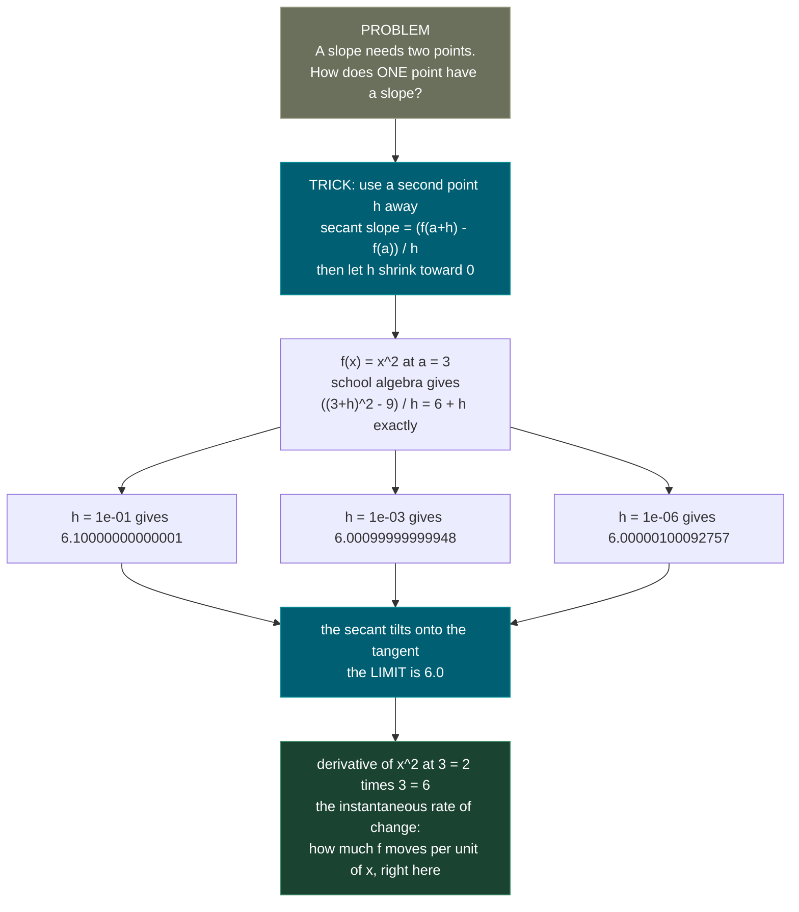
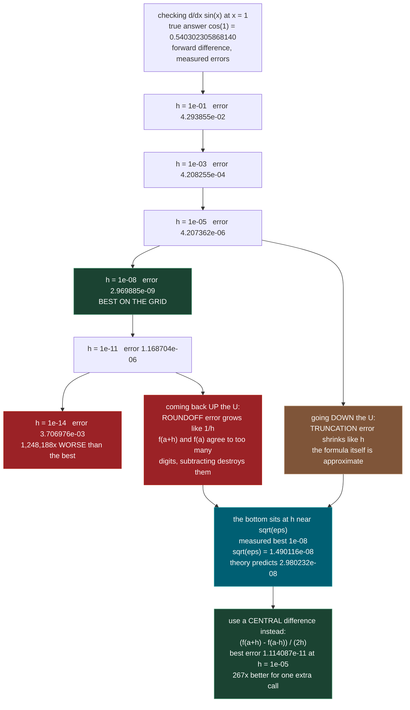
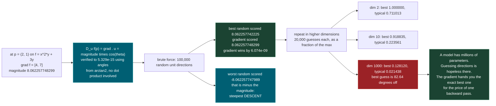
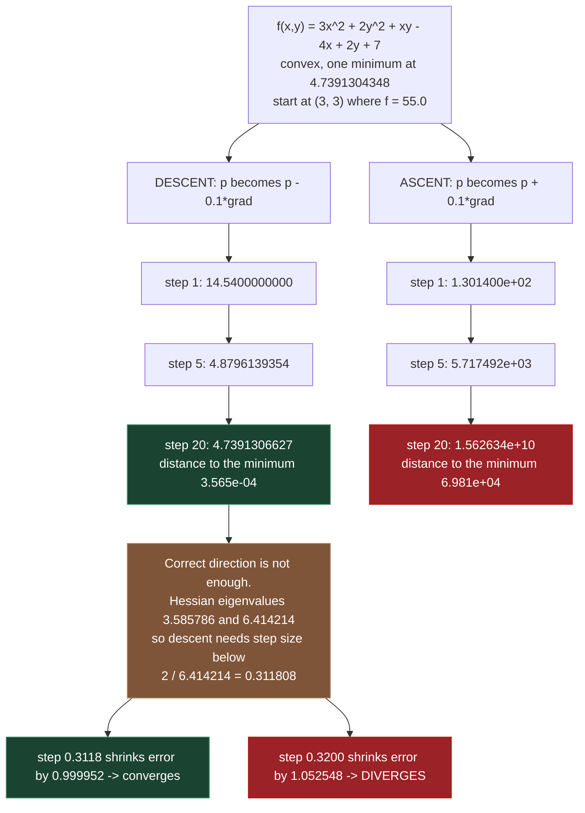

# 1.5 — Derivatives, Partial Derivatives, Gradients

**Phase 1 · CORE · CODE · 6 focused hours · Review in 14 days**

**Companion script:** [`05_derivatives_partials_gradients.py`](05_derivatives_partials_gradients.py) — needs `numpy` and `matplotlib`; matplotlib is pinned to the headless `Agg` backend so no window ever opens. It writes exactly one file, `05_gradient_field.png`, next to itself. No network, no API keys, no downloads, no data read from disk. Safe to run offline.

---

## 1. Overview

Training a model is a search. Somewhere in a space of parameters there is a setting that makes the loss small, and the entire machinery of machine learning is a strategy for finding it without checking every possibility. This topic supplies the instrument that makes the search possible: at any point in that space, the **gradient** tells you which way is uphill, and how steeply.

That one sentence is worth six hours because everything downstream is a variation on it. **2.3** trains linear regression by repeatedly stepping *against* the gradient. **3.5** is a catalogue of smarter rules for choosing how far to step. **1.6** explains how the gradient of a deep composed function is assembled from the gradients of its pieces. **1.11** is about the shape of the surface the gradient is crawling across.

There is a second reason, less advertised. A partial derivative is what makes a loss over millions of parameters **tractable**. You never differentiate with respect to all of them at once, in some heroic simultaneous act. You differentiate with respect to one, treating the rest as frozen constants, and you do that once per parameter. A gradient is nothing more than the resulting list of ordinary school-calculus slopes. The script's Demo 3 shows the "freeze the others" step happening literally, on a function with two inputs, so the same operation on a hundred million inputs stops feeling mysterious.

And a warning that belongs here rather than later. The obvious way to check a derivative you derived by hand is to compare it against a finite difference — nudge the input by a small `h` and see how much the output moves. Everyone's instinct is that a smaller `h` gives a better answer. Demo 2 measures this and finds the instinct is **wrong past a point**: the error falls, bottoms out, then climbs again by six orders of magnitude. That is **1.12** arriving early and uninvited, and it is the difference between a gradient check that works and one that reports a phantom bug.

---

## 2. Skip Test — Answered

> Gate **before** studying. Both correct from memory → skip. §7 withholds its answers deliberately.

**① Give the gradient of f(x,y) = x²y + 3y.**

`grad f = [df/dx, df/dy] = [2xy, x^2 + 3]`

The derivation is two applications of one rule: **to take a partial derivative, treat every other variable as a constant number.**

For `df/dx`, freeze `y`. The expression `x^2 * y` is then just "a constant `y` times `x^2`", and the derivative of `x^2` is `2x`, so that term contributes `2xy`. The term `3y` contains no `x` at all — it is a flat constant as far as `x` is concerned — so it contributes `0`. Total: `df/dx = 2xy`.

For `df/dy`, freeze `x`. The expression `x^2 * y` is "a constant `x^2` times `y`", and the derivative of `y` is `1`, so that term contributes `x^2`. The term `3y` contributes `3`. Total: `df/dy = x^2 + 3`.

Demo 3 checks both against central finite differences at five points — `(0,0)`, `(1,1)`, `(2,1)`, `(-1,3)` and `(2.5,-4)` — and the largest disagreement across all ten partial derivatives is **`2.614e-10`**. At `(2,1)` specifically the gradient is **`[4.0, 7.0]`**.

The demo also does something worth more than the check. It shows what "freeze the other variable" means as an actual object. Freezing `y = 1` turns `f` into the one-variable function `g(x) = x^2 + 3`, whose ordinary derivative is `2x`, giving `g'(2) = 4.0` — which is exactly `2xy` at `(2,1)`. Freezing `x = 2` turns `f` into `k(y) = 4y + 3y = 7y`, a straight line of slope `7` — which is exactly `x^2 + 3` at `x = 2`. Nothing new was invented for the multivariable case. A partial derivative is a school derivative of a slice.

**② Explain why we step in the negative gradient direction when minimizing.**

Because the gradient points the way the function **increases** fastest, and minimizing means going the other way.

The precise statement is about the **directional derivative**. Standing at a point `p` and walking in a unit direction `u`, the rate at which `f` changes is `D_u f(p) = grad f(p) . u`. Since `u` has length 1, the dot product identity gives

`D_u f(p) = |grad f(p)| * cos(theta)`

where `theta` is the angle between `u` and the gradient. That expression is completely determined by `theta`, because `|grad f(p)|` is a fixed number once you have chosen `p`. It is largest when `cos(theta) = 1`, i.e. `theta = 0`, i.e. `u` points **along** the gradient — value `+|grad f(p)|`. It is smallest when `cos(theta) = -1`, i.e. `theta = 180 degrees`, i.e. `u` points **against** the gradient — value `-|grad f(p)|`. So `-grad` is the steepest *descent* direction, by the same argument that makes `+grad` the steepest ascent.

Demo 4 does not assume this — it searches for a counterexample. From `p = (2,1)` on `f(x,y) = x^2*y + 3y` it samples 100,000 random unit directions and evaluates the directional derivative of each. The gradient's own value is **`8.062257748299`**; the best of 100,000 random directions manages **`8.062257742225`**, losing by `6.074e-09`. Nothing beats it. The worst random direction scores **`-8.062257747989`**, which is `-|grad|` to eight decimal places — the steepest descent, found by accident.

Demo 6 then settles the practical question by running it. From `(3,3)` on the convex function `f(x,y) = 3x^2 + 2y^2 + xy - 4x + 2y + 7`, with the same step size `0.1` and the same 20 steps:

- stepping `p <- p - 0.1*grad`: loss goes `55.0` → **`4.7391306627`** (the true minimum is `4.7391304348`)
- stepping `p <- p + 0.1*grad`: loss goes `55.0` → **`1.562634e+10`**

Same function, same start, same step size. One sign.

---

## 3. Visual Concept Diagrams

### 3.1 — From "two points make a slope" to "one point has a slope"



### 3.2 — Measured: the finite-difference error is a U, not a slide



### 3.3 — Measured: nothing beats the gradient, and the gap widens with dimension



### 3.4 — Measured: the sign, and then the step size



---

## 4. Core Technical Deep Dive

### 4.1 The derivative, defined

A slope needs two points: `rise / run`. A single point has no slope in that ordinary sense, so the definition sneaks up on it with a limit.

```
f'(a)  =  lim          ( f(a + h) - f(a) ) / h
          h -> 0
```

- `f` is a function of one number.
- `a` is the input where you want the slope.
- `h` is a small nudge to that input.
- `f(a+h) - f(a)` is the **rise**; `h` is the **run**.
- `lim h -> 0` means: the value the ratio settles on as `h` gets arbitrarily small, not the value at `h = 0` (which is `0/0` and meaningless).

Notation for the same object: `f'(a)`, `df/dx` at `a`, `d/dx f(a)`. They are interchangeable.

**Operationally** `f'(a)` answers: if I increase the input by one unit from here, how much does the output change? **Geometrically** it is the slope of the tangent line — the straight line that grazes the curve at `a`. **In training** it answers: if I nudge this parameter up, does the loss rise or fall, and by how much?

Demo 1 makes the limit concrete on `f(x) = x^2`, where the algebra can be done by hand with nothing beyond expanding a bracket:

```
( (a+h)^2 - a^2 ) / h  =  ( a^2 + 2ah + h^2 - a^2 ) / h  =  ( 2ah + h^2 ) / h  =  2a + h
```

So the secant slope is **exactly** `2a + h`, and its error against the true derivative `2a` is **exactly** `h`. Not "roughly `h`". The script confirms the identity to a relative deviation of `1.21e-07` for `h` down to `1e-4`, and the residue is floating-point noise rather than mathematics.

### 4.2 The rules you will actually reuse

| Rule | Statement | Example |
|---|---|---|
| Constant | `d/dx [c] = 0` | `d/dx [7] = 0` |
| Power | `d/dx [x^n] = n * x^(n-1)` | `d/dx [x^3] = 3x^2` |
| Constant multiple | `d/dx [c * f] = c * f'` | `d/dx [5x^2] = 10x` |
| Sum | `d/dx [f + g] = f' + g'` | `d/dx [x^2 + x] = 2x + 1` |
| Product | `d/dx [f * g] = f'*g + f*g'` | `d/dx [x^2 * sin x] = 2x sin x + x^2 cos x` |
| Chain (**1.6**) | `d/dx [f(g(x))] = f'(g(x)) * g'(x)` | `d/dx [sin(x^2)] = cos(x^2) * 2x` |
| Exponential | `d/dx [e^x] = e^x` | itself |
| Natural log | `d/dx [ln x] = 1/x` | for `x > 0` |
| Sine / cosine | `d/dx [sin x] = cos x`, `d/dx [cos x] = -sin x` | used in Demo 2 |

The sum rule is the reason a loss summed over a dataset is manageable: the derivative of a sum is the sum of the derivatives, so a loss over 200 examples has a gradient that is 200 small gradients added up. The chain rule is the whole of **1.6** and the whole of backpropagation, so it is stated here and developed there.

### 4.3 Partial derivatives

When `f` takes several inputs, `f(x1, x2, ..., xn)`, the **partial derivative with respect to `xi`** is the ordinary derivative you get by treating every other input as a frozen constant:

```
df/dxi  at p  =  lim          ( f(p + h*ei) - f(p) ) / h
                 h -> 0
```

- `p` is the point, a list of `n` numbers.
- `ei` is the direction that moves only coordinate `i` (a `1` in slot `i`, zeros elsewhere).
- `p + h*ei` therefore nudges **one** input and leaves the rest untouched.

The symbol usually written with a curly `d` is the same idea as `d/dx`; the curl only signals that other variables exist and are being held still.

Worked on the skip-test function `f(x,y) = x^2*y + 3y`:

| Step | Freeze `y`, differentiate in `x` | Freeze `x`, differentiate in `y` |
|---|---|---|
| term `x^2 * y` | constant `y` times `x^2` → `2xy` | constant `x^2` times `y` → `x^2` |
| term `3y` | no `x` present → `0` | `3` |
| result | `df/dx = 2xy` | `df/dy = x^2 + 3` |

### 4.4 The gradient

The **gradient** of `f` at `p` is the vector of all its partial derivatives, stacked in order:

```
grad f(p) = [ df/dx1, df/dx2, ..., df/dxn ]   evaluated at p
```

Also written `∇f(p)`. It is a **vector**, one component per input, and it lives in the same space the inputs live in — for a model with 7 billion parameters, the gradient is a list of 7 billion numbers.

Two properties do all the work:

| Property | Statement | Meaning |
|---|---|---|
| Direction | `grad f(p) / |grad f(p)|` is the unit direction of fastest increase | which way is uphill |
| Magnitude | `|grad f(p)|` is the rate of increase in that direction | how steep uphill is |

And two consequences:

- `grad f(p) = 0` means every direction is momentarily flat — a minimum, a maximum, or a saddle. This is the algebraic definition of a stationary point, and it is what an optimizer is hunting for. **1.11** explains which of the three you actually landed on.
- `-grad f(p)` is the direction of fastest **decrease**, which is the update rule of **2.3** and the starting point of every optimizer in **3.5**.

### 4.5 The directional derivative, and the proof of steepest ascent

Pick a **unit** direction `u` (a vector with `|u| = 1`). The rate at which `f` changes as you walk from `p` along `u` is the **directional derivative**:

```
D_u f(p) = grad f(p) . u = g1*u1 + g2*u2 + ... + gn*un
```

The dot product of two vectors also equals the product of their lengths times the cosine of the angle between them, so with `|u| = 1`:

```
D_u f(p) = |grad f(p)| * |u| * cos(theta) = |grad f(p)| * cos(theta)
```

- `theta` is the angle between your chosen direction `u` and the gradient.
- `|grad f(p)|` is fixed the moment you fix `p` — you cannot change it by choosing a different `u`.

So the *only* thing under your control is `cos(theta)`, whose range is `[-1, 1]`. Therefore:

| Choice of `u` | `theta` | `cos(theta)` | `D_u f(p)` |
|---|---|---|---|
| along `+grad` | `0` | `1` | `+|grad f(p)|` — the maximum possible |
| perpendicular to `grad` | `90 deg` | `0` | `0` — `f` does not change at all |
| along `-grad` | `180 deg` | `-1` | `-|grad f(p)|` — the minimum possible |

That is the whole theorem, and it is three lines of school trigonometry. Demo 4 tests it by exhaustive search rather than accepting it, and additionally verifies the identity `grad.u = |grad|*cos(theta)` with `theta` computed from `arctan2` compass bearings — a route that never touches a dot product, so the identity cannot be an artefact of how cosine was defined. Agreement: `5.329e-15`.

### 4.6 Why the gradient is perpendicular to a contour

A **contour** (or level set) is the set of points where `f` takes one fixed value: `f(x,y) = c`. Suppose you trace a path `r(t)` that stays on that contour. Then `f(r(t)) = c` for every `t`, and a constant has zero derivative, so:

```
d/dt [ f(r(t)) ] = grad f(r(t)) . r'(t) = 0
```

`r'(t)` is the tangent to the contour. A dot product of zero means perpendicular. So **the gradient meets every contour at a right angle**, everywhere.

This is not decoration; it is the geometric content of §4.5. The middle row of the table above — perpendicular direction, zero rate of change — *is* the contour direction. To change `f` you must cross contours, and crossing them as directly as possible means going along the gradient. Demo 5 verifies this on the ellipse `x^2 + 3y^2 = 12` and drives `grad . tangent` to `5.329e-15`.

### 4.7 The update rule everything downstream is built on

```
p_new = p_old - lr * grad f(p_old)
```

- `lr` is the **learning rate** or step size, a small positive number.
- The minus sign is §4.5's bottom row: `-grad` is steepest descent.
- One iteration of this on a squared-error loss is **2.3**. Every optimizer in **3.5** replaces `grad` or `lr` with something cleverer while keeping the shape.

Direction being right does not make the step safe. For a quadratic with Hessian `H` (the matrix of second partial derivatives), one step maps the error `e = p - p*` to `(I - lr*H) e`, so the error shrinks each step by

```
rho = max over eigenvalues lam of H of  |1 - lr*lam|
```

and descent converges only while `rho < 1`, i.e. `lr < 2 / lam_max`. Demo 6 measures the observed shrink factor and it reproduces the predicted `rho` to six decimals, with the crossover landing exactly at the predicted `0.311808`. **1.11** develops what `H` says about the surface.

### 4.8 The gradient of a squared-error loss

This is the specific gradient **2.3** and **3.5** consume, so it is worth deriving once, slowly. Model `y_hat = w*x + b`, loss averaged over `n` examples:

```
L(w, b) = (1/n) * sum over i of ( w*x_i + b - y_i )^2
```

Write `r_i = w*x_i + b - y_i` for the **residual** of example `i`. Applying the power rule and the chain rule (**1.6**) to a single term, `d/dw [ r_i^2 ] = 2*r_i * dr_i/dw`, and `dr_i/dw = x_i` because `w` multiplies `x_i`. Likewise `dr_i/db = 1`. Averaging:

```
dL/dw = (2/n) * sum over i of ( r_i * x_i )
dL/db = (2/n) * sum over i of ( r_i )
```

Read them out loud and they are interpretable, which is rare and useful. `dL/db` is twice the **average residual** — if predictions are on average too low, the intercept should rise. `dL/dw` is twice the average of **residual times input** — if errors are positively correlated with `x`, the slope is too shallow. Demo 7 confirms both against central differences to `6.748e-10` and shows the gradient collapsing to `7.049e-15` at the exact least-squares optimum.

### 4.9 Checking a gradient numerically — the recipe that actually works

You will derive a gradient by hand and need to know whether you got it right. The test is to compare against a finite difference, and there is a right and a wrong way.

| | Formula | Error behaves like | Best `h` | Best error measured |
|---|---|---|---|---|
| Forward difference | `(f(a+h) - f(a)) / h` | `h/2 * f''` plus `2*eps*f/h` | near `sqrt(eps)` ≈ `1.49e-08` | `2.969885e-09` |
| Central difference | `(f(a+h) - f(a-h)) / (2h)` | `h^2/6 * f'''` plus `eps*f/h` | near `cbrt(eps)` ≈ `6.06e-06` | `1.114087e-11` |

The two error sources pull in opposite directions. **Truncation** error is the formula's own inexactness and shrinks with `h`. **Roundoff** error comes from subtracting two nearly equal numbers — catastrophic cancellation, the subject of **1.12** — and grows as `h` shrinks, because the surviving digits get divided by something tiny. Minimising their sum gives the optimal `h`, and for the forward difference that optimum is

```
h* = 2 * sqrt( eps * |f(a)| / |f''(a)| )
```

which for a well-scaled function is around `sqrt(eps)`, roughly `1e-8` — **not** `1e-15`. The practical rules:

- Use a **central** difference. One extra function call buys two orders of magnitude, measured at `267x` in Demo 2.
- Use `h` around `1e-5`, not `1e-12`.
- Compare **relative** error, `|analytic - numeric| / max(1, |analytic|)`, and treat anything under about `1e-7` as agreement.
- Never conclude "my gradient is wrong" from a mismatch at `h = 1e-14`. At that `h` the *numeric* side is the broken one.

---

## 5. Hands-On Script & Verified Output

Run: `python 05_derivatives_partials_gradients.py`. Output below is **actual, captured** on numpy 2.4.4 / matplotlib 3.11.1 / Python 3.14, seed `4242`. Trimmed of the script's own prose commentary; every number is reproducible because the seed is fixed.

```text
numpy 2.4.4  |  matplotlib 3.11.1  |  seed 4242
======================================================================
DEMO 1 - a derivative is the limit of secant slopes
======================================================================
  f(x) = x^2   at a = 3.0   ->   true derivative f'(3) = 6.0
  algebra says the secant slope is exactly 2a + h = 6 + h

      h            secant slope            slope - 6      |(slope-6)-h|   relative
  ----------------------------------------------------------------------------------
     1e+00       7.00000000000000   1.0000000000e+00     0.0000e+00   0.00e+00
     1e-01       6.10000000000001   1.0000000000e-01     1.2074e-14   1.21e-13
     1e-02       6.00999999999985   9.9999999998e-03     1.5120e-13   1.51e-11
     1e-03       6.00099999999948   9.9999999948e-04     5.2103e-13   5.21e-10
     1e-04       6.00010000001205   1.0000001205e-04     1.2054e-11   1.21e-07
     1e-05       6.00000999995132   9.9999513159e-06     4.8684e-11   4.87e-06
     1e-06       6.00000100092757   1.0009275684e-06     9.2757e-10   9.28e-04
     1e-07       6.00000008788015   8.7880152932e-08     1.2120e-08   1.21e-01
     1e-08       5.99999996353517   -3.6464825826e-08     4.6465e-08   4.65e+00
     1e-09       6.00000049644223   4.9644222599e-07     4.9544e-07   4.95e+02
     1e-10       6.00000049644223   4.9644222599e-07     4.9634e-07   4.96e+03

  worst RELATIVE deviation from 'error == h' for h >= 1e-04: 1.21e-07
======================================================================
DEMO 2 - smaller h is NOT strictly better: the U-shaped error
======================================================================
  f(x) = sin(x)  at a = 1.0   ->   f'(1) = cos(1) = 0.540302305868140
  machine epsilon (float64)   = 2.220446e-16
  sqrt(eps)                   = 1.490116e-08
  cbrt(eps)                   = 6.055454e-06

        h        forward diff err     central diff err
  ------------------------------------------------------
     1e-01        4.293855e-02         9.000537e-04
     1e-02        4.216325e-03         9.004993e-06
     1e-03        4.208255e-04         9.005045e-08
     1e-04        4.207445e-05         9.004295e-10
     1e-05        4.207362e-06         1.114087e-11
     1e-06        4.207468e-07         2.771694e-11
     1e-07        4.182769e-08         1.943277e-10
     1e-08        2.969885e-09         2.581230e-09
     1e-09        5.254127e-08         2.969885e-09
     1e-10        5.848104e-08         5.848104e-08
     1e-11        1.168704e-06         1.168704e-06
     1e-12        4.324022e-05         1.227093e-05
     1e-13        7.339159e-04         1.788044e-04
     1e-14        3.706976e-03         3.706976e-03

  FORWARD DIFFERENCE
    best h on this grid : 1e-08   error 2.969885e-09
    theory says h* =    : 2.980232e-08  (= 2*sqrt(eps*|f|/|f''|))
    theory says err ~   : 2.507779e-08
    error at h = 1e-01  : 4.293855e-02   (truncation dominates)
    error at h = 1e-14  : 3.706976e-03   (roundoff dominates)
    going from the best h to 1e-14 made it 1,248,188x WORSE

  CENTRAL DIFFERENCE
    best h on this grid : 1e-05   error 1.114087e-11
    theory says h* =    : 1.012328e-05  (= (3*eps*|f|/|f'''|)^(1/3))
    best central error is 267x smaller than
    the best forward error, for the same one extra function call.
======================================================================
DEMO 3 - partial derivatives of f(x,y) = x^2*y + 3y
======================================================================
  analytic:  df/dx = 2xy        df/dy = x^2 + 3
  numeric :  central difference with h = 1e-05

     x       y      df/dx anl   df/dx num    df/dy anl   df/dy num
  --------------------------------------------------------------------
    0.00    0.00     0.000000    0.000000     3.000000    3.000000
    1.00    1.00     2.000000    2.000000     4.000000    4.000000
    2.00    1.00     4.000000    4.000000     7.000000    7.000000
   -1.00    3.00    -6.000000   -6.000000     4.000000    4.000000
    2.50   -4.00   -20.000000  -20.000000     9.250000    9.250000

  max |analytic - numeric| across all 10 partials: 2.614e-10

  What 'hold the other variable fixed' literally means, at (2, 1):
    freeze y = 1  ->  g(x) = f(x, 1) = x^2*1 + 3*1 = x^2 + 3
                      g'(x) = 2x        ->  g'(2) = 4.0
                      df/dx from the formula 2xy = 4.0
    freeze x = 2  ->  k(y) = f(2, y) = 4y + 3y = 7y   (a straight line)
                      k'(y) = 7        ->  k'(1) = 7.0
                      df/dy from the formula x^2+3 = 7.0

  So grad f(2,1) = [4.0, 7.0]
======================================================================
DEMO 4 - the gradient IS the direction of steepest ascent
======================================================================
  f(x,y) = x^2*y + 3y   at p = (2.0, 1.0)
  grad f(p) = [4.0, 7.0]        |grad f(p)| = 8.062257748299

  directional derivative, two independent routes:
        u_x        u_y      grad . u      finite diff      abs diff
  ------------------------------------------------------------------
    0.97492   -0.22255     2.341834         2.341834   6.48e-11
   -0.96635   -0.25724    -5.666081        -5.666081   4.19e-11
   -0.96808    0.25065    -2.117724        -2.117724   4.05e-11
    0.37211    0.92819     7.985761         7.985761   5.73e-11
    0.87897    0.47687     6.853994         6.853994   6.55e-12
   -0.99068   -0.13623    -4.916295        -4.916295   1.84e-11
  max abs diff: 6.478e-11   (they are the same quantity)

  identity check: grad.u  ==  |grad| * cos(theta), where theta comes
  from arctan2 bearings and never touches a dot product -
    max |grad.u - |grad|*cos(theta)| over 100,000 directions: 5.329e-15

  brute-force search over 100,000 random unit directions in 2-D:
    best random direction     : (0.496105, 0.868262)
    its directional derivative: 8.062257742225
    normalised gradient       : (0.496139, 0.868243)
    its directional derivative: 8.062257748299
    gradient beat the best random by: 6.074e-09
    worst random direction    : -8.062257747989   (that is -|grad|, the steepest DESCENT)
    -|grad| for comparison    : -8.062257748299

  Same experiment in higher dimensions, 20,000 samples each.
  f(v) = 0.5 * sum(c_i * v_i^2) + d . v   ->   grad = c*v + d

      dim   best of 20,000   typical guess   angle of the best (deg)
  ----------------------------------------------------------------
        2         1.000000        0.711013                    0.01
        3         0.999994        0.501980                    0.20
        5         0.992879        0.347295                    6.84
       10         0.918835        0.223561                   23.24
       50         0.550716        0.096980                   56.58
      100         0.368953        0.068285                   68.35
     1000         0.128120        0.021438                   82.64
  (both columns are fractions of |grad|; the gradient scores 1.0)
======================================================================
DEMO 5 - the gradient is perpendicular to the contour
======================================================================
  f(x,y) = x^2 + 3y^2 ,  contour level c = 12.0
  max |f(point) - 12| over 1001 contour points: 5.329e-15

  max |grad . tangent|                : 5.329e-15
  max |cos(angle)| between them       : 2.011e-16
  angle range over the whole contour  : 90.0000000000 to 90.0000000000 degrees

  at the contour point (2.258018, 1.516724), step size 1e-04:
    move along the TANGENT  -> f changes by 1.395203e-08
    move along the GRADIENT -> f changes by 1.015953e-03
    ratio: the gradient step changes f 72,818x more

  saved: 05_gradient_field.png  (168,591 bytes)
======================================================================
DEMO 6 - step along -grad or +grad? measure it
======================================================================
  f(x,y) = 3x^2 + 2y^2 + xy - 4x + 2y + 7
  grad f = [6x + y - 4,  4y + x + 2]
  exact minimiser (grad = 0): (0.7826086957, -0.6956521739)   f = 4.7391304348
  |grad| there: 4.441e-16

  start = (3.0, 3.0)   step size = 0.1   20 steps

   step     f(p) with  p <- p - lr*grad      f(p) with  p <- p + lr*grad
  ------------------------------------------------------------------------
      0                55.0000000000                  5.500000e+01
      1                14.5400000000                  1.301400e+02
      2                 7.3728000000                  3.241168e+02
      3                 5.6428460000                  8.311078e+02
      5                 4.8796139354                  5.717492e+03
     10                 4.7407705473                  7.805726e+05
     15                 4.7391497676                  1.101654e+08
     20                 4.7391306627                  1.562634e+10

  -grad : 55.000000  ->  4.7391306627   (minimum is 4.7391304348)
  +grad : 55.000000  ->  1.562634e+10
  distance to the minimum after 20 steps:
    -grad : 3.565e-04
    +grad : 6.981e+04
  monotonically decreasing along -grad? True
  monotonically increasing along +grad? True

  Hessian of f = [[6, 1], [1, 4]]   eigenvalues 3.585786, 6.414214
  theory: descent converges only while lr < 2/lambda_max = 0.311808

      lr     predicted rho   measured shrink   verdict
  --------------------------------------------------------
   0.1000        0.641421          0.641421   converges
   0.3000        0.924264          0.924264   converges
   0.3118        0.999952          0.999952   converges
   0.3200        1.052548          1.052548   DIVERGES
   0.4000        1.565685          1.565685   DIVERGES
======================================================================
DEMO 7 - gradient of a squared-error loss (the 2.3 / 3.5 quantity)
======================================================================
  synthetic data: n = 200, y = 2.5x - 1.0 + noise(sd 0.3)
  L(w,b) = mean( (w*x + b - y)^2 )
  dL/dw  = 2 * mean( (w*x + b - y) * x )      dL/db = 2 * mean(w*x + b - y)

      w        b        L(w,b)     dL/dw anl  dL/dw num  dL/db anl  dL/db num
  ----------------------------------------------------------------------------
    0.00    0.00    18.69547   -14.08658  -14.08658    2.00883    2.00883
    1.00    0.50     8.66311    -8.47558   -8.47558    2.98605    2.98605
    2.50   -1.00     0.09714    -0.00780   -0.00780   -0.04813   -0.04813
   -2.00    4.00    82.33104   -25.42252  -25.42252   10.05440   10.05440
    5.00    2.00    26.33235    13.97984   13.97984    5.89491    5.89491

  max |analytic - central difference|: 6.748e-10

  least-squares optimum: w* = 2.5014853094   b* = -0.9759181085
  L(w*, b*)            = 0.0965545595
  grad at the optimum  = [-7.003e-15, 7.994e-16]   |grad| = 7.049e-15

  20 steps of plain gradient descent from (w, b) = (0, 0), lr = 0.05:
     step         L(w,b)          w            b        |grad|
  ------------------------------------------------------------
        0    18.69547104    0.0000000    0.0000000   1.4229e+01
        1     9.97839009    0.7043291   -0.1004416   1.0282e+01
        2     5.42223455    1.2105428   -0.1900367   7.4502e+00
        5     1.06953557    2.0236517   -0.4059109   2.9347e+00
       10     0.23266136    2.4111711   -0.6405279   8.4757e-01
       20     0.11021729    2.4988133   -0.8591467   2.3427e-01
  gap to the exact optimum: |w - w*| = 0.001788   |b - b*| = 0.105091
======================================================================
```

**Demo 2 is the result that will save time later, and it is genuinely counter-intuitive.** The forward-difference error falls cleanly from `4.293855e-02` at `h = 1e-01` to `2.969885e-09` at `h = 1e-08`, exactly as expected — then reverses and climbs back to `3.706976e-03` at `h = 1e-14`. That is **`1,248,188x` worse** than the best, and it happened by making `h` *smaller*, which is the thing everyone assumes is safe. The measured optimum `1e-08` sits right next to `sqrt(eps) = 1.490116e-08` and the closed-form prediction `2.980232e-08`, so this is not luck. The central difference bottoms out at `1.114087e-11` near `h = 1e-05`, `267x` better than the forward difference for one extra function call. If you take one habit from this file, take `h = 1e-05` with a central difference.

**Demo 4 turns "steepest ascent" from a claim into a measurement, and then into a reason to care.** In 2-D the gradient scores `8.062257748299` and the best of 100,000 random unit directions manages `8.062257742225` — it loses, by `6.074e-09`, and no direction in 100,000 tries did better. The worst random direction scored `-8.062257747989`, which is `-|grad|` to eight decimals: random search stumbled onto steepest descent too. But look at the dimension table for the part that matters operationally. At dimension 2 the best of 20,000 guesses captures `1.000000` of the available slope; at dimension 1000 the best captures `0.128120` and a typical guess captures `0.021438`, with the *best* guess still `82.64 degrees` away from the right answer. Random search does not degrade gently with dimension — it collapses. A real model has millions of parameters, and the gradient delivers the exact optimum direction in all of them for the cost of one backward pass.

**Demo 6 answers the minus-sign question by running the experiment rather than arguing it.** Same convex function, same start `(3,3)` where `f = 55.0`, same step size `0.1`, same 20 steps, one sign flipped. Descent goes `55.0` → `14.5400000000` → `4.8796139354` → `4.7391306627`, landing `3.565e-04` from the true minimiser, and every single step decreased the loss (`monotonically decreasing along -grad? True`). Ascent goes `55.0` → `1.301400e+02` → `5.717492e+03` → `1.562634e+10`, ending `6.981e+04` away. The gap is ten orders of magnitude and it is produced by one character of source code.

**The second half of Demo 6 is the honest caveat that usually gets skipped.** A correct direction with an oversized step still explodes. The Hessian's eigenvalues are `3.585786` and `6.414214`, so theory says descent survives only while `lr < 2/6.414214 = 0.311808`. The measured per-step error shrink factor reproduces the predicted `rho` to six decimal places at every step size tried — `0.641421` at `lr = 0.1`, `0.999952` at `lr = 0.3118`, `1.052548` at `lr = 0.32` — and the crossover from converging to diverging lands exactly where predicted. Direction is this topic's job; step size is **3.5**'s, and this is why that topic exists.

**Demo 5's perpendicularity result is exact, not approximate.** Across 1001 points on the contour `x^2 + 3y^2 = 12`, the largest `|grad . tangent|` is `5.329e-15` and the largest `|cos(angle)|` is `2.011e-16`; the angle prints as `90.0000000000` degrees at both ends of its range. The concrete consequence is the step comparison: from a contour point, a `1e-04` step along the tangent changes `f` by `1.395203e-08`, while the same-size step along the gradient changes it by `1.015953e-03` — `72,818x` more. Moving along a contour is wasted motion. The saved figure `05_gradient_field.png` (`168,591` bytes) shows the red gradient arrows crossing the blue contours at right angles.

**Demo 7 is the payoff, and it also shows a limitation worth naming.** The hand-derived formulas `dL/dw = 2*mean(r*x)` and `dL/db = 2*mean(r)` agree with a blind central-difference probe to `6.748e-10` across five very different `(w, b)` settings, including one at `(-2, 4)` where the loss is `82.33104`. At the exact least-squares optimum `w* = 2.5014853094`, `b* = -0.9759181085`, the gradient magnitude is `7.049e-15` — numerically zero, which is what "flat point" means algebraically. Then 20 steps of plain gradient descent from `(0,0)` land at `|w - w*| = 0.001788` but only `|b - b*| = 0.105091`. The slope converged; the intercept is still `59x` further out. That is not a coding error, and it should not be smoothed over — it is the elongated-contour problem that **1.11** names and that **3.5** builds optimizers to solve.

**Modify and re-run:**
- In Demo 2, change `a` from `1.0` to `100.0` and re-run. The theoretical `h*` formula scales with `|f(a)|/|f''(a)|` — predict which way the optimum moves before you look, then check whether the measured best `h` follows.
- In Demo 3, replace `f_skip` with `f(x,y) = x*sin(y) + y^2`, derive both partials by hand, and see whether the printed `max |analytic - numeric|` stays near `1e-10`. If it does not, one of you is wrong — decide which before changing anything.
- In Demo 4, drop the sample count from 20,000 to 200 and re-run the dimension table. Note how little the `dim 1000` row moves. Then explain why multiplying the search budget by 100 barely helps, and what that says about gradient-free optimization.
- In Demo 6, set the start point to exactly the minimiser `(0.7826086957, -0.6956521739)` and run both loops. Predict what `+grad` does there before running it, then explain the result.
- In Demo 7, change the noise standard deviation from `0.3` to `3.0`. Predict what happens to `L(w*, b*)` and to `|grad|` at the optimum — one of them should move a lot and the other should not.

---

## 6. Video

**Cited, and verified.** Each video below was checked by requesting `https://www.youtube.com/oembed?url=<watch-url>&format=json` and confirming that the returned `title` and `author_name` match exactly what is written here. As a control, one candidate ID in the same batch returned `Not Found`, which is what a failed check looks like; those were discarded rather than cited.

- **3Blue1Brown — "The essence of calculus"** — `https://www.youtube.com/watch?v=WUvTyaaNkzM`. Builds the derivative from area and slope with no prerequisites. Watch first if the limit definition in §4.1 felt like notation rather than an idea.
- **3Blue1Brown — "The paradox of the derivative | Chapter 2, Essence of calculus"** — `https://www.youtube.com/watch?v=9vKqVkMQHKk`. Attacks the exact discomfort in §4.1: how a single instant can have a rate of change. This is the one to watch if Demo 1's limit felt like a trick.
- **Khan Academy — "Partial derivatives, introduction"** — `https://www.youtube.com/watch?v=AXqhWeUEtQU`. The "freeze the other variable" move from §4.3, drawn as slicing a surface.
- **Khan Academy — "Gradient"** — `https://www.youtube.com/watch?v=tIpKfDc295M`. Assembles the partials into the gradient vector and shows the steepest-ascent property geometrically — the visual companion to §4.5 and Demo 4.
- **3Blue1Brown — "Gradient descent, how neural networks learn | Deep Learning Chapter 2"** — `https://www.youtube.com/watch?v=IHZwWFHWa-w`. Where all of this is going: the negative gradient as a training rule. Watch after Demo 6, and treat it as a preview of **2.3**.

For text, the standard reference on the numerical side of §4.9 is Nocedal and Wright, *Numerical Optimization*, which derives the optimal finite-difference step size that Demo 2 measures.

---

## 7. Retrieval Checkpoint — Unanswered

> Close this file. No notes. Answers deliberately withheld.

1. Write the limit definition of a derivative from memory, then use it — not the power rule — to derive the derivative of `f(x) = x^2 + 5x`. Say what each symbol in the definition is for.
2. For `f(x,y,z) = x*y^2 + z*sin(x)`, give all three partial derivatives and state the gradient at `(0, 2, 1)`. Then say, in words, what "hold the other variables constant" changed about each calculation.
3. Prove that the gradient is the direction of steepest ascent. You may use only the fact that `a . b = |a| |b| cos(theta)`. Then state what the maximum rate of increase equals, and what direction gives a rate of exactly zero.
4. You derived a gradient by hand and want to check it numerically. State the formula you would use, the value of `h` you would pick, why that value and not something smaller, and what tolerance would count as agreement. Then describe the misleading result you would get at `h = 1e-14` and explain its cause.
5. A colleague reports that their loss increases every single step of training even though they implemented `p = p - lr * grad`. Give three distinct causes, and for each a one-line diagnostic that would distinguish it from the other two.

---

## 8. Closed-Book Rebuild

With this file **and** the script closed, write from scratch:

A function `numeric_gradient(f, p, h)` that returns the gradient of any scalar function of a vector, using central differences, one coordinate at a time. Then a function `check_gradient(f, analytic_grad, p)` that compares an analytic gradient against it and returns a relative error.

Test it on `f(x,y) = x^2*y + 3y` with the analytic gradient you derive by hand, and prove it passes. Then deliberately break the analytic gradient — change `2xy` to `2x` — and prove your checker catches it, reporting the relative error it produces.

Finally, implement gradient descent on a convex quadratic of your own choosing and produce two runs from the same start: one that converges and one that diverges because the step size is too large. Before running either, predict the step size at which the behaviour flips, using the Hessian. State your prediction, then report the measured crossover.

---

## 9. Glossary

**Derivative** — `f'(a) = lim (f(a+h) - f(a))/h as h -> 0`. The instantaneous rate of change of `f` at `a`; the slope of the tangent line there.

**Secant slope** — `(f(a+h) - f(a))/h` for a finite `h`. The two-point approximation whose limit is the derivative.

**Limit** — the value an expression settles on as a parameter approaches something, without ever evaluating it there. `h -> 0` never reaches `0`, because `0/0` is meaningless.

**Partial derivative** — the derivative with respect to one input while all other inputs are held fixed as constants. Written with a curly `d`.

**Gradient (`grad f`, `∇f`)** — the vector of all partial derivatives of `f`, one per input. Points in the direction of steepest ascent; its length is the rate of ascent in that direction.

**Directional derivative (`D_u f`)** — the rate of change of `f` when walking in a chosen unit direction `u`. Equals `grad f . u = |grad f| * cos(theta)`.

**Unit vector** — a vector of length exactly 1. Directions must be unit vectors for the directional derivative to measure a rate per unit distance.

**Contour / level set** — the set of points where `f` takes one fixed value. The gradient is perpendicular to it everywhere, verified in Demo 5 to `5.329e-15`.

**Stationary point** — a point where `grad f = 0`. Every direction is momentarily flat: a minimum, maximum, or saddle. **1.11** distinguishes them.

**Learning rate (`lr`)** — the multiplier on the gradient in the update `p <- p - lr*grad`. Too large and descent diverges even with a perfectly correct direction.

**Hessian** — the matrix of second partial derivatives. Its largest eigenvalue sets the maximum safe learning rate, `lr < 2/lam_max`.

**Residual** — `prediction - target` for one example, written `r_i`. The squared-error gradient is built entirely from residuals and inputs.

**Finite difference** — approximating a derivative by evaluating `f` at nearby points. **Forward**: `(f(a+h)-f(a))/h`. **Central**: `(f(a+h)-f(a-h))/(2h)`, more accurate for the same `h`.

**Truncation error** — the error from the approximation formula itself. Shrinks as `h` shrinks.

**Roundoff error** — the error from subtracting two nearly equal floating-point numbers and dividing by a tiny `h`. **Grows** as `h` shrinks. The reason the Demo 2 curve is a U. See **1.12**.

**Machine epsilon (`eps`)** — the gap between `1.0` and the next representable float, `2.220446e-16` in float64. The optimal forward-difference step sits near its square root.

**Gradient checking** — comparing a hand-derived or hand-coded gradient against a central finite difference. The standard first move when a training loop misbehaves.

---

## Review again in

**14 days.** Retain three things, and nothing else needs to be memorised.

First, **a gradient is a list of ordinary derivatives**, one per input, each taken with the other inputs frozen. There is no separate multivariable calculus to learn; there is one derivative rule applied many times.

Second, **`grad f . u = |grad f| * cos(theta)`**. Three symbols carry the entire justification for gradient descent: the rate of change in any direction is fixed except for the cosine, which is maximised at `0 degrees` and minimised at `180 degrees`. That is why `-grad` and why **2.3** looks the way it does.

Third, **the finite-difference error is a U**. When you check a gradient, use a central difference with `h` near `1e-5`. The instinct to make `h` as small as possible is wrong, and Demo 2 measures the cost of following it at `1,248,188x`.
