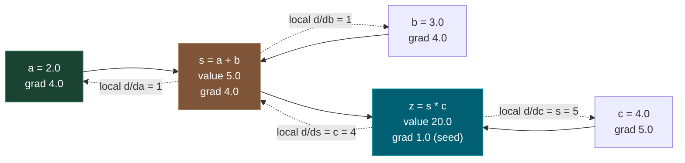
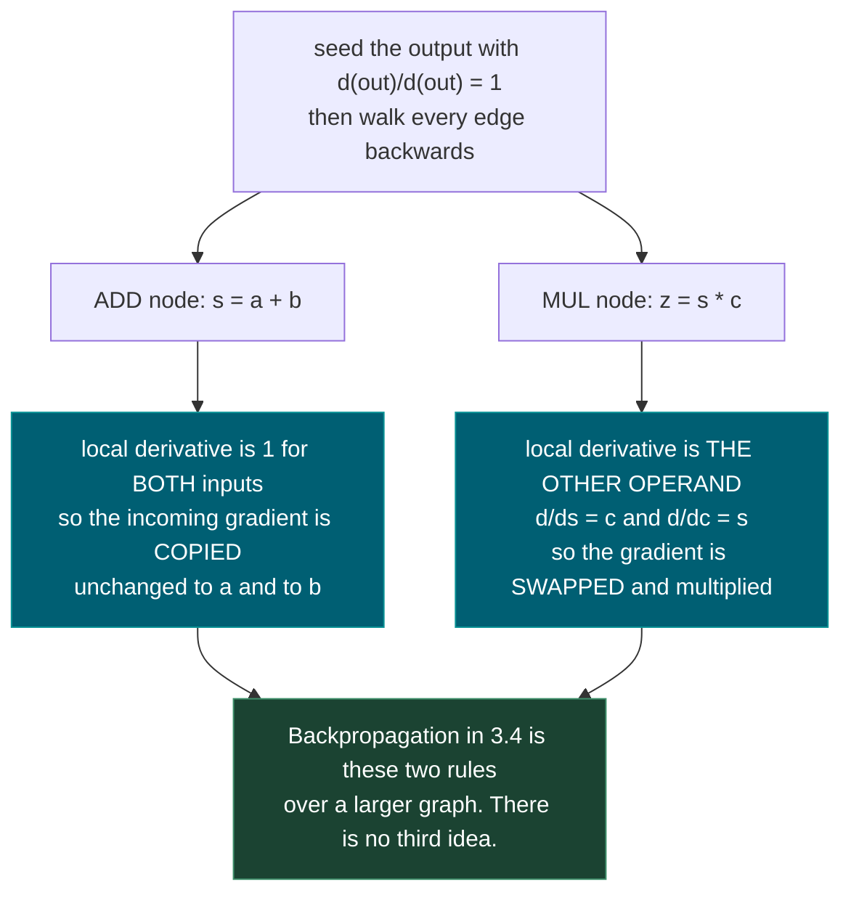
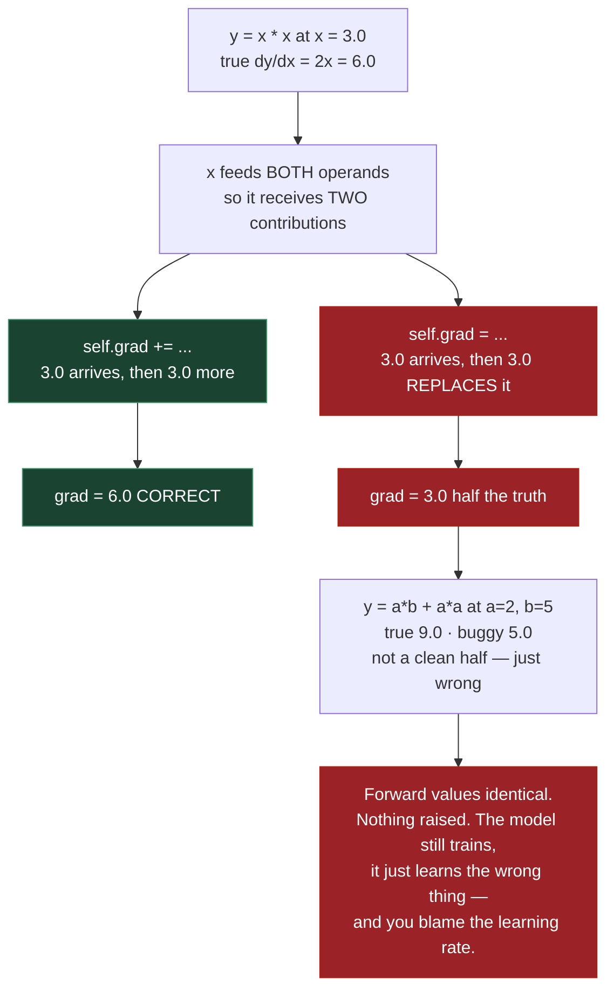
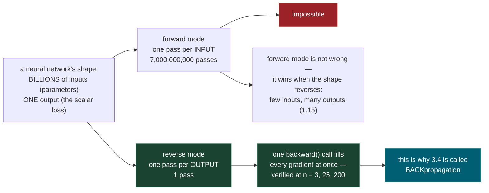

# 1.6 — Chain Rule and Computational Graphs

**Phase 1 · CORE · CODE · 6 focused hours · Review in 14 days**

**Companion script:** [`06_chain_rule_computational_graphs.py`](06_chain_rule_computational_graphs.py) — needs `numpy`; `torch` is optional and only the cross-check in Demo 4 depends on it. Pure computation: no files written, no network, no API keys.

---

## 1. Overview

This topic **is** backpropagation. **3.4** is nothing but the chain rule applied over a graph, and `torch.autograd` in **3.10** is that same procedure automated. Skipping this means treating `loss.backward()` as permanent magic.

So the script does the one thing that removes the magic for good: it **implements a working reverse-mode autodiff engine in about 60 lines**, then checks every gradient it produces against `torch.autograd` on the identical expression. In this run the worst disagreement anywhere was **0.000e+00** — not "close", identical. Once you have written the thing PyTorch is doing, Phase 3 stops containing a mystery and starts containing tensors.

Depends on **1.5** gradients; unlocks **3.4** backpropagation, **3.10** PyTorch autograd, and **1.15** Jacobians and Hessians.

---

## 2. Skip Test — Answered

> Gate **before** studying. Both correct from memory → skip. §7 withholds its answers deliberately.

**① Differentiate `f(x) = sin(3x²)`.**

`f'(x) = cos(3x²) · 6x`

Peel it from the outside in. The outer function is `sin(u)`, whose derivative is `cos(u)` — and you keep the inner argument **intact**, giving `cos(3x²)`. The inner function is `u = 3x²`, whose derivative is `6x`. The chain rule says multiply them.

Demo 1 checks this against a central difference at five values of `x`, agreeing to about `1e-10`. The derivative is not a convention to memorise; it is a claim about how the function responds, and it is testable.

**② Draw the computational graph for `z = (a+b)·c` and state `∂z/∂a`.**

The graph has two operations: `s = a + b`, then `z = s · c`. So `∂z/∂a = c`, which is **4.0** at `a=2, b=3, c=4`.

The reasoning is two local rules, and Demo 2 verifies both numerically:

- **Addition copies** the incoming gradient to both inputs, because `∂(a+b)/∂a = 1`.
- **Multiplication swaps**: it sends the incoming gradient times *the other operand*, because `∂(s·c)/∂s = c`.

Seed the output with `∂z/∂z = 1`, walk backwards, multiply by each local derivative as you cross it. `∂z/∂s = 1 · c = 4`, then `∂z/∂a = 4 · 1 = 4`. That is the entire algorithm.

---

## 3. Visual Concept Diagrams

### 3.1 — One graph, both directions

Forward computes values left to right. Backward computes gradients right to left. Same edges.



### 3.2 — The only two rules you need



### 3.3 — The accumulation bug, at the measured numbers

When one node feeds two consumers, its gradients must **add**. One character decides it.



### 3.4 — Why the algorithm runs backwards



---

## 4. Core Technical Deep Dive

**The chain rule.** If `y = f(g(x))` then `dy/dx = f'(g(x)) · g'(x)`. In words: differentiate the outer function while leaving its argument alone, then multiply by the derivative of what was inside. For a longer composition the factors keep multiplying — `dy/dx = f'(·) · g'(·) · h'(x)` — which is why gradients through a deep network are a long product, and why that product can vanish or explode (**3.4**).

**A computational graph** is what an expression looks like once you stop treating it as one formula. Each node stores its forward value and knows only its **local** derivative with respect to its immediate inputs. No node knows anything about the graph as a whole. That locality is what makes the whole thing automatable.

**Local derivatives you need for the engine:**

| Node | Forward | Local derivative | In words |
|---|---|---|---|
| add | `c = a + b` | `dc/da = 1`, `dc/db = 1` | copy the gradient to both |
| mul | `c = a · b` | `dc/da = b`, `dc/db = a` | multiply by *the other* operand |
| pow | `c = a^k` | `dc/da = k·a^(k-1)` | the usual power rule |
| tanh | `c = tanh(a)` | `dc/da = 1 - c²` | reuses the **forward** value |

That `tanh` row explains a practical fact: its backward pass needs the value computed on the way forward, so frameworks **cache forward activations** for the backward pass. This is why training uses far more memory than inference (**3.6**).

**The reverse-mode algorithm, in full:**

1. Run forward, recording each node's value and its parents.
2. Topologically sort the graph so every node comes after all its inputs.
3. Seed the output: `d(out)/d(out) = 1`.
4. Walk the sorted list **in reverse**, and at each node push its gradient into its parents by multiplying by the local derivative.

Step 2 is not optional. A node must not run its backward step until **every** consumer has contributed, or it will propagate a partial gradient downstream.

**The accumulation rule.** Parents receive `+=`, never `=`. When a node feeds more than one consumer, the total derivative is the **sum** over all paths — that is the multivariable chain rule. Demo 5 measures the consequence: on `y = x·x` at `x=3`, accumulating gives the correct `6.0` and overwriting gives `3.0`.

This is not an exotic case. Residual connections, weight sharing, and attention reusing one input across heads are all fan-out. It is also why **3.4** calls `optimizer.zero_grad()` between steps: since accumulation is the *default*, last step's gradients would otherwise add to this step's.

**Forward mode versus reverse mode.** Both compute exact derivatives; they differ in what one pass buys you. Forward mode propagates derivatives with respect to **one input** through the whole graph, so `n` inputs cost `n` passes. Reverse mode propagates the derivative of **one output** backwards, so one pass yields every input's gradient. A network has billions of inputs and one scalar loss, which settles the choice. Reverse it — few inputs, many outputs — and forward mode wins, which is the Jacobian case in **1.15**.

---

## 5. Hands-On Script & Verified Output

Run: `python 06_chain_rule_computational_graphs.py`. Output below is **actual, captured** on numpy 2.4.4 / torch 2.13.0+cpu / Python 3.14.4. No randomness is involved, so it reproduces exactly.

```text
numpy 2.4.4
======================================================================
DEMO 1 - the chain rule, checked rather than asserted
======================================================================
  f(x) = sin(3x^2)   ->   f'(x) = cos(3x^2) * 6x

       x         analytic     central diff     abs diff
    0.30     1.7347876135     1.7347876134     3.64e-11
    0.70     0.4226280802     0.4226280803     2.93e-11
    1.00    -5.9399549796    -5.9399549793     3.02e-10
    1.50     8.0370571022     8.0370571012     1.00e-09
    2.00    10.1262475048    10.1262475045     2.74e-10
======================================================================
DEMO 2 - a computational graph, forward then backward
======================================================================
  expression: z = (a + b) * c      with a=2, b=3, c=4

  FORWARD
    s = a + b = 5.0
    z = s * c = 20.0

  BACKWARD  (seed dz/dz = 1)
    dz/ds = dz/dz * c   = 4.0
    dz/dc = dz/dz * s   = 5.0
    dz/da = dz/ds * 1   = 4.0      <- the skip-test answer
    dz/db = dz/ds * 1   = 4.0

              by chain rule      finite diff     abs diff
  dz/da        4.0000000000     4.0000000006     5.59e-10
  dz/db        4.0000000000     4.0000000006     5.59e-10
  dz/dc        5.0000000000     5.0000000016     1.59e-09
======================================================================
DEMO 3 - a reverse-mode autodiff engine, from scratch
======================================================================
  out = tanh(x1*w1 + x2*w2 + b)
    forward value: 0.7071067812

  graph has 10 nodes, evaluated in topological order

  node       op              value           grad
  x1         leaf         2.000000  -1.5000000000
  w1         leaf        -3.000000   1.0000000000
  x2         leaf         0.000000   0.5000000000
  w2         leaf         1.000000   0.0000000000
  b          leaf         6.881374   0.5000000000
  n          +            0.881374   0.5000000000
  out        tanh         0.707107   1.0000000000

  Now compare w2 and x2, and note which one is zero:
    w2.grad = 0.0000   x2.grad = 0.5000
======================================================================
DEMO 4 - the engine, cross-checked against torch.autograd
======================================================================
  forward   ours 0.707106781186548
            torch 0.707106781186548
            abs diff 0.000e+00

                         ours                torch     abs diff
  x1       -1.500000000000000   -1.500000000000000    0.000e+00
  w1        1.000000000000000    1.000000000000000    0.000e+00
  x2        0.500000000000000    0.500000000000000    0.000e+00
  w2        0.000000000000000    0.000000000000000    0.000e+00
  b         0.500000000000000    0.500000000000000    0.000e+00

  worst disagreement anywhere: 0.000e+00

  independent finite-difference check:
  input              engine        finite diff     abs diff
  x1          -1.5000000000      -1.4999999998     2.34e-10
  x2           0.5000000000       0.5000000020     1.96e-09
  w1           1.0000000000       0.9999999984     1.64e-09
  w2           0.0000000000       0.0000000000     0.00e+00
  b            0.5000000000       0.5000000020     1.96e-09
======================================================================
DEMO 5 - a node used TWICE must ADD its gradients
======================================================================
  y = x * x   at x = 3.0        true dy/dx = 2x = 6.0

    grad += (correct)   -> 6.0
    grad =  (the bug)   -> 3.0
    the buggy version returned x, not 2x. Off by exactly half.

  y = a*b + a*a   at a=2, b=5    true dy/da = b + 2a = 9.0
    grad += (correct)   -> 9.0
    grad =  (the bug)   -> 5.0
======================================================================
DEMO 6 - why reverse mode: counted, not asserted
======================================================================
  n inputs                   forward passes  reverse passes
  ---------------------- ------------------ ---------------
  1                                       1               1
  10                                     10               1
  100                                   100               1
  10,000                             10,000               1
  7,000,000,000 (7B)          7,000,000,000               1

  n=3    ONE backward() filled 3 gradients, all equal to 12 -> True
  n=25   ONE backward() filled 25 gradients, all equal to 650 -> True
  n=200  ONE backward() filled 200 gradients, all equal to 40200 -> True
======================================================================
```

**Demo 4 is the entire justification for this topic.** Sixty lines of Python and `torch.autograd` disagree by **0.000e+00** on every gradient — not approximately, exactly, because both are performing the same finite sequence of float operations in the same order. An independent finite-difference check then confirms both are right to `~1e-9`, which matters because two implementations of the same *wrong* idea would also agree with each other.

**Demo 3's `w2` and `x2` columns are worth pausing on, and I got them backwards on the first write.** `w2.grad` is **0.0** while `x2.grad` is **0.5**. The reason is that `d(out)/d(w2) = x2 · (1 - tanh²)` and `x2` is itself `0` — so a feature that is always zero can never train its own weight, no matter how wrong that weight is. Meanwhile `x2`'s own gradient is nonzero, because a node's gradient depends on **what it multiplies**, not on its own value. The multiplication rule swaps; that is precisely what makes it easy to get backwards, and why the printed table is the check.

**Demo 5 is the bug you will actually write.** `self.grad = ` instead of `self.grad +=` produces **3.0** where the truth is **6.0** on `y = x·x`. Note the second case: on `y = a·b + a·a` the buggy answer is **5.0** against a true **9.0** — not a clean half, just wrong. Forward values were identical in both. Nothing raised. A model trained this way still runs, still produces a loss curve, and learns the wrong thing while you blame the learning rate.

**Demo 1 shows what "verify, don't assert" costs.** Five values of `x`, analytic against central difference, agreeing to `1e-10`. The residual is not zero and should not be — it is the finite-difference truncation error from **1.5**, which is why the check uses a central difference (error `O(h²)`) rather than a forward one (`O(h)`).

**Demo 6 turns the reverse-mode argument into arithmetic.** For a 7B-parameter model, forward mode needs **7,000,000,000** passes to what reverse mode does in **1**. The rows below it confirm the claim operationally rather than rhetorically: a single `backward()` call filled 3, then 25, then 200 gradients simultaneously, all matching the closed form `2·sum(x)`.

**Modify and re-run:**
- Add a `relu` to `Value` (`out = max(0, x)`, local derivative `1` if `x > 0` else `0`) and cross-check it against `torch.relu`. Then check the gradient exactly at `x = 0` and decide what the right answer is — frameworks disagree.
- Delete the topological sort and run the backward pass in insertion order instead. Find an expression where it gives the wrong answer, and explain why ordering was load-bearing.
- Build a 3-layer chain of `tanh` nodes and print the gradient reaching the first layer. Watch it shrink — that is vanishing gradients (**3.4**) arriving early.
- In Demo 5, make `BadValue` correct for single-use nodes but keep it wrong for fan-out, then write the test that would have caught it.
- Add a `__truediv__` and confirm your local derivative against `torch` before trusting it.

---

## 6. Video

**[VERIFY]** — no video was confirmed live in this pass, and naming one unverified would be worse than saying so. Two authoritative pointers instead. Andrej Karpathy's **`micrograd`** repository on GitHub is the canonical version of Demo 3's engine — the `Value` class here is deliberately the same shape, so reading that source after writing your own is the natural next step. For the mechanics, the PyTorch documentation page **"Autograd mechanics"** explains topological ordering, gradient accumulation and why `zero_grad()` exists, which is Demo 5 stated from the framework's side.

---

## 7. Retrieval Checkpoint — Unanswered

> Close this file. No notes. Answers deliberately withheld.

1. Differentiate `f(x) = tanh(2x³ + 1)`, then say how you would check your answer without a symbolic tool.
2. State the local derivative of an add node and of a multiply node, and explain why the multiply case is the one people get backwards.
3. A node feeds three separate consumers. What must happen to its gradient, and what is the failure mode if you get it wrong? Would anything raise?
4. Why must a computational graph be topologically sorted before the backward pass, rather than walked in the order nodes were created?
5. A network has 7 billion parameters and one scalar loss. Explain, in terms of passes, why reverse mode is used — and describe a problem where forward mode would be the better choice.

---

## 8. Closed-Book Rebuild

With this file **and** the script closed, implement a scalar autodiff engine from scratch: a `Value` class supporting `+`, `*`, and one nonlinearity, with each operation storing a local backward closure; a topological sort; and a `backward()` that seeds the output at `1.0`.

Then prove it works, in three independent ways. Cross-check every gradient against `torch.autograd` on the same expression. Cross-check again with central finite differences. And write the fan-out test — an expression using one input twice — that fails if you wrote `=` instead of `+=`. State the expected gradient before you run any of them.

---

## 9. Glossary

**Chain rule** — `d/dx f(g(x)) = f'(g(x)) · g'(x)`. Differentiate the outer function, keep its argument intact, multiply by the inner derivative.

**Computational graph** — an expression represented as nodes and edges, where each node knows only its forward value and its local derivatives.

**Local derivative** — the derivative of one node's output with respect to its immediate inputs. All a node ever needs to know.

**Forward pass** — computing values from inputs to output, recording intermediates for later.

**Backward pass** — propagating `d(output)/d(node)` from the output back to every input, multiplying by local derivatives along the way.

**Reverse-mode autodiff** — one backward pass per **output**. Yields all input gradients at once. What deep learning uses.

**Forward-mode autodiff** — one pass per **input**. Better when there are few inputs and many outputs (**1.15**).

**Topological sort** — an ordering where every node appears after all its inputs. Guarantees a node's backward step runs only once all consumers have contributed.

**Gradient accumulation** — parents receive `+=`, never `=`, because the total derivative sums over all paths from a node to the output.

**Fan-out** — one node feeding multiple consumers. The situation that makes accumulation mandatory; residual connections and weight sharing are both fan-out.

**`zero_grad()`** — clearing accumulated gradients between optimizer steps. Necessary precisely because accumulation is the default (**3.4**).

**Cached activation** — a forward value kept because the backward pass needs it (as `tanh` does). The main reason training costs more memory than inference (**3.6**).

**Seed gradient** — the `1.0` placed at the output to start the backward pass, since `d(out)/d(out) = 1`.

---

## Review again in

**14 days** — and re-read the engine rather than the prose. Two things carry forward. The **two local rules** (add copies, multiply swaps), because every other operation is a variation on them. And the **`+=`**, because it is one character, it is invisible in code review, it raises nothing, and it silently halves a gradient that every fan-out in a real network depends on.
