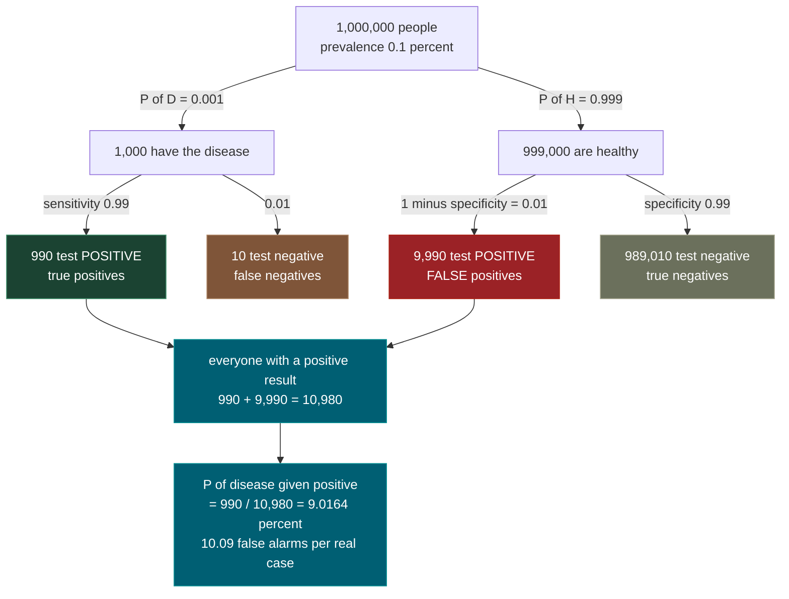
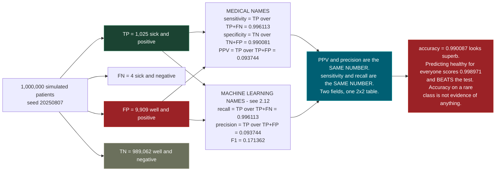
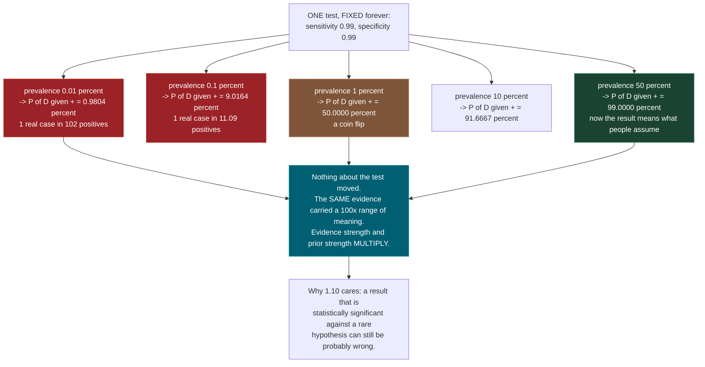
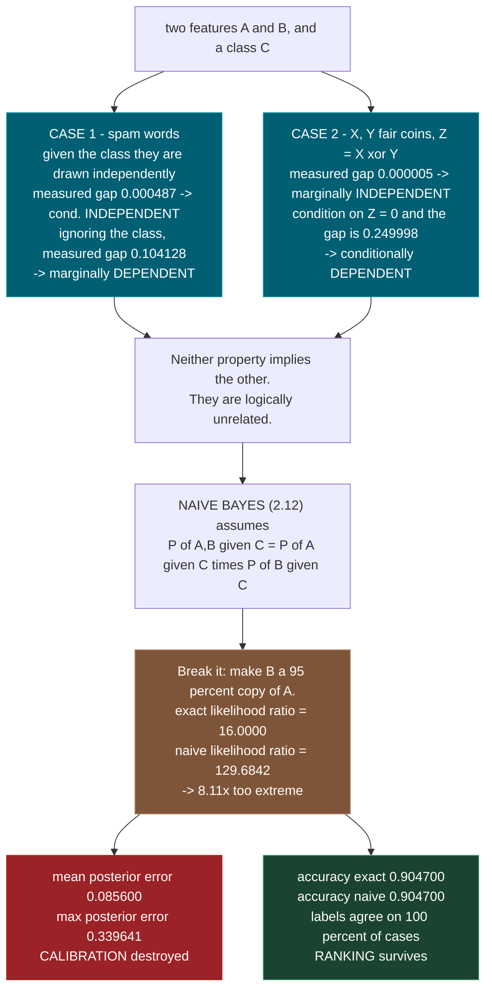
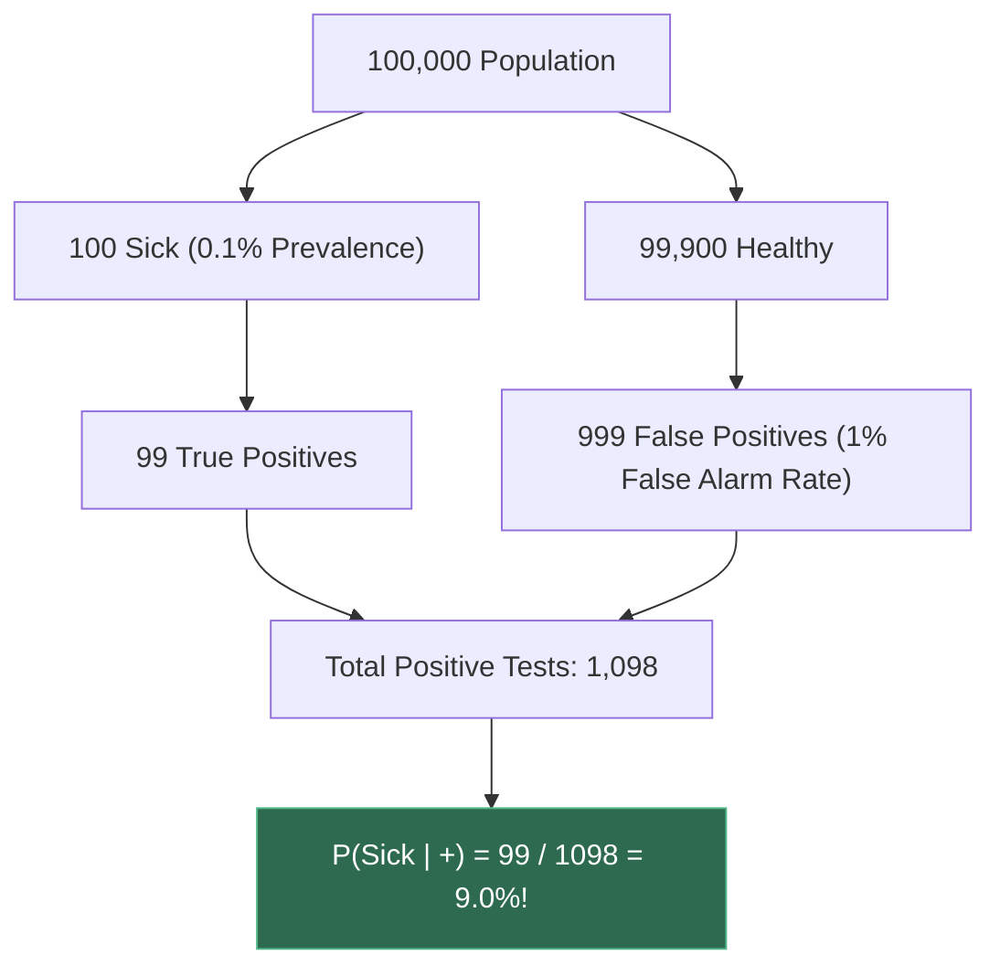
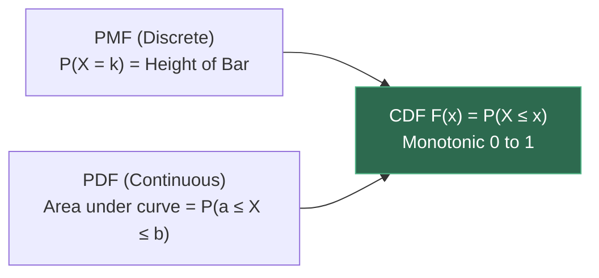
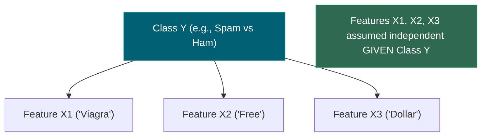
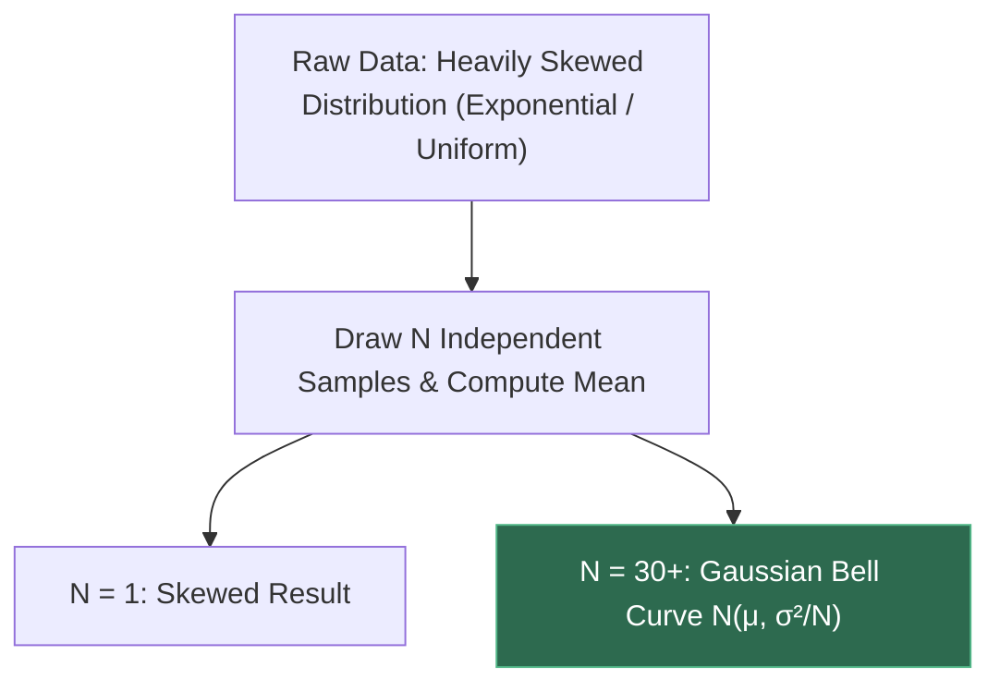

# 1.7 — Probability: Random Variables, Distributions, Bayes

**Phase 1 · CORE · CODE · 8 focused hours · Review in 14 days**

**Companion script:** [`07_probability_distributions_bayes.py`](07_probability_distributions_bayes.py) — needs `numpy` and `matplotlib` (imported with the headless `Agg` backend, so it never tries to open a window). Seven demos that compute every probability at least twice — once from a formula, once by counting simulated outcomes — and print how far apart the two answers landed. No network, no API keys, no input files; it writes exactly two `.png` files beside itself and nothing else. Seed is fixed at `20250807`, so every number below reproduces.

---

## 1. Overview

A language model is a conditional probability distribution. That is not a metaphor. Given the tokens so far, it emits a number for every token in its vocabulary, those numbers are non-negative and sum to one, and that object is a probability distribution over the next token. Everything **4.6** does — temperature, top-k, top-p, beam search — is a policy for *sampling from that distribution*, and none of those choices make sense until distributions do.

The second half of this topic is Bayes theorem, which is the rule for changing your mind when evidence arrives. It is four symbols long and almost everyone gets it wrong on first contact, in a specific and expensive way: they read a test result as if the test were the only fact in the room, forgetting the base rate. This file spends most of its energy on that single mistake, because it is the one that transfers. It is the reason **2.12** Naive Bayes works at all, the reason a rare-failure eval set flatters a model, and the reason "the classifier is 99% accurate" is a sentence containing no information.

Along the way: what a random variable actually is, five named distributions with their closed-form means and variances checked against samples, the Central Limit Theorem measured rather than asserted, and the difference between two features being independent and being *conditionally* independent — a distinction that sounds pedantic until you see that it is the entire content of the word "naive" in Naive Bayes.

Feeds **1.8** expectation and variance, **1.9** maximum likelihood, **1.10** hypothesis testing, **2.12** Naive Bayes, and **4.6** decoding strategies.

---

## 2. Skip Test — Answered

> Gate **before** studying. Both correct from memory → skip. §7 withholds its answers deliberately.

**① State Bayes theorem and define each of the four terms.**

```
P(A | B) = P(B | A) * P(A) / P(B)
```

Four terms, and the names matter because people use them constantly:

| Term | Name | What it is |
|---|---|---|
| `P(A)` | **prior** | what you believed about `A` before seeing `B` |
| `P(B given A)` | **likelihood** | how probable the evidence `B` is *if* `A` were true |
| `P(B)` | **evidence** / marginal likelihood | how probable `B` is overall, across every possibility |
| `P(A given B)` | **posterior** | what you believe about `A` after seeing `B` |

`P(B)` is almost never given to you directly. You build it with the **law of total probability**, which says: split the world into cases that are mutually exclusive and cover everything, then add up the probability of `B` within each case, weighted by how likely that case was.

```
P(B) = P(B given A) * P(A) + P(B given not-A) * P(not-A)
```

Demo 1 of the script computes the whole thing three separate ways — the closed formula, a normalized column of a 2x2 joint probability table, and integer head-counting over a population of a million — and the three answers agree to **6.939e-17**, which is float64 rounding. They are the same theorem wearing three costumes.

**② A test is 99% accurate for a disease with 0.1% prevalence — is a positive result more likely true or false, and roughly why?**

**Far more likely FALSE.** `P(disease given positive)` is **9.0164%**, so a positive result is wrong about **91%** of the time.

The reason is not subtle once you count people instead of manipulating percentages. Take 1,000,000 people. With 0.1% prevalence, **1,000** of them have the disease and **999,000** do not. The test catches 99% of the sick, so **990** true positives. It also wrongly fires on 1% of the healthy — and 1% of 999,000 is **9,990** false positives. Total positives: **10,980**. Of those, only 990 are real.

```
P(D given +) = 990 / 10980 = 0.0901639344
```

The healthy group is a thousand times larger than the sick group, so even a 1% error rate applied to it produces **ten times more** false alarms than the sick group produces true ones — the script prints the ratio as **10.09 false positives for every 1 true positive**. Demo 2 stops trusting that arithmetic and simulates a million individual patients, drawing each one's disease status and test result at random. The counted answer is **9.3744%** against the predicted **9.0164%** — a gap of **0.3580 percentage points**, which the script shows is **1.31 standard errors**, i.e. ordinary sampling noise. Rerun at 20,000,000 patients and the error bar shrinks by the predicted **4.5x**.

The transferable form of the answer: **a strong test against a rare event still yields a weak conclusion**, because the prior and the likelihood multiply, and a tiny prior can swamp a strong likelihood.

---

## 3. Visual Concept Diagrams

### 3.1 — The base-rate problem, counted in whole people



### 3.2 — One table, two vocabularies: measured counts from Demo 2



### 3.3 — The test never changes. Only the prior does.



### 3.4 — Independence is not conditional independence, and what "naive" costs



---

## 4. Core Technical Deep Dive

### 4.1 The objects, from the bottom

Start with a **random experiment** — anything with an uncertain outcome. The **sample space** `S` is the set of all outcomes it could produce. Flipping two coins: `S = {HH, HT, TH, TT}`. An **event** is any subset of `S`; "at least one head" is the event `{HH, HT, TH}`.

A **probability** assigns a number to every event, subject to exactly three rules (the Kolmogorov axioms), and everything else in this file is derived from them:

1. `P(E) >= 0` for every event — probabilities are never negative.
2. `P(S) = 1` — something happens.
3. If `E` and `F` cannot both occur, `P(E or F) = P(E) + P(F)`.

A **random variable** is *not* a variable and *not* random. It is a **function** from outcomes to numbers: `X: S -> R`. On the two-coin experiment, "number of heads" is the random variable `X(HH)=2, X(HT)=1, X(TH)=1, X(TT)=0`. The randomness lives in which outcome occurs; `X` is a fixed, deterministic relabelling. In Demo 2 the random variable is literally `has_disease`, a function from "which patient" to `{0, 1}`.

**Discrete** random variables take countably many values and are described by a **PMF** (probability mass function) `p(x) = P(X = x)`, with `sum over all x of p(x) = 1`. **Continuous** random variables are described by a **PDF** (probability density function) `f(x)`, where `f(x)` is *not* a probability — it is a density, it can exceed 1, and only its integral means anything: `P(a <= X <= b) = integral from a to b of f(x) dx`. For a continuous variable `P(X = 3.7) = 0` exactly. Both types share a **CDF**: `F(x) = P(X <= x)`, which is non-decreasing, starts at 0 and ends at 1.

### 4.2 Joint, marginal, conditional — and where Bayes comes from

Two random variables together have a **joint** distribution `P(A, B)`. Sum out one of them and you get a **marginal**: `P(A) = sum over b of P(A, B=b)`. Demo 1's Way B prints exactly this table — four joint probabilities, with row totals (the marginals of disease status) and column totals (the marginals of test result), and the whole thing summing to `1.0000000000000000`.

**Conditional probability** is a renormalized slice of the joint:

```
P(A given B) = P(A, B) / P(B)          defined whenever P(B) > 0
```

Read it as: throw away every outcome where `B` did not happen, then ask what fraction of what remains has `A`. That is why the operation is "take a column of the table and divide it by its own total".

Rearranging gives the **product rule**, `P(A, B) = P(A given B) * P(B)`. But the joint is symmetric — `P(A, B)` and `P(B, A)` are the same set of outcomes — so it can also be written `P(B given A) * P(A)`. Set them equal:

```
P(A given B) * P(B) = P(B given A) * P(A)
```

and divide by `P(B)`. That is Bayes theorem, and it is a two-line consequence of the definition of conditional probability. There is nothing mystical in it.

```
P(A given B) = P(B given A) * P(A) / P(B)
```

For the medical case, with `D` = has disease, `H` = healthy, `+` = positive test:

| Symbol | Value | Name |
|---|---|---|
| `P(D)` | `0.001` | prior, prevalence, base rate |
| `P(+ given D)` | `0.99` | likelihood, sensitivity, true positive rate, **recall** |
| `P(- given H)` | `0.99` | specificity, true negative rate |
| `P(+ given H)` | `0.01` | false positive rate, `1 - specificity` |
| `P(+)` | `0.01098` | evidence — computed, never given |
| `P(D given +)` | `0.0901639` | posterior, PPV, **precision** |

`P(+) = 0.99 * 0.001 + 0.01 * 0.999 = 0.00099 + 0.00999 = 0.01098`. Notice which term dominates: the false-positive term `0.00999` is **ten times larger** than the true-positive term `0.00099`. The denominator of Bayes theorem is mostly false alarms, and that ratio *is* the answer.

### 4.3 Odds and log-odds: the form that scales

Dividing the posterior for `D` by the posterior for `H` cancels `P(+)` entirely, which is the annoying term:

```
posterior odds = prior odds * likelihood ratio

P(D given +) / P(H given +)  =  [P(D)/P(H)]  *  [P(+ given D)/P(+ given H)]
```

where `odds = p / (1 - p)` and `p = odds / (1 + odds)`. The **likelihood ratio** of a positive result is `LR+ = sensitivity / (1 - specificity) = 0.99/0.01 = 99`, and of a negative result `LR- = (1 - sensitivity)/specificity = 0.0101`. Prior odds here are `0.001/0.999 = 0.001001`.

Independent pieces of evidence then just **multiply**, and taking logs turns that into **addition**:

```
log posterior odds = log prior odds + sum over i of log LR(evidence i)
```

This is the form that matters downstream. It is what a Naive Bayes classifier computes in **2.12** (a sum of log-likelihood terms plus a log prior). It is what **4.6** accumulates when it scores a candidate sequence by summing per-token log-probabilities. And it is numerically safe for the reason **1.12** gives — multiplying a thousand small probabilities underflows to `0.0`, whereas adding a thousand logs does not.

Demo 7 runs both routes on the same evidence sequences and they agree to `1.388e-17`.

### 4.4 The five distributions worth memorising

| Distribution | PMF / PDF | Mean | Variance | What it models |
|---|---|---|---|---|
| **Bernoulli(p)** | `P(1)=p`, `P(0)=1-p` | `p` | `p(1-p)` | one yes/no trial |
| **Binomial(n, p)** | `C(n,k) p^k (1-p)^(n-k)` | `n*p` | `n*p*(1-p)` | successes in `n` independent trials |
| **Uniform(a, b)** | `1/(b-a)` on `[a,b]` | `(a+b)/2` | `(b-a)^2 / 12` | no reason to prefer any value |
| **Normal(mu, sigma)** | `exp(-(x-mu)^2 / (2 sigma^2)) / (sigma sqrt(2 pi))` | `mu` | `sigma^2` | sums and averages of many things |
| **Exponential(rate lam)** | `lam * exp(-lam x)` for `x >= 0` | `1/lam` | `1/lam^2` | waiting time until an event |

`C(n,k)` is `n! / (k! (n-k)!)`, the number of ways to choose `k` items from `n`.

These closed forms are **not approximations**. Demo 4 re-derives the Binomial mean and variance by brute-force summation over all 21 outcomes of `Binomial(20, 0.3)` — `sum of k*p(k)` and `sum of (k-mu)^2 * p(k)` — and they match `n*p = 6.0` and `n*p*(1-p) = 4.2` to `6.217e-15`.

What *is* an approximation is estimating them from data. The **standard error** of a sample mean is `sigma / sqrt(n)`, and since the sample mean is approximately normal, its expected *absolute* error is `sigma/sqrt(n) * sqrt(2/pi)`, because `E|Z| = sqrt(2/pi)` for a standard normal `Z`. The `sqrt(n)` in the denominator is the tax on every empirical claim: **100 times more data buys 10 times less error**, never 100 times. Demo 4 measures this ratio at five sample sizes and gets `0.930, 1.046, 1.025, 0.970, 1.027` against the prediction.

### 4.5 The Central Limit Theorem, stated precisely

Let `X_1 ... X_n` be independent draws from *any* distribution with finite mean `mu` and finite variance `sigma^2`. Let `Xbar` be their average. Then as `n` grows:

```
(Xbar - mu) / (sigma / sqrt(n))   ->   Normal(0, 1)
```

The source distribution does not have to be normal, symmetric, or even continuous. This is why the normal distribution is everywhere: anything that is a sum of many small independent contributions ends up normal regardless of what those contributions looked like.

The usual demonstration is a picture, which proves nothing. The quantitative version is checkable: if the source has skewness `g1` and excess kurtosis `g2`, then the mean of `n` draws has

```
skewness of Xbar        = g1 / sqrt(n)
excess kurtosis of Xbar = g2 / n
```

Exponential(1) has `g1 = 2` and `g2 = 6` exactly. So the mean of 100 draws should have skewness `0.2` and excess kurtosis `0.06`. Demo 5 measures **0.21382** and **0.06810** from 200,000 replicates. That is the CLT verified, not illustrated.

**Two honest caveats.** First, "converges" is about the *middle* of the distribution — the far tail of an average of exponentials is still exponential-ish at `n = 100`, so tail risk does not become normal quickly. Second, the theorem needs finite variance; distributions like the Cauchy have none and their sample means never settle down at all.

### 4.6 Independence, conditional independence, and the naive bet

`A` and `B` are **independent** when knowing one tells you nothing about the other:

```
P(A, B) = P(A) * P(B)        equivalently   P(A given B) = P(A)
```

They are **conditionally independent given C** when knowing one tells you nothing extra *once the value of C is known*:

```
P(A, B given C) = P(A given C) * P(B given C)
```

**Neither implies the other.** Demo 6 builds both counterexamples and measures them:

- Two spam-indicator words generated independently *within* each class are conditionally independent (measured gap `0.000487`) yet strongly dependent when you ignore the class (measured gap `0.104128`, a factor of `2.59`). Seeing "free" makes "click" more likely, because both are evidence for spam — the dependence flows entirely through the hidden class.
- Two fair coins `X`, `Y` with `Z = X xor Y` are independent (measured gap `0.000005`) but conditionally *dependent* given `Z` (measured gap `0.249998`) — once you know they agreed, one determines the other completely.

A **Naive Bayes classifier (2.12)** picks the class `c` maximising

```
P(c) * product over features i of P(feature_i given c)
```

The word "naive" is exactly the assumption in that product: **all features are conditionally independent given the class**. That assumption is almost always false in real text — "New" and "York" are not independent given "is this a news article". Demo 6 Part C makes it false on purpose by letting feature `B` be a 95% copy of feature `A`, and measures the damage: the exact likelihood ratio for the pattern `A=1, B=1` is `16.0000` while the naive one is `129.6842`, **8.11x too extreme**, because the naive rule counts the same piece of evidence twice.

And yet the classification accuracy is `0.904700` for both, with the two rules agreeing on **100%** of 400,000 labels. That is the whole story of Naive Bayes in two numbers: **its ranking survives an assumption its calibration does not**. Trust its label; do not trust its probability. The same warning applies to any model whose probabilities you plan to threshold — which is most of **2.12** and a good deal of eval design.

### 4.7 Why a language model is this object

An autoregressive LLM defines `P(next token given all previous tokens)` over a vocabulary of maybe 100,000 tokens. It is a categorical distribution — the discrete generalisation of Bernoulli to more than two outcomes — and the whole sequence probability factorises by the product rule:

```
P(t_1, t_2, ..., t_n) = P(t_1) * P(t_2 given t_1) * ... * P(t_n given t_1..t_(n-1))
```

That factorisation is exact, not an assumption; it is just the product rule applied repeatedly. In log form it becomes a sum of per-token log-probabilities, which is what perplexity and sequence scoring in **4.6** actually compute. Greedy decoding takes the argmax of each conditional; temperature reshapes it; top-p truncates it to the smallest set of tokens whose probabilities sum past `p` and renormalises — an operation that only makes sense because the thing being truncated was a distribution in the first place.

---

## 5. Hands-On Script & Verified Output

Run: `python 07_probability_distributions_bayes.py`. The output below is **actual, captured** on numpy 2.4.4 / matplotlib 3.11.1 / Python 3.14 on Windows, seed `20250807`, trimmed of some of the script's own running commentary. Every number reproduces because the seed is fixed.

```text
numpy 2.4.4  |  seed 20250807
======================================================================
DEMO 1 - Bayes theorem computed three independent ways
======================================================================
  the setup (exactly the skip-test numbers)
    P(D)       prevalence / prior      = 0.001000   (0.10% of people)
    P(+|D)     sensitivity / recall    = 0.990000
    P(-|H)     specificity             = 0.990000
    P(+|H)     false positive rate     = 0.010000

  WAY A - closed form
    P(+) = P(+|D)P(D) + P(+|H)P(H)
         = 0.990000 * 0.001000 + 0.010000 * 0.999000
         = 0.00099000 + 0.00999000 = 0.01098000
    P(D|+) = 0.00099000 / 0.01098000 = 0.0901639344

  WAY B - normalize a column of the joint distribution
                        result +        result -          row total
    disease D        0.0009900000    0.0000100000     0.0010000000
    healthy H        0.0099900000    0.9890100000     0.9990000000
    col total        0.0109800000    0.9890200000     1.0000000000
    the whole table sums to 1.0000000000000000  (it must; probability axiom)
    P(D|+) = joint[D,+] / column(+) = 0.0901639344

  WAY C - natural frequencies: 1,000,000 people, counted
         1000 have the disease ->      990 test +  (true positives)
                                       10 test -  (false negatives)
       999000 are healthy     ->     9990 test +  (FALSE positives)
                                   989010 test -  (true negatives)
    positives in total          = 990 + 9990 = 10980
    P(D|+) = 990 / 10980 = 0.0901639344

  AGREEMENT
    way A (formula)      = 0.0901639344262294
    way B (joint table)  = 0.0901639344262294
    way C (counting)     = 0.0901639344262295
    max abs diff         = 6.939e-17   <- three different routes, one answer

  ANSWER TO SKIP TEST 2: a positive result is far more likely FALSE.
    P(disease | positive) = 9.0164%
    P(healthy | positive) = 90.9836%
    For every 1 true positive there are 10.09 false positives.

======================================================================
DEMO 2 - simulate 1,000,000 patients and count what actually happens
======================================================================
  2x2 contingency table, 1,000,000 simulated patients, seed 20250807

                        test +          test -        row total
    ------------------------------------------------------------
    disease D            1,025              4          1,029
    healthy H            9,909        989,062        998,971
    ------------------------------------------------------------
    col total           10,934        989,066      1,000,000

  READ THE '+' COLUMN. That is the entire lesson.
    true  positives (sick, test +) : 1,025
    FALSE positives (well, test +) : 9,909
    ratio false : true             = 9.67 : 1

  SIMULATED vs ANALYTIC
    P(D|+) simulated  = 0.093744  (9.3744%)
    P(D|+) Bayes      = 0.090164  (9.0164%)
    difference        = 0.3580 percentage points
    expected noise    = 0.2733 percentage points (1 standard error)
    that is 1.31 standard errors away - ordinary sampling noise, not a bug.

  SAME EXPERIMENT AT 20,000,000 PATIENTS (20x the sample, sqrt(20)=4.5x less noise)
    true positives = 19,480   false positives = 199,849
    P(D|+) simulated  = 0.088816  (8.8816%)
    P(D|+) Bayes      = 0.090164  (9.0164%)
    difference        = 0.1348 percentage points
    expected noise    = 0.0612 percentage points (1 standard error)
    that is 2.20 standard errors. The error bar shrank 4.5x, exactly as
    sqrt(20) predicts. Bayes was right both times; only the noise moved.

  THE SAME TABLE, RENAMED (this is precision/recall - see 2.12)
    precision   = TP/(TP+FP) = 0.093744   <- identical to P(D|+), the PPV
    recall      = TP/(TP+FN) = 0.996113   <- identical to sensitivity
    specificity = TN/(TN+FP) = 0.990081
    NPV         = TN/(TN+FN) = 0.999996   <- a negative is very trustworthy
    F1          = 0.171362
    accuracy    = 0.990087   <- looks superb, and is useless here

  A model that always predicts 'healthy' would score accuracy 0.998971
  ... which BEATS the test. Accuracy on a rare class is not evidence.

======================================================================
DEMO 3 - one unchanged test, swept across base rates
======================================================================
  Sensitivity and specificity are FIXED at 0.99 for every row below.
  Only the prior changes.

    prevalence     P(D|+)        odds of being right     1 in N positives is real
    ----------------------------------------------------------------------------
      0.0100%     0.9804%            0.0099 : 1        1 in   102.00
      0.0500%     4.7188%            0.0495 : 1        1 in    21.19
      0.1000%     9.0164%            0.0991 : 1        1 in    11.09
      0.5000%    33.2215%            0.4975 : 1        1 in     3.01
      1.0000%    50.0000%            1.0000 : 1        1 in     2.00
      5.0000%    83.8983%            5.2105 : 1        1 in     1.19
     10.0000%    91.6667%           11.0000 : 1        1 in     1.09
     20.0000%    96.1165%           24.7500 : 1        1 in     1.04
     35.0000%    98.1586%           53.3077 : 1        1 in     1.02
     50.0000%    99.0000%           99.0000 : 1        1 in     1.01

  spot-check by simulation (2,000,000 patients each), with error bars,
  because a simulated number quoted without its noise proves nothing:
    prev  0.100%  simulated 0.09186   Bayes 0.09016   diff 0.00169   = 0.88 SE
    prev  5.000%  simulated 0.83879   Bayes 0.83898   diff 0.00020   = 0.18 SE

  saved 07_bayes_prevalence_sweep.png  (42869 bytes)

======================================================================
DEMO 4 - five distributions: closed-form mean/variance vs samples
======================================================================
  Binomial(n=20, p=0.3) - closed form vs brute-force sum over the PMF
    sum of PMF over all 21 outcomes = 0.9999999999999991
      -> off 1.0 by 8.882e-16, which is float64 rounding across 21 additions,
         not a probability error. 1.12 is the topic that owns this.
    mean  by sum k*P(k)   = 5.99999999999999      closed form n*p      = 6.00000000000000
    var   by sum (k-mu)^2 = 4.19999999999999      closed form n*p*(1-p)= 4.20000000000000
    max abs diff = 6.217e-15   <- the formulas are not approximations

  Empirical mean and variance vs their closed forms.
  Each cell = mean |estimate - truth| over R independent repeats,
  because one draw is luck and we are trying to measure a rate.
  The standard error is sd/sqrt(n), so 100x more data -> 10x less error.

    distribution           true mean         n=100       n=10000     n=1000000   ratios
    ------------------------------------------------------------------------------
    Bernoulli(p=0.3)         0.30000      0.037875      0.003678      0.000438   10.3x 8.4x
    Binomial(20, 0.3)        6.00000      0.178300      0.015922      0.001622   11.2x 9.8x
    Normal(5, sd=2)          5.00000      0.157724      0.016598      0.001591   9.5x 10.4x
    Uniform(0, 10)           5.00000      0.240978      0.023388      0.002289   10.3x 10.2x
    Exponential(mean=2)      2.00000      0.166571      0.015236      0.001217   10.9x 12.5x
                                                                      (want ~10x 10x)

    distribution            true var         n=100       n=10000     n=1000000   ratios
    ------------------------------------------------------------------------------
    Bernoulli(p=0.3)         0.21000      0.016100      0.001392      0.000139   11.6x 10.0x
    Binomial(20, 0.3)        4.20000      0.460281      0.051270      0.004600   9.0x 11.1x
    Normal(5, sd=2)          4.00000      0.415439      0.044282      0.005980   9.4x 7.4x
    Uniform(0, 10)           8.33333      0.612583      0.065848      0.005102   9.3x 12.9x
    Exponential(mean=2)      4.00000      0.856538      0.082050      0.008331   10.4x 9.8x
                                                                      (want ~10x 10x)

  Nailing the constant: Exponential(mean=2) has sd = 2, so the predicted
  typical absolute error of the sample mean is (2/sqrt(n)) * sqrt(2/pi).

             n     measured |err|          predicted      ratio
           100           0.148463           0.159577      0.930
          1000           0.052780           0.050463      1.046
         10000           0.016362           0.015958      1.025
        100000           0.004897           0.005046      0.970
       1000000           0.001638           0.001596      1.027

======================================================================
DEMO 5 - Central Limit Theorem, with a measured error not a hand-wave
======================================================================
  Source distribution: Exponential(mean=1). It is violently non-normal:
  it is bounded below at 0, and its true skewness is exactly 2.
  We average n of its draws, 200,000 times, and measure the shape.

  Theory says the skewness of the mean of n iid draws is skew/sqrt(n),
  and the excess kurtosis is kurt/n. For Exponential: 2/sqrt(n) and 6/n.

        n  skew measured      2/sqrt(n)   kurt meas.          6/n KS vs normal
    --------------------------------------------------------------------------
        1        2.02211        2.00000      6.28970      6.00000      0.15866
        2        1.42284        1.41421      3.01139      3.00000      0.09446
        5        0.89424        0.89443      1.17435      1.20000      0.06085
       10        0.63710        0.63246      0.64453      0.60000      0.04215
       30        0.35922        0.36515      0.21665      0.20000      0.02440
      100        0.21382        0.20000      0.06810      0.06000      0.01418

  Monte Carlo noise floor on that KS column is about 1/sqrt(200,000) = 0.00224,
  so anything at or below ~0.0045 is measurement noise, not residual skew.

  Why is the n=1 row 0.15866? A standardised Exponential(1) equals x - 1,
  so it has ZERO mass below -1, while the normal curve puts Phi(-1) =
  0.158655 of its mass there. The largest possible gap is that number,
  and the measurement found it. The starting point was never noise.

  saved 07_clt_convergence.png  (110424 bytes)

  Caveat worth carrying: the CLT is about the MIDDLE of the distribution.
  At n=100 the centre is indistinguishable from normal while the far right
  tail is still exponential. Tail risk does not become normal quickly.

======================================================================
DEMO 6 - independence vs conditional independence, and the 'naive' bet
======================================================================
  PART A - independent GIVEN the class, dependent when you forget the class
    P(spam) = 0.30
    given spam: P(A=1) = 0.80, P(B=1) = 0.70, drawn independently
    given ham : P(A=1) = 0.05, P(B=1) = 0.04, drawn independently

    CONDITIONAL on spam:
      P(A=1|spam)             = 0.800588
      P(B=1|spam)             = 0.700911
      P(A=1,B=1|spam)         = 0.560654
      P(A|spam)*P(B|spam)     = 0.561141
      gap                     = 0.000487   -> conditionally INDEPENDENT

    MARGINALLY, ignoring the class:
      P(A=1)                  = 0.275100
      P(B=1)                  = 0.238285
      P(A=1,B=1)              = 0.169680
      P(A)*P(B)               = 0.065552
      gap                     = 0.104128   -> marginally DEPENDENT (2.59x off)

  PART B - the reverse: independent until you condition, then locked together
    X, Y are fair independent coin flips. Z = X XOR Y.

      P(X=1)                  = 0.499393
      P(Y=1)                  = 0.499352
      P(X=1,Y=1)              = 0.249378
      P(X)*P(Y)               = 0.249373
      gap                     = 0.000005   -> marginally INDEPENDENT

      now condition on Z = 0:
      P(X=1|Z=0)              = 0.498745
      P(Y=1|Z=0)              = 0.498745
      P(X=1,Y=1|Z=0)          = 0.498745
      P(X|Z=0)*P(Y|Z=0)       = 0.248747
      gap                     = 0.249998   -> conditionally DEPENDENT

    So the two notions are logically unrelated. Neither implies the other.

  PART C - what the 'naive' assumption of 2.12 costs when it is wrong
    Same classes, but now B is a near-duplicate of A: given the class,
    B copies A with probability 0.95. The features are NOT conditionally
    independent any more. Naive Bayes assumes they are.

    pattern            exact LR       naive LR  naive/exact
    --------------------------------------------------------
    A=1,B=1             16.0000       129.6842        8.11x
    A=1,B=0             16.0000         4.0663        0.25x
    A=0,B=1              0.2105         1.7064        8.11x
    A=0,B=0              0.2105         0.0535        0.25x

    Look at the exact-LR column: it takes only TWO values, one per value
    of A. B changes nothing. That is because in this construction B is a
    noisy copy of A, so P(B|A,class) does not depend on the class at all -
    once you know A, B is pure noise. The exact rule correctly ignores it.
    The naive rule cannot: it multiplies in a factor for B regardless.

    on 400,000 samples drawn from the TRUE (dependent) model:
      exact posterior accuracy   = 0.904700
      naive posterior accuracy   = 0.904700
      the two agree on the label = 1.000000 of cases
      mean |naive - exact| posterior probability = 0.085600
      max  |naive - exact| posterior probability = 0.339641

    Verdict: the naive model is badly MIS-CALIBRATED. It distorts the
    evidence in BOTH directions - 8.1x too extreme when the duplicate
    agrees, 4x too weak when it disagrees - yet the argmax is unchanged,
    so classification accuracy is identical to the exact model's.
    That is exactly why Naive Bayes (2.12) survives an assumption that is
    almost always false: RANKING survives what CALIBRATION does not.
    Trust its label. Do not trust its probability.

======================================================================
DEMO 7 - updating on evidence: odds multiply, log-odds add
======================================================================
  odds(x) = P(x) / (1 - P(x));  P = odds / (1 + odds)
  Bayes in odds form:  posterior odds = prior odds * likelihood ratio

    prior odds  = 0.001000 / 0.999000 = 0.00100100
    LR of a +   = P(+|D)/P(+|H) = 0.9900 / 0.0100 = 99.0000
    LR of a -   = P(-|D)/P(-|H) = 0.0100 / 0.9900 = 0.010101

    results      posterior odds   P(D|results)         log-odds
    ------------------------------------------------------------
    +                  0.099099        9.0164%        -2.311635
    + +                9.810811       90.7500%         2.283485
    + + +            971.270270       99.8971%         6.878605
    + + -              0.099099        9.0164%        -2.311635
    -                  0.000010        0.0010%       -11.501875

    cross-check: same numbers from the raw joint, no odds algebra
    results             odds form        brute force     abs diff
    ------------------------------------------------------------
    +            0.09016393442623   0.09016393442623    0.000e+00
    + +          0.90750000000000   0.90750000000000    0.000e+00
    + + +        0.99897147940179   0.99897147940179    0.000e+00
    + + -        0.09016393442623   0.09016393442623    1.388e-17
    -            0.00001011101899   0.00001011101899    1.694e-21
    max abs diff over all five = 1.388e-17

  Read the '+ +' row: two positives take you from 9.02% to 90.75%.
  Read the '+ + -' row: a single negative undoes both positives, back to 9.02%.

======================================================================
done - all demos completed
======================================================================
```

**Demo 1 is the argument that Bayes theorem is not a trick.** Three routes that share no code path — dividing `0.00099` by `0.01098`, normalizing a column of a four-cell joint table, and counting `990` sick-and-positive people out of `10980` positives — land on `0.0901639344262294`, `0.0901639344262294` and `0.0901639344262295`. The spread is `6.939e-17`, which is float64 rounding rather than disagreement. If Bayes theorem ever feels like an arbitrary formula, the counting version is the one to hold onto: it is just "what fraction of the positives are real".

**Demo 2 is where the theory gets audited, and the audit is honest rather than flattering.** The simulation drew `1,029` diseased people out of a million rather than the expected `1,000`, so it counted `1,025` true positives against `9,909` false positives and reported `9.3744%` where Bayes predicts `9.0164%`. That is a gap of `0.3580` percentage points, which looks like a failure until the script computes what the noise *should* be: `0.2733` percentage points per standard error, making the observed gap `1.31` standard errors — completely ordinary. Rerunning at 20,000,000 patients, the error bar drops to `0.0612` percentage points, exactly the `4.5x` reduction that `sqrt(20)` predicts, and the estimate lands at `8.8816%`. The number that matters here is not the agreement; it is that **the simulation's own error bar was computed before the agreement was judged**. A simulated result quoted without its noise proves nothing, which is the habit **1.10** formalises.

**The renamed table in Demo 2 is the bridge to 2.12, and it contains a trap worth internalising.** The printed `precision` of `0.093744` is character-for-character the same number as `P(D given +)`; the printed `recall` of `0.996113` is the same number as sensitivity. Medicine and machine learning gave the same 2x2 table two vocabularies. Now look at the printed `accuracy` of `0.990087` — superb by any casual reading. A model that ignores its input entirely and answers "healthy" every time scores `0.998971` and **beats** the test. The `F1` of `0.171362` is the number that tells the truth, because it refuses to be impressed by the 989,062 true negatives that neither model had to work for.

**Demo 3 is the transferable lesson, and the sweep is more violent than expected.** The test is byte-identical in every row. At `0.0100%` prevalence a positive means `0.9804%` — one real case per `102` positives. At `1.0000%` prevalence the same positive means exactly `50.0000%`, a coin flip. At `50.0000%` prevalence it means `99.0000%`, which is what people assume "99% accurate" meant all along. The same evidence spanned a hundredfold range of meaning without the evidence changing at all. Two simulations spot-check the curve at `0.88` and `0.18` standard errors. This is precisely why an eval set assembled around a rare failure mode misleads: the base rate in the eval set is not the base rate in production, so the posterior computed from it does not transfer.

**Demo 4 shows the closed forms are exact and the estimates are not.** Summing `k*p(k)` over all 21 outcomes of `Binomial(20, 0.3)` gives `5.99999999999999` against the closed form `6.0`, and the variance `4.19999999999999` against `4.2` — agreement to `6.217e-15`. Even the PMF total lands at `0.9999999999999991` rather than `1.0`, off by `8.882e-16`, which is 21 float additions rounding and not a probability error. The sampling tables tell the opposite story: each cell is the *average* absolute error over many repeats, and the ratio columns sit around `10x` per 100x increase in `n` for all five distributions. Exponential's mean error walks `0.166571 -> 0.015236 -> 0.001217`. The final table nails the constant: predicted `0.001596` against measured `0.001638` at a million samples, a ratio of `1.027`.

**Demos 5 and 6 are the two results most worth carrying into 2.12 and 4.6.** The CLT table converts a picture into an argument — the mean of one Exponential draw has skewness `2.02211` against the true `2.0`, and by `n=100` it is `0.21382` against the predicted `0.20000`, tracking `2/sqrt(n)` the whole way while excess kurtosis tracks `6/n`. Even the `n=1` KS value of `0.15866` turned out to be explicable rather than arbitrary: a standardised exponential has zero mass below `-1` while the normal puts `0.158655` of its mass there, so that number was forced. Demo 6 then measures the two independence notions coming apart — conditional gap `0.000487` beside marginal gap `0.104128` in one construction, marginal gap `0.000005` beside conditional gap `0.249998` in the other — and prices the naive assumption at `8.11x` overshoot in the likelihood ratio, `0.085600` mean posterior error, and yet `0.904700` accuracy for both the exact and the naive rule with `100%` label agreement. Ranking survives what calibration does not.

**Modify and re-run:**
- In Demo 3, break the symmetry: hold specificity at `0.99` and push sensitivity to `1.00` (a perfect test that never misses). Predict `P(D given +)` at `0.1000%` prevalence before running. Then instead hold sensitivity at `0.99` and push specificity to `0.999`, and explain why that one change moves the answer so much further.
- In Demo 2, change `SENSITIVITY` to `0.90` and `SPECIFICITY` to `0.9999` and re-run. Decide first which of precision and recall you expect to move, and by roughly how much.
- In Demo 6 Part C, change `copy_p` from `0.95` down through `0.75`, `0.60`, `0.50`. Find the value at which the naive and exact likelihood ratios coincide, and say why that value and not another.
- In Demo 5, replace `rng.exponential` with a distribution that has no finite variance — for example `rng.standard_cauchy()` — and watch the skewness column refuse to shrink. Then state exactly which hypothesis of the CLT you violated.
- In Demo 7, add a fourth and a fifth positive test to the sequence list. Predict both posteriors from the log-odds column before running, using the `+ + +` row at `99.8971%` as the anchor and the fact that each further positive adds a fixed amount to the log-odds.

---

## 6. Video

Three videos, **all verified live** before being written here. Verification method: for each one I requested `https://www.youtube.com/oembed?url=<watch-url>&format=json` and confirmed that the returned `title` and `author_name` match what is printed below, character for character.

- **"The medical test paradox, and redesigning Bayes' rule"** — 3Blue1Brown. `https://www.youtube.com/watch?v=lG4VkPoG3ko`. This is the single best match for §2's answer and Demos 1-3: it works the natural-frequency argument visually and then argues for the odds/likelihood-ratio form that Demo 7 uses.
- **"Bayes theorem, the geometry of changing beliefs"** — 3Blue1Brown. `https://www.youtube.com/watch?v=HZGCoVF3YvM`. Watch this one first if the formula still feels arbitrary; it builds the theorem out of areas rather than algebra.
- **"The Central Limit Theorem, Clearly Explained!!!"** — StatQuest with Josh Starmer. `https://www.youtube.com/watch?v=YAlJCEDH2uY`. Pairs directly with Demo 5.

For the reference text rather than video, the standard free source is **"Introduction to Probability" by Blitzstein and Hwang** (2nd edition), whose chapters on conditional probability and on the normal distribution cover §4.2 through §4.5 rigorously.

---

## 7. Retrieval Checkpoint — Unanswered

> Close this file. No notes. Answers deliberately withheld.

1. Write out Bayes theorem, name all four terms, and then derive it from the definition of conditional probability in two lines. Do not assert it.
2. A fraud detector fires on 2% of legitimate transactions and catches 95% of fraudulent ones. Fraud is 0.3% of transactions. Compute the probability that a flagged transaction is actually fraud, using natural frequencies out of 100,000. Then state which single quantity you would improve to help most, and why.
3. Explain the difference between `P(A, B) = P(A)P(B)` and `P(A, B given C) = P(A given C) P(B given C)`. Give a concrete example where the first holds and the second fails, and another where the second holds and the first fails.
4. A colleague reports that their classifier is 99.2% accurate on a dataset where 1% of examples are positive. State what you can and cannot conclude, and name the two numbers you would ask for instead.
5. State the Central Limit Theorem precisely, including the hypotheses it requires. Then name two distinct situations in which it does not apply, and say what goes wrong in each.

---

## 8. Closed-Book Rebuild

With this file **and** the script closed, write from scratch:

A function `posterior(prior, sensitivity, specificity)` returning `P(D given +)`, and a second function that computes the same quantity by simulating `n` patients and counting. Run both at prevalence `0.001` and `0.30`, and report not just the difference but the *expected* difference — you must derive the standard error of the simulated estimate and show that the observed gap is within a few of them. A simulation quoted without its error bar does not count as a check.

Then, independently: sample from a distribution of your choice that is visibly non-normal, average `n` of its draws for `n` in `1, 2, 10, 100`, and measure the skewness of the result at each `n`. Predict the four skewness values before running, using the source distribution's own skewness, and state your predictions in a comment. Finally, construct two binary features and a class such that the features are conditionally independent given the class but marginally dependent, and prove it with measured numbers rather than by construction.

---

## 9. Glossary

### 9.1 — Bayes' Theorem & Base-Rate Fallacy ($P(A|B) = \frac{P(B|A)P(A)}{P(B)}$)

- **Bayes' Theorem**: The fundamental formula for updating beliefs upon receiving new evidence:
  $$P(\text{Hypothesis}|\text{Evidence}) = \frac{P(\text{Evidence}|\text{Hypothesis}) \cdot P(\text{Hypothesis})}{P(\text{Evidence})}$$
- **Base-Rate Fallacy**: The cognitive error of ignoring the low prior probability ($P(\text{Hypothesis})$) of a rare condition when evaluating a test result.

#### 💡 The Beginner Analogy: Medical Test for a Super-Rare Disease
Imagine a disease affecting 1 in 1,000 people ($0.1\%$ prevalence). A test is $99\%$ accurate.
If you test **positive**, you do NOT have a $99\%$ chance of being sick! Out of 100,000 people:
- 100 people are sick $\to$ 99 test positive.
- 99,900 people are healthy $\to$ $1\%$ false alarms = 999 test positive.
- Total positive tests = $99 + 999 = 1,098$.
- **Real chance you are sick ($P(\text{Sick}|+)$)** = $\frac{99}{1098} \approx \mathbf{9\%}$!

#### 🎨 Bayes Natural Frequency Tree



#### 💻 Code Example & ⚠️ Why It Matters
```python
# Bayes Theorem calculation for rare disease:
prior = 0.001       # 0.1% disease prevalence
sensitivity = 0.95 # True Positive Rate
specificity = 0.98 # True Negative Rate (2% False Positive Rate)

# Marginal evidence P(+) = P(+|D)*P(D) + P(+|~D)*P(~D)
p_evidence = (sensitivity * prior) + ((1 - specificity) * (1 - prior))
p_posterior = (sensitivity * prior) / p_evidence
print(f"Posterior P(Sick | +): {p_posterior:.4f}") # ~4.5%
```
**Why It Matters**: Explains why high accuracy classifiers fail in real-life imbalanced datasets (e.g. fraud detection, rare spam detection).

---

### 9.2 — PMF vs. PDF vs. CDF

- **PMF (Probability Mass Function)**: For discrete variables — returns exact probability $P(X = x)$. Sum of all outcomes equals $1.0$.
- **PDF (Probability Density Function)**: For continuous variables — returns probability **density** $f(x)$ at a point. Area under the curve equals $1.0$. **$f(x)$ is NOT a probability and can exceed $1.0$!**
- **CDF (Cumulative Distribution Function)**: $F(x) = P(X \le x)$ — cumulative probability up to $x$, running monotonically from $0.0$ to $1.0$.

#### 💡 The Beginner Analogy: Rolling Dice vs. Measuring Exact Height
- **PMF**: Rolling a 6-sided die — exact chance of landing on $3$ is $\frac{1}{6}$ ($16.6\%$).
- **PDF**: Measuring human height — the chance of someone being EXACTLY $175.0000000000\text{ cm}$ tall is $0.0$. Instead, you integrate the PDF density curve over an interval like $[174.5, 175.5]$.
- **CDF**: Measuring the fraction of people who are $175\text{ cm}$ **or shorter**.

#### 🎨 Discrete PMF vs Continuous PDF & CDF



#### 💻 Code Example & ⚠️ Why It Matters
```python
from scipy.stats import norm

# PDF height can be > 1.0 for narrow distributions!
density = norm.pdf(0.0, loc=0, scale=0.1) # -> 3.989 ! (Not a probability!)

# CDF returns valid cumulative probability:
prob_less_than_0 = norm.cdf(0.0, loc=0, scale=0.1) # -> 0.50 (50%)
```
**Why It Matters**: Evaluating continuous PDFs as raw probabilities in loss functions produces invalid probabilities $> 1.0$.

---

### 9.3 — Naive Bayes & Conditional Independence

- **Conditional Independence**: Events $A$ and $B$ are independent **given $C$** if $P(A, B | C) = P(A|C) P(B|C)$.
- **Naive Bayes Assumption**: Assuming all feature variables $X_1, X_2, \dots, X_d$ are **mutually conditionally independent** given the class label $Y$.

#### 💡 The Beginner Analogy: Medical Symptoms Given Flu
Having a fever ($A$) and coughing ($B$) are heavily correlated in general. But if a doctor ALREADY knows you have the Flu ($C$), knowing you have a fever provides no extra information about whether you are coughing — both symptoms are driven independently by the underlying Flu virus!

#### 🎨 Naive Bayes Conditional Independence Structure



#### 💻 Code Example & ⚠️ Why It Matters
```python
# Naive Bayes joint likelihood calculation:
# P(X1, X2 | Y) = P(X1 | Y) * P(X2 | Y)
p_x1_given_y = 0.8
p_x2_given_y = 0.6
joint_likelihood = p_x1_given_y * p_x2_given_y # -> 0.48
```
**Why It Matters**: Simplifies multi-feature probability calculations from an intractable $O(2^d)$ joint table down to $O(d)$ parameter multiplications.

---

### 9.4 — Central Limit Theorem (CLT) & Standard Error ($\frac{\sigma}{\sqrt{n}}$)

- **Central Limit Theorem (CLT)**: The sample mean $\bar{X}_n$ of $n$ independent draws from **ANY** arbitrary distribution (with finite variance $\sigma^2$) approaches a Normal Distribution $\mathcal{N}(\mu, \frac{\sigma^2}{n})$ as $n \to \infty$.
- **Standard Error (SE)**: $\text{SE} = \frac{\sigma}{\sqrt{n}}$ — the standard deviation of the sample mean error.

#### 💡 The Beginner Analogy: Rolling Skewed Loaded Dice
If you roll a single heavily skewed 100-sided die, the distribution looks completely flat or lopsided. But if you take **1,000 people, each roll 100 dice, and average their rolls**, the plot of those 1,000 average numbers forms a perfect, smooth **Bell Curve** centered at the true mean!

#### 🎨 Arbitrary Distribution Converging to Bell Curve



#### 💻 Code Example & ⚠️ Why It Matters
```python
import numpy as np

# Draw 10,000 sample means from a heavily skewed Exponential distribution
sample_means = [np.mean(np.random.exponential(scale=2.0, size=100)) for _ in range(10000)]

# Sample means are normally distributed!
# Standard Error shrinks by sqrt(n): SE = sigma / sqrt(100)
```
**Why It Matters**: Explains why Gaussian/Normal assumptions hold in real-world ML noise models, confidence intervals, and hypothesis testing.

---

## Review again in

**14 days.** Retain three things. **The 2x2 table counted in whole people**, because the base-rate argument is unforgettable in that form and unusable in percentage form — `990` real cases against `9,990` false alarms explains itself. **The odds form**, `posterior odds = prior odds * likelihood ratio`, because it turns evidence accumulation into multiplication and then, in logs, into addition, which is what **2.12** and **4.6** both actually compute. And **the habit of computing the error bar before judging the agreement** — Demo 2's `0.3580` percentage point gap looked like a failed check until its own `0.2733` percentage point standard error made it ordinary. That habit is what **1.9** and **1.10** are built on.
