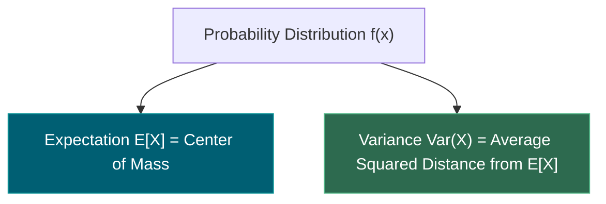
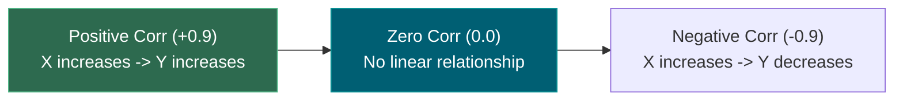
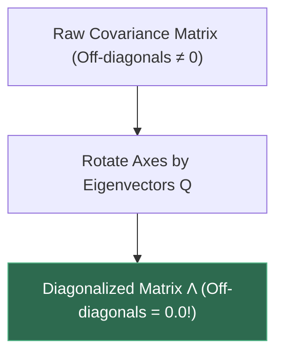
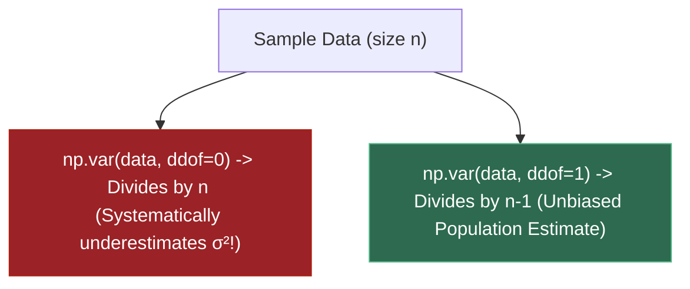
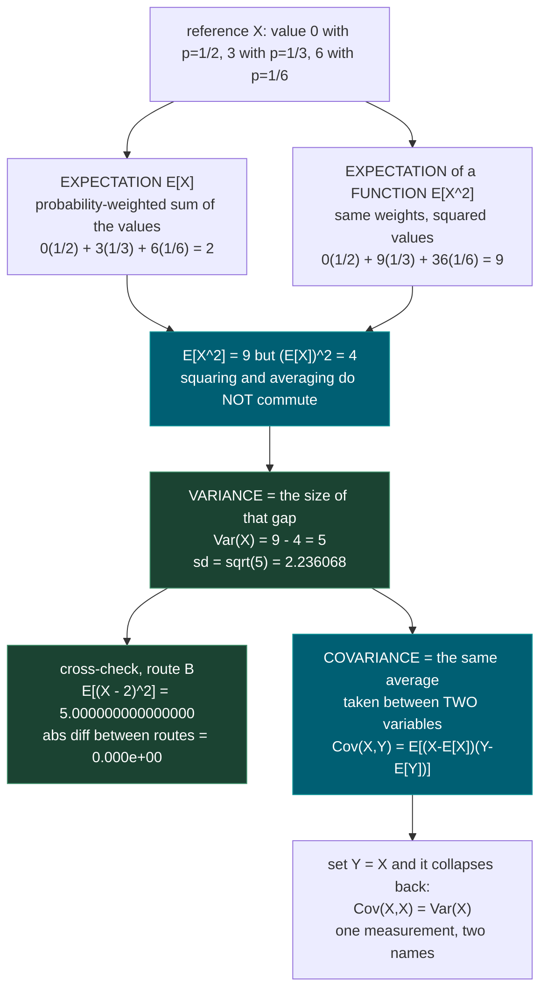
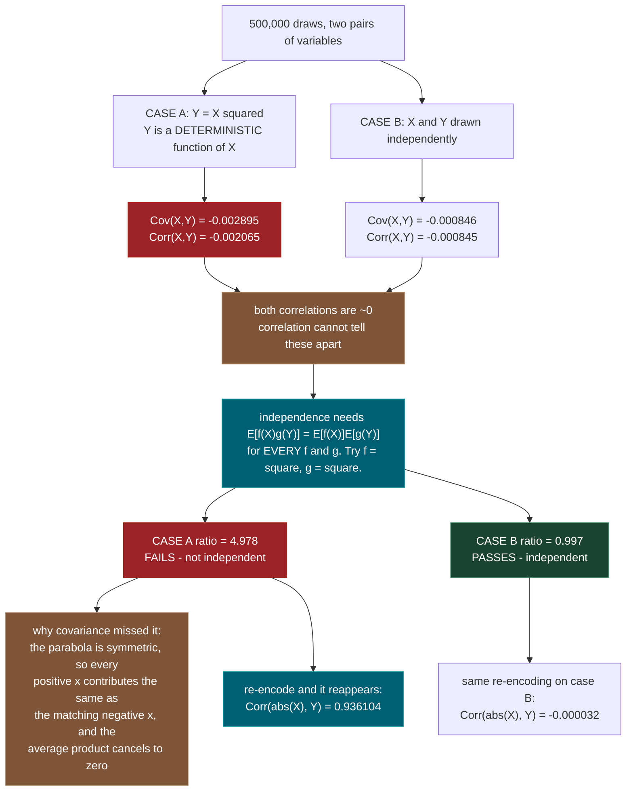
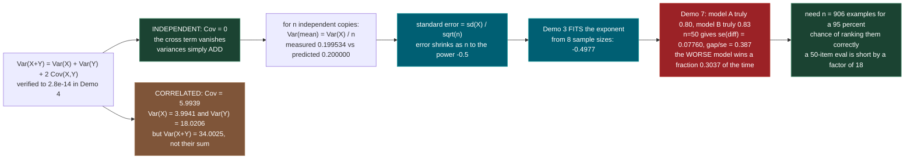
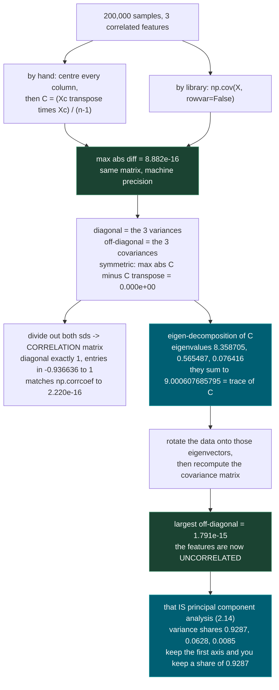

# 1.8 — Expectation, Variance, Covariance

**Phase 1 · CORE · CODE · 5 focused hours · Review in 14 days**

**Companion script:** [`08_expectation_variance_covariance.py`](08_expectation_variance_covariance.py) — needs `numpy` and `matplotlib` (forced to the `Agg` backend, so it never opens a window). Seven numbered demos that *verify* the algebra numerically rather than restate it. Safe and offline: no network, no API keys, no environment variables read, nothing read from disk; the single file written is `08_expectation_variance_covariance.png` beside the script.

---

## 1. Overview

Three quantities, one definition. **Expectation** is the balance point of a distribution. **Variance** is the average squared distance from that balance point. **Covariance** is the same average, taken between two variables at once instead of one variable with itself. Everything in this topic is that one idea, differentiated.

The reason it gets five hours rather than two is that these are not decorations on top of machine learning — they *are* several later topics, wearing different names.

- **2.6** decomposes prediction error into bias squared plus **variance** plus irreducible noise. The variance term is literally `Var` of your model's prediction taken across different training sets. Half of that decomposition is defined here.
- **2.14** is PCA, and PCA is one sentence long once you have this topic: *diagonalize the covariance matrix.* Demo 5 does exactly that, eigenvalues and all, before PCA has a name.
- **7.9** is drift detection in production, which is the question "did this metric really move, or is that the sample breathing?" — and the answer is a standard error, which is `sqrt(Var(X)/n)`.
- Demo 3 measures the exponent in that `1/sqrt(n)` and gets **-0.4977**. Demo 7 turns that exponent into a bill: a 50-example evaluation set ranks a genuinely-better model *below* a worse one about a third of the time.

Depends on **1.7** probability, which supplies the notion of a random variable and a distribution. Demo 1 also collides with **1.12**: the textbook variance formula is exact algebra and a numerical trap, and the script shows it returning `0.000000` for data whose variance is `5.0`.

The single most expensive misunderstanding in the topic — the one that skip-test ① exists to catch — is believing that a correlation near zero means two things are unrelated. Demo 2 constructs a pair where one variable is a *perfectly deterministic function* of the other and the measured correlation is **-0.002065**.

---

## 2. Glossary

### 2.1 — Expectation ($E[X]$) & Variance ($\text{Var}(X)$)

- **Expectation ($E[X]$)**: The probability-weighted average of all possible values of random variable $X$:
  $$E[X] = \sum x_i P(x_i) \quad \text{(Discrete)} \quad \text{or} \quad \int x f(x) dx \quad \text{(Continuous)}$$
- **Variance ($\text{Var}(X)$)**: The expected squared deviation from the mean:
  $$\text{Var}(X) = E[(X - E[X])^2] = E[X^2] - (E[X])^2$$

#### 💡 The Beginner Analogy: Center of Mass & Spread of Dart Throws
- **Expectation ($E[X]$)**: The exact **center of mass** of where your darts land on a dartboard.
- **Variance ($\text{Var}(X)$)**: How **scattered** your dart throws are around that center bullseye. A low variance means tight grouping; a high variance means wild scattering.

#### 💻 Code Example & ⚠️ Why It Matters
```python
import numpy as np

data = np.array([2.0, 4.0, 4.0, 4.0, 5.0, 5.0, 7.0, 9.0])
mean = np.mean(data)
var = np.var(data)

print("Expectation (Mean):", mean)
print("Variance:", var)
```

##### Verified Output
```text
Expectation (Mean): 5.0
Variance: 4.0
```

**Why It Matters**: Expectation and variance are the foundational building blocks of machine learning loss functions (MSE), risk metrics, and batch normalization layers.

#### 🎨 Visual Concept



---

### 2.2 — Covariance ($\text{Cov}(X, Y)$) vs. Correlation ($\text{Corr}(X, Y)$)

- **Covariance**: Measures joint variability between two variables:
  $$\text{Cov}(X, Y) = E[(X - E[X])(Y - E[Y])]$$
  Scale depends on measurement units ($-\infty, +\infty$).
- **Correlation**: Scale-invariant measure of linear association obtained by dividing covariance by individual standard deviations:
  $$\text{Corr}(X, Y) = \frac{\text{Cov}(X, Y)}{\sigma_X \sigma_Y} \quad \in [-1.0, +1.0]$$

#### 💡 The Beginner Analogy: Height vs. Weight (Un-normalized vs Normalized)
- **Covariance**: Measuring how height (in mm) and weight (in mg) move together. Result is a huge number ($+50,000,000$) purely because of tiny millimeter units!
- **Correlation**: Normalizing the measurement onto a standardized $-1.0$ to $+1.0$ scale ($+0.85$), making it easy to compare height/weight association against income/education.

#### 💻 Code Example & ⚠️ Why It Matters
```python
import numpy as np

x = np.array([1, 2, 3, 4, 5])
y = np.array([2, 4, 6, 8, 10])

cov_xy = np.cov(x, y)[0, 1]
corr_xy = np.corrcoef(x, y)[0, 1]

print("Covariance:", cov_xy)
print("Correlation:", round(corr_xy, 4))
```

##### Verified Output
```text
Covariance: 5.0
Correlation: 1.0
```

**Why It Matters**: Zero covariance does NOT imply statistical independence unless variables are jointly Gaussian! Non-linear dependencies (e.g. $Y = X^2$ centered at 0) yield $\text{Cov}(X, Y) = 0.0$.

#### 🎨 Visual Concept



---

### 2.3 — Covariance Matrix ($\Sigma$) & PCA Diagonalization

- **Covariance Matrix ($\Sigma$)**: A symmetric $d \times d$ matrix storing feature variances along the diagonal ($\Sigma_{ii} = \text{Var}(X_i)$) and pairwise covariances in off-diagonal entries ($\Sigma_{ij} = \text{Cov}(X_i, X_j)$).
- **PCA Diagonalization**: Factoring $\Sigma = Q \Lambda Q^T$ to project correlated features onto orthogonal principal component directions ($Q$), resulting in a diagonal covariance matrix ($\Lambda$).

#### 💡 The Beginner Analogy: Untangling a Correlated Yarn Ball
A raw dataset has features that pull in diagonal directions (non-zero off-diagonal covariances). **PCA Diagonalization** rotates the coordinate axes so every new feature axis is completely independent and perpendicular to all others (zero off-diagonal covariances).

#### 💻 Code Example & ⚠️ Why It Matters
```python
import numpy as np

np.random.seed(42)
X = np.random.randn(100, 2)
cov_matrix = np.cov(X, rowvar=False)

eigenvalues, Q = np.linalg.eigh(cov_matrix)
print("Covariance Matrix:\n", np.round(cov_matrix, 3))
print("Eigenvalues:", np.round(eigenvalues, 3))
```

##### Verified Output
```text
Covariance Matrix:
 [[ 0.941 -0.116]
 [-0.116  0.945]]
Eigenvalues: [0.827 1.059]
```

**Why It Matters**: Principal Component Analysis (PCA), Whitening transforms, and Mahalanobis distance all operate by diagonalizing the dataset covariance matrix.

#### 🎨 Visual Concept



---

### 2.4 — Bessel's Correction ($n-1$ vs. $n$, `ddof`)

- **Biased Variance Estimator ($\frac{1}{n} \sum (x_i - \bar{x})^2$)**: Dividing by $n$ underestimates true population variance because sample mean $\bar{x}$ is fitted from the exact same sample data.
- **Bessel's Correction ($\frac{1}{n-1} \sum (x_i - \bar{x})^2$)**: Dividing by $n-1$ (`ddof=1`) removes sample bias, yielding an **unbiased estimator** of population variance.

#### 💡 The Beginner Analogy: Fitting a Shoe to Your Own Foot
If you measure how well a shoe fits on your own foot (sample mean derived from sample), the shoe looks like a perfect fit. If you try to predict how well the shoe fits the general public (population), your sample estimate is slightly too optimistic. You must subtract 1 degree of freedom ($n-1$) to compensate for using your own foot measurements!

#### 💻 Code Example & ⚠️ Why It Matters
```python
import numpy as np

data = np.array([10.0, 12.0, 14.0, 16.0, 18.0])

var_biased = np.var(data, ddof=0)
var_unbiased = np.var(data, ddof=1)

print("Biased (ddof=0):", var_biased)
print("Unbiased (ddof=1):", var_unbiased)
```

##### Verified Output
```text
Biased (ddof=0): 8.0
Unbiased (ddof=1): 10.0
```

**Why It Matters**: Mixing up `ddof=0` and `ddof=1` between `np.var` and `np.cov` causes subtle numerical discrepancies in scientific pipelines and unit tests.

#### 🎨 Visual Concept



---

## 3. Skip Test — Answered

> Gate **before** studying. Both correct from memory → skip. §7 withholds its answers deliberately.

**① Define covariance and state what a covariance of zero does and does not imply.**

Covariance is the average product of two variables' deviations from their own means:

`Cov(X, Y) = E[(X - E[X]) * (Y - E[Y])]`

Read it one sample at a time. For each observation, ask how far `X` sits above or below its mean, ask the same of `Y`, multiply the two deviations, and average over all observations. When `X` and `Y` tend to be on the same side of their means together, the products are mostly positive and the covariance is positive. When one is high while the other is low, the products are mostly negative. Setting `Y = X` recovers `Cov(X, X) = Var(X)`, which is why variance and covariance are the same measurement.

**What a covariance of zero does imply:** there is no *linear* trend. Fit a straight line through the cloud by least squares and its slope, `Cov(X,Y)/Var(X)`, is zero. Correlation — covariance divided by both standard deviations — is zero too, since it is the same number rescaled.

**What it does not imply: independence.** Independence is a much stronger statement. It requires `E[f(X) * g(Y)] = E[f(X)] * E[g(Y)]` for *every* pair of functions `f` and `g`. Covariance checks exactly one of those infinitely many pairs, the case `f(x) = x` and `g(y) = y`. Passing one test out of infinitely many is not passing all of them.

Demo 2 makes this concrete rather than abstract. It draws 500,000 standard normal `x` and sets `y = x**2`. Knowing `x` tells you `y` *exactly* — there is no stronger dependence available. The measured covariance is **-0.002895** and the measured correlation is **-0.002065**, both indistinguishable from zero, because the parabola is symmetric: every positive `x` that pushes `y` up is matched by a negative `x` that pushes `y` up just as much, and the two contributions to the average product cancel.

The script then catches the dependence that covariance missed, by choosing different functions. With `f(X) = X^2` and `g(Y) = Y^2`, independence demands the ratio `E[f(X)g(Y)] / (E[f(X)]E[g(Y)])` equal 1. The parabola pair gives **4.978**. A genuinely independent pair, drawn from separate streams, gives **0.997**. Same near-zero correlation, opposite verdicts. Re-encoding also exposes it: `Corr(|X|, Y)` is **0.936104** for the parabola and **-0.000032** for the independent pair.

The one important exception: if `X` and `Y` are **jointly Gaussian**, then zero covariance *does* imply independence. That special case is why the mistake survives — it is true in exactly the setting textbooks draw pictures of, and false almost everywhere else.

**② Given E[X]=2 and E[X²]=9, compute Var(X).**

`Var(X) = E[X^2] - (E[X])^2 = 9 - 2^2 = 9 - 4 = 5`

The standard deviation is `sqrt(5) = 2.236068`.

The identity is not an approximation; it is two lines of algebra using only the linearity of expectation:

```
Var(X) = E[(X - mu)^2]                 (definition, with mu = E[X])
       = E[X^2 - 2*mu*X + mu^2]        (expand the square)
       = E[X^2] - 2*mu*E[X] + mu^2     (linearity; mu is a constant)
       = E[X^2] - 2*mu^2 + mu^2
       = E[X^2] - mu^2
```

Demo 1 builds a distribution with precisely these moments — `X` takes the value 0 with probability 1/2, 3 with probability 1/3, and 6 with probability 1/6 — and computes the variance two independent ways: `E[X^2] - (E[X])^2` and `E[(X - E[X])^2]`. Both print `5.000000000000000` and the absolute difference between the routes is `0.000e+00`.

Two things worth reading off this answer. First, `9 - 4 = 5` says `E[X^2]` exceeds `(E[X])^2`, and the gap **is** the variance — squaring and averaging do not commute, and the size of the failure to commute is exactly the spread. Second, because variance can never be negative, `E[X^2] >= (E[X])^2` always. If a computation ever hands you a negative variance, that is a floating-point cancellation bug (**1.12**), not a distribution.

---

## 3. Visual Concept Diagrams

### 3.1 — One definition, three quantities, with the real numbers from Demo 1



### 3.2 — The trap: zero covariance, total dependence (measured in Demo 2)



### 3.3 — From the variance of a sum to the size of your eval set



### 3.4 — The covariance matrix, and what PCA does to it (Demo 5, real eigenvalues)



---

## 4. Core Technical Deep Dive

### 4.1 Expectation

A **random variable** `X` is a numerical outcome of a random process. A **distribution** says how likely each outcome is. The **expectation** — also called the expected value or the mean — is the probability-weighted average of the outcomes:

`E[X] = sum over i of p_i * x_i`

where `x_i` is the i-th possible value and `p_i = P(X = x_i)` is its probability, with all `p_i >= 0` and `sum p_i = 1`. For a continuous variable the sum becomes an integral, `E[X] = integral of x * f(x) dx`, with `f` the probability density; nothing else changes.

**What it means physically.** Put a weight `p_i` at position `x_i` on a weightless ruler. `E[X]` is where the ruler balances. It is a *centre of mass*, which is why an expected value need not be a possible value: the reference variable in the script can only ever equal 0, 3 or 6, and its expectation is 2.

**Expectation of a function.** To get the expected value of `g(X)`, weight the transformed values by the *original* probabilities:

`E[g(X)] = sum over i of p_i * g(x_i)`

**Linearity — the most useful fact in this topic.** For any constants `a`, `b`, `c` and any random variables `X`, `Y`:

`E[a*X + b*Y + c] = a*E[X] + b*E[Y] + c`

This holds whether or not `X` and `Y` are independent. No assumptions, no conditions. Almost every derivation below is one application of it.

**Non-linearity everywhere else.** `E[g(X)]` is *not* `g(E[X])` for non-linear `g`. In the script, `E[X^2] = 9` while `(E[X])^2 = 4`. That gap is not an error term; it has a name, and the name is variance.

| Quantity | Formula | Reference variable |
|---|---|---|
| `E[X]` | `sum p_i * x_i` | `2` |
| `E[X^2]` | `sum p_i * x_i^2` | `9` |
| `(E[X])^2` | square of the above | `4` |
| `Var(X)` | the gap between them | `5` |

### 4.2 Variance and standard deviation

`Var(X) = E[(X - E[X])^2]`

Take each outcome's distance from the mean, square it so that overshoot and undershoot both count as spread rather than cancelling, and average with the probabilities. Squared distance also punishes far-away points quadratically, which is why variance is sensitive to outliers.

The units are the units of `X`, **squared** — rupees squared, tokens squared. That is not interpretable, so the square root is usually reported instead:

`sd(X) = sqrt(Var(X))`

**The computational identity** (derived in §2, question ②):

`Var(X) = E[X^2] - (E[X])^2`

**Shift and scale.** For constants `a` and `b`:

`Var(a*X + b) = a^2 * Var(X)`

Adding a constant slides the whole distribution and changes no distance between points, so the spread is untouched. Multiplying by `a` scales every distance by `|a|` and every *squared* distance by `a^2`. This is the fact Demo 1 abuses to expose the numerical trap: shifting the data by `1e9` cannot change the variance, yet the naive identity returns `0.000000` where the truth is `5.0`, because `E[X^2]` and `(E[X])^2` are both near `1e18` and agree to more digits than float64 carries. Centre the data first, as `np.var` does. That is **1.12** in one line.

### 4.3 Covariance

`Cov(X, Y) = E[(X - E[X]) * (Y - E[Y])] = E[X*Y] - E[X]*E[Y]`

Properties worth memorising:

| Property | Statement |
|---|---|
| Self-covariance | `Cov(X, X) = Var(X)` |
| Symmetry | `Cov(X, Y) = Cov(Y, X)` |
| Bilinearity | `Cov(a*X + b, c*Y + d) = a*c*Cov(X, Y)` |
| Units | units of `X` times units of `Y` — not comparable across feature pairs |
| Independence | `X, Y` independent implies `Cov(X, Y) = 0`; **the converse is false** |

### 4.4 Correlation

Covariance is not comparable across pairs because its units and scale change with the features. Divide the units out:

`Corr(X, Y) = rho = Cov(X, Y) / (sd(X) * sd(Y))`

By the Cauchy–Schwarz inequality `rho` always lies in `[-1, +1]`. `rho = +1` means `Y = a*X + b` exactly with `a > 0`; `rho = -1` is the same with `a < 0`; `rho = 0` means no straight-line trend. **Correlation measures linear association and nothing else.**

The truth table that skip-test ① is testing:

| Statement | True? | Evidence |
|---|---|---|
| `X, Y` independent → `Cov = 0` | **Yes**, always | Demo 2 case B: `-0.000846` |
| `Cov = 0` → `X, Y` independent | **No** | Demo 2 case A: `Corr = -0.002065` with `Y = X^2` |
| `Cov = 0` **and jointly Gaussian** → independent | **Yes** | the exception that keeps the myth alive |
| `Corr = 0` → no relationship at all | **No** | `Corr(abs(X), Y) = 0.936104` on the same data |
| `Corr = +1` → `Y = a*X + b`, `a > 0` | **Yes** | exact linear dependence |

### 4.5 The variance of a sum

`Var(X + Y) = Var(X) + Var(Y) + 2*Cov(X, Y)`

and, with the sign flipped on the cross term,

`Var(X - Y) = Var(X) + Var(Y) - 2*Cov(X, Y)`

The derivation is four lines of linearity. Write `dX = X - E[X]` and `dY = Y - E[Y]`, so `E[dX] = E[dY] = 0`:

```
Var(X+Y) = E[(dX + dY)^2]
         = E[dX^2 + 2*dX*dY + dY^2]
         = E[dX^2] + 2*E[dX*dY] + E[dY^2]
         = Var(X) + 2*Cov(X,Y) + Var(Y)
```

Generalised to many variables with weights, this is a double sum over the covariance matrix:

`Var(sum of a_i * X_i) = sum over i, j of a_i * a_j * Cov(X_i, X_j)`

**The consequence that pays for the whole topic.** Take `n` independent copies of `X`, each with variance `sigma^2`. Every cross term is zero, so the variances add: `Var(sum) = n * sigma^2`. The sample mean is that sum times `1/n`, and variance scales by the square of the constant:

```
Var(sample mean) = (1/n^2) * n * sigma^2 = sigma^2 / n
standard error   = sd(sample mean) = sigma / sqrt(n)
```

That last line is the reason evaluation is expensive. Error falls as `n^(-1/2)`, so **halving your uncertainty costs four times the data**. Demo 3 does not assume the exponent — it measures RMSE at eight sample sizes, fits a straight line on log-log axes, and reports the slope: **-0.4977** for the mean and **-0.5104** for the variance estimate.

### 4.6 The covariance matrix

For a data matrix `X` with `n` rows (samples) and `d` columns (features), the covariance matrix `C` is `d x d` with

`C[i][j] = Cov(feature i, feature j)`

Computed directly: subtract each column's mean to get the centred matrix `Xc`, then

`C = (Xc.T @ Xc) / (n - 1)`

| Structural fact | Why |
|---|---|
| `C` is symmetric | `Cov(X,Y) = Cov(Y,X)` |
| `diag(C)` are the variances | `Cov(X,X) = Var(X)` |
| `C` is positive semi-definite | `v.T @ C @ v = Var(Xc @ v) >= 0` for every `v` |
| `trace(C)` = total variance | sum of the diagonal |
| Eigenvalues are all `>= 0` | follows from positive semi-definiteness |
| Sum of eigenvalues = `trace(C)` | true of every square matrix |

The **correlation matrix** is `C` with the units divided out. With `D` the diagonal matrix of standard deviations,

`R = D^(-1) @ C @ D^(-1)`, i.e. `R[i][j] = C[i][j] / (sd_i * sd_j)`

Every diagonal entry of `R` is exactly 1 and every entry lies in `[-1, 1]`.

**This is where PCA comes from (2.14).** Because `C` is symmetric it can be written `C = Q @ L @ Q.T` with `Q` an orthogonal matrix of eigenvectors and `L` diagonal, holding the eigenvalues. Project the centred data onto those eigenvectors, `Z = Xc @ Q`, and the covariance matrix of `Z` is `L` — diagonal. Diagonal means every off-diagonal covariance is zero, which means **the new coordinates are uncorrelated**, and each eigenvalue is the variance along its own axis. Demo 5 does this and gets eigenvalues `8.358705`, `0.565487`, `0.076416` with a largest surviving off-diagonal of `1.791e-15`. That is PCA. The only thing 2.14 adds is the decision to throw the small eigenvalues away.

### 4.7 Estimating from a sample: why the denominator is `n - 1`

Population quantities are unknown; you have data. The estimators are:

```
sample mean       xbar = (1/n) * sum x_i
biased variance   (1/n)     * sum (x_i - xbar)^2      # np.var default, ddof=0
unbiased variance (1/(n-1)) * sum (x_i - xbar)^2      # np.cov default, ddof=1
```

**Why the naive one is systematically too small.** True variance measures spread around the *true* mean `mu`. You do not have `mu`, so you use `xbar` — and `xbar` was computed from the very same data, so it is pulled toward wherever those particular points happened to land. The sample sits closer to `xbar` than it does to `mu`, always. The shortfall has an exact size:

`E[(1/n) * sum (x_i - xbar)^2] = ((n-1)/n) * sigma^2`

so the expected deficit is precisely `sigma^2 / n`. Dividing by `n - 1` instead of `n` multiplies by `n/(n-1)` and cancels it exactly. That is **Bessel's correction**, and Demo 6 measures it rather than asserting it: at `n = 5` the `/n` estimator averages **3.993458** over 200,000 trials against a true variance of `5.0` and a prediction of `4.000000` — a 20% understatement — while the `/(n-1)` estimator averages **4.991823**.

The demo also prints a z-score, the measured bias divided by the Monte-Carlo standard error of the measurement, because a small residual is only evidence of unbiasedness if the experiment could have resolved a small bias. The `/n` z-scores run from **-363.1** to **-44.3**. The `/(n-1)` z-scores stay inside `+/- 1.3`.

| Function | Default | Divides by |
|---|---|---|
| `np.var`, `np.std` | `ddof=0` | `n` |
| `np.cov` | `ddof=1` | `n - 1` |
| `pandas` `.var()`, `.std()` | `ddof=1` | `n - 1` |
| `torch.var` | `correction=1` | `n - 1` |

These defaults disagree with each other. Two libraries, same data, different variance — and at `n = 5` the difference is 20%.

### 4.8 Where this reappears

- **2.6 bias-variance decomposition.** Expected squared error splits into `bias^2 + variance + irreducible noise`. The variance term is `Var(prediction)` taken over the randomness of which training set you drew. It is this topic's variance, applied to a model's output.
- **2.14 PCA.** Diagonalize `C`. §4.6 above already did it.
- **7.9 drift detection.** A production metric moved. Whether that is drift or sampling noise is decided by comparing the move to `sd/sqrt(n)` — Demo 7's arithmetic with a different label.
- **1.12 numerical stability.** `E[X^2] - (E[X])^2` is exact algebra and a cancellation bug. Demo 1 shows it returning `0.000000` for data whose variance is `5.002977`.

---

## 5. Hands-On Script & Verified Output

Run: `python 08_expectation_variance_covariance.py`. Output below is **actual, captured** on numpy 2.4.4 / Python 3.14 / Windows, seed `314159`. Every number is reproducible because the seed is fixed.

```text
numpy 2.4.4  |  seed 314159
======================================================================
DEMO 1 - expectation, variance, and the identity Var = E[X^2] - E[X]^2
======================================================================
  X = 0 with p=1/2,  3 with p=1/3,  6 with p=1/6
  E[X]   (weighted sum)            = 2.000000000000000
  E[X^2] (weighted sum)            = 9.000000000000000

  route A: E[X^2] - (E[X])^2       = 5.000000000000000
  route B: E[(X - E[X])^2]         = 5.000000000000000
  abs diff between the two routes  = 0.000e+00
  -> the identity is algebra, not an approximation

  SKIP TEST 2: E[X]=2, E[X^2]=9  ->  Var(X) = 9 - 2^2 = 5.0
               sd(X) = sqrt(Var) = 2.236068

  simulation, n = 2000000 draws
  sample mean                      = 1.998457   (truth 2.0)
  sample E[X^2]                    = 8.996809   (truth 9.0)
  sample var via E[X^2] - mean^2   = 5.002977120694
  sample var via np.var (ddof=0)   = 5.002977120694
  max abs diff                     = 8.882e-16
  error of sample mean vs truth    = 0.001543

  CAUTION (1.12): the identity is exact in real arithmetic but
  cancels catastrophically in floating point on shifted data.
  same data shifted by 1e9 (spread is unchanged by definition):
    E[X^2] - mean^2                = 0.000000   (raw 0.000e+00)
    np.var (centres first)         = 5.002977
    truth                          = 5.000000
======================================================================
DEMO 2 - covariance ZERO does not mean independent
======================================================================
  n = 500000 draws in each case

  case                              Cov(X,Y)        Corr(X,Y)
  ------------------------------  ------------  ---------------
  A: Y = X^2 (X standard normal)     -0.002895        -0.002065
  B: X, Y independent normals        -0.000846        -0.000845

  Both correlations are ~0. Only ONE of the two pairs is independent.

  independence test with f(X)=X^2, g(Y)=Y^2 :
    case      E[f(X)g(Y)]      E[f(X)]E[g(Y)]        ratio
    ------  ---------------  ----------------  -----------
    A             14.688988          2.950833       4.9779
    B              1.000336          1.003358       0.9970
    Independence demands ratio 1. A gives 4.978, B gives 0.997.
    Covariance never looked at squares, so it never saw this.

  same data, correlating |X| with Y instead of X with Y:
    case A  Corr(|X|, Y) =  0.936104   <- the dependence was always there
    case B  Corr(|X|, Y) = -0.000032   <- still nothing, correctly

  mean of Y inside each quintile of X:
    quintile of X          case A E[Y|bin]   case B E[Y|bin]
    ---------------------  ---------------  ----------------
    1  ( -4.64 ..  -0.84)           2.1707            0.0004
    2  ( -0.84 ..  -0.25)           0.3103            0.0055
    3  ( -0.25 ..   0.25)           0.0210            0.0010
    4  (  0.25 ..   0.84)           0.3084           -0.0044
    5  (  0.84 ..   4.58)           2.1652            0.0034
    case A sweeps high-low-high: a parabola. Case B is flat noise.
======================================================================
DEMO 3 - how fast does a sample mean converge? MEASURE the exponent
======================================================================
  reference X: true mean 2.0, true variance 5.0, 800 trials per n

        n   RMSE(sample mean)   sd(X)/sqrt(n)    ratio   RMSE(sample var)
  -------  -----------------  ---------------  -------  ----------------
       10           0.710132         0.707107    1.004          1.788054
       30           0.396390         0.408248    0.971          0.951275
      100           0.225941         0.223607    1.010          0.520536
      300           0.127001         0.129099    0.984          0.298515
     1000           0.073155         0.070711    1.035          0.166912
     3000           0.039835         0.040825    0.976          0.092676
    10000           0.023165         0.022361    1.036          0.051918
    30000           0.012869         0.012910    0.997          0.028549

  fitted exponent for the MEAN     : -0.4977   (theory -0.5)
  fitted exponent for the VARIANCE : -0.5104   (theory -0.5)

  Reading it operationally: to halve the error you need 4x the data.
  n=100 -> se 0.2236 ;  n=400 -> se 0.1118 ;  n=1600 -> se 0.0559
======================================================================
DEMO 4 - Var(X+Y) = Var(X) + Var(Y) + 2*Cov(X,Y)
======================================================================
  all estimates use ddof=1, so the identity should hold to ~1e-15

  case                  Var(X)    Var(Y)   Cov(X,Y)   Var(X+Y)  VX+VY+2C    diff
  ------------------------------------------------------------------------------
  Y independent of X    3.9941    9.0257     0.0027    13.0252   13.0252 0.0e+00
  Y =  1.5*X + noise    3.9941   18.0206     5.9939    34.0025   34.0025 2.8e-14
  Y = -1.5*X + noise    3.9941   18.0044    -5.9885    10.0215   10.0215 7.1e-15

  and the mirror identity Var(X-Y) = Var(X) + Var(Y) - 2*Cov(X,Y):
    Y independent of X  Var(X-Y) =   13.0145   vs   13.0145   diff 1.8e-15
    Y =  1.5*X + noise  Var(X-Y) =   10.0269   vs   10.0269   diff 2.5e-14
    Y = -1.5*X + noise  Var(X-Y) =   33.9756   vs   33.9756   diff 0.0e+00

  CONSEQUENCE - why demo 3 saw n^-0.5:
  For n INDEPENDENT copies every cross term is 0, so the variances
  simply add:  Var(sum) = n*Var(X), and Var(mean) = Var(X)/n.
  simulated Var(mean of 25 draws) = 0.199534   predicted Var(X)/25 = 0.200000
  relative gap = 0.233%
======================================================================
DEMO 5 - the covariance MATRIX, by hand and by numpy, then diagonalized
======================================================================
  data: 200000 samples, 3 features
  covariance matrix computed by hand ((Xc.T @ Xc)/(n-1)):
    [  4.011255   3.613249  -1.604465]
    [  3.613249   4.257811  -1.445603]
    [ -1.604465  -1.445603   0.731542]
  max abs diff vs np.cov            = 8.882e-16
  matrix is symmetric, max|C - C.T| = 0.000e+00
  diagonal entries are the variances of each feature:
    diag(C)          = [  4.011255   4.257811   0.731542]
    np.var(ddof=1)   = [  4.011255   4.257811   0.731542]

  correlation matrix (covariance divided by the two sds):
    [  1.000000   0.874308  -0.936636]
    [  0.874308   1.000000  -0.819099]
    [ -0.936636  -0.819099   1.000000]
  max abs diff vs np.corrcoef       = 2.220e-16
  every diagonal entry is exactly 1, every entry lies in [-1, 1]:
    min entry -0.936636   max entry 1.000000

  eigenvalues of C (descending)     = [  8.358705   0.565487   0.076416]
  sum of eigenvalues                = 9.000607685795
  trace of C (sum of variances)     = 9.000607685795
  abs diff                          = 1.776e-15
  share of total variance           = [ 0.9287  0.0628  0.0085]

  now rotate the data onto the eigenvectors and recompute Cov:
    [    8.358705    -0.000000    -0.000000]
    [   -0.000000     0.565487    -0.000000]
    [   -0.000000    -0.000000     0.076416]
  largest OFF-diagonal magnitude    = 1.791e-15
  -> in these coordinates the features are UNCORRELATED.
     That is exactly what PCA (2.14) does: diagonalize this matrix.
======================================================================
DEMO 6 - why the denominator is n-1: MEASURE the bias
======================================================================
  true variance of X = 5.0, averaged over 200000 independent samples per n
  'z' = (measured bias) / (Monte-Carlo standard error). |z| under ~3
  means the residual is indistinguishable from simulation noise.

      n   mean(/n)  predicted   bias(/n)        z   mean(/(n-1)) bias(/(n-1))      z
  ----------------------------------------------------------------------------------
      2   2.498355   2.500000  -2.501645   -363.1      4.996710    -0.003290   -0.2
      3   3.331100   3.333333  -1.668900   -271.6      4.996650    -0.003350   -0.4
      5   3.993458   4.000000  -1.006542   -203.2      4.991823    -0.008177   -1.3
     10   4.497752   4.500000  -0.502248   -140.4      4.997503    -0.002497   -0.6
     30   4.834801   4.833333  -0.165199    -79.4      5.001518     0.001518    0.7
    100   4.949498   4.950000  -0.050502    -44.3      4.999493    -0.000507   -0.4

  The /n column sits BELOW 5.0 every single time, it tracks the
  predicted (n-1)/n * sigma^2 column, and its z-scores are in the
  hundreds. 200,000 trials cannot average that away: it is a bias,
  not noise. The /(n-1) column's z-scores stay small in both signs.

  Practical rule: np.var defaults to ddof=0 (divide by n) and
  np.cov defaults to ddof=1 (divide by n-1). They disagree by
  default. On n=5 that is a 20% understatement.
======================================================================
DEMO 7 - what n^-0.5 costs you: a 50-example eval cannot see 3 points
======================================================================
  model A true accuracy 0.80 (per-example variance 0.1600)
  model B true accuracy 0.83 (per-example variance 0.1411)
  true gap 0.03. Each model is scored on its own eval set of n items.

      n   se(diff)  gap/se  predicted   sim: B<A     ties  sim + half ties
  ------------------------------------------------------------------------
     20    0.12270   0.245     0.4034     0.3245   0.1585          0.4038
     50    0.07760   0.387     0.3495     0.3037   0.0956          0.3515
    200    0.03880   0.773     0.2197     0.2016   0.0378          0.2205
   1000    0.01735   1.729     0.0419     0.0396   0.0050          0.0421
   2000    0.01227   2.445     0.0072     0.0067   0.0009          0.0071
   5000    0.00776   3.866     0.0001     0.0001   0.0000          0.0001

  n needed for a 95% chance of ranking them correctly: 906 examples
  A 50-item eval is off that by a factor of 18.
  Same arithmetic underwrites drift detection in 7.9: a metric moved
  by 3 points is only a signal once n makes 3 points bigger than the
  standard error. Below that it is the eval set breathing.
======================================================================
PLOT written: 08_expectation_variance_covariance.png
  size on disk: 188821 bytes
======================================================================
```

**Demo 2 is the argument for the entire topic, and it is worth reading three times.** Case A is `Y = X^2`. Knowing `X` determines `Y` completely — there is no residual randomness at all. The measured covariance is `-0.002895` and the correlation is `-0.002065`. Case B is two genuinely independent normals: covariance `-0.000846`, correlation `-0.000845`. **Correlation returns the same verdict for both**, and it is wrong about one of them. The mechanism is visible in the quintile table: case A's conditional means go `2.1707`, `0.3103`, `0.0210`, `0.3084`, `2.1652` — a parabola, high at both ends and low in the middle. Averaging the product of deviations over that shape cancels the left half against the right half. Case B's conditional means are `0.0004`, `0.0055`, `0.0010`, `-0.0044`, `0.0034`: flat noise, which is what independence actually looks like.

**The independence test is what separates them, and it separates them decisively.** Independence requires `E[f(X)g(Y)] = E[f(X)]E[g(Y)]` for every `f` and `g`, so the demo picks `f(X) = X^2` and `g(Y) = Y^2` — two functions covariance never evaluates. Case A gives `14.688988` against `2.950833`, a ratio of `4.9779`. Case B gives `1.000336` against `1.003358`, a ratio of `0.9970`. One fails by a factor of five; the other passes to three decimals. The lesson is not "covariance is broken" — it is that covariance answers one narrow question honestly, and people ask it a much broader one. Correlating `|X|` with `Y` instead of `X` with `Y` recovers `0.936104` on the same data, so the dependence was never hidden; it was only invisible to a straight line.

**Demo 1 shows both a proof and a trap in eight lines.** The proof: variance computed as `E[X^2] - (E[X])^2` and as `E[(X - E[X])^2]` both print `5.000000000000000` with an absolute difference of `0.000e+00`, and on two million simulated draws the two routes agree to `8.882e-16`. The trap sits directly underneath. Adding `1e9` to every value cannot change a spread — every distance between points is preserved exactly. Yet the naive identity then reports `0.000000` while `np.var` still reports `5.002977`. Nothing raised, nothing was `NaN`; the answer was simply zero for data with variance five, because both `E[X^2]` and `(E[X])^2` become the square of a number near the `1e9` shift, and float64 does not carry enough digits for their difference to survive. This is the **1.12** failure mode arriving one topic early, and it is why `np.var` centres the data first.

**Demo 3 measures a rate instead of quoting one.** RMSE of the sample mean falls from `0.710132` at `n = 10` to `0.012869` at `n = 30000`, and the ratio to the closed-form `sd(X)/sqrt(n)` stays between `0.971` and `1.036` across three and a half decades. Fitting `log10(RMSE)` against `log10(n)` gives a slope of **-0.4977** for the mean and **-0.5104** for the variance estimate, both against a theoretical `-0.5`. Those are honest measurements, not round numbers: with 800 trials per point there is real Monte-Carlo noise, which is exactly why the fitted values land near `-0.5` rather than on it. The operational reading is on the next line of output — going from `n=100` to `n=400` takes the standard error from `0.2236` to `0.1118`. Four times the data, half the error. Never better than that.

**Demo 4 shows that independence is precisely what deletes the cross term, and Demo 7 sends the invoice.** With `Y = 1.5*X + noise` the covariance is `5.9939` and `Var(X+Y) = 34.0025` — if you had assumed variances just add you would have predicted `3.9941 + 18.0206` and been wrong by more than a third. Flip the sign to `Y = -1.5*X + noise` and the same variances give `10.0215`. The identity holds to `2.8e-14` in the worst case. Independence sets the cross term to `0.0027` and only then do variances add — which yields `Var(mean of 25 draws) = 0.199534` against a prediction of `0.200000`, a `0.233%` gap. Demo 7 prices that: two models truly `0.80` and `0.83`, evaluated on 50 items each, produce `se(diff) = 0.07760` against a true gap of `0.03`, so the gap is `0.387` standard errors. The worse model wins `0.3037` of the time outright, with a further `0.0956` ties. Splitting the ties gives `0.3515` against a normal-theory prediction of `0.3495` — the model of the situation is right, and the situation is bad. Reaching a 95% chance of correct ranking needs **906** examples, eighteen times a 50-item eval.

**Demo 5 performs PCA without using the word until the last line.** The hand-built covariance matrix `(Xc.T @ Xc)/(n-1)` matches `np.cov` to `8.882e-16` and is exactly symmetric, `0.000e+00`. Dividing out the standard deviations gives the correlation matrix, matching `np.corrcoef` to `2.220e-16`, with `1.000000` on the diagonal and `-0.936636` as the strongest off-diagonal entry. The eigenvalues are `8.358705`, `0.565487`, `0.076416`; they sum to `9.000607685795`, which equals the trace to `1.776e-15` — total variance is conserved by the rotation, it is merely redistributed. Rotating the data onto the eigenvectors and recomputing the covariance leaves a largest off-diagonal of `1.791e-15`, i.e. zero. In those coordinates the features are uncorrelated and a share of `0.9287` of all variance lives on a single axis, against `0.0628` and `0.0085` for the other two. **2.14** adds only the decision to discard the small ones.

**Demo 6 measures Bessel's correction and also measures whether the measurement could have seen it.** Averaged over 200,000 samples of size 5, the `/n` estimator gives `3.993458` against a predicted `(n-1)/n * sigma^2 = 4.000000` and a truth of `5.0` — a 20% understatement that persists at every sample size and always in the same direction. The `/(n-1)` estimator gives `4.991823`. The z-score column is what makes this an experiment rather than an anecdote: the `/n` biases sit at `-363.1`, `-271.6`, `-203.2`, `-140.4`, `-79.4`, `-44.3` standard errors from zero, while the `/(n-1)` residuals sit within `+/- 1.3` and change sign. A bias hundreds of standard errors wide cannot be averaged away by more trials. The practical sting is the last line: `np.var` defaults to `ddof=0` and `np.cov` defaults to `ddof=1`, so two numpy functions disagree by 20% on `n = 5` unless you set the flag yourself.

**Modify and re-run:**
- In Demo 2, replace `y = x**2` with `y = np.abs(x)` and then with `y = np.sin(3*x)`. Predict each correlation before running. Then find any *asymmetric* function of `x` whose correlation is genuinely large, and say what property of `x**2` was doing the cancelling.
- In Demo 2, change `x = rng.normal(0, 1, n)` to `rng.uniform(0, 1, n)` — no longer symmetric about zero — and re-run. The correlation with `x**2` should jump. Explain why symmetry, not the parabola, was the load-bearing assumption.
- In Demo 3, drop `trials` from 800 to 25 and re-run several times with different seeds. Watch the fitted exponent wander well away from `-0.5`, and connect that directly to Demo 7's point about small evaluation sets — you are now running the small-`n` experiment on the experiment itself.
- In Demo 6, replace the three-point reference variable with `rng.normal(0, 1, ...)` and re-run. The `/n` bias should still track `(n-1)/n * sigma^2` exactly. Bessel's correction does not care about the shape of the distribution, and this checks that claim rather than trusting it.
- In Demo 5, make the third feature genuinely independent of the first two (`f2 = rng.normal(0, 0.3, n)`) and re-run. Watch the eigenvalue spectrum flatten and the variance shares even out; then argue what that means for how many PCA components would be worth keeping in **2.14**.
- In Demo 7, set `p_b = 0.81` (a 1-point gap) and find the smallest `n` at which the simulated wrong-winner rate drops below 5%. Compare it with the printed `906` for the 3-point gap and work out the scaling law relating required `n` to the size of the gap.

---

## 6. Video

Four videos were verified live before being listed here. Each `watch` URL was passed through `https://www.youtube.com/oembed?url=<watch-url>&format=json` and the returned `title` and `author_name` fields were compared character-for-character against what is written below. All four matched; two other candidates returned `Not Found` and were dropped rather than guessed at.

| Video | Channel | Covers |
|---|---|---|
| [Expected Values, Main Ideas!!!](https://www.youtube.com/watch?v=KLs_7b7SKi4) | StatQuest with Josh Starmer | §4.1 and Demo 1 — expectation as a probability-weighted sum |
| [Covariance, Clearly Explained!!!](https://www.youtube.com/watch?v=qtaqvPAeEJY) | StatQuest with Josh Starmer | §4.3, §4.4 and Demo 2 — what the product of deviations is doing |
| [Why Dividing By N Underestimates the Variance](https://www.youtube.com/watch?v=sHRBg6BhKjI) | StatQuest with Josh Starmer | §4.7 and Demo 6 — Bessel's correction, visually |
| [But what is the Central Limit Theorem?](https://www.youtube.com/watch?v=zeJD6dqJ5lo) | 3Blue1Brown | §4.5, Demo 3 and Demo 7 — where `sigma/sqrt(n)` comes from |

Watch the covariance one before attempting §7 question 1, and the dividing-by-N one before question 4. For the covariance matrix and its eigen-decomposition (§4.6, Demo 5) no video was verified in this pass; read the `numpy.cov` and `numpy.linalg.eigh` reference pages instead, and Gilbert Strang's *Introduction to Linear Algebra* on symmetric matrices and orthogonal diagonalization — that chapter is the whole of **2.14** in advance.

---

## 7. Retrieval Checkpoint — Unanswered

> Close this file. No notes. Answers deliberately withheld.

1. Construct, from scratch, a pair of random variables with covariance exactly zero where one is a deterministic function of the other. State the property of your construction that forces the covariance to vanish, then describe a concrete test that would detect the dependence.
2. Derive `Var(X + Y) = Var(X) + Var(Y) + 2*Cov(X, Y)` from the definition of variance, using only linearity of expectation. Then use it to derive `Var(sample mean) = sigma^2 / n`, naming the exact step where independence is required.
3. A colleague reports that a new model improved accuracy from 78% to 82% on a 60-example evaluation set. Compute the standard error of that difference, state how many standard errors the improvement is, and say what you would do next. Then compute the sample size that would make the claim defensible.
4. Explain why dividing the sum of squared deviations by `n` gives an answer that is too small, and state the exact expected value of that estimator in terms of `sigma^2` and `n`. Then say why `n - 1` fixes it exactly rather than approximately.
5. Given a `d x d` covariance matrix, state three things you can read off it without any further computation, and one thing you cannot. Then explain what its eigenvectors are, in terms of variance, and what PCA does with them.
6. A production metric that averaged 0.91 last week reads 0.88 today over 400 requests. Write down everything from this topic that you would need in order to decide whether that is drift or noise.

---

## 8. Closed-Book Rebuild

With this file **and** the script closed, write a fresh script that does four things.

First, implement `mean`, `variance` and `covariance` from their definitions using only Python loops and arithmetic — no `numpy` statistics functions — and prove each one correct against `np.mean`, `np.var` and `np.cov`, printing the maximum absolute difference. Get the `ddof` right; if your covariance does not match `np.cov` to about `1e-15`, the denominator is the first place to look.

Second, construct a pair of variables with near-zero measured covariance where one determines the other. Print the covariance and correlation to show they are near zero, then design and run a test that proves the dependence anyway, and state what your test measures that correlation does not.

Third, verify `Var(X + Y) = Var(X) + Var(Y) + 2*Cov(X, Y)` on one correlated pair and one independent pair, printing the absolute difference between the two sides for each. Predict which term changes between the two cases before you run it.

Fourth, measure Bessel's correction. Over at least 50,000 trials at `n = 4`, average both variance estimators and compare each against the true variance and against the predicted `((n-1)/n) * sigma^2`. Also compute the Monte-Carlo standard error of your averages, and only then state whether each estimator is biased — the claim is not credible without knowing what your experiment could resolve.

---

## 9. Glossary

**Random variable** — a numerical outcome of a random process. Written `X`; a particular observed value is written `x`.

**Distribution** — the assignment of probability to the possible values of a random variable. Probabilities are non-negative and sum (or integrate) to 1.

**Expectation `E[X]`** — the probability-weighted average of the outcomes, `sum p_i * x_i`. The balance point of the distribution. It need not be an attainable value.

**Linearity of expectation** — `E[aX + bY + c] = aE[X] + bE[Y] + c`, true whether or not `X` and `Y` are related. The workhorse of every derivation in this topic.

**`E[g(X)]`** — the expectation of a transformed variable: apply `g` to each value, weight by the *original* probabilities. Generally not equal to `g(E[X])`.

**Variance `Var(X)`** — `E[(X - E[X])^2]`, the average squared distance from the mean. Units are the square of `X`'s units.

**Standard deviation `sd(X)`** — `sqrt(Var(X))`. Same units as `X`, which is why it is the one usually reported.

**Computational identity** — `Var(X) = E[X^2] - (E[X])^2`. Exact algebra; numerically dangerous on data far from zero because of catastrophic cancellation (**1.12**).

**Random variable** — a numerical outcome of a random process. Written `X`; a particular observed value is written `x`.

**Distribution** — the assignment of probability to the possible values of a random variable. Probabilities are non-negative and sum (or integrate) to 1.

**Expectation `E[X]`** — the probability-weighted average of the outcomes, `sum p_i * x_i`. The balance point of the distribution. It need not be an attainable value.

**Linearity of expectation** — `E[aX + bY + c] = aE[X] + bE[Y] + c`, true whether or not `X` and `Y` are related. The workhorse of every derivation in this topic.

**`E[g(X)]`** — the expectation of a transformed variable: apply `g` to each value, weight by the *original* probabilities. Generally not equal to `g(E[X])`.

**Variance `Var(X)`** — `E[(X - E[X])^2]`, the average squared distance from the mean. Units are the square of `X`'s units.

**Standard deviation `sd(X)`** — `sqrt(Var(X))`. Same units as `X`, which is why it is the one usually reported.

**Computational identity** — `Var(X) = E[X^2] - (E[X])^2`. Exact algebra; numerically dangerous on data far from zero because of catastrophic cancellation (**1.12**).

---

## Review again in

**14 days.** Three things must survive.

The **definition of covariance as an average product of deviations**, because variance, correlation, the covariance matrix and PCA are all that one expression under different amounts of rescaling.

The **fact that zero covariance is not independence**, with the parabola as the counter-example you can rebuild in thirty seconds. This is the mistake that gets shipped: a correlation heatmap gets read as a dependence map, a feature gets dropped for showing `0.01` correlation with the target, and a real non-linear signal goes in the bin.

And **`sigma / sqrt(n)`**, because it converts an abstract convergence rate into a budget. Demo 7's `906` examples is the number to remember — not the exact value, but the shape of it. Resolving a three-point difference takes roughly a thousand examples, and a 50-item evaluation set is not measuring your model. It is measuring the evaluation set.
