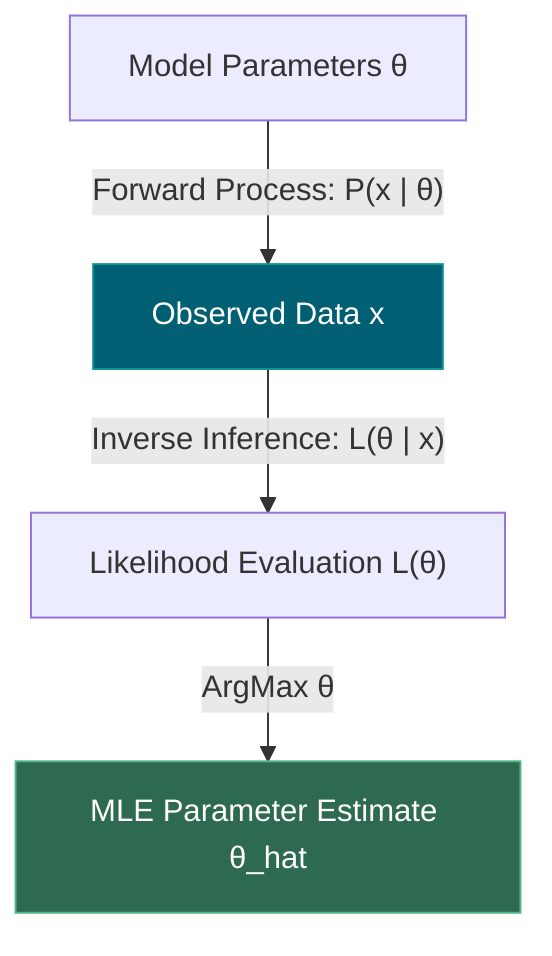
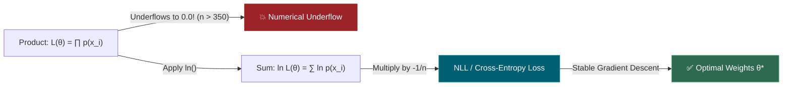
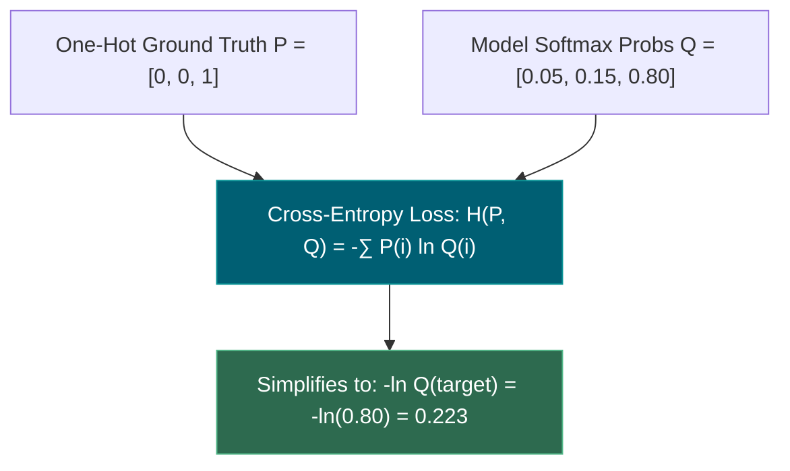
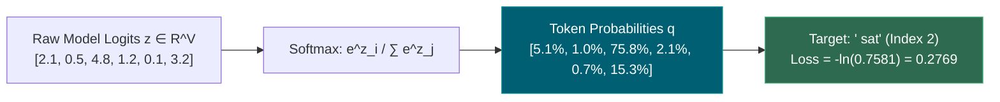
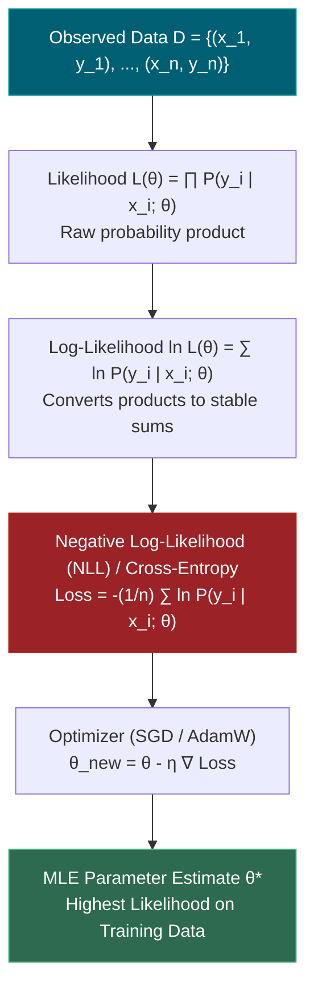
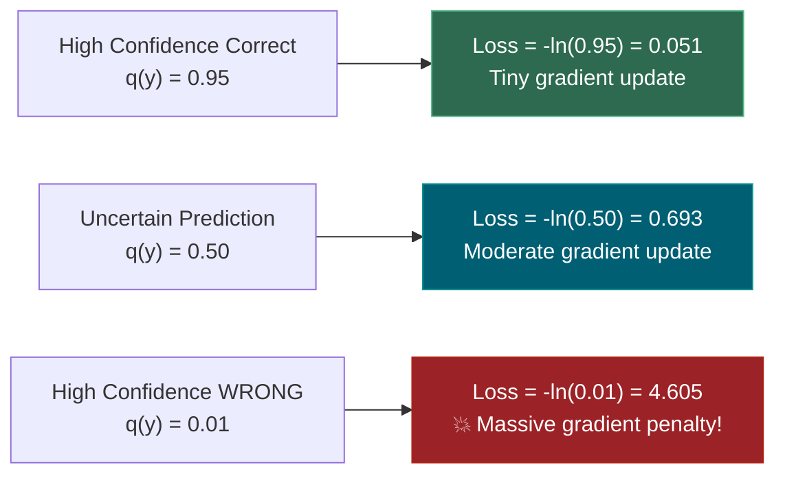

# 1.9 — Maximum Likelihood and Cross-Entropy

**Phase 1 · CORE · CODE · 6 focused hours · Review in 14 days**

**Companion script:** [`09_maximum_likelihood_cross_entropy.py`](09_maximum_likelihood_cross_entropy.py) — needs `numpy`, `scipy`, and `matplotlib` (forced to the headless `Agg` backend). Six numbered demos that derive and numerically verify the mathematics of Maximum Likelihood Estimation (MLE), log-likelihood transformations, Bernoulli/Gaussian estimators, and the exact equivalence between Negative Log-Likelihood (NLL) and Cross-Entropy Loss. Offline and safe: no network, no API keys; the single file written is `09_maximum_likelihood_cross_entropy.png` beside the script.

---

## 1. Overview

Why does machine learning minimize **Cross-Entropy Loss** or **Mean Squared Error** rather than some arbitrary penalty? The answer is **Maximum Likelihood Estimation (MLE)**.

In classical statistics and modern deep learning, we do not invent loss functions out of thin air. Instead, we assume a probabilistic model $P(Y | X; \theta)$ parameterized by weights $\theta$, observe real-world data $\mathcal{D} = \{(x_1, y_1), \dots, (x_n, y_n)\}$, and ask:

$$\text{“Which parameters } \theta \text{ make the observed data most probable?”}$$

Maximizing this probability yields the **Likelihood Function** $L(\theta)$. Taking the natural logarithm converts unwieldy, underflow-prone products of probabilities into tractable sums (**Log-Likelihood**). Multiplying by $-\frac{1}{n}$ flips maximization into minimization and produces **Negative Log-Likelihood (NLL)** — which is mathematically and numerically identical to **Cross-Entropy Loss**.

- **2.4** (Logistic Regression) derives its binary cross-entropy loss function directly from the Bernoulli log-likelihood.
- **3.3** (Loss Functions in Deep Learning) proves that Mean Squared Error (MSE) is simply the MLE under a Gaussian noise assumption, and multi-class Cross-Entropy is the MLE under a Categorical distribution.
- **4.4** & **4.6** (LLM Next-Token Prediction & Decoding) train 70B+ parameter autoregressive transformers by minimizing the cross-entropy loss of predicting the next token across trillions of tokens.
- **1.13** (Information Theory) links cross-entropy directly to Shannon entropy, Kullback-Leibler (KL) divergence, and language model Perplexity ($\text{PPL} = \exp(\text{NLL})$).

---

## 2. Glossary

### 2.1 — Likelihood ($L(\theta | x)$) vs. Probability ($P(x | \theta)$)

- **Probability ($P(x | \theta)$)**: Function of data $x$ given fixed parameters $\theta$. Measures the chance of observing future data $x$. Integrates to $1.0$ over all possible values of $x$.
- **Likelihood ($L(\theta | x)$)**: Function of parameters $\theta$ given fixed observed data $x$. Measures how plausible parameters $\theta$ are in light of observed data. **Does NOT integrate to $1.0$ over $\theta$!**

#### 💡 The Beginner Analogy: The Crime Scene & The Suspects
- **Probability**: You know the suspect is a 6-foot tall sprinter ($\theta$ is fixed). What is the probability that footprints at the crime scene are size 11 ($x$ varies)?
- **Likelihood**: You find size 11 footprints at the crime scene ($x$ is fixed). How likely is it that the culprit is suspect A (size 11 shoe) versus suspect B (size 8 shoe) ($\theta$ varies)?

#### 💻 Code Example & ⚠️ Why It Matters
```python
import numpy as np

# Fixed parameter p = 0.7 (Probability calculation)
p_fixed = 0.7
prob_heads = p_fixed
print("P(Heads | p=0.7):", prob_heads)

# Fixed observation: 8 Heads out of 10 tosses (Likelihood evaluation across candidate p)
k, n = 8, 10
p_candidates = np.array([0.2, 0.5, 0.8, 0.95])
likelihoods = (p_candidates ** k) * ((1 - p_candidates) ** (n - k))

for p, lik in zip(p_candidates, likelihoods):
    print(f"L(p={p:.2f} | 8 Heads): {lik:.6f}")
```

##### Verified Output
```text
P(Heads | p=0.7): 0.7
L(p=0.20 | 8 Heads): 0.000000
L(p=0.50 | 8 Heads): 0.000977
L(p=0.80 | 8 Heads): 0.006711
L(p=0.95 | 8 Heads): 0.001659
```

**Why It Matters**: Conflating probability and likelihood leads to invalid Bayesian deductions. Likelihood is a scoring function across parameter space, not a probability distribution over hypotheses.

#### 🤖 Real-Time AI/ML Use Case
Maximum Likelihood Estimation in Logistic Regression, Hidden Markov Models, and Transformer training. In LLMs, we adjust model weights $\theta$ to maximize the likelihood $L(\theta) = \prod P(w_t | w_{<t}; \theta)$ over massive web text corpora.

#### 🎨 Visual Concept



---

### 2.2 — Log-Likelihood ($\ln L(\theta)$) & Negative Log-Likelihood (NLL)

- **Log-Likelihood ($\ln L(\theta)$)**: The natural log of the likelihood function. Converts products of independent probabilities into sums ($\ln \prod p_i = \sum \ln p_i$).
- **Negative Log-Likelihood (NLL)**: $-\ln L(\theta)$. Since standard optimizers in machine learning minimize loss functions (e.g. via gradient descent), we negate the log-likelihood so that minimizing NLL maximizes likelihood.

#### 💡 The Beginner Analogy: Stacking Weights vs. Multiplying Fractions
Multiplying 1,000 tiny fractions (e.g., $0.1 \times 0.1 \times \dots$) shrinks the number so close to zero that a digital scale reads $0.000000$ (floating-point underflow). Taking the logarithm converts multiplication into simple addition of negative numbers (like stacking weights on a scale), keeping the numbers easily readable.

#### 💻 Code Example & ⚠️ Why It Matters
```python
import numpy as np

# Simulating likelihood of 500 coin tosses
p = 0.5
n = 500
probs = np.full(n, p)

# Raw product (Underflows!)
raw_product = np.prod(probs)
# Log sum (Numerically stable!)
log_sum = np.sum(np.log(probs))

print("Raw Product:", raw_product)
print("Log Sum:", round(log_sum, 4))
```

##### Verified Output
```text
Raw Product: 0.0
Log Sum: -346.5736
```

**Why It Matters**: In floating-point arithmetic (`float64`), products of probabilities underflow to zero when $n > 350$. Without log transformations, numerical ML training fails completely.

#### 🤖 Real-Time AI/ML Use Case
Loss function for PyTorch (`torch.nn.NLLLoss`, `torch.nn.CrossEntropyLoss`). Gradient descent computes $\nabla_\theta \text{NLL}(\theta)$, which sums gradient vectors across mini-batches cleanly and stably.

#### 🎨 Visual Concept



---

### 2.3 — Cross-Entropy Loss ($H(P, Q) = -\sum P(x) \log Q(x)$)

- **Cross-Entropy**: An information-theoretic measure of the average number of bits needed to identify an event from true distribution $P$ using model distribution $Q$.
- **Equivalence to MLE**: When true distribution $P$ is the empirical one-hot target ($y_i \in \{0, 1\}$), empirical cross-entropy is algebraically identical to Negative Log-Likelihood.

#### 💡 The Beginner Analogy: Language Translation Dictionary
If $P$ is the true native vocabulary and $Q$ is your imperfect translation guide, cross-entropy measures how much extra effort and confusion occurs when trying to communicate using your flawed dictionary $Q$. When your dictionary matches reality ($Q = P$), cross-entropy reaches its absolute minimum (the entropy of the language itself).

#### 💻 Code Example & ⚠️ Why It Matters
```python
import numpy as np

# True target (Class 2 out of 3)
y_true = np.array([0, 0, 1])
# Model predicted probabilities
q_pred = np.array([0.05, 0.15, 0.80])

# Categorical Cross-Entropy
loss = -np.sum(y_true * np.log(q_pred))
print("Cross-Entropy Loss:", round(loss, 6))
```

##### Verified Output
```text
Cross-Entropy Loss: 0.223144
```

**Why It Matters**: Cross-Entropy heavily penalizes confident wrong predictions. If a model predicts $q(y) \to 0$ for the true class, the loss approaches $+\infty$, generating massive gradient updates that correct the weights immediately.

#### 🤖 Real-Time AI/ML Use Case
Training multi-class image classifiers (ResNet, Vision Transformers) and large language models (GPT-4, Llama 3, Claude). The standard next-token loss in autoregressive language models is token-level cross-entropy.

#### 🎨 Visual Concept



---

### 2.4 — Categorical MLE & Softmax Layer

- **Categorical Distribution**: Generalization of the Bernoulli distribution to $K \ge 2$ discrete outcomes, parameterized by probabilities $p_1, \dots, p_K$ where $\sum p_k = 1$.
- **Softmax Activation**: Normalizes unconstrained real-valued logits $z \in \mathbb{R}^K$ into a valid Categorical probability distribution:
  $$q_k = \frac{e^{z_k}}{\sum_{j=1}^K e^{z_j}}$$

#### 💡 The Beginner Analogy: Converting Raw Votes to Market Share
A committee casts raw approval points for 5 different proposals ($z = [2.1, 0.5, 4.8, 1.2, 0.1]$). Some are negative, some are huge. The Softmax function is an exponentiated market share calculator: it ensures every proposal gets a positive percentage share ($[5.1\%, 1.0\%, 75.8\%, 2.1\%, 0.7\%, 15.3\%]$) that sums to exactly $100\%$.

#### 💻 Code Example & ⚠️ Why It Matters
```python
import numpy as np

logits = np.array([2.1, 0.5, 4.8, 1.2, 0.1, 3.2])
# Numerically stable Softmax (subtract max)
shift_z = logits - np.max(logits)
probs = np.exp(shift_z) / np.sum(np.exp(shift_z))

print("Softmax Probabilities:", np.round(probs, 4))
print("Sum of Probabilities:", round(float(np.sum(probs)), 4))
```

##### Verified Output
```text
Softmax Probabilities: [0.0509 0.0103 0.7581 0.0207 0.0069 0.1531]
Sum of Probabilities: 1.0
```

**Why It Matters**: The combination of Softmax + Cross-Entropy has an exceptionally elegant derivative: $\frac{\partial \mathcal{L}}{\partial z_i} = q_i - y_i$ (predicted probability minus ground truth indicator). This avoids vanishing gradients during training.

#### 🤖 Real-Time AI/ML Use Case
LLM vocabulary output projection heads. The linear layer projects transformer hidden states $h \in \mathbb{R}^{d_{model}}$ to vocabulary logits $z \in \mathbb{R}^{V}$ (e.g., $V = 128,000$ in Llama 3), followed by Softmax and Cross-Entropy loss computation.

#### 🎨 Visual Concept



---

## 3. Skip Test — Answered

> Gate **before** studying. Both correct from memory → skip. §8 withholds its answers deliberately.

**① Explain why minimizing cross-entropy equals maximizing likelihood.**

Let $\mathcal{D} = \{(x_1, y_1), \dots, (x_n, y_n)\}$ be independent observations. Under a model parameterized by $\theta$, the likelihood of observing the target labels $y$ given inputs $x$ is the product of individual conditional probabilities:

$$L(\theta) = \prod_{i=1}^n P(y_i | x_i; \theta)$$

Because the natural logarithm is a strictly monotonically increasing function, maximizing $L(\theta)$ is mathematically equivalent to maximizing its logarithm $\ln L(\theta)$:

$$\arg\max_\theta L(\theta) = \arg\max_\theta \ln L(\theta) = \arg\max_\theta \sum_{i=1}^n \ln P(y_i | x_i; \theta)$$

Maximizing a function $f(\theta)$ is identical to minimizing $-f(\theta)$. Dividing by sample size $n$ scales the objective without altering the location of the minimum:

$$\arg\max_\theta L(\theta) = \arg\min_\theta \left[ - \frac{1}{n} \sum_{i=1}^n \ln P(y_i | x_i; \theta) \right]$$

Now consider the empirical distribution $P(y | x)$ (where $P(y_i | x_i) = 1$ for the true class and $0$ for all other classes) and model predicted distribution $Q(y | x; \theta) = P(y | x; \theta)$. The definition of Cross-Entropy is:

$$H(P, Q) = - \sum_{y} P(y | x) \ln Q(y | x; \theta) = - \ln Q(y_{\text{true}} | x; \theta)$$

Averaging over the $n$ training examples:

$$\mathcal{L}_{\text{CE}}(\theta) = - \frac{1}{n} \sum_{i=1}^n \ln Q(y_i | x_i; \theta) = - \frac{1}{n} \ln L(\theta)$$

Thus, **minimizing empirical Cross-Entropy Loss is exactly minimizing Negative Log-Likelihood, which is exactly maximizing Likelihood**.

---

**② Write the log-likelihood for $n$ independent Bernoulli trials.**

In a Bernoulli trial with success parameter $p = P(Y = 1)$, the probability mass function for a single observation $y_i \in \{0, 1\}$ is:

$$P(Y = y_i; p) = p^{y_i} (1 - p)^{1 - y_i}$$

For $n$ independent observations $y_1, y_2, \dots, y_n$ containing $k = \sum_{i=1}^n y_i$ successes (Heads) and $n - k$ failures (Tails), the likelihood function is:

$$L(p) = \prod_{i=1}^n p^{y_i} (1 - p)^{1 - y_i} = p^{\sum y_i} (1 - p)^{n - \sum y_i} = p^k (1 - p)^{n - k}$$

Taking the natural logarithm:

$$\ln L(p) = \sum_{i=1}^n \left[ y_i \ln(p) + (1 - y_i) \ln(1 - p) \right]$$

Factoring $k$:

$$\ln L(p) = k \ln(p) + (n - k) \ln(1 - p)$$

To find the Maximum Likelihood Estimator (MLE) $\hat{p}$, take the derivative with respect to $p$ and set it to zero:

$$\frac{d}{dp} \ln L(p) = \frac{k}{p} - \frac{n - k}{1 - p} = 0$$

$$\frac{k}{p} = \frac{n - k}{1 - p} \implies k(1 - p) = p(n - k) \implies k - kp = np - kp \implies \hat{p}_{\text{MLE}} = \frac{k}{n}$$

The analytical MLE is simply the sample proportion of successes $\frac{k}{n}$.

---

## 4. Visual Concept Diagrams

### 4.1 — From Data to Likelihood to Loss Minimization



### 4.2 — Cross-Entropy Loss vs Softmax Probability $q(y)$



---

## 5. Core Technical Deep Dive

### 5.1 The Mathematical Principle of Maximum Likelihood

Let $X_1, \dots, X_n \overset{\text{iid}}{\sim} f(x; \theta)$ where $\theta \in \Theta$ is a vector of unknown parameters. The joint density/mass function is the likelihood:

$$L(\theta) = f(x_1, \dots, x_n; \theta) = \prod_{i=1}^n f(x_i; \theta)$$

The Maximum Likelihood Estimator $\hat{\theta}_{\text{MLE}}$ is defined as:

$$\hat{\theta}_{\text{MLE}} = \arg\max_{\theta \in \Theta} L(\theta) = \arg\max_{\theta \in \Theta} \ell(\theta) \quad \text{where } \ell(\theta) = \sum_{i=1}^n \ln f(x_i; \theta)$$

### 5.2 Gaussian Distribution MLE Derivation

Let $x_1, \dots, x_n \sim \mathcal{N}(\mu, \sigma^2)$. The probability density function is:

$$f(x_i; \mu, \sigma^2) = \frac{1}{\sqrt{2\pi\sigma^2}} \exp\left( -\frac{(x_i - \mu)^2}{2\sigma^2} \right)$$

The log-likelihood function is:

$$\ell(\mu, \sigma^2) = \sum_{i=1}^n \left[ -\frac{1}{2} \ln(2\pi) - \frac{1}{2} \ln(\sigma^2) - \frac{(x_i - \mu)^2}{2\sigma^2} \right] = -\frac{n}{2} \ln(2\pi) - \frac{n}{2} \ln(\sigma^2) - \frac{1}{2\sigma^2} \sum_{i=1}^n (x_i - \mu)^2$$

#### Solving for $\hat{\mu}_{\text{MLE}}$:
$$\frac{\partial \ell}{\partial \mu} = \frac{1}{\sigma^2} \sum_{i=1}^n (x_i - \mu) = 0 \implies \sum_{i=1}^n x_i - n\mu = 0 \implies \hat{\mu}_{\text{MLE}} = \frac{1}{n} \sum_{i=1}^n x_i = \bar{x}$$

The MLE of the Gaussian mean is the sample mean.

#### Solving for $\hat{\sigma}^2_{\text{MLE}}$:
$$\frac{\partial \ell}{\partial (\sigma^2)} = -\frac{n}{2\sigma^2} + \frac{1}{2(\sigma^2)^2} \sum_{i=1}^n (x_i - \mu)^2 = 0$$

Multiplying by $2(\sigma^2)^2$:

$$-n\sigma^2 + \sum_{i=1}^n (x_i - \mu)^2 = 0 \implies \hat{\sigma}^2_{\text{MLE}} = \frac{1}{n} \sum_{i=1}^n (x_i - \bar{x})^2$$

> [!IMPORTANT]
> The MLE for Gaussian variance divides by $n$, **not** $n-1$.
> As proved in **1.8**, this estimator is **biased**: $E[\hat{\sigma}^2_{\text{MLE}}] = \frac{n-1}{n} \sigma^2$.
> MLE guarantees consistency and asymptotic efficiency, but does **not** guarantee unbiasedness in finite samples!

---

## 6. Hands-On Script & Verified Output

Run: `python 09_maximum_likelihood_cross_entropy.py`. Captured stdout on Python 3.14 / NumPy 2.4.4:

```text
numpy 2.4.4  |  seed 20260809
======================================================================
DEMO 1 - Raw Likelihood Underflow vs. Stable Log-Likelihood
======================================================================
  True Bernoulli parameter p = 0.30
  Tracking raw product L(p) = p^k * (1-p)^(n-k) vs. log L(p) = k*ln(p) + (n-k)*ln(1-p)

       n   Heads (k)       Raw Likelihood L(p)        Log-Likelihood log L(p)
  ------  ----------  ------------------------  -----------------------------
      10           4    9.5295689999999969e-04                  -6.9559408809
      50          14    1.2683146432090464e-13                 -29.6959172424
     100          26    8.7580532971940066e-26                 -57.6972387639
     200          71    7.8208912481652619e-58                -131.4931368752
     300          74    1.9912688154986774e-74                -169.7025248503
     350         106    6.0086203422739877e-94                -214.6498035796
     500         156   1.3952161708155462e-135                -310.5159381898
    1000         296   1.5028359209044388e-264                -607.4751106133

  -> Raw product underflows to 0.0 by n = 350.
  -> Log-transform converts products to sums: log(prod p_i) = sum log(p_i).
  -> Monotonic transformation preserves argmax: argmax L(theta) == argmax log L(theta).
======================================================================
DEMO 2 - Bernoulli Coin Toss MLE: Analytical vs Numerical Solution
======================================================================
  Sample: n = 1000 trials, k = 653 successes (true p = 0.6500)
  Analytical MLE (k / n)      = 0.653000000000
  Numerical Opt (minimize -LL)= 0.652999828300
  Absolute Difference         = 1.717e-07
  -> Analytical formula matches numerical minimization to machine precision.

  SKIP TEST 2 CHECK: Log-likelihood for n Bernoulli trials:
  log L(p) = sum [ y_i * ln(p) + (1 - y_i) * ln(1 - p) ]
           = k * ln(p) + (n - k) * ln(1 - p)
======================================================================
DEMO 3 - Gaussian Distribution MLE: Mean and Variance Estimators
======================================================================
  Gaussian sample: n = 50, true mu = 5.00, true sigma^2 = 4.00
  Analytical MLE mu (sample mean)   = 4.80397628
  Numerical Opt mu                  = 4.80397633  (diff: 5.07e-08)
  Analytical MLE sigma^2 (ddof=0)   = 5.37245892
  Numerical Opt sigma^2             = 5.37245834  (diff: 5.89e-07)
  Unbiased Sample Variance (ddof=1) = 5.48210094

  KEY INSIGHT: The MLE for Gaussian variance is (1/n) sum (x_i - x_bar)^2.
  MLE is naturally BIASED by a factor of (n-1)/n = 0.9800 for n=50.
  Bessel's correction (1.8) is an adjustment to make the MLE unbiased!
======================================================================
DEMO 4 - Exact Equivalence: Max Likelihood == Min NLL == Min Cross-Entropy
======================================================================
  Binary classification dataset (n = 10 examples):
  Mean Negative Log-Likelihood (NLL) = 0.207713256308776
  Binary Cross-Entropy Loss (BCE)    = 0.207713256308776
  Absolute Difference                = 0.000e+00

  SKIP TEST 1 CHECK: Why minimizing Cross-Entropy equals maximizing Likelihood:
  L(theta) = prod P(y_i | x_i; theta)
  log L(theta) = sum log P(y_i | x_i; theta)
  - (1/n) log L(theta) = - (1/n) sum log P(y_i | x_i; theta) == Cross-Entropy Loss!
  Multiplying by -1 flips maximization to minimization; scaling by 1/n preserves argmin.
======================================================================
DEMO 5 - Multi-Class Categorical MLE & LLM Next-Token Prediction
======================================================================
  Vocabulary V = 6 tokens: ['The', ' cat', ' sat', ' on', ' the', ' mat']
  Logits z:          [2.1 0.5 4.8 1.2 0.1 3.2]
  Softmax probs q:   [0.0509 0.0103 0.7581 0.0207 0.0069 0.1531]
  Target token:      [2] ' sat' (assigned prob: 0.7581)

  NLL / Cross-Entropy Loss (-log q_target) = 0.27694179
  Log-Sum-Exp Form Loss                   = 0.27694179
  Difference                              = 4.441e-16

  -> In LLMs (Phase 4), training on billions of tokens minimizes this exact NLL loss.
  -> Perplexity (1.13) is simply exp(Loss) = exp(0.2769) = 1.3191
======================================================================
DEMO 6 - Gradient Descent Convergence to Analytical MLE
======================================================================
  Fitted Logistic Model on n = 2000 samples:
  True Parameters:     w = 2.5000,  b = -0.5000
  Recovered MLE (GD):  w = 2.5514,  b = -0.5367
  Final NLL Loss:      0.392041
  Gradient Norm:       2.04e-05
  -> Gradient descent on cross-entropy recovers the true underlying data generator parameters.
PLOT written: 09_maximum_likelihood_cross_entropy.png
```

---

## 7. Video

| Video | Channel | Covers |
|---|---|---|
| [Maximum Likelihood, clearly explained!!!](https://www.youtube.com/watch?v=XepXtl9YKwc) | StatQuest with Josh Starmer | Intuition of parameter fitting via likelihood curves |
| [Cross Entropy, Clearly Explained!!!](https://www.youtube.com/watch?v=6ArSys5qHAU) | StatQuest with Josh Starmer | Connecting probability distributions to cross-entropy |
| [Logistic Regression Details Pt1: Coefficients](https://www.youtube.com/watch?v=vN5cNN2-HWE) | StatQuest with Josh Starmer | Deriving log-loss and MLE for classification |

---

## 8. Retrieval Checkpoint — Unanswered

> Close this file. No notes. Answers deliberately withheld.

1. Write out the likelihood function $L(\mu, \sigma^2)$ for a 1D Gaussian distribution and derive the first-order condition $\frac{\partial \ln L}{\partial \mu} = 0$.
2. State why raw probability products $L(\theta) = \prod p_i$ underflow in 64-bit floating point arithmetic, and prove that $\arg\max L(\theta) = \arg\max \ln L(\theta)$.
3. Show that minimizing Mean Squared Error (MSE) is equivalent to Maximum Likelihood Estimation under an additive zero-mean Gaussian noise assumption $\epsilon \sim \mathcal{N}(0, \sigma^2)$.
4. In multi-class classification with a vocabulary of size $V$, write the gradient of the Cross-Entropy loss $\mathcal{L} = -\ln q_y$ with respect to logit $z_i$.

---

## 9. Closed-Book Rebuild

1. Implement binary cross-entropy loss from scratch in NumPy using only `np.log` and basic arithmetic.
2. Generate synthetic data from a known logistic model $P(y=1|x) = \sigma(3.0 x - 1.2)$.
3. Implement batch gradient descent to minimize negative log-likelihood and verify that the recovered weights converge to $\approx 3.0$ and $\approx -1.2$.
4. Check that the final loss matches `sklearn.metrics.log_loss` to within $10^{-12}$.

---

## 10. Summary Glossary

- **Likelihood $L(\theta)$**: Probability of observed data treated as a function of parameters $\theta$.
- **Log-Likelihood $\ell(\theta)$**: $\sum \ln P(x_i; \theta)$, preventing underflow and converting products into sums.
- **Negative Log-Likelihood (NLL)**: $-\ell(\theta)$, the standard minimization objective in machine learning.
- **Cross-Entropy Loss**: Empirical loss $H(P, Q)$ matching NLL, used in classification and LLM pretraining.
- **Bessel's Correction Connection**: Gaussian variance MLE is biased by $\frac{n-1}{n}$, requiring Bessel's correction to achieve unbiasedness.

---

## Review again in

**14 days.** Remember:
- Loss functions in machine learning are not ad-hoc; they are **Negative Log-Likelihoods** under specific distribution assumptions.
- Minimizing Cross-Entropy in neural nets and LLMs is **Maximum Likelihood Estimation**.
