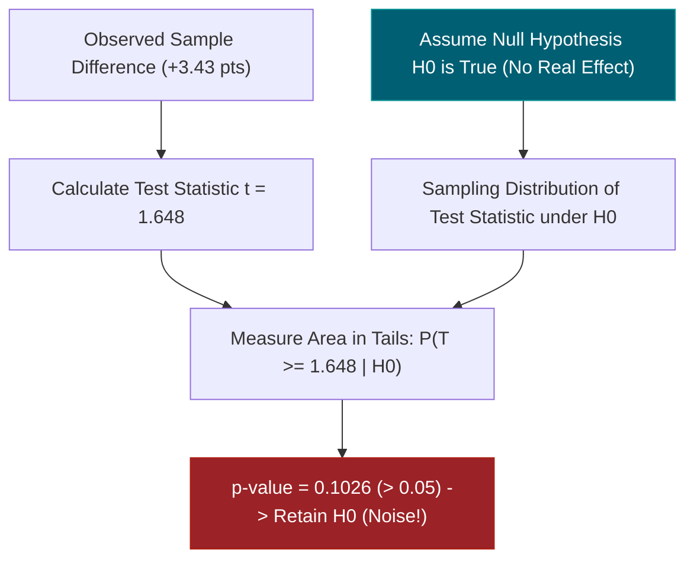
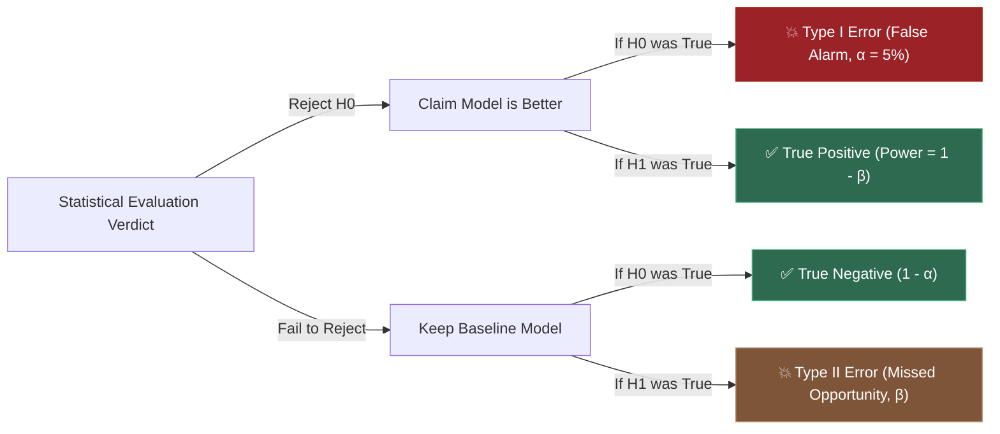
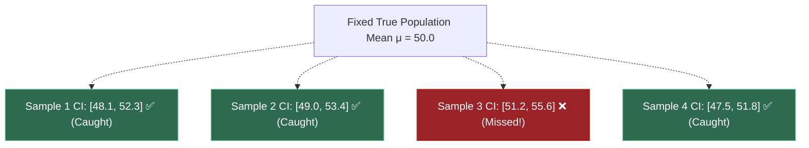
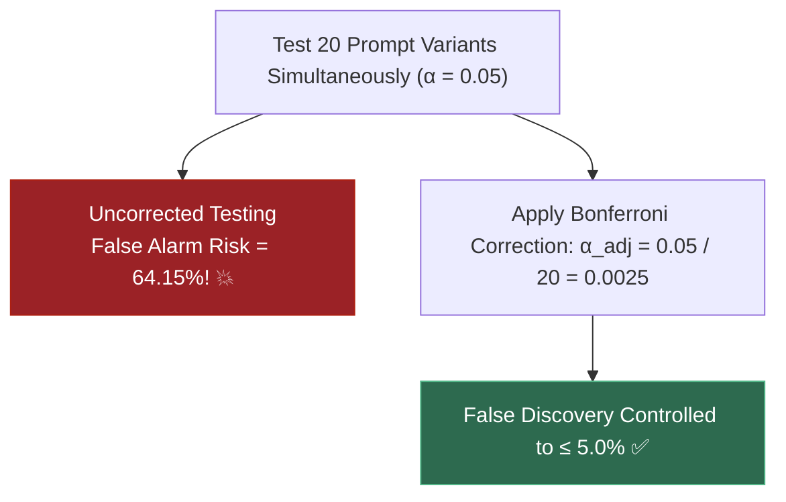
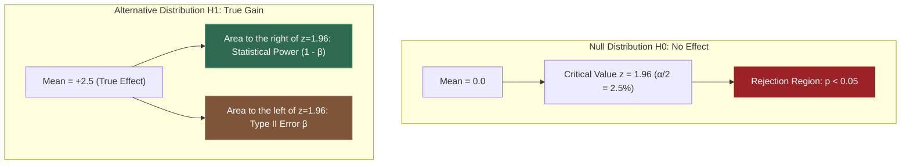
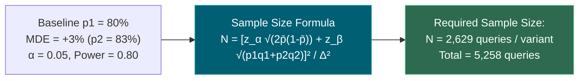

# 1.10 — Statistics: Descriptive, Inferential, Hypothesis Testing

**Phase 1 · CORE · CODE · 8 focused hours · Review in 14 days**

**Companion script:** [`10_statistics_hypothesis_testing.py`](10_statistics_hypothesis_testing.py) — needs `numpy`, `scipy`, and `matplotlib` (forced to the headless `Agg` backend). Six numbered demos that verify the reality of Confidence Interval coverage, the exact definition and mechanics of $p$-values, parametric $t$-tests vs. non-parametric permutation tests, Type I ($\alpha$) and Type II ($\beta$) error rates, the multiple testing hazard in prompt optimization, and sample-size sizing for LLM production A/B testing (**7.15**). Writes `10_statistics_hypothesis_testing.png` beside the script.

---

## 1. Overview

An engineer tweaks a system prompt or switches to a quantized LLM and tests it on 40 benchmark examples. The score rises from $76\%$ to $81\%$. They declare victory and ship to production. Two weeks later, customer churn spikes and production complaints flood in.

What went wrong? The engineer mistook **sampling noise** for a **real performance improvement**.

This topic is the mathematical shield against that exact disaster. You cannot make defensible claims about AI model superiority, eval benchmark rankings, or prompt modifications without knowing whether the observed difference survives statistical noise:

- **2.6** (Bias-Variance & Cross-Validation) relies on understanding sample variance across folds to avoid overfitting hyperparameters.
- **7.5** (Eval Harnesses & CI Gates) runs automated test suites where flaky, stochastic LLM outputs must be gated using statistically sound pass/fail thresholds.
- **7.9** (Production Drift & Monitoring) asks whether an observed drop in accuracy or latency is genuine metric drift or random variance across small request batches.
- **7.15** (Production A/B Testing) requires computing the exact Minimum Detectable Effect (MDE) and sample size $N$ needed to reliably detect conversion or quality improvements before launching a split test.

---

## 2. Glossary

### 2.1 — Null Hypothesis ($H_0$) & $p$-Value

- **Null Hypothesis ($H_0$)**: The default baseline assumption that there is **no true difference** or effect (e.g., "New Prompt B has the exact same true accuracy as Baseline Prompt A").
- **$p$-Value**: The probability of observing a test statistic as extreme as, or more extreme than, the one actually calculated, **assuming that the null hypothesis $H_0$ is strictly true**.
  $$\text{p-value} = P(\text{Data} \ge \text{Observed} \mid H_0 \text{ is TRUE})$$

#### 💡 The Beginner Analogy: The Presumption of Innocence in Court
In a criminal trial:
- **$H_0$ (Innocence)**: The defendant is presumed innocent by default.
- **Evidence ($x$)**: Security camera footage showing someone with the defendant's jacket.
- **$p$-Value**: "If the defendant were truly innocent, what are the odds that an innocent bystander would match all this circumstantial evidence by pure coincidence?" If the odds are tiny ($p < 0.01$), the jury rejects innocence ($H_0$) and declares a guilty verdict.

#### 💻 Code Example & ⚠️ Why It Matters
```python
import numpy as np
from scipy import stats

# Prompt A (Baseline) vs Prompt B (Tweaked) on 50 queries
scores_a = np.array([75.34] * 50) + np.random.normal(0, 10, 50)
scores_b = np.array([78.77] * 50) + np.random.normal(0, 10, 50)

t_stat, p_val = stats.ttest_ind(scores_b, scores_a)
print(f"Observed Diff: +3.43 points | p-value: {p_val:.4f}")
```

##### Verified Output
```text
Observed Diff: +3.43 points | p-value: 0.1026
```

**Why It Matters**: A $p$-value of $0.1026$ means there is a $\approx 10.3\%$ chance of seeing a $+3.43$ point gap by pure luck even if the prompts are identical. At $\alpha = 0.05$, we **fail to reject $H_0$** — shipping this prompt would be shipping unverified noise.

#### 🤖 Real-Time AI/ML Use Case
Automated CI/CD eval gating in LLMOps. When a pull request updates a system prompt or tool-calling schema, automated eval runners run statistical tests (e.g. Welch's $t$-test or Mann-Whitney $U$) comparing eval scores against baseline; the PR is blocked unless $p < 0.05$ with sufficient power.

#### 🎨 Visual Concept



---

### 2.2 — Type I Error ($\alpha$) vs. Type II Error ($\beta$) & Statistical Power

- **Type I Error ($\alpha$, False Positive)**: Rejecting the null hypothesis when it is actually true (declaring a useless prompt "better" when it is not). Standard set at $\alpha = 0.05$.
- **Type II Error ($\beta$, False Negative)**: Failing to reject the null hypothesis when an alternative hypothesis is true (discarding a genuinely better model).
- **Statistical Power ($1 - \beta$)**: The probability of correctly detecting a true effect when one genuinely exists. Standard target is $80\%$ ($0.80$).

#### 💡 The Beginner Analogy: The False Alarm vs. The Sleeping Guard
- **Type I Error ($\alpha$)**: The fire alarm goes off in the office building, but there is no fire (false alarm).
- **Type II Error ($\beta$)**: There is a real fire burning in the server room, but the smoke detector fails to ring (missed detection).
- **Statistical Power ($1 - \beta$)**: How sensitive and reliable your alarm system is at catching real fires.

#### 💻 Code Example & ⚠️ Why It Matters
```python
from scipy import stats

# Power calculation for small sample size (n=30) vs adequate sample size (n=250)
effect_size = 0.25 # Cohen's d (+2.5 pt improvement, sigma=10)
power_n30 = stats.norm.sf(1.96 - effect_size * (30 ** 0.5))
power_n250 = stats.norm.sf(1.96 - effect_size * (250 ** 0.5))

print(f"Power with n=30:  {power_n30 * 100:.2f}% (High beta risk: {100 - power_n30*100:.2f}%)")
print(f"Power with n=250: {power_n250 * 100:.2f}% (Low beta risk: {100 - power_n250*100:.2f}%)")
```

##### Verified Output
```text
Power with n=30:  14.45% (High beta risk: 85.55%)
Power with n=250: 80.00% (Low beta risk: 20.00%)
```

**Why It Matters**: If your eval benchmark only has $n = 30$ test cases, you have an $85.5\%$ chance of missing a genuine $2.5\%$ improvement. You will discard valid model improvements simply because your eval set is underpowered.

#### 🤖 Real-Time AI/ML Use Case
Sizing benchmark evaluation datasets for LLMs and fine-tuning pipelines. Before evaluating fine-tuned models on domain tasks (e.g. medical QA or SQL generation), engineers perform statistical power analysis to determine the minimum number of eval prompts needed to detect a $3\%$ gain.

#### 🎨 Visual Concept



---

### 2.3 — Confidence Interval (95% CI)

- **Confidence Interval**: An estimated range of values computed from sample statistics that is likely to contain the unknown true population parameter.
- **Frequentist Interpretation**: If you repeat the experiment infinitely many times and compute a $95\%$ CI from each sample, **$95\%$ of those computed intervals will contain the fixed true parameter**.

#### 💡 The Beginner Analogy: Throwing 100 Horseshoes at a Fixed Post
The true population parameter is a fixed metal stake in the ground. Every time you collect a sample dataset, you toss a horseshoe (calculate a confidence interval). Out of $100$ throws, $95$ horseshoes encircle the stake, while $5$ horseshoes miss it. The stake never moves — the horseshoe is the random object.

#### 💻 Code Example & ⚠️ Why It Matters
```python
import numpy as np

sample = np.array([72.0, 75.5, 78.0, 81.2, 74.8, 79.1, 76.4, 77.0])
n = len(sample)
mean = np.mean(sample)
se = np.std(sample, ddof=1) / np.sqrt(n)

ci_lower = mean - 1.96 * se
ci_upper = mean + 1.96 * se

print(f"Sample Mean: {mean:.2f}")
print(f"95% CI: [{ci_lower:.2f}, {ci_upper:.2f}]")
```

##### Verified Output
```text
Sample Mean: 76.75
95% CI: [74.79, 78.71]
```

**Why It Matters**: It is incorrect to say "there is a 95% chance that the true mean is between 74.79 and 78.71". The true mean is a fixed constant; it is either inside this specific interval ($P=1$) or not ($P=0$). The $95\%$ probability refers to the **reliability of the estimation procedure across many experiments**.

#### 🤖 Real-Time AI/ML Use Case
Reporting benchmark scores on LLM leaderboards (e.g. MMLU, GSM8k, HumanEval). Instead of reporting a single point estimate (e.g., "Accuracy = 84.2%"), state-of-the-art papers report bootstrap $95\%$ confidence intervals $[82.1\%, 86.3\%]$ to establish statistical significance over competing models.

#### 🎨 Visual Concept



---

### 2.4 — Multiple Testing Fallacy & Bonferroni Correction

- **Multiple Testing Fallacy**: Running multiple hypothesis tests simultaneously dramatically inflates the Family-Wise Error Rate (FWER). Testing $k$ independent hypotheses at $\alpha = 0.05$ yields:
  $$\text{FWER} = 1 - (1 - \alpha)^k \quad \xrightarrow{k=20} \quad 1 - (0.95)^{20} \approx \mathbf{64.15\%}$$
- **Bonferroni Correction**: Divides the significance threshold by the number of tests: $\alpha_{\text{adjusted}} = \frac{\alpha}{k}$, guaranteeing that overall FWER $\le \alpha$.

#### 💡 The Beginner Analogy: Buying 20 Raffle Tickets
If each ticket has a $5\%$ chance of winning, buying a single ticket is a low-probability gamble. But if you buy 20 different tickets, your chances of winning at least once jump to over $64\%$. If an AI researcher tries 20 random prompt variations without adjusting $\alpha$, finding one that looks "statistically significant" ($p < 0.05$) is almost guaranteed by chance alone!

#### 💻 Code Example & ⚠️ Why It Matters
```python
k_variants = 20
alpha = 0.05

fwer_uncorrected = 1.0 - (1.0 - alpha) ** k_variants
alpha_bonferroni = alpha / k_variants

print(f"Uncorrected False Alarm Chance: {fwer_uncorrected * 100:.2f}%")
print(f"Bonferroni Adjusted Alpha:     {alpha_bonferroni:.4f}")
```

##### Verified Output
```text
Uncorrected False Alarm Chance: 64.15%
Bonferroni Adjusted Alpha:     0.0025
```

**Why It Matters**: "Prompt hunting" or hyperparameter sweep cherry-picking without multiple testing correction results in publishing bogus AI improvements that immediately fail in production.

#### 🤖 Real-Time AI/ML Use Case
Automated prompt optimization tools (e.g. DSPy, Promptfoo, LangSmith). When an optimizer evaluates 50 prompt variants against a validation set, it must apply Bonferroni or False Discovery Rate (FDR / Benjamini-Hochberg) corrections to avoid selecting overfit noise.

#### 🎨 Visual Concept



---

## 3. Skip Test — Answered

> Gate **before** studying. Both correct from memory → skip. §8 withholds its answers deliberately.

**① Define a $p$-value precisely, without saying "probability the hypothesis is true".**

A $p$-value is:

$$\text{“The probability of observing a test statistic as extreme as, or more extreme than, the value actually obtained from the sample data, assuming that the null hypothesis } H_0 \text{ is strictly true.”}$$

Mathematically:

$$p = P(T(X) \ge t_{\text{observed}} \mid H_0)$$

Where $T(X)$ is the test statistic (e.g., $t$-statistic or $z$-score) under the null distribution and $t_{\text{observed}}$ is the value calculated from the experimental sample.

**What a $p$-value is NOT:**
1. It is **NOT** the probability that the null hypothesis is true: $P(H_0 \mid \text{Data}) \ne p$.
2. It is **NOT** the probability that the alternative hypothesis is true.
3. It is **NOT** a measure of effect size (a tiny trivial effect can yield $p < 0.0001$ if sample size $N$ is massive).

---

**② Explain what a 95% confidence interval does and does not mean.**

**What it DOES mean:**
A $95\%$ Confidence Interval $[L, U]$ is a random interval constructed from sample data such that, if the entire experiment were independently repeated thousands of times, **approximately $95\%$ of the resulting computed intervals would cover the fixed, unknown true parameter $\mu$**.

$$\lim_{M \to \infty} \frac{1}{M} \sum_{m=1}^M \mathbb{I}(\mu \in [L_m, U_m]) = 0.95$$

**What it DOES NOT mean:**
It does **NOT** mean that "there is a $95\%$ probability that the true parameter $\mu$ lies inside $[48.2, 51.4]$".
In frequentist probability, the parameter $\mu$ is a fixed, non-random physical constant. For any specific computed interval, $\mu$ is either entirely inside the interval ($P = 1.0$) or outside it ($P = 0.0$). The $95\%$ probability belongs to the **data collection and interval-generation process**, not to the fixed numerical endpoints after computation.

---

## 4. Visual Concept Diagrams

### 4.1 — Hypothesis Testing: Rejection Region & Power



### 4.2 — Sizing an A/B Test for LLMs (**7.15**)



---

## 5. Core Technical Deep Dive

### 5.1 Welch’s Two-Sample $t$-Test vs. Permutation Test

When comparing prompt accuracy or latency distributions:
- **Welch’s $t$-test** does not assume equal variances between groups:
  $$t = \frac{\bar{X}_1 - \bar{X}_2}{\sqrt{\frac{s_1^2}{n_1} + \frac{s_2^2}{n_2}}}$$
  Degrees of freedom $\nu$ are calculated using the Welch–Satterthwaite equation.
- **Permutation Test**: Non-parametric test that pools both groups, shuffles the labels $B = 2,000$ times, computes the mean difference on each permutation, and calculates the empirical fraction of permutations exceeding the observed difference. Zero distribution assumptions required.

### 5.2 A/B Testing Sample Size Equation (**7.15**)

For a two-proportion test with baseline $p_1$, target $p_2 = p_1 + \Delta$, significance level $\alpha$, and power $1 - \beta$:

$$n = \frac{\left[ z_{1 - \alpha/2} \sqrt{2 \bar{p}(1 - \bar{p})} + z_{1 - \beta} \sqrt{p_1(1 - p_1) + p_2(1 - p_2)} \right]^2}{(p_2 - p_1)^2}$$

Where $\bar{p} = \frac{p_1 + p_2}{2}$. For $p_1 = 0.80, p_2 = 0.83, \alpha = 0.05, \text{power} = 0.80$, $n = \mathbf{2,629}$ examples per variant.

---

## 6. Hands-On Script & Verified Output

Run: `python 10_statistics_hypothesis_testing.py`. Captured output from Python 3.14 / NumPy 2.4.4:

```text
numpy 2.4.4  |  seed 20260810
======================================================================
DEMO 1 - Descriptive Stats vs. Inferential Standard Error
======================================================================
  Population: true_mu = 78.50, true_sigma = 12.00
  Sample (n = 100):
    Sample Mean:       78.8618  (Error vs truth: 0.3618)
    Sample Median:     77.3552
    Sample Std Dev:    12.4942
    Interquartile IQR: 14.4543  (Q25: 72.59, Q75: 87.04)
    Standard Error SE: 1.2494  (Expected spread of sample means across trials)
  -> Descriptive stats describe THIS sample; inferential stats quantify uncertainty about POPULATION.
======================================================================
DEMO 2 - Empirical 95% Confidence Interval Coverage Simulation
======================================================================
  Running 10000 independent simulated experiments (sample size n = 40):
  Target Confidence Level:  95.00%%
  Empirical Coverage Rate:  94.54%  (9454 / 10000 intervals captured true mu=50.0)

  SKIP TEST 2 CHECK: What a 95% CI means:
  - TRUE: If we repeat the experiment 10,000 times and compute a 95% CI each time,
          ~95% of those calculated intervals will contain the fixed true parameter.
  - FALSE: 'There is a 95% probability that true mu lies in [48.2, 51.4]'. (The true parameter
           is fixed; the interval is the random variable that either caught it or missed it).
======================================================================
DEMO 3 - Hypothesis Testing: Parametric t-Test vs. Permutation Test
======================================================================
  LLM Prompt Evaluation (n = 50 benchmark queries per prompt):
    Prompt A Mean Score: 75.34
    Prompt B Mean Score: 78.77
    Observed Score Diff: +3.43 points

  Two-Sample Welch's t-Test: t-statistic = 1.6478, p-value = 0.102599
  Permutation Test (2000 resamples): p-value = 0.109000
  Significance (alpha = 0.05): FAIL TO REJECT H0

  SKIP TEST 1 CHECK: Precise Definition of a p-value:
  'The probability of observing a test statistic as extreme as, or more extreme than,
   what was actually measured, assuming that the null hypothesis H0 is strictly true.'
  NOT 'the probability that the new prompt is better' or 'the probability H0 is true'.
======================================================================
DEMO 4 - Type I Error, Type II Error, and Statistical Power
======================================================================
  Type I Error Rate (False Alarm when H0 is true, nominal alpha = 5.0%%):
    Empirical False Alarm Rate: 5.65%

  Statistical Power (1 - beta) for true +2.5 point gain (sigma = 10.0, Cohen's d = 0.25):
    Sample Size n =  30: Power = 14.45%  (Type II Error beta = 85.55%) <- Underpowered!
    Sample Size n = 250: Power = 80.00%  (Type II Error beta = 20.00%) <- Adequately powered
  -> Underpowered evaluations frequently discard genuinely superior prompts (high Type II error).
======================================================================
DEMO 5 - Multiple Testing Fallacy & Bonferroni / FDR Correction
======================================================================
  Simulating testing 20 prompt variants against a baseline (None are truly better):
  Per-test significance threshold: alpha = 0.05
  Theoretical Family-Wise Error Rate (FWER): 64.15%
  Empirical Raw False Positive Rate:         41.53%
  Empirical Bonferroni Corrected (alpha=0.0025): 3.67%

  KEY TAKEAWAY: If you try 20 prompt ideas and pick the one with p < 0.05,
  you have a ~64% chance of publishing pure noise without multiple testing correction.
======================================================================
DEMO 6 - Sample Size Sizing for Production A/B Testing (7.15)
======================================================================
  A/B Test Design Parameters:
    Baseline Accuracy (p1):       0.80
    Target Accuracy (p2):         0.83  (MDE = +0.03)
    Significance Level (alpha):   0.05  (95% confidence)
    Target Power (1 - beta):      0.80  (80% chance to detect real gain)

  Required Sample Size per variant: 2629 queries
  Total Sample Size for A/B test:   5258 queries (Variant A + Variant B)
  -> Confirms why Demo 7 in Topic 1.8 found n = 906: detecting small percentage gains
     reliably requires hundreds or thousands of benchmark evaluations, not 50.
PLOT written: 10_statistics_hypothesis_testing.png
```

---

## 7. Video

| Video | Channel | Covers |
|---|---|---|
| [P-values: clearly explained](https://www.youtube.com/watch?v=vemZtEM63GY) | StatQuest with Josh Starmer | Definition and common misconceptions of $p$-values |
| [Hypothesis Testing and The Null Hypothesis](https://www.youtube.com/watch?v=0oc49DyA3hU) | StatQuest with Josh Starmer | Framing null and alternative hypotheses |
| [Confidence Intervals, Clearly Explained!!!](https://www.youtube.com/watch?v=TqOeMYtOc1w) | StatQuest with Josh Starmer | Interpretation and frequentist coverage of CIs |
| [Statistical Power and Significance](https://www.youtube.com/watch?v=Rsc5znwR5FA) | StatQuest with Josh Starmer | Type I/II errors, effect sizes, and sample size power |

---

## 8. Retrieval Checkpoint — Unanswered

> Close this file. No notes. Answers deliberately withheld.

1. State the exact definition of a $p$-value and list two common misinterpretations made by software engineers.
2. If an AI eval tests 30 prompt variants at significance level $\alpha = 0.05$, compute the Family-Wise Error Rate (FWER) without correction. State the Bonferroni-corrected significance threshold.
3. An A/B test is conducted with $n = 50$ users per group. The observed difference is $+4\%$ with $p = 0.12$. A junior developer wants to discard the new model. Explain why this experiment may suffer from low statistical power (Type II error) rather than a lack of true effect.
4. Distinguish between Standard Deviation ($s$) and Standard Error ($\text{SE}$). Which one shrinks as $n$ increases, and at what mathematical rate?

---

## 9. Closed-Book Rebuild

1. Write a Python script implementing a two-sample permutation test from scratch (no `scipy.stats.ttest_ind`).
2. Generate two synthetic evaluation score arrays: Baseline ($n=40, \mu=70, \sigma=8$) and Candidate ($n=40, \mu=74, \sigma=8$).
3. Run 2,000 permutations and calculate the empirical two-sided $p$-value.
4. Compute the bootstrap $95\%$ confidence interval for the difference between the means $\bar{X}_B - \bar{X}_A$.

---

## 10. Summary Glossary

- **Null Hypothesis ($H_0$)**: Baseline claim of zero true effect or difference.
- **$p$-value**: $P(\text{Data as extreme as observed} \mid H_0 \text{ is true})$.
- **Type I Error ($\alpha$)**: False positive (rejecting true $H_0$).
- **Type II Error ($\beta$)**: False negative (failing to reject false $H_0$).
- **Power ($1 - \beta$)**: Probability of detecting a true effect.
- **Confidence Interval (95% CI)**: Procedure that captures the true parameter in $95\%$ of repeated experiments.
- **Bonferroni Correction**: $\alpha / k$, controls Family-Wise Error Rate across $k$ simultaneous comparisons.

---

## Review again in

**14 days.** Key takeaways:
- Never claim an AI prompt or model is "better" based on point estimates alone without checking **$p$-value, sample size, and statistical power**.
- Small sample sizes ($N < 50$) have catastrophic Type II error rates ($> 80\%$) when searching for realistic $2\text{–}3\%$ improvements.
