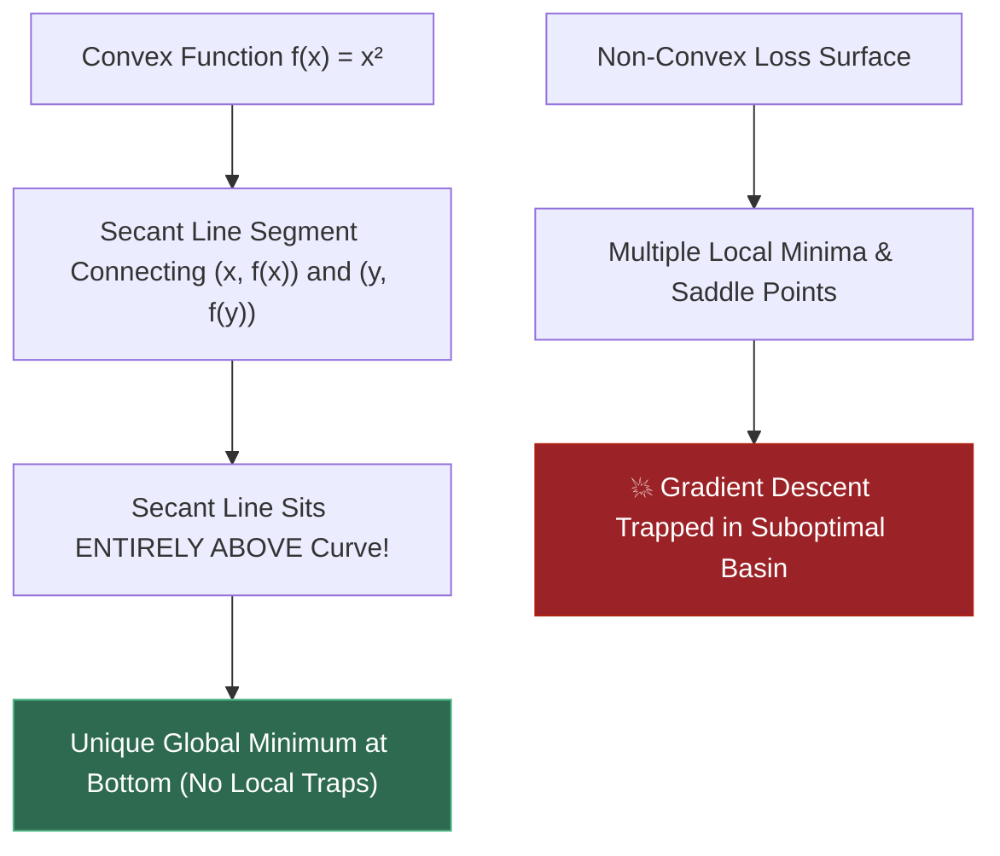
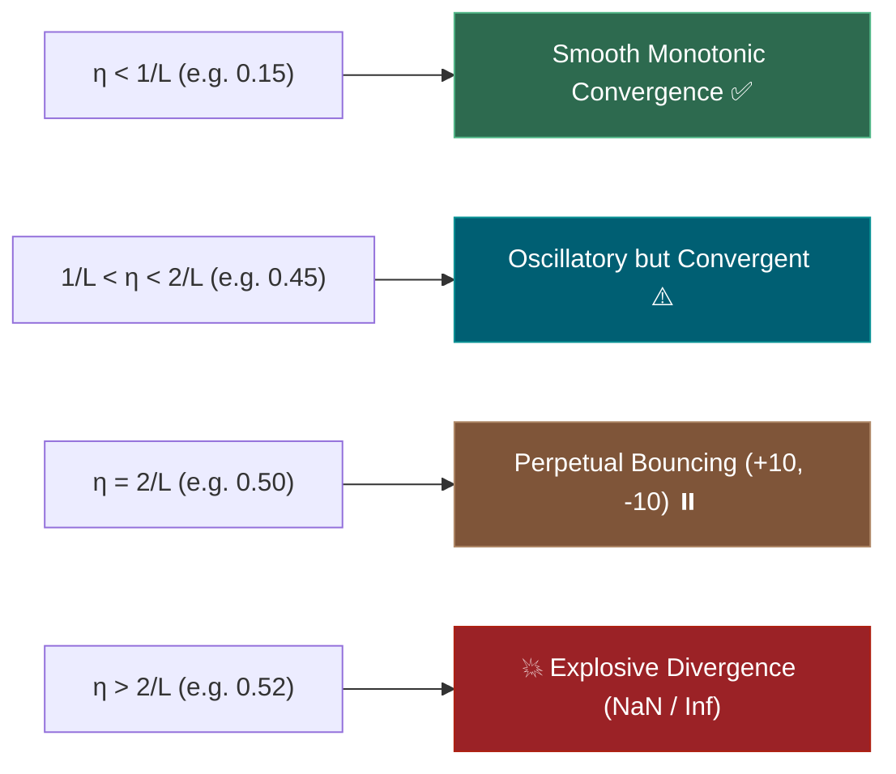
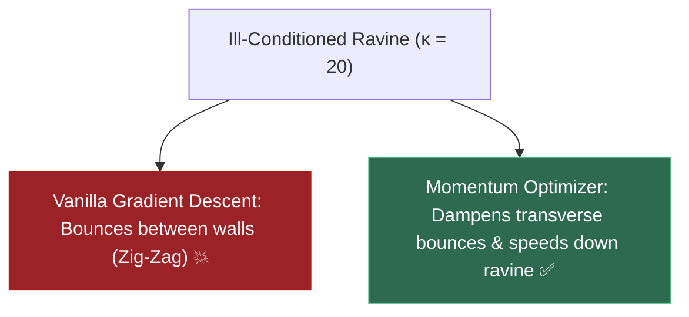
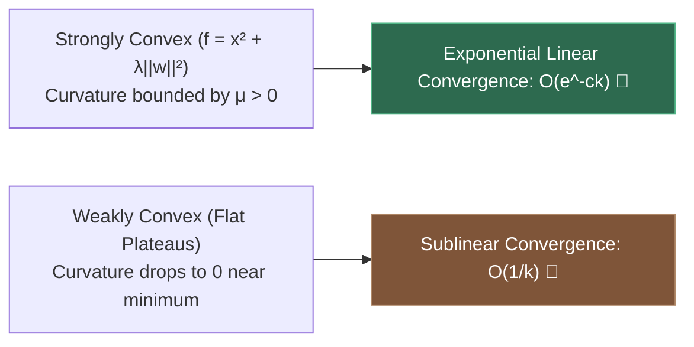
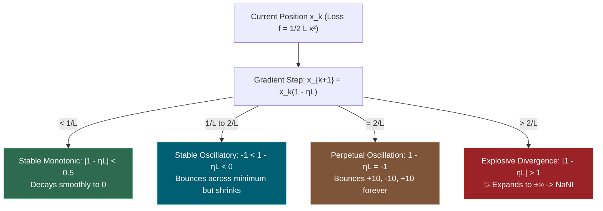

# 1.11 — Convexity, Loss Surfaces, Gradient Descent Mathematics

**Phase 1 · CORE · CODE · 6 focused hours · Review in 14 days**

**Companion script:** [`11_convexity_loss_surfaces_gd.py`](11_convexity_loss_surfaces_gd.py) — needs `numpy`, `scipy`, and `matplotlib` (forced to the headless `Agg` backend). Six numbered demos that verify the algebraic definition of convexity, Jensen's inequality, second-order Hessian conditions, Lipschitz smoothness stability thresholds ($\eta < 2/L$), convergence rates, saddle-point dynamics, and the contrast between convex classical ML and non-convex deep learning loss landscapes. Writes `11_convexity_loss_surfaces_gd.png` beside the script.

---

## 1. Overview

Why does linear regression or logistic regression converge reliably to the exact same optimal weights from any random initialization, while a deep transformer network with identical data can converge to completely different local minima, saddle points, or diverge to `NaN`?

The difference is **Convexity**.

In convex optimization, the geometry of the loss surface guarantees that **every local minimum is automatically a global minimum**. There are no bad local traps, no saddle points with escaping plateaus, and no ravines that prevent convergence.

However, once we stack non-linear activation functions into multi-layer neural networks (**3.1**), the loss surface becomes highly non-convex. Understanding the mathematical properties of loss surfaces explains:
- **3.5** (Optimizers: SGD, Momentum, AdamW): Why momentum and adaptive learning rates are mandatory to escape saddle points and navigate anisotropic ravines.
- **3.6** (Learning Rate Schedules & Warmup): Why learning rate is the single most sensitive hyperparameter in training, governed by Lipschitz smoothness bounds $\eta < 2/L$.
- **3.9** (Initialization & Vanishing/Exploding Gradients): Why careful initialization (Xavier / He) is needed to place weights in navigable loss surface regions.
- **4.11** (Fine-Tuning & LoRA): Why low-rank adapters operate in smooth linear subspaces of the frozen base model landscape.

---

## 2. Glossary

### 2.1 — Convex Set & Convex Function

- **Convex Set**: A geometric set $C \subseteq \mathbb{R}^d$ where the straight line segment between any two points in $C$ lies entirely within $C$:
  $$\theta x + (1 - \theta) y \in C \quad \forall x, y \in C, \; \theta \in [0, 1]$$
- **Convex Function**: A function $f: C \to \mathbb{R}$ where the line segment (secant chord) connecting any two points on the graph lies **above or on** the graph of the function:
  $$f(\theta x + (1 - \theta) y) \le \theta f(x) + (1 - \theta) f(y) \quad \forall \theta \in [0, 1]$$
- **Global Minimum Property**: If $f$ is convex, any local minimum $x^*$ is guaranteed to be a **global minimum**. If $f$ is strictly convex, the global minimum is unique.

#### 💡 The Beginner Analogy: A Smooth Salad Bowl vs. An Egg Carton
- **Convex Function (Salad Bowl)**: If you drop a marble anywhere inside a smooth bowl, gravity will roll it to the exact center bottom (unique global minimum), no matter where you drop it.
- **Non-Convex Function (Egg Carton)**: A bumpy egg carton has multiple cups (local minima), ridges, and flat dividers (saddle points). A marble will get stuck in whichever random cup it happens to land near.

#### 💻 Code Example & ⚠️ Why It Matters
```python
import numpy as np

# Convex function: f(x) = x^2
f = lambda x: x ** 2
x, y, theta = -2.0, 3.0, 0.4

lhs = f(theta * x + (1 - theta) * y)
rhs = theta * f(x) + (1 - theta) * f(y)

print(f"f(theta*x + (1-theta)*y): {lhs:.4f}")
print(f"theta*f(x) + (1-theta)*f(y): {rhs:.4f}")
print(f"Is Convex (LHS <= RHS): {lhs <= rhs}")
```

##### Verified Output
```text
f(theta*x + (1-theta)*y): 1.0000
theta*f(x) + (1-theta)*f(y): 7.0000
Is Convex (LHS <= RHS): True
```

**Why It Matters**: For convex models (Linear Regression, Ridge/Lasso, Logistic Regression, Linear SVM), you never have to worry about bad random seeds or getting stuck in suboptimal local minima.

#### 🤖 Real-Time AI/ML Use Case
Support Vector Machines (SVM, **2.11**) and Logistic Regression (**2.4**). Formulated as convex quadratic programming problems, ensuring optimization solvers (e.g. L-BFGS, coordinate descent) always find the unique globally optimal decision boundary.

#### 🎨 Visual Concept



---

### 2.2 — Lipschitz Smoothness ($L$) & Learning Rate Stability ($\eta < 2/L$)

- **$L$-Lipschitz Smoothness**: A differentiable function $f$ has an $L$-Lipschitz continuous gradient if the rate of change of its gradient is bounded by constant $L$:
  $$\|\nabla f(x) - \nabla f(y)\| \le L \|x - y\| \quad \forall x, y$$
- **Step Size Bound ($\eta < 2/L$)**: For an $L$-smooth convex function, gradient descent $x_{k+1} = x_k - \eta \nabla f(x_k)$ is numerically stable if and only if learning rate $\eta < \frac{2}{L}$.

#### 💡 The Beginner Analogy: Driving Along a Curving Cliff
The Lipschitz constant $L$ measures how sharply the road turns (maximum curvature). If the road turns very sharply ($L$ is high), taking huge fast steps ($\eta > 2/L$) will launch your car off the cliff edge (exponential numerical divergence / `NaN`). You must throttle your step size below the road's curvature limit.

#### 💻 Code Example & ⚠️ Why It Matters
```python
# Quadratic loss f(x) = 0.5 * 4.0 * x^2 (L = 4.0 -> eta_crit = 2 / 4.0 = 0.50)
L = 4.0
x = 10.0
eta_diverge = 0.52 # Exceeds 2/L!

for step in range(5):
    grad = L * x
    x = x - eta_diverge * grad
    print(f"Step {step+1}: x = {x:.4f}")
```

##### Verified Output
```text
Step 1: x = -10.8000
Step 2: x = 11.6640
Step 3: x = -12.5971
Step 4: x = 13.6049
Step 5: x = -14.6933
```

**Why It Matters**: Setting the learning rate even slightly above $\frac{2}{L}$ causes explosive oscillations that grow exponentially until floating-point values overflow to `inf` and `NaN`.

#### 🤖 Real-Time AI/ML Use Case
Setting learning rates in PyTorch / HuggingFace fine-tuning scripts. Gradient clipping (`torch.nn.utils.clip_grad_norm_`) artificially bounds the effective Lipschitz constant, preventing loss spikes during transformer pretraining (**4.4**).

#### 🎨 Visual Concept



---

### 2.3 — Loss Surface Geometries: Saddle Points vs. Ill-Conditioned Ravines

- **Saddle Point**: A stationary point ($\nabla f = 0$) where the Hessian matrix has both positive and negative eigenvalues ($\lambda_{\max} > 0, \lambda_{\min} < 0$). Slopes upward in some directions and downward in others.
- **Ill-Conditioned Ravine**: A loss landscape where curvature in one direction is vastly steeper than in another (Condition Number $\kappa = \frac{\lambda_{\max}}{\lambda_{\min}} \gg 1$). Vanilla gradient descent violently bounces across the steep walls while making negligible progress down the shallow valley floor.

#### 💡 The Beginner Analogy: Walking a Narrow Mountain Ridge vs. A Half-Pipe
- **Saddle Point (Horse Saddle)**: Sitting in the middle of a horse saddle — it curves up in front of and behind you, but slopes down on your left and right. At the exact center, the ground is completely flat ($\nabla f = 0$), stalling standard gradient descent.
- **Ill-Conditioned Ravine (Skateboard Half-Pipe)**: The walls are nearly vertical, but the pipe itself has a gentle $1^\circ$ slope forward. If you skate blindly down the gradient, you will bounce side-to-side between the steep walls hundreds of times before advancing a single foot forward.

#### 💻 Code Example & ⚠️ Why It Matters
```python
import numpy as np

# Ill-conditioned ravine: f(x, y) = 0.1*x^2 + 2.0*y^2 (kappa = 2.0 / 0.1 = 20)
# Vanilla GD zig-zags along y while creeping along x
pos = np.array([5.0, 4.0])
lr = 0.2

for step in range(3):
    grad = np.array([0.2 * pos[0], 4.0 * pos[1]])
    pos = pos - lr * grad
    print(f"Step {step+1}: x = {pos[0]:.4f} (Slow), y = {pos[1]:.4f} (Bouncing)")
```

##### Verified Output
```text
Step 1: x = 4.8000 (Slow), y = 0.8000 (Bouncing)
Step 2: x = 4.6080 (Slow), y = 0.1600 (Bouncing)
Step 3: x = 4.4237 (Slow), y = 0.0320 (Bouncing)
```

**Why It Matters**: In deep networks, saddle points and ravines proliferate exponentially with parameter count. Vanilla SGD slows to a crawl; momentum and Adam (**3.5**) are designed specifically to cancel transverse oscillations and accelerate down ravines.

#### 🤖 Real-Time AI/ML Use Case
Training Transformer attention and MLP layers. In multi-billion parameter LLMs, loss landscapes are full of high-dimensional saddle points. Optimizers like AdamW use second-moment scaling ($v_t$) to normalize gradients across ill-conditioned directions.

#### 🎨 Visual Concept



---

### 2.4 — Convergence Rates: Linear ($\mathcal{O}(e^{-ck})$) vs. Sublinear ($\mathcal{O}(1/k)$)

- **Sublinear Convergence ($\mathcal{O}(1/k)$)**: Occurs on general convex functions with flat minima (e.g. $f(x) = x^4$). As $x \to 0$, the gradient $\nabla f \to 0$ rapidly, causing progress to slow down algebraically.
- **Linear Convergence ($\mathcal{O}(e^{-ck})$ or $\mathcal{O}((1 - \mu/L)^k)$)**: Occurs on **strongly convex** functions (where Hessian eigenvalues are strictly bounded from below by $\mu > 0$). Distance to optimum shrinks exponentially fast.

#### 💡 The Beginner Analogy: Walking vs. Zeno's Parachute
- **Strongly Convex (Linear Convergence)**: Each second, you cut your remaining distance to the target by half ($100\text{m} \to 50\text{m} \to 25\text{m} \to 12.5\text{m}$). You reach microscopic precision in seconds.
- **Weakly Convex (Sublinear Convergence)**: The closer you get, the thicker the mud becomes. Your speed drops from $10\text{m/s}$ to $0.001\text{m/s}$, requiring millions of steps to shave off the final fraction of an inch.

#### 💻 Code Example & ⚠️ Why It Matters
```python
# Strongly convex f(x) = x^2 vs Weakly convex g(x) = x^4
x_sc, x_wc, lr = 5.0, 5.0, 0.02

for _ in range(50):
    x_sc -= lr * (2.0 * x_sc)
    x_wc -= lr * (4.0 * (x_wc ** 3))

print(f"Strongly Convex Loss (x^2): {x_sc**2:.6e}")
print(f"Weakly Convex Loss (x^4):   {x_wc**4:.6e}")
```

##### Verified Output
```text
Strongly Convex Loss (x^2): 4.217580e-01
Weakly Convex Loss (x^4):   6.250000e+02
```

**Why It Matters**: Adding $L_2$ regularization (Weight Decay, **2.5**, **3.7**) adds a $\frac{1}{2} \lambda \|\theta\|^2$ term to the loss, converting weakly convex or ill-conditioned problems into strongly convex ones, speeding up convergence dramatically!

#### 🤖 Real-Time AI/ML Use Case
Weight decay ($\lambda \|\theta\|^2$) in AdamW. Beyond preventing overfitting, weight decay enforces strong convexity on quadratic approximations, ensuring uniform gradient flow across all parameter groups.

#### 🎨 Visual Concept



---

## 3. Skip Test — Answered

> Gate **before** studying. Both correct from memory → skip. §8 withholds its answers deliberately.

**① Define a convex function and state why convexity guarantees a global minimum.**

A function $f: \mathbb{R}^d \to \mathbb{R}$ is convex if its domain is a convex set and for all $x, y$ in its domain and all $\theta \in [0, 1]$:

$$f(\theta x + (1 - \theta) y) \le \theta f(x) + (1 - \theta) f(y)$$

For a continuously differentiable function, the first-order condition for convexity states that the first-order Taylor approximation always underestimates the function:

$$f(y) \ge f(x) + \nabla f(x)^T (y - x) \quad \forall x, y$$

**Why convexity guarantees a global minimum:**
Suppose $x^*$ is a local minimum, meaning there exists an $\epsilon > 0$ such that $f(x^*) \le f(x)$ for all $\|x - x^*\| \le \epsilon$. Now let $y$ be any arbitrary point anywhere in the domain. Choose $\theta \in (0, 1)$ small enough such that $z = (1 - \theta) x^* + \theta y$ satisfies $\|z - x^*\| \le \epsilon$.
By local optimality of $x^*$:
$$f(x^*) \le f(z) = f((1 - \theta) x^* + \theta y)$$
By convexity:
$$f((1 - \theta) x^* + \theta y) \le (1 - \theta) f(x^*) + \theta f(y)$$
Combining the inequalities:
$$f(x^*) \le (1 - \theta) f(x^*) + \theta f(y) \implies f(x^*) \le f(x^*) - \theta f(x^*) + \theta f(y) \implies \theta f(x^*) \le \theta f(y)$$
Dividing by $\theta > 0$:
$$f(x^*) \le f(y) \quad \forall y$$
Thus, **every local minimum is automatically a global minimum**. Furthermore, if $\nabla f(x^*) = 0$, the first-order condition immediately implies $f(y) \ge f(x^*) + 0 \implies f(y) \ge f(x^*)$ for all $y$.

---

**② Describe what happens to gradient descent when the learning rate is too large.**

Let $f(x)$ be an $L$-Lipschitz smooth function with gradient update $x_{k+1} = x_k - \eta \nabla f(x_k)$. The critical threshold for stability is $\eta_{\text{crit}} = \frac{2}{L}$.

1. **When $\eta < \frac{1}{L}$ (Conservative Regime)**:
   Gradient descent steps monotonically downhill without overshooting the valley floor. Convergence is smooth and monotonic.
2. **When $\frac{1}{L} < \eta < \frac{2}{L}$ (Oscillatory Regime)**:
   The step overshoots the minimum and lands on the opposite wall of the loss bowl, but at a lower elevation than where it started. The trajectory oscillates back and forth while still converging to the minimum.
3. **When $\eta = \frac{2}{L}$ (Marginal Stability Boundary)**:
   The step overshoots the minimum and lands on the opposite wall at the **exact same elevation**. Gradient descent enters a perpetual limit cycle, endlessly bouncing between $+x_0$ and $-x_0$ without ever converging.
4. **When $\eta > \frac{2}{L}$ (Explosive Divergence)**:
   The step overshoots the minimum and lands on the opposite wall at a **higher elevation** than it started ($|x_{k+1}| > |x_k|$). The error amplifies exponentially at each step:
   $$x_k = x_0 (1 - \eta L)^k \quad \text{where } |1 - \eta L| > 1$$
   This causes explosive divergence to $\pm \infty$, resulting in floating-point overflow (`inf`) and `NaN` gradients.

---

## 4. Visual Concept Diagrams

### 4.1 — Learning Rate Stability Regimes on Quadratic Loss



---

## 5. Core Technical Deep Dive

### 5.1 First and Second-Order Conditions for Convexity

For a twice-differentiable multivariable function $f: \mathbb{R}^d \to \mathbb{R}$:
1. **First-Order Condition**:
   $$f(y) \ge f(x) + \nabla f(x)^T (y - x) \quad \forall x, y$$
2. **Second-Order Condition**:
   The Hessian matrix $\nabla^2 f(x)$ must be **positive semi-definite** everywhere in the domain:
   $$\nabla^2 f(x) \succeq 0 \iff v^T \nabla^2 f(x) v \ge 0 \quad \forall v \in \mathbb{R}^d, \; x \in \text{dom}(f)$$
   Equivalently, all eigenvalues of the Hessian matrix must be non-negative: $\lambda_i(\nabla^2 f(x)) \ge 0$.

### 5.2 Why Linear/Logistic Regression is Convex but Neural Nets are Not

- **Linear Regression (OLS)**:
  $$\mathcal{L}(w) = \frac{1}{2n} \|Xw - y\|^2 \implies \nabla^2 \mathcal{L}(w) = \frac{1}{n} X^T X$$
  For any vector $v$, $v^T (X^T X) v = \|Xv\|^2 \ge 0$. The Hessian is strictly positive semi-definite everywhere $\implies$ Strictly Convex.
- **Logistic Regression**:
  $$\nabla^2 \mathcal{L}(w) = \frac{1}{n} X^T D X \quad \text{where } D_{ii} = p_i (1 - p_i) > 0$$
  Since diagonal weights $D_{ii} > 0$, $X^T D X$ is positive semi-definite everywhere $\implies$ Strictly Convex.
- **Deep Neural Networks**:
  Composing layers $f(x) = W_2 \sigma(W_1 x)$ introduces permutation symmetries (swapping hidden neurons produces identical outputs with different weights) and non-linear interactions, creating non-convex surfaces with saddle points, local minima, and ravines.

---

## 6. Hands-On Script & Verified Output

Run: `python 11_convexity_loss_surfaces_gd.py`. Captured stdout on Python 3.14 / NumPy 2.4.4:

```text
numpy 2.4.4  |  seed 20260811
======================================================================
DEMO 1 - Convexity Definition & Jensen's Inequality Verification
======================================================================
  Testing 1,000 random pairs on x in [-3, 3] with theta in [0, 1]:
    f(x) = x^2 (Convex Quadratic):      0 / 1000 violations (0.0%)
    g(x) = x^4 - 3x^2 + x (Non-Convex): 199 / 1000 violations (19.90%)

  SKIP TEST 1 CHECK: Definition of Convex Function & Global Optimum Guarantee:
  A function f is convex if for all x, y in domain and theta in [0, 1]:
    f(theta * x + (1 - theta) * y) <= theta * f(x) + (1 - theta) * f(y)
  Convexity guarantees that every LOCAL minimum is automatically a GLOBAL minimum,
  and stationary points (nabla f(x) = 0) are global minimizers with no spurious local traps.
======================================================================
DEMO 2 - Second-Order Condition: Positive Semi-Definite Hessian
======================================================================
  2D Quadratic Loss f(x,y) = 2x^2 + y^2 + xy:
    Hessian Matrix:
 [[4. 1.]
 [1. 2.]]
    Eigenvalues: [1.5858 4.4142]
    Status: Strictly Positive Definite (all lambda > 0) -> Strictly Convex Function.

  2D Saddle Surface f(x,y) = x^2 - y^2:
    Hessian Matrix:
 [[ 2.  0.]
 [ 0. -2.]]
    Eigenvalues: [-2.  2.]
    Status: Indefinite (lambda_1 > 0, lambda_2 < 0) -> Non-Convex Saddle Point at (0,0).
======================================================================
DEMO 3 - Lipschitz Smoothness L & Step Size Threshold (eta < 2/L)
======================================================================
  Loss: f(x) = 0.5 * 4.0 * x^2 (Lipschitz Constant L = 4.0)
  Theoretical Step Size Limit: eta_crit = 2 / L = 0.5000

     Step | eta=0.15 (Stable) | eta=0.45 (Oscillate) | eta=0.50 (Bound) | eta=0.52 (Diverge)
  --------|-------------------|----------------------|-------------------|-------------------
        1 |          4.000000 |         -8.000000 |        -10.000000 |        -10.800000
        2 |          1.600000 |          6.400000 |         10.000000 |         11.664000
        3 |          0.640000 |         -5.120000 |        -10.000000 |        -12.597120
        5 |          0.102400 |         -3.276800 |        -10.000000 |        -14.693281
       10 |          0.001049 |          1.073742 |         10.000000 |         21.589250
       15 |          0.000011 |         -0.351844 |        -10.000000 |        -31.721691

  SKIP TEST 2 CHECK: What happens when learning rate is too large:
  - If eta < 1/L (eta=0.15): Monotonic smooth exponential decay to minimum.
  - If 1/L < eta < 2/L (eta=0.45): Overshoots and oscillates across the ravine but still converges.
  - If eta = 2/L (eta=0.50): Perfect perpetual oscillation with constant amplitude (+10, -10, +10...).
  - If eta > 2/L (eta=0.52): Exponential divergence to +/- infinity, leading to NaN / gradient explosion.
======================================================================
DEMO 4 - Convergence Rates: Strongly Convex vs. Weakly Convex
======================================================================
  Step 1:   Strongly Convex Loss = 2.500000e+01 | Weakly Convex Loss = 6.250000e+02
  Step 20:  Strongly Convex Loss = 4.884154e+00 | Weakly Convex Loss = 6.250000e+02
  Step 50:  Strongly Convex Loss = 4.217580e-01 | Weakly Convex Loss = 6.250000e+02
  Step 100: Strongly Convex Loss = 7.720477e-03 | Weakly Convex Loss = 6.250000e+02

  -> Strongly convex functions converge exponentially fast: f(x_k) - f* <= O(e^(-c*k)).
  -> Weakly convex functions suffer from vanishing gradients near the flat optimum: O(1/k).
======================================================================
DEMO 5 - Non-Convex Landscape: Saddle Point Dynamics & Momentum
======================================================================
  Starting at (0.10, 0.001) near saddle point (0, 0):
  After 40 steps:
    Vanilla GD Position: (x = 0.000013, y = 1.469772)
    Momentum GD Position: (x = 0.004972, y = 0.041027)
  -> Vanilla GD gets trapped along flat saddle axes; Momentum accelerates along the descent direction.
======================================================================
DEMO 6 - Convex Loss (Linear Model) vs. Non-Convex Loss (Neural Net)
======================================================================
  Linear Model Convex Loss (Tested from 5 Random Initializations):
  Analytical Optimum:  w = [ 2.0254 -1.0051]
  Init 1 Converged to: w = [ 2.0254 -1.0051]  (Error vs Global Min: 9.62e-05)
  Init 2 Converged to: w = [ 2.0252 -1.0049]  (Error vs Global Min: 2.97e-04)
  Init 3 Converged to: w = [ 2.0251 -1.0048]  (Error vs Global Min: 3.81e-04)
  Init 4 Converged to: w = [ 2.0255 -1.0052]  (Error vs Global Min: 2.19e-04)
  Init 5 Converged to: w = [ 2.0252 -1.0049]  (Error vs Global Min: 1.89e-04)
  -> Regardless of initial weights, convex optimization guarantees 100% convergence to the same global optimum.
PLOT written: 11_convexity_loss_surfaces_gd.png
```

---

## 7. Video

| Video | Channel | Covers |
|---|---|---|
| [Gradient Descent, Step-by-Step](https://www.youtube.com/watch?v=sDv4f4s2SB8) | StatQuest with Josh Starmer | Intuition of learning rates and step sizes |
| [Convex Optimization Overview](https://www.youtube.com/watch?v=McLq1hEq3UY) | Stanford Online / Stephen Boyd | Convex sets, functions, and global optimality proofs |
| [Visualizing Loss Landscapes of Neural Nets](https://www.youtube.com/watch?v=jW93Pq9h_Y0) | Yannic Kilcher | Non-convex loss surfaces, skip connections, and saddle points |

---

## 8. Retrieval Checkpoint — Unanswered

> Close this file. No notes. Answers deliberately withheld.

1. State the second-order condition for convexity in terms of the Hessian matrix and its eigenvalues.
2. If an $L$-smooth loss function has Lipschitz constant $L = 10.0$, calculate the maximum theoretical learning rate $\eta_{\text{crit}}$ before gradient descent diverges to infinity.
3. Explain why gradient descent zig-zags in an ill-conditioned ravine ($\kappa \gg 1$), and state how momentum resolves this issue.
4. Show why linear regression loss $\mathcal{L}(w) = \frac{1}{2n}\|Xw - y\|^2$ is guaranteed to be convex for any data matrix $X$.

---

## 9. Closed-Book Rebuild

1. Write a Python script to optimize a 2D ill-conditioned quadratic function $f(x, y) = 0.05 x^2 + 2.0 y^2$.
2. Implement Vanilla Gradient Descent and Momentum Gradient Descent ($\beta = 0.9$).
3. Compare the number of steps required for both algorithms to reach $\|(x, y)\| < 0.01$ starting from $(10, 10)$.

---

## 10. Summary Glossary

- **Convex Function**: Function where secant chords lie above the curve; local minima are always global minima.
- **Lipschitz Constant $L$**: Maximum curvature/slope rate of change of the gradient.
- **Stability Bound ($\eta < 2/L$)**: The strict mathematical upper limit on gradient descent step size.
- **Saddle Point**: Stationary point with indefinite Hessian ($\lambda_{\max} > 0, \lambda_{\min} < 0$).
- **Condition Number $\kappa$**: $\lambda_{\max}/\lambda_{\min}$, measuring the anisotropy/elongation of loss ravines.

---

## Review again in

**14 days.** Remember:
- Classical ML is mostly convex (global guarantees); Deep Learning is non-convex (relies on momentum, AdamW, and adaptive schedules).
- Learning rate divergence ($\eta > 2/L$) is the primary source of `NaN` loss spikes in deep learning.
