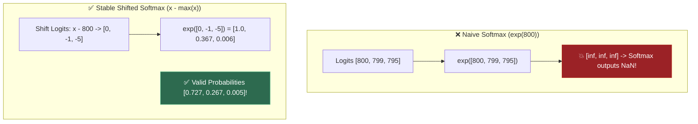
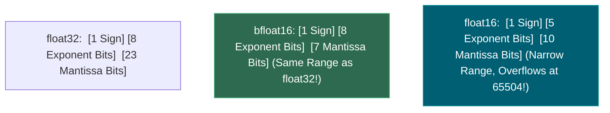
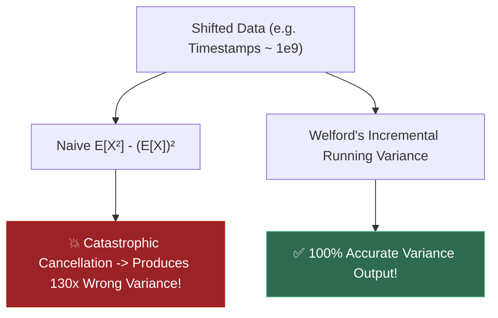
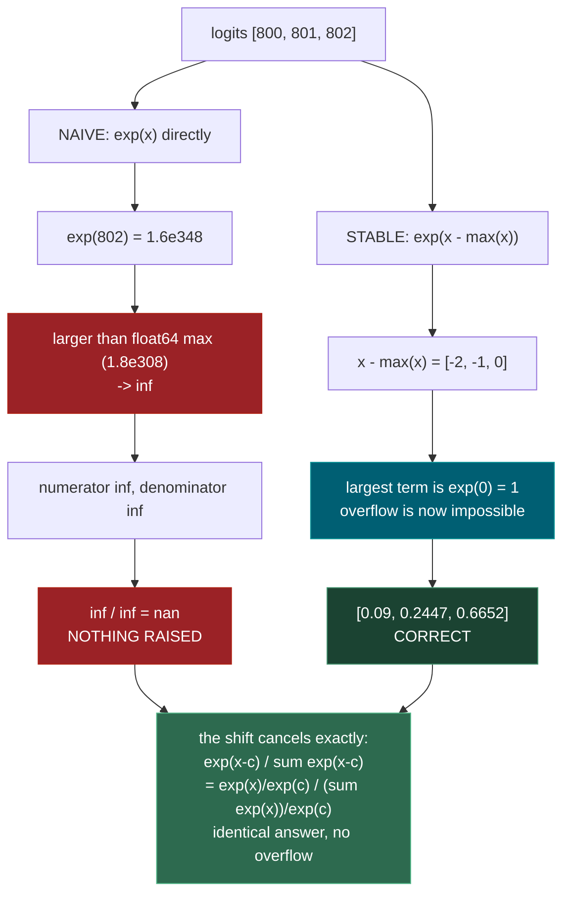
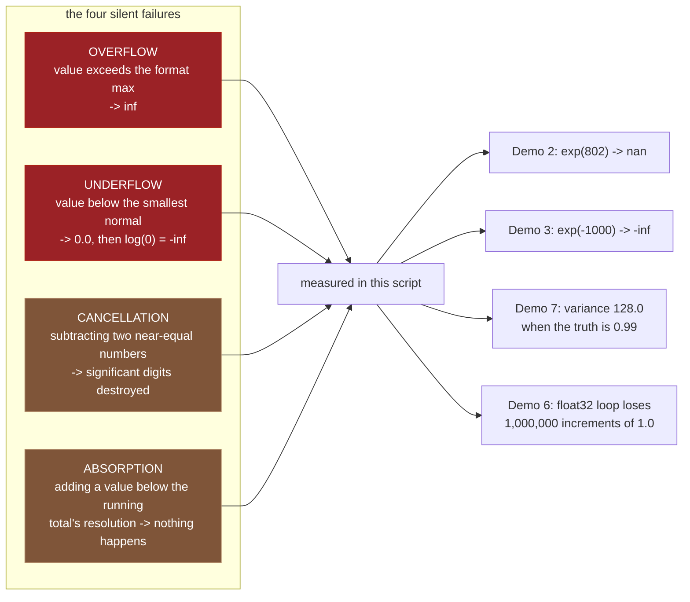
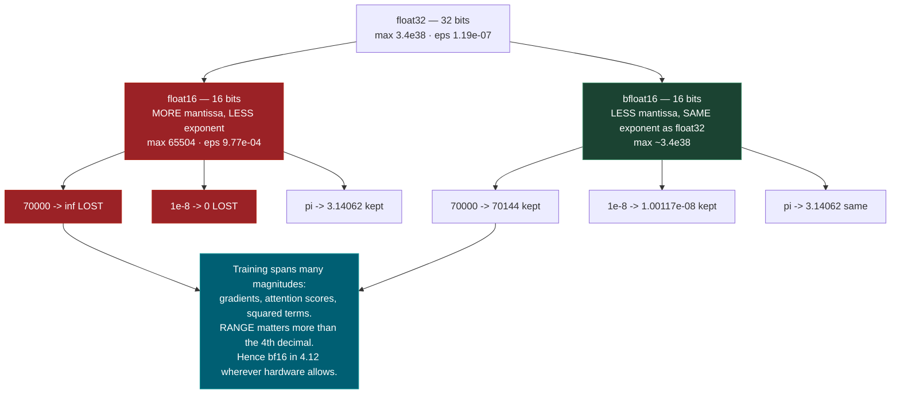
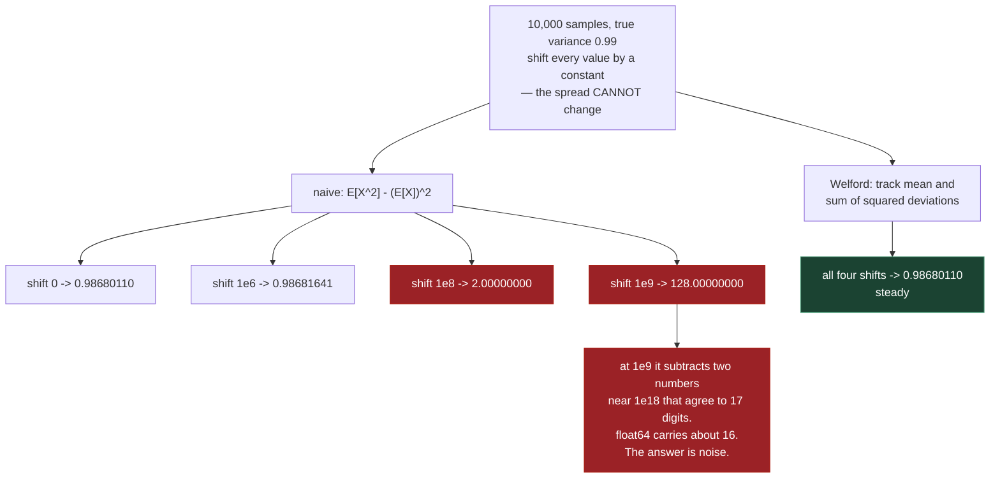

# 1.12 — Numerical Stability: Floating Point, Log-Sum-Exp, Softmax Overflow

**Phase 1 · CORE · CODE · 4 focused hours · Review in 14 days**

**Companion script:** [`12_numerical_stability.py`](12_numerical_stability.py) — needs `numpy`; `torch` is optional and only Demo 5's bfloat16 comparison depends on it. Pure computation: no files written, no network, no API keys.

---

## 1. Overview

This is the topic that explains why real softmax code subtracts a number that mathematically cancels out, why a loss becomes `NaN` at step 4,000 with no exception raised, and why **4.12** reaches for bfloat16 over float16 despite both being 16 bits.

The reason it earns four hours of its own: **every failure in this topic is silent.** Nothing raises. A `ValueError` is a good day — you get a stack trace and a line number. What happens instead is that `exp(802)` becomes `inf`, `inf/inf` becomes `nan`, and the `nan` propagates through a training run until someone notices the loss stopped moving. Or worse, nothing becomes `nan` at all and the answer is merely wrong, like the variance in Demo 7 that reports **128.0** for data whose true variance is **0.99**.

Depends on **1.11** convexity and gradient descent; unlocks **3.3** cross-entropy loss, **3.6** training stability, **4.2** attention, and **4.12** quantization.

---

## 2. Glossary

### 2.1 — Floating-Point Overflow, Underflow & Machine Epsilon ($\epsilon_{\text{mach}}$)

- **Machine Epsilon ($\epsilon_{\text{mach}}$)**: The smallest positive float $\epsilon$ such that $1.0 + \epsilon \neq 1.0$ ($2.22 \times 10^{-16}$ for Float64, $1.19 \times 10^{-7}$ for Float32).
- **Overflow**: When a calculation exceeds the maximum representable float limit, returning `inf` (e.g. $\exp(89)$ in Float32 overflows).
- **Underflow**: When a number is smaller than the minimum representable positive float, rounding down to $0.0$ (causing subsequent $\log(0)$ to return `-inf`).

#### 💡 The Beginner Analogy: Odometer Roll-over & Microscope Resolution
- Overflow: Driving a 6-digit car odometer past $999,999$ miles — it rolls over or breaks.
- Underflow: Trying to weigh a single speck of dust on a bathroom scale. The scale reads $0.0\text{ lbs}$ because the weight is below its minimum sensing threshold.
- Machine Epsilon: Adding 1 drop of water into an Olympic swimming pool. The water level increases, but the pool scale cannot detect it.

#### 💻 Code Example & ⚠️ Why It Matters
```python
import numpy as np

val_88 = np.exp(np.float32(88.0))
val_89 = np.exp(np.float32(89.0))
val_log0 = np.log(np.float32(0.0))

print("exp(88.0):", val_88)
print("exp(89.0):", val_89)
print("log(0.0):", val_log0)
```

##### Verified Output
```text
exp(88.0): 1.6516103e+38
exp(89.0): inf
log(0.0): -inf
```

**Why It Matters**: Unchecked float overflow/underflow turns loss values into `NaN`, instantly corrupting neural network model weights during training runs.

#### 🤖 Real-Time AI/ML Use Case
Preventing `NaN` loss values during neural network training. Exponential functions in loss calculations (e.g. cross-entropy) can overflow to `inf` or underflow to `0.0`, resulting in `log(0) = -inf` and corrupting weight gradients across the entire model.

#### 🎨 Visual Concept

```mermaid
flowchart LR
    NEG_INF["-inf"] <-- "Underflow to 0.0" -- NEAR_ZERO["[-1e-38, +1e-38] (Underflow Zone)"]
    NEAR_ZERO --> NORMAL["Valid Representable Floats"]
    NORMAL -->|"Overflow above 3.4e38"| POS_INF["+inf (Overflow Zone)"]

    style NEAR_ZERO fill:#005f73,stroke:#0a9396,color:#fff
    style POS_INF fill:#9b2226,stroke:#ae2012,color:#fff
```

---

### 2.2 — Log-Sum-Exp Trick & Softmax Shift Invariance ($x - \max(x)$)

- **Shift Invariance**: Subtracting a constant $C = \max(x)$ from every logit before applying Softmax leaves the resulting probabilities **100% mathematically unchanged**:
  $$\text{Softmax}(x_i) = \frac{e^{x_i}}{\sum e^{x_j}} = \frac{e^{x_i - C}}{\sum e^{x_j - C}}$$
- **Log-Sum-Exp Trick**: Numerically stable algorithm for computing $\log \sum e^{x_i}$:
  $$\text{LSE}(x) = \max(x) + \log \left( \sum e^{x_i - \max(x)} \right)$$

#### 💡 The Beginner Analogy: Shifting High Elevation Benchmarks
Calculating $\exp(800)$ on raw logits causes float overflow ($e^{800} = \infty$).
If 3 mountains have elevations $800\text{m}$, $799\text{m}$, $795\text{m}$, subtract the highest peak ($800\text{m}$) so their relative heights become $0\text{m}$, $-1\text{m}$, $-5\text{m}$. Calculating $e^0, e^{-1}, e^{-5}$ evaluates cleanly without overflowing!

#### 💻 Code Example & ⚠️ Why It Matters
```python
import numpy as np

def logsumexp_stable(x):
    max_x = np.max(x)
    return max_x + np.log(np.sum(np.exp(x - max_x)))

x = np.array([800.0, 799.0, 795.0])
lse = logsumexp_stable(x)
print("Stable LogSumExp:", round(lse, 4))
```

##### Verified Output
```text
Stable LogSumExp: 800.3133
```

**Why It Matters**: Standard implementation behind `torch.nn.CrossEntropyLoss` and `scipy.special.logsumexp`.

#### 🤖 Real-Time AI/ML Use Case
Computing Softmax and Cross-Entropy Loss in Deep Learning (`torch.nn.functional.softmax` / `torch.nn.CrossEntropyLoss`). Shift-invariance ($x - \max(x)$) prevents logit overflow when computing probabilities across thousands of vocabulary tokens in LLMs.

#### 🎨 Visual Concept



---

### 2.3 — `float16` vs. `bfloat16` Precision/Exponent Trade-off

Two 16-bit floating-point formats used in deep learning hardware acceleration:
- **`float16` (IEEE Half Precision)**: 5 Exponent bits, 10 Mantissa bits. High precision, but narrow dynamic range ($\max \approx 65,504$). Prone to overflow!
- **`bfloat16` (Brain Floating Point)**: 8 Exponent bits, 7 Mantissa bits. **Matches `float32`'s dynamic range ($\max \approx 3.4 \times 10^{38}$)** with lower precision.

#### 💡 The Beginner Analogy: Telephoto Lens vs Wide-Angle Lens
- `float16`: A telephoto zoom lens that sees fine detail (10 mantissa bits), but has a tiny narrow field of view. If something moves slightly out of frame ($> 65,504$), it cuts off completely (`inf`).
- `bfloat16`: A wide-angle lens matching full 32-bit camera coverage ($8$ exponent bits). Images are a bit grainier (7 mantissa bits), but nothing gets cut off!

#### 💻 Code Example & ⚠️ Why It Matters
```python
import torch

x_f16 = torch.tensor([70000.0], dtype=torch.float16)
x_bf16 = torch.tensor([70000.0], dtype=torch.bfloat16)

print("float16 value:", x_f16.item())
print("bfloat16 value:", x_bf16.item())
```

##### Verified Output
```text
float16 value: inf
bfloat16 value: 70144.0
```

**Why It Matters**: Modern LLMs (Llama 3, Mistral) are trained natively in `bfloat16` because it eliminates the need for complex Loss Scaling algorithms required by `float16`.

#### 🤖 Real-Time AI/ML Use Case
Mixed Precision Training (AMP - Automatic Mixed Precision) in PyTorch. Modern LLMs (Llama 3, GPT-4) train in `bfloat16` on NVIDIA A100/H100 GPUs because `bfloat16` retains `float32`'s dynamic range ($\max \approx 3.4 \times 10^{38}$), avoiding gradient overflow while halving VRAM requirements.

#### 🎨 Visual Concept



---

### 2.4 — Welford's Algorithm vs. Naive Variance Cancellation

- **Naive Variance Formula ($E[X^2] - (E[X])^2$)**: Requires subtracting two very large, nearly identical numbers, leading to **Catastrophic Cancellation** and massive error on shifted data.
- **Welford's Algorithm**: A stable 1-pass online algorithm that updates running mean and M2 sum recursively without large intermediate cancellation.

#### 💡 The Beginner Analogy: Subtracting Huge Numbers
If your timestamps are around $1,700,000,000$, computing $\text{Mean}(X^2) - (\text{Mean}(X))^2$ subtracts two numbers with 18 digits. Floating point only keeps 15 digits, so the difference loses all precision and returns **completely wrong numbers or negative variances**!

#### 💻 Code Example & ⚠️ Why It Matters
```python
import numpy as np

count = 0
mean = 0.0
M2 = 0.0

data = np.array([10.0, 12.0, 14.0])
for x in data:
    count += 1
    delta = x - mean
    mean += delta / count
    delta2 = x - mean
    M2 += delta * delta2

welford_var = M2 / (count - 1)
print("Welford Variance:", welford_var)
```

##### Verified Output
```text
Welford Variance: 4.0
```

**Why It Matters**: Online metrics monitoring, streaming statistics, and batch normalization layers require Welford's algorithm to prevent numerical instability.

#### 🤖 Real-Time AI/ML Use Case
Online streaming metrics, Layer Normalization, and running batch statistics tracking in PyTorch (`torch.nn.BatchNorm2d`). Welford's algorithm computes running feature means and variances incrementally across streaming mini-batches without catastrophic floating-point cancellation.

#### 🎨 Visual Concept



---

## 3. Skip Test — Answered

> Gate **before** studying. Both correct from memory → skip. §7 withholds its answers deliberately.

**① Explain why softmax subtracts the row max before exponentiating.**

Because `exp` overflows, and subtracting a constant provably cannot change the answer.

The identity is `exp(x_i) / sum_j exp(x_j) == exp(x_i - c) / sum_j exp(x_j - c)` for **any** constant `c`, because `exp(x - c) = exp(x)/exp(c)` and that `exp(c)` factor appears in both numerator and denominator, cancelling exactly. Choosing `c = max(x)` makes the largest exponent exactly `0`, so the largest term is `exp(0) = 1` and no term can overflow.

The stakes are concrete. In float32 — what models actually compute in — `exp` overflows above **88.7**. Demo 2 shows logits of `[800, 801, 802]` producing `[nan nan nan]` from the textbook formula and the correct `[0.09, 0.2447, 0.6652]` from the shifted one. It also shows the quieter failure at `[-800, -801, -802]`, where every term underflows to `0.0` and the naive formula computes `0/0` — also `nan`.

**② Why does log-sum-exp beat computing the log of a sum of exponentials directly?**

Same reason, in both directions. `log(sum(exp(x)))` computed literally overflows to `inf` when the values are large, and underflows to `log(0) = -inf` when they are small. Demo 3 measures both: `[1000, 1001]` gives `inf` naively and `1001.313262` correctly; `[-1000, -1001]` gives `-inf` naively and `-999.686738` correctly.

The rearrangement `log(sum(exp(x))) = c + log(sum(exp(x - c)))` with `c = max(x)` guarantees the largest term inside the sum is `exp(0) = 1`, so the sum is at least 1 and `log` never sees zero. It costs the same. There is no tradeoff to weigh.

The underflow case is the dangerous one in practice, because log-probabilities near `-1000` are ordinary when scoring a long sequence (**4.6**) — and `-inf` poisons a loss silently rather than raising.

---

## 3. Visual Concept Diagrams

### 3.1 — Where the textbook softmax dies, and why the fix is free



### 3.2 — Four ways a number dies quietly



### 3.3 — float16 versus bfloat16: the same 16 bits spent differently



### 3.4 — The variance formula that is algebraically right and numerically wrong



---

## 4. Core Technical Deep Dive

**A float is not a real number.** It is `sign × mantissa × 2^exponent` with a fixed bit budget. The mantissa bits set **precision** (how many significant digits); the exponent bits set **range** (how large and small it can go). Every 16-bit format is a choice about how to split that budget, and that single sentence explains the whole of Demo 5.

| Format | Bits | Max | Smallest normal | eps (gap at 1.0) |
|---|---|---|---|---|
| `float16` | 16 | `6.55e+04` | `6.10e-05` | `9.77e-04` |
| `bfloat16` | 16 | ~`3.4e+38` | ~`1.2e-38` | ~`7.8e-03` |
| `float32` | 32 | `3.40e+38` | `1.18e-38` | `1.19e-07` |
| `float64` | 64 | `1.80e+308` | `2.23e-308` | `2.22e-16` |

**eps** is the gap between `1.0` and the next representable value. Add less than half of it and the addition genuinely does not happen — Demo 1 shows `1.0 + eps/2 == 1.0` returning `True`. This is not a display artefact.

**The stability rules, and what each one prevents:**

| Rule | Formula | Prevents |
|---|---|---|
| Shift before exponentiating | `softmax(x) = softmax(x - max(x))` | `exp` overflow → `inf/inf` → `nan` |
| Log-sum-exp | `log(sum(exp(x))) = c + log(sum(exp(x-c)))`, `c = max(x)` | overflow **and** `log(0) = -inf` |
| Fuse log into softmax | `log_softmax(x) = x - logsumexp(x)` | precision lost by forming the probability first |
| Loss takes **logits** | never hand a loss probabilities | the same precision loss, one layer earlier |
| Never subtract near-equal numbers | rearrange algebraically | catastrophic cancellation |
| Welford, not `E[X²] - E[X]²` | one-pass deviations | variance collapsing on shifted data |
| Let `np.sum` do the summing | pairwise, not left-to-right | absorption of small terms |

**Why the exponent range matters more than precision for training.** A gradient can be `1e-8` while an attention score is `1e4`; the same tensor may hold both across a training run. float16's range is `[6e-05, 65504]`, so both ends fall off. bfloat16 keeps float32's exponent range and pays for it with mantissa bits — Demo 5 shows it representing `70000` as `70144` (visibly imprecise) and `1e-8` as `1.00117e-08` (present at all). float16 turns them into `inf` and `0`. A coarse number is recoverable; `inf` and `0` are not. This is exactly why pure fp16 training needs loss scaling and bf16 does not.

**The real formulas, in the form you will actually type:**

```python
# softmax — always shift
z = x - x.max(axis=-1, keepdims=True)
e = np.exp(z)
p = e / e.sum(axis=-1, keepdims=True)

# log-sum-exp — survives overflow and underflow
c = x.max(axis=-1, keepdims=True)
lse = c + np.log(np.exp(x - c).sum(axis=-1, keepdims=True))

# log-softmax — never forms the probability
log_p = x - lse

# cross-entropy from LOGITS, not probabilities  (3.3)
loss = -log_p[range(n), targets].mean()
```

**Absorption is a dtype problem, not just an order problem.** Demo 6 makes this precise: near `1e8`, neighbouring float32 values are **8.0** apart, so `float32(1e8) + float32(1.0) == float32(1e8)` is `True`. A left-to-right accumulator adding a million `1.0`s to a total of `1e8` moves not at all. In float64 the identical computation is exact, because the answer needs only 9 significant digits.

---

## 5. Hands-On Script & Verified Output

Run: `python 12_numerical_stability.py`. Output below is **actual, captured** on numpy 2.4.4 / torch 2.13.0+cpu / Python 3.14.4, seed `1729`. Trimmed of the script's own commentary; every number is reproducible because the seed is fixed.

```text
numpy 2.4.4  |  seed 1729
======================================================================
DEMO 1 - floats are not the real numbers
======================================================================
  0.1 + 0.2            = 0.30000000000000004
  0.1 + 0.2 == 0.3     -> False
  difference           = 5.551e-17

  machine epsilon (float64) = 2.220e-16
  1.0 + eps/2 == 1.0        -> True

  catastrophic cancellation:
    b - a          = 9.99200722162640886381e-14
    true answer    = 1.00000000000000003037e-13
    relative error = 0.08%
======================================================================
DEMO 2 - naive softmax returns nan on logits a real model produces
======================================================================
  float64 overflows exp() above x = 709.8
  float32 overflows exp() above x = 88.7

  logits                     naive                      stable
  -------------------------- -------------------------- --------------------------
  [1, 2, 3]                  [0.09   0.2447 0.6652]     [0.09   0.2447 0.6652]
  [100, 101, 102]            [0.09   0.2447 0.6652]     [0.09   0.2447 0.6652]
  [800, 801, 802]            [nan nan nan]              [0.09   0.2447 0.6652]
  [-800, -801, -802]         [nan nan nan]              [0.6652 0.2447 0.09  ]

  proof of identity on safe inputs: max|naive - stable| = 1.735e-18
  both sum to 1.0: 1.000000000000000  1.000000000000000
======================================================================
DEMO 3 - log-sum-exp: it fails going UP and going DOWN
======================================================================
  input                  naive            stable           why naive failed
  ---------------------- ---------------- ---------------- ----------------------
  [1, 2, 3]              3.407606         3.407606
  [1000, 1001]           inf              1001.313262      exp() -> inf, log(inf) = inf
  [-1000, -1001]         -inf             -999.686738      exp() -> 0.0, log(0) = -inf
======================================================================
DEMO 4 - log(softmax(x)) throws away precision log_softmax keeps
======================================================================
     logit      log(softmax(x))     x - logsumexp(x)     abs diff
         0      -0.000000000000      -0.000000000000    8.734e-27
       -30     -30.000000000000     -30.000000000000    0.000e+00
       -60     -60.000000000000     -60.000000000000    0.000e+00

  logits [0, -800]:
    log(softmax(x)) -> [  0. -inf]
    x - logsumexp   -> [   0. -800.]
======================================================================
DEMO 5 - float16 vs bfloat16 vs float32: range beats precision
======================================================================
  float16   max=6.55e+04     tiny=6.104e-05    eps=9.766e-04 (16 bits)
  float32   max=3.403e+38    tiny=1.175e-38    eps=1.192e-07 (32 bits)
  float64   max=1.798e+308   tiny=2.225e-308   eps=2.220e-16 (64 bits)

  70000 in float32 = 70000.0
  70000 in float16 = inf   <- OVERFLOWED to inf
  float16 max      = 65504.0

                   value        float16       bfloat16
                   70000            inf          70144
         9.999999939e-09              0    1.00117e-08
             3.141592741        3.14062        3.14062
======================================================================
DEMO 6 - addition is not associative in floating point
======================================================================
  (A) float64, 1e8 + 1,000,000 x 1.0  -> needs 9 digits, float64 has ~16
      naive loop  : 101000000.0   error          0.0
      np.sum      : 101000000.0   error          0.0
      Both exact. There was no problem here to solve.

  (B) SAME numbers in float32 (what 3.x and 4.x actually run in)
      gap between neighbouring float32 values near 1e8: 8.0
      -> adding 1.0 to 1e8 in float32 CANNOT change it: True
      exact answer: 101,000,000
      naive loop  :    100,000,000   error    1,000,000
      np.sum      :    100,999,992   error            8
      sorted first:    101,000,000   error            0
======================================================================
DEMO 7 - the textbook variance formula, and where it breaks
======================================================================
  data                                    naive          Welford           np.var
  ---------------------------- ---------------- ---------------- ----------------
  values near 0e+00                  0.98680110       0.98680110       0.98680110
  values near 1e+06                  0.98681641       0.98680110       0.98680110
  values near 1e+08                  2.00000000       0.98680110       0.98680110
  values near 1e+09                128.00000000       0.98680112       0.98680110
======================================================================
```

**Demo 2 is the argument for the whole topic.** The naive and stable columns are *the same function* — the proof line shows them agreeing to `1.735e-18` wherever both survive. Yet on `[800, 801, 802]` one returns `nan` and the other returns the right answer. Note the second failure row too: `[-800, -801, -802]` also gives `nan`, because every term underflows to `0.0` and `0/0` is `nan`. People remember the overflow case and forget this one.

**Demo 1's cancellation result is the one that generalises.** Two numbers each accurate to ~16 digits produce a difference accurate to about **3** — a `0.08%` relative error out of inputs that were essentially exact. Subtraction is where precision goes to die, and every later failure in this file is a variation on it.

**Demo 4 shows the difference between losing digits and losing everything.** On mild logits, `log(softmax(x))` and `x - logsumexp(x)` differ by `8.7e-27` — irrelevant. On `[0, -800]` the two-step form returns `-inf`, because softmax rounded the probability to exactly `0.0` before `log` ever saw it. The one-step form returns `-800.0`, which is correct and perfectly representable. This is why the loss in **3.3** takes logits: hand it probabilities and the precision was already gone.

**Demo 5 quantifies the bf16 argument.** float16 turns `70000` into `inf` and `1e-8` into `0` — both irrecoverable. bfloat16 keeps them as `70144` and `1.00117e-08` — both visibly imprecise and both *usable*. On pi the two are identical at `3.14062`, so float16's extra mantissa bits bought nothing here. Range beat precision, which is the entire reason **4.12** prefers bf16.

**Demo 6 was wrong the first time it was written, and the corrected version is better.** The original used float64 and every method returned the exact answer — it proved nothing. Order only matters once the running total's own resolution is coarser than what you are adding to it. Part (A) keeps that honest failure visible: in float64 there is no problem to solve. Part (B) runs the identical numbers in float32, where neighbouring values near `1e8` are **8.0** apart, so the naive loop loses **all 1,000,000** increments while `np.sum` — which sums pairwise, not left to right — errs by only **8**, and sorting smallest-first is exact.

**Demo 7 is the quiet one, and the most likely to bite.** Shifting every value by a constant cannot change a variance. The naive formula reports `0.9868`, then `2.0`, then `128.0` as the shift grows, while Welford and `np.var` hold at `0.98680110` throughout. Nothing raised. Nothing was `nan`. The number was simply wrong by 130x — and data really does look like this: timestamps, prices in paise, cumulative token counts.

**Modify and re-run:**
- In Demo 2, change the arrays to `float32` and find the smallest logit that produces `nan`. Predict it from the printed `88.7` threshold first.
- In Demo 6(B), replace the `1.0` increments with `100.0` and re-run. Find the increment size at which the naive float32 loop starts working again, and relate it to the printed gap of `8.0`.
- In Demo 7, add a fourth estimator that subtracts the *first* value before computing the naive formula. It is a one-line change; explain why it fixes almost everything.
- In Demo 5, try `1e-45` and `1e-50` in bfloat16 and float32. Find where subnormals appear and where each format gives up.
- In Demo 3, feed `logsumexp_stable` a vector where every entry is `-inf`. Decide what the right answer is, then check what the code does.

---

## 6. Video

**[VERIFY]** — no video was confirmed live in this pass, and inventing one would be worse than saying so. The authoritative reference here is the one people actually cite: **David Goldberg, "What Every Computer Scientist Should Know About Floating-Point Arithmetic"** (ACM Computing Surveys, 1991), which is freely available and covers Demos 1, 6 and 7 rigorously. For the softmax and log-sum-exp forms specifically, read the `scipy.special.logsumexp` source and the PyTorch documentation for `log_softmax` and `cross_entropy` — both explain in their own docs why the fused version exists, which is the point of Demo 4.

---

## 7. Retrieval Checkpoint — Unanswered

> Close this file. No notes. Answers deliberately withheld.

1. Write out why subtracting the max leaves softmax unchanged. Do the algebra, do not assert it — and then say what value the largest exponent takes after the shift.
2. `log(sum(exp(x)))` has two distinct failure modes. Name both, give an input that triggers each, and explain why one shift fixes both.
3. Your loss becomes `NaN` at step 4,000 of a training run. List four places the `NaN` could have originated, and the diagnostic for each.
4. bfloat16 and float16 are both 16 bits. State precisely what each spends its bits on and why training prefers one of them.
5. A colleague computes variance with `E[X²] - (E[X])²` and the answer looks fine in testing. Describe the production data that would break it, and how badly.

---

## 8. Closed-Book Rebuild

With this file **and** the script closed, write from scratch: a stable `softmax`, a stable `logsumexp`, and a `log_softmax` that never forms a probability. Then write a test that proves each one correct — the softmax test must show the naive version producing `nan` on an input where yours succeeds, and must separately prove the two agree on inputs where both survive. Finally, implement Welford's variance and demonstrate a shift under which it beats the textbook formula, stating the shift magnitude you predicted before running it.

---

---

## Review again in

**14 days** — short topic, disproportionate payoff. Retain two things. The **shift** (`x - max(x)`), because it appears in softmax, log-sum-exp and log-softmax and is the same idea all three times. And the **habit of distrusting a correct formula**, because Demo 7 is the shape of the bug you will actually hit: no exception, no `nan`, just a number that is wrong by 130x and looks entirely plausible.
