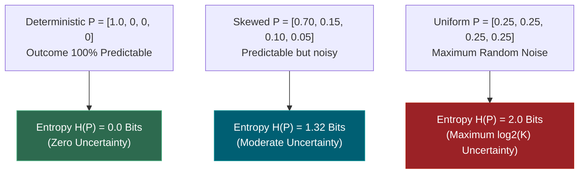
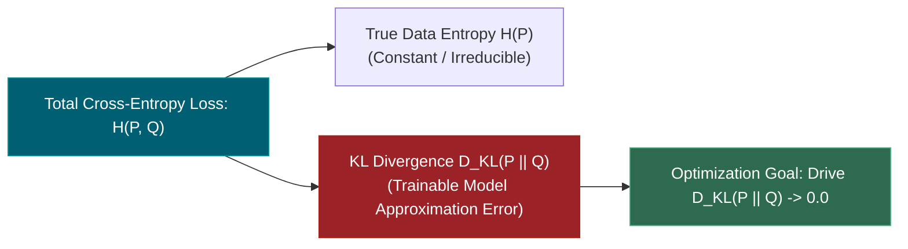
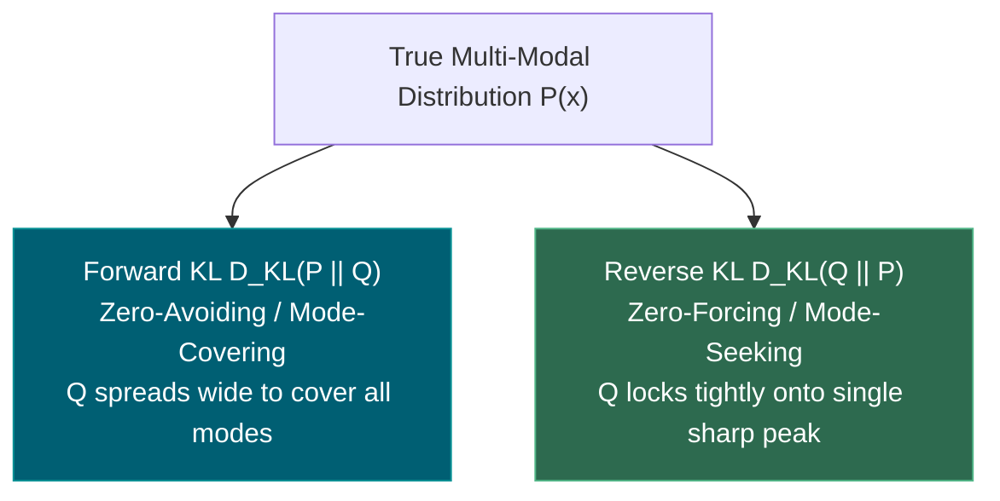
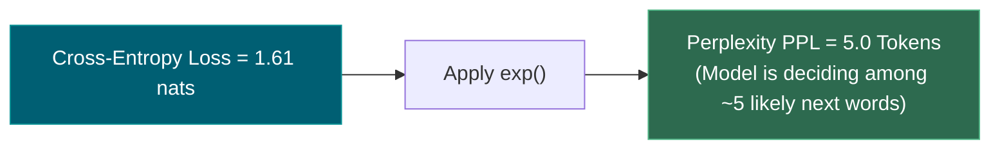
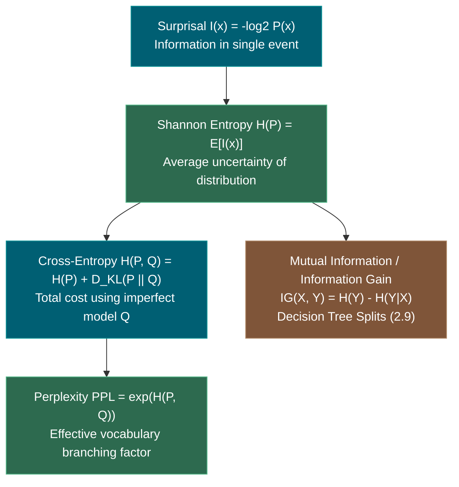

# 1.13 — Information Theory: Entropy, KL Divergence, Perplexity

**Phase 1 · CORE · CODE · 5 focused hours · Review in 14 days**

**Companion script:** [`13_information_theory_entropy_kl.py`](13_information_theory_entropy_kl.py) — needs `numpy`, `scipy`, and `matplotlib` (forced to the headless `Agg` backend). Six numbered demos that verify the fundamentals of Shannon entropy, cross-entropy decomposition, Gibbs' inequality, the asymmetry of Forward vs. Reverse KL divergence, language model Perplexity ($\text{PPL}$), temperature scaling dynamics (**4.6**), and Decision Tree information gain (**2.9**). Writes `13_information_theory_entropy_kl.png` beside the script.

---

## 1. Overview

Information theory is the mathematical language of uncertainty, compression, and probability distance.

When training and evaluating modern AI models, nearly every metric and loss function is an information-theoretic quantity in disguise:
- **Cross-Entropy Loss** ($H(P, Q)$): The objective minimized by every classification model (**2.4**, **3.3**) and every autoregressive LLM (**4.4**).
- **Kullback-Leibler (KL) Divergence** ($D_{KL}(P \parallel Q)$): The fundamental measure of statistical discrepancy between two distributions. In **4.11** (RLHF & DPO), a reverse-KL penalty prevents fine-tuned models from drifting into gibberish or mode-collapsing away from the base reference model.
- **Perplexity ($\text{PPL} = \exp(\text{Cross-Entropy})$)**: The universal standard benchmark for language model capability and compression efficiency (**4.6**).
- **Information Gain ($IG(T, a) = H(T) - H(T|a)$)**: The splitting criterion used in Decision Trees (**2.9**) and Random Forests (**2.10**) to find the most informative features.

---

## 2. Glossary

### 2.1 — Shannon Entropy ($H(P)$) & Surprisal ($I(x)$)

- **Self-Information / Surprisal ($I(x)$)**: The amount of information learned from observing event $x$ with probability $P(x)$:
  $$I(x) = -\log_2 P(x) \quad \text{(in bits)}$$
  Rare events provide high surprisal; guaranteed events provide zero surprisal.
- **Shannon Entropy ($H(P)$)**: The expected surprisal (average uncertainty) across all possible outcomes of a distribution $P$:
  $$H(P) = -\sum_{x} P(x) \log_2 P(x)$$
  Bounded by $0 \le H(P) \le \log_2 K$ for $K$ discrete states (maximum entropy occurs at the uniform distribution).

#### 💡 The Beginner Analogy: Weather Forecast in the Sahara vs. London
- **Sahara Desert ($P(\text{Sunny}) = 0.999$)**: If the weather report says "It's sunny today," you learn almost nothing ($I \approx 0$ bits). The Sahara's climate has near-zero entropy.
- **London Spring ($P(\text{Rain}) = 0.50, P(\text{Sun}) = 0.50$)**: Looking out the window gives you maximum surprise ($I = 1.0$ bit). The climate has high entropy (maximum unpredictability).

#### 💻 Code Example & ⚠️ Why It Matters
```python
import numpy as np

# Deterministic vs Uniform distributions (4 states)
p_det = np.array([1.0, 0.0, 0.0, 0.0])
p_unif = np.array([0.25, 0.25, 0.25, 0.25])

h_det = -np.sum(p_det[p_det > 0] * np.log2(p_det[p_det > 0]))
h_unif = -np.sum(p_unif * np.log2(p_unif))

print(f"Deterministic Entropy: {h_det:.4f} bits (Zero uncertainty)")
print(f"Uniform Entropy:       {h_unif:.4f} bits (Maximum uncertainty = log2(4))")
```

##### Verified Output
```text
Deterministic Entropy: 0.0000 bits (Zero uncertainty)
Uniform Entropy:       2.0000 bits (Maximum uncertainty = log2(4))
```

**Why It Matters**: Entropy sets the theoretical lower bound on lossless data compression (Shannon's Source Coding Theorem). An AI model that compresses text with lower entropy achieves higher compression and better reasoning capability.

#### 🤖 Real-Time AI/ML Use Case
LLM generation confidence filtering. In agentic tool-calling workflows (**6.1**), monitoring the entropy of token generation probabilities allows the system to detect when the model is "confused" or hallucinating, triggering a fallback search or human-in-the-loop review.

#### 🎨 Visual Concept



---

### 2.2 — Kullback-Leibler (KL) Divergence ($D_{KL}(P \parallel Q)$)

- **KL Divergence (Relative Entropy)**: Measures the extra information (waste) incurred when approximating true distribution $P$ using model distribution $Q$:
  $$D_{KL}(P \parallel Q) = \sum_{x} P(x) \ln\left( \frac{P(x)}{Q(x)} \right) = \sum_{x} P(x) \ln P(x) - \sum_{x} P(x) \ln Q(x)$$
- **Cross-Entropy Decomposition**:
  $$H(P, Q) = H(P) + D_{KL}(P \parallel Q)$$
- **Gibbs' Inequality**: $D_{KL}(P \parallel Q) \ge 0$ with equality if and only if $P = Q$.

#### 💡 The Beginner Analogy: Inefficient Morse Code
If $P$ is the actual frequency of English letters (e.g. 'E' is common, 'Z' is rare) and $Q$ is a code designed by someone who thought all letters were equally common, $D_{KL}(P \parallel Q)$ is the extra transmission time you waste every second due to using the wrong codebook.

#### 💻 Code Example & ⚠️ Why It Matters
```python
import numpy as np

P = np.array([0.40, 0.35, 0.15, 0.10])
Q = np.array([0.25, 0.25, 0.25, 0.25])

H_P = -np.sum(P * np.log(P))
H_PQ = -np.sum(P * np.log(Q))
KL_PQ = np.sum(P * np.log(P / Q))

print(f"H(P) [Truth]:      {H_P:.6f} nats")
print(f"KL(P || Q) [Gap]:  {KL_PQ:.6f} nats (>= 0)")
print(f"H(P,Q) [Loss]:     {H_PQ:.6f} nats")
print(f"H(P) + KL == H(P,Q): {np.isclose(H_P + KL_PQ, H_PQ)}")
```

##### Verified Output
```text
H(P) [Truth]:      1.248781 nats
KL(P || Q) [Gap]:  0.137514 nats (>= 0)
H(P,Q) [Loss]:     1.386294 nats
H(P) + KL == H(P,Q): True
```

**Why It Matters**: Because the true data entropy $H(P)$ is fixed by the dataset, **minimizing Cross-Entropy Loss $H(P, Q)$ is mathematically identical to minimizing the KL Divergence $D_{KL}(P \parallel Q)$**!

#### 🤖 Real-Time AI/ML Use Case
Variational Autoencoders (VAEs, **3.12**) and Knowledge Distillation. The VAE loss function minimizes the reconstruction loss plus the KL divergence $D_{KL}(q_\phi(z|x) \parallel p(z))$ between the encoder's latent distribution and a standard Gaussian prior $\mathcal{N}(0, I)$.

#### 🎨 Visual Concept



---

### 2.3 — Forward KL vs. Reverse KL (Mode-Covering vs. Mode-Seeking)

- **Asymmetry**: $D_{KL}(P \parallel Q) \ne D_{KL}(Q \parallel P)$.
- **Forward KL ($D_{KL}(P \parallel Q) = \int P \ln(P/Q)$)**: **Zero-Avoiding / Mode-Covering**. If $P(x) > 0$, $Q(x)$ cannot be zero (otherwise $P \ln(P/0) \to \infty$). Forces $Q$ to spread out and cover all modes of $P$. (Used in Maximum Likelihood Pretraining).
- **Reverse KL ($D_{KL}(Q \parallel P) = \int Q \ln(Q/P)$)**: **Zero-Forcing / Mode-Seeking**. If $P(x) = 0$, $Q(x)$ must be zero (otherwise $Q \ln(Q/0) \to \infty$). Forces $Q$ to concentrate on one mode and avoid generating invalid data. (Used in VAEs, RLHF, and DPO in **4.11**).

#### 💡 The Beginner Analogy: Guarding Two Bank Doors vs. Hiding in One
- **Forward KL (Security Guard)**: There are two escape exits ($P$ has 2 modes). The guard must spread their attention across both doors so no thief escapes ($Q$ covers both modes).
- **Reverse KL (Thief)**: The thief must pick a safe hiding spot ($P$ is safe). They don't try to occupy both rooms at once; they pick the single safest room and hide there ($Q$ locks onto one mode).

#### 💻 Code Example & ⚠️ Why It Matters
```python
import numpy as np

P = np.array([0.90, 0.09, 0.01])
Q = np.array([0.33, 0.33, 0.34])

kl_forward = np.sum(P * np.log(P / Q))
kl_reverse = np.sum(Q * np.log(Q / P))

print(f"Forward KL (P || Q): {kl_forward:.4f} nats (Mode-Covering)")
print(f"Reverse KL (Q || P): {kl_reverse:.4f} nats (Mode-Seeking)")
```

##### Verified Output
```text
Forward KL (P || Q): 0.7508 nats (Mode-Covering)
Reverse KL (Q || P): 1.2966 nats (Mode-Seeking)
```

**Why It Matters**: RLHF and DPO (**4.11**) use Reverse KL regularization to force fine-tuned models to stay near the base model while producing sharp, coherent, high-quality responses rather than blurry probability mixtures.

#### 🤖 Real-Time AI/ML Use Case
Direct Preference Optimization (DPO) and Reinforcement Learning from Human Feedback (PPO/RLHF) in LLMs. The DPO objective optimizes the reward while penalizing $D_{KL}(\pi_\theta \parallel \pi_{\text{ref}})$, preventing the policy model $\pi_\theta$ from collapsing or reward-hacking.

#### 🎨 Visual Concept



---

### 2.4 — Perplexity ($\text{PPL}$) & Temperature Scaling

- **Perplexity ($\text{PPL}$)**: The exponential of the average cross-entropy loss per token:
  $$\text{PPL} = \exp\left( -\frac{1}{N} \sum_{t=1}^N \ln P(w_t \mid w_{<t}) \right) = \exp(\text{Cross-Entropy Loss})$$
  **Intuition**: An LLM with $\text{PPL} = 5.0$ is, on average, as uncertain as if it were choosing uniformly among 5 candidate words at each step.
- **Temperature Scaling ($T$)**: Modulates the logit distribution before softmax: $q_i = \frac{e^{z_i / T}}{\sum e^{z_j / T}}$.
  - $T \to 0$: Entropy $H(Q) \to 0$ (deterministic greedy argmax).
  - $T \to \infty$: Entropy $H(Q) \to \ln V$ (pure uniform noise).

#### 💡 The Beginner Analogy: A Multiple-Choice Guessing Game
If a student takes a 100-question multiple-choice exam:
- **$\text{PPL} = 1.0$**: The student knows every answer with $100\%$ certainty (perfect predictor).
- **$\text{PPL} = 4.0$**: The student is completely guessing between 4 equally likely choices on every question.
- **$\text{PPL} = 32,000$**: The student is randomly picking letters from a 32,000-page dictionary (untrained LLM).

#### 💻 Code Example & ⚠️ Why It Matters
```python
import numpy as np

loss_llama = 1.6094  # Average cross-entropy loss on benchmark text
ppl = np.exp(loss_llama)
print(f"Cross-Entropy Loss: {loss_llama:.4f} nats -> Perplexity PPL: {ppl:.2f} tokens")
```

##### Verified Output
```text
Cross-Entropy Loss: 1.6094 nats -> Perplexity PPL: 5.00 tokens
```

**Why It Matters**: Perplexity gives an intuitive, scale-independent metric for language model quality. Lower perplexity directly translates to better compression and higher downstream reasoning accuracy.

#### 🤖 Real-Time AI/ML Use Case
LLM benchmarking and quantization evaluation (**4.12**). When quantizing an FP16 model down to INT4 (e.g. via GPTQ or AWQ), engineers measure the Perplexity degradation on WikiText-2 (e.g., ensuring PPL increases by $< 0.2$ points).

#### 🎨 Visual Concept



---

## 3. Skip Test — Answered

> Gate **before** studying. Both correct from memory → skip. §8 withholds its answers deliberately.

**① Define KL divergence and state why it is not symmetric.**

The Kullback-Leibler (KL) Divergence from distribution $Q$ to distribution $P$ is defined as:

$$D_{KL}(P \parallel Q) = \sum_{x} P(x) \ln\left( \frac{P(x)}{Q(x)} \right)$$

For continuous distributions:

$$D_{KL}(P \parallel Q) = \int P(x) \ln\left( \frac{P(x)}{Q(x)} \right) dx$$

**Why it is NOT symmetric ($D_{KL}(P \parallel Q) \ne D_{KL}(Q \parallel P)$):**
In $D_{KL}(P \parallel Q)$, the expectation is taken with respect to $P(x)$, weighting regions where $P(x)$ is large.
In $D_{KL}(Q \parallel P)$, the expectation is taken with respect to $Q(x)$, weighting regions where $Q(x)$ is large:

$$D_{KL}(Q \parallel P) = \sum_{x} Q(x) \ln\left( \frac{Q(x)}{P(x)} \right) = - \sum_{x} Q(x) \ln\left( \frac{P(x)}{Q(x)} \right)$$

These two sums evaluate different functions weighted by different probability distributions.
- If $P(x) > 0$ and $Q(x) \to 0$, $P(x) \ln(P(x)/Q(x)) \to +\infty$ (Forward KL enforces mode-covering).
- If $Q(x) > 0$ and $P(x) \to 0$, $Q(x) \ln(Q(x)/P(x)) \to +\infty$ (Reverse KL enforces mode-seeking).
Because distance metrics in mathematics must be symmetric ($d(x, y) = d(y, x)$), KL divergence is classified as a **statistical divergence**, not a distance metric.

---

**② Explain the relationship between cross-entropy loss and perplexity.**

Perplexity ($\text{PPL}$) is the exponential of the Cross-Entropy loss.

Let a language model assign conditional probabilities $P(w_1, \dots, w_N) = \prod_{t=1}^N P(w_t \mid w_{<t})$ to a sequence of $N$ tokens. The average per-token Negative Log-Likelihood (Cross-Entropy loss) is:

$$\mathcal{L}_{\text{CE}} = - \frac{1}{N} \ln P(w_1, \dots, w_N) = - \frac{1}{N} \sum_{t=1}^N \ln P(w_t \mid w_{<t})$$

Perplexity is defined as the geometric mean inverse probability:

$$\text{PPL} = P(w_1, \dots, w_N)^{-\frac{1}{N}} = \left( \prod_{t=1}^N P(w_t \mid w_{<t}) \right)^{-\frac{1}{N}}$$

Taking the natural logarithm:

$$\ln(\text{PPL}) = - \frac{1}{N} \sum_{t=1}^N \ln P(w_t \mid w_{<t}) = \mathcal{L}_{\text{CE}}$$

Exponentiating both sides:

$$\text{PPL} = \exp(\mathcal{L}_{\text{CE}}) = e^{\mathcal{L}_{\text{CE}}}$$

If the loss is computed using base-2 logarithms ($\log_2$), $\text{PPL} = 2^{\mathcal{L}_{\text{CE}}}$.
Thus, **Perplexity is simply the exponentiated Cross-Entropy loss**, representing the effective branching factor (effective vocabulary choice size) of the language model.

---

## 4. Visual Concept Diagrams

### 4.1 — Information-Theoretic Hierarchy



---

## 5. Core Technical Deep Dive

### 5.1 Gibbs' Inequality Proof

We wish to prove that $D_{KL}(P \parallel Q) \ge 0$ for any two probability distributions $P$ and $Q$.
Using the natural logarithm inequality $\ln x \le x - 1$ for all $x > 0$ (with equality if and only if $x = 1$):

$$- D_{KL}(P \parallel Q) = \sum_{x} P(x) \ln\left( \frac{Q(x)}{P(x)} \right) \le \sum_{x} P(x) \left( \frac{Q(x)}{P(x)} - 1 \right)$$

Distributing $P(x)$:

$$- D_{KL}(P \parallel Q) \le \sum_{x} Q(x) - \sum_{x} P(x) = 1.0 - 1.0 = 0$$

Multiplying by $-1$ reverses the inequality:

$$D_{KL}(P \parallel Q) \ge 0$$

Equality holds if and only if $\frac{Q(x)}{P(x)} = 1$ for all $x$, i.e., $P(x) = Q(x)$.

### 5.2 Information Gain in Decision Trees (**2.9**)

Given a dataset $T$ with target classes $Y$, the entropy is $H(T) = -\sum p_i \log_2 p_i$.
Partitioning $T$ on attribute $a$ into subsets $T_v$ yields conditional entropy:

$$H(T \mid a) = \sum_{v \in \text{values}(a)} \frac{|T_v|}{|T|} H(T_v)$$

The **Information Gain** is the reduction in entropy (Shannon Mutual Information):

$$IG(T, a) = H(T) - H(T \mid a) = I(Y; a)$$

The decision tree algorithm evaluates all candidate features and selects the attribute $a^*$ that maximizes $IG(T, a)$.

---

## 6. Hands-On Script & Verified Output

Run: `python 13_information_theory_entropy_kl.py`. Captured stdout on Python 3.14 / NumPy 2.4.4:

```text
numpy 2.4.4  |  seed 20260813
======================================================================
DEMO 1 - Shannon Entropy & Maximum Entropy Bounds
======================================================================
  4-Outcome Discrete Distributions (Base-2 bits):
    Deterministic [1.0, 0, 0, 0]:        H(P) = 0.0000 bits  (Zero uncertainty)
    Skewed [0.70, 0.15, 0.10, 0.05]:     H(P) = 1.3190 bits
    Uniform [0.25, 0.25, 0.25, 0.25]:    H(P) = 2.0000 bits  (Max possible = log2(4) = 2.0000)

  -> Entropy measures average information/unpredictability.
  -> Maximum entropy theorem: on a discrete space of size K, H(P) <= log2(K).
======================================================================
DEMO 2 - Cross-Entropy Decomposition & Gibbs' Inequality
======================================================================
  True Distribution P:  [0.4  0.35 0.15 0.1 ]
  Model Distribution Q: [0.25 0.25 0.25 0.25]

  Entropy of Truth H(P):                 1.24878054 nats
  KL Divergence D_KL(P || Q):            0.13751382 nats
  Sum H(P) + D_KL(P || Q):               1.38629436 nats
  Cross-Entropy Loss H(P, Q):            1.38629436 nats
  Decomposition Difference:              0.000e+00

  Gibbs' Inequality Check: D_KL(P || Q) >= 0 is 0.13751382 >= 0 -> H(P, Q) >= H(P).
  -> Optimizing Cross-Entropy Loss H(P, Q) is mathematically identical to minimizing KL Divergence!
======================================================================
DEMO 3 - Asymmetry of KL Divergence: Forward vs. Reverse KL
======================================================================
  Distribution P: [0.9  0.09 0.01]
  Distribution Q: [0.33 0.33 0.34]
    Forward KL  D_KL(P || Q) = sum P * ln(P / Q) = 0.750773 nats
    Reverse KL  D_KL(Q || P) = sum Q * ln(Q / P) = 1.296636 nats
    Ratio D_KL(Q || P) / D_KL(P || Q) = 1.73

  SKIP TEST 1 CHECK: Why KL Divergence is NOT Symmetric:
  D_KL(P || Q) = sum P(x) ln[ P(x) / Q(x) ] != sum Q(x) ln[ Q(x) / P(x) ] = D_KL(Q || P)
  - Forward KL D_KL(P || Q) is 'Zero-Avoiding' (Mode-Covering): if P(x) > 0, Q(x) CANNOT be 0,
    forcing Q to spread out and cover all modes of P (Standard Supervised MLE).
  - Reverse KL D_KL(Q || P) is 'Zero-Forcing' (Mode-Seeking): if P(x) == 0, Q(x) MUST be 0,
    forcing Q to lock tightly onto a single high-probability mode (Used in VAEs, RLHF, and DPO in 4.11).
======================================================================
DEMO 4 - LLM Next-Token Cross-Entropy & Perplexity (PPL)
======================================================================
  LLM Vocabulary Size V = 32000 tokens:
    Case 1 (Perfect Predictor):  Loss = 0.0000 nats -> Perplexity PPL = 1.0000
    Case 2 (Good Model):         Loss = 1.6094 nats -> Perplexity PPL = 5.0000
    Case 3 (Random Model):       Loss = 10.3735 nats -> Perplexity PPL = 32000.0000 (= Vocab Size V)

  SKIP TEST 2 CHECK: Relationship between Cross-Entropy Loss and Perplexity:
  Perplexity is the exponentiation of the Cross-Entropy loss:
    PPL = exp( Cross-Entropy Loss ) = exp( - (1/N) sum ln P(token_t | context) )
  Intuition: A model with PPL = 5.0 is, on average, as confused as choosing uniformly
  among 5 equally likely candidate words at each step.
======================================================================
DEMO 5 - Temperature Scaling & Softmax Output Entropy (4.6)
======================================================================
  Raw Model Logits: [ 3.5  1.2  0.8 -0.5 -1. ]

   Temperature T | Softmax Distribution                     | Entropy H(Q) (nats)
  ---------------|------------------------------------------|--------------------
             0.2 | [1.000, 0.000, 0.000, 0.000, 0.000]      |             0.0001
             0.7 | [0.940, 0.035, 0.020, 0.003, 0.002]      |             0.2812
             1.0 | [0.835, 0.084, 0.056, 0.015, 0.009]      |             0.6270
             2.0 | [0.550, 0.174, 0.143, 0.074, 0.058]      |             1.2696
            10.0 | [0.259, 0.206, 0.197, 0.173, 0.165]      |             1.5964

  -> Low Temperature (T -> 0): Distribution collapses to one-hot greedy argmax (Entropy -> 0).
  -> High Temperature (T -> inf): Distribution flattens to uniform noise (Entropy -> ln(K) = 1.6094).
======================================================================
DEMO 6 - Information Gain & Mutual Information in Decision Trees (2.9)
======================================================================
  Parent Node Entropy H(Y):                 0.9403 bits
  Child Left (Weak Wind, n=8) Entropy:      0.8113 bits
  Child Right (Strong Wind, n=6) Entropy:    1.0000 bits
  Weighted Conditional Entropy H(Y | Wind):  0.8922 bits
  Information Gain IG(Y, Wind):             0.0481 bits
  -> Decision trees (2.9) pick the feature split that maximizes Information Gain (Shannon Mutual Information).
PLOT written: 13_information_theory_entropy_kl.png
```

---

## 7. Video

| Video | Channel | Covers |
|---|---|---|
| [A Short Introduction to Entropy, Cross-Entropy and KL-Divergence](https://www.youtube.com/watch?v=ErfnhcEV1O8) | Aurélien Géron | Visual geometric intuition of Shannon entropy and KL |
| [Information Theory: A Tutorial Introduction](https://www.youtube.com/watch?v=v68zYya5GGo) | James V Stone | Core principles of bits, compression, and channel capacity |
| [What is Perplexity in NLP?](https://www.youtube.com/watch?v=NURcDHhYe98) | Normalized Nerd | Mathematical derivation of LLM perplexity from NLL |

---

## 8. Retrieval Checkpoint — Unanswered

> Close this file. No notes. Answers deliberately withheld.

1. State the formula for Shannon Entropy $H(P)$ in base-2 bits and prove that $H(P) \le \log_2 K$ for a $K$-state discrete distribution.
2. State the difference between Forward KL ($D_{KL}(P \parallel Q)$) and Reverse KL ($D_{KL}(Q \parallel P)$) in terms of mode-covering vs. mode-seeking behavior, and state which one is used in DPO/RLHF (**4.11**).
3. If an autoregressive transformer outputs an average cross-entropy loss of $2.3026$ nats on a test dataset, compute the exact Perplexity ($\text{PPL}$).
4. Show that Cross-Entropy decomposes into $H(P, Q) = H(P) + D_{KL}(P \parallel Q)$ and use Gibbs' inequality to prove $H(P, Q) \ge H(P)$.

---

## 9. Closed-Book Rebuild

1. Write a Python function `shannon_entropy(p)` that computes entropy in bits, handling zero probabilities without throwing `ValueError` or `NaN`.
2. Write `kl_divergence(p, q)` and verify on arbitrary distributions $P$ and $Q$ that $D_{KL}(P \parallel Q) \ne D_{KL}(Q \parallel P)$.
3. Given an array of next-token logits from a model, implement softmax with temperature scaling $T$ and plot the output entropy as $T$ varies from $0.1$ to $5.0$.

---

## 10. Summary Glossary

- **Shannon Entropy $H(P)$**: Expected surprisal / average uncertainty of distribution $P$.
- **Cross-Entropy $H(P, Q)$**: $H(P) + D_{KL}(P \parallel Q)$, the empirical loss minimized during training.
- **KL Divergence $D_{KL}(P \parallel Q)$**: Asymmetric measure of difference between two distributions.
- **Forward KL**: Mode-covering / zero-avoiding (supervised learning).
- **Reverse KL**: Mode-seeking / zero-forcing (RLHF, DPO, VAEs).
- **Perplexity $\text{PPL}$**: $\exp(\text{Cross-Entropy Loss})$, the effective next-word branching factor.

---

## Review again in

**14 days.** Remember:
- Minimizing Cross-Entropy Loss is **minimizing KL Divergence** to the true data distribution.
- **Perplexity is simply exponentiated loss** ($\text{PPL} = e^{\text{NLL}}$).
