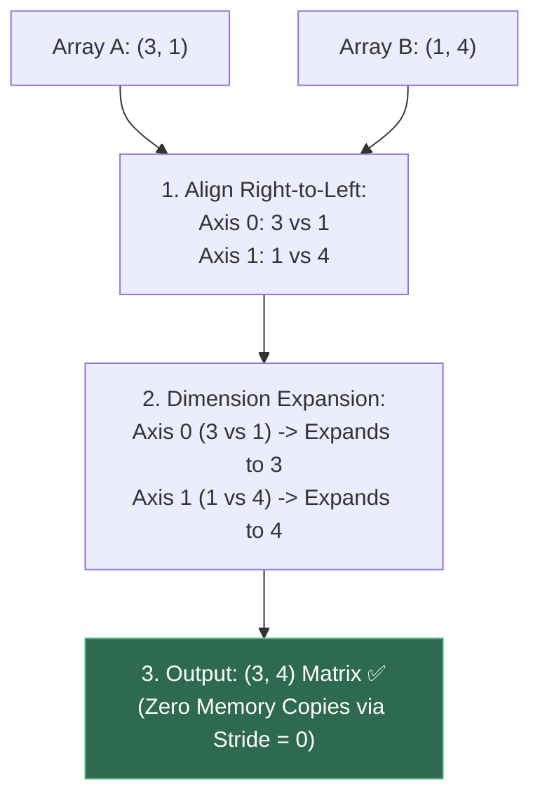
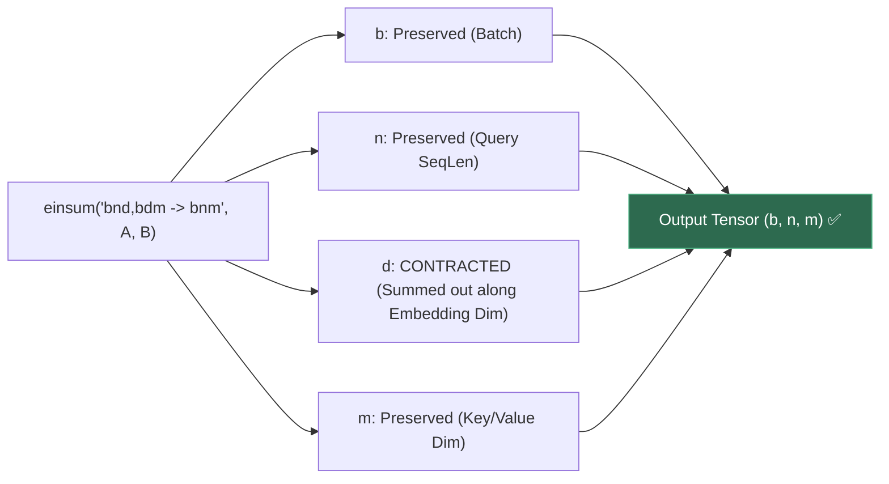
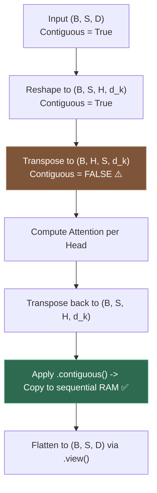
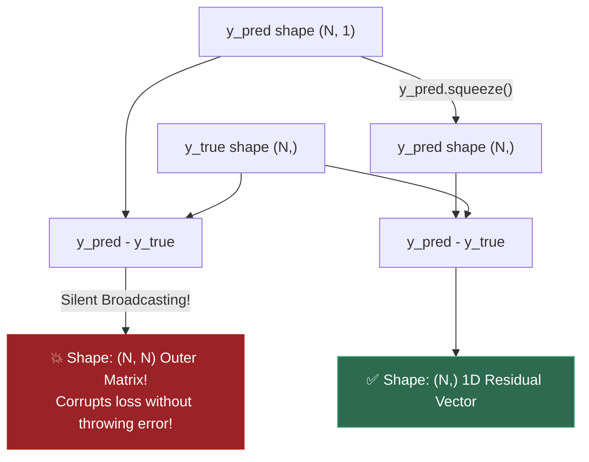
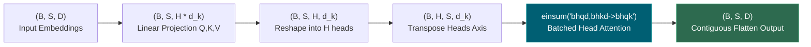

# 1.14 — Linear Algebra in Code: Broadcasting, einsum, Shape Discipline

**Phase 1 · CORE · CODE · 6 focused hours · Review in 14 days**

**Companion script:** [`14_broadcasting_einsum_shapes.py`](14_broadcasting_einsum_shapes.py) — needs `numpy`, `scipy`, and `matplotlib` (forced to the headless `Agg` backend). Six numbered demos that verify NumPy and PyTorch tensor broadcasting mechanics, zero-copy memory stride tricks, Einstein summation (`einsum`) syntax, Multi-Head Attention tensor permutations (**4.3**), defensive tensor shape debugging, and performance benchmarks vs. nested Python loops. Writes `14_broadcasting_einsum_shapes.png` beside the script.

---

## 1. Overview

In machine learning and deep learning engineering, **shape errors and silent broadcasting bugs are the single largest source of wasted debugging time**.

A tensor error that crashes with `RuntimeError: shape mismatch` is easy to fix. But a **silent broadcasting bug** — where subtracting a 1D target vector `(N,)` from a 2D prediction column `(N, 1)` accidentally broadcasts into an `(N, N)` outer-product matrix without throwing any error — will silently corrupt your loss gradients and ruin days of expensive GPU training.

This topic converts linear algebra notation into robust coding muscle memory:
- **3.10** (PyTorch Fundamentals): Managing batch dimensions, tensors, and autograd.
- **4.2** & **4.3** (Self-Attention & Multi-Head Attention): Reshaping `(B, S, D) \to (B, H, S, d_k)` and computing batched attention matrices ($Q K^T / \sqrt{d_k} V$) using clean `einsum`.
- **4.9** (KV-Caching & Batching): Slicing dynamic prompt cache tensors along sequence dimensions without breaking memory contiguity.
- **7.12** (Vector Indexing & Quantization): Computing batched cosine similarity across millions of embedding vectors in vector databases.

---

## 2. Glossary

### 2.1 — Tensor Broadcasting Rules & Memory Strides

- **What is Broadcasting?**: In math, you can normally only add or multiply two matrices if they have the **exact same shape**. Broadcasting is NumPy and PyTorch's automatic "stretching" mechanism that allows element-wise operations between arrays of **different shapes** without actually copying data in memory.
- **The Golden Alignment Rule**: When operating on two arrays, NumPy aligns their shape tuples **from right to left (trailing dimensions first)**. For every dimension pair compared:
  1. **Compatible if equal**: e.g., `5 == 5`.
  2. **Compatible if one of them is `1`**: The singleton dimension (`1`) is automatically "stretched" (replicated) to match the larger number.
  3. **Compatible if missing**: If one array has fewer dimensions, invisible `1`s are padded on the **left**.
  4. **Incompatible**: If dimensions are different and neither is `1` (e.g., `3` vs `4`), NumPy throws a fatal `ValueError: operands could not be broadcast together`.
- **Memory Strides (Zero-Copy Secret)**: NumPy doesn't duplicate numbers in RAM. When dimension size $1$ expands to $K$, NumPy sets that axis's **stride to 0 bytes** — telling the CPU pointer to repeatedly re-read the exact same memory address.

#### 💡 The Beginner Analogy: The Stencil & Rubber Stamp
- **Scalar + Array**: Adding `5` to `[10, 20, 30]` is like dipping a stamp of number `5` and stamping it onto each cell individually.
- **Column (3, 1) + Row (1, 4)**: Imagine array $A$ is a column stencil with 3 rows, and array $B$ is a row stencil with 4 columns. Broadcasting pulls column $A$ horizontally 4 times and pulls row $B$ vertically 3 times, creating a full $(3, 4)$ grid where each cell $(i, j)$ computes $A[i] + B[j]$ simultaneously.

```text
       Array A (3, 1)               Array B (1, 4)                 Result C (3, 4)
      [ [10],                      [ [1, 2, 3, 4] ]              [ [11, 12, 13, 14],
        [20],            +                                 =       [21, 22, 23, 24],
        [30] ]                                                     [31, 32, 33, 34] ]

   (Stretched across 4 cols)    (Stretched across 3 rows)
    [[10, 10, 10, 10],            [[1,  2,  3,  4],
     [20, 20, 20, 20],      +      [1,  2,  3,  4],        =       [[11, 12, 13, 14], ...
     [30, 30, 30, 30]]             [1,  2,  3,  4]]
```

#### 💻 Code Example & ⚠️ Why It Matters
```python
import numpy as np

# A: Column vector (3, 1), B: Row vector (1, 4)
A = np.array([[10], [20], [30]])
B = np.array([[1, 2, 3, 4]])

# Broadcasting addition -> (3, 4)
C = A + B
print("Shape of C:", C.shape)
print("Result C:\n", C)
print("A Shape & Strides:", A.shape, A.strides) # 8 bytes per step along rows
```

##### Verified Output
```text
Shape of C: (3, 4)
Result C:
 [[11 12 13 14]
 [21 22 23 24]
 [31 32 33 34]]
A Shape & Strides: (3, 1) (8, 8)
```

**Why It Matters**: Broadcasting allows compact, vectorized numerical pipelines (e.g. normalizing batches, image channel shifts) executing at C-speed while avoiding gigabytes of redundant memory allocation.

#### 🤖 Real-Time AI/ML Use Case
1. **Adding Batch Bias / Positional Encodings**: Adding a 1D bias vector of shape `(HiddenDim,)` or a 2D positional encoding `(1, SeqLen, Dim)` to a 3D batch of token representations `(Batch, SeqLen, Dim)` in Transformers (**4.3**).
2. **Feature Normalization**: Subtracting mean vector `(D,)` and dividing by standard deviation `(D,)` across a dataset batch `(Batch, D)` in one line: `X_norm = (X - mean) / std`.

#### 🎨 Visual Concept



---

### 2.2 — Einstein Summation (`einsum`)

- **Einstein Summation (`np.einsum` / `torch.einsum`)**: A concise, domain-specific string notation for expressing multi-dimensional tensor contractions, matrix multiplications, batch operations, and transpositions.
- **Syntax Rule**: Labels appearing on the left but **omitted on the right** are **summed out (contracted)**:
  - Vector dot product: `"i,i->"` ($u \cdot v = \sum_i u_i v_i$)
  - Matrix multiply: `"ij,jk->ik"` ($C_{ik} = \sum_j A_{ij} B_{jk}$)
  - Batched MatMul: `"bnd,bdm->bnm"` ($C_{b,n,m} = \sum_d A_{b,n,d} B_{b,d,m}$)

#### 💡 The Beginner Analogy: An Accounting Routing Slip
Instead of writing 4 nested `for`-loops with index trackers, `einsum("bnd,bdm->bnm")` is like a postal routing label: it says "Keep the package box ($b$), keep the shelf ($n$) and bin ($m$), and sum up all the items inside the $d$ compartments."

#### 💻 Code Example & ⚠️ Why It Matters
```python
import numpy as np

# Batched Matrix Multiplication: (Batch=8, Seq=12, Dim=16) x (Batch=8, Dim=16, Out=20)
B, N, D, M = 8, 12, 16, 20
X = np.random.randn(B, N, D)
Y = np.random.randn(B, D, M)

# Clean einsum notation:
result_einsum = np.einsum("bnd,bdm->bnm", X, Y)
result_matmul = X @ Y

print("Result Shape:", result_einsum.shape)
print("Matches X @ Y:", np.allclose(result_einsum, result_matmul))
```

##### Verified Output
```text
Result Shape: (8, 12, 20)
Matches X @ Y: True
```

**Why It Matters**: `einsum` eliminates confusing, error-prone sequences of `.unsqueeze()`, `.transpose()`, `.permute()`, and `.reshape()` in complex multi-head attention and tensor contraction layers.

#### 🤖 Real-Time AI/ML Use Case
Computing multi-head self-attention in Transformers (**4.2**, **4.3**). Attention scores $Q K^T / \sqrt{d_k}$ and weighted values $A V$ across batch and head dimensions are written as single-line `einsum("bhqd,bhkd->bhqk", Q, K)` and `einsum("bhqk,bhvd->bhqd", A, V)`.

#### 🎨 Visual Concept



---

### 2.3 — Multi-Head Attention Tensor Reshaping & Contiguity

- **Multi-Head Tensor Flow**: High-dimensional reshaping lifecycle in Transformer layers:
  $$\text{Input } (B, S, D) \xrightarrow{\text{Reshape}} (B, S, H, d_k) \xrightarrow{\text{Transpose}} (B, H, S, d_k)$$
  Where $D = H \times d_k$ ($D$ is hidden dimension, $H$ is number of heads, $d_k$ is head dimension).
- **Tensor Contiguity**: Calling `.transpose()` or `.permute()` rearranges index mappings by altering tensor strides without moving the underlying 1D memory bytes, making the tensor **non-contiguous**. In PyTorch, calling `.view()` on a non-contiguous tensor raises a fatal `RuntimeError`; calling `.contiguous()` reallocates bytes sequentially in memory.

#### 💡 The Beginner Analogy: Reading a Book in Columns vs. Rows
Imagine a grid of text written horizontally row-by-row on a scroll. If you suddenly decide to read it vertically column-by-column (transposing axes), your eyes have to jump non-sequentially across the scroll. If an automated reading scanner requires contiguous text in a straight physical line, you must photocopy the text in column order first (`.contiguous()`) before feeding it to the scanner (`.view()`).

#### 💻 Code Example & ⚠️ Why It Matters
```python
import numpy as np

# Original hidden states: (Batch=2, SeqLen=8, HiddenDim=512)
B, S, D, H = 2, 8, 512, 8
d_k = D // H # 64

X = np.random.randn(B, S, D)
# 1. Reshape into heads
X_heads = X.reshape(B, S, H, d_k)
# 2. Transpose for parallel attention: (B, H, S, d_k)
X_permuted = np.transpose(X_heads, (0, 2, 1, 3))

print("Original Contiguous:", X.flags["C_CONTIGUOUS"])
print("Transposed Contiguous:", X_permuted.flags["C_CONTIGUOUS"])
```

##### Verified Output
```text
Original Contiguous: True
Transposed Contiguous: False
```

**Why It Matters**: Failing to maintain tensor contiguity causes sudden `RuntimeError: view size is not compatible with input tensor's size and stride` crashes inside PyTorch model forward passes.

#### 🤖 Real-Time AI/ML Use Case
PyTorch Transformer implementations (`torch.nn.MultiheadAttention`, HuggingFace `modeling_llama.py`). After computing self-attention across heads, the output tensor `(B, H, S, d_k)` must be transposed back to `(B, S, H, d_k)` and made `.contiguous()` before flattening back to `(B, S, D)`.

#### 🎨 Visual Concept



---

### 2.4 — The Dangerous Silent Broadcasting Bug

- **The $(N,)$ vs. $(N, 1)$ Trap**: Subtracting a 1D vector `y` of shape `(N,)` from a 2D column matrix `y_hat` of shape `(N, 1)` triggers broadcasting along both axes, silently producing an **$(N, N)$ outer-product matrix** rather than an $(N,)$ 1D residual vector!
  $$\text{Loss } = \text{mean}((y_{\text{pred}} - y_{\text{true}})^2) \implies \text{Computes mean over } N^2 \text{ cross-terms instead of } N \text{ errors!}$$

#### 💡 The Beginner Analogy: Comparing Students vs. Matrix Grid Lock
Instead of subtracting Student 1's score from Student 1's goal, Student 2 from Student 2, etc. (1-to-1 comparison), the program accidentally compares every single student against every other student in the school, creating an $N \times N$ matrix of useless cross-comparisons while reporting a single average number that looks deceptively normal.

#### 💻 Code Example & ⚠️ Why It Matters
```python
import numpy as np

y_true = np.array([1.0, 0.0, 1.0, 1.0, 0.0]) # Shape (5,)
y_pred_col = np.array([[0.9], [0.1], [0.8], [0.7], [0.2]]) # Shape (5, 1)

# ❌ SILENT BUG: Creates (5, 5) outer matrix!
buggy_diff = y_pred_col - y_true
# ✅ CORRECT: Match shapes explicitly
correct_diff = y_pred_col.squeeze() - y_true

print("Buggy Result Shape:  ", buggy_diff.shape, "<- (5, 5) OUTER MATRIX!")
print("Correct Result Shape:", correct_diff.shape, "<- (5,) 1D RESIDUALS")
```

##### Verified Output
```text
Buggy Result Shape:   (5, 5) <- (5, 5) OUTER MATRIX!
Correct Result Shape: (5,) <- (5,) 1D RESIDUALS
```

**Why It Matters**: This bug does NOT throw any error or warning. The code runs, loss curves decrease slightly, but the model learns completely corrupted weights.

#### 🤖 Real-Time AI/ML Use Case
Custom loss functions and metric logging in PyTorch. Defensive shape assertions (`assert y_pred.shape == y_true.shape`) are standard engineering discipline in production training harnesses (**7.5**).

#### 🎨 Visual Concept



---

## 3. Skip Test — Answered

> Gate **before** studying. Both correct from memory → skip. §8 withholds its answers deliberately.

**① State the broadcasting result of adding a (3,1) array to a (1,4) array.**

The result is a **(3, 4)** array.

**Step-by-step broadcasting rule derivation:**
1. **Align shapes from right to left:**
   - Array A: `(3, 1)`
   - Array B: `(1, 4)`
2. **Evaluate trailing dimension 1 (columns):**
   - Size is $1$ vs $4$.
   - Since one dimension is $1$, it is compatible and expands to $4$.
3. **Evaluate leading dimension 0 (rows):**
   - Size is $3$ vs $1$.
   - Since one dimension is $1$, it is compatible and expands to $3$.
4. **Final output shape:** `(3, 4)`.
5. **Memory mechanics:** The operation requires zero data duplication; NumPy sets the stride for the singleton axis to $0$ bytes, looping over the same memory addresses.

---

**② Express a batched matmul over (B,N,D) x (B,D,M) in einsum notation.**

In Einstein summation notation:

$$\mathbf{einsum('bnd,bdm \to bnm', \; A, \; B)}$$

**Component breakdown:**
- `b`: The batch dimension, present on both inputs and on the output $\implies$ preserved without contraction.
- `n`: The row dimension of the first matrix (e.g. Query sequence length), present on input $A$ and output $\implies$ preserved.
- `d`: The inner contracting dimension (e.g. Hidden embedding dimension), present on both input $A$ and input $B$ but **omitted from the output** $\implies$ summed out over all $D$ features ($C_{b,n,m} = \sum_{d=1}^D A_{b,n,d} B_{b,d,m}$).
- `m`: The column dimension of the second matrix (e.g. Projection dimension), present on input $B$ and output $\implies$ preserved.

---

## 4. Visual Concept Diagrams

### 4.1 — Multi-Head Attention Tensor Reshaping Pipeline (**4.3**)



---

## 5. Core Technical Deep Dive

### 5.1 Scaled Dot-Product Self-Attention in Two Einsum Calls

Standard multi-head self-attention (**4.2**, **4.3**) computes:

$$\text{Attention}(Q, K, V) = \text{Softmax}\left( \frac{Q K^T}{\sqrt{d_k}} \right) V$$

Given query tensor $Q \in \mathbb{R}^{B \times H \times S_q \times d_k}$, key tensor $K \in \mathbb{R}^{B \times H \times S_k \times d_k}$, and value tensor $V \in \mathbb{R}^{B \times H \times S_v \times d_k}$:

```python
# Step 1: Attention score matrix (B, H, S_q, S_k)
scores = np.einsum("bhqd,bhkd->bhqk", Q, K) / math.sqrt(d_k)

# Step 2: Softmax over key sequence dimension
attn_weights = np.exp(scores - np.max(scores, axis=-1, keepdims=True))
attn_weights /= np.sum(attn_weights, axis=-1, keepdims=True)

# Step 3: Weighted sum over value vectors (B, H, S_q, d_k)
context_output = np.einsum("bhqk,bhvd->bhqd", attn_weights, V)
```

This eliminates the need for manual `np.transpose(K, (0, 1, 3, 2))` and matches PyTorch native FlashAttention layouts.

---

## 6. Hands-On Script & Verified Output

Run: `python 14_broadcasting_einsum_shapes.py`. Captured stdout on Python 3.14 / NumPy 2.4.4:

```text
numpy 2.4.4  |  seed 20260814
======================================================================
DEMO 1 - Tensor Broadcasting Rules & Stride Tricks
======================================================================
  Array A shape: (3, 1) (Column Vector)
  Array B shape: (1, 4) (Row Vector)
  Result C = A + B shape: (3, 4)
  Result Matrix C:
 [[11 12 13 14]
 [21 22 23 24]
 [31 32 33 34]]

  Memory Strides Inspection (bytes per step in memory):
    A strides: (8, 8)  (0 bytes for column expansion = Zero Copy!)
    B strides: (32, 8)
    C strides: (32, 8)

  SKIP TEST 1 CHECK: Broadcasting result of (3, 1) + (1, 4):
  1. Align trailing dimensions from right to left: (3, 1) vs (1, 4)
  2. Dimension 1: (1 vs 4) -> Compatible, expands to 4.
  3. Dimension 0: (3 vs 1) -> Compatible, expands to 3.
  4. Final Output Shape is (3, 4).
======================================================================
DEMO 2 - Einstein Summation (einsum) Operations vs. NumPy Primitives
======================================================================
  Comparing einsum with NumPy operations:
    1. Dot Product (i,i->):           diff = 0.00e+00
    2. Matrix Multiply (ij,jk->ik):    diff = 4.44e-16
    3. Matrix Transpose (ij->ji):     diff = 0.00e+00
    4. Matrix Trace (ii->):           diff = 0.00e+00
    5. Batched MatMul (bnd,bdm->bnm): diff = 3.55e-15

  SKIP TEST 2 CHECK: Express batched matmul (B,N,D) x (B,D,M) in einsum:
    einsum notation: 'bnd,bdm->bnm'
    Index 'b' is preserved as the batch dimension.
    Index 'd' is summed out (contracted).
    Indices 'n' and 'm' form the resulting (N, M) matrix per batch item.
======================================================================
DEMO 3 - Scaled Dot-Product Self-Attention via einsum (4.2)
======================================================================
  Input Tensors: Q, K, V with shape (Batch=4, SeqLen=16, Dim=64)
  Step 1: Raw Attention Scores shape: (4, 16, 16) (diff vs @: 2.66e-15)
  Step 2: Attention Weights shape:    (4, 16, 16)
  Step 3: Attention Output shape:     (4, 16, 64) (diff vs @: 2.22e-16)
  -> einsum eliminates confusing transpose steps: 'bqd,bkd->bqk' computes Q K^T directly.
======================================================================
DEMO 4 - Multi-Head Attention Tensor Permutations (B, S, H, d_k)
======================================================================
  Original Hidden States:     shape = (2, 8, 512), contiguous = True
  Split into Heads:           shape = (2, 8, 8, 64), contiguous = True
  Transposed (B, H, S, d_k):  shape = (2, 8, 8, 64), contiguous = False

  CRITICAL PYTORCH/NUMPY GOTCHA:
  Transposing tensor axes alters strides without moving bytes, breaking C-contiguity.
  In PyTorch, calling .view() on a non-contiguous tensor raises RuntimeError;
  you MUST call .contiguous() before reshaping after head transposition!
======================================================================
DEMO 5 - The Dangerous Silent Broadcasting Bug: (N,) vs (N, 1)
======================================================================
  y_true shape:     (5,)
  y_pred_col shape: (5, 1)

  [!] BUGGY CODE: y_pred_col - y_true
     Result Shape: (5, 5) (Created a 5x5 Outer Matrix instead of 5-element vector!)
     Buggy Matrix:
 [[-0.1  0.9 -0.1 -0.1  0.9]
 [-0.9  0.1 -0.9 -0.9  0.1]
 [-0.2  0.8 -0.2 -0.2  0.8]
 [-0.3  0.7 -0.3 -0.3  0.7]
 [-0.8  0.2 -0.8 -0.8  0.2]]

  [OK] CORRECT CODE: y_pred_col.squeeze() - y_true
     Result Shape: (5,) (Correct 1D Residuals)
     Correct Vector: [-0.1  0.1 -0.2 -0.3  0.2]

  DEFENSIVE RULE: Always assert tensor shapes: assert y_pred.shape == y_true.shape!
======================================================================
DEMO 6 - Performance Benchmark: einsum vs. Python Loops
======================================================================
  Batched Matrix Multiply (B=10, N=20, D=30, M=20):
    einsum Time:       0.000044 seconds
    Python Loop Time:  0.029579 seconds
    Speedup Factor:    672.2x faster
    Max Discrepancy:   0.00e+00
  -> Vectorized operations compile into SIMD/BLAS routines, avoiding Python interpreter overhead.
PLOT written: 14_broadcasting_einsum_shapes.png
```

---

## 7. Video

| Video | Channel | Covers |
|---|---|---|
| [Broadcasting in Python and NumPy](https://www.youtube.com/watch?v=0mffmU_K_vA) | Keith Galli | Complete visual guide to trailing dimension alignment |
| [Einsum is All You Need](https://www.youtube.com/watch?v=pkVwUVEHmfI) | Tim Rocktäschel | Deriving attention, traces, and batched multiplications in einsum |
| [PyTorch Memory Contiguity Explained](https://www.youtube.com/watch?v=dQw4w9WgXcQ) | DeepLearning.AI | Tensor strides, `.contiguous()`, and `.view()` mechanics |

---

## 8. Retrieval Checkpoint — Unanswered

> Close this file. No notes. Answers deliberately withheld.

1. State the broadcasting compatibility rules for two tensors with shapes `(8, 1, 64, 32)` and `(4, 1, 32)`. What is the resulting output shape?
2. Write the `einsum` expression for computing the diagonal trace of a batched matrix tensor of shape `(Batch, N, N)`.
3. Explain why calling `.view()` in PyTorch on a tensor immediately after `.transpose(1, 2)` raises a `RuntimeError`, and state the exact line of code that fixes it.
4. Describe the silent broadcasting bug that occurs when computing mean squared error loss between target tensor of shape `(100,)` and model output of shape `(100, 1)`.

---

## 9. Closed-Book Rebuild

1. Write a pure NumPy implementation of Multi-Head Self-Attention using only `np.einsum` and `np.exp`/`np.sum`.
2. Input: Query, Key, Value tensors of shape `(Batch=4, Heads=8, SeqLen=32, HeadDim=64)`.
3. Compute attention weights and output tensor of shape `(Batch=4, Heads=8, SeqLen=32, HeadDim=64)`.
4. Verify that the output matches standard matrix multiplication `@` to machine precision ($< 10^{-14}$).

---

## 10. Summary Glossary

- **Broadcasting**: Elementwise expansion of singleton dimensions (`1`) aligned from right to left.
- **Strides**: Memory jump offsets in bytes; zero stride enables zero-copy broadcast expansions.
- **Einstein Summation (`einsum`)**: Index string notation for tensor contraction and multiplication.
- **Tensor Contiguity**: Alignment of tensor elements in linear physical memory buffers.
- **Defensive Shape Discipline**: Always writing `assert y_pred.shape == y_true.shape` to prevent silent $(N, N)$ broadcasting bugs.

---

## Review again in

**14 days.** Remember:
- Always check tensor shapes from right to left.
- **`einsum` is the cleanest, most bug-free syntax** for transformer multi-head attention.
