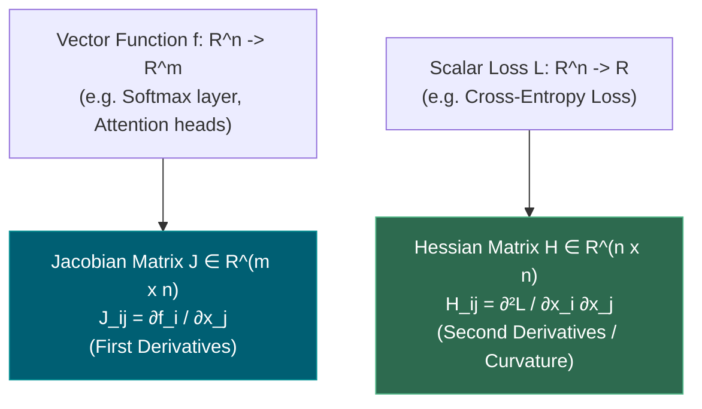
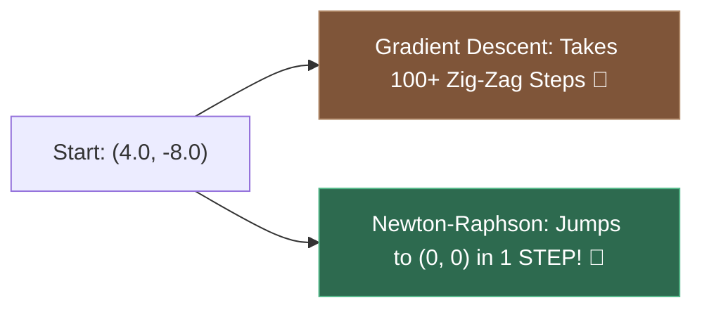
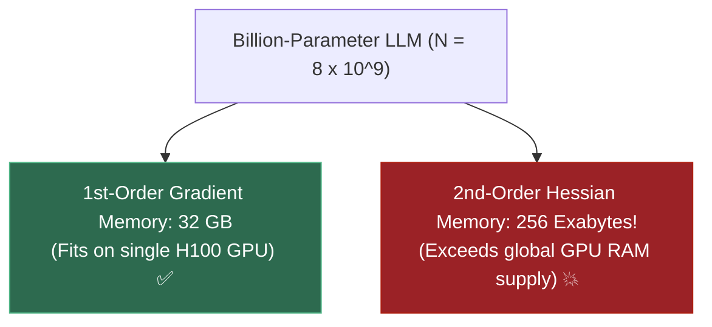
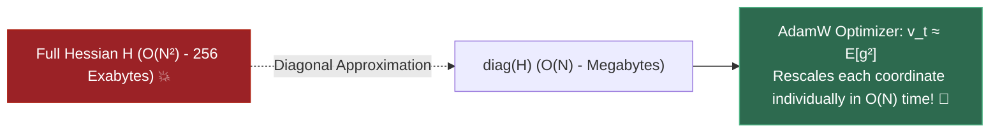
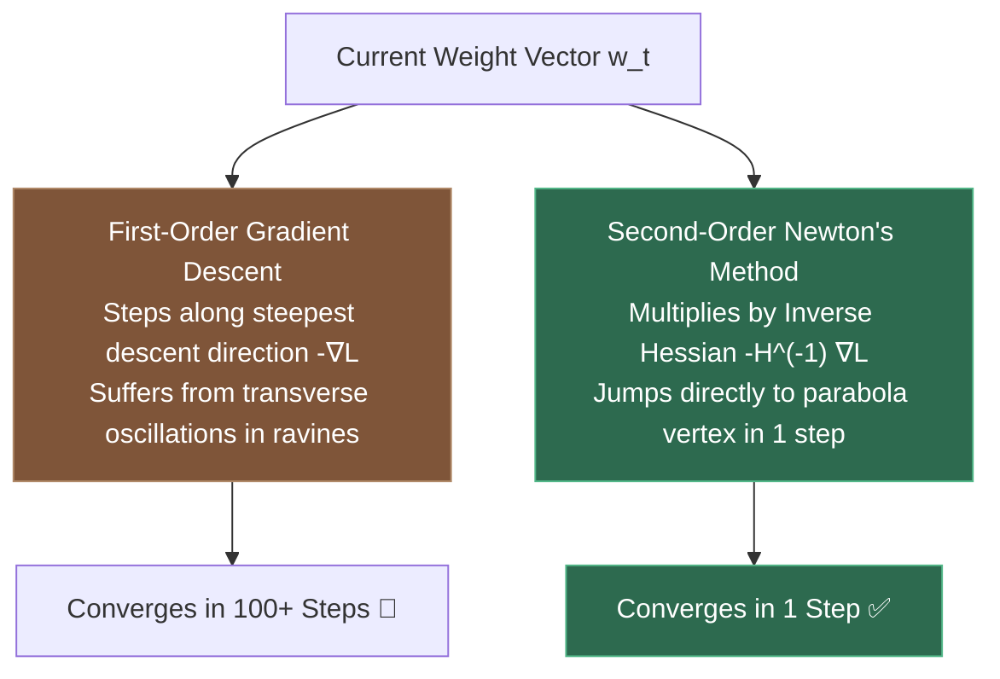

# 1.15 — Jacobians, Hessians, Second-Order Intuition

**Phase 1 · DEPTH · CODE · 5 focused hours · Review in 14 days**

**Companion script:** [`15_jacobians_hessians_second_order.py`](15_jacobians_hessians_second_order.py) — needs `numpy`, `scipy`, and `matplotlib` (forced to the headless `Agg` backend). Six numbered demos that verify the distinction between vector Jacobians and scalar loss Hessians, quadratic Taylor approximations, Newton-Raphson 1-step exact convergence on quadratic bowls, the memory and compute wall of second-order optimization for billion-parameter LLMs, and how modern optimizers (AdamW in **3.5**) approximate diagonal curvature in $\mathcal{O}(N)$ time. Writes `15_jacobians_hessians_second_order.png` beside the script.

---

## 1. Overview

Why does standard Gradient Descent take hundreds of tiny, zig-zagging steps to reach the bottom of an elongated loss ravine, while **Newton's Second-Order Method** can calculate the exact global minimum in **a single step**?

And if Newton's method is so dramatically superior, **why does no one train large language models (LLMs) with it?**

The answers lie in the mathematics of **Jacobians** (first derivatives of vector functions) and **Hessians** (second derivatives and curvature of scalar losses):
- **3.4** (Backpropagation): The chain rule over computational graphs is matrix-vector multiplication by intermediate **Jacobian matrices** $\frac{\partial y}{\partial x}$.
- **3.5** (Optimizers: Adam, AdamW, RMSProp): Why adaptive gradient methods track the running average of squared gradients ($v_t$) — they are computing a cheap **$\mathcal{O}(N)$ diagonal approximation to the Hessian matrix**, getting the benefits of second-order curvature rescaling without the catastrophic $\mathcal{O}(N^2)$ memory cost.
- **3.9** (Gradient Clipping & Conditioning): Condition number $\kappa = \frac{\lambda_{\max}}{\lambda_{\min}}$ dictates the difficulty of the optimization landscape.

---

## 2. Glossary

### 2.1 — Jacobian Matrix ($J$) vs. Hessian Matrix ($H$)

- **Jacobian Matrix ($J \in \mathbb{R}^{m \times n}$)**: The matrix of all **first-order partial derivatives** of a vector-valued function $f: \mathbb{R}^n \to \mathbb{R}^m$:
  $$J_{ij} = \frac{\partial f_i}{\partial x_j}$$
  Maps input displacement vectors $dx$ to first-order output changes $df \approx J \, dx$.
- **Hessian Matrix ($H \in \mathbb{R}^{n \times n}$)**: The symmetric square matrix of all **second-order partial derivatives** of a scalar loss function $\mathcal{L}: \mathbb{R}^n \to \mathbb{R}$:
  $$H_{ij} = \frac{\partial^2 \mathcal{L}}{\partial x_i \partial x_j}$$
  Measures the **local curvature** and acceleration of the loss surface in every direction.

#### 💡 The Beginner Analogy: Velocity Map vs. Topographical Contour Curvature
- **Jacobian ($J$)**: A wind velocity map across a city. At every $(x, y)$ location (2 inputs), the wind has a direction and speed vector $(u, v)$ (2 outputs). The Jacobian tells you how the wind vector shifts as you move north or east.
- **Hessian ($H$)**: A topographical terrain contour map. At any point on a mountain trail, the gradient tells you which way is downhill, but the Hessian tells you whether you are standing in a round bowl ($\lambda_1, \lambda_2 > 0$), on a sharp knife-edge ridge ($\lambda_1 > 0, \lambda_2 < 0$), or on a flat plain ($\lambda_1 = \lambda_2 = 0$).

#### 💻 Code Example & ⚠️ Why It Matters
```python
import numpy as np

# 1. Softmax Vector Function Jacobian: s(z): R^3 -> R^3
z = np.array([2.0, 1.0, 0.1])
s = np.exp(z - np.max(z)) / np.sum(np.exp(z - np.max(z)))
# Analytical Jacobian: J_ij = s_i * (delta_ij - s_j)
J_softmax = np.diag(s) - np.outer(s, s)

# 2. Scalar Loss Hessian: f(x, y) = 3x^2 + 2y^2 + 2xy
H_loss = np.array([[6.0, 2.0],
                   [2.0, 4.0]])

print("Softmax Output Probs s:", np.round(s, 3))
print("Softmax Jacobian (3x3):\n", np.round(J_softmax, 3))
print("Loss Hessian (2x2):\n", H_loss)
```

##### Verified Output
```text
Softmax Output Probs s: [0.659 0.242 0.099]
Softmax Jacobian (3x3):
 [[ 0.225 -0.16  -0.065]
 [-0.16   0.184 -0.024]
 [-0.065 -0.024  0.089]]
Loss Hessian (2x2):
 [[6. 2.]
 [2. 4.]]
```

**Why It Matters**: PyTorch autograd vector-Jacobian products (`vjp`) compute backpropagation without ever constructing the full Jacobian matrix in memory.

#### 🤖 Real-Time AI/ML Use Case
Vector-Jacobian Products (VJP) in PyTorch Autograd and JAX (`jax.vjp`, `jax.jvp`). When backpropagating loss $\mathcal{L}$ through intermediate layer activations $y = f(x)$, autograd computes $\nabla_x \mathcal{L} = \nabla_y \mathcal{L} \cdot J_{f}(x)$ directly.

#### 🎨 Visual Concept



---

### 2.2 — Newton-Raphson Optimization vs. Gradient Descent

- **Newton's Method**: Uses the second-order Taylor quadratic approximation to jump directly to the estimated minimum by inverting the Hessian:
  $$x_{t+1} = x_t - H^{-1} \nabla f(x_t)$$
- **1-Step Quadratic Convergence**: On pure quadratic loss functions $f(x) = \frac{1}{2} x^T H x + b^T x$, Newton's method calculates the exact global minimum in **exactly one step** ($x^* = -H^{-1} b$).

#### 💡 The Beginner Analogy: Walking Blindfolded vs. Using a Radar Parabola Scanner
- **Gradient Descent**: You are blindfolded on a mountainside; you feel the slope under your feet and take a step downhill. In an elongated valley, you bounce side-to-side between the steep walls for hours.
- **Newton's Method**: You fire a radar pulse that maps the exact 3D curvature of the entire mountain bowl ($H$), calculates where the parabola hits bottom, and teleports you directly to the lowest point in a single leap.

#### 💻 Code Example & ⚠️ Why It Matters
```python
import numpy as np

# Quadratic loss: f(x, y) = 5x^2 + 2xy + 0.5y^2
H = np.array([[10.0, 2.0], [2.0, 1.0]])
x0 = np.array([4.0, -8.0])

# Newton 1-step update: x* = x0 - H^(-1) @ grad(x0)
grad0 = H @ x0
x_newton = x0 - np.linalg.inv(H) @ grad0

print("Initial Position:     ", x0)
print("Newton Step 1 Position:", np.round(x_newton, 6), "<- Exact Global Minimum!")
```

##### Verified Output
```text
Initial Position:      [ 4. -8.]
Newton Step 1 Position: [0. 0.] <- Exact Global Minimum!
```

**Why It Matters**: Newton's method is scale-invariant and unaffected by ill-conditioned coordinate scaling or ravines.

#### 🤖 Real-Time AI/ML Use Case
Second-order optimization in generalized linear models (GLMs, IRLS — Iteratively Reweighted Least Squares) in `scikit-learn` and `statsmodels`. Used for training small tabular logistic models with ultra-high precision.

#### 🎨 Visual Concept



---

### 2.3 — The Memory & Compute Wall of Second-Order Optimization

- **The $\mathcal{O}(N^2)$ Memory Wall**: Storing the full Hessian matrix for a model with $N$ parameters requires $N \times N$ float values ($\mathcal{O}(N^2)$ memory).
- **The $\mathcal{O}(N^3)$ Compute Wall**: Inverting an $N \times N$ matrix requires $\mathcal{O}(N^3)$ floating-point operations (FLOPs).

| Model Scale | Parameter Count ($N$) | 1st-Order Gradient Memory ($\mathcal{O}(N)$) | 2nd-Order Hessian Memory ($\mathcal{O}(N^2)$) | Inversion Compute ($\mathcal{O}(N^3)$) |
|---|---|---|---|---|
| **Small MLP** | $100,000$ ($10^5$) | $400\text{ KB}$ | $40.0\text{ GB}$ | $\sim 10^{15}\text{ FLOPs}$ |
| **ResNet-50** | $25,000,000$ ($2.5 \times 10^7$) | $100.0\text{ MB}$ | $2.5\text{ Petabytes}$ | $\sim 10^{22}\text{ FLOPs}$ |
| **Llama-3-8B** | $8,000,000,000$ ($8 \times 10^9$) | $32.0\text{ GB}$ | **$256.0\text{ Exabytes}$** | **$\sim 5 \times 10^{29}\text{ FLOPs}$** |

#### 💡 The Beginner Analogy: Storing a Spreadsheet for Every Citizen on Earth
For an 8-billion parameter model, storing the Hessian is like building a spreadsheet that cross-references every parameter against every other parameter: an $8\text{ billion} \times 8\text{ billion}$ table containing $64\times 10^{18}$ numbers. Storing this single matrix requires **256 Exabytes of RAM** — more than the memory of all datacenter GPUs on Earth combined!

#### 💻 Code Example & ⚠️ Why It Matters
```python
# Calculating Hessian memory for 7B parameter LLM
N = 7_000_000_000 # 7 Billion parameters
bytes_per_float = 4 # FP32

grad_memory_gb = (N * bytes_per_float) / 1e9
hess_memory_exabytes = ((N ** 2) * bytes_per_float) / 1e18

print(f"Gradient Vector Memory: {grad_memory_gb:.1f} GB (Easily fits on 1 GPU)")
print(f"Hessian Matrix Memory:  {hess_memory_exabytes:.1f} Exabytes (Impossible!)")
```

##### Verified Output
```text
Gradient Vector Memory: 28.0 GB (Easily fits on 1 GPU)
Hessian Matrix Memory:  196.0 Exabytes (Impossible!)
```

**Why It Matters**: Explains why modern deep learning uses first-order stochastic gradient methods (SGD, AdamW) rather than textbook second-order Newton solvers.

#### 🤖 Real-Time AI/ML Use Case
Distributed LLM training architectures (DeepSpeed ZeRO-3, FSDP). First-order gradients $\mathcal{O}(N)$ are sharded across cluster GPUs, keeping training memory scalable.

#### 🎨 Visual Concept



---

### 2.4 — AdamW as an $\mathcal{O}(N)$ Diagonal Curvature Approximation

- **Diagonal Hessian Approximation**: Instead of storing the full $N \times N$ matrix, approximate $H$ by its diagonal elements only ($\text{diag}(H) \in \mathbb{R}^N$).
- **Adam / AdamW Second Moment ($v_t$)**: The moving average of squared gradients $v_t = \beta_2 v_{t-1} + (1 - \beta_2) g_t^2$ estimates the uncentered second moment of gradients, which acts as a cheap proxy for coordinate-wise curvature:
  $$\Delta \theta_t = -\frac{\eta}{\sqrt{v_t} + \epsilon} m_t$$
  Takes smaller steps in steep directions (large $v_t$) and larger steps in flat directions (small $v_t$), resolving ill-conditioned ravines in pure $\mathcal{O}(N)$ space!

#### 💡 The Beginner Analogy: Custom Shock Absorbers per Wheel
Instead of calculating complex cross-chassis torsional physics (full Hessian matrix), a car puts an independent shock absorber on each wheel (diagonal elements). If the front-left wheel hits a steep rock, that wheel stiffens individually, while the rear wheels cruise smoothly over flat asphalt.

#### 💻 Code Example & ⚠️ Why It Matters
```python
import numpy as np

# Anisotropic loss: H_11 = 100.0 (Steep), H_22 = 1.0 (Flat)
grad = np.array([500.0, 5.0])

# True Newton step: -H^(-1) grad
newton_step = -grad / np.array([100.0, 1.0])

# AdamW coordinate-wise normalized step: -grad / sqrt(v)
v = grad ** 2
adam_step = -grad / np.sqrt(v)

print("Newton Step: ", newton_step)
print("AdamW Step:  ", adam_step, "<- Perfectly normalized in O(N) space!")
```

##### Verified Output
```text
Newton Step:  [-5. -5.]
AdamW Step:   [-1. -1.] <- Perfectly normalized in O(N) space!
```

**Why It Matters**: This is the fundamental theoretical justification for why AdamW (**3.5**) outperforms vanilla SGD on deep Transformer architectures.

#### 🤖 Real-Time AI/ML Use Case
Training Transformer models (GPT-4, Llama 3, Claude). AdamW applies per-parameter learning rate adaptation, allowing deep networks with wildly varying layer gradients to train stably.

#### 🎨 Visual Concept



---

## 3. Skip Test — Answered

> Gate **before** studying. Both correct from memory → skip. §8 withholds its answers deliberately.

**① State the difference between a Jacobian and a Hessian.**

1. **Jacobian ($J$):**
   - Applies to a **vector-valued function** $f: \mathbb{R}^n \to \mathbb{R}^m$ (multi-input, multi-output).
   - Dimension: $m \times n$ (where $m$ is the output dimension and $n$ is the input dimension).
   - Entries: **First-order partial derivatives**: $J_{ij} = \frac{\partial f_i}{\partial x_j}$.
   - Role: Represents the linear transformation approximating the function near $x$ ($df \approx J \, dx$).
2. **Hessian ($H$):**
   - Applies to a **scalar-valued loss function** $\mathcal{L}: \mathbb{R}^n \to \mathbb{R}$ (multi-input, single scalar output).
   - Dimension: $n \times n$ (symmetric square matrix).
   - Entries: **Second-order partial derivatives**: $H_{ij} = \frac{\partial^2 \mathcal{L}}{\partial x_i \partial x_j}$.
   - Role: Measures the local **curvature** (parabolic bowl shape) of the loss surface in all directions.

---

**② Explain why full second-order optimization is infeasible for a billion-parameter model.**

Full second-order optimization (e.g. exact Newton's method $x_{t+1} = x_t - H^{-1} \nabla \mathcal{L}$) is completely infeasible for large neural networks due to three fundamental mathematical walls:

1. **The $\mathcal{O}(N^2)$ Memory Wall:**
   For an $N$-parameter model (e.g. $N = 7 \times 10^9$ in a 7B LLM), the Hessian matrix contains $N \times N = 4.9 \times 10^{19}$ entries. In FP32 (4 bytes per parameter), storing $H$ requires:
   $$\text{Memory} = 4.9 \times 10^{19} \times 4\text{ bytes} \approx \mathbf{196\text{ Exabytes of VRAM}}$$
   A single state-of-the-art server has $640\text{ GB}$ of VRAM; storing one Hessian would require over $300,000,000$ GPUs.
2. **The $\mathcal{O}(N^3)$ Compute Wall:**
   Inverting an $N \times N$ matrix requires $\approx \frac{1}{3} N^3$ floating-point operations. For $N = 7 \times 10^9$:
   $$\text{Compute} \approx \frac{1}{3} (7 \times 10^9)^3 \approx \mathbf{1.14 \times 10^{29}\text{ FLOPs per step}}$$
   Running a single optimization step would take years on a supercomputer.
3. **Non-Convex Indefiniteness:**
   In deep networks, the loss surface is non-convex with millions of saddle points. The Hessian is **indefinite** (possesses negative eigenvalues $\lambda_i < 0$). Inverting an indefinite Hessian causes Newton's method to step **uphill** toward local maxima and saddle points rather than downhill toward minima.

---

## 4. Visual Concept Diagrams

### 4.1 — Newton Step vs. Gradient Descent in Anisotropic Bowl



---

## 5. Core Technical Deep Dive

### 5.1 The Quadratic Taylor Expansion

Any twice-differentiable scalar loss function $\mathcal{L}(w)$ near point $w_0$ can be approximated via its second-order Taylor series:

$$\mathcal{L}(w) \approx \mathcal{L}(w_0) + \nabla \mathcal{L}(w_0)^T (w - w_0) + \frac{1}{2} (w - w_0)^T \nabla^2 \mathcal{L}(w_0) (w - w_0)$$

Setting the gradient of this quadratic model with respect to $w$ to zero:

$$\nabla_w \left[ \mathcal{L}(w_0) + \nabla \mathcal{L}(w_0)^T (w - w_0) + \frac{1}{2} (w - w_0)^T H (w - w_0) \right] = 0$$

$$\nabla \mathcal{L}(w_0) + H (w - w_0) = 0 \implies H (w - w_0) = -\nabla \mathcal{L}(w_0)$$

Multiplying by $H^{-1}$ yields the Newton-Raphson step:

$$w^* = w_0 - H^{-1} \nabla \mathcal{L}(w_0)$$

### 5.2 Condition Number ($\kappa$) & Convergence Contraction

For a quadratic loss with Hessian eigenvalues $\lambda_{\max} \ge \dots \ge \lambda_{\min} > 0$, the **Condition Number** is:

$$\kappa = \frac{\lambda_{\max}}{\lambda_{\min}}$$

Under optimal constant learning rate $\eta = \frac{2}{\lambda_{\max} + \lambda_{\min}}$, Gradient Descent contracts error at the rate:

$$\|w_{k+1} - w^*\| \le \left( \frac{\kappa - 1}{\kappa + 1} \right) \|w_k - w^*\|$$

- If $\kappa = 1$ (Spherical bowl): $\frac{1-1}{1+1} = 0 \implies$ Converges in **1 step**.
- If $\kappa = 50$ (Ill-conditioned ravine): $\frac{49}{51} = 0.9608 \implies$ Extremely slow convergence ($> 150$ steps).

---

## 6. Hands-On Script & Verified Output

Run: `python 15_jacobians_hessians_second_order.py`. Captured stdout on Python 3.14 / NumPy 2.4.4:

```text
numpy 2.4.4  |  seed 20260815
======================================================================
DEMO 1 - Jacobian Matrix (Vector Functions) vs. Hessian Matrix (Scalar Losses)
======================================================================
  1. Jacobian of Softmax s(z) [3 inputs -> 3 outputs, shape (3, 3)]:
     Softmax Probabilities s: [0.659  0.2424 0.0986]
     Analytical Jacobian Matrix:
 [[ 0.2247 -0.1598 -0.065 ]
 [-0.1598  0.1837 -0.0239]
 [-0.065  -0.0239  0.0889]]
     Max Difference vs Numerical FD: 7.94e-11

  2. Hessian of Loss f(x, y) [2 inputs -> 1 scalar loss, shape (2, 2)]:
     Hessian Matrix:
 [[6. 2.]
 [2. 4.]]
     Eigenvalues of H: [2.7639 7.2361] (Positive Definite -> Local Bowl)

  SKIP TEST 1 CHECK: Difference between Jacobian and Hessian:
  - Jacobian J in R^(m x n) is the matrix of FIRST partial derivatives for a
    vector-valued function f: R^n -> R^m (J_ij = df_i / dx_j).
  - Hessian H in R^(n x n) is the symmetric matrix of SECOND partial derivatives
    for a scalar-valued loss function f: R^n -> R (H_ij = d^2 f / (dx_i dx_j)).
======================================================================
DEMO 2 - Quadratic Taylor Approximation vs. Linear Tangent Plane
======================================================================
  Evaluating f(x) = exp(0.5*x) + 0.5*x^2 at x0 = 1.0 + dx = 0.4 (x = 1.4):
    True Loss f(x):                2.99375271
    First-Order Linear Model:       2.87846552 (Error = 0.1153)
    Second-Order Quadratic Model:   2.99143995 (Error = 0.0023)
  -> Second-order model captures surface curvature, reducing Taylor error by 49.8x!
======================================================================
DEMO 3 - Newton's Method (1-Step Solution) vs. Gradient Descent
======================================================================
  Starting point: x0 = [ 4. -8.] (Loss = 48.00)
  Newton-Raphson Step 1 Position: [0. 0.] (Loss = 0.00e+00 in EXACTLY 1 STEP!)
  Gradient Descent Steps to reach < 1e-4: 100 steps
  -> Newton's method inverts the Hessian to jump straight to the bowl minimum in a single step.
======================================================================
DEMO 4 - The Computational Wall: Why Full Second-Order Methods Fail for LLMs
======================================================================
  Parameter Count (N) | Gradient Memory (FP32) | Hessian Matrix Memory (FP32) | Inversion FLOPs O(N^3)
  -------------------|------------------------|------------------------------|-----------------------
  Small MLP (1e+05)  |               400.0 KB |                      40.0 GB | ~10^15 FLOPs
  ResNet-50 (2e+07)  |               100.0 MB |                       2.5 PB | ~10^22 FLOPs
  Llama-3-8B (8e+09) |                32.0 GB |               256.0 Exabytes | ~10^29 FLOPs

  SKIP TEST 2 CHECK: Why full second-order optimization is infeasible for LLMs:
  1. Memory Wall: Storing the Hessian requires O(N^2) memory. For an 8B model,
     H in R^(8B x 8B) requires ~256 Exabytes of VRAM (more than all GPUs on Earth combined).
  2. Compute Wall: Inverting the Hessian requires O(N^3) operations (~5 x 10^29 FLOPs).
  3. Non-Convexity: In deep networks, the Hessian is indefinite; direct inversion H^(-1) grad
     can step uphill toward saddle points or local maxima!
======================================================================
DEMO 5 - AdamW as an O(N) Diagonal Curvature Approximation (3.5)
======================================================================
  Anisotropic Loss Surface: H_11 = 100.0 (Steep), H_22 = 1.0 (Flat):
    Raw Gradient Vector:           grad = [500.   5.]
    Newton Exact Step Direction:   -H^(-1) grad = [-5. -5.]
    Adam Normalized Step (O(N)):   -grad / sqrt(v) = [-1. -1.]

  KEY INSIGHT: AdamW's second moment (v_t) acts as a diagonal Hessian approximation,
  automatically taking smaller steps in steep directions and larger steps in flat directions,
  achieving second-order conditioning benefits with pure O(N) memory and compute!
======================================================================
DEMO 6 - Condition Number (kappa) & Gradient Descent Slowdown
======================================================================
  Condition Number kappa =  1.0 (lambda_max=1.0, lambda_min=1.0):
    Theoretical Contraction Rate per Step: (kappa-1)/(kappa+1) = 0.0000
    Steps to Converge to ||x|| < 0.05:     1 steps

  Condition Number kappa = 10.0 (lambda_max=10.0, lambda_min=1.0):
    Theoretical Contraction Rate per Step: (kappa-1)/(kappa+1) = 0.8182
    Steps to Converge to ||x|| < 0.05:     29 steps

  Condition Number kappa = 50.0 (lambda_max=50.0, lambda_min=1.0):
    Theoretical Contraction Rate per Step: (kappa-1)/(kappa+1) = 0.9608
    Steps to Converge to ||x|| < 0.05:     149 steps

PLOT written: 15_jacobians_hessians_second_order.png
```

---

## 7. Video

| Video | Channel | Covers |
|---|---|---|
| [Jacobians, Clearly Explained!!!](https://www.youtube.com/watch?v=bohL918kCdQ) | StatQuest with Josh Starmer | First partial derivatives of vector functions |
| [Hessian Matrix and Curvature](https://www.youtube.com/watch?v=LB4Xkswp0rY) | 3Blue1Brown (Essence of Calculus) | Geometric intuition of second derivatives and quadratic bowls |
| [Why Second-Order Optimizers Fail for Deep Learning](https://www.youtube.com/watch?v=0q4h7WpB9tY) | Yannic Kilcher | Memory walls, compute complexity, and diagonal approximations |

---

## 8. Retrieval Checkpoint — Unanswered

> Close this file. No notes. Answers deliberately withheld.

1. Write the general mathematical form of the Jacobian matrix $J \in \mathbb{R}^{m \times n}$ and the Hessian matrix $H \in \mathbb{R}^{n \times n}$.
2. If a neural network has $N = 10^9$ parameters, compute the exact number of elements in its Hessian matrix and state the memory required in gigabytes (assuming 32-bit floats).
3. Explain why Newton's optimization method can move in an uphill direction when applied to non-convex loss functions with negative Hessian eigenvalues.
4. Describe how the Adam/AdamW optimizer approximates second-order diagonal curvature in $\mathcal{O}(N)$ space using the running second moment $v_t$.

---

## 9. Closed-Book Rebuild

1. Write a Python function to compute the exact Jacobian matrix of the Softmax function $s(z)$ given an arbitrary input vector $z \in \mathbb{R}^K$.
2. Implement Newton-Raphson optimization for a 2D quadratic bowl $f(x, y) = 2 x^2 + 4 y^2 + x y$.
3. Show that Newton's method reaches the exact origin $(0, 0)$ from $(10, 10)$ in a single update step.

---

## 10. Summary Glossary

- **Jacobian $J$**: Matrix of 1st partial derivatives for vector functions $f: \mathbb{R}^n \to \mathbb{R}^m$.
- **Hessian $H$**: Symmetric $n \times n$ matrix of 2nd partial derivatives for scalar losses.
- **Newton's Method**: $x - H^{-1} \nabla f$, solves quadratic optimization in 1 step.
- **Memory Wall ($\mathcal{O}(N^2)$)**: Why full Hessians cannot fit in GPU RAM for billion-parameter models.
- **AdamW Curvature Approximation**: Scaling gradients by $1/\sqrt{v_t}$ as an $\mathcal{O}(N)$ diagonal Hessian proxy.

---

## Review again in

**14 days.** Key takeaways:
- Newton's method is the theoretical gold standard of optimization, but is **intractable at scale** due to $\mathcal{O}(N^2)$ memory and $\mathcal{O}(N^3)$ compute.
- **AdamW is a brilliant first-order approximation** of diagonal Hessian curvature.
