# THE COMPLETE AI/ML ENGINEER ROADMAP
## Absolute Zero → Hireable AI/ML Engineer

**One document. Nine phases. 119 topics. No prerequisites assumed.**

This consolidates three previously separate documents into a single path:
- `agentic-ai-learning-path.md` — engineering foundations, LLM APIs, RAG, LangGraph, MCP, production
- `AI_Roadmap_Krish_Naik_References.docx` — classical ML and the data stack
- `GenAI_Engineering_Handbook.docx` — DL foundations, transformer internals, fine-tuning, evals

…and closes the gap all three shared: **no mathematics, no classical ML, no deep learning fundamentals.**

> This document is the **map, not the territory**. No full explanations, no code, no video links — those belong to a separate resource pass.

---

## HOW TO READ THIS

Every topic carries five fields:

| Field | Meaning |
|---|---|
| **Tier** | `CORE` = hire-blocking. `DEPTH` = differentiator; do not start any DEPTH topic until every CORE phase is done. |
| **Why it matters + connects to** | Named upstream and downstream topics. This is what makes the map a graph rather than a list. |
| **Skip-test** | Two questions. **Both answered correctly from memory → skip the topic entirely.** Either one wrong → do it fully. "I think I know this" means you don't. |
| **Hours** | Focused hours starting from genuinely nothing — deliberate practice with the hands-on exercise completed. |

**The hands-on exercise at the end of each topic is mandatory, not optional.** Skip it and you have read about a concept, not learned it.

---

## SCOPE BOUNDARY

**"Complete" means: sufficient to be competitive for a mid-to-senior AI/ML Engineer role in the 2026 market.** Not every ML technique that exists, not every paper, not research-scientist depth.

**Explicitly out of scope**, deliberately: research-level optimization theory, measure-theoretic probability, CUDA kernel authoring, distributed pretraining from scratch, custom architecture research, Bayesian nonparametrics, classical NLP pipelines (parsing, HMMs), computer-vision specialization beyond one conceptual CNN pass, and mobile/frontend work.

### Coverage audit — what the CORE list was checked against

1. **DeepLearning.AI Machine Learning Specialization** — full 3-course syllabus verified: regression, gradient descent, logistic regression, overfitting, neural networks, bias/variance, ML development process, skewed datasets, decision trees, tree ensembles, clustering, anomaly detection, collaborative and content-based filtering, PCA, reinforcement learning.
2. **fast.ai Practical Deep Learning for Coders** — lesson list verified: SGD from scratch, random forests, collaborative filtering, CNNs, NLP classification; Part 2 covers matrix multiplication → backprop → attention → transformers → diffusion.
3. **Reference doc 1 (Krish Naik AI Roadmap)** — Python, NumPy/Pandas, data cleaning, EDA, supervised/unsupervised, regression, classification, clustering, trees, random forest, XGBoost, SVM, model evaluation, hyperparameter tuning.
4. **Reference doc 2 (GenAI Engineering Handbook)** — DL foundations, transformers, prompting, chunking, embeddings, RAG, architectures, fine-tuning, evaluation, MLOps.
5. **2026 market signal** — ML fundamentals in ~24% of AI/ML engineering listings; LLMs, deep learning and problem-solving ~16% each; prompt engineering ~14%; model evaluation and NLP ~12% each.

**Consciously demoted, not forgotten:** reinforcement learning as a standalone track (folded into 4.11 as the basis for RLHF/DPO, which is where an applied engineer actually meets it); anomaly detection and recommenders (single DEPTH topic, 2.15); CNN/vision depth (single DEPTH topic, 3.13).

**Added because the 2026 market demands them, though none of the five sources contain them:** Git and testing discipline (0.4, 0.5), numerical stability (1.12), information theory (1.13), calibration (2.7), agent failure modes (6.14), agent trajectory evals (7.4), OpenTelemetry tracing (7.6), and A/B testing for LLM features (7.15).

---

## HONEST TIMELINE

### Hours by phase

| Phase | Topics | CORE hours | DEPTH hours | Phase total |
|---|---|---|---|---|
| 0 — Engineering Foundations | 15 | 120 | 0 | 120 |
| 1 — Math Foundations | 15 | 85 | 5 | 90 |
| 2 — Classical ML | 15 | 96 | 6 | 102 |
| 3 — Deep Learning Fundamentals | 15 | 65 | 12 | 77 |
| 4 — GenAI and LLM Fundamentals | 13 | 72 | 13 | 85 |
| 5 — RAG Systems | 11 | 57 | 5 | 62 |
| 6 — Agentic Systems | 15 | 77 | 5 | 82 |
| 7 — Production, Evals, LLMOps | 15 | 80 | 5 | 85 |
| 8 — Capstone Projects | 5 | 130 | 55 | 185 |
| **TOTAL** | **119** | **782** | **106** | **888** |

### Calendar

**782 hours CORE, 888 hours with DEPTH:**

| Weekly focused hours | CORE only | CORE + DEPTH |
|---|---|---|
| 5 hrs/week | ~156 weeks (~36 months) | ~178 weeks (~41 months) |
| 10 hrs/week | ~78 weeks (~18 months) | ~89 weeks (~20 months) |
| 20 hrs/week | ~39 weeks (~9 months) | ~44 weeks (~10 months) |

**Read this before planning around the numbers:**

- These are **focused** hours — deliberate practice with the hands-on exercise completed. Not hours with a video playing in another tab. Real calendars lose 4–6 weeks a year to work crunches, travel and illness; add roughly 10–15% for a realistic finish date.
- **There is no configuration where 5 hrs/week reaches a mid-to-senior applied role inside 12 months.** The honest options are: raise weekly hours, extend the horizon, or narrow the target role. Choose deliberately rather than discovering it at month 10.
- The previous roadmap's ~215-hour estimate for zero → enterprise AI/ML engineer was optimistic by roughly 4x. Most of the difference is the math, classical ML and deep learning that were missing entirely, plus honest capstone hours.
- **Phases 1 and 2 are 181 of the 782 CORE hours — 23% of the work, and the least immediately gratifying.** This is the section most likely to be abandoned, and abandoning it recreates exactly the gap that prompted this document.
- **Sequencing is not fully rigid.** Phase 0 → 1 → 2 → 3 is strictly ordered. But Phases 4–7 can be interleaved with Phase 2 once Phase 1 is done — building a RAG prototype while learning gradient boosting keeps motivation alive and is how most people actually survive the foundations.

---

## PHASE 0 — ENGINEERING FOUNDATIONS

**120 hours · 15 topics**

> Non-negotiable prerequisites for everything after. Skip what you genuinely know. Do not skip what you merely recognise.

| # · Topic | Tier | Why it matters + what it connects to | Skip-test | Hours |
|---|---|---|---|---|
| **0.1 Python Basics** | CORE | Every framework in this path is Python: NumPy in 0.6, scikit-learn in Phase 2, PyTorch in 3.10, LangGraph in Phase 6. Nothing downstream works without it, and no amount of framework knowledge compensates. | ① Write a function that reads a CSV, filters rows where amount is over 1000, and returns a list of dicts. ② Write a try/except that catches FileNotFoundError and prints a custom message. | 25 |
| **0.2 OOP, Modules, Virtual Environments** | CORE | Every LangChain tool, LangGraph node and FastAPI endpoint is a class or module — you cannot read framework source without this. Virtual environments prevent the dependency conflicts that make Phase 3 PyTorch installs painful. Depends on 0.1. | ① Explain the difference between a class attribute and an instance attribute. ② State why you would use a venv per project rather than installing globally. | 10 |
| **0.3 Async, Type Hints, Pydantic v2** | CORE | `TypedDict` and `Annotated` are literally how LangGraph state is declared in 6.3, and Pydantic models are how structured LLM output is validated in 4.8. Async is how you run parallel tool calls without blocking. Depends on 0.2; unlocks 0.9, 4.8, 6.3. | ① State the difference between `asyncio.gather` and sequential awaits. ② Explain what a Pydantic field validator does that a type hint alone cannot. | 8 |
| **0.4 Git and GitHub** | CORE | Absent from all three source documents, and non-negotiable in practice: your portfolio *is* your GitHub, and every capstone in Phase 8 must be a public repository with readable history. Also the substrate for CI eval gates in 7.5. | ① State what `git rebase` does differently from `git merge`. ② Explain how you would remove a committed API key from history. | 5 |
| **0.5 Testing with pytest** | CORE | Not in any source document, and the gap shows later: eval suites in 7.5 are just tests with fuzzy assertions, and CI gates need a test runner. Fixtures and parametrization are what make a 50-case eval set maintainable. Depends on 0.1; unlocks 7.5. | ① Explain what a pytest fixture is and when you would use one. ② State how you would test a function that calls an external API without hitting it. | 5 |
| **0.6 Scientific Python: NumPy, Pandas, Matplotlib** | CORE | **The most commonly under-rated Phase 0 topic, and the most expensive to skip.** Reference doc 1 lists NumPy and Pandas under Python for good reason: Phase 2 is unusable without DataFrame fluency, and every EDA in 2.2 is Pandas plus Matplotlib. Depends on 0.1; unlocks 1.14, 2.2, and all of Phase 2. | ① Given a DataFrame, group by one column and compute the mean of another, then filter to groups with more than 10 rows. ② Explain the difference between `.loc` and `.iloc`. | 14 |
| **0.7 HTTP Fundamentals** | CORE | Status codes, headers and JSON payloads are the vocabulary of every LLM API call in Phase 4 and every MCP transport in 6.12. A 429 versus a 500 changes your retry strategy. Unlocks 0.8, 0.9. | ① State what a 422 means and how it differs from a 400. ② Explain the difference between a query parameter and a body parameter. | 2 |
| **0.8 Consuming REST APIs from Python** | CORE | Every LLM provider, every external tool an agent calls in Phase 6, and every reranker endpoint in 5.6 is an HTTP call with an API key in a header. Retry and timeout handling learned here prevents agent hangs in 6.14. Depends on 0.7. | ① Write the call pattern for POSTing JSON with a bearer token. ② State how you would implement exponential backoff on a 429. | 3 |
| **0.9 Building APIs with FastAPI** | CORE | The serving surface for everything you build: the classical ML model in C1, the RAG service in C3, the agent in C4. Its Pydantic integration is the same validation used for structured outputs in 4.8. Depends on 0.3, 0.7; unlocks 7.11 and every capstone. | ① Explain how FastAPI generates OpenAPI docs automatically. ② State what dependency injection is used for in a FastAPI route. | 10 |
| **0.10 Linux CLI** | CORE | Docker in 0.11, OCI in 0.13 and every production deployment in 7.11 happen over SSH on a Linux box. `tail -f` on a log is how you debug a running agent. Unlocks 0.11, 0.12, 0.13. | ① State how you would find which process is holding port 8000 and kill it. ② Explain what `chmod 600` does and why an SSH key needs it. | 6 |
| **0.11 Docker and Docker Compose** | CORE | Reproducibility: the Postgres plus pgvector plus Redis stack in 0.15 is one Compose file, and every capstone ships as an image. Containers are also how you pin the CUDA and PyTorch versions that Phase 3 needs. Depends on 0.10; unlocks 7.11. | ① Explain the difference between an image and a container. ② State why you copy `requirements.txt` and install before copying source code in a Dockerfile. | 10 |
| **0.12 NGINX as Reverse Proxy** | CORE | `proxy_buffering off` is the difference between token-by-token streaming and a response that arrives all at once. Depends on 0.10; unlocks 7.11. | ① State what `proxy_buffering off` fixes for an LLM streaming endpoint. ② Explain what SSL termination at the proxy means. | 4 |
| **0.13 OCI Compute: Free Tier and Deployment** | CORE | The deployment target that gives every capstone a live public URL — a portfolio with running demos beats one with repositories alone. The Always Free Ampere tier makes this genuinely zero-cost. Depends on 0.10, 0.11; unlocks 7.11. | ① State how you would open port 443 to the internet on an OCI VM. ② Explain why an Always Free A1 instance suits an agent backend but not model training. | 4 |
| **0.14 SQL Fundamentals** | CORE | The query layer for agent tools in 6.13, audit logging in 7.13, and the source of the tabular data C1 trains on. Joins and indexes are the two things that matter most. Unlocks 0.15. | ① Write a query joining two tables and returning only groups with more than five rows. ② Explain why an index speeds reads and costs writes. | 6 |
| **0.15 PostgreSQL from Python, pgvector, Redis** | CORE | The storage layer for three separate things: RAG vectors in 5.2, LangGraph checkpoints in 6.5, and caching plus rate limiting in 7.7. Parameterised queries only — never string concatenation. Depends on 0.14. | ① State why you must use parameterised queries rather than f-strings for SQL. ② Explain what Redis gives you that Postgres does not for rate limiting. | 8 |

---

## PHASE 1 — MATH FOUNDATIONS

**90 hours · 15 topics · Net-new to all three source documents**

| # · Topic | Tier | Why it matters + what it connects to | Skip-test | Hours |
|---|---|---|---|---|
| **1.1 Vectors, Vector Spaces, Norms** | CORE | The atomic unit of everything downstream: a feature row in 2.3, an activation in 3.1, an embedding in 5.1. L1 versus L2 norms are the literal mechanism behind Lasso versus Ridge in 2.5. Without this, "high-dimensional space" stays a metaphor. | ① Compute the L1 and L2 norms of [3, -4, 0] without a calculator. ② Explain why L1 drives coefficients to exactly zero but L2 only shrinks them. | 5 |
| **1.2 Matrices and Matrix Multiplication as Linear Maps** | CORE | Every layer in 3.1 and every attention head in 4.2 is a matrix multiply. Seeing multiplication as composition of transformations rather than number-grinding is what makes 3.4 backprop and 4.3 multi-head attention legible. Feeds 1.14, 2.3. | ① Given A is 4x3 and B is 3x7, state the shape of AB and why BA is undefined. ② Describe geometrically what multiplying by a diagonal matrix does. | 6 |
| **1.3 Eigenvalues, Eigenvectors, SVD** | CORE | SVD *is* PCA in 2.14, and it is the same low-rank idea that makes LoRA work in 4.11. Understanding rank explains why a rank-8 adapter can meaningfully steer a 7B model. Depends on 1.2; unlocks 2.14, 4.11. | ① Define an eigenvector in one sentence without using the word eigenvalue. ② Explain what singular values tell you about which dimensions to discard. | 8 |
| **1.4 Dot Product, Projection, Cosine Geometry** | CORE | The scoring core of both 4.2 self-attention and 5.5 retrieval: attention scores and embedding similarity are the same dot product wearing different names. Cosine versus dot versus L2 is the choice every vector search makes. Depends on 1.1; feeds 4.2, 5.1. | ① State when cosine and dot product rank results identically. ② Explain why normalizing embeddings makes dot product and cosine interchangeable. | 6 |
| **1.5 Derivatives, Partial Derivatives, Gradients** | CORE | A gradient is the direction of steepest ascent — that single fact justifies all of 2.3 gradient descent and 3.5 optimizers. Partial derivatives are how a loss over millions of parameters stays tractable. Prerequisite for 1.6, 1.11. | ① Give the gradient of f(x,y) = x²y + 3y. ② Explain why we step in the negative gradient direction when minimizing. | 6 |
| **1.6 Chain Rule and Computational Graphs** | CORE | This is backpropagation. 3.4 is nothing but the chain rule over a graph, and PyTorch autograd in 3.10 is its automation. Skipping it means treating `loss.backward()` as magic permanently. Depends on 1.5; unlocks 3.4, 1.15. | ① Differentiate f(x) = sin(3x²). ② Draw the computational graph for z = (a+b)·c and state ∂z/∂a. | 6 |
| **1.7 Probability: Random Variables, Distributions, Bayes** | CORE | An LLM is a conditional probability distribution over tokens — 4.6 decoding strategies are sampling policies over it. Bayes underpins 2.12 Naive Bayes and every evidence-updating argument in evals. Feeds 1.8, 1.9, 1.10. | ① State Bayes' theorem and define each of the four terms. ② A test is 99% accurate for a disease with 0.1% prevalence — is a positive result more likely true or false, and roughly why? | 8 |
| **1.8 Expectation, Variance, Covariance** | CORE | Variance is half the bias-variance decomposition in 2.6, and covariance matrices are what PCA diagonalizes in 2.14. It is also the statistical basis of drift detection in 7.9. Depends on 1.7. | ① Define covariance and state what a covariance of zero does and does not imply. ② Given E[X]=2 and E[X²]=9, compute Var(X). | 5 |
| **1.9 Maximum Likelihood and Cross-Entropy** | CORE | Cross-entropy loss in 3.3 is not arbitrary — it is the negative log-likelihood of the data under the model, and this is the derivation. The same objective trains 2.4 logistic regression and every LLM in Phase 4. Depends on 1.7; unlocks 3.3, 1.13. | ① Explain why minimizing cross-entropy equals maximizing likelihood. ② Write the log-likelihood for n independent Bernoulli trials. | 6 |
| **1.10 Statistics: Descriptive, Inferential, Hypothesis Testing** | CORE | You cannot claim "the new prompt is better" without knowing whether the difference survives noise — the backbone of 7.15 A/B testing and honest eval reporting in 7.5. Also governs reading cross-validation variance in 2.6. | ① Define a p-value precisely, without saying "probability the hypothesis is true". ② Explain what a 95% confidence interval does and does not mean. | 8 |
| **1.11 Convexity, Loss Surfaces, Gradient Descent Mathematics** | CORE | Explains why linear and logistic regression converge reliably while neural nets in Phase 3 do not, and why learning rate is the one hyperparameter that breaks everything in 3.6. Depends on 1.5; unlocks 3.5, 1.12. | ① Define a convex function and state why convexity guarantees a global minimum. ② Describe what happens to gradient descent when the learning rate is too large. | 6 |
| **1.12 Numerical Stability: Floating Point, Log-Sum-Exp, Softmax Overflow** | CORE | This is why real softmax subtracts the max, why losses go NaN, and why BF16 beats FP16 in 4.12. Depends on 1.11. | ① Explain why softmax subtracts the row max before exponentiating. ② State why log-sum-exp beats computing the log of a sum of exponentials directly. | 4 |
| **1.13 Information Theory: Entropy, KL Divergence, Perplexity** | CORE | Perplexity is the standard LLM quality number, and KL divergence is the regularizer keeping DPO and RLHF in 4.11 from destroying the base model. Entropy also formalizes the information-gain split in 2.9 decision trees. Depends on 1.9. | ① Define KL divergence and state why it is not symmetric. ② Explain the relationship between cross-entropy loss and perplexity. | 5 |
| **1.14 Linear Algebra in Code: Broadcasting, einsum, Shape Discipline** | CORE | Turns 1.1–1.3 from notation into muscle memory using the NumPy from 0.6. Shape errors are the single largest time sink in Phases 3 and 4, and broadcasting is what makes batched attention in 4.3 readable. Depends on 0.6, 1.2; unlocks 3.10. | ① State the broadcasting result of adding a (3,1) array to a (1,4) array. ② Express a batched matmul over (B,N,D) x (B,D,M) in einsum notation. | 6 |
| **1.15 Jacobians, Hessians, Second-Order Intuition** | DEPTH | Explains why Adam's per-parameter rates in 3.5 approximate curvature, and why second-order methods are impractical at LLM scale. Converts optimizer choice from folklore into reasoning. Depends on 1.6, 1.11. | ① State the difference between a Jacobian and a Hessian. ② Explain why full second-order optimization is infeasible for a billion-parameter model. | 5 |

---

## PHASE 2 — CLASSICAL ML

**102 hours · 15 topics · The core of the flagged gap**

| # · Topic | Tier | Why it matters + what it connects to | Skip-test | Hours |
|---|---|---|---|---|
| **2.1 Problem Framing, Train/Val/Test, Data Leakage** | CORE | The most common catastrophic ML mistake is leakage, and it is a framing error, not an algorithm error. The discipline transfers straight to building honest eval sets in 7.1 and avoiding contaminated golden data in 7.5. Gateway to all of Phase 2. | ① Give a concrete example of target leakage that would inflate validation accuracy. ② Explain why you fit scalers on train only, never on the full dataset. | 6 |
| **2.2 EDA, Preprocessing, Feature Engineering** | CORE | Merged from reference doc 1's separate "Data Cleaning" and "EDA" sections, because they are practiced together. Missing values, outliers, scaling and encoding decide model quality more than algorithm choice does. Uses Pandas from 0.6; feeds 7.9 drift thinking. | ① Name three ways to handle missing values and the assumption each makes. ② Explain when target encoding causes leakage and how to prevent it. | 9 |
| **2.3 Linear Regression From Scratch** | CORE | Where 1.5 gradients and 1.11 convexity become a working model, and the direct ancestor of the perceptron in 3.1. Implementing it by hand rather than calling scikit-learn is what makes 3.4 backprop feel like an extension. | ① Write the closed-form normal equation for linear regression. ② State two assumptions that, when violated, invalidate the coefficients. | 8 |
| **2.4 Logistic Regression and Decision Boundaries** | CORE | The sigmoid plus cross-entropy pairing here is exactly the output layer of every classifier in Phase 3, derived from 1.9 MLE. It is also the strongest interpretable baseline you will be asked to beat and explain. Feeds 2.11, 2.12, 3.3. | ① Explain why log-loss rather than MSE for logistic regression. ② State what the decision boundary looks like geometrically. | 7 |
| **2.5 Regularization: Ridge, Lasso, ElasticNet** | CORE | 1.1's L1 and L2 norms doing real work, and the same idea as weight decay in 3.7 and AdamW in 3.5. The L1-produces-sparsity result is a standard interview question with a geometric answer. Depends on 1.1, 2.3, 2.4. | ① Explain geometrically why L1 produces exactly-zero coefficients and L2 does not. ② State what happens to coefficients as regularization strength approaches infinity. | 5 |
| **2.6 Bias-Variance, Cross-Validation, Hyperparameter Search** | CORE | The central diagnostic framework of supervised learning — it tells you whether to add data, features, or capacity. Uses 1.8 variance and 1.10 statistics; transfers to reading eval-score variance in 7.5. | ① Given high train accuracy and low validation accuracy, state the diagnosis and two fixes. ② Explain why k-fold CV beats a single split, and its cost. | 7 |
| **2.7 Evaluation Metrics and Probability Calibration** | CORE | Accuracy is the wrong metric for most real problems, and precision/recall/F1/ROC-AUC/PR-AUC trade-offs are a hard interview filter. Calibration — whether 0.8 means 80% — is the same question you will ask of LLM-judge scores in 7.3. Feeds 2.8, 7.1, 7.4. | ① State when PR-AUC is more informative than ROC-AUC and why. ② Explain what a well-calibrated model means and one way to fix miscalibration. | 7 |
| **2.8 Imbalanced Data and Threshold Selection** | CORE | Nearly every real business problem — fraud, churn, defect, escalation — is imbalanced, and the naive majority-class model scores 99%. Resampling, class weights and threshold tuning are the fixes. Depends on 2.7; connects to 7.9. | ① Explain why SMOTE must be applied inside the CV loop, not before it. ② Describe how you would pick a threshold given asymmetric false-positive and false-negative costs. | 5 |
| **2.9 Decision Trees** | CORE | Gini and information gain are 1.13 entropy applied to splitting, and trees are the only major family that is natively non-linear, interpretable and scale-invariant. Everything in 2.10 is built from them. Depends on 1.13, 2.2. | ① Explain how a tree chooses a split point for a continuous feature. ② State why an unpruned tree almost always overfits. | 6 |
| **2.10 Ensembles: Bagging, Random Forest, Boosting, XGBoost/LightGBM** | CORE | Gradient-boosted trees still win most tabular problems in 2026 — the single most practically valuable family in Phase 2 and the backbone of capstone C1. The bagging-versus-boosting distinction is a guaranteed interview question. Depends on 2.6, 2.9. | ① State the core difference between bagging and boosting in terms of bias and variance. ② Explain what decorrelates Random Forest trees beyond bootstrapping rows. | 8 |
| **2.11 SVM and the Kernel Trick** | CORE | Margin maximization is a different and instructive objective from likelihood, and the kernel trick — inner products in a high-dimensional space without constructing it — is one of the most elegant ideas in ML. Builds on 1.4 dot products and 2.4. | ① Explain what the kernel trick avoids computing, and why that matters. ② State what C controls in a soft-margin SVM. | 8 |
| **2.12 Naive Bayes and k-NN Baselines** | CORE | Naive Bayes is 1.7 Bayes made concrete and a strong near-free text baseline; k-NN is the conceptual sibling of vector retrieval in 5.4, which is literally k-NN over embeddings. Establishing cheap baselines before reaching for an LLM is senior behaviour. | ① State the independence assumption Naive Bayes makes and why it works despite being false. ② Explain how k-NN behaves as k approaches dataset size. | 6 |
| **2.13 Clustering: k-Means, Hierarchical, DBSCAN** | CORE | The unsupervised counterpart, and directly reused: semantic chunking in 5.3 clusters sentence embeddings, and topic discovery over production traffic is how eval sets in 7.1 get built. Depends on 1.4 distance metrics. | ① Explain why k-means struggles with non-spherical clusters and name an algorithm that does not. ② State how you would choose k, and the weakness of the elbow method. | 7 |
| **2.14 Dimensionality Reduction: PCA, t-SNE, UMAP** | CORE | PCA is 1.3's SVD applied to the 1.8 covariance matrix — the clearest payoff of Phase 1 anywhere in this roadmap. It also explains embedding dimensionality trade-offs in 5.1, and informs index and quantization choices in 7.12. | ① Explain what principal components are in terms of variance and eigenvectors. ② State why t-SNE distances between clusters should not be interpreted as meaningful. | 7 |
| **2.15 Anomaly Detection and Recommender Systems** | DEPTH | Present in DeepLearning.AI Course 3 and genuinely useful — collaborative filtering is an embedding model in disguise, and anomaly detection is the statistical basis of drift alarms in 7.9. Demoted because it rarely decides agentic-AI interviews. Depends on 2.13, 2.14. | ① Explain the cold-start problem and one mitigation. ② State how you would set an anomaly threshold with almost no labelled anomalies. | 6 |

---

## PHASE 3 — DEEP LEARNING FUNDAMENTALS

**77 hours · 15 topics · Reference doc 2 Part 1, expanded and derived rather than asserted**

| # · Topic | Tier | Why it matters + what it connects to | Skip-test | Hours |
|---|---|---|---|---|
| **3.1 Perceptron to MLP, Forward Propagation** | CORE | A neural network is stacked 2.3 linear regressions with non-linearities between them — stating it that way removes most of the mystique. Forward prop is the 1.2 matrix chain that every transformer block in 4.4 is built from. | ① Write the forward pass of a 2-layer network in matrix form. ② Explain why stacking linear layers without activations equals a single linear layer. | 4 |
| **3.2 Activation Functions** | CORE | Non-linearity is the entire reason depth buys anything. ReLU's role in avoiding vanishing gradients connects to 3.9, and softmax here is the same softmax producing token probabilities in 4.6. Depends on 3.1. | ① State why ReLU is preferred over sigmoid in hidden layers. ② Explain the dying-ReLU problem and one fix. | 3 |
| **3.3 Loss Functions: MSE and Cross-Entropy** | CORE | Direct application of 1.9 MLE: MSE for regression, cross-entropy for classification, and cross-entropy again as the next-token objective for every LLM in Phase 4. Also links to 1.13 perplexity. Depends on 1.9, 1.13, 2.4. | ① State which loss for multi-class classification and why. ② Explain what a cross-entropy loss of ln(V) means for vocabulary size V. | 4 |
| **3.4 Backpropagation From Scratch** | CORE | The highest-leverage exercise in Phase 3: implement it in NumPy with no autograd. This is 1.6's chain rule over 3.1's graph, and doing it once makes every later training bug diagnosable rather than mysterious. Depends on 1.6, 3.1; unlocks 3.10, C2. | ① Explain why backprop computes gradients right-to-left. ② State the gradient of ReLU at negative inputs and what that implies. | 8 |
| **3.5 Optimizers: SGD, Momentum, Adam, AdamW** | CORE | Reference doc 2 lists these; here they are derived rather than memorized. AdamW trains modern LLMs, and its decoupled weight decay is 2.5 regularization done correctly. Depends on 1.11, 3.4; used in 4.11. | ① Explain what momentum adds to plain SGD in one sentence. ② State the difference between Adam and AdamW and why it matters. | 5 |
| **3.6 Learning Rate Schedules and Warmup** | CORE | The learning rate is the hyperparameter most likely to be why a run failed, and warmup plus cosine decay is the near-universal transformer default. Connects 1.11 loss surfaces to practice; matters again in 4.11 fine-tuning. | ① Explain why warmup helps at the start of transformer training. ② Describe what cosine decay does to the learning rate over a run. | 3 |
| **3.7 Regularization in Deep Learning** | CORE | The same 2.5 and 2.6 overfitting problem with DL-specific tools. Understanding dropout as implicit ensembling links it back to 2.10 bagging. Depends on 2.5, 3.5. | ① Explain why dropout is disabled at inference and what compensates. ② State how early stopping relates to the bias-variance trade-off. | 4 |
| **3.8 Normalization: BatchNorm, LayerNorm, RMSNorm** | CORE | LayerNorm and RMSNorm are load-bearing in the transformer block at 4.3 and 4.4, and pre-norm versus post-norm is a real architectural decision. Knowing why BatchNorm fails on variable-length sequences is the key insight. Depends on 3.7. | ① Explain why LayerNorm rather than BatchNorm in transformers. ② State what RMSNorm drops relative to LayerNorm and why that is cheap. | 4 |
| **3.9 Initialization, Vanishing and Exploding Gradients** | CORE | Explains why deep networks were untrainable before residual connections and careful init — precisely what 4.3's residuals solve. Gradient clipping learned here is standard practice in 4.11. Depends on 3.4. | ① Explain why initializing all weights to zero breaks a network. ② State what Xavier or He initialization scales by, and why. | 4 |
| **3.10 PyTorch Fundamentals** | CORE | The industry-standard implementation surface. After 3.4, autograd is understood rather than trusted. This is the tooling for 3.13, 4.4's tiny GPT and 4.11's LoRA run. Depends on 1.14, 3.4. | ① Explain what `optimizer.zero_grad()` does and what happens if you omit it. ② State the difference between a tensor with `requires_grad=True` and one without. | 10 |
| **3.11 Training Diagnostics** | CORE | The debugging discipline separating people who can train models from people who can run scripts. Overfitting a single batch is the fastest correctness test that exists. Feeds 4.11 and 7.10. Depends on 3.10. | ① Explain what it means if your model cannot overfit a single batch of 8 examples. ② State two distinct causes of a loss curve spiking to NaN. | 5 |
| **3.12 Embeddings and Representation Learning** | CORE | 5.1 covers what embeddings *are*; this covers how they are *learned* — word2vec through contrastive sentence encoders. That mechanism explains why some embedding models suit retrieval in 5.1 and others do not. Depends on 3.1; feeds 5.1, 3.14. | ① Explain the training objective that makes word2vec place similar words near each other. ② State why a contrastively-trained model beats raw LLM hidden states for retrieval. | 6 |
| **3.13 Convolutional Neural Networks** | DEPTH | Kept for two reasons: the clearest illustration of inductive bias and parameter sharing, and vision encoders matter for multimodal inputs in 4.13. DEPTH because CNN implementation is not hire-blocking for agentic roles. Depends on 3.10. | ① Explain what parameter sharing in a convolution buys over a fully-connected layer. ② State what pooling does to spatial resolution and why that can be desirable. | 8 |
| **3.14 RNNs, LSTMs, and Why Attention Replaced Them** | CORE | Reference doc 2 opens its transformer section with exactly this motivation, and rightly: you cannot appreciate why self-attention in 4.2 was a breakthrough without feeling the sequential bottleneck and long-range forgetting it removed. Depends on 3.12; motivates 4.2. | ① State the two specific RNN problems transformers solve. ② Explain what an LSTM's gates were designed to fix. | 5 |
| **3.15 Scaling Laws and Compute-Data Trade-offs** | DEPTH | Understanding capability as a predictable function of compute, data and parameters is what lets you reason about whether to fine-tune, prompt, or wait for a better base model — a senior judgement feeding 4.11 and 7.7. DEPTH because it differentiates rather than filters. Depends on 3.6, 3.11. | ① State roughly what scaling laws predict about loss as a function of compute. ② Explain the practical implication of compute-optimal training for whether you should train your own model. | 4 |

---

## PHASE 4 — GENAI AND LLM FUNDAMENTALS

**85 hours · 13 topics**

| # · Topic | Tier | Why it matters + what it connects to | Skip-test | Hours |
|---|---|---|---|---|
| **4.1 Tokenization and Byte-Pair Encoding** | CORE | Text becomes integer token IDs before a model sees anything, and BPE decides where the boundaries fall. Upstream cause of 5.3 chunking boundaries and of 7.7 cost asymmetry — the same sentence costs several times more tokens in Telugu than in English. Feeds 4.2. | ① Explain why the same sentence in Telugu costs more tokens than in English. ② State what BPE merges are and how vocabulary size is chosen. | 5 |
| **4.2 Self-Attention From Scratch: Q, K, V** | CORE | Implementing QKᵀ/√d_k · V by hand turns 1.4 dot products and 1.2 matrix maps into the core of every modern model. Depends on 1.4, 3.14. | ① State why attention scores are divided by the square root of d_k. ② Explain what the causal mask does and why training needs it. | 6 |
| **4.3 Multi-Head Attention, Positional Encodings, Residuals** | CORE | Multiple heads capture different relation types; positional encodings including RoPE restore the order information parallel attention destroys; residuals and 3.8 LayerNorm make depth trainable. The complete transformer sub-layer. Depends on 3.2, 3.8, 4.2. | ① Explain why positional information must be injected explicitly. ② State what breaks if you remove residual connections from a 24-layer model. | 6 |
| **4.4 The Transformer Block and Decoder-Only Architecture** | CORE | The capstone of the internals track — assemble 4.2, 4.3, 3.5 and 3.10 into a working character-level GPT you train yourself. After this, no LLM behaviour is a black box. Depends on 3.4, 3.10, 4.3; drives C2. | ① Describe the full data flow through one transformer block, in order. ② State what the feed-forward layer contributes that attention does not. | 10 |
| **4.5 Encoder-Only vs Decoder-Only vs Encoder-Decoder** | CORE | Determines which model you reach for: BERT-family for retrieval in 5.1 and reranking in 5.6, decoder-only for generation, encoder-decoder for translation. Reference doc 2 Part 7 covers exactly this trade-off. Depends on 4.4. | ① State which architecture family you would use for a cross-encoder reranker and why. ② Explain what bidirectional attention gives an encoder that a decoder cannot have. | 3 |
| **4.6 Decoding Strategies** | CORE | Sampling policies over the 1.7 probability distribution the model outputs, made numerically safe by 1.12. Directly controls output determinism — which is why it matters for reproducible LLM-judge scoring in 7.3. Depends on 1.7, 1.12, 4.4. | ① Explain the difference between top-k and top-p sampling. ② State what temperature approaching zero does to the output distribution. | 4 |
| **4.7 Prompt Engineering** | CORE | The cheapest lever on output quality, and the one most often left at its default. System prompts, chain-of-thought, few-shot and structured delimiters each fix a different failure. Direct upstream of 6.1 ReAct prompting and 7.8 injection guardrails. | ① State the four jobs a system prompt should do. ② Explain why CoT must precede the answer rather than follow it. | 8 |
| **4.8 Tool Calling and Structured Outputs** | CORE | The primitive all of Phase 6 is built on — every agent is a tool-calling loop plus a stopping rule. Pydantic schemas (0.3) are how the model's JSON gets validated before it reaches your code. Depends on 0.3; unlocks 6.1. | ① Describe the full round trip of a tool call from model output to final answer. ② State how you would handle a model returning malformed JSON against a schema. | 8 |
| **4.9 Streaming, Prompt Caching, KV-Cache** | CORE | Streaming changes perceived latency without changing total time; prompt caching changes real cost, often by an order of magnitude. Both are configuration, not architecture. Feeds 7.7 cost engineering and 6.9 LangGraph streaming modes. | ① Explain what the KV-cache stores and why it speeds generation. ② State the ordering constraint that must hold for a prompt cache to hit. | 6 |
| **4.10 The Model Landscape and Selection** | CORE | Choosing between frontier, mid-tier and open-weight models on capability, cost, latency, context window and data-residency is a daily decision and a common interview question. Feeds 7.7 model routing directly. Depends on 4.5. | ① State two concrete criteria beyond benchmark scores for choosing a model for a production feature. ② Explain when an open-weight self-hosted model beats a hosted frontier API. | 4 |
| **4.11 Fine-Tuning: SFT, LoRA, QLoRA, DPO** | CORE | **Absent from the existing roadmap entirely.** LoRA is 1.3's low-rank decomposition applied to frozen weights; DPO's KL term is 1.13 information theory. The senior skill is knowing most problems are prompting or retrieval problems, not fine-tuning problems. Depends on 1.3, 1.13, 3.5, 3.10, 4.5; drives C2. | ① Explain what LoRA trains and why merging A·B costs nothing at inference. ② State two conditions under which fine-tuning is wrong and retrieval is right. | 12 |
| **4.12 Quantization and Inference Serving** | DEPTH | Reference doc 2 Part 8.4 covers FP32 through INT4; continuous batching is how throughput is actually achieved. DEPTH because most applied roles consume a hosted API — but it becomes CORE the moment self-hosting is on the table. Depends on 1.12, 4.9, 4.11. | ① State why BF16 is preferred over FP16 for training on modern accelerators. ② Explain what continuous batching improves over static batching. | 8 |
| **4.13 Multimodal Models** | DEPTH | Vision and audio inputs are increasingly default rather than exotic, and document understanding over scanned PDFs is a common enterprise ask that feeds 5.11. Builds on 3.13 CNNs and 4.5 encoder architectures. | ① Explain roughly how an image becomes tokens a decoder-only model can attend over. ② State one failure mode of OCR-free document understanding. | 5 |

---

## PHASE 5 — RAG SYSTEMS

**62 hours · 11 topics**

| # · Topic | Tier | Why it matters + what it connects to | Skip-test | Hours |
|---|---|---|---|---|
| **5.1 Embeddings for Retrieval** | CORE | Retrieval is k-NN (2.12) over vectors, so the distance metric and the dimensionality are the two decisions that set the ceiling. Informed by 3.12 (how embeddings are trained) and 2.14 (why dimensions can be reduced). Unlocks 5.2. | ① State how you would choose a similarity threshold for a retrieval system. ② Explain the trade-off between 384-dim and 1536-dim embeddings. | 6 |
| **5.2 Vector Databases and Index Algorithms** | CORE | Reference doc 2 Part 5 gives the taxonomy: Flat for development, HNSW under ~1M vectors, IVF plus PQ beyond ~10M. Product quantization is 2.14 dimensionality reduction under a memory budget. Depends on 0.15, 2.14; feeds 7.12. | ① State which index you would choose for 50M vectors and the accuracy cost. ② Explain what HNSW trades away versus a flat exact search. | 6 |
| **5.3 Chunking Strategies** | CORE | Reference doc 2 Part 4 gives eight strategies; the previous roadmap had one line. Chunk boundaries set the retrieval ceiling — no reranker recovers information split across chunks. Semantic chunking is 2.13 clustering over 5.1 embeddings. Depends on 4.1, 2.13. | ① State when you would choose parent-child chunking over fixed-size with overlap. ② Explain why semantic chunking is expensive and when that cost is justified. | 5 |
| **5.4 The Baseline RAG Pipeline End-to-End** | CORE | Load → chunk → embed → store → retrieve → generate, working, over real documents. Retrieval here is k-NN from 2.12 over 5.1 embeddings. Everything from 5.5 onward is an improvement measured against this baseline, so it must exist first. Depends on 5.1, 5.2, 5.3; drives C3. | ① Describe every stage from raw PDF to grounded answer, in order. ② State what you would measure to know the retriever rather than the generator failed. | 8 |
| **5.5 Hybrid Search: BM25 plus Dense** | CORE | Vector search alone fails on rare terms, acronyms, part numbers and IDs — hybrid BM25 plus dense retrieval is the production default. Reciprocal rank fusion is the standard combiner. Depends on 5.4; feeds 7.2. | ① State a query type where BM25 beats dense retrieval outright. ② Explain how reciprocal rank fusion merges two ranked lists. | 5 |
| **5.6 Reranking: Bi-Encoder versus Cross-Encoder** | CORE | The highest-ROI single addition to a RAG system: retrieve 50 cheaply, rerank to 5 accurately. The bi-encoder versus cross-encoder distinction is 4.5 architecture choice applied to a concrete cost-accuracy trade-off. Depends on 4.5, 5.5. | ① Explain why a bi-encoder is used for retrieval and a cross-encoder for reranking. ② State the latency cost of reranking 50 candidates and how to bound it. | 5 |
| **5.7 Metadata Filtering and Query Routing** | CORE | Enterprise retrieval is rarely pure semantic search — tenant, date, document type and permission filters usually must apply *before* the vector search. Also where multi-tenant isolation from 7.13 is actually enforced. Depends on 5.2. | ① Explain why pre-filtering and post-filtering give different results and costs. ② State how you would prevent one tenant retrieving another tenant's chunks. | 4 |
| **5.8 Advanced RAG: Multi-Query, HyDE, Parent-Child, Compression** | CORE | Reference doc 2 Part 6.3 lists these and they are now table stakes in interviews. Each addresses a specific baseline failure — vocabulary mismatch, context starvation, or noisy context. Depends on 5.4, 5.6; drives C3. | ① Explain the intuition behind HyDE and when it helps. ② State the failure mode of multi-query retrieval and its cost implication. | 8 |
| **5.9 GraphRAG and Agentic RAG** | CORE | Agentic RAG is the bridge into Phase 6 — the retrieval loop becomes an agent decision, with the model choosing when and what to retrieve. GraphRAG handles multi-hop questions that flat chunk retrieval cannot answer. Depends on 5.8; feeds 6.10. | ① State a question type that flat chunk retrieval cannot answer but graph traversal can. ② Explain the cost and latency profile of agentic RAG versus single-shot retrieval. | 6 |
| **5.10 Conversation Memory and Semantic Caching** | CORE | Multi-turn RAG needs query rewriting against history, or follow-ups like "what about last year" retrieve nothing. Semantic caching cuts cost on repeated near-identical questions. Depends on 5.4; feeds 6.7, 7.7. | ① Explain why a follow-up question often needs rewriting before retrieval. ② State how a semantic cache decides two questions are the same. | 4 |
| **5.11 Multimodal RAG** | DEPTH | Retrieval over scanned PDFs, tables, charts and images — extremely common in enterprise document sets and poorly handled by text-only pipelines. Builds on 4.13 and 5.4. | ① State why naive OCR-then-chunk loses table structure. ② Explain one approach to retrieving over an image corpus. | 5 |

---

## PHASE 6 — AGENTIC SYSTEMS

**82 hours · 15 topics · Includes several corrections to older LangGraph and MCP material**

| # · Topic | Tier | Why it matters + what it connects to | Skip-test | Hours |
|---|---|---|---|---|
| **6.1 ReAct Pattern** | CORE | An agent is not a primitive: it is 4.7 prompting plus 4.8 tool calling in a loop, with a stopping rule. Seeing that decomposition is what makes 6.14's failure modes predictable rather than mysterious. | ① State the three repeating steps of a ReAct loop. ② Explain what causes a ReAct agent to loop forever and one way to bound it. | 5 |
| **6.2 LangChain LCEL and Runnables** | CORE | The composition model beneath 6.3. Worth a skip test rather than a re-study. Depends on 0.3. | ① State what the pipe operator composes in LCEL. ② Explain the difference between `invoke`, `batch` and `stream` on a Runnable. | 5 |
| **6.3 LangGraph StateGraph: Nodes, Edges, TypedDict State, Reducers** | CORE | Reducers are the subtle part — how concurrent node writes merge — and they resurface in 6.8 subgraphs and 6.10 multi-agent state sharing. Depends on 0.3. | ① Explain what an `Annotated` reducer does when two nodes write the same key. ② State the difference between an edge and a conditional edge. | 8 |
| **6.4 Conditional Routing and Command-Based Control Flow** | CORE | Current LangGraph lets a node return a `Command` that both updates state *and* names the next node — a primitive the previous roadmap predates. It is how routers and handoffs in 6.10 are actually built now. Depends on 6.3. | ① State what a `Command` object can do that a plain state update cannot. ② Explain when you would use a conditional edge versus returning a Command. | 4 |
| **6.5 Checkpointers and Durable Execution** | CORE | Durability is what makes 6.6 human-in-the-loop possible at all — the graph must survive the wait. Postgres and Redis backends both current. Depends on 0.15. | ① Explain what a `thread_id` identifies and why resumption requires it. ② State what is persisted at a checkpoint and what is not. | 6 |
| **6.6 Human-in-the-Loop: `interrupt()` and `Command(resume=...)`** | CORE | **Currency correction.** The previous roadmap taught `interrupt_before`, a static pre-node hook; current docs teach the dynamic `interrupt()` call paired with `Command(resume=...)`, allowing a mid-node pause with an arbitrary review payload. This is the approval gate in C4 and a guardrail in 7.8. Depends on 6.5. | ① Explain the difference between a static interrupt-before and a dynamic `interrupt()` call. ② State what happens to node code above the interrupt when the graph resumes. | 4 |
| **6.7 Memory Architecture: Short-Term, Long-Term Store, Context Management** | CORE | The Store API for cross-thread long-term memory is the piece worth re-checking — namespaced semantic storage, i.e. 5.1 retrieval applied to agent memory. Depends on 5.10. | ① State the difference between checkpointer state and Store state. ② Explain one strategy for keeping a long conversation inside the context window. | 6 |
| **6.8 Subgraphs and Composition** | CORE | Not in the previous roadmap. Subgraphs are how a multi-agent system stays maintainable — each agent is a compiled graph embedded as a node, with explicit shared-key contracts. Directly enables 6.10. Depends on 6.3. | ① Explain how state keys are shared between a parent graph and a subgraph. ② State why you would compile a subgraph separately rather than inlining its nodes. | 4 |
| **6.9 Streaming Modes** | CORE | Not in the previous roadmap. Current LangGraph exposes `values`, `updates`, `messages`, `custom`, `checkpoints`, `tasks` and `debug` — choosing correctly is what makes an agent feel responsive and what makes 7.6 tracing usable. Builds on 4.9. Depends on 6.3. | ① State the difference between the `values` and `updates` stream modes. ② Explain which mode surfaces token-by-token output to a UI. | 3 |
| **6.10 Multi-Agent: Supervisor and Swarm Handoff** | CORE | The previous roadmap had supervisor only. Swarm-style peer handoff is the current alternative, and knowing when each applies — centralized routing versus dynamic delegation — is senior design judgement. Depends on 6.4, 6.8, 6.13; drives C4. | ① State the core structural difference between supervisor and swarm architectures. ② Explain how message history is scoped when control hands off between agents. | 8 |
| **6.11 MCP Architecture: Tools, Resources, Prompts** | CORE | The three-primitive model is stable across spec revisions; the transports are what changed, which is why 6.12 matters more than it looks. Depends on 0.7. | ① State the difference between an MCP tool, a resource and a prompt. ② Explain which primitive is model-controlled and which is application-controlled. | 5 |
| **6.12 MCP Streamable HTTP, Elicitation, Sampling** | CORE | **Currency correction.** Streamable HTTP replaced standalone SSE; `2025-06-18` added structured output and elicitation and removed JSON-RPC batching; `2025-11-25` refined authorization discovery; a `2026-07-28` release candidate makes the core stateless and adds MCP Apps and Tasks. Sampling lets a server request a completion from the host, enabling recursive workflows. Depends on 0.7, 6.11. | ① Explain how Streamable HTTP differs from the older SSE transport. ② State what elicitation is for and how it differs from sampling. | 5 |
| **6.13 Building MCP Servers and MCP Security** | CORE | FastMCP, JWT, audit logging and rate limiting. Worth re-verifying against OAuth 2.1 authorization discovery from newer spec revisions. Depends on 0.9, 6.12; feeds 7.13 and C4. | ① State how you would scope a tool so an agent cannot read another tenant's rows. ② Explain what you would log for an auditable tool invocation. | 8 |
| **6.14 Agent Failure Modes: Loops, Cost Blowups, Tool Errors, Recovery** | CORE | Absent from all three source documents, and the thing that actually breaks agents in production: infinite tool loops, runaway spend, silent tool failures, context overflow mid-run. Recursion limits, budgets and typed error returns are the fixes. Depends on 6.6, 6.10; feeds 7.4, 7.7. | ① Name three ways an agent run can fail that a single-shot LLM call cannot. ② State how you would enforce a hard cost ceiling on a single agent run. | 6 |
| **6.15 Planning, Reflection, and When an Agent Is the Wrong Tool** | DEPTH | Reflection and plan-then-execute improve quality on hard tasks — but the senior skill is recognizing that a deterministic pipeline or a single structured call beats an agent for most problems, at a fraction of the cost and variance. DEPTH because it is judgement, not mechanism. Depends on 6.1, 6.14. | ① State two task properties that make an agentic loop genuinely worth its cost. ② Explain why adding a reflection step can make output worse. | 5 |

---

## PHASE 7 — PRODUCTION, EVALS, AND LLMOPS

**85 hours · 15 topics · Where the 2026 market separates senior from mid**

| # · Topic | Tier | Why it matters + what it connects to | Skip-test | Hours |
|---|---|---|---|---|
| **7.1 Eval Dataset Construction** | CORE | Everything downstream is worthless without a trustworthy golden set, and building one is the data discipline of 2.1 leakage and 2.7 metric selection. Mining real production traffic beats inventing cases. Feeds 7.2, 7.3, 7.4, 7.10. | ① Explain why an eval set written by the prompt's author is biased. ② State how you would decide how many cases your eval set needs. | 6 |
| **7.2 RAG Evaluation: Faithfulness, Relevancy, Context Precision and Recall** | CORE | Reference doc 2 Part 10 covers the RAGAS family. These decompose "the answer was bad" into retrieval failure versus generation failure — without that split you tune blindly. Depends on 5.5, 5.8, 7.1; drives C3. | ① State which metric tells you the retriever failed versus the generator hallucinated. ② Explain how context recall can be measured without exhaustive human labelling. | 6 |
| **7.3 LLM-as-Judge: Rubrics, Bias, Judge Validation** | CORE | The default mechanism for scaling evaluation, and the one most often used wrong. Judges have position bias, verbosity bias and self-preference; validating the judge against human labels is the step everyone skips. Uses 2.7 calibration and 4.6 determinism. Feeds 7.4, 7.5. | ① Name two known biases of LLM judges and a mitigation for each. ② Explain how you would establish your judge actually agrees with humans. | 6 |
| **7.4 Agent and Trajectory Evaluation** | CORE | Absent from all source documents. Agents need path-level evaluation, not just final-answer scoring: correct tool selection, argument correctness, step count, recovery after a tool error. This is how 6.14 failure modes get measured. Depends on 6.10, 6.14, 7.1, 7.3; drives C4. | ① State two things you would measure about an agent run beyond final-answer correctness. ② Explain why a correct answer reached via a wrong trajectory is still a defect. | 6 |
| **7.5 Offline vs Online Evaluation and CI Regression Suites** | CORE | Turning evals into a blocking CI gate is what makes an LLM system safe to change — the same regression discipline as 2.6 cross-validation, applied to prompts and graphs. Score variance must be read statistically per 1.10. Uses pytest from 0.5. Feeds 7.15, C3. | ① Explain why a prompt change that improves the average score can still be a regression. ② State how you would set a pass threshold for an eval suite in CI. | 5 |
| **7.6 Tracing and Observability: OpenTelemetry GenAI Conventions** | CORE | **Broadened from the previous roadmap's LangSmith-only treatment.** The four pillars are metrics, traces, logs and evaluation; portable OTel instrumentation with LangSmith, Langfuse or Phoenix as interchangeable backends is a stronger answer than any single vendor. Multi-step agent traces from 6.9 are the hard case. Depends on 6.5, 6.9, 7.5; drives C4. | ① State what a span represents in a traced multi-step agent run. ② Explain why per-step token attribution matters for debugging cost. | 6 |
| **7.7 Cost and Latency Engineering** | CORE | The lever that most often decides whether a feature ships. Prompt caching from 4.9, routing easy cases to smaller models per 4.10, and batching are the standard three — most teams have no cost controls at all, which makes this visibly differentiating. Depends on 4.9, 4.10, 5.10, 6.14, 3.15. | ① State the cost and latency trade-off of routing classification steps to a smaller model. ② Explain how prompt-prefix ordering affects cache hit rate. | 5 |
| **7.8 Guardrails: Injection, Jailbreak, PII, Toxicity, Grounding, Output Validation** | CORE | Reference doc 2 Part 3.10 lists the categories. In an agentic system with real tools, injection is a privilege-escalation vector, not a content problem. Depends on 4.7, 6.6; feeds 7.14. | ① Explain why prompt injection is more dangerous for a tool-using agent than a chatbot. ② State where in the pipeline you would place PII redaction and why. | 6 |
| **7.9 Drift Detection and Production Monitoring** | CORE | The classical-ML operations skill GenAI teams keep rediscovering. Distribution shift is 1.8 covariance and 2.2 distributional thinking applied to live traffic; embedding drift is its retrieval-side equivalent. Depends on 1.8, 2.2, 2.8, 7.6; drives C1. | ① State how you would detect that production inputs no longer resemble training data. ② Explain the difference between data drift and concept drift. | 5 |
| **7.10 Experiment Tracking and Model Registry** | CORE | Reference doc 2 Part 11.1 covers MLflow and W&B. Without run tracking, 3.11 diagnostics and 4.11 fine-tuning comparisons are unreproducible — and "which prompt version is in prod" becomes unanswerable. Depends on 3.11, 4.11, 7.1; drives C1. | ① State the minimum artifacts needed to reproduce a training run. ② Explain what a model registry stage transition is for. | 5 |
| **7.11 Serving and Deployment** | CORE | FastAPI, Docker, OCI and NGINX from Phase 0, assembled into a deployed service with health checks and zero-downtime restarts. The proxy-buffering trap from 0.12 is what breaks streaming here. Depends on 0.9, 0.11, 0.12, 0.13. | ① Explain the difference between a liveness and a readiness probe. ② State how you would deploy a new version without dropping in-flight agent runs. | 8 |
| **7.12 Vector Database Operations at Scale** | CORE | The operational half of 5.2: reindexing, re-embedding after a model change, and the memory-versus-recall trade-off of product quantization, which is 2.14 dimensionality reduction under a budget. The gap nobody plans for. Depends on 2.14, 5.2. | ① Explain how you would re-embed a corpus after changing embedding models, with no downtime. ② State the recall cost of aggressive product quantization. | 5 |
| **7.13 Security: Secrets, Tenant Isolation, Rate Limiting, Audit Logging** | CORE | Existing MCP security background covers JWT, audit logging and rate limiting. Worth re-verifying against 6.12's OAuth 2.1 authorization discovery and the agent-specific risks in 6.14. Depends on 5.7, 6.13. | ① State how you would stop an agent reading another tenant's data through a shared tool. ② Explain what must never appear in a trace payload. | 6 |
| **7.14 AI Safety and Responsible AI in Practice** | CORE | Not an afterthought and increasingly an explicit interview topic: red-teaming your own agent, documenting known failure modes, understanding refusal behaviour, and building the eval that catches harm before a user does. Depends on 7.8, 7.13. | ① Describe how you would red-team an agent with database write access. ② State one harm evals catch and one only human review catches. | 5 |
| **7.15 A/B Testing and Statistical Significance for LLM Features** | DEPTH | The direct payoff of 1.10 hypothesis testing: LLM outputs are high-variance, so most observed improvements are noise. Sample sizing, sequential-testing traps and practical-versus-statistical significance make shipping decisions defensible. DEPTH only because 7.5 covers the blocking case. Depends on 1.10, 7.5, 7.9; drives C5. | ① Explain why peeking daily and stopping when significant inflates false positives. ② State how you would size an experiment for a 2% expected improvement. | 5 |

---

## PHASE 8 — CAPSTONE PROJECTS

**185 h · 5 projects, ordered smallest to most senior-portfolio-grade**

Each must produce: a public repository, a written decision log explaining *why* each choice was made, and a measured result. **A project without numbers is a tutorial, not a portfolio piece.**

### C1 — Tabular ML Service · CORE · ~20 h
**Exercises: Phase 0, Phase 1, Phase 2, Phase 7**

Predict something from the ERP domain already understood — invoice payment delay, or subcontract billing exception risk. Full classical pipeline: EDA and feature engineering (2.2), a regularized linear baseline (2.3, 2.5), gradient-boosted trees (2.10), honest cross-validation (2.6), calibrated probabilities with a threshold chosen against asymmetric costs (2.7, 2.8). Served via FastAPI in Docker (0.9, 0.11), runs tracked in MLflow (7.10), with a drift monitor (7.9).

**Why first:** smallest scope, proves exactly the thing that was missing, and consolidates Phase 0 into a deployed artifact. Most likely to be directly useful at work.
**Done when:** a held-out test score with a confidence interval, a calibration plot, a documented threshold decision tied to business cost, and a drift alarm that fires on synthetically shifted data.

### C2 — Tiny GPT, Trained and Fine-Tuned · CORE · ~30 h
**Exercises: Phase 1, Phase 3, Phase 4**

Two halves. First: implement backprop in NumPy (3.4), then build and train a character-level decoder-only transformer from scratch in PyTorch (4.2, 4.3, 4.4, 3.10). Second: LoRA fine-tune a small open-weight model on a narrow domain task (4.11), then compare it head-to-head against a well-engineered prompt on the same task and the same eval set.

**Why second:** converts Phases 3 and 4 from reading into ability, and the prompt-versus-fine-tune comparison is the single most useful piece of judgement in applied GenAI.
**Done when:** the from-scratch model generates coherent text, and you can state with measured numbers whether fine-tuning beat prompting, at what cost, and why.

### C3 — Evaluated Enterprise RAG · CORE · ~35 h
**Exercises: Phase 0, Phase 2, Phase 4, Phase 5, Phase 7**

Production-shaped RAG over a real corpus: chunking-strategy comparison with measured retrieval impact (5.3), hybrid BM25 plus dense with cross-encoder reranking (5.5, 5.6), metadata filtering for multi-tenancy (5.7), at least two advanced patterns benchmarked against the baseline (5.8). Then the part most portfolios skip: a golden eval set built from real queries (7.1), RAGAS metrics plus a validated LLM judge (7.2, 7.3), and a CI gate that blocks regressions (7.5).

**Why third:** RAG is the highest-frequency interview subject for these roles, and almost every candidate's RAG project has no evaluation. Having one *is* the differentiator.
**Done when:** an ablation table showing what each retrieval change did to faithfulness and context precision, plus a CI run that visibly fails on a deliberately regressed prompt.

### C4 — Production Agentic MCP System · CORE · ~45 h
**Exercises: Phase 0, Phase 4, Phase 5, Phase 6, Phase 7**

A LangGraph multi-agent system over real Oracle, APEX or ORDS data through a custom MCP server. Supervisor or swarm topology with subgraph-per-agent (6.8, 6.10), Command-based routing (6.4), Postgres checkpointing (6.5), a genuine `interrupt()` approval gate before any write (6.6), and a custom MCP server on Streamable HTTP with OAuth 2.1 and audit logging (6.12, 6.13). Instrumented with OpenTelemetry (7.6), guardrails including injection defence (7.8), trajectory evals (7.4), a hard per-run cost ceiling (6.14, 7.7), deployed on OCI behind NGINX (7.11).

**Why fourth:** maps most directly onto the target job description, and makes the existing Oracle background a genuine advantage rather than something to leave behind.
**Done when:** the agent survives a process restart mid-run, refuses a prompt-injection attempt visibly in the trace, blocks on the approval gate, and reports trajectory eval scores and cost per run.

### C5 — Hybrid ML plus Agent System with Full Measurement · DEPTH · ~55 h
**Exercises: All eight phases**

The senior-grade piece. An agent that calls the C1 classical model as a tool, with a router deciding when a deterministic ML path beats an LLM path (6.15, 7.7). Full measurement layer: trajectory and outcome evals (7.4), drift monitoring on both the ML model and the embedding space (7.9, 7.12), a real A/B test with sample-size justification and significance analysis (7.15, 1.10), and documented cost and latency SLOs. Ship the MCP server as open source with a written architecture decision record.

**Why last:** the only project demonstrating the full arc — that you can tell when *not* to use an LLM, prove it with statistics, and operate the result. That combination is what separates a senior applied engineer from a framework user.
**Done when:** you can whiteboard the entire system in 20 minutes and defend every routing, indexing, eval and cost decision with a number.

---

## LEARNING LADDER — 8 LEVELS FROM ZERO

| Level | Title | You have arrived when | Phases | Cumulative · zero |
|---|---|---|---|---|
| 0 | Programmer | You write Python with types, build a FastAPI endpoint, run Docker Compose, and query Postgres with parameterised queries | 0 | 120 h |
| 1 | Numerate | You can differentiate a composed function, explain SVD, and state what a p-value means without hedging | 1 | 210 h |
| 2 | ML Practitioner | You beat a linear baseline with gradient boosting, and can explain every cross-validation and threshold decision | 2 | 312 h |
| 3 | Deep Learning Practitioner | You implemented backprop in NumPy and can debug a training run that will not converge | 3 | 389 h |
| 4 | LLM Engineer | You built a transformer from scratch and know when fine-tuning beats prompting, with numbers | 4 | 474 h |
| 5 | RAG Builder | Hybrid retrieval with reranking over a real corpus, and you can defend every chunking decision | 5 | 536 h |
| 6 | Agent Builder | A LangGraph agent with tools, durable checkpoints, an approval gate, and a custom MCP server | 6 | 618 h |
| 7 | Production Engineer | That agent is deployed, traced, guardrailed, evaluated on a golden set, and cost-capped | 7 | 703 h |
| 8 | Portfolio Complete | Five shipped capstones with measured results and a public MCP server | 8 | 888 h |

**Everyone starts at Level 0.** If you already write Python professionally, run the Phase 0 skip tests first — most working engineers clear 0.1–0.4 and 0.7–0.15 quickly, and the genuine work begins at 0.5 testing and 0.6 the scientific Python stack.

---

## HOW EVERY TOPIC CONNECTS

> Rendered as a Mermaid `flowchart` rather than a `mindmap`: the `mindmap` type supports neither subgraphs nor arbitrary cross-links, and both were required. Phases are subgraphs; arrows are the "connects to" relationships named in the tables above.

```mermaid
flowchart LR

  subgraph PH0["Phase 0 - Engineering Foundations"]
    P0_1["0.1 Python Basics"]
    P0_2["0.2 OOP, Modules, venv"]
    P0_3["0.3 Async, Types, Pydantic"]
    P0_4["0.4 Git and GitHub"]
    P0_5["0.5 Testing with pytest"]
    P0_6["0.6 NumPy, Pandas, Matplotlib"]
    P0_7["0.7 HTTP Fundamentals"]
    P0_8["0.8 Consuming REST APIs"]
    P0_9["0.9 FastAPI"]
    P0_10["0.10 Linux CLI"]
    P0_11["0.11 Docker and Compose"]
    P0_12["0.12 NGINX Reverse Proxy"]
    P0_13["0.13 OCI Compute"]
    P0_14["0.14 SQL Fundamentals"]
    P0_15["0.15 Postgres, pgvector, Redis"]
  end

  subgraph PH1["Phase 1 - Math Foundations"]
    P1_1["1.1 Vectors, Spaces, Norms"]
    P1_2["1.2 Matrices as Linear Maps"]
    P1_3["1.3 Eigen and SVD"]
    P1_4["1.4 Dot Product and Cosine"]
    P1_5["1.5 Derivatives and Gradients"]
    P1_6["1.6 Chain Rule and Comp Graphs"]
    P1_7["1.7 Probability and Bayes"]
    P1_8["1.8 Expectation and Covariance"]
    P1_9["1.9 MLE and Cross-Entropy"]
    P1_10["1.10 Statistics and Testing"]
    P1_11["1.11 Convexity and Descent"]
    P1_12["1.12 Numerical Stability"]
    P1_13["1.13 Entropy, KL, Perplexity"]
    P1_14["1.14 Broadcasting and einsum"]
    P1_15["1.15 Jacobians and Hessians"]
  end

  subgraph PH2["Phase 2 - Classical ML"]
    P2_1["2.1 Framing, Splits, Leakage"]
    P2_2["2.2 EDA and Feature Engineering"]
    P2_3["2.3 Linear Regression"]
    P2_4["2.4 Logistic Regression"]
    P2_5["2.5 Ridge, Lasso, ElasticNet"]
    P2_6["2.6 Bias-Variance, CV, Tuning"]
    P2_7["2.7 Metrics and Calibration"]
    P2_8["2.8 Imbalanced Data"]
    P2_9["2.9 Decision Trees"]
    P2_10["2.10 Ensembles and Boosting"]
    P2_11["2.11 SVM and Kernels"]
    P2_12["2.12 Naive Bayes and kNN"]
    P2_13["2.13 Clustering"]
    P2_14["2.14 PCA, t-SNE, UMAP"]
    P2_15["2.15 Anomaly and Recommenders"]
  end

  subgraph PH3["Phase 3 - Deep Learning Fundamentals"]
    P3_1["3.1 Perceptron to MLP"]
    P3_2["3.2 Activation Functions"]
    P3_3["3.3 Loss Functions"]
    P3_4["3.4 Backprop From Scratch"]
    P3_5["3.5 Optimizers and AdamW"]
    P3_6["3.6 LR Schedules and Warmup"]
    P3_7["3.7 Dropout and Weight Decay"]
    P3_8["3.8 Batch, Layer, RMS Norm"]
    P3_9["3.9 Init and Vanishing Gradients"]
    P3_10["3.10 PyTorch Fundamentals"]
    P3_11["3.11 Training Diagnostics"]
    P3_12["3.12 Representation Learning"]
    P3_13["3.13 CNNs"]
    P3_14["3.14 RNN, LSTM, Why Attention Won"]
    P3_15["3.15 Scaling Laws"]
  end

  subgraph PH4["Phase 4 - GenAI and LLM Fundamentals"]
    P4_1["4.1 Tokenization and BPE"]
    P4_2["4.2 Self-Attention From Scratch"]
    P4_3["4.3 Multi-Head, RoPE, Residuals"]
    P4_4["4.4 Transformer Block, Tiny GPT"]
    P4_5["4.5 Encoder vs Decoder"]
    P4_6["4.6 Decoding Strategies"]
    P4_7["4.7 Prompt Engineering"]
    P4_8["4.8 Tool Calling, Structured Output"]
    P4_9["4.9 Streaming and Prompt Caching"]
    P4_10["4.10 Model Landscape and Selection"]
    P4_11["4.11 SFT, LoRA, QLoRA, DPO"]
    P4_12["4.12 Quantization and Serving"]
    P4_13["4.13 Multimodal Models"]
  end

  subgraph PH5["Phase 5 - RAG Systems"]
    P5_1["5.1 Embeddings for Retrieval"]
    P5_2["5.2 Vector DBs and Indexes"]
    P5_3["5.3 Chunking Strategies"]
    P5_4["5.4 Baseline RAG Pipeline"]
    P5_5["5.5 Hybrid Search"]
    P5_6["5.6 Reranking"]
    P5_7["5.7 Metadata Filtering, Routing"]
    P5_8["5.8 Advanced RAG Patterns"]
    P5_9["5.9 GraphRAG and Agentic RAG"]
    P5_10["5.10 Memory and Semantic Cache"]
    P5_11["5.11 Multimodal RAG"]
  end

  subgraph PH6["Phase 6 - Agentic Systems"]
    P6_1["6.1 ReAct Pattern"]
    P6_2["6.2 LCEL and Runnables"]
    P6_3["6.3 StateGraph and Reducers"]
    P6_4["6.4 Routing and Command"]
    P6_5["6.5 Checkpointers and Durability"]
    P6_6["6.6 HITL interrupt and resume"]
    P6_7["6.7 Memory and Store"]
    P6_8["6.8 Subgraphs and Composition"]
    P6_9["6.9 Streaming Modes"]
    P6_10["6.10 Supervisor and Swarm"]
    P6_11["6.11 MCP Primitives"]
    P6_12["6.12 Streamable HTTP, Elicitation"]
    P6_13["6.13 MCP Servers and Security"]
    P6_14["6.14 Agent Failure Modes"]
    P6_15["6.15 Planning and Reflection"]
  end

  subgraph PH7["Phase 7 - Production, Evals, LLMOps"]
    P7_1["7.1 Eval Dataset Construction"]
    P7_2["7.2 RAG Evals and RAGAS"]
    P7_3["7.3 LLM-as-Judge"]
    P7_4["7.4 Agent Trajectory Evals"]
    P7_5["7.5 Offline, Online, CI Gates"]
    P7_6["7.6 Tracing and OpenTelemetry"]
    P7_7["7.7 Cost and Latency Engineering"]
    P7_8["7.8 Guardrails and Injection Defence"]
    P7_9["7.9 Drift and Monitoring"]
    P7_10["7.10 Experiment Tracking, Registry"]
    P7_11["7.11 Serving and Deployment"]
    P7_12["7.12 Vector DB Ops at Scale"]
    P7_13["7.13 Security and Isolation"]
    P7_14["7.14 AI Safety and Red-Teaming"]
    P7_15["7.15 A/B Testing"]
  end

  subgraph PH8["Phase 8 - Capstones"]
    C1["C1 Tabular ML Service"]
    C2["C2 Tiny GPT and Fine-Tune"]
    C3["C3 Evaluated Enterprise RAG"]
    C4["C4 Production Agentic MCP System"]
    C5["C5 Hybrid ML plus Agent"]
  end

  P0_1 --> P0_2
  P0_2 --> P0_3
  P0_1 --> P0_4
  P0_1 --> P0_5
  P0_1 --> P0_6
  P0_7 --> P0_8
  P0_3 --> P0_9
  P0_7 --> P0_9
  P0_10 --> P0_11
  P0_10 --> P0_12
  P0_10 --> P0_13
  P0_11 --> P0_13
  P0_14 --> P0_15

  P0_6 --> P1_14
  P0_6 --> P2_2
  P0_3 --> P4_8
  P0_3 --> P6_3
  P0_5 --> P7_5
  P0_4 --> C1
  P0_7 --> P6_12
  P0_8 --> P5_6
  P0_9 --> P6_13
  P0_9 --> P7_11
  P0_11 --> P7_11
  P0_12 --> P7_11
  P0_13 --> P7_11
  P0_15 --> P5_2
  P0_15 --> P6_5

  P1_1 --> P1_2
  P1_2 --> P1_3
  P1_1 --> P1_4
  P1_5 --> P1_6
  P1_7 --> P1_8
  P1_8 --> P1_9
  P1_9 --> P1_13
  P1_7 --> P1_10
  P1_5 --> P1_11
  P1_11 --> P1_12
  P1_1 --> P1_14
  P1_2 --> P1_14
  P1_6 --> P1_15
  P1_11 --> P1_15

  P1_2 --> P2_3
  P1_3 --> P2_14
  P1_4 --> P5_1
  P1_6 --> P3_4
  P1_9 --> P2_4
  P1_9 --> P3_3
  P1_10 --> P2_6
  P1_10 --> P7_15
  P1_11 --> P3_5
  P1_12 --> P4_6
  P1_13 --> P3_3
  P1_13 --> P4_11
  P1_14 --> P3_10
  P1_8 --> P7_9
  P1_15 --> P3_5
  P1_3 --> P4_11
  P1_7 --> P4_6

  P2_1 --> P2_2
  P2_2 --> P2_3
  P2_3 --> P2_4
  P2_4 --> P2_5
  P2_5 --> P2_6
  P2_6 --> P2_7
  P2_7 --> P2_8
  P2_2 --> P2_9
  P2_9 --> P2_10
  P2_6 --> P2_10
  P2_4 --> P2_11
  P2_4 --> P2_12
  P2_2 --> P2_13
  P2_13 --> P2_14
  P2_13 --> P2_15

  P2_1 --> P7_1
  P2_3 --> P3_1
  P2_4 --> P3_3
  P2_5 --> P3_7
  P2_6 --> P7_5
  P2_7 --> P7_3
  P2_8 --> P7_9
  P2_2 --> P7_9
  P2_10 --> C1
  P2_12 --> P5_4
  P2_13 --> P5_3
  P2_14 --> P5_2
  P2_14 --> P7_12
  P2_15 --> P7_9
  P1_13 --> P2_9

  P3_1 --> P3_2
  P3_2 --> P3_3
  P3_3 --> P3_4
  P3_4 --> P3_5
  P3_5 --> P3_6
  P3_4 --> P3_9
  P3_5 --> P3_7
  P3_7 --> P3_8
  P3_9 --> P3_8
  P3_4 --> P3_10
  P3_10 --> P3_11
  P3_1 --> P3_12
  P3_10 --> P3_13
  P3_12 --> P3_14
  P3_11 --> P3_15
  P3_6 --> P3_15

  P3_2 --> P4_3
  P3_4 --> P4_4
  P3_5 --> P4_11
  P3_8 --> P4_3
  P3_10 --> P4_11
  P3_11 --> P4_11
  P3_12 --> P5_1
  P3_13 --> P4_13
  P3_14 --> P4_2
  P3_15 --> P7_7
  P3_4 --> C2
  P3_11 --> P7_10

  P4_1 --> P4_2
  P4_2 --> P4_3
  P4_3 --> P4_4
  P4_4 --> P4_5
  P4_4 --> P4_6
  P4_6 --> P4_7
  P4_7 --> P4_8
  P4_8 --> P4_9
  P4_5 --> P4_10
  P4_5 --> P4_11
  P4_11 --> P4_12
  P4_9 --> P4_12
  P4_5 --> P4_13

  P4_1 --> P5_3
  P4_5 --> P5_6
  P4_7 --> P6_1
  P4_8 --> P6_1
  P4_9 --> P7_7
  P4_10 --> P7_7
  P4_6 --> P7_3
  P4_11 --> P7_10
  P4_12 --> P7_7
  P4_7 --> P7_8
  P4_13 --> P5_11
  P4_4 --> C2
  P4_11 --> C2

  P5_1 --> P5_2
  P5_2 --> P5_4
  P5_3 --> P5_4
  P5_1 --> P5_3
  P5_4 --> P5_5
  P5_5 --> P5_6
  P5_2 --> P5_7
  P5_6 --> P5_8
  P5_4 --> P5_8
  P5_8 --> P5_9
  P5_4 --> P5_10
  P5_4 --> P5_11

  P5_5 --> P7_2
  P5_7 --> P7_13
  P5_8 --> P7_2
  P5_9 --> P6_10
  P5_10 --> P6_7
  P5_10 --> P7_7
  P5_2 --> P7_12
  P5_4 --> C3
  P5_8 --> C3

  P6_1 --> P6_2
  P6_2 --> P6_3
  P6_3 --> P6_4
  P6_3 --> P6_5
  P6_5 --> P6_6
  P6_5 --> P6_7
  P6_3 --> P6_8
  P6_3 --> P6_9
  P6_4 --> P6_10
  P6_8 --> P6_10
  P6_11 --> P6_12
  P6_12 --> P6_13
  P6_13 --> P6_10
  P6_6 --> P6_14
  P6_10 --> P6_14
  P6_14 --> P6_15
  P6_1 --> P6_15

  P6_5 --> P7_6
  P6_9 --> P7_6
  P6_10 --> P7_4
  P6_14 --> P7_4
  P6_14 --> P7_7
  P6_6 --> P7_8
  P6_13 --> P7_13
  P6_15 --> P7_7
  P6_10 --> C4
  P6_13 --> C4

  P7_1 --> P7_2
  P7_1 --> P7_3
  P7_3 --> P7_4
  P7_4 --> P7_5
  P7_5 --> P7_6
  P7_6 --> P7_7
  P7_6 --> P7_9
  P7_8 --> P7_14
  P7_1 --> P7_10
  P7_7 --> P7_11
  P7_11 --> P7_12
  P7_11 --> P7_13
  P7_13 --> P7_14
  P7_2 --> P7_12
  P7_5 --> P7_15
  P7_9 --> P7_15

  P7_9 --> C1
  P7_10 --> C1
  P7_2 --> C3
  P7_5 --> C3
  P7_6 --> C4
  P7_4 --> C4
  P7_15 --> C5

  C1 --> C5
  C2 --> C5
  C3 --> C5
  C4 --> C5
```

---

## SOURCES

- [DeepLearning.AI — Machine Learning Specialization](https://www.deeplearning.ai/courses/machine-learning-specialization/) — full syllabus verified
- [fast.ai — Practical Deep Learning for Coders](https://course.fast.ai/) — lesson list verified
- [LangGraph official documentation](https://docs.langchain.com/oss/python/langgraph/) — `interrupt`/`Command`, subgraphs, streaming modes, Store, checkpointers verified
- [Model Context Protocol — Streamable HTTP specification](https://modelcontextprotocol.io/specification/draft/basic/transports/streamable-http)
- [MCP specification version timeline](https://hidekazu-konishi.com/entry/mcp_specification_version_timeline.html)
- [roadmap.sh — AI Engineer](https://roadmap.sh/ai-engineer) — themes confirmed, precise node list **[VERIFY]**
- [AI/ML Engineering Jobs in 2026: Analyzing 10,000+ Posts](https://axialsearch.com/insights/ai-ml-engineering-jobs/) — skill-frequency figures
- [The Roadmap for Mastering LLMOps in 2026](https://machinelearningmastery.com/the-roadmap-for-mastering-llmops-in-2026/)
- [How Agentic AI is reshaping hiring for India's GCCs](https://yourstory.com/enterprise-story/2026/07/agentic-ai-reshaping-hiring-india-gccs)
- [GCC Skills Demand Report](https://savannahr.com/insights/gcc-skills-demand-report-q1-2026)
- `agentic-ai-learning-path.md` — Phase 0 chapters and Phases 1–6 structure (local)
- `AI_Roadmap_Krish_Naik_References.docx` (local); playlist titles **[VERIFY]**
- `GenAI_Engineering_Handbook.docx` (local)

**Books already on disk** under `d:\Madhan_Utils\learnings\ai-ml\` — Phases 1 and 2 need no new purchases: *Introduction to Statistical Learning*, *Mathematics for AI ML Data Science*, *Hands-On Machine Learning with Scikit-Learn*, Murphy's *Machine Learning*, *Data Science from Scratch*, *Python for Data Analysis*.
