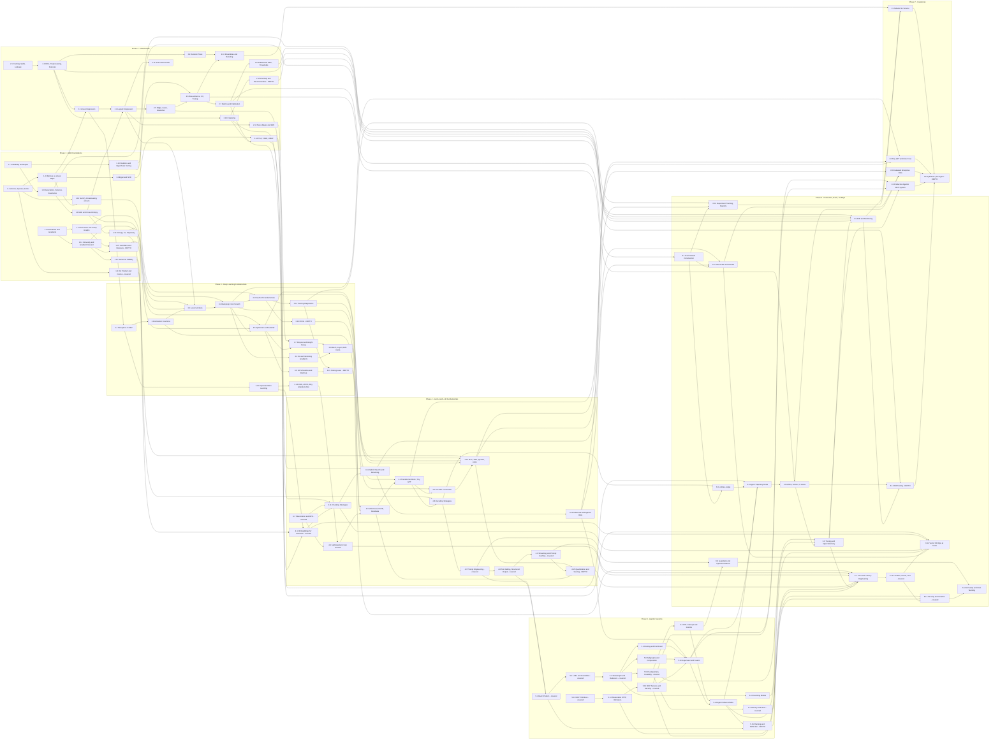

# MATH → CLASSICAL ML → DEEP LEARNING → AGENTIC AI
## The Missing-Foundations Roadmap (Gap-Fill for `agentic-ai-learning-path.md`)

> This document is a **map, not the territory**. No explanations, no code, no video links — those are a separate pass.
> It exists to fill one specific hole: the existing roadmap goes Python → infra → LLM APIs → RAG → LangGraph → MCP → production **without a single hour of mathematics, classical ML, or deep learning fundamentals.** That hole is real and it is closed here.

---

## SCOPE BOUNDARY

**"Complete" here means: sufficient to be competitive for a mid-to-senior AI/ML Engineer role in the 2026 market.** It does *not* mean every ML technique that exists, every paper, or research-scientist depth.

Every topic is tagged:

| Tier | Meaning |
|---|---|
| **CORE** | Hire-blocking. If you cannot do this, a competent interviewer will find out inside 30 minutes and you will not get the offer. |
| **DEPTH** | Differentiator. Genuinely valuable, but **do not start any DEPTH topic until every CORE phase is finished.** |

**Explicitly out of scope** (deliberately, not by oversight): research-level optimization theory, measure-theoretic probability, CUDA kernel authoring, distributed pretraining from scratch, custom architecture research, Bayesian nonparametrics, classical NLP pipelines (parsing, HMMs), and computer-vision specialization beyond a single conceptual CNN pass.

### Coverage audit — what this was checked against

Before finalizing, the CORE list in Phase 2 was checked line-by-line against **five** standard classical-ML syllabi:

1. **DeepLearning.AI Machine Learning Specialization** — full 3-course syllabus verified: linear regression, gradient descent, multiple regression, logistic regression, overfitting/regularization, neural networks, bias and variance, ML development process, skewed datasets, decision trees, tree ensembles, clustering, anomaly detection, collaborative + content-based filtering, PCA, reinforcement learning.
2. **fast.ai Practical Deep Learning for Coders** — lesson list verified: SGD from scratch, random forests, collaborative filtering, CNNs, NLP classification, plus Part 2 (matrix multiplication → backprop → attention → transformers → diffusion).
3. **Reference doc 1 (Krish Naik AI Roadmap)** — supervised/unsupervised, regression, classification, clustering, decision trees, random forest, XGBoost, SVM, model evaluation, hyperparameter tuning, feature engineering, EDA.
4. **Reference doc 2 (GenAI Engineering Handbook)** — Part 1 DL foundations, Part 2 transformers, Part 8 fine-tuning, Part 10 evaluation, Part 11 MLOps.
5. **2026 job-market signal** — ML fundamentals appear in ~24% of AI/ML engineering listings; LLMs, deep learning and problem-solving at ~16% each; prompt engineering ~14%; model evaluation and NLP ~12% each.

**Items those syllabi contain that are consciously *demoted*, not forgotten:** reinforcement learning as a standalone track (folded into Phase 4.14 as the conceptual basis for RLHF/DPO, which is where an Applied AI/ML Engineer actually meets it); anomaly detection and recommender systems (kept, but as a single DEPTH topic at 2.15 — rarely interview-blocking for agentic roles); CNN/vision depth (single DEPTH topic at 3.13).

**Items added that none of the five reference syllabi contain, but the 2026 market demands:** numerical stability (1.12), information theory / KL / perplexity (1.13), calibration (2.7), agent trajectory evals (6.4), OpenTelemetry-based tracing (6.6), and A/B testing for LLM features (6.15).

---

## RECONCILIATION NOTES

All four `learner_inputs` placeholders arrived unfilled in the prompt. The actual files were located on disk and used as primary sources:

| Input | Resolved to | Status |
|---|---|---|
| `existing_roadmap_v2` | `course-utils/agentic-ai-learning-path.md` (980 lines) | Read |
| `reference_doc_1` | `course-utils/AI_Roadmap_Krish_Naik_References.docx` | Extracted + read |
| `reference_doc_2` | `course-utils/GenAI_Engineering_Handbook.docx` | Extracted + read |
| `prior_learnings_inventory` | `llm-fundamentals/` (3 notes + 3 scripts), `rag-systems/` (1 note + 1 script) | Read |

### R1 — All three reference documents share the same blind spot

Reference doc 1 starts at Python and jumps straight to "Machine Learning" with no math section. Reference doc 2 starts at "Neural Network Basics" and assumes gradient descent, chain rule, and cross-entropy are already understood. The existing roadmap has no math and no classical ML at all. **The reviewer's flag is confirmed against all three sources simultaneously.** Phase 1 is therefore net-new to every input, not a reordering of any of them.

### R2 — Ordering conflict: reference doc 1 vs reference doc 2

Doc 1 orders: Python → Data Prep → **Classical ML** → GenAI → LLMs → RAG → Agents → MCP.
Doc 2 orders: **DL foundations** → Transformers → Prompting → Chunking → Embeddings → RAG → Architectures → Fine-tuning → Agents → Eval → MLOps.

**Resolution:** Doc 1 wins for macro-ordering (classical ML genuinely precedes deep learning — trees and regularization are prerequisites for reasoning about overfitting anywhere). Doc 2 wins for the internal ordering of Phases 3 and 4, where its DL-foundations → transformer-internals → fine-tuning sequence is stronger and better-sequenced than doc 1's flat topic list. Doc 1's "Data Cleaning & Preprocessing" and "EDA" sections are merged into a single Phase 2.2, because they are always taught and practiced together.

### R3 — Gaps in reference doc 1 that this roadmap adds

Doc 1's ML section omits: dimensionality reduction / PCA, bias-variance decomposition, cross-validation as an explicit topic, imbalanced-data handling, and probability calibration. All five are added as CORE in Phase 2 — PCA in particular is load-bearing because it is the same SVD from Phase 1.3 that later explains embedding dimensionality.

### R4 — Reference doc 2 is *ahead* of the existing roadmap in two places

Doc 2 covers fine-tuning (SFT / LoRA / QLoRA / DPO) and quantization (FP32 → BF16 → INT8 → INT4). The existing roadmap contains **neither**. Both are pulled in as Phase 4.14 (CORE) and 4.15 (DEPTH). Doc 2's chunking taxonomy (8 strategies) and advanced-RAG list (multi-query, HyDE, parent-child, context compression, Self-RAG, GraphRAG, Agentic RAG) are also richer than the existing roadmap's single "2A.2 Document Chunking Strategy" entry, and are adopted wholesale into 4.11 and 4.13.

### R5 — Currency corrections to the existing roadmap (verified against current official docs)

Three items in `agentic-ai-learning-path.md` are now out of date and are corrected in Phase 5:

- **"3.3 — Human-in-the-Loop with `interrupt_before`"** — current LangGraph docs teach the dynamic `interrupt()` function paired with `Command(resume=...)`. Corrected in **5.6**.
- **MCP transports** — the spec has moved through several revisions: `2025-03-26` introduced Streamable HTTP and OAuth 2.1; `2025-06-18` added structured output and elicitation and removed JSON-RPC batching; `2025-11-25` refined authorization discovery; a `2026-07-28` release candidate makes the protocol core stateless and adds MCP Apps and a Tasks extension. Bare SSE as a standalone transport is legacy. Corrected in **5.12**.
- **"6.2 — LangSmith: Tracing + Evaluation + CI/CD"** — broadened in **6.6** to vendor-neutral OpenTelemetry GenAI semantic conventions, with LangSmith / Langfuse / Phoenix as interchangeable backends. Single-vendor tracing is a weaker interview answer than the portable version.

Additionally, current LangGraph teaches **subgraphs**, **streaming modes** (`values` / `updates` / `messages` / `custom` / `checkpoints` / `tasks` / `debug`), the **Store** API for long-term memory, and **swarm-style handoff** alongside supervisor — none of which appear in the existing roadmap. Added as 5.8, 5.9, and 5.10.

### R6 — "Already covered" means two different things, and the difference matters

The prompt's context says to treat Python, FastAPI, REST, Docker, OCI, nginx, LangChain, LangGraph, MCP and RAG as DONE. The roadmap *curriculum* covers those. But the on-disk evidence of **completed work with artifacts** is only four topics:

| Artifact | Topic | Maps to |
|---|---|---|
| `llm-fundamentals/01_token_cost_across_scripts.{md,py}` | Transformers + tokenization (conceptual), BPE, O(N²) attention, lost-in-the-middle, softmax/logit scaling | 4.1 |
| `llm-fundamentals/02_prompt_engineering_triage.{md,py}` | System prompts, CoT, few-shot, XML structuring, hard constraints, prompt injection | 4.7 |
| `llm-fundamentals/03_tool_calling_streaming_caching.{md,py}` | Tool calling, Pydantic structured outputs, streaming, prompt caching, KV-cache | 4.8, 4.9 |
| `rag-systems/01_embeddings_conceptual.{md,py}` | Embeddings, cosine/dot/L2, pgvector operators, dimensionality trade-offs, thresholds | 1.4, 4.10 |

Everything else marked **ALREADY-COVERED** below rests on the stated professional background, not on a produced artifact. Where a topic is marked ALREADY-COVERED it still carries 1–3 hours for a skip-test-and-refresh pass, because "I have used it at work" and "I can whiteboard it under interview pressure" are different states.

### R7 — Assets already on disk (planning-relevant, not a resource list)

Relevant material already present under `d:\Madhan_Utils\learnings\ai-ml\`: *Introduction to Statistical Learning*, *Mathematics for AI ML Data Science*, *Hands-On Machine Learning with Scikit-Learn*, Murphy's *Machine Learning*, *Data Science from Scratch*, and *Python for Data Analysis*. Phases 1 and 2 need **no new purchases**. Specific chapter mappings belong to the resource pass, not this document.

### R8 — Unverified items

- The exact node list of **roadmap.sh/ai-engineer** could not be extracted — the page is client-rendered and the official PDF uses subset-embedded fonts. Its *themes* were confirmed via search (Python, math/statistics/linear algebra, ML, DL frameworks, GenAI, agentic AI, cloud/MLOps, AI safety and ethics), but any claim about its precise topic ordering is **[VERIFY]**.
- Exact **Krish Naik playlist titles** in reference doc 1 are reproduced from the learner's own document and were not independently verified — **[VERIFY]** before relying on them in the resource pass.

---

## HONEST TIMELINE

### Hours by phase

| Phase | CORE hrs | DEPTH hrs | Phase total |
|---|---|---|---|
| 1 — Math Foundations | 81 | 5 | 86 |
| 2 — Classical ML | 96 | 6 | 102 |
| 3 — Deep Learning Fundamentals | 65 | 12 | 77 |
| 4 — GenAI / LLM Fundamentals | 67 | 8 | 75 |
| 5 — Agentic Systems | 47 | 5 | 52 |
| 6 — Production / Evals / LLMOps | 71 | 5 | 76 |
| 7 — Capstone Projects | 130 | 55 | 185 |
| **TOTAL** | **557** | **96** | **653** |

### Calendar, at three commitment levels

| Weekly focused hours | CORE only — 557 h | CORE + DEPTH — 653 h | Does it meet the 6–12 month transition goal? |
|---|---|---|---|
| **5 hrs/week** | ~112 weeks (~26 months) | ~131 weeks (~30 months) | **No.** Not at any reading of the numbers. |
| **10 hrs/week** | ~56 weeks (~13 months) | ~65 weeks (~15 months) | **Marginally, and only CORE** — lands just past the 12-month edge. |
| **20 hrs/week** | ~28 weeks (~6.5 months) | ~33 weeks (~7.5 months) | **Yes**, with CORE done by month 7. |

**Read this before planning around the table:**

- These are **focused** hours — deliberate practice with the hands-on exercise completed. They are not hours with a video playing in another tab. Real calendars lose 4–6 weeks a year to work crunches, travel, and illness; add roughly 10–15% to every figure above for a realistic finish date.
- There is no configuration of this plan where 5 hrs/week reaches a mid-to-senior applied role inside 12 months. The honest options are: raise weekly hours, extend the horizon, or narrow the target role. Pick deliberately rather than discovering it at month 10.
- **Phases 1 and 2 are 188 hours of the 557 — 34% of all CORE work, and the least immediately gratifying.** This is the part of the plan most likely to be abandoned, and abandoning it reproduces exactly the gap the reviewer flagged.
- Phases can overlap slightly (Phase 6 evals work pairs naturally with Phase 4 RAG), but Phase 1 → 2 → 3 is strictly sequential. Skipping ahead is how people end up able to call an API and unable to explain why their model overfits.

---

## PHASE 1 — MATH FOUNDATIONS

**86 hours · 15 topics · Net-new to all three reference documents**

| # · Topic | Tier | Status | Why it matters + what it connects to | Skip-test (both from memory = skip) | Hrs |
|---|---|---|---|---|---|
| **1.1 Vectors, Vector Spaces, Norms** | CORE | NEW | The atomic unit of everything downstream: a feature row in 2.3, an activation in 3.1, an embedding in 4.10. L1 vs L2 norms are the literal mechanism behind Lasso vs Ridge in 2.5. Without this, "high-dimensional space" stays a metaphor instead of an object you can reason about. | ① Compute the L1 and L2 norms of [3, -4, 0] without a calculator. ② Explain why L1 drives coefficients to exactly zero but L2 only shrinks them. | 5 |
| **1.2 Matrices and Matrix Multiplication as Linear Maps** | CORE | NEW | Every layer in 3.1 and every attention head in 4.2 is a matrix multiply. Seeing multiplication as *composition of transformations* rather than a number-grinding rule is what makes 3.4 backprop and 4.3 multi-head attention legible. Feeds directly into 1.14 and 2.3. | ① Given A is 4x3 and B is 3x7, state the shape of AB and why BA is undefined. ② Describe geometrically what multiplying by a diagonal matrix does. | 6 |
| **1.3 Matrix Decompositions: Eigenvalues, Eigenvectors, SVD** | CORE | NEW | SVD *is* PCA in 2.14, and it is the same low-rank idea that makes LoRA work in 4.14. Understanding rank explains why a rank-8 adapter can meaningfully adjust a 7B model. Depends on 1.2; unlocks 2.14 and 4.14. | ① Define an eigenvector in one sentence without using the word "eigenvalue". ② Explain what the singular values in SVD tell you about which dimensions to discard. | 8 |
| **1.4 Dot Product, Projection, Cosine Geometry** | CORE | ALREADY-COVERED | Already worked through in `rag-systems/01_embeddings_conceptual.md` with cosine vs dot vs L2, pgvector operators, and threshold tuning. It reappears as the scoring core of 4.2 self-attention and 4.12 retrieval, so it is listed to make that link explicit rather than to re-teach it. | ① State when cosine and dot product rank results identically. ② Explain why normalizing embeddings makes dot product and cosine interchangeable. | 2 |
| **1.5 Derivatives, Partial Derivatives, Gradients** | CORE | NEW | A gradient is the direction of steepest ascent — that single fact is the entire justification for 2.3 gradient descent and 3.5 optimizers. Partial derivatives are how a loss with millions of parameters becomes tractable. Prerequisite for 1.6 and 1.11. | ① Give the gradient of f(x,y) = x²y + 3y. ② Explain why we step in the *negative* gradient direction when minimizing. | 6 |
| **1.6 Chain Rule and Computational Graphs** | CORE | NEW | This is backpropagation. 3.4 is nothing but the chain rule applied over a graph, and PyTorch autograd in 3.10 is its automation. Skipping this means treating `loss.backward()` as magic for the rest of your career. Depends on 1.5; unlocks 3.4 and 1.15. | ① Differentiate f(x) = sin(3x²) using the chain rule. ② Draw the computational graph for z = (a+b)·c and state ∂z/∂a. | 6 |
| **1.7 Probability: Random Variables, Distributions, Bayes** | CORE | NEW | An LLM is a conditional probability distribution over tokens — 4.6 decoding strategies are literally sampling policies over it. Bayes underpins 2.12 Naive Bayes and every "given the evidence, update the belief" argument in evals. Feeds 1.8, 1.9, 1.10. | ① State Bayes' theorem and define each of the four terms. ② A test is 99% accurate for a disease with 0.1% prevalence — is a positive result more likely true or false, and roughly why? | 8 |
| **1.8 Expectation, Variance, Covariance** | CORE | NEW | Variance is half of the bias-variance decomposition in 2.6, and covariance matrices are what PCA in 2.14 diagonalizes. It is also the statistical basis for detecting distribution drift in 6.9. Depends on 1.7. | ① Define covariance and state what a covariance of zero does and does not imply. ② Given E[X]=2 and E[X²]=9, compute Var(X). | 5 |
| **1.9 Maximum Likelihood Estimation and Cross-Entropy** | CORE | NEW | Cross-entropy loss in 3.3 is not an arbitrary choice — it is the negative log-likelihood of the data under the model, and this is the derivation that shows it. It is the same objective that trains 2.4 logistic regression and every LLM in Phase 4. Depends on 1.7; unlocks 3.3 and 1.13. | ① Explain why minimizing cross-entropy is equivalent to maximizing likelihood. ② Write the log-likelihood for n independent Bernoulli trials. | 6 |
| **1.10 Statistics: Descriptive, Inferential, Hypothesis Testing** | CORE | NEW | You cannot claim "the new prompt is better" without knowing whether the difference survives noise — this is the backbone of 6.15 A/B testing and of honest eval reporting in 6.5. Also governs how you read cross-validation variance in 2.6. | ① Define a p-value precisely, in a way that does not say "probability the hypothesis is true". ② Explain what a 95% confidence interval does and does not mean. | 8 |
| **1.11 Convexity, Loss Surfaces, the Mathematics of Gradient Descent** | CORE | NEW | Explains why linear and logistic regression in 2.3 and 2.4 converge reliably while neural nets in Phase 3 do not, and why learning rate is the one hyperparameter that breaks everything in 3.6. Depends on 1.5; unlocks 3.5 and 1.12. | ① Define a convex function and state why convexity guarantees a global minimum. ② Describe what happens to gradient descent when the learning rate is too large. | 6 |
| **1.12 Numerical Stability: Floating Point, Log-Sum-Exp, Softmax Overflow** | CORE | NEW | Partially touched via softmax/logit scaling in `llm-fundamentals/01`, but the stability tricks were not. This is why real softmax implementations subtract the max, why losses go NaN, and why BF16 beats FP16 in 4.15. Depends on 1.11. | ① Explain why softmax subtracts the row max before exponentiating. ② State why log-sum-exp is preferred over computing the log of a sum of exponentials directly. | 4 |
| **1.13 Information Theory: Entropy, KL Divergence, Perplexity** | CORE | NEW | Perplexity is the standard LLM quality number, and KL divergence is the regularizer that keeps DPO and RLHF in 4.14 from destroying the base model. Entropy also formalizes the information-gain split criterion in 2.9 decision trees. Depends on 1.9. | ① Define KL divergence and state why it is not symmetric. ② Explain the relationship between cross-entropy loss and perplexity. | 5 |
| **1.14 Linear Algebra in Code: NumPy, Broadcasting, einsum, Shape Discipline** | CORE | NEW | Turns 1.1–1.3 from notation into muscle memory. Shape errors are the single most common source of lost hours in Phase 3 and Phase 4, and broadcasting rules are the thing that makes batched attention in 4.3 readable. Unlocks 3.10. | ① State the broadcasting result of adding a (3,1) array to a (1,4) array. ② Express a batched matrix multiply over shape (B, N, D) x (B, D, M) in einsum notation. | 6 |
| **1.15 Jacobians, Hessians, Second-Order Intuition** | DEPTH | NEW | Explains *why* Adam's per-parameter adaptive rates in 3.5 approximate curvature information, and why second-order methods are impractical at LLM scale. Not hire-blocking, but it converts optimizer choice from folklore into reasoning. Depends on 1.6 and 1.11. | ① State the difference between a Jacobian and a Hessian. ② Explain why full second-order optimization is infeasible for a billion-parameter model. | 5 |

---

## PHASE 2 — CLASSICAL ML

**102 hours · 15 topics · The core of the flagged gap**

| # · Topic | Tier | Status | Why it matters + what it connects to | Skip-test (both from memory = skip) | Hrs |
|---|---|---|---|---|---|
| **2.1 Problem Framing, Train/Val/Test, Data Leakage** | CORE | NEW | The most common catastrophic ML mistake is leakage, and it is a framing error, not an algorithm error. This discipline transfers directly to building honest eval sets in 6.1 and avoiding contaminated golden data in 6.5. Gateway to all of Phase 2. | ① Give a concrete example of target leakage that would inflate validation accuracy. ② Explain why you scale using statistics fit on train only, never on the full dataset. | 6 |
| **2.2 EDA, Preprocessing, Feature Engineering** | CORE | NEW | Merged from reference doc 1's separate "Data Cleaning" and "EDA" sections because they are practiced together. Missing values, outliers, scaling and encoding decide model quality more than algorithm choice does, and the same distributional thinking drives drift detection in 6.9. Depends on 2.1; feeds 2.3 onward. | ① Name three ways to handle missing values and the assumption each one makes. ② Explain when target encoding causes leakage and how to prevent it. | 9 |
| **2.3 Linear Regression, Implemented From Scratch** | CORE | NEW | The first place 1.5 gradients and 1.11 convexity become a working model, and the direct conceptual ancestor of the perceptron in 3.1. Implementing it by hand — not calling sklearn — is what makes 3.4 backprop feel like an extension rather than a new subject. | ① Write the closed-form normal equation for linear regression. ② State two assumptions linear regression makes that, when violated, invalidate its coefficients. | 8 |
| **2.4 Logistic Regression and Decision Boundaries** | CORE | NEW | The sigmoid plus cross-entropy pairing here is *exactly* the output layer of every classifier in Phase 3, derived from 1.9 MLE. It is also the strongest interpretable baseline you will be expected to beat and to explain. Feeds 2.11, 2.12, 3.3. | ① Explain why we use log-loss rather than MSE for logistic regression. ② State what the decision boundary of logistic regression looks like geometrically. | 7 |
| **2.5 Regularization: Ridge, Lasso, ElasticNet** | CORE | NEW | This is 1.1's L1 and L2 norms doing real work, and it is the same idea as weight decay in 3.7 and AdamW in 3.5. The L1-produces-sparsity result is a standard interview question with a geometric answer. Depends on 1.1, 2.3, 2.4. | ① Explain geometrically why L1 produces exactly-zero coefficients and L2 does not. ② State what happens to the coefficients as the regularization strength approaches infinity. | 5 |
| **2.6 Bias-Variance, Cross-Validation, Hyperparameter Search** | CORE | NEW | The central diagnostic framework of all supervised learning — it tells you whether to add data, add features, or add capacity. Uses 1.8 variance and 1.10 statistics; transfers to reading eval-score variance in 6.5 and CI regression suites. | ① Given high train accuracy and low validation accuracy, state the diagnosis and two fixes. ② Explain why k-fold CV gives a better estimate than a single split, and its cost. | 7 |
| **2.7 Evaluation Metrics and Probability Calibration** | CORE | NEW | Accuracy is the wrong metric for most real problems, and knowing precision/recall/F1/ROC-AUC/PR-AUC trade-offs is a hard interview filter. Calibration — whether a 0.8 score means 80% — is the same question you will ask of LLM-judge scores in 6.3. Feeds 2.8, 6.1, 6.4. | ① State when PR-AUC is more informative than ROC-AUC and why. ② Explain what it means for a model to be well-calibrated and name one way to fix miscalibration. | 7 |
| **2.8 Imbalanced Data and Threshold Selection** | CORE | NEW | Nearly every real business problem — fraud, churn, defect, escalation — is imbalanced, and the naive model that predicts the majority class scores 99%. Resampling, class weights and threshold tuning are the fixes. Depends on 2.7; connects to 6.9 monitoring. | ① Explain why SMOTE must be applied inside the CV loop, not before it. ② Describe how you would pick a classification threshold given asymmetric costs of false positives and false negatives. | 5 |
| **2.9 Decision Trees** | CORE | NEW | Gini and information gain are 1.13 entropy applied to splitting, and trees are the only major model family that is natively non-linear, interpretable, and scale-invariant. Everything in 2.10 is built from them. Depends on 1.13, 2.2. | ① Explain how a decision tree chooses a split point for a continuous feature. ② State why an unpruned tree almost always overfits. | 6 |
| **2.10 Ensembles: Bagging, Random Forest, Boosting, XGBoost/LightGBM** | CORE | NEW | Gradient-boosted trees still win most tabular problems in 2026 — this is the single most practically valuable algorithm family in Phase 2 and the backbone of capstone C1. The bagging-vs-boosting distinction (variance reduction vs bias reduction) is a guaranteed interview question. Depends on 2.6, 2.9. | ① State the core difference between bagging and boosting in terms of bias and variance. ② Explain what makes Random Forest's trees decorrelated beyond just bootstrapping rows. | 8 |
| **2.11 SVM and the Kernel Trick** | CORE | NEW | Margin maximization is a different and instructive objective from likelihood, and the kernel trick — computing inner products in a high-dimensional space without ever constructing it — is one of the most elegant ideas in ML. Builds on 1.4 dot products and 2.4. | ① Explain what the kernel trick avoids computing, and why that matters. ② State what the C hyperparameter controls in a soft-margin SVM. | 8 |
| **2.12 Naive Bayes and k-NN Baselines** | CORE | NEW | Naive Bayes is 1.7 Bayes' theorem made concrete and remains a strong, near-free text baseline; k-NN is the conceptual sibling of vector retrieval in 4.12, which is literally k-NN over embeddings. Establishing cheap baselines before reaching for an LLM is a senior behaviour. | ① State the independence assumption Naive Bayes makes and why it still works despite being false. ② Explain how k-NN behaves as k approaches the size of the dataset. | 6 |
| **2.13 Clustering: k-Means, Hierarchical, DBSCAN** | CORE | NEW | The unsupervised counterpart, and directly reused: semantic chunking in 4.11 clusters sentence embeddings, and topic discovery over production traffic is how eval sets in 6.1 get built. Depends on 1.4 distance metrics. | ① Explain why k-means struggles with non-spherical clusters and name an algorithm that does not. ② State how you would choose k, and the weakness of the elbow method. | 7 |
| **2.14 Dimensionality Reduction: PCA, t-SNE, UMAP** | CORE | NEW | PCA is 1.3's SVD applied to the 1.8 covariance matrix — the clearest payoff of Phase 1 in the whole roadmap. It also explains embedding dimensionality trade-offs already met in `rag-systems/01`, and informs index and quantization choices in 6.12. | ① Explain what the principal components are in terms of variance and eigenvectors. ② State why t-SNE distances between clusters should not be interpreted as meaningful. | 7 |
| **2.15 Anomaly Detection and Recommender Systems** | DEPTH | NEW | Present in DeepLearning.AI's Course 3 and useful — collaborative filtering is an embedding model in disguise, and anomaly detection is the statistical basis of drift alarms in 6.9. Demoted to DEPTH because it is rarely the deciding factor in agentic-AI interviews. Depends on 2.13, 2.14. | ① Explain the cold-start problem and one mitigation. ② State how you would set an anomaly threshold when you have almost no labelled anomalies. | 6 |

---

## PHASE 3 — DEEP LEARNING FUNDAMENTALS

**77 hours · 15 topics · Reference doc 2 Part 1, expanded**

| # · Topic | Tier | Status | Why it matters + what it connects to | Skip-test (both from memory = skip) | Hrs |
|---|---|---|---|---|---|
| **3.1 Perceptron to MLP, Forward Propagation** | CORE | NEW | A neural network is stacked 2.3 linear regressions with non-linearities between them — stating it that way removes most of the mystique. Forward prop is the 1.2 matrix multiply chain that every transformer block in 4.4 is built from. | ① Write the forward pass of a 2-layer network in matrix form. ② Explain why stacking linear layers without activations is equivalent to a single linear layer. | 4 |
| **3.2 Activation Functions** | CORE | NEW | Non-linearity is the entire reason depth buys anything. ReLU's role in avoiding vanishing gradients connects forward to 3.9, and softmax here is the same softmax that produces token probabilities in 4.6. Depends on 3.1. | ① State why ReLU is preferred over sigmoid in hidden layers. ② Explain the dying-ReLU problem and one fix. | 3 |
| **3.3 Loss Functions: MSE and Cross-Entropy** | CORE | NEW | Direct application of 1.9 MLE: MSE for regression, cross-entropy for classification, and cross-entropy again as the next-token objective for every LLM in Phase 4. Also links to 1.13 perplexity. Depends on 1.9, 1.13. | ① State which loss you would use for multi-class classification and why. ② Explain what a cross-entropy loss of ln(V) means for a vocabulary of size V. | 4 |
| **3.4 Backpropagation, Implemented From Scratch** | CORE | NEW | The single highest-leverage exercise in Phase 3: implement it in NumPy with no autograd. This is 1.6's chain rule over 3.1's graph, and doing it once makes every later training bug diagnosable instead of mysterious. Depends on 1.6, 3.1; unlocks 3.10 and capstone C2. | ① Explain why backprop computes gradients right-to-left rather than left-to-right. ② State what the gradient of a ReLU is at negative inputs and what that implies. | 8 |
| **3.5 Optimizers: SGD, Momentum, Adam, AdamW** | CORE | NEW | Reference doc 2 lists these; here they are derived rather than memorized. AdamW is what actually trains modern LLMs, and its decoupled weight decay is 2.5 regularization done correctly. Depends on 1.11, 3.4; used in 4.14 fine-tuning. | ① Explain what momentum adds to plain SGD in one sentence. ② State the difference between Adam and AdamW and why it matters. | 5 |
| **3.6 Learning Rate Schedules and Warmup** | CORE | NEW | The learning rate is the hyperparameter most likely to be the reason a run failed, and warmup plus cosine decay is the near-universal default in transformer training. Connects 1.11 loss surfaces to practice; matters again when fine-tuning in 4.14. | ① Explain why warmup helps at the start of transformer training. ② Describe what a cosine decay schedule does to the learning rate over a run. | 3 |
| **3.7 Regularization in Deep Learning: Dropout, Weight Decay, Early Stopping** | CORE | NEW | The same 2.5 and 2.6 overfitting problem, with deep-learning-specific tools. Understanding dropout as implicit ensembling links it back to 2.10 bagging. Depends on 2.5, 3.5. | ① Explain why dropout is disabled at inference time and what is done to compensate. ② State how early stopping relates to the bias-variance trade-off. | 4 |
| **3.8 Normalization: BatchNorm, LayerNorm, RMSNorm** | CORE | NEW | LayerNorm and RMSNorm are load-bearing components of the transformer block in 4.3 and 4.4 — and the pre-norm vs post-norm choice is a real architectural decision. Knowing why BatchNorm fails for variable-length sequences is the key insight. Depends on 3.7. | ① Explain why LayerNorm rather than BatchNorm is used in transformers. ② State what RMSNorm drops relative to LayerNorm and why that is cheap. | 4 |
| **3.9 Weight Initialization, Vanishing and Exploding Gradients** | CORE | NEW | Explains why deep networks were untrainable before residual connections and careful init — which is precisely what 4.3's residual connections solve. Gradient clipping learned here is standard practice in fine-tuning at 4.14. Depends on 3.4. | ① Explain why initializing all weights to zero breaks a neural network. ② State what Xavier or He initialization scales by, and why. | 4 |
| **3.10 PyTorch Fundamentals: Tensors, Autograd, nn.Module, Training Loop** | CORE | NEW | The industry-standard implementation surface. After 3.4, autograd is understood rather than trusted. This is the tooling used for 3.13, 4.4's tiny GPT, and 4.14's LoRA run. Depends on 1.14, 3.4. | ① Explain what `optimizer.zero_grad()` does and what happens if you omit it. ② State the difference between a tensor with `requires_grad=True` and one without. | 10 |
| **3.11 Training Diagnostics: Overfit-a-Batch, Loss Curves, Gradient Norms** | CORE | NEW | The debugging discipline that separates people who can train models from people who can only run scripts. Overfitting a single batch is the fastest correctness test in existence. Feeds 4.14 fine-tuning and 6.10 experiment tracking. Depends on 3.10. | ① Explain what it means if your model cannot overfit a single batch of 8 examples. ② State two distinct causes of a loss curve that suddenly spikes to NaN. | 5 |
| **3.12 Embeddings and Representation Learning** | CORE | NEW | `rag-systems/01` covered what embeddings *are*; this covers how they are *learned* — word2vec through contrastive sentence encoders. That mechanism explains why some embedding models suit retrieval in 4.10 and others do not. Depends on 3.1; feeds 4.10 and 3.14. | ① Explain the training objective that makes word2vec place similar words near each other. ② State why a model trained with a contrastive objective is better for retrieval than a raw LLM's hidden states. | 6 |
| **3.13 Convolutional Neural Networks** | DEPTH | NEW | Kept for two reasons: it is the clearest illustration of inductive bias and parameter sharing, and vision encoders matter for multimodal inputs in 4.5. Demoted to DEPTH because CNN implementation skill is not hire-blocking for agentic roles. Depends on 3.10. | ① Explain what parameter sharing in a convolution buys over a fully-connected layer. ② State what pooling does to spatial resolution and why that can be desirable. | 8 |
| **3.14 RNNs, LSTMs, and Why Attention Replaced Them** | CORE | NEW | Reference doc 2 opens its transformer section with exactly this motivation, and it is right: you cannot appreciate why self-attention in 4.2 was a breakthrough without first feeling the sequential bottleneck and long-range forgetting it removed. Depends on 3.12; motivates 4.2. | ① State the two specific problems with RNNs that transformers solve. ② Explain what an LSTM's gates were designed to fix. | 5 |
| **3.15 Scaling Laws and Compute-Data Trade-offs** | DEPTH | NEW | Understanding that capability is a predictable function of compute, data and parameters is what lets you reason about whether to fine-tune, prompt, or wait for a better base model — a genuinely senior judgement call feeding 4.14 and 6.7. DEPTH because it is a differentiator, not a filter. Depends on 3.6, 3.11. | ① State roughly what scaling laws predict about loss as a function of compute. ② Explain the practical implication of compute-optimal training for whether you should train your own model. | 4 |

---

## PHASE 4 — GENAI / LLM FUNDAMENTALS

**75 hours · 15 topics · 5 already covered by existing artifacts**

| # · Topic | Tier | Status | Why it matters + what it connects to | Skip-test (both from memory = skip) | Hrs |
|---|---|---|---|---|---|
| **4.1 Tokenization and Byte-Pair Encoding** | CORE | ALREADY-COVERED | Completed in `llm-fundamentals/01` including BPE mechanics and cross-script token-cost measurement. Listed because it is the upstream cause of 4.11 chunking boundaries and of 6.7 cost asymmetry across languages. Refresh only. | ① Explain why the same sentence in Telugu costs more tokens than in English. ② State what BPE merges are and how vocabulary size is chosen. | 1 |
| **4.2 Self-Attention From Scratch: Q, K, V, Scaled Dot-Product** | CORE | NEW | `llm-fundamentals/01` covered attention *conceptually* — O(N²) cost and lost-in-the-middle — but not the mechanism. Implementing QK^T/√d_k · V by hand turns 1.4 dot products and 1.2 matrix maps into the core of every modern model. Depends on 1.4, 3.14; unlocks 4.3. | ① State why the attention scores are divided by the square root of d_k. ② Explain what the causal mask does and why it is needed during training. | 6 |
| **4.3 Multi-Head Attention, Positional Encodings, Residuals, Norm Placement** | CORE | NEW | Multiple heads capture different relation types; positional encodings (including RoPE) restore the order information that parallel attention destroys; residuals and 3.8 LayerNorm make depth trainable. This is the complete transformer sub-layer. Depends on 3.8, 3.2, 4.2. | ① Explain why positional information must be injected explicitly into a transformer. ② State what breaks if you remove residual connections from a 24-layer model. | 6 |
| **4.4 The Transformer Block and Decoder-Only Architecture: Build a Tiny GPT** | CORE | NEW | The capstone exercise of the entire internals track — assemble 4.2, 4.3, 3.5 and 3.10 into a working character-level GPT you train yourself. After this, no LLM behaviour is a black box. Depends on 3.4, 3.10, 4.3; drives capstone C2. | ① Describe the full data flow through one transformer block, in order. ② State what the feed-forward layer contributes that attention does not. | 10 |
| **4.5 Encoder-Only vs Decoder-Only vs Encoder-Decoder** | CORE | NEW | Determines which model you reach for: BERT-family for the 4.10 retrieval and 4.12 reranking path, decoder-only for generation, encoder-decoder for translation. Reference doc 2 Part 7 covers exactly this trade-off. Depends on 4.4. | ① State which architecture family you would use for a cross-encoder reranker and why. ② Explain what bidirectional attention gives an encoder that a decoder cannot have. | 3 |
| **4.6 Decoding Strategies: Greedy, Beam, Temperature, Top-k, Top-p** | CORE | NEW | These are sampling policies over the 1.7 probability distribution the model outputs, made numerically safe by 1.12. Directly controls output determinism — which is why it matters for reproducible LLM-judge scoring in 6.3. Depends on 1.7, 1.12, 4.4. | ① Explain the difference between top-k and top-p sampling. ② State what temperature approaching zero does to the output distribution. | 4 |
| **4.7 Prompt Engineering: System Prompts, CoT, Few-Shot, XML Structuring** | CORE | ALREADY-COVERED | Completed in `llm-fundamentals/02`, including hard-constraint breakage testing and prompt-injection isolation. Retained in the map because it is the direct upstream of 5.1 ReAct prompting and of 6.8 injection guardrails. Refresh only. | ① State the four jobs a system prompt should do. ② Explain why CoT must precede the answer rather than follow it. | 1 |
| **4.8 Tool Calling and Structured Outputs** | CORE | ALREADY-COVERED | Completed in `llm-fundamentals/03` with Pydantic schema validation and the tool-call lifecycle state machine. This is the primitive that all of Phase 5 is built on — every agent is a tool-calling loop. Refresh only. | ① Describe the full round trip of a tool call from model output to final answer. ② State how you would handle a model returning malformed JSON against a schema. | 1 |
| **4.9 Streaming, Prompt Caching, KV-Cache** | CORE | ALREADY-COVERED | Completed in `llm-fundamentals/03` including measured cache-creation vs cache-read token behaviour and nginx buffering. Feeds 6.7 cost engineering and 5.9 LangGraph streaming modes directly. Refresh only. | ① Explain what the KV-cache stores and why it makes generation faster. ② State the ordering constraint that must hold for a prompt cache to hit. | 1 |
| **4.10 Embeddings for Retrieval** | CORE | ALREADY-COVERED | Completed in `rag-systems/01` — metrics, pgvector operators, dimensionality trade-offs, threshold tuning. Now enriched by 3.12 (how they are trained) and 2.14 (why dimensions can be reduced). Refresh only. | ① State how you would choose a similarity threshold for a retrieval system. ② Explain the trade-off between 384-dim and 1536-dim embeddings. | 1 |
| **4.11 Chunking Strategies** | CORE | NEW | Reference doc 2 Part 4 gives eight strategies; the existing roadmap has one line. Chunk boundaries determine retrieval ceiling — no reranker recovers information split across chunks. Semantic chunking is 2.13 clustering over 4.10 embeddings. Depends on 4.1, 2.13. | ① State when you would choose parent-child chunking over fixed-size with overlap. ② Explain why semantic chunking is expensive and when that cost is justified. | 5 |
| **4.12 RAG Pipeline: Hybrid Search, Reranking, Metadata Filtering** | CORE | NEW | Vector search alone fails on rare terms, acronyms and IDs — hybrid BM25 plus dense retrieval is the production default, and cross-encoder reranking is the highest-ROI single addition. Retrieval is k-NN from 2.12 over 4.10 embeddings. Feeds 6.2 and capstone C3. | ① Explain why a bi-encoder is used for retrieval and a cross-encoder for reranking. ② State a query type where BM25 beats dense retrieval outright. | 8 |
| **4.13 Advanced RAG: Multi-Query, HyDE, Parent-Child, Compression, GraphRAG, Agentic RAG** | CORE | NEW | Reference doc 2 Part 6.3 lists these and they are now table stakes in interviews. Agentic RAG in particular is the bridge into Phase 5 — the retrieval loop becomes an agent decision. Depends on 4.12; feeds 5.10 and capstone C3. | ① Explain the intuition behind HyDE and when it helps. ② State the failure mode of multi-query retrieval and its cost implication. | 8 |
| **4.14 Fine-Tuning: SFT, LoRA, QLoRA, DPO, and When Not To** | CORE | NEW | **Absent from the existing roadmap entirely.** LoRA is 1.3's low-rank decomposition applied to frozen weights; DPO's KL term is 1.13 information theory. The senior skill is knowing that most problems are prompting or retrieval problems, not fine-tuning problems. Depends on 1.3, 1.13, 3.5, 3.10, 4.5; drives capstone C2. | ① Explain what LoRA trains and why merging A·B costs nothing at inference. ② State two conditions under which fine-tuning is the wrong answer and retrieval is the right one. | 12 |
| **4.15 Quantization and Inference Serving** | DEPTH | NEW | Reference doc 2 Part 8.4 covers FP32 through INT4; serving with continuous batching is how throughput is actually achieved. DEPTH because most applied roles consume a hosted API rather than operate a serving stack — but it becomes CORE the moment self-hosting is on the table. Depends on 1.12, 4.9, 4.14. | ① State why BF16 is preferred over FP16 for training on modern accelerators. ② Explain what continuous batching improves over static batching. | 8 |

---

## PHASE 5 — AGENTIC SYSTEMS

**52 hours · 15 topics · 7 already covered — this phase is mostly currency corrections and genuine gaps**

| # · Topic | Tier | Status | Why it matters + what it connects to | Skip-test (both from memory = skip) | Hrs |
|---|---|---|---|---|---|
| **5.1 ReAct Pattern** | CORE | ALREADY-COVERED | Covered by existing roadmap Phase 3.1 and by professional background. It is 4.7 prompting plus 4.8 tool calling in a loop — listed to make that decomposition explicit, since "an agent" is not a primitive. Refresh only. | ① State the three repeating steps of a ReAct loop. ② Explain what causes a ReAct agent to loop forever and one way to bound it. | 1 |
| **5.2 LangChain LCEL and Runnables** | CORE | ALREADY-COVERED | Existing background. The composition model matters mainly as the substrate beneath 5.3 — worth a skip test, not a re-study. | ① State what the pipe operator composes in LCEL. ② Explain the difference between `invoke`, `batch` and `stream` on a Runnable. | 1 |
| **5.3 LangGraph StateGraph: Nodes, Edges, TypedDict State, Reducers** | CORE | ALREADY-COVERED | Existing background plus existing roadmap Phase 4. Reducers are the subtle part — how concurrent node writes merge — and they resurface in 5.8 subgraphs and 5.10 multi-agent state sharing. Refresh only. | ① Explain what an `Annotated` reducer does when two nodes write the same key. ② State the difference between an edge and a conditional edge. | 2 |
| **5.4 Conditional Routing and Command-Based Control Flow** | CORE | NEW | Current LangGraph lets a node return a `Command` that both updates state *and* names the next node — a control-flow primitive the existing roadmap predates. It is how routers and handoffs in 5.10 are actually built now. Depends on 5.3. | ① State what a `Command` object can do that a plain state update cannot. ② Explain when you would use a conditional edge versus returning a Command. | 4 |
| **5.5 Checkpointers and Durable Execution** | CORE | ALREADY-COVERED | Existing roadmap Phase 4.2 covers MemorySaver to PostgresSaver. Durability is what makes 5.6 human-in-the-loop possible at all — the graph must survive the wait. Redis and Postgres backends both current. Refresh only. | ① Explain what a `thread_id` identifies and why it is required for resumption. ② State what is persisted at a checkpoint and what is not. | 2 |
| **5.6 Human-in-the-Loop: `interrupt()` and `Command(resume=...)`** | CORE | NEW | **Currency correction.** The existing roadmap teaches `interrupt_before`, a static pre-node hook; current docs teach the dynamic `interrupt()` call paired with `Command(resume=...)`, which allows pausing mid-node with an arbitrary payload for review. This is the approval gate in capstone C4 and a guardrail in 6.8. Depends on 5.5. | ① Explain the difference between a static interrupt-before and a dynamic `interrupt()` call. ② State what happens to node code above the interrupt when the graph resumes. | 4 |
| **5.7 Memory Architecture: Short-Term, Long-Term Store, Context Management** | CORE | ALREADY-COVERED | Existing roadmap Phase 4.5. The Store API for cross-thread long-term memory is the piece worth re-checking — it is namespaced semantic storage, i.e. 4.10 retrieval applied to agent memory. Refresh only. | ① State the difference between checkpointer state and Store state. ② Explain one strategy for keeping a long conversation inside the context window. | 2 |
| **5.8 Subgraphs and Composition** | CORE | NEW | Not in the existing roadmap. Subgraphs are how a multi-agent system stays maintainable — each agent is a compiled graph embedded as a node, with explicit shared-key contracts. Directly enables 5.10. Depends on 5.3. | ① Explain how state keys are shared between a parent graph and a subgraph. ② State why you would compile a subgraph separately rather than inlining its nodes. | 4 |
| **5.9 Streaming Modes** | CORE | NEW | Not in the existing roadmap. Current LangGraph exposes `values`, `updates`, `messages`, `custom`, `checkpoints`, `tasks` and `debug` modes — choosing correctly is what makes an agent feel responsive and what makes 6.6 tracing usable. Builds on 4.9. Depends on 5.3. | ① State the difference between the `values` and `updates` stream modes. ② Explain which mode you would use to surface token-by-token output to a UI. | 3 |
| **5.10 Multi-Agent: Supervisor and Swarm Handoff Patterns** | CORE | NEW | Existing roadmap has supervisor only, in Phase 6.1. Swarm-style peer handoff is the current alternative, and knowing when each applies — centralized routing versus dynamic delegation — is a senior design judgement. Depends on 5.4, 5.8, 5.13; feeds capstone C4. | ① State the core structural difference between supervisor and swarm architectures. ② Explain how message history is scoped when control hands off between agents. | 8 |
| **5.11 MCP Architecture: Tools, Resources, Prompts, Transports** | CORE | ALREADY-COVERED | Existing roadmap Phase 5.1 plus professional background. The three-primitive model is stable across spec revisions; the transports are what changed. Refresh only, then go straight to 5.12. | ① State the difference between an MCP tool, a resource, and a prompt. ② Explain which primitive is model-controlled and which is application-controlled. | 2 |
| **5.12 MCP Streamable HTTP, Elicitation, Sampling** | CORE | NEW | **Currency correction.** Streamable HTTP replaced standalone SSE; the `2025-06-18` revision added elicitation (server requests structured human input) and structured output, and removed JSON-RPC batching; `2025-11-25` refined authorization discovery; a `2026-07-28` release candidate makes the core stateless and adds MCP Apps and Tasks. Sampling lets a server request a completion from the host, enabling recursive workflows. Depends on 5.11. | ① Explain how Streamable HTTP differs from the older SSE transport. ② State what elicitation is for and how it differs from sampling. | 5 |
| **5.13 Building MCP Servers and MCP Security** | CORE | ALREADY-COVERED | Existing roadmap Phase 5.2 and 5.3 cover FastMCP, JWT, audit logging and rate limiting. Worth re-verifying against OAuth 2.1 authorization discovery from the newer spec revisions. Feeds 6.13 and capstone C4. | ① State how you would scope a tool so an agent cannot read another tenant's rows. ② Explain what you would log for an auditable tool invocation. | 3 |
| **5.14 Agent Failure Modes: Loops, Cost Blowups, Tool Errors, Recovery** | CORE | NEW | Absent from all three reference documents, and the thing that actually breaks agents in production: infinite tool loops, runaway spend, silent tool failures, context overflow mid-run. Recursion limits, budgets and typed error returns are the fixes. Depends on 5.6, 5.10; feeds 6.4 and 6.7. | ① Name three distinct ways an agent run can fail that a single-shot LLM call cannot. ② State how you would enforce a hard cost ceiling on a single agent run. | 6 |
| **5.15 Planning, Reflection, and When an Agent Is the Wrong Tool** | DEPTH | NEW | Reflection and plan-then-execute improve quality on hard tasks — but the senior skill is recognizing that a deterministic pipeline or a single structured call beats an agent for most problems, at a fraction of the cost and variance. DEPTH because it is judgement, not mechanism. Depends on 5.1, 5.14. | ① State two task properties that make an agentic loop genuinely worth its cost. ② Explain why adding a reflection step can make output worse. | 5 |

---

## PHASE 6 — PRODUCTION, EVALS, AND LLMOPS

**76 hours · 15 topics · Where the 2026 market separates senior from mid**

| # · Topic | Tier | Status | Why it matters + what it connects to | Skip-test (both from memory = skip) | Hrs |
|---|---|---|---|---|---|
| **6.1 Eval Dataset Construction** | CORE | NEW | Everything downstream is worthless without a trustworthy golden set, and building one is a data-discipline problem straight out of 2.1 leakage and 2.7 metric selection. Mining real production traffic beats inventing cases. Feeds 6.2, 6.3, 6.4, 6.10. | ① Explain why an eval set written by the same person who wrote the prompt is biased. ② State how you would decide how many cases your eval set needs. | 6 |
| **6.2 RAG Evaluation: Faithfulness, Relevancy, Context Precision and Recall** | CORE | NEW | Reference doc 2 Part 10 covers the RAGAS metric family. These decompose "the answer was bad" into retrieval failure versus generation failure — without that split you tune blindly. Depends on 4.12, 4.13, 6.1; drives capstone C3. | ① State which metric tells you the retriever failed versus the generator hallucinated. ② Explain how context recall can be measured without exhaustive human labelling. | 6 |
| **6.3 LLM-as-Judge: Rubrics, Bias, Judge Validation** | CORE | NEW | The default scaling mechanism for evaluation — and the one most often used wrong. Judges have position bias, verbosity bias and self-preference; validating the judge against human labels is the step everyone skips. Uses 2.7 calibration and 4.6 determinism. Feeds 6.4, 6.5. | ① Name two known biases of LLM judges and a mitigation for each. ② Explain how you would establish that your judge actually agrees with humans. | 6 |
| **6.4 Agent and Trajectory Evaluation** | CORE | NEW | Absent from all reference documents. Agents need path-level evaluation, not just final-answer scoring: correct tool selection, argument correctness, step count, recovery after a tool error. This is what 5.14 failure modes are measured with. Depends on 5.10, 5.14, 6.1, 6.3; drives capstone C4. | ① State two things you would measure about an agent run beyond final-answer correctness. ② Explain why a correct final answer via a wrong trajectory is still a defect. | 6 |
| **6.5 Offline vs Online Evaluation and CI Regression Suites** | CORE | NEW | Turning evals into a blocking CI gate is what makes an LLM system safe to change — the same regression discipline as 2.6 cross-validation, applied to prompts and graphs. Score variance must be read statistically, per 1.10. Feeds 6.15 and capstone C3. | ① Explain why a prompt change that improves the average score can still be a regression. ② State how you would set a pass threshold for an eval suite in CI. | 5 |
| **6.6 Tracing and Observability: OpenTelemetry GenAI Conventions** | CORE | NEW | **Broadened from the existing roadmap's LangSmith-only treatment.** The four pillars are metrics, traces, logs and evaluation; portable OTel instrumentation with LangSmith, Langfuse or Phoenix as interchangeable backends is a stronger answer than any single vendor. Multi-step agent traces from 5.9 are the hard case. Depends on 5.5, 5.9, 6.5; drives capstone C4. | ① State what a span represents in a traced multi-step agent run. ② Explain why per-step token attribution matters for debugging cost. | 6 |
| **6.7 Cost and Latency Engineering: Caching, Model Routing, Batching** | CORE | NEW | The lever that most often decides whether a feature ships. Prompt caching from 4.9, routing cheap models to easy cases, and batching are the standard three — most teams have no cost controls at all, which makes this a visible differentiator. Depends on 4.9, 4.15, 5.14, 3.15. | ① State the cost and latency trade-off of routing to a smaller model for classification steps. ② Explain how prompt-prefix ordering affects cache hit rate. | 5 |
| **6.8 Guardrails: Injection, Jailbreak, PII, Toxicity, Grounding, Output Validation** | CORE | NEW | Reference doc 2 Part 3.10 lists the categories; prompt-injection isolation was already explored in `llm-fundamentals/02`. In an agentic system with real tools, injection is a privilege-escalation vector, not a content problem. Depends on 4.7, 5.6; feeds 6.14. | ① Explain why prompt injection is more dangerous for a tool-using agent than for a chatbot. ② State where in the pipeline you would place a PII redaction step and why. | 6 |
| **6.9 Drift Detection and Production Monitoring** | CORE | NEW | The classical-ML operations skill that GenAI teams keep rediscovering. Distribution shift is 1.8 covariance and 2.2 distributional thinking applied to live traffic; embedding drift is its retrieval-side equivalent. Depends on 1.8, 2.2, 2.8, 6.6; drives capstone C1. | ① State how you would detect that production inputs no longer resemble training data. ② Explain the difference between data drift and concept drift. | 5 |
| **6.10 Experiment Tracking and Model Registry** | CORE | NEW | Reference doc 2 Part 11.1 covers MLflow and W&B. Without run tracking, 3.11 training diagnostics and 4.14 fine-tuning comparisons are unreproducible — and "which prompt version is in prod" becomes unanswerable. Depends on 3.11, 4.14, 6.1; drives capstone C1. | ① State the minimum set of artifacts needed to reproduce a training run. ② Explain what a model registry stage transition is for. | 5 |
| **6.11 Serving: FastAPI, Docker, OCI, NGINX, Health Checks** | CORE | ALREADY-COVERED | Existing roadmap Phase 6.4 plus direct professional background including OCI and nginx buffering already handled in `llm-fundamentals/03`. Refresh only; this is the deployment substrate for every capstone. | ① State what `proxy_buffering off` fixes for a streaming endpoint. ② Explain the difference between a liveness and a readiness probe. | 2 |
| **6.12 Vector Database Operations at Scale** | CORE | NEW | Reference doc 2 Part 5.4 gives the index taxonomy: Flat for development, HNSW under ~1M vectors, IVF plus PQ beyond ~10M. Product quantization is 2.14 dimensionality reduction under a memory budget. Reindexing strategy is the operational gap nobody plans for. Depends on 2.14, 4.10, 4.11. | ① State which index you would choose for 50M vectors and the accuracy cost. ② Explain how you would re-embed a corpus after changing embedding models, with no downtime. | 5 |
| **6.13 Security: Secrets, Tenant Isolation, Rate Limiting, Audit Logging** | CORE | ALREADY-COVERED | Existing roadmap Phase 5.3 and 6.5 cover JWT, audit logging and rate limiting for MCP. Worth re-verifying against 5.12's OAuth 2.1 authorization discovery and against agent-specific risks from 5.14. Refresh only. | ① State how you would prevent an agent from reading another tenant's data through a shared tool. ② Explain what must never appear in a trace payload. | 3 |
| **6.14 AI Safety and Responsible AI in Practice** | CORE | NEW | Not an afterthought and increasingly an explicit interview topic: red-teaming your own agent, documenting known failure modes, understanding refusal behaviour, and building the eval that catches the harm before a user does. Depends on 6.8, 6.13. | ① Describe how you would red-team an agent that has database write access. ② State one harm that evals catch and one that only human review catches. | 5 |
| **6.15 A/B Testing and Statistical Significance for LLM Features** | DEPTH | NEW | The direct payoff of 1.10 hypothesis testing: LLM outputs are high-variance, so most observed "improvements" are noise. Knowing sample size, sequential-testing traps and practical-vs-statistical significance is what makes shipping decisions defensible. DEPTH only because 6.5 covers the blocking case. Depends on 1.10, 6.5, 6.9; drives capstone C5. | ① Explain why peeking at an A/B test daily and stopping when significant inflates false positives. ② State how you would size an experiment for a 2% expected improvement. | 5 |

---

## PHASE 7 — CAPSTONE PROJECTS

**185 hours · 5 projects, ordered smallest to most senior-portfolio-grade**

Each project must produce: a public repository, a written decision log explaining *why* each choice was made, and a measured result. A project without numbers is a tutorial, not a portfolio piece.

### C1 — Tabular ML Service · CORE · ~20 h
**Exercises: Phase 1, Phase 2, Phase 6**

Predict something from the ERP domain already understood — for example invoice payment delay or subcontract billing exception risk. Full classical pipeline: EDA and feature engineering (2.2), a regularized linear baseline (2.3, 2.5), a gradient-boosted tree model (2.10), honest cross-validation (2.6), calibrated probabilities with threshold selection against asymmetric costs (2.7, 2.8). Serve via FastAPI (6.11), track runs in MLflow (6.10), add a drift monitor (6.9).

**Why first:** smallest scope, and it proves the exact thing the reviewer said was missing. It is also the project most likely to be directly useful at work.
**Done when:** a held-out test score with a confidence interval, a calibration plot, a documented threshold decision tied to business cost, and a drift alarm that fires on synthetically shifted data.

### C2 — Tiny GPT, Trained and Fine-Tuned · CORE · ~30 h
**Exercises: Phase 1, Phase 3, Phase 4**

Two halves. First: implement backprop in NumPy (3.4), then build and train a character-level decoder-only transformer from scratch in PyTorch (4.2, 4.3, 4.4, 3.10). Second: take a small open-weight model and LoRA fine-tune it on a narrow domain task (4.14), then compare it head-to-head against a well-engineered prompt on the same task with the same eval set.

**Why second:** it converts Phase 3 and Phase 4 from reading into ability, and the prompt-versus-fine-tune comparison is the single most useful piece of judgement in applied GenAI.
**Done when:** the from-scratch model generates coherent text, and you can state with measured numbers whether fine-tuning beat prompting, at what cost, and why.

### C3 — Evaluated Enterprise RAG · CORE · ~35 h
**Exercises: Phase 1, Phase 2, Phase 4, Phase 6**

Production-shaped RAG over a real document corpus: chunking-strategy comparison with measured retrieval impact (4.11), hybrid BM25 plus dense retrieval with cross-encoder reranking (4.12), at least two advanced patterns benchmarked against the baseline (4.13). Then the part most portfolios skip: a golden eval set built from real queries (6.1), RAGAS metrics plus a validated LLM judge (6.2, 6.3), and a CI gate that blocks regressions (6.5).

**Why third:** RAG is the highest-frequency interview subject for these roles, and almost every candidate's RAG project has no evaluation. Having one is the differentiator.
**Done when:** an ablation table showing what each retrieval change did to faithfulness and context precision, plus a CI run that visibly fails on a deliberately regressed prompt.

### C4 — Production Agentic MCP System · CORE · ~45 h
**Exercises: Phase 4, Phase 5, Phase 6**

A LangGraph multi-agent system against real Oracle/APEX or ORDS data through a custom MCP server. Supervisor or swarm topology with subgraph-per-agent (5.8, 5.10), Command-based routing (5.4), Postgres checkpointing (5.5), a genuine `interrupt()` approval gate before any write operation (5.6), and a custom MCP server on Streamable HTTP with OAuth 2.1 and audit logging (5.12, 5.13). Instrumented with OpenTelemetry tracing (6.6), guardrails including injection defence (6.8), agent trajectory evals (6.4), a hard per-run cost ceiling (5.14, 6.7), deployed on OCI behind NGINX (6.11).

**Why fourth:** this is the project that maps most directly onto the target job description, and it exercises the existing Oracle background as a genuine advantage rather than something to leave behind.
**Done when:** the agent survives a process restart mid-run, refuses a prompt-injection attempt in the trace, blocks on the approval gate, and reports trajectory eval scores and cost per run.

### C5 — Hybrid ML + Agent System with Full Measurement · DEPTH · ~55 h
**Exercises: All seven phases**

The senior-grade piece. An agent that calls the C1 classical model as a tool, with a router deciding when a deterministic ML path beats an LLM path (5.15, 6.7). Full measurement layer: trajectory and outcome evals (6.4), drift monitoring on both the ML model and the embedding space (6.9, 6.12), a real A/B test with sample-size justification and a significance analysis (6.15, 1.10), and documented cost and latency SLOs. Ship the MCP server as open source with a written architecture decision record.

**Why last:** it is the only project that demonstrates the full arc — that you can tell when *not* to use an LLM, prove it with statistics, and operate the result. That combination is what separates a senior applied engineer from a framework user.
**Done when:** you can whiteboard the entire system in 20 minutes and defend every routing, indexing, eval and cost decision with a number.

---

## HOW EVERY TOPIC CONNECTS

> Rendered as a Mermaid `flowchart` rather than a `mindmap`: the `mindmap` type supports neither subgraphs nor arbitrary cross-links, and both were required. Phases are subgraphs; arrows are the "connects to" relationships named in the tables above.

---

## SOURCES

Cross-checked against the following, per the research instruction:

- [DeepLearning.AI — Machine Learning Specialization](https://www.deeplearning.ai/courses/machine-learning-specialization/) — full syllabus verified
- [fast.ai — Practical Deep Learning for Coders](https://course.fast.ai/) — lesson list verified
- [LangGraph official documentation](https://docs.langchain.com/oss/python/langgraph/) — `interrupt`/`Command`, subgraphs, streaming modes, Store, checkpointers verified
- [Model Context Protocol — Streamable HTTP specification](https://modelcontextprotocol.io/specification/draft/basic/transports/streamable-http)
- [MCP specification version timeline](https://hidekazu-konishi.com/entry/mcp_specification_version_timeline.html)
- [roadmap.sh — AI Engineer](https://roadmap.sh/ai-engineer) — themes confirmed, precise node list **[VERIFY]**
- [roadmap.sh — Machine Learning](https://roadmap.sh/machine-learning) — **[VERIFY]**
- [AI/ML Engineering Jobs in 2026: Analyzing 10,000+ Posts](https://axialsearch.com/insights/ai-ml-engineering-jobs/) — skill-frequency figures
- [The Roadmap for Mastering LLMOps in 2026 — MachineLearningMastery](https://machinelearningmastery.com/the-roadmap-for-mastering-llmops-in-2026/)
- [How Agentic AI is reshaping hiring for India's GCCs — YourStory](https://yourstory.com/enterprise-story/2026/07/agentic-ai-reshaping-hiring-india-gccs)
- [GCC Skills Demand Report — Savannah HR](https://savannahr.com/insights/gcc-skills-demand-report-q1-2026)
- Reference doc 1 — `AI_Roadmap_Krish_Naik_References.docx` (local); playlist titles **[VERIFY]**
- Reference doc 2 — `GenAI_Engineering_Handbook.docx` (local)
