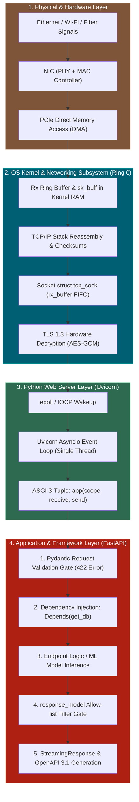
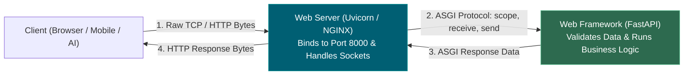
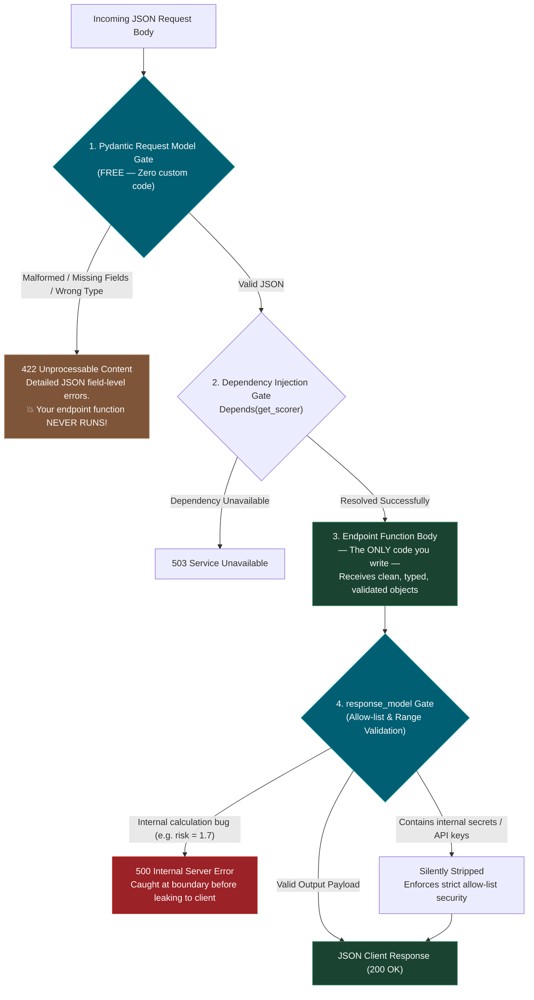
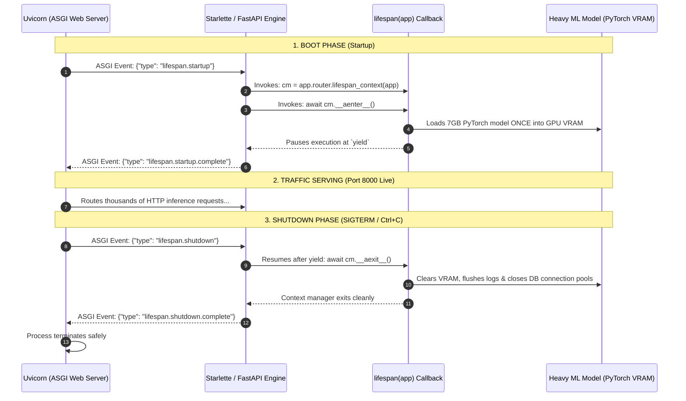
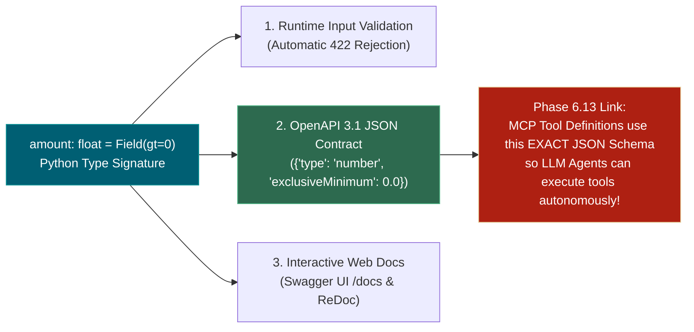
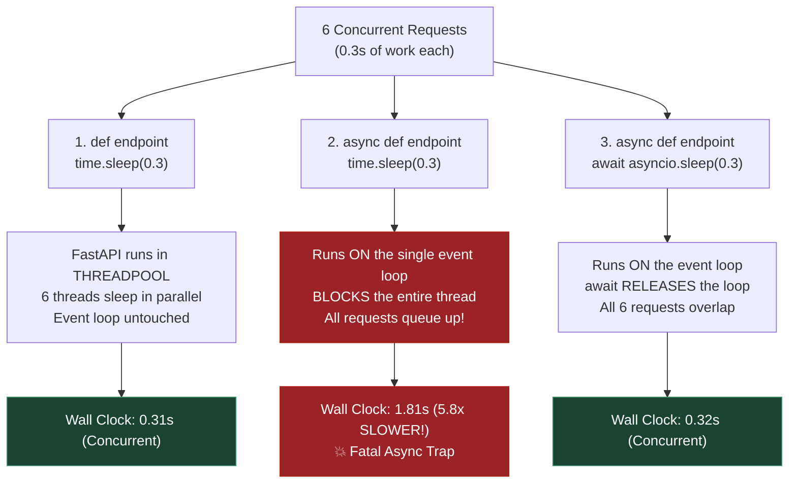
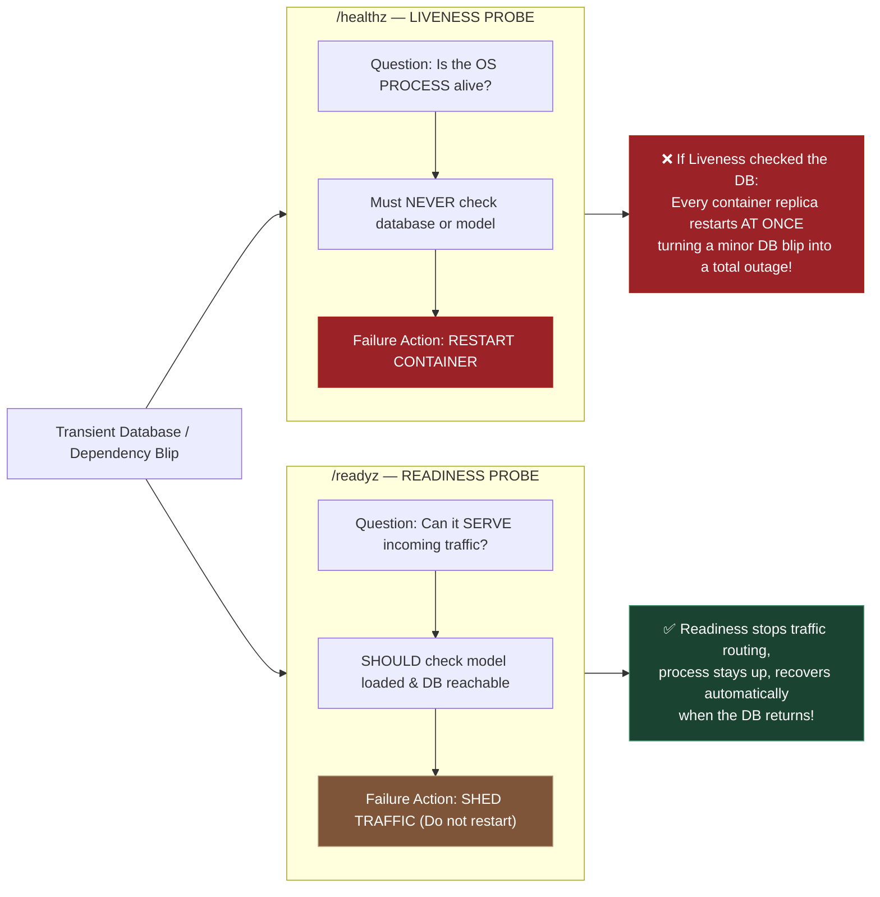

# 🌐 The Complete FastAPI & Systems Architecture Master Guide

> **Curriculum Path**: [Phase 0 — Topic 0.9: Building APIs with FastAPI](file:///d:/Madhan_Utils/learnings/ai-ml/ai-ml-course/course-path/phase-0-engineering-foundations/09_building_apis_with_fastapi.md) | **Companion Script**: [`09_building_apis_with_fastapi.py`](file:///d:/Madhan_Utils/learnings/ai-ml/ai-ml-course/course-path/phase-0-engineering-foundations/09_building_apis_with_fastapi.py)

---

## 🧭 Master Architecture Map & Table of Contents

This guide synthesizes the complete vertical journey of a web request—from physical electrons on copper wires, through OS kernel memory and socket descriptors, through the Uvicorn ASGI event loop, into FastAPI route handlers, Pydantic validation gates, and AI token streaming.



### 📚 Deep-Dive Topic Index
1. [Physical Ingestion: NIC, Analog-to-Digital, and DMA](#1-the-physical--hardware-ingestion-layer)
2. [OS Kernel, Sockets, File Descriptors & Port Binding](#2-the-os-kernel-sockets-file-descriptors--port-binding)
3. [Web Server vs. Web Framework: Uvicorn & ASGI Protocol](#3-web-server-vs-web-framework-uvicorn--asgi)
4. [FastAPI Request Lifecycle & Validation Gates](#4-fastapi-request-lifecycle--validation-gates)
5. [The Lifespan Callback Architecture](#5-the-lifespan-callback-architecture)
6. [OpenAPI Schema Generation & The AI / MCP Link](#6-openapi-schema-generation--the-ai--mcp-link)
7. [Production Engineering & AI Serving Mechanics](#7-production-engineering--ai-serving-mechanics)

---

## 1. The Physical & Hardware Ingestion Layer

> 📖 **Dedicated Deep-Dive**: [nic-and-fifo-buffers-explained.md](file:///d:/Madhan_Utils/learnings/ai-ml/ai-ml-course/explanations/nic-and-fifo-buffers-explained.md)

### 1.1 Analog Waves to Digital Bits
When a client sends an HTTP request, it travels across physical mediums as continuous analog energy:
- **Copper Ethernet**: High-frequency electrical voltage pulses ($+1\text{V}, 0\text{V}, -1\text{V}$).
- **Fiber Optics**: Laser pulses (photons).
- **Wi-Fi**: Radio frequency electromagnetic waves ($2.4\text{GHz} / 5\text{GHz}$).

The **Network Interface Card (NIC)** on your motherboard processes this in two specialized silicon chips:
1. **The PHY Transceiver (Analog $\rightarrow$ Bits)**: An ultra-fast **Analog-to-Digital Converter (ADC)** samples voltage lines billions of times per second. Using **Clock & Data Recovery (CDR)**, it synchronizes with the sender's clock to extract a clean digital bitstream (`1`s and `0`s).
2. **The MAC Controller (Framing & Verification)**:
   - **Preamble Sync**: Detects the starting delimiter (`10101011`).
   - **Hardware MAC Filter**: If the frame is not addressed to this machine's MAC address (and is not broadcast), it is discarded immediately in silicon with **zero CPU overhead**.
   - **CRC32 Checksum**: Computes Frame Check Sequence (FCS). If electrical noise flipped a bit, the frame is dropped silently.
   - **Byte Assembly**: Packs bits into 8-bit bytes in onboard SRAM.

### 1.2 Direct Memory Access (DMA) & Ring Buffers
- **The Problem**: At **10 Gbps (1.25 GB/sec)**, if the CPU had to execute assembly instructions to copy every byte from the NIC into RAM, the CPU would spend 100% of its power on memory copies, freezing all Python and ML code.
- **The Solution (DMA)**: The NIC's onboard DMA controller becomes a bus master. It bypasses the CPU entirely and writes packets directly into pre-allocated **Rx Ring Buffers in System RAM** over the PCIe bus.
- **Notification**: Once the packet is in RAM, the NIC fires a hardware interrupt (`MSI-X / IRQ`) or the kernel polls via NAPI to wake up the OS TCP/IP stack.

---

## 2. The OS Kernel, Sockets, File Descriptors & Port Binding

> 📖 **Dedicated Deep-Dives**:
> - [what-is-the-os-kernel.md](file:///d:/Madhan_Utils/learnings/ai-ml/ai-ml-course/explanations/what-is-the-os-kernel.md)
> - [where-sockets-live-in-the-kernel.md](file:///d:/Madhan_Utils/learnings/ai-ml/ai-ml-course/explanations/where-sockets-live-in-the-kernel.md)
> - [file-descriptors-ip-ports-and-0000-explained.md](file:///d:/Madhan_Utils/learnings/ai-ml/ai-ml-course/explanations/file-descriptors-ip-ports-and-0000-explained.md)
> - [how-web-servers-bind-sockets-tls-and-bytes.md](file:///d:/Madhan_Utils/learnings/ai-ml/ai-ml-course/explanations/how-web-servers-bind-sockets-tls-and-bytes.md)

### 2.1 The Kernel: Gatekeeper & Privilege Isolation
The **Kernel** is the master software program of the OS running in **Ring 0 (Supervisor Mode)**. Normal user applications (Python, Chrome) run in **Ring 3 (User Mode)**, a restricted sandbox.
- Python is **physically blocked by the CPU hardware** from touching RAM, disks, or network cards directly.
- To perform any I/O, Python must invoke a **System Call (Syscall)** to request kernel action.

### 2.2 What is a "Socket" and Where Does It Live?
A **Socket** is NOT a physical port or a file on a hard drive.
- A **Socket** is a **C-struct (`struct tcp_sock` in Linux) allocated inside KERNEL SPACE RAM**.
- It contains:
  1. The **5-Tuple**: $(\text{Source IP}, \text{Source Port}, \text{Dest IP}, \text{Dest Port}, \text{Protocol: TCP})$.
  2. The **`rx_buffer` (Receive FIFO Queue)**: In-memory buffer holding incoming bytes.
  3. The **`tx_buffer` (Transmit FIFO Queue)**: In-memory buffer holding outgoing response bytes.
  4. The **TCP State Machine**: (`LISTEN`, `SYN_SENT`, `ESTABLISHED`, `TIME_WAIT`).

### 2.3 File Descriptors (FDs)
The Kernel represents this complex socket to Python as a simple non-negative integer ticket called a **File Descriptor**:
- `0` = `stdin` (Keyboard)
- `1` = `stdout` (Terminal screen)
- `2` = `stderr` (Error logs)
- `3+` = Sockets, open disk files, database handles.

### 2.4 Port Binding, `0.0.0.0:8000`, and Syscalls
To start listening on a network port, the web server executes **4 fundamental syscalls**:
1. `socket(AF_INET, SOCK_STREAM)`: Kernel creates a master socket struct in RAM (returns `fd = 3`).
2. `bind(fd: 3, "0.0.0.0", 8000)`: Registers the socket in the Kernel Port Hash Table.
   - **`127.0.0.1:8000` (Localhost)**: Only accepts connections originating from inside the *same machine*.
   - **`0.0.0.0:8000` (Wildcard)**: Tells the Kernel to accept connections across **every physical and virtual network interface** (Ethernet, Wi-Fi, Docker).
3. `listen(fd: 3, backlog=2048)`: Sets state to `TCP_LISTEN` and allocates the connection queue.
4. `accept(fd: 3)`: When a client completes the TCP 3-way handshake, the kernel allocates a **NEW connected socket (`fd = 4`)** with its own FIFO buffers for HTTP data transfer, while the master listening socket (`fd = 3`) resumes listening for new callers.

### 2.5 Port Scale & Concurrency Limits
- **Port Count**: Exactly $65,536$ ports ($0 - 65535$) per IP address.
- **Connection Capacity**: A single server listening on port `8000` can handle **millions of concurrent client connections** because each connection is identified by a unique **5-Tuple** (different client IPs and source ports). Concurrency is bounded only by **File Descriptor limits (`ulimit -n`)** and **Kernel RAM** ($\approx 2\text{ KB} - 4\text{ KB}$ per socket).

### 2.6 SSL/TLS 1.3 Handshake & Decryption
1. **Asymmetric Handshake (ECDHE)**: Client and server exchange public certificates (`cert.pem`) and negotiate a temporary **Symmetric Session Key** without transmitting secrets over the wire.
2. **Symmetric Line-Rate Decryption**: Subsequent packets in the socket are decrypted using hardware-accelerated **AES-256-GCM**, turning encrypted ciphertext into plaintext HTTP bytes (`b"POST /score HTTP/1.1\r\n..."`).

---

## 3. Web Server vs. Web Framework: Uvicorn & ASGI

> 📖 **Dedicated Deep-Dives**:
> - [web-server-vs-web-framework-fastapi.md](file:///d:/Madhan_Utils/learnings/ai-ml/ai-ml-course/explanations/web-server-vs-web-framework-fastapi.md)
> - [uvicorn-asgi-event-loop-explained.md](file:///d:/Madhan_Utils/learnings/ai-ml/ai-ml-course/explanations/uvicorn-asgi-event-loop-explained.md)

### 3.1 Why FastAPI is NOT a Web Server
- **Web Server (Uvicorn / NGINX)**: Low-level networking program that binds to ports, manages sockets, decrypts TLS, and handles byte streams.
- **Web Framework (FastAPI)**: High-level Python library that defines routing (`@app.post("/score")`), Pydantic validation, and business logic.
- **The Desk Phone Analogy**: Uvicorn is the telephone hardware maintaining the wire connection; FastAPI is the customer service agent speaking to the caller. Running `python app.py` on a raw FastAPI file exits in 0.05 seconds because FastAPI has zero port-listening capabilities.



### 3.2 The Uvicorn Asyncio Event Loop
Unlike legacy WSGI servers (Gunicorn/Flask) that spin up 1 heavy OS thread per request, Uvicorn runs a **single thread with an Asyncio Event Loop** powered by `uvloop` (C-based libuv) and `httptools` (Fast C HTTP parser).
- When a task pauses on I/O (`await db.fetch()` or `await asyncio.sleep()`), control yields back to the event loop.
- The single OS thread immediately switches to process other incoming client sockets, enabling **10,000+ concurrent connections on a single CPU core**.

### 3.3 The ASGI Standard Interface: `app(scope, receive, send)`
FastAPI is fundamentally a single asynchronous function conforming to the 3-part ASGI specification:
1. **`scope`**: A dictionary containing connection metadata (`{"type": "http", "method": "POST", "path": "/score", "headers": [...]}`).
2. **`receive`**: An async channel where Uvicorn delivers incoming request byte chunks and lifecycle signals.
3. **`send`**: An async channel where FastAPI pushes HTTP status codes, headers, and serialized JSON chunks back to Uvicorn.

---

## 4. FastAPI Request Lifecycle & Validation Gates

> 📖 **Companion Code**: [`09_building_apis_with_fastapi.py`](file:///d:/Madhan_Utils/learnings/ai-ml/ai-ml-course/course-path/phase-0-engineering-foundations/09_building_apis_with_fastapi.py) (Demos 1 & 2)



### 4.1 Demo 1: The Free Input Validation Gate
When a client sends malformed JSON (e.g. negative numbers, missing strings, wrong types), Pydantic rejects it with a **`422 Unprocessable Content`** error naming the exact failing field path.
- **The Core Fact**: The endpoint handler function **never executes**. Defensive checks like `if not payload.get("amount")` are completely eliminated.

### 4.2 Demo 2: `response_model` Guarding the Way OUT
`response_model` performs two crucial production tasks:
1. **Catches Internal Bugs**: If your ML model computes an invalid probability (`risk = 1.7` against a `le=1` constraint), FastAPI halts and throws a `500 Internal Server Error` instead of emitting corrupted numbers.
2. **Strict Allow-List Security (Data Leak Prevention)**: If a handler inadvertently returns sensitive internal dictionary keys (`internal_api_key`, `postgres://connection_string`, `raw_prompt`), `response_model` **silently strips all unapproved fields** before serialization.

---

## 5. The Lifespan Callback Architecture

> 📖 **Dedicated Deep-Dive**: [fastapi-lifespan-callback-pattern.md](file:///d:/Madhan_Utils/learnings/ai-ml/ai-ml-course/explanations/fastapi-lifespan-callback-pattern.md)

### 5.1 Why the Syntax Looks Circular (Type Hints vs. Runtime Handshake)
Learners often get confused by:
```python
@asynccontextmanager
async def lifespan(app: FastAPI):
    # Startup (before yield)
    yield
    # Shutdown (after yield)

app = FastAPI(lifespan=lifespan)
```
- **Definition Phase**: `app: FastAPI` in the function definition is **NOT an input argument**—it is simply a static **Python Type Hint**.
- **Registration Phase**: `app = FastAPI(lifespan=lifespan)` stores the function reference inside `app.router.lifespan_context`.
- **Runtime Boot**: When Uvicorn boots, it sends the ASGI event `{"type": "lifespan.startup"}`. FastAPI internally executes `context_manager = app.router.lifespan_context(app)` and awaits `context_manager.__aenter__()`.



### 5.2 Why `lifespan` Matters for AI Engineers
Without `lifespan`, loading a 7GB model inside an endpoint would force every single incoming `/predict` request to reload weights from disk, turning a 5ms prediction into a **30-second p99 latency disaster**. `lifespan` guarantees the model loads **exactly once** at server boot.

---

## 6. OpenAPI Schema Generation & The AI / MCP Link

> 📖 **Dedicated Deep-Dive**: [openapi-specification.md](file:///d:/Madhan_Utils/learnings/ai-ml/ai-ml-course/explanations/openapi-specification.md)

### 6.1 One Typed Signature, Three Artifacts



### 6.2 The Direct Bridge to Phase 6.13 (Model Context Protocol / MCP)
In modern AI engineering, **OpenAPI is not just documentation for humans**. 
- Modern LLM tool calling (OpenAI Functions, Anthropic Tools, and Model Context Protocol in **6.13**) uses the exact same underlying **JSON Schema specification**.
- When an AI agent decides how to call your API, it parses this machine-readable contract. Writing precise type hints and `Field(...)` descriptions directly equips autonomous AI agents to interact with your services without human assistance.

---

## 7. Production Engineering & AI Serving Mechanics

> 📖 **Companion Code**: [`09_building_apis_with_fastapi.py`](file:///d:/Madhan_Utils/learnings/ai-ml/ai-ml-course/course-path/phase-0-engineering-foundations/09_building_apis_with_fastapi.py) (Demos 3, 5, 6, 7)

### 7.1 The Fatal "Async Trap" (Demo 5 Measurements)
Because Uvicorn runs on **ONE single event loop thread**, placing synchronous blocking code inside an `async def` function stalls the entire server.



#### The Golden Rules:
1. **Async I/O (`httpx`, `asyncpg`)** $\rightarrow$ Use `async def` and `await`.
2. **Blocking / CPU Heavy Work (`scikit-learn`, `numpy`, `torch.predict`, `time.sleep`, `requests`)** $\rightarrow$ Use **plain `def`** (FastAPI runs it on a background threadpool) or wrap with `await asyncio.to_thread(func)`.

---

### 7.2 Streaming LLM Tokens Behind Reverse Proxies (Demo 6)
When streaming ChatGPT-style tokens using `StreamingResponse`, you must send the HTTP header:
```python
headers = {"X-Accel-Buffering": "no", "Cache-Control": "no-cache"}
```
- **Why It Matters**: Without `X-Accel-Buffering: no`, downstream reverse proxies like **NGINX (0.12)** buffer all streaming chunks in memory and deliver the response as one giant batch blob—silently destroying real-time streaming for frontend users.

---

### 7.3 Liveness (`/healthz`) vs. Readiness (`/readyz`) Probes (Demo 7)



---

### 7.4 Dependency Injection (`Depends`) as a Testing Seam (Demo 3)
`Depends` is not syntactic tidiness—it is an architectural **testing seam**.
- By injecting resources (`get_scorer`) through `Depends`, unit test suites (**0.5**, **7.5**) can replace heavy production PyTorch models or live cloud databases with mock stubs in one line:
```python
app.dependency_overrides[get_scorer] = lambda: {"name": "test-stub-v0"}
```
- This allows complete CI/CD test automation with **zero GPU requirements, zero network calls, and zero API credit spend**.

---

## 8. Summary Checklist for AI Engineers

| Concept | What It Does / Prevents | Where It Applies |
|---|---|---|
| **NIC DMA & Ring Buffers** | Prevents CPU starvation during high-speed packet ingestion | Hardware & OS Ingestion |
| **Kernel Sockets (`5-Tuple`)** | Manages `rx_buffer` / `tx_buffer` and multiplexes millions of connections | Kernel Subsystem |
| **Uvicorn ASGI Loop** | Non-blocking single-threaded event loop handling 10k+ concurrent requests | Web Serving Layer |
| **Pydantic Request Model** | Rejects malformed JSON with 422 before handler code executes | API Boundary Gate |
| **`response_model`** | Prevents internal bugs and strips sensitive data/API keys from responses | Outgoing Security Gate |
| **`lifespan` Manager** | Loads heavy ML models into GPU VRAM once at boot, avoiding 30s p99 spikes | Model Serving Lifecycle |
| **Plain `def` vs `async def`** | Prevents CPU/blocking code from freezing the entire single event loop thread | Concurrency Architecture |
| **`X-Accel-Buffering: no`** | Prevents NGINX from buffering real-time LLM token streams | AI Streaming |
| **Separate `/healthz` & `/readyz`** | Prevents cascading restart loops during transient database blips | Cloud Deployment (**7.11**) |
| **OpenAPI 3.1 Generation** | Automatically creates machine-readable contracts for AI Agents & MCP | Phase 6.13 MCP |
