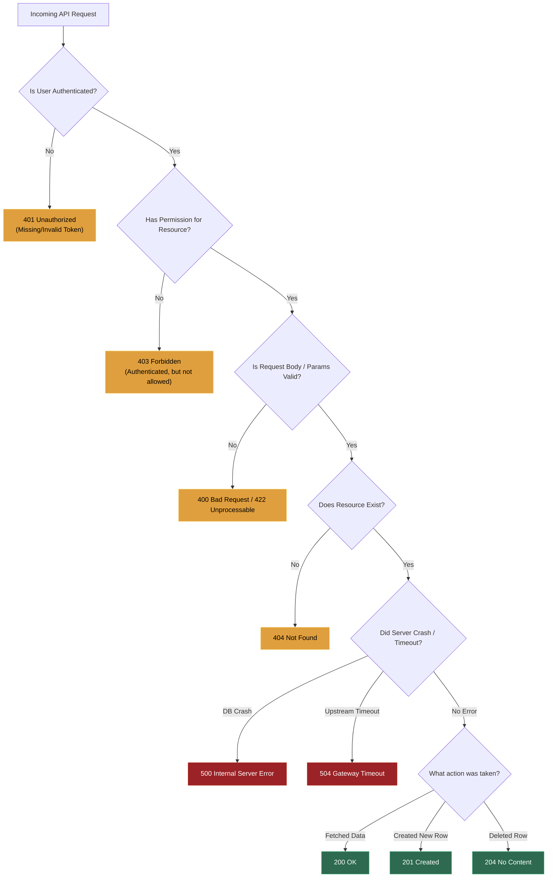

# 📌 The Complete HTTP Status Codes Reference (1xx, 2xx, 3xx, 4xx, 5xx)

> **Quick Mnemonic**:
> - **1xx**: *"Hold on, I'm processing..."* (Informational)
> - **2xx**: *"Here you go, all good!"* (Success)
> - **3xx**: *"Go look over there!"* (Redirection)
> - **4xx**: *"You (the client) made a mistake!"* (Client Error)
> - **5xx**: *"I (the server) messed up!"* (Server Error)

---

### 💡 The Restaurant Analogy

| Code Series | Restaurant Equivalent |
| :--- | :--- |
| **1xx (Info)** | The waiter says: *"Order noted, heading to the kitchen."* |
| **2xx (Success)** | The waiter places your delicious meal on your table. |
| **3xx (Redirect)** | The waiter says: *"That table is closed, please sit in the patio section."* |
| **4xx (Client Error)** | The waiter says: *"You ordered something not on our menu, or forgot your wallet."* |
| **5xx (Server Error)** | The waiter runs out crying: *"The kitchen caught fire, we cannot cook!"* |

---

### 🎨 Visual Decision Flowchart for API Designers

---

## 1️⃣ 1xx: Informational (Request Received, Continuing)

| Code | Name | What it Means & When It's Used |
| :--- | :--- | :--- |
| **`100`** | **Continue** | Server received initial request headers; client should proceed to send the request body (used in large uploads). |
| **`101`** | **Switching Protocols** | Client asked to upgrade connection protocol (e.g. upgrading HTTP/1.1 to **WebSocket** `ws://`). |
| **`102`** | **Processing** | WebDAV: Server received request and is still processing, no response yet. |
| **`103`** | **Early Hints** | Server returns headers before full response so browser can pre-load CSS/JS assets early. |

---

## 2️⃣ 2xx: Success (Everything Worked As Expected)

| Code | Name | What it Means & When It's Used |
| :--- | :--- | :--- |
| **`200`** | **OK** | Standard successful response for `GET`, `PUT`, `PATCH`. Body contains requested data. |
| **`201`** | **Created** | Request succeeded and a **new resource was created** (standard for `POST /users`). Returns `Location` header. |
| **`202`** | **Accepted** | Request received and queued for async background processing (e.g. video encoding job), but not completed yet. |
| **`203`** | **Non-Authoritative Info** | Returned by a proxy modifying the original payload. |
| **`204`** | **No Content** | Success, but there is **no body to return** (standard for `DELETE /users/42`). |
| **`206`** | **Partial Content** | Client requested a byte range (e.g. streaming a video / resuming a file download). |

---

## 3️⃣ 3xx: Redirection (Go Look Somewhere Else)

| Code | Name | What it Means & When It's Used |
| :--- | :--- | :--- |
| **`301`** | **Moved Permanently** | URL has permanently changed. Search engines and browsers cache the new URL forever (e.g. `http://` $\rightarrow$ `https://`). |
| **`302`** | **Found (Temporary Redirect)** | Resource temporarily at a different URL. Do not cache (e.g. redirecting to login page). |
| **`304`** | **Not Modified** | Client cached file is still fresh (`ETag` matches). Server sends 0 bytes body, saving bandwidth! |
| **`307`** | **Temporary Redirect** | Like 302, but guarantees the HTTP method will **NOT change** (e.g. `POST` stays `POST`). |
| **`308`** | **Permanent Redirect** | Like 301, but guarantees the HTTP method will **NOT change** (e.g. `POST` stays `POST`). |

---

## 4️⃣ 4xx: Client Error (The Request is Invalid / Fault of Caller)

| Code | Name | What it Means & When It's Used |
| :--- | :--- | :--- |
| **`400`** | **Bad Request** | Malformed syntax, invalid JSON, or missing required headers. |
| **`401`** | **Unauthorized** | **Missing or invalid authentication** token/credentials (User is not logged in). |
| **`403`** | **Forbidden** | User is logged in, but **does not have permission** to access this resource (e.g. regular user trying to access `/admin`). |
| **`404`** | **Not Found** | The requested URL or database entity ID does not exist. |
| **`405`** | **Method Not Allowed** | Endpoint exists, but doesn't support this HTTP verb (e.g. `POST /login` exists, but client sent `DELETE /login`). |
| **`408`** | **Request Timeout** | Client took too long to send the HTTP payload. |
| **`409`** | **Conflict** | State conflict in database (e.g. trying to register with an email that already exists). |
| **`410`** | **Gone** | Resource existed before but was permanently deleted and will never come back. |
| **`413`** | **Payload Too Large** | Uploaded file or request body exceeds server limit (e.g. uploaded 100MB file when limit is 10MB). |
| **`415`** | **Unsupported Media Type** | Server expects `Content-Type: application/json` but client sent `text/xml`. |
| **`422`** | **Unprocessable Entity** | JSON is valid syntax, but fields failed validation (standard in FastAPI / Pydantic when `age: "banana"`). |
| **`429`** | **Too Many Requests** | Rate limit exceeded! Client is making too many requests too fast. |

---

## 5️⃣ 5xx: Server Error (The Server or Database Failed)

| Code | Name | What it Means & When It's Used |
| :--- | :--- | :--- |
| **`500`** | **Internal Server Error** | Generic uncaught exception in backend code (e.g. unhandled `NullPointerException` or `KeyError`). |
| **`501`** | **Not Implemented** | Server does not recognize or support the requested HTTP method. |
| **`502`** | **Bad Gateway** | An intermediate proxy/gateway (Nginx, Cloudflare, ALB) received an invalid response from the backend app. |
| **`503`** | **Service Unavailable** | Server is temporarily overloaded, down for maintenance, or DB connection pool exhausted. |
| **`504`** | **Gateway Timeout** | An intermediate proxy (Nginx / Cloudflare) waited for the backend, but the backend took too long to respond. |
| **`505`** | **HTTP Version Not Supported** | Server does not support the HTTP protocol version in the request. |
