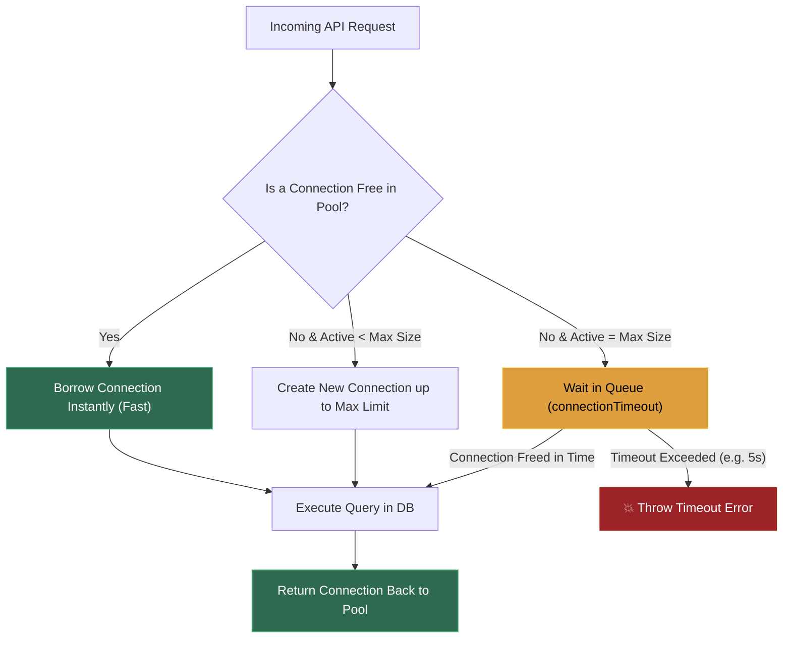

# 📌 Connection Pooling & Pool Max Size

> **Reference / Context**: [08_consuming_rest_apis.md](file:///d:/Madhan_Utils/learnings/ai-ml/ai-ml-course/course-path/phase-0-engineering-foundations/08_consuming_rest_apis.md) | [09_building_apis_with_fastapi.md](file:///d:/Madhan_Utils/learnings/ai-ml/ai-ml-course/course-path/phase-0-engineering-foundations/09_building_apis_with_fastapi.md) | [15_postgres_pgvector_redis.md](file:///d:/Madhan_Utils/learnings/ai-ml/ai-ml-course/course-path/phase-0-engineering-foundations/15_postgres_pgvector_redis.md) | [connection-pooling-and-maxsize-explained-simply.md](file:///d:/Madhan_Utils/learnings/ai-ml/ai-ml-course/explanations/connection-pooling-and-maxsize-explained-simply.md)
> **Topic Context**: Database Performance, Backend Architecture & Connection Management

---

### 1. 🎯 What is it? (In Plain English)
- **Connection Pool**: A standby collection of pre-opened database connections kept ready for reuse so your app doesn't waste time opening and closing connections on every single request.
- **Pool Max Size**: The maximum number of database connections your app is allowed to keep open at the same time.

---

### 2. 💡 The Real-World Analogy

#### 🚕 The Airport Taxi Stand Analogy
- **Without a Pool (Slow)**: Every passenger arriving at the airport has to call a car factory to build and register a new taxi, take the ride, and then scrap the car at the destination.
- **With a Pool (Fast)**: A fleet of taxis waits in a dedicated line. A passenger hops in, reaches their destination, and the taxi drives back to the stand for the next passenger.
- **Pool Max Size**: The maximum parking capacity at the airport stand (e.g., 10 taxis). If all 10 are on trips, passenger #11 waits in a queue until one taxi returns.

---

### 3. 🎨 Visual Flowchart



---

### 4. ⚡ Quick Example (Node.js / TypeScript)

```typescript
import { Pool } from 'pg';

const pool = new Pool({
  host: 'localhost',
  database: 'myapp',
  min: 2,         // Keep at least 2 connections ready
  max: 10,        // POOL MAX SIZE: Never open more than 10 connections
  connectionTimeoutMillis: 5000 // Wait max 5 seconds if pool is full
});

// Borrow, Use, and Release
const client = await pool.connect();
try {
  const result = await client.query('SELECT * FROM users WHERE id = $1', [123]);
} finally {
  client.release(); // Crucial: Gives the connection back to the pool
}
```

---

### 5. ⚠️ Pro-Tip / Common Pitfall

> [!WARNING]
> **More is NOT better**: Setting `max_size = 500` will usually slow down or crash your database server due to CPU context switching and RAM exhaustion. For most standard servers, a pool size of **10 to 20** connections per app instance is optimal!
