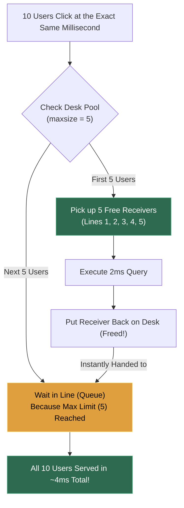

# 📌 The Ultimate Beginner Guide: Connection Pooling & Max Size

> **The Goal**: Connect every single dot from scratch with zero confusing jargon.

---

### 1. 📞 What is a "Connection" Physically?

Forget the word "connection" for a moment. Think of a connection as a **Phone Call between two computers**:
* **Computer A**: Your Backend Web Server (Node.js, Python, Java).
* **Computer B**: Your Database (PostgreSQL, MySQL, Oracle).

When your backend needs data from the database, it has to make a **phone call**.

---

### 2. 🐢 Life WITHOUT a Connection Pool (The Problem)

Imagine if your application handled phone calls like this for **every single user click**:

```text
User Clicks "View Profile"
  │
  ├── 1. Pick up phone and dial database phone number (TCP Handshake)     ──> 30ms
  ├── 2. Wait for ring & verify security password (SSL & Auth)            ──> 70ms
  ├── 3. Ask question: "What is Alice's balance?" (Run SQL Query)        ──>  2ms  <-- ACTUAL WORK!
  ├── 4. Hear answer: "$500"                                              ──>  1ms
  └── 5. Hang up the phone (Teardown connection)                          ──> 10ms
                                                               Total Time: ~113ms
```

> **The Big Flaw**: The actual work took only **2 milliseconds**, but setting up and tearing down the phone call took **110 milliseconds**!
>
> If 1,000 users click at the same second, your server tries to dial 1,000 new phone calls simultaneously. The database runs out of memory trying to answer 1,000 phones and **CRASHES**.

---

### 3. 📦 What is a "Connection Pool"? (The Solution)

Instead of dialing and hanging up every time someone clicks:

1. When your backend server boots up in the morning, it dials **5 phone calls to the database and NEVER hangs up**.
2. It lays those **5 open telephone receivers on the desk**, with the lines alive, quiet, and ready.

This collection of open, waiting phone receivers sitting on the desk is the **Connection Pool**!

```text
       ┌────────────────────────────────────────────────────────┐
       │             YOUR BACKEND SERVER'S DESK                 │
       │                                                        │
       │   [ CONNECTION POOL ]                                  │
       │   📞 Line 1 (OPEN & WAITING) ══════════════════╗       │
       │   📞 Line 2 (OPEN & WAITING) ══════════════════╬══╗    │
       │   📞 Line 3 (OPEN & WAITING) ══════════════════╬══╬══╗ │
       │   📞 Line 4 (OPEN & WAITING) ══════════════════╬══╬══╬═╡
       │   📞 Line 5 (OPEN & WAITING) ══════════════════╬══╬══╬═╡
       └────────────────────────────────────────────────╫──╫──╫─┘
                                                        ║  ║  ║
                                              (Permanently Connected)
                                                        ▼  ▼  ▼
                                                🗄️ DATABASE SERVER
```

#### Now, when a user clicks:
1. Backend grabs **Line 1** from the desk (**Takes 0ms! No dialing!**).
2. Speaks into it: *"What is Alice's balance?"* (**Takes 2ms**).
3. Database says: *"$500"*.
4. Backend puts **Line 1 back on the desk** (*does NOT hang up!*).
5. Total time: **2ms** instead of 113ms!

---

### 4. 🎚️ What is `maxsize`?

**`maxsize`** is simply: **How many open telephone receivers are allowed to exist on your desk at the same time.**

Suppose you configure `maxsize = 5`:



* **If 3 users click**: 3 receivers are picked up. 2 stay on the desk.
* **If 5 users click**: All 5 receivers are in use.
* **If 6th user clicks**: The pool says: *"All 5 lines are busy. Please wait 2 milliseconds in the queue."* 
  As soon as User #1 finishes and puts the receiver down, User #6 instantly gets that receiver.

---

### 5. ❓ Why Not Set `maxsize = 1,000,000`?

Why have a limit at all? Why not keep 100,000 lines open?

Because at the other end of every open phone line, the **Database server must allocate CPU memory, thread stacks, and buffers** to keep that line alive.
* If you set `maxsize = 500`, the database spends all its CPU managing 500 open lines instead of running queries.
* If you set `maxsize = 10` or `20`, the database stays relaxed, queries finish in 1–2 milliseconds, and thousands of requests cycle through those 10 lines seamlessly every second.

---

### 6. 🧩 Connecting ALL the Dots (The Full Lifecycle)

| Concept | What It Actually Is | In the Analogy |
| :--- | :--- | :--- |
| **A Connection** | A physical network socket (wire) between your backend code and the database. | A live telephone call. |
| **Connection Pooling** | Keeping a box of open, connected sockets alive in memory instead of creating/destroying them per request. | Keeping open telephone receivers lying on your desk so you never have to dial. |
| **Borrowing a Connection** | Taking one idle socket from the pool to send a SQL query. | Picking up one of the open phone receivers to ask a question. |
| **Releasing a Connection** | Returning the socket back to the pool so other queries can use it (NOT closing it!). | Putting the receiver back on the desk without hanging up. |
| **`maxsize`** | The maximum number of open sockets allowed in that pool. | The maximum number of phones allowed on your desk. |
| **Queue / Waiting** | When all `maxsize` sockets are busy, new requests wait a few milliseconds for the next socket to be returned. | Waiting in line for someone to put the phone receiver down. |
