# 📌 `dmesg` vs Windows Event Log: Why `dmesg` Fails in PowerShell

> **Reference / Context**: [10_linux_cli.md](file:///d:/Madhan_Utils/learnings/ai-ml/ai-ml-course/course-path/phase-0-engineering-foundations/10_linux_cli.md) | [posix-unix-linux-gnu-kernel-terminal-shell.md](file:///d:/Madhan_Utils/learnings/ai-ml/ai-ml-course/explanations/posix-unix-linux-gnu-kernel-terminal-shell.md) | [windows-shortcuts-cmd-powershell-terminal-apps.md](file:///d:/Madhan_Utils/learnings/ai-ml/ai-ml-course/explanations/windows-shortcuts-cmd-powershell-terminal-apps.md)

---

### 1. 🎯 What Happened? (In Plain English)

You ran a **Linux kernel-specific command** (`dmesg`) inside a **Windows shell** (PowerShell).

[Certain] **`dmesg` ("driver message / display message") does not exist on Windows.** 
- In Linux, `dmesg` reads kernel ring-buffer logs directly from the Linux kernel RAM (`/dev/kmsg`), where kernel events like OOM (Out Of Memory) process kills, hardware errors, and GPU resets are stored.
- On Windows, the Windows NT Kernel does not use `/dev/kmsg`. Instead, Windows logs system and memory exhaustion events to the **Windows Event Log subsystem**.

---

### 2. 💡 The Real-World Analogy: Asking a French Librarian for a Book in Tokyo

* Running `dmesg` inside PowerShell is like walking into the **Tokyo City Library (Windows NT Kernel)** and asking the clerk for a book in **French using a Paris-only library index card (`dmesg`)**.
* The Tokyo clerk (PowerShell) responds: *"I don't recognize that index card format."*
* If you want the French index card to work, you must step into the **French Embassy building inside Tokyo (WSL2 Linux VM)**.

---

### 3. 🛠️ How to Fix It: Two Solutions

#### Solution A: Run `dmesg` Inside WSL (Linux on Windows)
If you want to practice Linux commands or inspect Linux container/WSL kernel memory:

1. Open your terminal and type `wsl` to switch from PowerShell to your Linux subsystem:
   ```powershell
   wsl
   ```
2. Now you are inside Linux. Run `dmesg`:
   ```bash
   dmesg -T | grep -i oom
   ```
   *(If prompted for permissions, run `sudo dmesg -T | grep -i oom`)*.

---

#### Solution B: The Native Windows PowerShell Equivalent (Checking Low Memory / Crashes)
If you are trying to diagnose Out-Of-Memory conditions or application crashes on your **native Windows host**, use PowerShell's `Get-WinEvent`:

```powershell
# 1. Check Windows Resource Exhaustion (Low Memory / Commit Limit Hits)
Get-WinEvent -FilterHashtable @{LogName='Microsoft-Windows-Resource-Exhaustion-Detector/Operational'} -MaxEvents 5 -ErrorAction SilentlyContinue | Format-List TimeCreated, Message

# 2. Check Application Crash Events (Event ID 1000)
Get-WinEvent -FilterHashtable @{LogName='Application'; Id=1000} -MaxEvents 5 -ErrorAction SilentlyContinue | Format-List TimeCreated, Message

# 3. Check System Error / Warning Logs
Get-WinEvent -FilterHashtable @{LogName='System'; Level=1,2} -MaxEvents 5 | Format-Table TimeCreated, ProviderName, Message -AutoSize
```

---

### 4. 🔬 Architecture Comparison: Linux Kernel Ring Buffer vs Windows Event Log

```mermaid
flowchart TD
    subgraph LINUX_STACK ["🐧 Linux Kernel Logging (WSL / Ubuntu / Cloud VMs)"]
        LK["Linux Kernel (Ring 0)"] -->|"Writes ring buffer logs"| KMSG["/dev/kmsg (Kernel Memory Buffer)"]
        KMSG -->|"Parsed by"| DMESG["dmesg utility"]
        DMESG -->|"Piped to"| GREP["grep -i oom (Filters text)"]
    end

    subgraph WINDOWS_STACK ["🪟 Windows NT Kernel Logging (Native Windows)"]
        WK["Windows NT Kernel (Ring 0)"] -->|"Emits ETW events"| EVTLOG["Windows Event Log Service"]
        EVTLOG -->|"Queried by"| PS_CMD["Get-WinEvent cmdlet"]
        PS_CMD -->|"Piped to"| WHERE["Where-Object / Format-List (Filters objects)"]
    end

    style LINUX_STACK fill:#005f73,stroke:#0a9396,color:#fff
    style WINDOWS_STACK fill:#1d3557,stroke:#457b9d,color:#fff
```



---

### 5. ⚠️ Key Takeaway for Topic 0.10 Linux CLI Drills

All terminal drills in **[10_linux_cli.md](file:///d:/Madhan_Utils/learnings/ai-ml/ai-ml-course/course-path/phase-0-engineering-foundations/10_linux_cli.md)** (`cat`, `grep`, `awk`, `tail -f`, `dmesg`, `ps aux`, `lsof -i`) are **POSIX/Linux commands**. 

When practicing on a Windows machine:
* **DO NOT run them in native PowerShell**.
* **DO launch WSL (`wsl`) or Git Bash** in Windows Terminal first.
