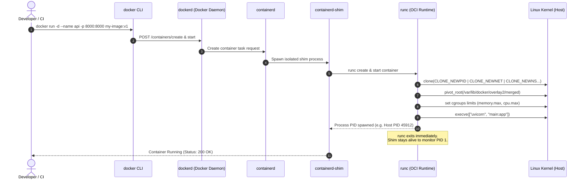
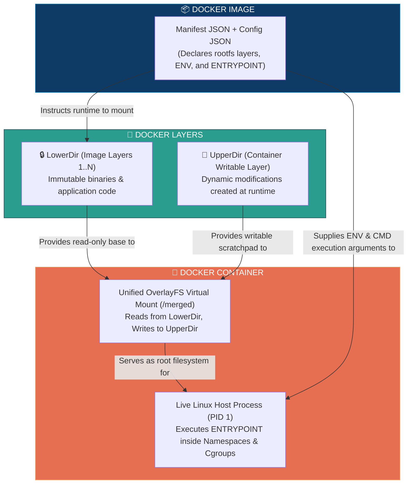

# 📌 Docker Container Deep-Dive: Runtime Engine, Namespaces & Process Isolation

> **Reference / Context**: [11_docker_and_compose.md](file:///d:/Madhan_Utils/learnings/ai-ml/ai-ml-course/course-path/phase-0-engineering-foundations/11_docker_and_compose.md) | [docker-image-architecture.md](file:///d:/Madhan_Utils/learnings/ai-ml/ai-ml-course/explanations/docker-image-architecture.md) | [docker-layer-architecture.md](file:///d:/Madhan_Utils/learnings/ai-ml/ai-ml-course/explanations/docker-layer-architecture.md) | [docker-images-containers-layers-overlayfs.md](file:///d:/Madhan_Utils/learnings/ai-ml/ai-ml-course/explanations/docker-images-containers-layers-overlayfs.md)

---

### 1. 🎯 What is a Docker Container? (In Plain English)

[Certain] A Docker Container is **not** a lightweight virtual machine. It does **not** boot an operating system kernel, emulate hardware, or run a hypervisor.

A container is a **standard Linux host process** running directly on the host CPU and kernel, isolated from other processes through **4 native Linux kernel primitives**:
1. **Namespaces (Isolation)**: Restricts what the process can *see* (its own PID tree, network ports, and filesystem mounts).
2. **Control Groups / Cgroups (Resource Throttling)**: Restricts what the process can *consume* (capping CPU cycles, RAM limits, and disk I/O).
3. **OverlayFS (Filesystem View)**: Stacks the read-only image layers under a thin writable layer, presenting a unified root directory (`/`).
4. **Seccomp & Capabilities (Security Filtering)**: Restricts which kernel system calls (`syscalls`) the process is permitted to execute.

If you run `docker run -d -p 8000:8000 fastapi-app` and execute `ps aux` on the host Linux OS, you will see your Python process running right alongside your normal host programs.

---

### 2. 💡 The Real-World Analogy

#### Analogy: The Soundproofed, Metered Office Cubicle vs. A Detached House
* **Virtual Machine (VM)**: A **detached, freestanding private house**. It has its own dedicated foundation, its own plumbing, its own electrical generator, and its own private security guards (Guest OS Kernel + Hypervisor). Extremely isolated, but very expensive, heavy to construct, and takes minutes to stand up.
* **Docker Container**: A **soundproofed cubicle inside a giant corporate skyscraper**:
  - The building has one central heating/power system (**The Host Linux Kernel**).
  - The cubicle walls prevent you from seeing other employees' desks (**Linux Namespaces**).
  - An electricity meter caps your desk to 500 Watts (**Linux Cgroups**).
  - You are given a desk drawer for your personal files (**Writable Layer**), while referencing standard company training manuals from the shared bookshelf (**Read-Only Image Layers**).
  - You can walk into the cubicle and start working in 10 milliseconds.

---

### 3. 🎨 Visual Architecture: The Container Runtime Engine



---

### 4. 🔬 The 4 Pillars of Container Isolation

#### A. Linux Namespaces (The Virtual Blindfold)
[Certain] Namespaces segment global system resources into isolated pockets:
* **PID Namespace**: Inside the container, your FastAPI process believes it is **PID 1** (the init process). On the host machine, it is actually **PID 45912**.
* **NET Namespace**: The container gets its own virtual network loopback (`lo`), private IP (`172.17.0.2`), and routing table.
* **MNT (Mount) Namespace**: The container cannot see `/home` or `/root` on the host; its root `/` is bound strictly to the OverlayFS `merged` directory.
* **UTS Namespace**: Provides an isolated hostname (e.g. `c7a3b4e198`).
* **IPC Namespace**: Isolates inter-process memory queues.
* **USER Namespace**: Allows a process to be `root` (UID 0) inside the container while mapping to an unprivileged user (UID 10001) on the host.

#### B. Linux Cgroups v2 (The Resource Governor)
Prevents a runaway container or memory leak from crashing the entire host server:
```bash
# Running an AI inference container bounded to 4 CPU cores and 8GB RAM
docker run -d \
  --cpus="4.0" \
  --memory="8g" \
  --memory-swap="8g" \
  --pids-limit=200 \
  ai-model-server:latest
```
When memory usage exceeds 8GB, the Linux kernel Out-Of-Memory (OOM) killer selectively terminates the container process (`Killed: exit code 137`) without destabilizing the host.

---

### 5. 🛠️ Container Lifecycle & Process Inspection

#### Verifying Host Process Reality (Hands-On Proof)
```bash
# 1. Run a background container
docker run -d --name webserver -p 8080:80 nginx:alpine

# 2. Inspect its real Host Process ID (PID)
HOST_PID=$(docker inspect --format '{{.State.Pid}}' webserver)
echo "The real host PID is: $HOST_PID"

# 3. View the process directly on the host Linux kernel
ps -fp $HOST_PID

# 4. Inspect its isolated namespaces directly in the Linux kernel
ls -l /proc/$HOST_PID/ns/
```

Output:
```text
The real host PID is: 18492
UID        PID   PPID  C STIME TTY          TIME CMD
101      18492  18470  0 12:40 ?        00:00:00 nginx: master process
lrwxrwxrwx 1 root root 0 net -> 'net:[4026532598]'
lrwxrwxrwx 1 root root 0 pid -> 'pid:[4026532601]'
lrwxrwxrwx 1 root root 0 mnt -> 'mnt:[4026532599]'
```

---

### 6. ⚠️ Container Anti-Patterns & Critical Pitfalls

1. **The Shell Wrapper Signal Swallowing Trap**:
   ```dockerfile
   # BROKEN: Shell form wraps your app in /bin/sh -c
   # /bin/sh becomes PID 1 and DOES NOT forward SIGTERM!
   CMD uvicorn main:app --host 0.0.0.0 --port 8000
   ```
   When Docker sends `SIGTERM` during `docker stop`, `sh` ignores it. Docker waits 10 seconds, times out, and violently sends `SIGKILL` (`kill -9`), dropping database connections and corrupting in-flight transactions.
   
   **Fix**: Always use the **Exec form**:
   ```dockerfile
   CMD ["uvicorn", "main:app", "--host", "0.0.0.0", "--port", "8000"]
   ```

2. **Writing Database Data into the Container Writable Layer**:
   - The writable layer (`upperdir`) incurs significant Copy-on-Write I/O overhead.
   - The moment someone runs `docker rm -f postgres-db`, the entire database is permanently deleted.
   - **Fix**: Always mount a host-managed **Docker Volume** (`-v db_data:/var/lib/postgresql/data`).

3. **Running Containers as Root**:
   - By default, UID 0 inside a container is UID 0 on the host. If a container breakout vulnerability occurs, the attacker gains full root control of the host machine.
   - Always declare `USER nonroot` or `USER 1001` in your Dockerfile.

---

### 7. 🔗 The Triad Link: How Docker Container Links to Images and Layers

Understanding where the Container fits in the trio:



#### 1. How Container Links to Image:
* **Instantiation**: A Container cannot exist without an Image. The Image is the static template; the Container is the running instance.
* **Inheritance**: The Container inherits its base filesystem, environment variables, exposed ports, and default startup command directly from the Image's metadata configuration (`config.json`).
* *(See full image specification details in: [docker-image-architecture.md](file:///d:/Madhan_Utils/learnings/ai-ml/ai-ml-course/explanations/docker-image-architecture.md))*

#### 2. How Container Links to Layer:
* **The Layer Consumer**: The Container runtime stacks the Image's read-only Layers into an OverlayFS `lowerdir` and automatically attaches one dynamic, writable Layer (`upperdir`) specifically for this container instance.
* **Runtime Mutation & Ephemerality**: Every time the container writes a log, updates a file, or creates a temp file, the write is captured in this container's writable layer.
* **Destruction Cycle**: When the container is stopped and removed (`docker rm`), its writable layer is discarded. The shared image layers beneath it remain 100% untouched.
* *(See full layer storage mechanics in: [docker-layer-architecture.md](file:///d:/Madhan_Utils/learnings/ai-ml/ai-ml-course/explanations/docker-layer-architecture.md))*

#### Summary Matrix
| Attribute | 🧱 Docker Layer | 📦 Docker Image | 🚀 Docker Container |
|---|---|---|---|
| **What It Is** | An immutable filesystem delta | An ordered manifest of layer hashes | An isolated running host process |
| **Linux Mechanism** | Storage directory (`diff/`) | OCI Manifest & Config JSON | Namespaces, Cgroups, Seccomp, OverlayFS |
| **State** | Frozen data | Frozen blueprint | Dynamic execution (CPU/RAM consumption) |
| **Scope** | Global (shared across all images) | Global (shared across all containers) | Local (private to this specific execution) |
| **Deletion Impact** | Unreferenced layers purged on prune | Image removed; does not delete shared layers | Container removed; deletes only its writable layer |
