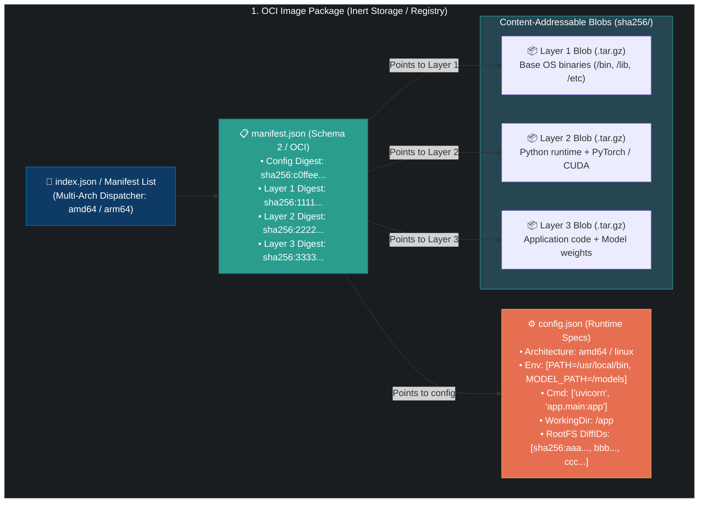
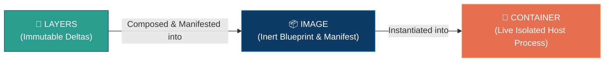

# 📌 Docker Image Deep-Dive: Architecture, OCI Specifications & Blob Storage

> **Reference / Context**: [11_docker_and_compose.md](file:///d:/Madhan_Utils/learnings/ai-ml/ai-ml-course/course-path/phase-0-engineering-foundations/11_docker_and_compose.md) | [docker-layer-architecture.md](file:///d:/Madhan_Utils/learnings/ai-ml/ai-ml-course/explanations/docker-layer-architecture.md) | [docker-container-architecture.md](file:///d:/Madhan_Utils/learnings/ai-ml/ai-ml-course/explanations/docker-container-architecture.md) | [docker-images-containers-layers-overlayfs.md](file:///d:/Madhan_Utils/learnings/ai-ml/ai-ml-course/explanations/docker-images-containers-layers-overlayfs.md)

---

### 1. 🎯 What is a Docker Image? (In Plain English)

[Certain] A Docker Image is **not** an executable binary, a lightweight virtual machine disk, or a mini operating system. 

An image is an **immutable, read-only package** composed of:
1. **An ordered collection of layer tarballs** (filesystem changesets).
2. **A JSON Manifest** specifying the content-addressed cryptographic digests (SHA-256) of each layer.
3. **An Image Config JSON file** defining container runtime defaults: environment variables, default execution command (`CMD` / `ENTRYPOINT`), working directory (`WORKDIR`), exposed ports, and platform architecture (`amd64`/`arm64`).

When stored on disk or inside a container registry, an image is **pure inert metadata and compressed binary blobs (tarballs)** conforming to the Open Container Initiative (OCI) Image Specification. It consumes zero CPU and zero RAM until a container engine unpacks its manifest and launches an isolated process from it.

---

### 2. 💡 The Real-World Analogy

#### Analogy: The Sealed Architectural Blueprint & Prefab Construction Kit
* An **Image** is a **sealed master architectural blueprint and modular material crate**:
  - The crate contains pre-cut wall panels, plumbing pipes, and electrical cables (the **Layers**).
  - Inside the lid is a stamped, immutable specification sheet (the **Image Manifest & Config**) that states: *"Assemble foundation first, then walls, then roof. Paint color is white. The front door opens at 9:00 AM (`ENTRYPOINT`). Run on concrete foundation (`linux/amd64`)."*
  - You cannot live inside the blueprint crate. It has no running electricity, no running water, and no heat.
  - A construction crew can build 50 identical houses in 50 neighborhoods using that exact same blueprint kit simultaneously without modifying the original master blueprint.

---

### 3. 🎨 Visual Architecture: Anatomy of an OCI Image



---

### 4. 🔬 Dissecting an Image Under the Hood (OCI Specification)

[Certain] When you pull or build `my-fastapi-app:v1`, Docker does not store a monolithic `.iso` or `.vmdk`. You can inspect the real underlying structure directly.

#### A. Exporting and Inspecting Raw Image Tarballs
```bash
# Save an image directly to a tar archive on your disk
docker save -o fastapi_image.tar my-fastapi-app:v1

# Extract the archive contents into a folder
mkdir unpacked_image && tar -xf fastapi_image.tar -C unpacked_image
ls -la unpacked_image/
```

Inside `unpacked_image/`, you will see:
```text
drwxr-xr-x  blobs/            # Directory containing all content-addressed SHA-256 blobs
-rw-r--r--  index.json        # OCI top-level image index
-rw-r--r--  manifest.json     # Docker manifest pointing to config and layer tarballs
-rw-r--r--  repositories      # Tag to digest mapping
```

#### B. The Manifest JSON (`manifest.json`)
The manifest is the glue that binds the config to its layers:
```json
[
  {
    "Config": "blobs/sha256/a87f10b89230bc83...",
    "RepoTags": ["my-fastapi-app:v1"],
    "Layers": [
      "blobs/sha256/3f5b721869e5d4812...",
      "blobs/sha256/74d9e078f45a19820...",
      "blobs/sha256/9e120bc712f114a89..."
    ]
  }
]
```

#### C. The Image Config JSON
The configuration file dictates what happens when the container starts:
```json
{
  "architecture": "amd64",
  "os": "linux",
  "config": {
    "Env": [
      "PATH=/usr/local/bin:/usr/bin",
      "PYTHONUNBUFFERED=1",
      "PORT=8000"
    ],
    "Cmd": ["uvicorn", "main:app", "--host", "0.0.0.0", "--port", "8000"],
    "WorkingDir": "/app",
    "ExposedPorts": { "8000/tcp": {} },
    "User": "appuser"
  },
  "rootfs": {
    "type": "layers",
    "diff_ids": [
      "sha256:e1a2f3...",
      "sha256:d4c5b6...",
      "sha256:a7b8c9..."
    ]
  }
}
```

---

### 5. 🛠️ Production Example: Multi-Stage AI Inference Image

In production AI engineering, bad image construction leads to 15GB bloated images that take 20 minutes to pull across AWS ECS or Kubernetes clusters. A properly constructed image isolates build tools into disposable stages.

#### Production `Dockerfile`
```dockerfile
# ==========================================
# STAGE 1: Builder (Compilers, Wheels, Dev Headers)
# ==========================================
FROM python:3.11-slim AS builder

WORKDIR /build

RUN apt-get update && apt-get install -y --no-install-recommends \
    build-essential \
    curl \
    && rm -rf /var/lib/apt/lists/*

# Install heavy dependencies into a dedicated wheel directory
COPY requirements.txt .
RUN pip install --no-cache-dir --user -r requirements.txt

# ==========================================
# STAGE 2: Production Final Image (Lean & Secure)
# ==========================================
FROM python:3.11-slim AS runner

# Security: Never run as root in production
RUN groupadd -g 1001 appgroup && \
    useradd -u 1001 -g appgroup -s /bin/bash -m appuser

WORKDIR /app

# Copy only installed python packages from builder stage
COPY --from=builder /root/.local /home/appuser/.local
# Copy only application code
COPY --chown=appuser:appgroup ./src /app/src

ENV PATH=/home/appuser/.local/bin:$PATH \
    PYTHONUNBUFFERED=1 \
    PORT=8000

USER appuser

EXPOSE 8000

ENTRYPOINT ["uvicorn", "src.main:app", "--host", "0.0.0.0", "--port", "8000"]
```

#### Inspecting the Image Manifest & Layers
```bash
# Build the image
docker build -t ai-service:1.0.0 .

# Inspect metadata directly without running a container
docker image inspect ai-service:1.0.0 --format '{{json .Config.Cmd}}'
docker image inspect ai-service:1.0.0 --format '{{json .RootFS.Layers}}'

# View layer size breakdown
docker history ai-service:1.0.0
```

---

### 6. ⚠️ Image Anti-Patterns & Common Traps

1. **The Secret Leakage Trap (Layer Persistence)**:
   ```dockerfile
   # BROKEN: Leaks API key permanently in image history
   COPY id_rsa /root/.ssh/id_rsa
   RUN git clone https://github.com/org/private-repo.git && rm -f /root/.ssh/id_rsa
   ```
   [Certain] Running `rm` in a subsequent layer creates a whiteout marker, but does **not** erase the file from the previous layer. Anyone with `docker save` can extract `id_rsa` from the layer 1 tarball. Use `RUN --mount=type=secret` instead.

2. **The Tag Mutability Trap (`:latest` in Production)**:
   - Tags are mutable pointers (like Git branches). Two builds tagged `:latest` on Monday and Friday will have completely different content digests.
   - Always pin images in production by exact cryptographic digest:
     ```yaml
     image: my-service@sha256:3b9f489f6b4d32098d5c41...
     ```

3. **Multi-Architecture Drift (`amd64` vs `arm64`)**:
   - Building an image on an Apple Silicon Mac (`arm64`/M-series) will fail silently or crash with `exec format error` when deployed to x86_64 Intel/AMD cloud servers (`amd64`).
   - Fix with `docker buildx`:
     ```bash
     docker buildx build --platform linux/amd64,linux/arm64 -t org/app:v1 --push .
     ```

---

### 7. 🔗 The Triad Link: How Docker Image Links to Layers and Containers

To truly master containerization, you must understand the exact causal relationships between the three concepts:



#### 1. How Image Links to Layer:
* **The Image is a Manifest of Layers**: An image does not contain a single giant filesystem. It is an ordered list of SHA-256 hashes pointing to individual, read-only layer archives.
* **Shared Storage**: If 10 images are derived from `python:3.11-slim`, all 10 images reference the exact same underlying base layers on disk. The Image is simply the metadata wrapper that declares the order in which those layers must be stacked.
* *(See detailed layer mechanics in: [docker-layer-architecture.md](file:///d:/Madhan_Utils/learnings/ai-ml/ai-ml-course/explanations/docker-layer-architecture.md))*

#### 2. How Image Links to Container:
* **The Image is the Static Prototype; The Container is the Living Instance**: An image is purely data at rest on disk. When you execute `docker run`, the container runtime (runc/containerd):
  1. Reads the Image Manifest to identify all required read-only layers.
  2. Uses Linux **OverlayFS** to mount those layers as the container's root directory (`lowerdir`).
  3. Reads the Image Config JSON to extract default environment variables, working directory, and the target executable (`ENTRYPOINT`/`CMD`).
  4. Calls Linux `clone()` with namespaces to spawn the container process.
* *(See detailed container runtime mechanics in: [docker-container-architecture.md](file:///d:/Madhan_Utils/learnings/ai-ml/ai-ml-course/explanations/docker-container-architecture.md))*

#### Summary Matrix
| Attribute | 🧱 Docker Layer | 📦 Docker Image | 🚀 Docker Container |
|---|---|---|---|
| **State** | Static filesystem delta | Static manifest + metadata | Dynamic running host process |
| **Mutability** | 100% Immutable (Read-Only) | 100% Immutable (Read-Only) | Ephemeral Read-Write (via UpperDir) |
| **Disk Storage** | Compressed tarball in `/var/lib/docker/overlay2` | JSON Manifest referencing Layer hashes | Writable directory delta in `/var/lib/docker/containers` |
| **Lifecycle** | Created during build; cached indefinitely | Created upon build completion; pushed to registry | Created on `run`, paused, stopped, destroyed on `rm` |
| **System Resource** | Consumes Disk Space only | Consumes Disk Space only | Consumes CPU, RAM, Sockets, and Disk |
