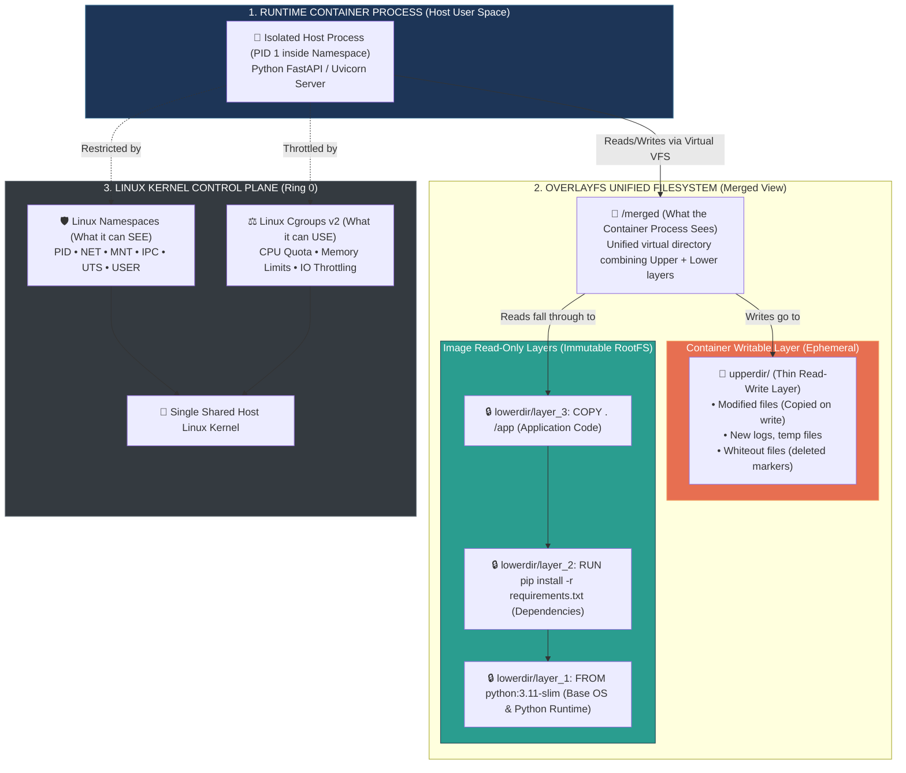

# 📌 Docker Internals: Images, Containers, Layers & OverlayFS

> **Reference / Context**: [11_docker_and_compose.md](file:///d:/Madhan_Utils/learnings/ai-ml/ai-ml-course/course-path/phase-0-engineering-foundations/11_docker_and_compose.md) | [10_linux_cli.md](file:///d:/Madhan_Utils/learnings/ai-ml/ai-ml-course/course-path/phase-0-engineering-foundations/10_linux_cli.md) | [what-is-the-os-kernel.md](file:///d:/Madhan_Utils/learnings/ai-ml/ai-ml-course/explanations/what-is-the-os-kernel.md)

---

### 1. 🎯 What is it? (In Plain English)

The biggest misconception in modern software is believing a Docker container is a lightweight virtual machine running a guest operating system.

In reality:
1. **A Layer** is an immutable, read-only tarball of filesystem file changes (additions, modifications, deletions) identified by a SHA-256 content hash.
2. **An Image** is an ordered manifest of read-only layer hashes paired with a JSON configuration file specifying environment variables, entrypoint commands, and working directories. An image is purely inert data at rest.
3. **A Container** is an ordinary host process wrapped in 4 Linux kernel mechanisms:
   - **Regular Host Process:** It runs directly on your host CPU (no hypervisor, no virtual machine, no guest OS kernel).
   - **Linux Namespaces (The Blindfold):** The kernel isolates what the process can *see* (its own private process tree, network interfaces, and root directory).
   - **Linux Cgroups (The Budget):** The kernel restricts what the process can *use* (capping maximum RAM and CPU cores).
   - **OverlayFS (The Virtual Mount):** The kernel lets the process read the stacked, read-only image layers while capturing all new writes into a temporary, throwaway folder on top.

A container contains **no OS kernel**. It shares the host machine's kernel directly.

---

### 2. 💡 The Real-World Analogy

#### Analogy: Overhead Transparency Projector & The Wet-Erase Sheet
* **Image Layers** are **Printed Transparent Plastic Slides**:
  - Slide 1 (Base): A printed map of roads (Base OS: Ubuntu/Alpine).
  - Slide 2 (Dependency): A printed overlay of building footprints (Python runtime).
  - Slide 3 (App Code): A printed overlay of restaurant pins (Your FastAPI application code).
  - You stack these slides on the glass. Looking down from above, you see a complete, unified city map. You cannot erase or alter the printed ink on these slides—they are completely read-only.
* **The Image** is the **Sealed Binder** containing that specific sequence of slides in exact order.
* **The Container** is the **Overhead Projector Turned On + A Blank Clear Sheet on Top**:
  - The presenter places a blank, clear plastic sheet (**Writable Layer / UpperDir**) over the stack.
  - With a wet-erase marker, the presenter can draw notes, add a pin, or cross out a building (**Copy-on-Write**).
  - If you turn off the projector and throw away the blank clear sheet (**`docker rm`**), the original printed slides in the binder remain 100% untouched.
  - If 5 different presenters want to give the same lecture in 5 classrooms simultaneously, they all use identical copies of the binder slides, each with their own blank top sheet.

---

### 3. 🎨 Visual Architecture: The OverlayFS Union Mount & Kernel Isolation



---

### 4. 🔬 The 4 Core Mechanics Under the Hood

#### A. Content-Addressable Storage & Deduplication
Every layer in Docker is stored on disk under `/var/lib/docker/overlay2/<layer-hash>/`.
* If 10 different images on your machine start with `FROM python:3.11-slim`, those base layers are stored **exactly once** on your hard drive.
* When Docker builds a layer, it hashes the contents and the parent layer ID. If the inputs haven't changed, Docker returns `CACHED` and skips rebuilding.

#### B. Copy-on-Write (CoW) Lifecycle
When a process inside a container interacts with a file:
1. **Read (`open(O_RDONLY)`)**: The kernel searches from `upperdir` downward through `lowerdir` layers. As soon as it finds the file, it opens it. Zero memory duplication.
2. **Modify (`open(O_RDWR)`)**: If the file exists only in a read-only `lowerdir`, the Linux kernel intercepts the write, **copies the entire file up into `upperdir`**, and applies modifications there. The lower image layer remains pristine.
3. **Delete (`unlink()` / `rm`)**: The kernel cannot delete files from read-only lower layers. Instead, it creates a **whiteout character device (`0/0`)** in `upperdir`. When the container lists the directory, OverlayFS sees the whiteout marker and hides the file from the merged view.

#### C. Linux Namespaces (The Isolation Illusion)
Namespaces give the process its own virtualized view of global system resources:
* **PID Namespace**: Inside the container, your app is `PID 1`. On the host machine, it is just `PID 48291`.
* **NET Namespace**: Container gets its own private `eth0` network interface, IP address (`172.17.0.2`), and routing table.
* **MNT Namespace**: Mounts the OverlayFS `merged` directory as root `/`, blinding the process to `/home`, `/etc`, and `/var` on the host.

#### D. Cgroups (Control Groups - Resource Throttling)
* **Memory Limits (`--memory="4g"`)**: Tracks RAM pages allocated to the process tree. If the app exceeds 4GB, the kernel's Out-Of-Memory (OOM) Killer terminates the container process.
* **CPU Shares (`--cpus="1.5"`)**: Enforces Completely Fair Scheduler (CFS) quotas. A 1.5 CPU limit means the process is allotted 150ms of CPU time for every 100ms wall-clock period.

---

### 5. 💻 Live Inspection Drills (Peeling Back the Abstraction)

#### Drill 1: Inspect the Real OverlayFS Host Directories
Run this on any active container to see the physical paths on the host filesystem:

```bash
docker run -d --name demo-app python:3.11-slim sleep 3600

# Inspect the OverlayFS storage engine driver data
docker inspect demo-app --format '{{json .GraphDriver.Data}}' | python -m json.tool
```

##### Output
```json
{
    "LowerDir": "/var/lib/docker/overlay2/abc123.../diff:/var/lib/docker/overlay2/def456.../diff",
    "MergedDir": "/var/lib/docker/overlay2/xyz789.../merged",
    "UpperDir": "/var/lib/docker/overlay2/xyz789.../diff",
    "WorkDir": "/var/lib/docker/overlay2/xyz789.../work"
}
```
* `LowerDir`: The immutable read-only image layers.
* `UpperDir`: The writable directory where all container mutations live.
* `MergedDir`: The active mount point the container process sees as `/`.

#### Drill 2: Prove Containers are Regular Host Processes
```bash
# In your host terminal, find the container PID
docker top demo-app
# Or check the host process table
ps aux | grep "sleep 3600"
```
You will see `sleep 3600` listed directly in the host OS process table under a regular host PID.

---

### 6. ⚡ Architectural Comparison: VM vs. Container vs. Process

| Dimension | Virtual Machine (VM) | Docker Container | Host Process |
| :--- | :--- | :--- | :--- |
| **Kernel** | Dedicated Guest OS Kernel | **Shared Host Kernel** | Shared Host Kernel |
| **Filesystem** | Virtual Disk Image (`.vmdk`/`.qcow2`) | **OverlayFS Union Stack (Layered)** | Host RootFS (`/`) |
| **Startup Time** | 20 – 60 seconds (Full boot) | **50 – 500 milliseconds** | Instant (< 10 ms) |
| **Memory Overhead** | ~1 GB base OS footprint | **Megabytes (Process memory only)** | Zero extra overhead |
| **Isolation Barrier** | Hardware Virtualization (Hypervisor / Ring -1) | **Kernel Namespaces & Cgroups (Ring 0)** | OS User Permissions |
| **Portability Unit** | Large VM Disk Image (10–50 GB) | **Layered Content-Addressed Image (50–500 MB)** | Binary / Script |

---

### 7. ⚠️ Production Gotchas & Anti-Patterns

1. **The "Fat Layer" Anti-Pattern (Deleting files in later instructions)**:
   ```dockerfile
   # ❌ WRONG: Creates a 2GB layer, then a 0MB layer. Image is STILL 2GB!
   RUN wget https://example.com/huge-weights.bin
   RUN rm huge-weights.bin

   # ✅ CORRECT: Download, process, and delete in the SAME instruction
   RUN wget https://example.com/huge-weights.bin && \
       python process.py huge-weights.bin && \
       rm huge-weights.bin
   ```
   *Why:* Because lower layers are immutable, running `rm` in a subsequent `RUN` instruction only adds a tiny **whiteout file** in a new upper layer. The 2GB binary is still permanently stored in the lower layer and ships across your network!

2. **Heavy Logging to the Writable Layer**:
   * Writing gigabytes of logs to `/var/log/app.log` inside the container bloats `UpperDir` on the host disk and incurs OverlayFS Copy-on-Write filesystem overhead.
   * *Solution:* Stream logs directly to `stdout`/`stderr` (Docker logging driver) or mount a high-speed host volume (`-v /var/log/app:/app/logs`).
