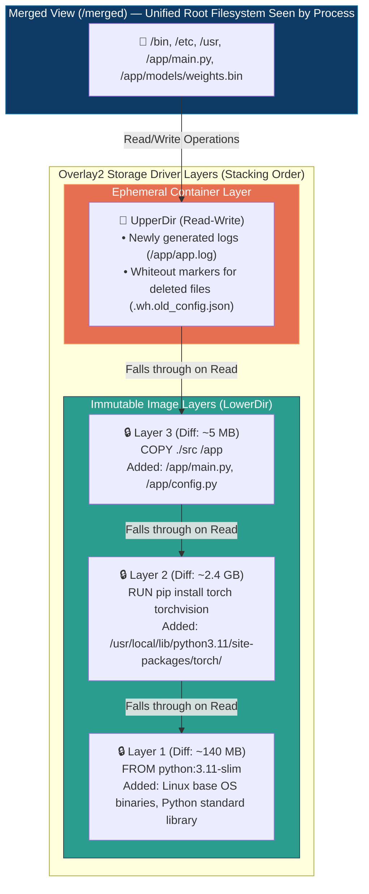
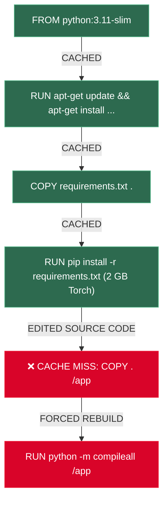
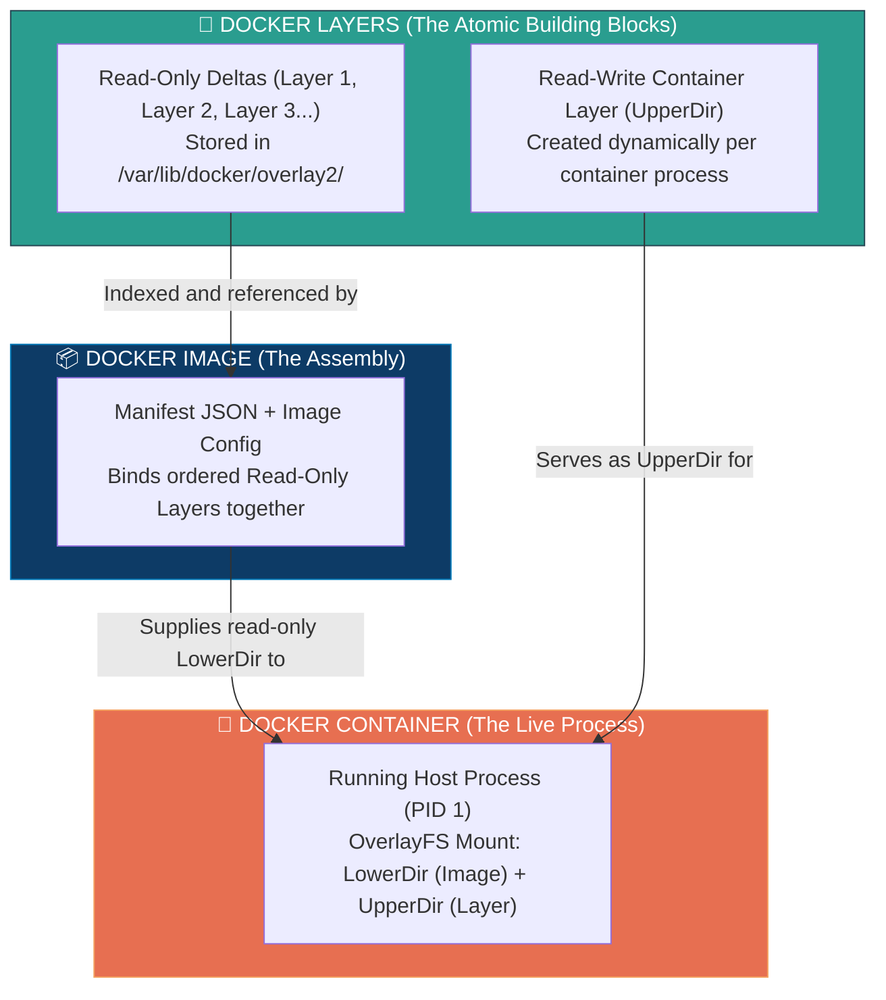

# 📌 Docker Layer Deep-Dive: Storage Drivers, Copy-on-Write & BuildKit Caching

> **Reference / Context**: [11_docker_and_compose.md](file:///d:/Madhan_Utils/learnings/ai-ml/ai-ml-course/course-path/phase-0-engineering-foundations/11_docker_and_compose.md) | [docker-image-architecture.md](file:///d:/Madhan_Utils/learnings/ai-ml/ai-ml-course/explanations/docker-image-architecture.md) | [docker-container-architecture.md](file:///d:/Madhan_Utils/learnings/ai-ml/ai-ml-course/explanations/docker-container-architecture.md) | [docker-images-containers-layers-overlayfs.md](file:///d:/Madhan_Utils/learnings/ai-ml/ai-ml-course/explanations/docker-images-containers-layers-overlayfs.md)

---

### 1. 🎯 What is a Docker Layer? (In Plain English)

[Certain] A Docker Layer is **not** a standalone filesystem or a separate virtual partition.

A layer is an **immutable, content-addressable filesystem delta (diff)** created by executing a state-modifying instruction (`RUN`, `COPY`, `ADD`) in a `Dockerfile`. 

Each layer stores **only the exact files that were added, modified, or deleted** relative to its parent layer. On disk (inside `/var/lib/docker/overlay2/<layer-id>/diff`), a layer is simply a standard Linux directory containing these modified files. When pushed or pulled over a network, each layer is compressed into a `.tar.gz` archive identified by a cryptographic SHA-256 digest.

---

### 2. 💡 The Real-World Analogy

#### Analogy: Transparent Tracing Paper on an Architectural Blueprint
* Imagine designing a building on sheets of **crystal-clear transparent tracing paper**:
  - **Layer 1 (Base)**: You draw the concrete foundation and exterior walls (`FROM python:3.11-slim`).
  - **Layer 2 (Plumbing/Wiring)**: You place a new blank sheet of tracing paper on top and draw pipes and electric conduits (`RUN pip install torch`).
  - **Layer 3 (Interior Decor)**: You place a third sheet on top and draw furniture and paint colors (`COPY . /app`).
* Looking down from above, you see a **single, complete building plan**.
* If you want to change the furniture color, you don't redraw the foundation or the plumbing. You simply swap or redraw the top tracing sheet (**Layer 3**). The heavy, expensive bottom sheets (**Layers 1 & 2**) are completely reused without re-work (**Layer Caching**).

---

### 3. 🎨 Visual Architecture: Layer Stacking & OverlayFS Mechanics



---

### 4. 🔬 The 3 Core Layer Mechanics Under the Hood

#### A. Copy-on-Write (CoW)
[Certain] All image layers are mounted as **strictly read-only (`lowerdir`)**. When a process inside a container wants to modify a file belonging to an image layer:
1. **Lookup**: The kernel checks if the file exists in the writable `upperdir`. If not, it traverses downward through the `lowerdir` layers until it finds the file.
2. **Copy-Up**: Before writing a single byte, the Linux kernel **copies the entire file** from the read-only layer into the container's private `upperdir`.
3. **Modification**: The write occurs strictly on the copy inside `upperdir`. The underlying image layer remains 100% byte-for-byte identical.

#### B. File Deletions and "Whiteouts"
What happens when a Dockerfile or container runs `rm /etc/myapp.conf`?
- Docker **cannot delete** a file from an immutable lower layer.
- Instead, the storage driver creates a **Whiteout file** (named `.wh.myapp.conf` with character device `0:0`) in the upper layer.
- When OverlayFS renders the merged directory, it sees the whiteout marker and **masks** the file, making it invisible to the application.

#### C. BuildKit Cache Invalidation DAG (The Domino Effect)
Docker evaluates cache hits sequentially using a Directed Acyclic Graph (DAG):
1. **Command String Match**: For `RUN`, Docker checks if the exact string (e.g. `RUN apt-get update`) matches a previously built layer with the same parent hash.
2. **File Checksum Match**: For `COPY` and `ADD`, Docker computes a SHA-256 checksum of every source file being copied.
3. **The Invalidation Rule**: **The moment a single layer cache misses, ALL subsequent downstream layers are forcibly invalidated and rebuilt from scratch.**



---

### 5. 🛠️ Production Example: Bad Layering vs. Optimized Layering

#### ❌ The Naive / Anti-Pattern Dockerfile (10x Slower Builds)
```dockerfile
FROM python:3.11-slim

WORKDIR /app

# DISASTER: Copying entire source code BEFORE dependencies
COPY . /app

# Every 1-character typo edit in main.py invalidates this RUN step!
# Forces 4-minute re-download of 2.5GB PyTorch dependencies on EVERY build!
RUN pip install --no-cache-dir -r requirements.txt

CMD ["uvicorn", "main:app", "--host", "0.0.0.0", "--port", "8000"]
```

#### ✅ The Production-Grade Optimized Dockerfile (Sub-Second Builds)
```dockerfile
FROM python:3.11-slim

WORKDIR /app

# 1. System packages layer (Rarely changes -> Stays CACHED for months)
RUN apt-get update && apt-get install -y --no-install-recommends \
    curl \
    && rm -rf /var/lib/apt/lists/*

# 2. Dependency manifest layer (Only changes when packages change)
COPY requirements.txt .

# 3. Heavy install layer (2.5GB Torch stays CACHED on daily code edits)
RUN pip install --no-cache-dir -r requirements.txt

# 4. Source code layer (Changes frequently -> Cache miss costs only 0.2s)
COPY ./src /app/src

CMD ["uvicorn", "src.main:app", "--host", "0.0.0.0", "--port", "8000"]
```

---

### 6. ⚠️ Layer Anti-Patterns & Critical Pitfalls

1. **The Multi-Line `apt-get` Separation Trap**:
   ```dockerfile
   # BROKEN:
   RUN apt-get update
   RUN apt-get install -y curl
   ```
   If you later edit line 2 to `RUN apt-get install -y curl wget`, Docker reuses the cached `apt-get update` layer from 3 months ago. The package index is stale, leading to `404 Not Found` build failures. Always combine into a single layer:
   ```dockerfile
   RUN apt-get update && apt-get install -y --no-install-recommends \
       curl wget \
       && rm -rf /var/lib/apt/lists/*
   ```

2. **The "Delete in Next Layer" Illusion**:
   ```dockerfile
   # BROKEN: Creates a 2GB layer, then creates a 0-byte whiteout layer.
   # Final image size STILL includes the 2GB archive!
   RUN wget https://example.com/huge-archive.tar.gz && tar -xf huge-archive.tar.gz
   RUN rm huge-archive.tar.gz
   ```
   **Fix**: Always clean up in the *exact same instruction*:
   ```dockerfile
   RUN wget https://example.com/huge-archive.tar.gz \
       && tar -xf huge-archive.tar.gz \
       && rm huge-archive.tar.gz
   ```

---

### 7. 🔗 The Triad Link: How Docker Layer Links to Images and Containers

Understanding the layer's role in the complete system architecture:



#### 1. How Layer Links to Image:
* **Layers are the Atomic Ingredients of an Image**: An Image has no independent filesystem payload of its own. It is simply a serialized manifest of Layer SHA-256 hashes.
* **Layer Deduplication**: When 20 different Docker images share the same `FROM ubuntu:22.04` base layer, that layer exists **exactly once** in physical storage on disk. The Image manifests merely point to that shared layer hash.
* *(See full image specification details in: [docker-image-architecture.md](file:///d:/Madhan_Utils/learnings/ai-ml/ai-ml-course/explanations/docker-image-architecture.md))*

#### 2. How Layer Links to Container:
* **The Base (`lowerdir`) vs. The Scratchpad (`upperdir`)**: When a container launches, the Docker engine mounts the image's stacked layers as read-only base directories (`lowerdir`). It then attaches a single, ephemeral, read-write layer (`upperdir`) on top.
* **Isolation of Mutation**: Any file modification, log creation, or temporary file generated during container runtime exists solely inside that container's private top layer.
* **Destruction**: When the container is destroyed (`docker rm`), its top writable layer is permanently erased. The underlying image layers remain untouched for other containers to use.
* *(See full container lifecycle details in: [docker-container-architecture.md](file:///d:/Madhan_Utils/learnings/ai-ml/ai-ml-course/explanations/docker-container-architecture.md))*

#### Summary Matrix
| Attribute | 🧱 Docker Layer | 📦 Docker Image | 🚀 Docker Container |
|---|---|---|---|
| **Role** | Atomic filesystem difference | Complete packaged blueprint | Live running process instance |
| **Creation** | Step in `Dockerfile` (`RUN`/`COPY`) | Completion of `docker build` | Invocation of `docker run` |
| **Storage Unit** | Tarball blob + overlay `diff/` dir | Manifest JSON + Config JSON | Overlay `merged/` mount + host PID |
| **Shareability** | Shared across multiple images | Shared across multiple containers | Private and isolated to one process |
