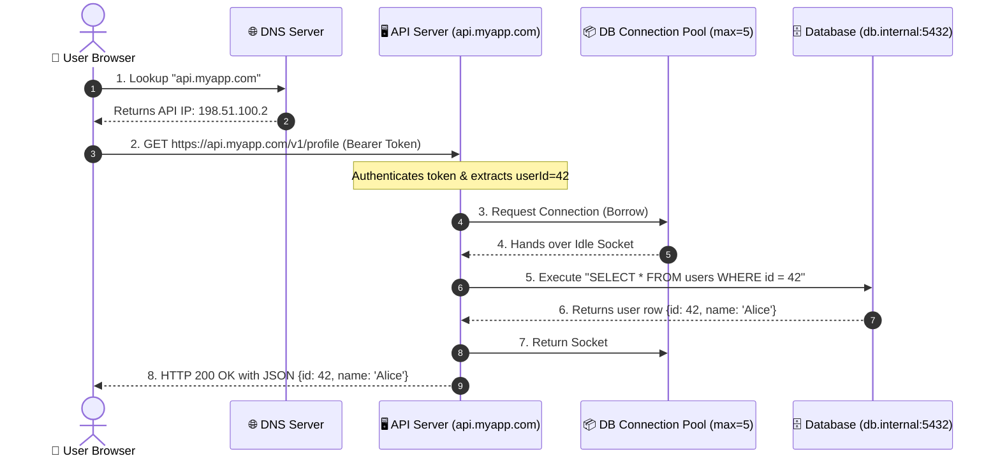
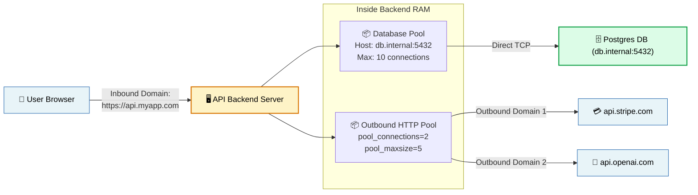

# 📌 End-to-End API Lifecycle: From User Click to Database & Connection Limits

> **Reference / Context**: [07_http_fundamentals.md](file:///d:/Madhan_Utils/learnings/ai-ml/ai-ml-course/course-path/phase-0-engineering-foundations/07_http_fundamentals.md) | [09_building_apis_with_fastapi.md](file:///d:/Madhan_Utils/learnings/ai-ml/ai-ml-course/course-path/phase-0-engineering-foundations/09_building_apis_with_fastapi.md) | [12_nginx_reverse_proxy.md](file:///d:/Madhan_Utils/learnings/ai-ml/ai-ml-course/course-path/phase-0-engineering-foundations/12_nginx_reverse_proxy.md) | [15_postgres_pgvector_redis.md](file:///d:/Madhan_Utils/learnings/ai-ml/ai-ml-course/course-path/phase-0-engineering-foundations/15_postgres_pgvector_redis.md)
> **Topic Context**: Web Architecture, DNS, Inbound & Outbound Domains, Connection Pool Lifecycle, and Multi-User Concurrency

---

### 1. 🎯 Complete End-to-End Request Lifecycle

Here is the exact step-by-step path when a user requests their profile:

---

### 2. 🌐 How the "Domain" Fits In (Two Different Perspectives)

In a typical production web app, there are **two different types of domains**:

1. **Inbound Domain (`api.myapp.com`)**:
   - The user’s browser resolves this domain via DNS to locate your API server's IP address.
2. **Database Host / Domain (`db.internal.company.com:5432`)**:
   - Your backend server uses this internal address to open and keep pool sockets to the database.
3. **Outbound Third-Party Domains (`api.stripe.com`, `api.openai.com`)**:
   - If your API calls Stripe or OpenAI, the `pool_connections` setting dictates how many different external domains your backend keeps warm sockets for.

---

### 3. 👥 What Happens When Multiple Users Hit the API Simultaneously?

Imagine your backend has a Database Connection Pool with:
- **`max_size = 5`**
- **`connection_timeout = 2000ms` (2 seconds)**

#### Scenario A: 5 Users Hit at the Same Time
- Users 1, 2, 3, 4, 5 all request their profile simultaneously.
- The pool hands out **Socket 1, 2, 3, 4, and 5**.
- All 5 queries run in parallel.
- Queries finish in **10ms** $\rightarrow$ Sockets returned to pool.
- **Result**: All 5 users get instant responses.

#### Scenario B: 20 Users Hit at the Same Time (Over the Max Size)
- **First 5 Users**: Get Sockets 1 to 5 immediately and execute their queries.
- **Remaining 15 Users**: The pool puts them in a **FIFO (First-In, First-Out) Wait Queue** in memory.
- At **10ms**: Users 1–5 finish. Sockets 1 to 5 are instantly handed to **Users 6–10**.
- At **20ms**: Users 6–10 finish. Sockets 1 to 5 are handed to **Users 11–15**.
- At **30ms**: Users 11–15 finish. Sockets 1 to 5 are handed to **Users 16–20**.
- **Result**: Even though the pool limit was only 5, **all 20 users got served in just 30ms** without stressing the database!

#### Scenario C: Severe Traffic Spike (e.g. 5,000 requests)
- If a slow query takes 5 seconds, the queue backs up.
- Users waiting longer than `connection_timeout` (2 seconds) receive:
  `503 Service Unavailable` or `504 Gateway Timeout` (*Fail-safe protection so the database never crashes*).

---

### 4. 💡 The Real-World Analogy

#### ☕ The Busy Coffee Shop Analogy
- **The Website URL / Domain**: The storefront sign (*"Starbucks on 5th Avenue"*).
- **The API Backend**: The front-desk cashier taking customer orders.
- **The Database**: The master bean grinder and espresso brewer in the back.
- **The Connection Pool (`max_size = 5`)**: The kitchen has **5 espresso portafilters (baskets)**.
- **When 20 customers order**:
  1. The cashier takes all 20 orders quickly.
  2. The baristas brew 5 coffees simultaneously using the 5 portafilters.
  3. The other 15 order tickets wait neatly on the ticket carousel.
  4. As each cup finishes (a few seconds), the portafilter is washed and immediately loaded with the next order.
  5. The kitchen runs smoothly, never runs out of counter space, and nobody breaks the espresso machine!
